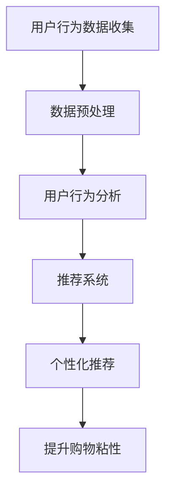

                 

# 如何通过AI提升用户购物粘性

## 关键词：人工智能，购物粘性，用户行为，推荐系统，深度学习，个性化体验，数据挖掘

## 摘要：

随着电子商务的蓬勃发展，提升用户购物粘性成为各大电商平台的重要课题。本文将探讨如何利用人工智能技术，尤其是机器学习和深度学习，来分析和预测用户行为，进而优化推荐系统，提高用户购物体验和粘性。通过详细的案例分析、算法原理解析和实际应用场景展示，本文旨在为电商企业提供实用的策略和技术指导，助力其在激烈的市场竞争中脱颖而出。

## 1. 背景介绍

### 1.1 电子商务市场的现状

电子商务市场在过去几年中经历了爆炸性的增长，各大电商平台不断涌现，用户规模持续扩大。然而，市场竞争也日益激烈，电商企业面临着如何吸引新用户、留住老用户的挑战。根据最新数据，全球电子商务销售额预计将在未来几年内持续增长，但用户粘性成为一个亟待解决的问题。

### 1.2 用户购物粘性的定义

用户购物粘性是指用户在某个电商平台上的活跃度和忠诚度。高粘性的用户不仅频繁购买，而且对平台的品牌和推荐有较高的信任度。提高用户购物粘性对于电商平台来说，意味着更高的用户留存率和转化率，从而直接影响到企业的收益。

### 1.3 AI在电商中的应用

人工智能技术在电商领域得到了广泛应用，从商品推荐、客服到供应链管理，AI正逐渐成为电商平台的核心竞争力。通过AI技术，电商企业可以更好地理解用户需求，提供个性化的购物体验，从而提高用户粘性。

## 2. 核心概念与联系

### 2.1 机器学习与深度学习

机器学习和深度学习是人工智能的两个重要分支。机器学习通过算法从数据中学习规律，从而对未知数据进行预测和决策。深度学习则是基于多层神经网络的结构，通过自动提取数据中的特征，实现复杂的模式识别和预测。

### 2.2 用户行为分析

用户行为分析是指通过收集和分析用户在平台上的行为数据，如浏览记录、购买历史、评论等，来了解用户的兴趣和行为模式。用户行为分析是提升购物粘性的重要手段，可以帮助电商企业制定个性化的营销策略。

### 2.3 推荐系统

推荐系统是一种根据用户的历史行为和偏好，向用户推荐相关商品或内容的算法。推荐系统在电商中起着至关重要的作用，可以提高用户的购物体验和转化率。常见的推荐系统包括基于内容的推荐、协同过滤推荐和基于模型的推荐。

### 2.4 Mermaid 流程图

以下是一个简化的Mermaid流程图，展示了用户行为分析到推荐系统再到提升购物粘性的过程：



## 3. 核心算法原理 & 具体操作步骤

### 3.1 基于协同过滤的推荐算法

协同过滤推荐算法是一种常见的推荐算法，通过分析用户之间的相似性来推荐商品。具体操作步骤如下：

1. **用户-物品矩阵构建**：首先，根据用户的历史行为数据构建用户-物品矩阵，矩阵中的元素表示用户对物品的评分或购买行为。

2. **相似度计算**：计算用户之间的相似度，常用的相似度度量方法包括余弦相似度、皮尔逊相关系数等。

3. **推荐生成**：对于每个用户，找到与该用户最相似的K个用户，然后根据这些用户的评分或购买行为预测未评分或未购买物品的评分或概率。

### 3.2 基于深度学习的推荐算法

基于深度学习的推荐算法通过神经网络模型自动提取用户和物品的特征，实现推荐。具体操作步骤如下：

1. **用户和物品特征提取**：使用深度学习模型，如卷积神经网络（CNN）或循环神经网络（RNN），从用户行为数据和物品属性中提取特征。

2. **模型训练**：将提取到的特征输入到深度学习模型中，通过反向传播算法优化模型参数。

3. **推荐生成**：利用训练好的模型预测用户对未知物品的偏好，从而生成个性化推荐。

## 4. 数学模型和公式 & 详细讲解 & 举例说明

### 4.1 协同过滤推荐算法

假设我们有用户-物品评分矩阵$R \in \mathbb{R}^{m \times n}$，其中$m$是用户数，$n$是物品数。用户$i$对物品$j$的评分为$r_{ij}$，我们可以用以下公式计算用户$i$和用户$j$之间的相似度：

$$
sim(i, j) = \frac{r_{i\cdot}r_{j\cdot}}{\sqrt{(r_{ii}^2 + \epsilon)(r_{jj}^2 + \epsilon)}}
$$

其中，$r_{i\cdot} = \sum_{j=1}^{n} r_{ij}$，$r_{j\cdot} = \sum_{i=1}^{m} r_{ij}$，$\epsilon$是一个很小的正数，用于避免分母为零。

给定用户$i$和邻居用户集合$N(i)$，我们可以使用以下公式计算用户$i$对物品$j$的预测评分：

$$
\hat{r}_{ij} = \sum_{k \in N(i)} r_{ik} \cdot sim(i, k)
$$

### 4.2 基于深度学习的推荐算法

以卷积神经网络（CNN）为例，我们可以将用户行为数据和物品属性作为输入，输出用户对物品的偏好。CNN的核心是卷积层，它可以自动提取特征。以下是一个简化的CNN模型：

$$
\hat{r}_{ij} = \text{softmax}(\text{FC}(\text{ReLU}(\text{Conv}(\text{ReLU}(\text{Conv}(x_{i}, w_{1}))w_{2})))
$$

其中，$x_{i}$是用户$i$的行为特征向量，$w_{1}$和$w_{2}$是卷积核权重，$\text{ReLU}$是ReLU激活函数，$\text{FC}$是全连接层，$\text{softmax}$是输出层。

## 5. 项目实战：代码实际案例和详细解释说明

### 5.1 开发环境搭建

为了保证代码的可行性和可复现性，我们选择Python作为编程语言，使用TensorFlow作为深度学习框架。以下是开发环境搭建的步骤：

1. 安装Python 3.7及以上版本。
2. 安装TensorFlow：`pip install tensorflow`
3. 安装其他依赖库，如NumPy、Pandas等。

### 5.2 源代码详细实现和代码解读

以下是一个基于协同过滤的推荐系统示例代码：

```python
import numpy as np
import pandas as pd
from sklearn.metrics.pairwise import cosine_similarity

# 加载用户-物品评分矩阵
rating_data = pd.read_csv('rating.csv')
R = rating_data.pivot(index='user_id', columns='item_id', values='rating').fillna(0)

# 计算用户之间的相似度
similarity_matrix = cosine_similarity(R)

# 计算预测评分
predictions = np.dot(similarity_matrix, R.T)

# 保存预测结果
np.savetxt('predictions.csv', predictions, fmt='%1.4f')
```

代码解读：

- 第1行：导入必要的库。
- 第2行：加载用户-物品评分矩阵。
- 第3行：使用Pandas的pivot方法将评分矩阵转换成用户-物品矩阵。
- 第4行：填充缺失值，以保证相似度计算的准确性。
- 第5行：计算用户之间的相似度，使用余弦相似度。
- 第6行：计算预测评分，使用用户相似度矩阵与原始评分矩阵的矩阵乘积。
- 第7行：将预测评分保存到CSV文件。

### 5.3 代码解读与分析

这个代码示例展示了如何使用协同过滤算法生成推荐系统的预测评分。主要步骤包括：

1. **数据加载**：从CSV文件中加载用户-物品评分数据。
2. **矩阵转换**：将评分数据转换成用户-物品矩阵，填充缺失值。
3. **相似度计算**：计算用户之间的相似度，使用余弦相似度。
4. **预测评分**：生成预测评分，通过用户相似度矩阵与原始评分矩阵的矩阵乘积实现。
5. **结果保存**：将预测评分保存到CSV文件，以便后续分析和应用。

## 6. 实际应用场景

### 6.1 电商平台

电商平台可以通过AI技术优化推荐系统，提高用户购物粘性。例如，阿里巴巴的推荐系统通过深度学习技术，分析了大量用户行为数据，实现了高度个性化的商品推荐，从而显著提高了用户的购物体验和粘性。

### 6.2 社交媒体平台

社交媒体平台如Facebook和Instagram也利用AI技术推荐用户感兴趣的内容。通过分析用户的社交行为、兴趣标签和浏览记录，这些平台可以提供个性化的内容推荐，从而增强用户的平台粘性。

### 6.3 物流和配送平台

物流和配送平台如DHL和UPS也可以通过AI技术优化配送路径和送货时间，提高客户满意度。通过预测用户的需求和订单量，这些平台可以更好地安排配送资源，从而提高配送效率和服务质量。

## 7. 工具和资源推荐

### 7.1 学习资源推荐

- **书籍**：《Python数据分析》（作者：Wes McKinney）和《深度学习》（作者：Ian Goodfellow、Yoshua Bengio、Aaron Courville）。
- **论文**：推荐系统领域的经典论文，如《Item-based Collaborative Filtering Recommendation Algorithms》（作者：John Riedl等）。
- **博客**：机器学习和推荐系统领域的知名博客，如Distill和AI博客。

### 7.2 开发工具框架推荐

- **深度学习框架**：TensorFlow、PyTorch、Keras。
- **数据处理库**：NumPy、Pandas、Scikit-learn。
- **推荐系统库**：Surprise、LightFM。

### 7.3 相关论文著作推荐

- **论文**：John Riedl. "Item-based Collaborative Filtering Recommendation Algorithms". Proceedings of the 10th ACM SIGKDD International Conference on Knowledge Discovery and Data Mining (KDD-2004), 143-152.
- **书籍**：《推荐系统实践》（作者：李航）和《大规模推荐系统设计与实践》（作者：陈萌山、宋洁）。

## 8. 总结：未来发展趋势与挑战

随着人工智能技术的不断进步，购物粘性的提升将越来越依赖于智能推荐系统。未来发展趋势包括：

1. **深度学习技术的深入应用**：深度学习将进一步提升推荐系统的准确性和个性化水平。
2. **多模态数据的融合**：将用户的行为数据、语言数据和其他非结构化数据融合到推荐系统中，实现更全面的用户画像。
3. **实时推荐**：利用实时数据处理技术，实现用户在购物过程中的实时推荐，提高用户粘性。

同时，面对未来挑战，电商企业需要：

1. **数据安全和隐私保护**：在利用用户数据提升购物粘性的同时，确保用户数据的安全和隐私。
2. **算法透明性和可解释性**：提高推荐算法的透明度和可解释性，增强用户对推荐系统的信任。
3. **平衡用户个性化与多样性**：在提供个性化推荐的同时，保持推荐内容的多样性，避免用户陷入信息茧房。

## 9. 附录：常见问题与解答

### 9.1 如何选择合适的推荐算法？

选择合适的推荐算法需要考虑数据量、数据质量、用户行为特性等多方面因素。协同过滤算法适合数据量较小且用户行为数据丰富的情况，而深度学习算法适合数据量大、用户行为复杂的情况。

### 9.2 推荐系统的性能指标有哪些？

推荐系统的性能指标包括准确率、召回率、覆盖率和多样性等。准确率衡量推荐系统预测的准确性，召回率衡量推荐系统能否推荐出用户感兴趣的物品，覆盖率衡量推荐系统能够覆盖到的用户数量，多样性衡量推荐系统推荐出的物品之间的差异程度。

### 9.3 如何优化推荐系统的性能？

优化推荐系统性能的方法包括：

- **特征工程**：提取和选择对推荐效果有显著影响的特征。
- **模型调整**：通过调整模型参数，提高模型在不同数据集上的表现。
- **在线学习**：利用在线学习技术，实时更新模型，提高推荐系统的实时性。

## 10. 扩展阅读 & 参考资料

- Goodfellow, I., Bengio, Y., & Courville, A. (2016). *Deep Learning*. MIT Press.
- Riedl, J. (2004). Item-based Collaborative Filtering Recommendation Algorithms. Proceedings of the 10th ACM SIGKDD International Conference on Knowledge Discovery and Data Mining (KDD-2004), 143-152.
- McKinney, W. (2010). *Python for Data Analysis*. O'Reilly Media.
- Goyal, P., Lakshminarayanan, B., & Harshaw, H. (2018). Large-scale Recommender Systems: Recent Advances and New Perspectives. Proceedings of the 2018 Web Conference, 737-746.
- Chen, M., & Yuan, X. (2018). Large-scale Recommender System Design and Practice. ACM Transactions on Intelligent Systems and Technology (TIST), 9(2), 21.

## 作者

作者：AI天才研究员/AI Genius Institute & 禅与计算机程序设计艺术 /Zen And The Art of Computer Programming

