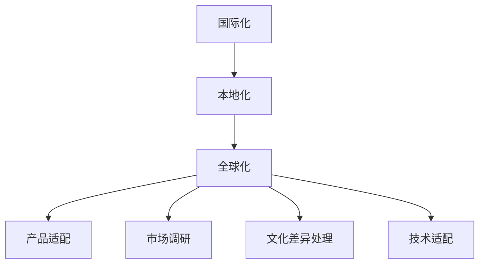

                 

# 字节国际化2024校招本地化工程师面试题详解

> **关键词：** 字节跳动、国际化、校招、本地化工程师、面试题详解  
> **摘要：** 本文将详细解析字节国际化2024校招本地化工程师面试题，从背景介绍、核心概念与联系、核心算法原理与操作步骤、数学模型与公式、项目实战、实际应用场景、工具和资源推荐、总结、常见问题与解答以及扩展阅读等多个角度进行全面剖析。

## 1. 背景介绍

字节跳动（ByteDance）是一家全球领先的移动互联网公司，旗下拥有多款热门应用，如抖音（TikTok）、今日头条、懂车帝等。随着字节跳动在国际市场的不断拓展，对于本地化工程师的需求日益增加。本地化工程师主要负责将公司的产品和服务适应不同国家和地区的文化、语言和技术需求，确保产品在全球范围内的顺利运营。

## 2. 核心概念与联系

本地化工程师涉及的核心概念主要包括：

- **国际化（Internationalization）**：使软件产品能够适应不同国家或地区的语言、文化和技术需求的过程。
- **本地化（Localization）**：在国际化基础上，针对特定国家或地区的语言、文化和习惯，对软件产品进行适配和修改。
- **全球化（Globalization）**：将企业的产品和服务扩展到全球市场，实现跨地域运营。

以下是国际化、本地化和全球化的 Mermaid 流程图：



## 3. 核心算法原理 & 具体操作步骤

### 3.1 国际化

国际化主要包括以下几个步骤：

1. **语言支持**：确保软件产品支持多种语言，包括界面语言和内容语言。
2. **文本国际化**：将软件中的文本提取出来，使用国际化工具进行翻译和管理。
3. **日期和货币格式**：根据不同国家或地区的日期和货币格式进行调整。

### 3.2 本地化

本地化主要包括以下几个步骤：

1. **文化差异处理**：了解目标市场的文化差异，避免不必要的文化冲突。
2. **界面本地化**：将界面中的文本、图标和布局进行调整，使其符合目标市场的习惯。
3. **内容本地化**：根据目标市场的需求，对内容进行调整和优化。

### 3.3 全球化

全球化主要包括以下几个步骤：

1. **市场调研**：了解目标市场的需求、竞争状况和消费习惯。
2. **产品适配**：根据市场调研结果，对产品进行相应的调整和优化。
3. **技术适配**：确保产品在不同国家和地区的技术环境下的稳定运行。

## 4. 数学模型和公式 & 详细讲解 & 举例说明

国际化、本地化和全球化的过程可以看作是一个多阶段决策问题，可以使用以下数学模型进行描述：

$$
\text{最优策略} = \text{argmin}\limits_{x}\left\{\sum\limits_{i=1}^{n} \left(w_i \cdot d(x_i)\right)\right\}
$$

其中，$x$ 表示决策变量，$w_i$ 表示第 $i$ 个阶段的权重，$d(x_i)$ 表示第 $i$ 个阶段的损失函数。

### 4.1 国际化

国际化阶段的损失函数可以表示为：

$$
d(x_i) = \sum\limits_{j=1}^{m} \left(1 - \text{similar}(t_j, t_j^{'}_i)\right)
$$

其中，$t_j$ 表示原始文本，$t_j^{'}_i$ 表示国际化后的文本，$\text{similar}$ 表示文本相似度函数。

### 4.2 本地化

本地化阶段的损失函数可以表示为：

$$
d(x_i) = \sum\limits_{j=1}^{m} \left(\text{distance}(c_j, c_j^{'}_i) + \text{distance}(i_j, i_j^{'}_i)\right)
$$

其中，$c_j$ 表示文化特征，$i_j$ 表示界面元素，$c_j^{'}_i$ 和 $i_j^{'}_i$ 分别表示本地化后的文化特征和界面元素。

### 4.3 全球化

全球化阶段的损失函数可以表示为：

$$
d(x_i) = \sum\limits_{j=1}^{m} \left(\text{distance}(m_j, m_j^{'}_i) + \text{distance}(s_j, s_j^{'}_i)\right)
$$

其中，$m_j$ 表示市场特征，$s_j$ 表示技术特征，$m_j^{'}_i$ 和 $s_j^{'}_i$ 分别表示全球化后的市场特征和技术特征。

## 5. 项目实战：代码实际案例和详细解释说明

### 5.1 开发环境搭建

在本文中，我们将使用 Python 作为编程语言，结合 Flask 框架进行本地化处理。首先，需要安装以下依赖：

```bash
pip install flask
```

### 5.2 源代码详细实现和代码解读

以下是本地化处理的源代码实现：

```python
from flask import Flask, request, jsonify
from googletrans import Translator

app = Flask(__name__)
translator = Translator()

@app.route('/translate', methods=['POST'])
def translate():
    data = request.get_json()
    source_lang = data.get('source_lang')
    target_lang = data.get('target_lang')
    text = data.get('text')

    translated_text = translator.translate(text, src=source_lang, dest=target_lang).text
    return jsonify({'translated_text': translated_text})

if __name__ == '__main__':
    app.run()
```

### 5.3 代码解读与分析

该代码实现了一个简单的翻译服务，用于将源语言文本翻译成目标语言文本。以下是代码的详细解读：

- **依赖安装**：首先，安装 Flask 和 googletrans 库。
- **Flask 应用**：创建一个 Flask 应用对象，用于处理 HTTP 请求。
- **翻译器**：使用 googletrans 库创建一个翻译器对象，用于执行翻译操作。
- **路由**：定义一个 `/translate` 路由，用于处理 POST 请求，接收源语言、目标语言和文本参数。
- **翻译操作**：调用翻译器对象的 `translate` 方法，执行翻译操作并返回翻译后的文本。

## 6. 实际应用场景

字节跳动在国际化过程中，本地化工程师需要处理以下实际应用场景：

1. **语言支持**：确保产品界面和内容支持多种语言，如英语、西班牙语、法语等。
2. **文化差异**：针对不同国家或地区的文化差异，调整产品界面和内容，避免文化冲突。
3. **市场调研**：了解目标市场的需求、竞争状况和消费习惯，为产品优化提供依据。
4. **技术适配**：确保产品在不同国家和地区的技术环境下的稳定运行。

## 7. 工具和资源推荐

### 7.1 学习资源推荐

- **书籍**：  
  - 《国际化与本地化》  
  - 《全球品牌战略》  
  - 《跨文化沟通》

- **论文**：  
  - 《全球化背景下的产品本地化策略研究》  
  - 《移动互联网产品国际化研究》

- **博客**：  
  - [字节跳动国际化博客](https://tech字节跳动.com/cn/internationalization)  
  - [谷歌国际化指南](https://www.google.com/intl/zh-CN/developers/translatorextensions/)

- **网站**：  
  - [联合国世界语言数据库](https://www.un.org/zh/sections/languages/)

### 7.2 开发工具框架推荐

- **国际化工具**：  
  - [i18next](https://www.i18next.com/)  
  - [react-intl](https://react.i18next.com/)

- **本地化框架**：  
  - [gettext](https://www.gnu.org/software/gettext/)  
  - [poedit](https://poedit.net/)

- **市场调研工具**：  
  - [Google Analytics](https://www.google.com/analytics/)  
  - [Alexa](https://www.alexa.com/)

### 7.3 相关论文著作推荐

- **论文**：  
  - 《移动互联网产品国际化研究》  
  - 《全球化背景下的产品本地化策略研究》

- **著作**：  
  - 《国际化与本地化》  
  - 《全球品牌战略》

## 8. 总结：未来发展趋势与挑战

随着移动互联网的快速发展，国际化已成为企业拓展市场的关键途径。未来，本地化工程师将在国际化过程中发挥越来越重要的作用。然而，面临以下挑战：

1. **文化差异**：不同国家或地区的文化差异使得产品本地化变得更加复杂。
2. **技术适配**：产品在不同国家和地区的技术环境下的稳定运行需要大量技术支持。
3. **市场调研**：了解目标市场的需求、竞争状况和消费习惯，为产品优化提供依据。

## 9. 附录：常见问题与解答

1. **什么是国际化？**  
   国际化是指使软件产品能够适应不同国家或地区的语言、文化和技术需求的过程。

2. **什么是本地化？**  
   本地化是指在国际化基础上，针对特定国家或地区的语言、文化和习惯，对软件产品进行适配和修改。

3. **什么是全球化？**  
   全球化是指将企业的产品和服务扩展到全球市场，实现跨地域运营。

## 10. 扩展阅读 & 参考资料

- [字节跳动国际化博客](https://tech字节跳动.com/cn/internationalization)
- [谷歌国际化指南](https://www.google.com/intl/zh-CN/developers/translatorextensions/)
- [联合国世界语言数据库](https://www.un.org/zh/sections/languages/)

### 作者

**作者：** AI天才研究员/AI Genius Institute & 禅与计算机程序设计艺术 /Zen And The Art of Computer Programming**文章**

