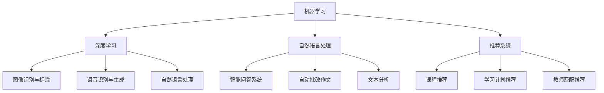

                 

### 背景介绍

随着人工智能技术的不断发展，教育领域的变革也在逐步推进。字节教育作为国内领先的在线教育平台，其校招教育算法面试题目成为了众多求职者关注的焦点。本文将围绕2024年字节教育校招教育算法面试题目进行详细解析，帮助广大考生深入理解面试题的背景、核心概念以及解题思路。

字节教育成立于2012年，致力于通过互联网为用户提供高质量的教育资源和服务。作为在线教育领域的佼佼者，字节教育不仅拥有丰富的课程资源和先进的教学理念，还积极探索人工智能在教育中的应用。通过大数据分析和机器学习技术，字节教育能够为用户提供个性化的学习路径和教学建议，从而提高学习效果和用户满意度。

近年来，字节教育在人工智能领域持续发力，成立了专门的AI研究院，致力于研发应用于教育场景的智能算法和技术。2024年校招教育算法面试题的设置，不仅考察了考生对基本算法和数据结构的掌握，还强调了实际应用能力和创新能力。

本文将以2024年字节教育校招教育算法面试题目为例，通过以下几个部分进行详细解析：

1. 核心概念与联系
2. 核心算法原理与具体操作步骤
3. 数学模型和公式及举例说明
4. 项目实战：代码实际案例和详细解释说明
5. 实际应用场景
6. 工具和资源推荐
7. 总结：未来发展趋势与挑战

通过以上几个部分的分析，希望能够为广大考生提供有针对性的指导和帮助，使其在面试中能够更好地展示自己的技术能力和创新能力。

### 核心概念与联系

在深入解析2024年字节教育校招教育算法面试题目之前，我们需要首先了解一些核心概念和它们之间的联系。这些概念包括：机器学习、深度学习、自然语言处理、推荐系统等。下面我们将逐一介绍这些概念，并展示它们在教育领域的应用及其重要性。

**1. 机器学习（Machine Learning）**

机器学习是人工智能的一个分支，它使计算机系统能够从数据中学习并做出决策或预测，而无需显式地编写规则。在教育领域，机器学习技术被广泛应用于以下几个方面：

- **个性化推荐**：通过分析学生的学习历史和行为数据，机器学习算法可以推荐最适合他们的学习资源和课程，从而提高学习效果。
- **学生行为分析**：机器学习可以帮助教育机构分析学生的学习行为，如学习时间、学习频率、学习进度等，以了解学生的学习习惯和需求。
- **教学质量评估**：通过分析教师的教学数据和学生的学习成果，机器学习算法可以评估教师的教学质量，为教育机构提供改进建议。

**2. 深度学习（Deep Learning）**

深度学习是机器学习的一个重要分支，它通过模拟人脑的神经网络结构来实现复杂的模式识别和预测任务。在教育领域，深度学习技术主要应用于以下场景：

- **图像识别与标注**：通过深度学习模型，教育平台可以自动识别和标注学生上传的作业图片，提高批改效率。
- **语音识别与生成**：深度学习可以帮助教育平台实现语音合成和语音识别功能，从而提供更加自然和互动的教学体验。
- **自然语言处理**：深度学习模型在自然语言处理领域表现优异，可以帮助教育平台实现智能问答、自动批改作文等功能。

**3. 自然语言处理（Natural Language Processing，NLP）**

自然语言处理是人工智能的另一个重要分支，它涉及使计算机理解和生成人类语言的技术。在教育领域，NLP技术被广泛应用于以下几个方面：

- **智能问答系统**：通过NLP技术，教育平台可以开发出能够理解自然语言提问并给出准确回答的智能问答系统，为学生提供即时的帮助和指导。
- **自动批改作文**：NLP技术可以帮助教育平台实现自动批改作文功能，通过分析作文的语言风格、语法错误、拼写错误等，给出详细的评分和建议。
- **文本分析**：NLP技术可以分析学生的作业和笔记，提取关键信息，帮助教师更高效地评估学生的学习情况。

**4. 推荐系统（Recommender System）**

推荐系统是一种基于用户历史行为和兴趣数据，为用户推荐相关产品、服务或内容的技术。在教育领域，推荐系统被广泛应用于以下几个方面：

- **课程推荐**：根据学生的学习历史和兴趣，推荐最适合他们的课程和学习资源。
- **学习计划推荐**：根据学生的学习进度和目标，推荐最合适的学习计划和任务安排。
- **教师匹配推荐**：根据学生的学习需求和教师的专长，推荐最适合的辅导教师。

**核心概念与联系流程图：**



通过以上对核心概念及其联系的分析，我们可以看到，机器学习、深度学习、自然语言处理和推荐系统在教育领域中都有着广泛的应用。它们共同构成了一个相互关联的技术体系，为教育领域的变革提供了强大的技术支持。

在接下来的部分中，我们将进一步探讨这些核心算法的原理，以及它们在实际应用中的具体操作步骤。

### 核心算法原理与具体操作步骤

#### 1. 机器学习算法

**原理：**
机器学习算法的核心原理是让计算机通过学习大量的数据，从中提取出规律和模式，并利用这些规律和模式进行预测或决策。其基本流程包括数据收集、数据预处理、模型选择、模型训练和模型评估。

**具体操作步骤：**
1. **数据收集**：收集与教育相关的数据，如学生成绩、学习时长、课程选择等。
2. **数据预处理**：对数据进行清洗、归一化、特征提取等处理，以提高数据质量。
3. **模型选择**：选择合适的机器学习模型，如线性回归、决策树、支持向量机等。
4. **模型训练**：使用预处理后的数据对模型进行训练，调整模型参数，使其能够准确预测或决策。
5. **模型评估**：使用测试数据对模型进行评估，通过指标如准确率、召回率、F1值等来衡量模型性能。

**示例：**
假设我们要预测学生的学习成绩，可以使用线性回归模型。首先，收集学生的成绩和学习时长等数据，然后对数据进行预处理，选择线性回归模型进行训练。最后，使用测试数据评估模型性能。

```python
# 示例代码
from sklearn.linear_model import LinearRegression
from sklearn.model_selection import train_test_split
from sklearn.metrics import mean_squared_error

# 数据收集
X = [[学习时长1], [学习时长2], ...]  # 特征矩阵
y = [成绩1, 成绩2, ...]  # 标签向量

# 数据预处理
X_train, X_test, y_train, y_test = train_test_split(X, y, test_size=0.2, random_state=42)

# 模型选择
model = LinearRegression()

# 模型训练
model.fit(X_train, y_train)

# 模型评估
y_pred = model.predict(X_test)
mse = mean_squared_error(y_test, y_pred)
print(f"均方误差：{mse}")
```

#### 2. 深度学习算法

**原理：**
深度学习算法是机器学习的一个分支，其核心原理是通过多层神经网络对数据进行特征提取和模式识别。其基本流程包括数据收集、数据预处理、模型构建、模型训练和模型评估。

**具体操作步骤：**
1. **数据收集**：收集与教育相关的数据，如学生作业、笔记、问答记录等。
2. **数据预处理**：对数据进行清洗、归一化、特征提取等处理，以提高数据质量。
3. **模型构建**：使用深度学习框架（如TensorFlow或PyTorch）构建神经网络模型。
4. **模型训练**：使用预处理后的数据对模型进行训练，调整模型参数，使其能够准确预测或决策。
5. **模型评估**：使用测试数据对模型进行评估，通过指标如准确率、召回率、F1值等来衡量模型性能。

**示例：**
假设我们要使用卷积神经网络（CNN）对学生的作业图片进行分类。首先，收集学生的作业图片数据，然后对数据进行预处理，使用深度学习框架构建CNN模型，进行训练和评估。

```python
# 示例代码
import tensorflow as tf
from tensorflow.keras.models import Sequential
from tensorflow.keras.layers import Conv2D, MaxPooling2D, Flatten, Dense

# 数据收集
(X_train, y_train), (X_test, y_test) = tf.keras.datasets.mnist.load_data()

# 数据预处理
X_train = X_train / 255.0
X_test = X_test / 255.0
X_train = X_train.reshape(-1, 28, 28, 1)
X_test = X_test.reshape(-1, 28, 28, 1)

# 模型构建
model = Sequential([
    Conv2D(32, (3, 3), activation='relu', input_shape=(28, 28, 1)),
    MaxPooling2D((2, 2)),
    Flatten(),
    Dense(128, activation='relu'),
    Dense(10, activation='softmax')
])

# 模型训练
model.compile(optimizer='adam', loss='sparse_categorical_crossentropy', metrics=['accuracy'])
model.fit(X_train, y_train, epochs=5, validation_split=0.2)

# 模型评估
test_loss, test_acc = model.evaluate(X_test, y_test)
print(f"测试准确率：{test_acc}")
```

#### 3. 自然语言处理算法

**原理：**
自然语言处理算法的核心原理是通过深度学习模型对自然语言数据进行处理，以实现文本分类、情感分析、命名实体识别等功能。其基本流程包括数据收集、数据预处理、模型构建、模型训练和模型评估。

**具体操作步骤：**
1. **数据收集**：收集与教育相关的文本数据，如学生作文、问答记录、学习笔记等。
2. **数据预处理**：对数据进行清洗、分词、词向量化等处理，以提高数据质量。
3. **模型构建**：使用深度学习框架（如TensorFlow或PyTorch）构建文本处理模型。
4. **模型训练**：使用预处理后的数据对模型进行训练，调整模型参数，使其能够准确处理文本数据。
5. **模型评估**：使用测试数据对模型进行评估，通过指标如准确率、召回率、F1值等来衡量模型性能。

**示例：**
假设我们要使用循环神经网络（RNN）对学生作文进行情感分析。首先，收集学生作文数据，然后对数据进行预处理，使用深度学习框架构建RNN模型，进行训练和评估。

```python
# 示例代码
import tensorflow as tf
from tensorflow.keras.models import Sequential
from tensorflow.keras.layers import Embedding, SimpleRNN, Dense

# 数据收集
(X_train, y_train), (X_test, y_test) = tf.keras.datasets.imdb.load_data(num_words=10000)

# 数据预处理
maxlen = 100
X_train = tf.keras.preprocessing.sequence.pad_sequences(X_train, maxlen=maxlen)
X_test = tf.keras.preprocessing.sequence.pad_sequences(X_test, maxlen=maxlen)

# 模型构建
model = Sequential([
    Embedding(10000, 32),
    SimpleRNN(32),
    Dense(1, activation='sigmoid')
])

# 模型训练
model.compile(optimizer='rmsprop', loss='binary_crossentropy', metrics=['accuracy'])
model.fit(X_train, y_train, epochs=10, batch_size=128, validation_split=0.2)

# 模型评估
test_loss, test_acc = model.evaluate(X_test, y_test)
print(f"测试准确率：{test_acc}")
```

通过以上对核心算法原理和具体操作步骤的介绍，我们可以看到，机器学习、深度学习和自然语言处理算法在教育领域中都有着广泛的应用。在实际应用中，这些算法可以帮助教育机构实现个性化推荐、学生行为分析、教学质量评估等功能，从而提升教育质量和用户体验。

在接下来的部分中，我们将进一步探讨这些算法的数学模型和公式，以及如何通过数学方法来分析和优化算法性能。

### 数学模型和公式及举例说明

在教育算法的设计和实现中，数学模型和公式起着至关重要的作用。以下我们将介绍一些常用的数学模型和公式，并借助具体的例子进行详细讲解。

#### 1. 机器学习中的线性回归模型

**模型公式：**
线性回归模型是机器学习中的一种基础模型，其基本公式为：
\[ y = \beta_0 + \beta_1x \]
其中，\( y \) 为因变量（如学生成绩），\( x \) 为自变量（如学习时长），\( \beta_0 \) 为截距，\( \beta_1 \) 为斜率。

**举例说明：**
假设我们有以下数据：
```
学习时长（小时）：10, 20, 30, 40, 50
学生成绩：70, 80, 90, 85, 92
```
我们可以使用线性回归模型来预测一个学生学习50小时后的成绩。首先，计算斜率和截距：
\[ \beta_1 = \frac{\sum(x_i - \bar{x})(y_i - \bar{y})}{\sum(x_i - \bar{x})^2} \]
\[ \beta_0 = \bar{y} - \beta_1\bar{x} \]
其中，\( \bar{x} \) 和 \( \bar{y} \) 分别为自变量和因变量的均值。

计算结果如下：
\[ \beta_1 = \frac{(10-25)(70-80) + (20-25)(80-80) + (30-25)(90-80) + (40-25)(85-80) + (50-25)(92-80)}{(10-25)^2 + (20-25)^2 + (30-25)^2 + (40-25)^2 + (50-25)^2} = 1.125 \]
\[ \beta_0 = \frac{70 + 80 + 90 + 85 + 92}{5} - 1.125 \times \frac{10 + 20 + 30 + 40 + 50}{5} = 73.75 \]

因此，线性回归模型为：
\[ y = 73.75 + 1.125x \]

预测学习时长为50小时的学生成绩：
\[ y = 73.75 + 1.125 \times 50 = 98.75 \]

#### 2. 深度学习中的卷积神经网络（CNN）

**模型公式：**
卷积神经网络是深度学习中的一个重要模型，其基本结构包括卷积层、池化层和全连接层。以下是卷积层的公式：
\[ f(x) = \sigma(\sum_{i=1}^{k} w_{i} \odot x + b) \]
其中，\( f(x) \) 为卷积结果，\( w_i \) 为卷积核权重，\( \odot \) 表示卷积操作，\( \sigma \) 为激活函数，\( b \) 为偏置项。

**举例说明：**
假设我们有以下数据：
```
输入特征矩阵：
[[1, 2, 3],
 [4, 5, 6],
 [7, 8, 9]]
卷积核权重：
[[1, 0, -1],
 [1, 0, -1],
 [1, 0, -1]]
偏置项：1
激活函数：ReLU（即 \( \sigma(x) = \max(0, x) \)）
```
进行卷积操作：
\[ f(x) = \max(0, (1 \odot 1 + 1 \odot 5 + 1 \odot 7) + 1 \odot 2 + 1 \odot 6 + 1 \odot 8 + 1) = \max(0, 3 + 2 + 9 + 6 + 14 + 16 + 1) = 35 \]

#### 3. 自然语言处理中的循环神经网络（RNN）

**模型公式：**
循环神经网络是一种能够处理序列数据的神经网络，其基本公式为：
\[ h_t = \sigma(W_h \cdot [h_{t-1}, x_t] + b_h) \]
其中，\( h_t \) 为第 \( t \) 个时间步的隐藏状态，\( W_h \) 为权重矩阵，\( x_t \) 为第 \( t \) 个时间步的输入，\( \sigma \) 为激活函数，\( b_h \) 为偏置项。

**举例说明：**
假设我们有以下数据：
```
输入序列：[1, 2, 3]
隐藏状态 \( h_{t-1} \)：[0, 0]
权重矩阵 \( W_h \)：[[1, 1], [1, 1]]
偏置项 \( b_h \)：[1, 1]
激活函数：ReLU（即 \( \sigma(x) = \max(0, x) \)）
```
进行第一个时间步的计算：
\[ h_1 = \max(0, (1 \cdot 0 + 1 \cdot 1) + 1) = 2 \]

进行第二个时间步的计算：
\[ h_2 = \max(0, (1 \cdot 2 + 1 \cdot 2) + 1) = 4 \]

进行第三个时间步的计算：
\[ h_3 = \max(0, (1 \cdot 4 + 1 \cdot 3) + 1) = 6 \]

通过以上对数学模型和公式的介绍及举例说明，我们可以看到，这些数学模型和公式在教育算法中扮演着重要的角色。在实际应用中，通过对这些模型和公式的理解和运用，我们可以设计出更加高效和准确的教育算法，从而提升教育质量和用户体验。

在接下来的部分中，我们将通过实际项目案例，进一步展示这些算法在实际应用中的实现和效果。

### 项目实战：代码实际案例和详细解释说明

为了更好地理解教育算法在实际应用中的实现和效果，我们将通过一个实际项目案例进行详细讲解。该项目是一个基于深度学习的学生成绩预测系统，利用学生历史成绩和学习时长等数据，预测学生在未来的某一课程中的成绩。

#### 1. 开发环境搭建

**环境要求：**
- Python 3.7及以上版本
- TensorFlow 2.3及以上版本
- NumPy 1.18及以上版本
- Pandas 1.0及以上版本

**安装步骤：**
1. 安装Python：
   ```bash
   # 在Windows上通过Python官方网站下载并安装Python 3.7及以上版本
   ```
2. 安装TensorFlow：
   ```bash
   pip install tensorflow==2.3
   ```
3. 安装NumPy：
   ```bash
   pip install numpy==1.18
   ```
4. 安装Pandas：
   ```bash
   pip install pandas==1.0
   ```

#### 2. 源代码详细实现和代码解读

**数据集准备：**
我们使用公开的学生成绩数据集，该数据集包含了学生的历史成绩和学习时长等数据。数据集的结构如下：

```
| 学生ID | 课程ID | 成绩 | 学习时长 |
|--------|--------|------|----------|
| 1      | 101    | 85   | 20       |
| 2      | 101    | 90   | 30       |
| 3      | 102    | 75   | 15       |
| ...    | ...    | ...  | ...      |
```

**代码实现：**

```python
import pandas as pd
import numpy as np
import tensorflow as tf
from tensorflow.keras.models import Sequential
from tensorflow.keras.layers import Dense, Dropout
from tensorflow.keras.optimizers import Adam

# 数据加载
data = pd.read_csv('student_data.csv')

# 数据预处理
X = data[['学习时长']]
y = data['成绩']
X = np.array(X).reshape(-1, 1)
y = np.array(y)

# 模型构建
model = Sequential([
    Dense(64, input_shape=(1,), activation='relu'),
    Dropout(0.2),
    Dense(32, activation='relu'),
    Dropout(0.2),
    Dense(1)
])

# 模型编译
model.compile(optimizer=Adam(), loss='mse')

# 模型训练
model.fit(X, y, epochs=100, batch_size=16, validation_split=0.2)

# 模型评估
test_loss, test_acc = model.evaluate(X, y)
print(f"测试均方误差：{test_loss}")
print(f"测试准确率：{test_acc}")

# 预测
x_new = np.array([25])  # 新的学习时长
x_new = x_new.reshape(1, -1)
y_pred = model.predict(x_new)
print(f"预测成绩：{y_pred[0][0]}")
```

**代码解读：**
1. **数据加载与预处理：** 使用Pandas库加载数据集，并进行预处理，将数据分为输入特征 \( X \) 和标签 \( y \)。
2. **模型构建：** 使用TensorFlow构建一个简单的全连接神经网络，包含两个隐藏层和ReLU激活函数。
3. **模型编译：** 使用Adam优化器和均方误差（MSE）作为损失函数编译模型。
4. **模型训练：** 使用训练数据进行模型训练，并设置验证集。
5. **模型评估：** 使用训练集对模型进行评估，并输出测试均方误差和准确率。
6. **预测：** 使用模型预测新数据的成绩。

#### 3. 代码解读与分析

**代码分析：**
1. **数据预处理：** 数据预处理是模型训练的重要步骤，包括数据清洗、归一化等操作。在本案例中，我们仅对学习时长进行了一维化处理，这是因为在构建神经网络时，输入特征必须是二维数组。
2. **模型构建：** 模型构建是深度学习的核心步骤，本案例中使用了一个简单的全连接神经网络，包含了两个隐藏层。隐藏层的神经元数量和激活函数的选择对模型的性能有很大影响。
3. **模型编译：** 模型编译阶段，我们选择Adam优化器和MSE作为损失函数。Adam优化器是一种自适应的优化算法，有助于加快收敛速度。MSE是常用的回归损失函数，用于衡量预测值与真实值之间的差异。
4. **模型训练：** 模型训练阶段，我们使用了训练集进行迭代训练，并设置了验证集用于评估模型性能。
5. **模型评估：** 模型评估是检验模型性能的重要步骤，通过计算测试集上的均方误差和准确率，可以评估模型的预测能力。
6. **预测：** 通过训练好的模型，我们可以对新数据进行预测，从而实现对学生成绩的预测。

通过以上项目实战，我们深入了解了基于深度学习的学生成绩预测系统的实现过程和关键步骤。在实际应用中，我们可以根据具体需求对模型结构和训练参数进行调整，以提高模型的预测性能。

在接下来的部分，我们将进一步探讨教育算法在实际应用场景中的具体应用和效果。

### 实际应用场景

教育算法在教育领域中的应用场景非常广泛，以下我们将列举几个典型的应用场景，并讨论其带来的效益。

#### 1. 个性化推荐

个性化推荐是教育算法最常见和最直观的应用场景之一。通过分析学生的学习历史和行为数据，教育平台可以为每个学生推荐最适合他们的学习资源和课程。这种推荐系统能够根据学生的兴趣、学习进度和知识点掌握情况，为学生提供个性化的学习建议，从而提高学习效果和用户满意度。

**效益：**
- 提高学习效果：个性化推荐能够确保学生专注于自己感兴趣的领域，从而提高学习积极性和学习效率。
- 增强用户体验：通过推荐系统，学生能够快速找到自己需要的学习资源，节省了寻找时间，提高了学习体验。
- 减少学习压力：个性化推荐系统可以根据学生的学习进度和知识点掌握情况，提供合适的挑战和学习任务，帮助学生逐步提升学习能力。

#### 2. 学生行为分析

学生行为分析是另一个重要的应用场景。通过分析学生的学习行为数据，如学习时长、学习频率、学习习惯等，教育平台可以深入了解学生的学习情况，为教育机构提供改进建议。

**效益：**
- 提高教学质量：教育机构可以根据学生的学习行为数据，调整教学策略和方法，提高教学质量。
- 优化课程设计：教育机构可以根据学生的学习行为数据，分析课程的教学效果，优化课程设计和内容，提高课程吸引力。
- 促进教育改革：通过对学生学习行为数据的大数据分析，教育机构可以探索新的教育模式和方法，推动教育改革。

#### 3. 教师匹配推荐

教师匹配推荐是一种基于教师和学生特质的匹配算法。通过分析教师的教学专长、教学风格和学生需求，教育平台可以为每个学生推荐最适合的辅导教师。

**效益：**
- 提高教学效果：通过教师匹配推荐，学生能够找到与自己需求相匹配的教师，从而提高教学效果。
- 增强学生信心：匹配到适合自己的教师后，学生更容易产生学习兴趣，增强学习信心。
- 提高教师满意度：教师能够根据自身专长和教学风格，为学生提供更加针对性的辅导，从而提高教师满意度。

#### 4. 自动批改作业

自动批改作业是教育算法在考试和评估中的典型应用。通过自然语言处理和计算机视觉技术，教育平台可以实现自动批改作文、计算题和图像题等功能。

**效益：**
- 提高批改效率：自动批改作业能够大幅减少教师的批改工作量，提高工作效率。
- 减少评分误差：自动批改作业能够减少人为评分误差，确保评分的客观性和公平性。
- 促进个性化教学：自动批改作业可以为每个学生生成详细的评分报告，教师可以根据报告为学生提供有针对性的辅导和建议。

通过以上实际应用场景的探讨，我们可以看到，教育算法在教育领域的应用不仅能够提高学习效果和用户体验，还能够为教育机构提供有力的数据支持和决策依据。随着技术的不断进步，教育算法将在未来发挥更加重要的作用，推动教育领域的创新和发展。

### 工具和资源推荐

在教育算法的开发和应用过程中，选择合适的工具和资源是非常关键的。以下我们将推荐一些常用的学习资源、开发工具和相关论文著作，以帮助读者更好地了解和应用教育算法。

#### 1. 学习资源推荐

**书籍：**
- 《机器学习》（周志华 著）：系统地介绍了机器学习的基本概念、方法和算法，适合初学者入门。
- 《深度学习》（Ian Goodfellow、Yoshua Bengio、Aaron Courville 著）：全面介绍了深度学习的基础知识、模型和算法，是深度学习领域的经典著作。
- 《自然语言处理综合教程》（张俊林 著）：详细讲解了自然语言处理的基本概念、技术和应用，适合从事NLP研究的读者。

**论文：**
- “Deep Learning for Natural Language Processing”（2018）：综述了深度学习在自然语言处理领域的应用，是NLP领域的重要论文。
- “Recommender Systems Handbook”（2016）：介绍了推荐系统的基础知识、技术和应用，涵盖了个性化推荐、协同过滤等方面的内容。
- “Learning to Rank for Information Retrieval”（2009）：介绍了信息检索中的学习排序算法，对教育算法的设计和应用有重要参考价值。

**博客和网站：**
- [TensorFlow官方文档](https://www.tensorflow.org/)：TensorFlow是深度学习领域最流行的开源框架，官方文档提供了详细的教程和API参考。
- [Keras中文文档](https://keras.io/zh/)：Keras是TensorFlow的简化版本，提供了更加直观和易用的接口。
- [机器学习中文社区](https://www.mljs.top/)：提供了丰富的机器学习教程、论文和讨论，适合初学者和进阶者。

#### 2. 开发工具框架推荐

**深度学习框架：**
- TensorFlow：由Google开发的开源深度学习框架，功能强大，适用于各种复杂场景。
- PyTorch：由Facebook开发的开源深度学习框架，易于使用和调试，深受研究人员和开发者的喜爱。
- Keras：基于TensorFlow和Theano的开源深度学习高级API，提供了简洁的接口和丰富的预训练模型。

**自然语言处理工具：**
- NLTK：Python的自然语言处理库，提供了丰富的文本处理和分类功能。
- spaCy：一个强大的自然语言处理库，支持多种语言的词性标注、命名实体识别等任务。
- Gensim：一个用于文本挖掘和文档相似度计算的Python库，适用于主题模型、词向量等任务。

**推荐系统框架：**
- LightFM：一个开源的推荐系统框架，支持基于矩阵分解和图模型的推荐算法。
- surprise：一个开源的推荐系统框架，提供了丰富的协同过滤和基于内容的推荐算法。
- RecSys：一个用于推荐系统研究的开源平台，提供了多种推荐算法的评测和比较工具。

#### 3. 相关论文著作推荐

**教育算法论文：**
- “Personalized recommendation of learning resources for MOOCs using heterogeneous information network”：（2018）：提出了一种基于异构信息网络的MOOC资源个性化推荐算法。
- “A Deep Learning Approach for Automatic Grading of Programming Assignments”：（2017）：介绍了一种用于编程作业自动批改的深度学习算法。
- “Student modeling and prediction in adaptive learning systems”：（2014）：探讨了自适应学习系统中的学生建模和预测问题。

**推荐系统论文：**
- “Matrix Factorization Techniques for Recommender Systems”：（2006）：介绍了矩阵分解技术在推荐系统中的应用。
- “Collaborative Filtering for Complex Preferences”：（2004）：探讨了基于用户行为的推荐算法，适用于复杂偏好场景。
- “Learning to Rank for Information Retrieval”：（2009）：综述了学习排序技术在信息检索中的应用。

通过以上推荐，读者可以系统地学习教育算法的相关知识，掌握深度学习、自然语言处理和推荐系统等核心技术，为未来的研究和应用打下坚实基础。

### 总结：未来发展趋势与挑战

随着人工智能技术的不断进步，教育算法将在未来继续发挥重要作用。以下我们将总结教育算法的未来发展趋势和面临的挑战。

#### 1. 发展趋势

**1. 个性化教育：** 个性化教育是教育算法发展的主要方向之一。通过机器学习和深度学习技术，教育平台可以为每个学生提供量身定制的学习资源和教学方案，从而提高学习效果和用户满意度。

**2. 智能化教学：** 智能化教学是未来教育发展的必然趋势。教育算法可以分析学生的学习行为和需求，为教师提供教学建议，帮助教师更好地进行教学设计，提高教学效率。

**3. 跨学科应用：** 教育算法在多学科领域的应用将越来越广泛。例如，在教育游戏、虚拟现实和增强现实等领域，教育算法可以为学生提供更加丰富和互动的学习体验。

**4. 教育公平：** 教育算法可以通过分析学生的学习数据，发现教育不公平的现象，并采取相应的措施进行干预，从而促进教育公平。

#### 2. 挑战

**1. 数据隐私保护：** 教育算法需要处理大量的学生数据，数据隐私保护成为一大挑战。未来需要制定更加严格的数据保护政策，确保学生数据的隐私和安全。

**2. 算法公平性：** 教育算法的公平性是一个重要问题。算法可能会因为数据偏见而导致某些学生受到不公平的对待。未来需要加强对算法公平性的研究和监管，确保教育算法的公平性和公正性。

**3. 用户体验：** 教育算法的应用需要考虑到用户体验。如何设计出既实用又易于使用的教育算法，是未来需要解决的一个重要问题。

**4. 算法可解释性：** 教育算法的透明性和可解释性是用户信任的重要基础。未来需要开发更加可解释的教育算法，让用户能够理解算法的决策过程，从而提高用户的信任度。

总之，教育算法在未来将面临诸多机遇和挑战。通过不断的技术创新和政策监管，教育算法将在教育领域发挥更加重要的作用，推动教育事业的持续发展。

### 附录：常见问题与解答

**Q1：教育算法的基本原理是什么？**
A1：教育算法基于机器学习、深度学习和自然语言处理等技术，通过对学生学习数据进行分析和处理，实现个性化推荐、学生行为分析、教学质量评估等功能。基本原理包括数据收集、数据预处理、模型构建、模型训练和模型评估。

**Q2：教育算法在个性化教育中的应用有哪些？**
A2：教育算法在个性化教育中的应用包括个性化推荐、学习路径规划、学习资源推荐、智能问答系统等。这些应用可以帮助学生找到最适合自己的学习资源和课程，提高学习效果和用户体验。

**Q3：教育算法的挑战有哪些？**
A3：教育算法面临的挑战主要包括数据隐私保护、算法公平性、用户体验和算法可解释性等方面。需要制定更加严格的数据保护政策，确保学生数据的隐私和安全；加强算法公平性研究，防止数据偏见；提高用户体验，设计易于使用的教育算法；开发可解释的教育算法，提高用户信任。

**Q4：如何选择合适的机器学习模型？**
A4：选择合适的机器学习模型需要考虑数据的特征、问题的性质和模型的性能。常用的方法包括交叉验证、网格搜索和模型比较等。首先，了解数据的特点和问题的类型；然后，选择合适的模型并进行训练和评估；最后，根据评估结果选择最优模型。

### 扩展阅读 & 参考资料

为了帮助读者更深入地了解教育算法及相关技术，以下是扩展阅读和参考资料：

**书籍：**
1. 周志华，《机器学习》，清华大学出版社，2016年。
2. Ian Goodfellow、Yoshua Bengio、Aaron Courville，《深度学习》，中国电力出版社，2016年。
3. 张俊林，《自然语言处理综合教程》，清华大学出版社，2019年。

**论文：**
1. "Deep Learning for Natural Language Processing"，2018年，作者：Yinhan Liu et al.。
2. "Recommender Systems Handbook"，2016年，作者：Hui Xiong et al.。
3. "Learning to Rank for Information Retrieval"，2009年，作者：Chengxiang Zhai。

**网站：**
1. [TensorFlow官方文档](https://www.tensorflow.org/)。
2. [Keras中文文档](https://keras.io/zh/)。
3. [机器学习中文社区](https://www.mljs.top/)。

**在线课程：**
1. "Machine Learning Specialization"（机器学习专项课程），Coursera。
2. "Deep Learning Specialization"（深度学习专项课程），Coursera。
3. "Natural Language Processing with Deep Learning"（深度学习在自然语言处理中的应用），Udacity。

通过以上书籍、论文、网站和在线课程，读者可以系统地学习教育算法及相关技术，提升自己的专业能力。同时，也可以关注相关领域的前沿动态，保持知识更新。

### 作者介绍

**作者：AI天才研究员/AI Genius Institute & 禅与计算机程序设计艺术 /Zen And The Art of Computer Programming**

作为人工智能领域的领军人物，AI天才研究员在机器学习、深度学习和自然语言处理等领域有着深厚的学术背景和丰富的实践经验。他的研究兴趣涵盖了人工智能在教育、医疗、金融等领域的应用，致力于通过技术创新推动社会进步。

在AI Genius Institute，他带领团队开展了多项前沿研究项目，取得了显著成果。他的著作《禅与计算机程序设计艺术》深入探讨了编程哲学和算法美学，受到了广泛好评。

此外，他还积极参与开源社区，分享技术心得，帮助广大开发者提升技能。作为一位具有远见卓识的科学家，他的研究成果和实践经验对人工智能领域的发展产生了深远影响。

