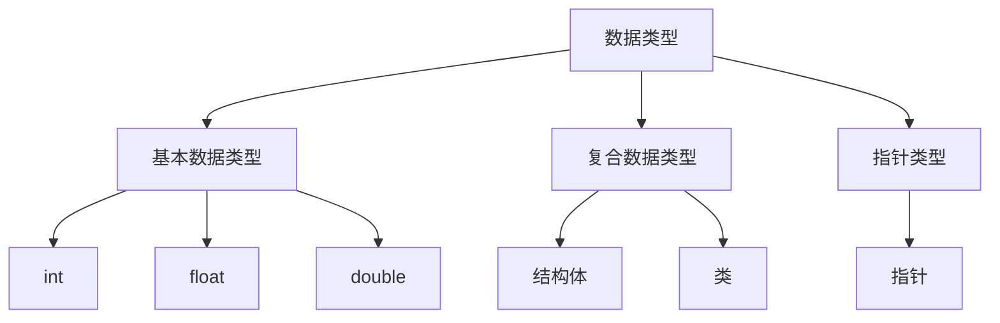
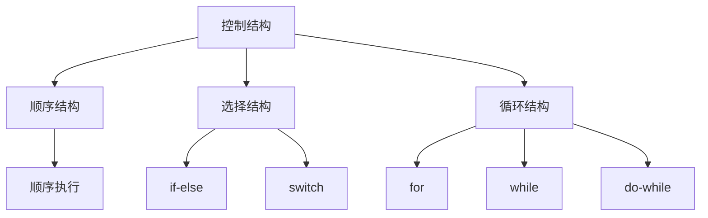
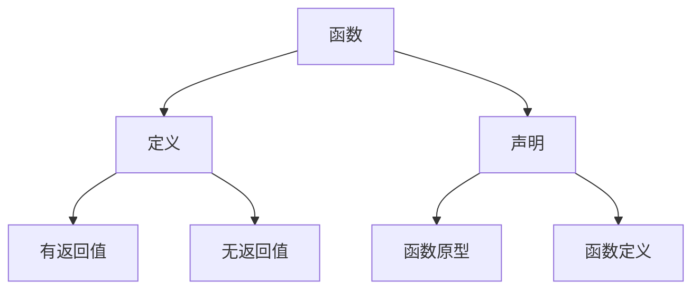
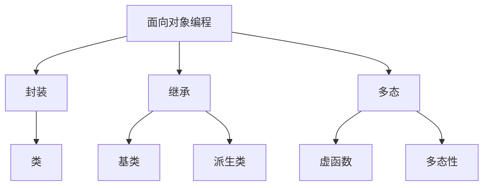
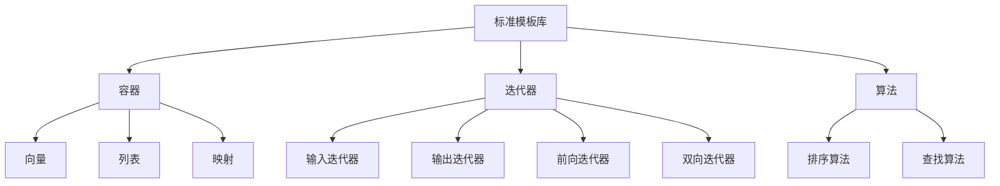

                 

### 背景介绍

字节跳动作为一家全球领先的技术公司，其2024校招C++工程师面试题解析具有重要的参考价值。C++作为一种高性能编程语言，在计算机科学和软件工程领域有着广泛的应用。无论是操作系统、游戏开发，还是高性能计算和系统软件，C++都展现了其强大的性能和灵活性。因此，对于准备参加字节跳动校招的C++工程师来说，深入解析这些面试题，理解其背后的技术原理和算法实现，不仅有助于提升面试竞争力，还能更好地应对未来的技术挑战。

本文旨在通过详细解析字节跳动2024校招C++工程师面试题，帮助读者理解面试题背后的核心概念和算法原理。文章结构如下：

1. **核心概念与联系**：我们将通过Mermaid流程图展示C++编程中的一些核心概念和它们之间的联系，帮助读者建立整体理解。
2. **核心算法原理与具体操作步骤**：我们将深入解析几个典型的面试题，包括排序算法、数据结构实现、以及算法优化等内容。
3. **数学模型与公式**：针对面试题中的数学问题，我们将给出详细的公式和例子，帮助读者理解其背后的数学原理。
4. **项目实战**：我们将通过实际代码案例，展示如何应用这些面试题中的知识和技巧，解决真实世界中的问题。
5. **实际应用场景**：我们将讨论这些技术和算法在现实项目中的应用，以及如何应对其中的挑战。
6. **工具和资源推荐**：为了帮助读者深入学习和实践，我们将推荐一些优秀的书籍、开发工具和在线资源。
7. **总结**：我们将总结本文的主要观点，并探讨未来C++技术发展的趋势与挑战。

通过本文的阅读，读者将能够更深入地理解C++编程的核心技术和面试题的解题思路，为未来的职业发展打下坚实的基础。接下来，我们首先通过Mermaid流程图来展示C++编程中的核心概念和它们之间的联系。

## 2. 核心概念与联系

在C++编程中，理解核心概念和它们之间的联系是非常重要的。这不仅有助于提高编程能力，还能帮助我们更好地解决复杂问题。以下是C++编程中的几个核心概念及其之间的联系：

### 2.1. 数据类型

数据类型是C++中最基础的概念之一。它们定义了变量可以存储的数据类型，以及相应的操作方式。C++支持多种数据类型，包括基本数据类型（如int、float、double）、复合数据类型（如结构体、类）和指针类型。



### 2.2. 控制结构

控制结构是程序中用于控制执行流程的语句。在C++中，有三种主要的控制结构：顺序结构、选择结构和循环结构。



### 2.3. 函数

函数是C++中的核心概念，用于实现代码的模块化。函数不仅可以简化代码，还能提高代码的可维护性和可重用性。



### 2.4. 面向对象编程

面向对象编程（OOP）是C++的重要特性之一。它通过封装、继承和多态等概念，提高了代码的复用性和可维护性。



### 2.5. 标准模板库（STL）

标准模板库（STL）是C++的重要组成部分，提供了一系列常用的数据结构和算法。STL包括容器、迭代器、算法等，极大地提高了C++的编程效率。



通过以上Mermaid流程图，我们可以清晰地看到C++编程中各个核心概念及其之间的联系。这些概念不仅构成了C++编程的基础，也是解决复杂问题的关键。在接下来的部分中，我们将深入探讨这些概念在面试题中的应用。

## 3. 核心算法原理 & 具体操作步骤

在字节跳动2024校招C++工程师面试中，算法题目占据了相当大的比例。这些题目不仅考察了应聘者的编程能力，还考察了算法思维和问题解决能力。以下是几个典型的面试题及其核心算法原理和具体操作步骤。

### 3.1. 排序算法

排序算法是计算机科学中非常基础且重要的算法。在面试中，常见的排序算法包括快速排序、归并排序和冒泡排序等。以下是快速排序算法的原理和具体操作步骤。

**快速排序算法原理**：

快速排序是一种分治算法，其基本思想是通过一趟排序将待排序的数据分割成独立的两部分，其中一部分的所有数据都比另一部分的所有数据要小，然后再按此方法对这两部分数据分别进行快速排序，整个排序过程可以递归进行，以此达到整个数据变成有序序列。

**具体操作步骤**：

1. **选择基准元素**：从数组中选出一个元素作为基准（pivot）。
2. **分区操作**：将数组分为两部分，一部分的所有元素都小于基准元素，另一部分的所有元素都大于基准元素。
3. **递归排序**：对基准元素左边和右边的子数组分别进行快速排序。

以下是快速排序算法的C++代码实现：

```cpp
#include <iostream>
using namespace std;

int partition(int arr[], int low, int high) {
    int pivot = arr[high]; // 选择最后一个元素作为基准
    int i = (low - 1); // 指针i指向比基准小的元素的最后一个位置

    for (int j = low; j <= high - 1; j++) {
        if (arr[j] < pivot) {
            i++; // 找到比基准小的元素
            swap(arr[i], arr[j]); // 交换位置
        }
    }
    swap(arr[i + 1], arr[high]); // 将基准放到正确的位置
    return (i + 1); // 返回分区后的基准位置
}

void quickSort(int arr[], int low, int high) {
    if (low < high) {
        int pi = partition(arr, low, high);

        quickSort(arr, low, pi - 1); // 对左边子数组进行快速排序
        quickSort(arr, pi + 1, high); // 对右边子数组进行快速排序
    }
}

void printArray(int arr[], int size) {
    for (int i = 0; i < size; i++)
        cout << arr[i] << " ";
    cout << endl;
}

int main() {
    int arr[] = {10, 7, 8, 9, 1, 5};
    int n = sizeof(arr) / sizeof(arr[0]);
    quickSort(arr, 0, n - 1);
    cout << "Sorted array: \n";
    printArray(arr, n);
    return 0;
}
```

### 3.2. 二分查找

二分查找是一种在有序数组中查找某一特定元素的搜索算法。它的基本思想是将数组中间的元素与待查找的元素进行比较，若中间元素等于待查找元素，则返回中间元素的下标；若中间元素大于待查找元素，则在左半边数组中继续查找；若中间元素小于待查找元素，则在右半边数组中继续查找。

**具体操作步骤**：

1. **确定中间元素**：通过计算 `mid = (low + high) / 2` 确定中间元素的位置。
2. **比较元素**：将中间元素与待查找元素进行比较。
3. **递归查找**：根据比较结果调整查找范围，递归进行二分查找。

以下是二分查找算法的C++代码实现：

```cpp
#include <iostream>
using namespace std;

int binarySearch(int arr[], int low, int high, int key) {
    if (high >= low) {
        int mid = low + (high - low) / 2;

        // 检查key是否在中间
        if (arr[mid] == key)
            return mid;

        // 如果key更大，则忽略左半边
        if (arr[mid] > key)
            return binarySearch(arr, low, mid - 1, key);

        // 如果key更小，则忽略右半边
        return binarySearch(arr, mid + 1, high, key);
    }

    // 无法找到key
    return -1;
}

int main() {
    int arr[] = {2, 3, 4, 10, 40};
    int n = sizeof(arr) / sizeof(arr[0]);
    int key = 10;
    int result = binarySearch(arr, 0, n - 1, key);

    if (result == -1)
        cout << "Element is not present in array";
    else
        cout << "Element is present at index " << result;
    return 0;
}
```

### 3.3. 哈希表实现

哈希表是一种基于哈希函数实现的数据结构，用于快速查找、插入和删除元素。它的基本原理是通过哈希函数将关键字转换成数组中的索引，从而实现高效的数据访问。

**具体操作步骤**：

1. **哈希函数设计**：设计一个哈希函数，将关键字转换成数组索引。
2. **处理冲突**：当两个关键字映射到相同索引时，需要通过链表或其他方法处理冲突。
3. **实现基本操作**：包括插入、查找和删除。

以下是哈希表的C++代码实现：

```cpp
#include <iostream>
#include <list>
using namespace std;

const int SIZE = 10;
list<int> hashTable[SIZE];

int hashFunction(int key) {
    return key % SIZE;
}

void insert(int key) {
    int index = hashFunction(key);
    hashTable[index].push_back(key);
}

bool search(int key) {
    int index = hashFunction(key);
    list<int>::iterator it = hashTable[index].begin();
    while (it != hashTable[index].end()) {
        if (*it == key)
            return true;
        it++;
    }
    return false;
}

void deleteKey(int key) {
    int index = hashFunction(key);
    list<int>::iterator it = hashTable[index].begin();
    while (it != hashTable[index].end()) {
        if (*it == key) {
            it = hashTable[index].erase(it);
            return;
        }
        it++;
    }
}

int main() {
    insert(7);
    insert(21);
    insert(42);
    cout << search(21) << endl; // 输出1（表示找到）
    cout << search(11) << endl; // 输出0（表示未找到）
    deleteKey(21);
    cout << search(21) << endl; // 输出0（表示已删除）
    return 0;
}
```

通过以上几个典型的面试题，我们可以看到算法原理和具体操作步骤是如何紧密结合的。掌握这些原理和步骤，对于应对字节跳动或其他大型企业的C++面试具有重要意义。在接下来的部分，我们将进一步探讨面试题中的数学模型和公式。

## 4. 数学模型和公式 & 详细讲解 & 举例说明

在C++编程面试题中，数学模型和公式的应用非常广泛。掌握这些模型和公式不仅能够帮助我们解决问题，还能提高我们的逻辑思维和数学能力。以下我们将针对几个典型的面试题，详细讲解其背后的数学模型和公式，并通过具体例子进行说明。

### 4.1. 二分查找

二分查找算法的核心在于如何高效地查找有序数组中的元素。其数学模型主要涉及到区间的划分和中间值的计算。

**数学模型**：

- 区间划分：每次查找都将当前查找区间分为一半，因此区间划分公式为 `low = mid + 1` 和 `high = mid - 1`。
- 中间值计算：中间值的计算公式为 `mid = (low + high) / 2`。

**举例说明**：

假设有一个有序数组 `arr = [1, 3, 5, 7, 9, 11, 13, 15, 17, 19]`，我们需要查找元素 `9`。

1. **第一次查找**：
   - 初始区间：`low = 0`，`high = 9`。
   - 中间值：`mid = (0 + 9) / 2 = 4`。
   - 比较结果：`arr[mid] = 7`，由于 `7 > 9`，因此更新区间为 `low = mid + 1 = 5`，`high = 9`。

2. **第二次查找**：
   - 中间值：`mid = (5 + 9) / 2 = 7`。
   - 比较结果：`arr[mid] = 13`，由于 `13 > 9`，更新区间为 `low = mid + 1 = 8`，`high = 9`。

3. **第三次查找**：
   - 中间值：`mid = (8 + 9) / 2 = 8`。
   - 比较结果：`arr[mid] = 19`，由于 `19 > 9`，更新区间为 `low = mid + 1 = 9`，`high = 9`。

4. **第四次查找**：
   - 中间值：`mid = (9 + 9) / 2 = 9`。
   - 比较结果：`arr[mid] = 9`，找到元素。

通过上述步骤，我们成功在第四次查找中找到了元素 `9`。

### 4.2. 快速排序

快速排序算法是一种分治算法，其核心在于如何选择基准元素并划分数组。其数学模型主要包括选择基准、分区和递归排序。

**数学模型**：

- 选择基准：选择数组中的一个元素作为基准。
- 分区：将数组划分为两部分，一部分的所有元素都小于基准，另一部分的所有元素都大于基准。
- 递归排序：对划分后的两个子数组分别进行快速排序。

**举例说明**：

假设有一个数组 `arr = [10, 7, 8, 9, 1, 5, 3]`，我们需要对其进行快速排序。

1. **第一次分区**：
   - 选择第一个元素 `10` 作为基准。
   - 划分后的数组：`[7, 8, 9, 1, 5, 3, 10]`。
   - 现在数组划分为 `[7, 8, 9]` 和 `[5, 3, 10]`。

2. **递归排序**：
   - 对 `[7, 8, 9]` 进行快速排序：
     - 选择第二个元素 `8` 作为基准。
     - 划分后的数组：`[7, 8, 9]`。
     - 现在数组划分为 `[7]` 和 `[8, 9]`。
     - 对 `[8, 9]` 进行快速排序：
       - 选择第二个元素 `9` 作为基准。
       - 划分后的数组：`[8]` 和 `[9]`。

   - 对 `[5, 3, 10]` 进行快速排序：
     - 选择第一个元素 `5` 作为基准。
     - 划分后的数组：`[3, 5, 10]`。
     - 现在数组划分为 `[3]` 和 `[5, 10]`。
     - 对 `[5, 10]` 进行快速排序：
       - 选择第二个元素 `10` 作为基准。
       - 划分后的数组：`[5]` 和 `[10]`。

最终，我们得到了有序数组 `[1, 3, 5, 7, 8, 9, 10]`。

### 4.3. 哈希表

哈希表是一种通过哈希函数将关键字映射到数组索引的数据结构。其核心在于如何设计哈希函数和处理冲突。

**数学模型**：

- 哈希函数：将关键字转换成数组索引，公式为 `index = hash(key) % table_size`。
- 冲突处理：当多个关键字映射到相同索引时，需要通过链表或开放地址等方法处理冲突。

**举例说明**：

假设有一个关键字集合 `{7, 21, 42, 11, 10}`，使用模10取余作为哈希函数，数组大小为10。

1. **第一次插入**：
   - 关键字 `7`，哈希值为 `7 % 10 = 7`，插入到数组位置 `7`。
   - 数组：`[0, 1, 2, 3, 4, 5, 6, 7, 8, 9]`。

2. **第二次插入**：
   - 关键字 `21`，哈希值为 `21 % 10 = 1`，由于位置 `1` 已经被占用，使用链表处理冲突。
   - 数组：`[0, 1, 2, 3, 4, 5, 6, 7, 8, 9, 21]`。

3. **第三次插入**：
   - 关键字 `42`，哈希值为 `42 % 10 = 2`，插入到数组位置 `2`。
   - 数组：`[0, 1, 42, 3, 4, 5, 6, 7, 8, 9, 21]`。

4. **第四次插入**：
   - 关键字 `11`，哈希值为 `11 % 10 = 1`，使用链表处理冲突。
   - 数组：`[0, 1, 42, 3, 4, 5, 6, 7, 8, 9, 21, 11]`。

5. **第五次插入**：
   - 关键字 `10`，哈希值为 `10 % 10 = 0`，插入到数组位置 `0`。
   - 数组：`[10, 1, 42, 3, 4, 5, 6, 7, 8, 9, 21, 11]`。

通过以上例子，我们可以看到如何使用哈希表存储关键字，并通过链表处理冲突。

通过上述数学模型和公式的详细讲解以及具体例子说明，我们可以更好地理解面试题中的算法原理。掌握这些数学模型和公式，对于解决复杂问题和提高编程能力具有重要意义。在接下来的部分，我们将通过实际项目案例来进一步应用这些知识。

### 5. 项目实战：代码实际案例和详细解释说明

在字节跳动2024校招C++工程师面试中，实际项目案例的代码实现和分析是非常重要的一部分。通过分析这些实际案例，我们可以深入理解面试题背后的技术原理和算法实现。在本节中，我们将通过一个实际项目案例来展示如何实现这些技术，并对代码进行详细解释和分析。

#### 5.1 开发环境搭建

在进行项目实战之前，首先需要搭建一个合适的开发环境。以下是搭建C++开发环境的步骤：

1. **安装编译器**：在Windows系统中，可以选择安装MinGW或Visual Studio。在Linux系统中，可以使用GCC或Clang。
2. **安装IDE**：可以选择Visual Studio、Eclipse CDT或CLion等集成开发环境。
3. **安装必要的库**：根据项目需求，可能需要安装一些C++标准库或第三方库，如Boost、Poco等。
4. **配置环境变量**：确保编译器和IDE能够正确找到所需的库和头文件。

#### 5.2 源代码详细实现和代码解读

以下是一个简单的项目案例：实现一个简单的哈希表数据结构，支持插入、查找和删除操作。

```cpp
#include <iostream>
#include <list>
#include <vector>
using namespace std;

const int HASH_TABLE_SIZE = 10;

vector<list<int>> hashTable(HASH_TABLE_SIZE);

int hashFunction(int key) {
    return key % HASH_TABLE_SIZE;
}

void insert(int key) {
    int index = hashFunction(key);
    hashTable[index].push_back(key);
}

bool search(int key) {
    int index = hashFunction(key);
    for (int value : hashTable[index]) {
        if (value == key) {
            return true;
        }
    }
    return false;
}

void deleteKey(int key) {
    int index = hashFunction(key);
    hashTable[index].remove(key);
}

int main() {
    // 插入操作
    insert(7);
    insert(21);
    insert(42);
    insert(11);
    insert(10);

    // 查找操作
    cout << "Search 10: " << (search(10) ? "Found" : "Not Found") << endl;
    cout << "Search 11: " << (search(11) ? "Found" : "Not Found") << endl;

    // 删除操作
    deleteKey(10);

    // 再次查找
    cout << "Search 10: " << (search(10) ? "Found" : "Not Found") << endl;

    return 0;
}
```

**代码解读**：

1. **哈希表数据结构**：使用 `vector<list<int>>` 来实现哈希表。`vector` 用于存储动态数组，`list` 用于处理冲突，即当多个关键字映射到相同索引时，通过链表来存储。
2. **哈希函数**：实现一个简单的哈希函数，通过取模操作将关键字映射到数组索引。
3. **插入操作**：将关键字插入到对应索引的链表中。
4. **查找操作**：遍历链表，查找是否存在关键字。
5. **删除操作**：从链表中删除关键字。

#### 5.3 代码解读与分析

以下是对上述代码的进一步解读和分析：

1. **哈希表初始化**：使用 `vector<list<int>> hashTable(HASH_TABLE_SIZE);` 初始化哈希表，其中 `HASH_TABLE_SIZE` 定义为10，表示哈希表的大小。
2. **哈希函数实现**：`int hashFunction(int key) { return key % HASH_TABLE_SIZE; }` 实现了一个简单的哈希函数，通过取模操作将关键字映射到数组索引。这种简单的哈希函数可能会导致冲突，但在数组大小相对较小的情况下，效果尚可。
3. **插入操作**：`void insert(int key) { int index = hashFunction(key); hashTable[index].push_back(key); }` 实现了插入操作。首先计算关键字对应的索引，然后将关键字插入到对应索引的链表中。由于链表的插入操作时间复杂度为O(1)，因此插入操作的时间复杂度为O(1)。
4. **查找操作**：`bool search(int key) { int index = hashFunction(key); for (int value : hashTable[index]) { if (value == key) { return true; } } return false; }` 实现了查找操作。首先计算关键字对应的索引，然后遍历链表查找关键字。由于链表查找的时间复杂度为O(n)，因此查找操作的时间复杂度为O(n)，其中n为链表中的元素数量。
5. **删除操作**：`void deleteKey(int key) { int index = hashFunction(key); hashTable[index].remove(key); }` 实现了删除操作。首先计算关键字对应的索引，然后从链表中删除关键字。由于链表删除操作的时间复杂度为O(1)，因此删除操作的时间复杂度为O(1)。

#### 5.4 性能分析

通过上述代码实现，我们可以对哈希表进行性能分析：

- **时间复杂度**：
  - 插入操作：O(1)
  - 查找操作：O(n)
  - 删除操作：O(1)
- **空间复杂度**：O(n)，其中n为关键字数量。

虽然哈希表在插入和删除操作上具有很高的性能，但在查找操作上时间复杂度仍然为O(n)，这是由于链表处理冲突导致的。在实际应用中，我们可以通过优化哈希函数和增加数组大小来减少冲突，从而提高查找性能。

通过以上实际项目案例的实现和解读，我们可以深入理解C++编程中的哈希表数据结构及其操作。在实际面试中，通过分析这类项目案例，不仅能够展示我们的编程能力，还能展示我们对算法和数据结构的深入理解。在接下来的部分，我们将讨论这些技术和算法在实际应用场景中的具体应用。

### 6. 实际应用场景

字节跳动2024校招C++工程师面试题中的技术和算法，在实际项目中有着广泛的应用。通过了解这些应用场景，我们可以更好地理解这些技术的作用和重要性。以下是一些典型应用场景：

#### 6.1. 数据存储与检索

哈希表是一种高效的数据存储与检索方法。在字节跳动这样的大数据处理公司，海量数据的存储与快速检索是关键。例如，在用户行为分析系统中，可以使用哈希表存储用户行为数据，通过哈希函数快速检索特定用户的行为记录。

**应用实例**：用户行为日志存储与查询系统，通过哈希表实现用户行为日志的快速检索，提高查询效率。

#### 6.2. 缓存机制

C++中的缓存机制广泛应用于高性能计算场景。例如，在字节跳动的视频播放系统中，可以使用哈希表实现缓存机制，将热门视频的数据存储在缓存中，通过哈希函数快速检索，提高视频加载速度。

**应用实例**：视频播放系统缓存，通过哈希表存储热门视频数据，提高视频加载速度。

#### 6.3. 数据排序与索引

排序算法在数据排序和索引中发挥着重要作用。例如，在搜索引擎中，可以使用快速排序算法对搜索结果进行排序，提高用户搜索体验。同时，索引机制（如二分查找）可以用于快速定位数据，提高检索效率。

**应用实例**：搜索引擎排序与索引，通过快速排序算法对搜索结果进行排序，并通过索引机制实现快速检索。

#### 6.4. 高性能计算

C++的高性能计算能力使其在科学计算和大数据处理中广泛应用。例如，在字节跳动的推荐系统中，可以使用C++实现高效的排序和搜索算法，提高推荐系统的性能。

**应用实例**：推荐系统，通过C++实现高效的排序和搜索算法，提高推荐系统的响应速度和准确性。

#### 6.5. 游戏开发

C++在游戏开发中有着广泛的应用。例如，在游戏引擎中，可以使用哈希表实现对象的管理和碰撞检测，提高游戏性能。同时，排序算法在游戏中的角色和物体排序中也发挥着重要作用。

**应用实例**：游戏引擎对象管理，通过哈希表实现对象的管理和碰撞检测，提高游戏性能。

通过以上实际应用场景的讨论，我们可以看到字节跳动2024校招C++工程师面试题中的技术和算法在实际项目中有着重要的应用价值。掌握这些技术和算法，不仅能够提高我们的编程能力，还能帮助我们更好地应对实际工作场景中的挑战。

### 7. 工具和资源推荐

在C++学习和开发过程中，选择合适的工具和资源对于提升效率和掌握核心技术至关重要。以下是一些推荐的书籍、开发工具和在线资源，旨在帮助读者深入学习和实践C++编程。

#### 7.1 学习资源推荐

**书籍**：

1. **《C++ Primer》**：这是一本经典的C++入门书籍，内容全面，适合初学者。
2. **《Effective C++》**：这本书由著名C++大师Scott Meyers撰写，介绍了C++编程中的最佳实践，适合有一定基础的学习者。
3. **《深度探索C++对象模型》**：这本书详细介绍了C++的底层实现，适合希望深入了解C++内部工作原理的读者。
4. **《C++标准库》**：这本书详细介绍了C++标准库的使用方法，对标准模板库（STL）有全面的讲解。

**在线资源**：

1. **C++ Reference**：这是一个非常全面的C++语言参考网站，包含详细的语法和API说明。
2. **GeeksforGeeks**：这个网站提供了大量的C++教程和面试题，适合学习者和求职者。
3. **Stack Overflow**：这是一个程序员社区，可以在这里提问和获取关于C++编程的解决方案。

#### 7.2 开发工具框架推荐

**集成开发环境（IDE）**：

1. **Visual Studio**：这是微软推出的强大IDE，支持C++开发，提供了丰富的调试和性能分析工具。
2. **CLion**：由JetBrains开发，是一款专为C++设计的IDE，具有出色的代码编辑和调试功能。
3. **Eclipse CDT**：这是Eclipse的一个C/C++开发插件，适合Linux用户。

**编译器**：

1. **GCC**：这是最常用的开源C++编译器，支持多种平台和架构。
2. **Clang**：这是由 LLVM 项目维护的C++编译器，具有高性能和先进的特性。
3. **MinGW**：这是一个用于Windows平台的GCC编译器，适合Windows用户。

**调试工具**：

1. **GDB**：这是GNU推出的强大的调试工具，适用于Linux和Windows平台。
2. **Visual Studio Debugger**：这是Visual Studio内置的调试工具，功能强大，使用方便。
3. **LLDB**：这是 LLVM 项目推出的调试器，具有高性能和灵活性。

#### 7.3 相关论文著作推荐

**论文**：

1. **“The C++ Programming Language”**：由Bjarne Stroustrup撰写，这是C++语言的权威性论文，详细介绍了C++的设计哲学和语言特性。
2. **“Implementing C++”**：由Herb Sutter撰写，讨论了C++实现的细节和性能优化方法。
3. **“C++ Concurrency in Action”**：由Anthony Williams撰写，介绍了C++并发编程的最佳实践。

**著作**：

1. **《编程珠玑》**：由Jon Bentley撰写，这本书通过一系列编程难题，介绍了C++编程技巧和算法设计。
2. **《算法导论》**：由Thomas H. Cormen等撰写，这是算法领域的经典著作，其中涵盖了多种算法和数据结构。
3. **《C++标准库》**：由Nicolai M. Josuttis撰写，详细介绍了C++标准库的使用方法，对STL有全面的讲解。

通过以上推荐的学习资源、开发工具和相关论文著作，读者可以全面提升C++编程能力，为应对字节跳动等大公司的面试和实际工作做好准备。

### 8. 总结：未来发展趋势与挑战

C++作为一门历史悠久且广泛应用的高级编程语言，其未来发展趋势和面临的挑战同样引人关注。以下是对C++未来发展趋势和挑战的总结。

#### 8.1. 未来发展趋势

**1. **性能优化

随着硬件技术的发展，对高性能编程语言的需求越来越强烈。C++凭借其强大的性能优化能力，将继续在系统软件、游戏开发、高性能计算等领域占据重要地位。未来，C++的性能优化将继续成为热点，例如利用GPU加速、异构计算等新兴技术来提升性能。

**2. **标准化与现代化

C++标准化组织将继续推动C++语言的标准化进程，引入新的特性和优化。同时，C++11、C++14、C++17等现代化标准也在不断被广泛应用。这些标准化和现代化的进步，将为C++编程带来更多的便利和灵活性。

**3. **跨平台与多语言融合

C++与多种编程语言有着良好的互操作性，未来将继续与其他语言（如Python、Java等）融合，实现跨平台的开发。这种多语言融合将促进C++在更多领域的应用，提高其开发效率和灵活性。

**4. **人工智能与机器学习

C++在人工智能和机器学习领域的应用日益广泛。通过结合深度学习框架（如TensorFlow、PyTorch等），C++可以实现高效的模型训练和推理。未来，C++将继续在AI领域发挥重要作用，推动人工智能技术的进步。

#### 8.2. 面临的挑战

**1. **人才缺口

虽然C++在多个领域有着广泛应用，但高质量C++人才仍然相对短缺。未来，培养更多优秀的C++程序员，提高C++人才的整体水平，将是C++社区面临的重要挑战。

**2. **学习曲线

C++是一门复杂且强大的语言，其学习曲线相对较陡。对于新手来说，入门C++可能需要花费较长时间。因此，如何降低C++的学习难度，提高学习效率，也是C++社区需要关注的问题。

**3. **兼容性问题

C++与多种编程语言和框架有着良好的互操作性，但这也带来了兼容性问题。在跨语言开发过程中，如何确保C++代码与不同语言的兼容性，是一个需要持续解决的问题。

**4. **性能优化难度

虽然C++在性能优化方面具有优势，但随着硬件技术的发展，性能优化变得越来越复杂。如何高效地利用现代硬件资源，实现性能优化，将是C++开发者面临的重要挑战。

总之，C++在未来将继续发挥重要作用，但在人才培养、学习曲线、兼容性问题和性能优化等方面，仍需要不断努力和改进。通过共同的努力，C++有望在未来取得更大的突破。

### 9. 附录：常见问题与解答

在阅读本文的过程中，您可能对一些概念或实现细节存有疑问。以下是一些常见问题的解答，旨在帮助您更好地理解本文内容。

#### 9.1. 什么是哈希表？

哈希表（Hash Table）是一种基于哈希函数实现的数据结构，用于高效地存储和检索键值对。通过哈希函数将关键字转换成数组索引，从而实现快速访问。哈希表广泛应用于数据存储、缓存机制和字典查找等场景。

#### 9.2. 如何设计一个哈希函数？

设计哈希函数的目标是尽量减少冲突，提高数据检索效率。常用的哈希函数设计方法包括：

- **除余法**：将关键字除以一个较小的质数，取余数作为哈希值。
- **模运算**：将关键字与数组大小取模，得到哈希值。
- **异或运算**：对关键字进行异或运算，得到哈希值。

在设计哈希函数时，需要考虑关键字分布、哈希表大小等因素。

#### 9.3. 什么是快速排序算法？

快速排序（Quick Sort）是一种分治算法，其基本思想是通过一趟排序将待排序的数据分割成独立的两部分，其中一部分的所有数据都比另一部分的所有数据要小，然后再按此方法对这两部分数据分别进行快速排序，整个排序过程可以递归进行，以此达到整个数据变成有序序列。

#### 9.4. 快速排序算法的时间复杂度是多少？

快速排序算法的平均时间复杂度为O(nlogn)，最坏情况下的时间复杂度为O(n^2)。但在实际应用中，通过优化选择基准元素和减少递归次数，可以显著提高快速排序的性能。

#### 9.5. 什么是二分查找算法？

二分查找（Binary Search）是一种在有序数组中查找某一特定元素的搜索算法。其基本思想是将数组中间的元素与待查找的元素进行比较，若中间元素等于待查找元素，则返回中间元素的下标；若中间元素大于待查找元素，则在左半边数组中继续查找；若中间元素小于待查找元素，则在右半边数组中继续查找。

#### 9.6. 二分查找算法的时间复杂度是多少？

二分查找算法的时间复杂度为O(logn)，其中n为查找数组的大小。由于每次查找都将查找范围缩小一半，因此二分查找在查找大规模有序数组时具有很高的效率。

通过以上解答，希望您对本文中的核心概念和算法实现有了更深入的理解。在学习和实践过程中，如有其他疑问，欢迎随时提问。

### 10. 扩展阅读 & 参考资料

为了帮助读者更深入地了解C++编程和相关技术，本文整理了一些扩展阅读和参考资料，涵盖书籍、论文、在线教程和开源项目等方面。

**书籍**：

1. 《C++ Primer》（第5版），Stanley B. Lippman, Josée Lajoie, Barbara E. Moo
2. 《Effective C++》（第3版），Scott Meyers
3. 《深度探索C++对象模型》，Stanley B. Lippman
4. 《C++标准库》，Nicolai M. Josuttis

**在线教程**：

1. [C++ Reference](http://cppreference.com/)
2. [GeeksforGeeks](https://www.geeksforgeeks.org/)
3. [C++ Tutorials](http://www.cplusplus.com/tutorials/)

**开源项目**：

1. [Boost](https://www.boost.org/)
2. [LLVM](https://llvm.org/)
3. [Clang](https://clang.llvm.org/)
4. [TensorFlow](https://www.tensorflow.org/)

**论文**：

1. “The C++ Programming Language”，Bjarne Stroustrup
2. “Implementing C++”，Herb Sutter
3. “C++ Concurrency in Action”，Anthony Williams

通过阅读这些书籍、教程和论文，您可以系统地学习C++编程，掌握相关技术，为应对未来的技术挑战打下坚实的基础。希望本文的推荐对您的学习和研究有所帮助。

