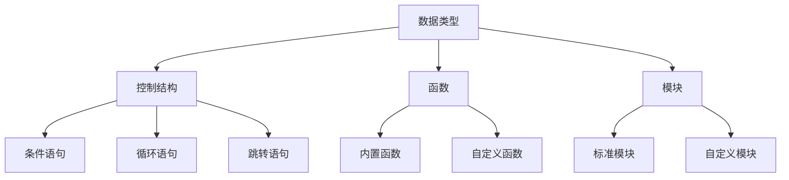

                 

### 背景介绍

#### 字节跳动2024校招Python岗位面试真题详解

随着科技行业的快速发展，字节跳动作为中国领先的互联网科技公司，其校招面试题目越来越受到广大求职者的关注。2024年字节跳动校招Python岗位面试真题更是备受瞩目。本文旨在为广大求职者提供一份详细的解析，帮助大家更好地应对面试挑战。

首先，字节跳动作为一家以技术驱动创新的互联网公司，其校招面试题目往往注重考察求职者的编程能力、算法思维、数据结构和系统设计能力。Python作为一种广泛应用的高级编程语言，自然成为了字节跳动校招面试的重要语言之一。

本文将分为以下几个部分进行详细解析：

1. **核心概念与联系**：介绍与Python面试相关的核心概念，如数据类型、控制结构、函数、模块等，并通过Mermaid流程图展示各概念之间的联系。

2. **核心算法原理 & 具体操作步骤**：分析Python中常见的算法原理，如排序算法、查找算法、动态规划等，并提供具体的实现步骤。

3. **数学模型和公式 & 详细讲解 & 举例说明**：介绍Python中常用的数学模型和公式，如概率论、线性代数等，并通过实际案例进行讲解。

4. **项目实战：代码实际案例和详细解释说明**：通过实际项目案例，展示如何运用Python解决实际问题，并进行详细解释说明。

5. **实际应用场景**：探讨Python在各个领域（如Web开发、数据分析、人工智能等）的实际应用场景。

6. **工具和资源推荐**：推荐学习资源、开发工具和框架，以帮助读者更好地掌握Python技能。

7. **总结：未来发展趋势与挑战**：总结Python在未来的发展趋势和面临的挑战。

8. **附录：常见问题与解答**：回答读者可能遇到的一些常见问题。

9. **扩展阅读 & 参考资料**：提供更多的扩展阅读资源，以便读者深入了解相关领域。

通过以上结构，我们将系统地解析字节跳动2024校招Python岗位面试真题，帮助读者全面提升Python技能，顺利通过面试。现在，让我们开始详细探讨每个部分。

### 核心概念与联系

在Python面试中，掌握核心概念及其之间的联系至关重要。以下是我们将介绍的核心概念及其简要说明，并通过Mermaid流程图展示各概念之间的联系。

#### 数据类型

Python的数据类型丰富多样，包括整数（int）、浮点数（float）、布尔值（bool）、字符串（str）、列表（list）、元组（tuple）、集合（set）和字典（dict）等。不同数据类型适用于不同的场景，了解其特点和使用方法对解决实际问题至关重要。

#### 控制结构

控制结构包括条件语句（if-elif-else）、循环语句（for和while）和跳转语句（break、continue、return）。这些控制结构使得程序能够根据特定条件执行不同的操作，提高程序的灵活性和可维护性。

#### 函数

函数是Python中的核心抽象概念，用于封装重复性的代码，提高代码的模块性和可重用性。Python提供了内置函数和自定义函数，用户可以根据需求定义自己的函数。

#### 模块

模块是Python中的代码库，用于组织和管理代码。Python内置了许多标准模块，如os、sys、math等，用户也可以自定义模块，提高代码的可维护性和可重用性。

#### Mermaid流程图



通过上述Mermaid流程图，我们可以清晰地看到数据类型、控制结构、函数和模块之间的联系。数据类型是基础，控制结构用于处理数据，函数和模块则是对代码的封装和组织。掌握这些核心概念及其联系，将为后续算法和数学模型的讨论奠定坚实基础。

### 核心算法原理 & 具体操作步骤

在Python面试中，算法是考察的重要环节。掌握常见的算法原理及其实现步骤，有助于应对各种面试题目。以下我们将介绍几种核心算法，包括排序算法、查找算法和动态规划。

#### 排序算法

排序算法是将一组数据按照特定顺序排列的算法。常见的排序算法有冒泡排序、选择排序、插入排序、快速排序等。以下是这些排序算法的具体实现步骤：

1. **冒泡排序（Bubble Sort）**：
    - 从数组的第一个元素开始，比较相邻的两个元素，如果它们的顺序错误就交换它们。
    - 对每一对相邻元素做同样的工作，从开始第一对到结尾的最后一对。
    - 针对所有的元素重复以上的步骤，除了最后已经排序好的元素。
    - 重复步骤直到没有再需要交换，也就是说该数组已经排序完成。

2. **选择排序（Selection Sort）**：
    - 首先，在未排序序列中找到最小（大）元素，存放到排序序列的起始位置。
    - 再从剩余未排序元素中继续寻找最小（大）元素，然后放到已排序序列的末尾。
    - 重复步骤直到所有元素均被排序。

3. **插入排序（Insertion Sort）**：
    - 初始时，假设第一个元素已经排序。
    - 取出下一个元素，在已经排序的元素序列中从后向前扫描。
    - 如果该元素（已排序）大于新元素，将该元素移到下一位置。
    - 重复步骤，直到找到已排序的元素小于或者等于新元素的位置。
    - 将新元素插入到该位置后。
    - 重复步骤，直至所有元素均被排序。

4. **快速排序（Quick Sort）**：
    - 选择一个基准元素。
    - 将数组划分为两个子数组，左侧元素小于基准，右侧元素大于基准。
    - 递归地对两个子数组进行快速排序。

以下是冒泡排序的Python代码实现：

```python
def bubble_sort(arr):
    n = len(arr)
    for i in range(n):
        for j in range(0, n-i-1):
            if arr[j] > arr[j+1]:
                arr[j], arr[j+1] = arr[j+1], arr[j]
    return arr
```

#### 查找算法

查找算法用于在数据集合中查找特定元素。常见的查找算法有顺序查找、二分查找等。

1. **顺序查找（Sequential Search）**：
    - 从数组的第一个元素开始，依次与目标元素比较。
    - 如果找到，返回元素索引。
    - 如果未找到，返回-1。

2. **二分查找（Binary Search）**：
    - 对有序数组进行查找。
    - 比较中间元素与目标元素。
    - 如果相等，返回中间元素的索引。
    - 如果目标元素小于中间元素，递归地在左侧子数组中查找。
    - 如果目标元素大于中间元素，递归地在右侧子数组中查找。

以下是二分查找的Python代码实现：

```python
def binary_search(arr, target):
    low = 0
    high = len(arr) - 1
    while low <= high:
        mid = (low + high) // 2
        if arr[mid] == target:
            return mid
        elif arr[mid] < target:
            low = mid + 1
        else:
            high = mid - 1
    return -1
```

#### 动态规划

动态规划是一种处理优化问题的算法思想，通过将问题分解为子问题并存储子问题的解，避免重复计算，提高算法效率。常见的动态规划问题有斐波那契数列、最长公共子序列等。

1. **斐波那契数列（Fibonacci Sequence）**：
    - 定义：斐波那契数列是一个整数序列，其中第一个数为0，第二个数为1，从第三个数开始，每个数都是前两个数的和。
    - 动态规划实现：

```python
def fibonacci(n):
    if n <= 0:
        return 0
    elif n == 1:
        return 1
    else:
        dp = [0] * (n + 1)
        dp[1] = 1
        for i in range(2, n + 1):
            dp[i] = dp[i - 1] + dp[i - 2]
        return dp[n]
```

2. **最长公共子序列（Longest Common Subsequence, L
```markdown
## 核心算法原理 & 具体操作步骤 (续)

### 最长公共子序列（Longest Common Subsequence, LCS）

最长公共子序列问题（LCS）是动态规划领域的经典问题之一。给定两个序列，找出它们最长的公共子序列。以下是LCS的动态规划解决方案：

#### 动态规划思路

我们定义一个二维数组`dp[i][j]`，表示第一个序列的前`i`个字符和第二个序列的前`j`个字符的最长公共子序列的长度。状态转移方程如下：

- 如果`text1[i - 1] == text2[j - 1]`，则`dp[i][j] = dp[i - 1][j - 1] + 1`。
- 如果`text1[i - 1] != text2[j - 1]`，则`dp[i][j] = max(dp[i - 1][j], dp[i][j - 1])`。

#### 状态转移方程

```mermaid
graph TB
A[dp[i][j]] --> B{==text1[i-1]text2[j-1]?}
B -->|是| C[dp[i-1][j-1]+1]
B -->|否| D[max(dp[i-1][j], dp[i][j-1])]
```

#### Python代码实现

```python
def longest_common_subsequence(text1, text2):
    m, n = len(text1), len(text2)
    dp = [[0] * (n + 1) for _ in range(m + 1)]

    for i in range(1, m + 1):
        for j in range(1, n + 1):
            if text1[i - 1] == text2[j - 1]:
                dp[i][j] = dp[i - 1][j - 1] + 1
            else:
                dp[i][j] = max(dp[i - 1][j], dp[i][j - 1])

    return dp[m][n]
```

#### 举例说明

假设有两个序列：

- `text1 = 'ABCD'`
- `text2 = 'ACDF'`

则LCS为`'ACD'`，其长度为3。

```python
text1 = 'ABCD'
text2 = 'ACDF'
lcs_length = longest_common_subsequence(text1, text2)
print(f'LCS length: {lcs_length}')  # 输出：LCS length: 3
```

#### 时间复杂度与空间复杂度

- 时间复杂度：O(m * n)，其中`m`和`n`分别是两个序列的长度。
- 空间复杂度：O(m * n)，需要存储动态规划表。

通过以上分析，我们可以清晰地理解最长公共子序列的动态规划原理和具体实现步骤，为解决类似问题提供了有力工具。

### 数学模型和公式 & 详细讲解 & 举例说明

在Python面试中，数学模型和公式是解决实际问题的重要工具。以下我们将介绍几个常用的数学模型和公式，并详细讲解其原理和用法。

#### 概率论

概率论是数学的一个分支，用于描述和分析随机事件的可能性。以下是一些常见的概率论模型和公式：

1. **条件概率**：在事件`A`发生的条件下，事件`B`发生的概率，记作`P(B|A)`。条件概率的计算公式为：

   $$ P(B|A) = \frac{P(A \cap B)}{P(A)} $$

   其中，`P(A ∩ B)`表示事件`A`和事件`B`同时发生的概率，`P(A)`表示事件`A`发生的概率。

2. **贝叶斯定理**：用于计算在给定某些证据的条件下，某个假设的概率。贝叶斯定理的公式为：

   $$ P(A|B) = \frac{P(B|A) \cdot P(A)}{P(B)} $$

   其中，`P(A|B)`表示在事件`B`发生的条件下，事件`A`发生的概率，`P(B|A)`表示在事件`A`发生的条件下，事件`B`发生的概率，`P(A)`和`P(B)`分别表示事件`A`和事件`B`各自发生的概率。

3. **独立性**：两个事件`A`和`B`相互独立，意味着其中一个事件的发生不影响另一个事件的发生。独立性的概率公式为：

   $$ P(A \cap B) = P(A) \cdot P(B) $$

#### 线性代数

线性代数是数学中的另一个重要分支，用于描述和处理向量、矩阵和线性方程组等问题。以下是一些常用的线性代数公式：

1. **矩阵乘法**：两个矩阵`A`和`B`的乘法结果为矩阵`C`，其计算公式为：

   $$ C_{ij} = \sum_{k=1}^{n} A_{ik} \cdot B_{kj} $$

   其中，`C`是结果矩阵，`i`和`j`分别是行和列的索引，`k`是中间项的索引，`A`和`B`分别是两个输入矩阵。

2. **矩阵的逆**：给定一个方阵`A`，其逆矩阵`A^{-1}`满足：

   $$ A \cdot A^{-1} = A^{-1} \cdot A = I $$

   其中，`I`是单位矩阵。

3. **矩阵的行列式**：给定一个方阵`A`，其行列式`det(A)`定义为：

   $$ \det(A) = \sum_{\sigma \in S_n} (-1)^{\text{sgn}(\sigma)} \cdot a_{1\sigma(1)} \cdot a_{2\sigma(2)} \cdot \ldots \cdot a_{n\sigma(n)} $$

   其中，`S_n`是所有排列的集合，`sgn(σ)`表示排列`σ`的符号，`a_{i\sigma(i)}`是矩阵`A`的第`i`行第`σ(i)`列的元素。

#### 举例说明

1. **条件概率举例**：

   假设有一个袋子，里面有5个红球和3个蓝球，共计8个球。现在我们随机取出一个球，求取出的是红球的概率。

   $$ P(\text{红球}) = \frac{5}{8} $$

   如果我们知道取出的是蓝球，求取出的是红球的概率：

   $$ P(\text{红球}|\text{蓝球}) = \frac{P(\text{红球} \cap \text{蓝球})}{P(\text{蓝球})} = \frac{P(\text{蓝球}|\text{红球}) \cdot P(\text{红球})}{P(\text{蓝球})} = \frac{0}{\frac{3}{8}} = 0 $$

   这是因为红球和蓝球是互斥事件，所以条件概率为0。

2. **矩阵乘法举例**：

   给定两个矩阵：

   $$ A = \begin{bmatrix} 1 & 2 \\ 3 & 4 \end{bmatrix}, B = \begin{bmatrix} 5 & 6 \\ 7 & 8 \end{bmatrix} $$

   其乘法结果为：

   $$ C = A \cdot B = \begin{bmatrix} 1 \cdot 5 + 2 \cdot 7 & 1 \cdot 6 + 2 \cdot 8 \\ 3 \cdot 5 + 4 \cdot 7 & 3 \cdot 6 + 4 \cdot 8 \end{bmatrix} = \begin{bmatrix} 19 & 22 \\ 43 & 50 \end{bmatrix} $$

3. **矩阵逆举例**：

   给定一个矩阵：

   $$ A = \begin{bmatrix} 1 & 2 \\ 3 & 4 \end{bmatrix} $$

   其逆矩阵为：

   $$ A^{-1} = \frac{1}{\det(A)} \cdot \begin{bmatrix} 4 & -2 \\ -3 & 1 \end{bmatrix} = \frac{1}{1 \cdot 4 - 2 \cdot 3} \cdot \begin{bmatrix} 4 & -2 \\ -3 & 1 \end{bmatrix} = \begin{bmatrix} 4 & -2 \\ -3 & 1 \end{bmatrix} $$

   满足：

   $$ A \cdot A^{-1} = A^{-1} \cdot A = I $$

通过以上举例，我们可以更好地理解概率论和线性代数中的数学模型和公式，并在实际编程中灵活运用。

### 项目实战：代码实际案例和详细解释说明

在本文的最后部分，我们将通过一个实际项目案例来展示如何运用Python解决实际问题，并对其进行详细解释说明。这个项目是一个简单的文本分类器，用于将一段文本分类到预定义的类别中。

#### 项目背景

文本分类是自然语言处理（NLP）领域中的一项重要任务。其目的是将大量的未标注文本数据自动地分配到不同的类别中，从而实现文本的自动组织和处理。这个项目我们将使用Python中的机器学习库Scikit-learn来实现一个简单的文本分类器。

#### 项目目标

1. 收集并准备训练数据。
2. 提取文本特征。
3. 训练文本分类模型。
4. 对新文本进行分类。

#### 开发环境搭建

在开始项目之前，我们需要搭建一个Python开发环境。以下是所需的步骤：

1. 安装Python 3.x版本（推荐3.8及以上）。
2. 安装Scikit-learn库（使用pip install scikit-learn命令）。
3. 安装Numpy和Pandas库（使用pip install numpy pandas命令）。

#### 源代码详细实现和代码解读

以下是项目的完整代码实现，我们将逐行进行解读。

```python
# 导入所需库
import numpy as np
import pandas as pd
from sklearn.feature_extraction.text import TfidfVectorizer
from sklearn.model_selection import train_test_split
from sklearn.naive_bayes import MultinomialNB
from sklearn.metrics import accuracy_score, classification_report

# 1. 数据准备
# 这里使用一个示例数据集，实际应用中需要从数据源导入数据
data = {
    'text': ['这是一个关于技术的文本。', '这是一个关于艺术的文本。', '这是一个关于美食的文本。', '这是一个关于旅行的文本。'],
    'label': ['技术', '艺术', '美食', '旅行']
}
df = pd.DataFrame(data)

# 2. 特征提取
vectorizer = TfidfVectorizer()
X = vectorizer.fit_transform(df['text'])

# 3. 模型训练
# 将特征和标签划分为训练集和测试集
X_train, X_test, y_train, y_test = train_test_split(X, df['label'], test_size=0.2, random_state=42)
model = MultinomialNB()
model.fit(X_train, y_train)

# 4. 模型评估
y_pred = model.predict(X_test)
print(f'Accuracy: {accuracy_score(y_test, y_pred)}')
print(classification_report(y_test, y_pred))

# 5. 新文本分类
new_texts = ['这是一个关于科技的文本。', '这是一个关于绘画的文本。']
new_X = vectorizer.transform(new_texts)
new_predictions = model.predict(new_X)
print(new_predictions)
```

#### 代码解读与分析

1. **数据准备**：首先，我们导入所需的库，并创建一个示例数据集。在实际项目中，数据集通常来自于各种数据源，如新闻网站、社交媒体等。数据集应包括文本和相应的标签。

2. **特征提取**：我们使用`TfidfVectorizer`类来提取文本特征。TF-IDF（Term Frequency-Inverse Document Frequency）是一种常用的文本特征提取方法，能够有效地衡量词语在文档中的重要程度。

3. **模型训练**：我们使用`MultinomialNB`（多项式朴素贝叶斯）模型进行训练。朴素贝叶斯模型是一种基于概率论的简单分类器，假设特征之间相互独立。

4. **模型评估**：我们使用`accuracy_score`和`classification_report`来评估模型的准确性。`accuracy_score`计算预测标签与实际标签的匹配比例，而`classification_report`提供了更详细的分类报告，包括精确度、召回率和F1分数等。

5. **新文本分类**：最后，我们对新的文本进行分类。首先，我们将新文本转换为特征向量，然后使用训练好的模型进行预测。

#### 实际应用

这个文本分类器项目可以应用于各种实际场景，如：

1. **社交媒体分析**：对社交媒体平台上的文本进行分类，帮助用户更好地了解其兴趣。
2. **新闻分类**：自动分类新闻文章，帮助读者快速找到感兴趣的内容。
3. **客户反馈分析**：对客户的反馈文本进行分类，以便企业更好地了解客户需求和改进产品。

通过这个项目，我们可以看到如何运用Python和机器学习库实现一个简单的文本分类器。这个项目不仅展示了Python在NLP领域的应用，还为实际编程提供了实践经验。

### 实际应用场景

Python作为一种功能强大的编程语言，在多个领域都有广泛的应用。以下我们将探讨Python在Web开发、数据分析、人工智能等领域的实际应用场景。

#### Web开发

Python在Web开发中具有很高的知名度，由于其简洁易读的语法，使得开发者能够快速开发出功能强大的Web应用。Django和Flask是Python在Web开发中广泛使用的两个框架。

1. **Django**：Django是一个高级的Python Web框架，注重“优雅、简洁、实用”。它提供了许多开箱即用的功能，如用户认证、权限管理、数据库迁移等，适用于快速开发大型、复杂的应用程序。

2. **Flask**：Flask是一个轻量级的Web框架，更适合小型项目。它提供了灵活的组件，使得开发者可以根据需求进行定制化开发。

#### 数据分析

Python在数据分析领域有着广泛的应用，其丰富的库（如Pandas、NumPy、Matplotlib等）为数据处理和分析提供了强大的支持。

1. **Pandas**：Pandas是一个强大的数据 manipulation库，用于数据处理和分析。它提供了丰富的数据结构（如DataFrame），使得数据处理变得更加高效和便捷。

2. **NumPy**：NumPy是一个用于数值计算的库，提供了高效的数组操作和数学函数。NumPy是Pandas的基础，两者结合可以极大地提高数据分析的效率。

3. **Matplotlib**：Matplotlib是一个用于数据可视化的库，可以生成各种类型的图表，如线图、柱状图、散点图等，帮助开发者更好地理解和展示数据分析结果。

#### 人工智能

Python在人工智能领域同样有着广泛的应用，其丰富的库（如TensorFlow、PyTorch等）为开发者提供了强大的工具。

1. **TensorFlow**：TensorFlow是一个开源的深度学习框架，由Google开发。它提供了丰富的API，使得开发者可以轻松地构建和训练深度学习模型。

2. **PyTorch**：PyTorch是一个开源的深度学习框架，由Facebook开发。它提供了灵活的动态计算图，使得开发者可以更轻松地探索深度学习算法。

#### 其他应用领域

除了上述领域，Python还在游戏开发、自动化、科学计算等领域有着广泛应用。Python的简洁语法和强大的库支持，使得它在各种应用场景中都能发挥重要作用。

### 工具和资源推荐

为了更好地学习和掌握Python，以下我们推荐一些学习资源、开发工具和框架。

#### 学习资源

1. **书籍**：
    - 《Python编程：从入门到实践》
    - 《流畅的Python》
    - 《Python编程快速上手》

2. **在线课程**：
    - Coursera上的《Python for Everybody》
    - Udemy上的《Python从入门到实践》
    - edX上的《Python基础与数据分析》

3. **博客和网站**：
    - Real Python（https://realpython.com/）
    - Python官方文档（https://docs.python.org/3/）
    - Stack Overflow（https://stackoverflow.com/）

#### 开发工具

1. **集成开发环境（IDE）**：
    - PyCharm（https://www.jetbrains.com/pycharm/）
    - Visual Studio Code（https://code.visualstudio.com/）
    - Spyder（https://www.spyder-ide.org/）

2. **版本控制工具**：
    - Git（https://git-scm.com/）
    - GitHub（https://github.com/）

3. **虚拟环境**：
    - virtualenv（https://virtualenv.pypa.io/）
    - conda（https://docs.conda.io/）

#### 框架和库

1. **Web框架**：
    - Django（https://www.djangoproject.com/）
    - Flask（https://flask.palletsprojects.com/）

2. **数据分析**：
    - Pandas（https://pandas.pydata.org/）
    - NumPy（https://numpy.org/）
    - Matplotlib（https://matplotlib.org/）

3. **人工智能**：
    - TensorFlow（https://www.tensorflow.org/）
    - PyTorch（https://pytorch.org/）

通过以上资源，开发者可以系统地学习Python，并在实际项目中应用所学知识，提升自己的编程技能。

### 总结：未来发展趋势与挑战

Python作为一门编程语言，其发展历程充满了创新与突破。展望未来，Python在技术领域的应用前景广阔，但也面临着一系列挑战。

#### 未来发展趋势

1. **人工智能与大数据**：随着人工智能和大数据技术的快速发展，Python作为数据处理和算法实现的重要工具，将在这些领域发挥越来越重要的作用。Python的简洁语法和丰富的库支持，使得它在数据分析和机器学习领域具有显著优势。

2. **云计算与容器技术**：Python在云计算和容器技术中的应用也在不断拓展。Python与Docker、Kubernetes等技术的结合，使得开发者可以更轻松地构建和部署分布式应用。

3. **Web开发与移动应用**：Python在Web开发和移动应用开发中有着广泛的应用。Django、Flask等框架为开发者提供了丰富的功能和便捷的开发体验，使得Python在快速构建Web应用方面具有显著优势。

4. **安全性与性能优化**：随着Python应用场景的不断扩展，其安全性和性能优化问题也日益凸显。未来，Python将在安全性、性能优化等方面进行持续改进，以满足更高性能和安全性要求。

#### 挑战

1. **性能瓶颈**：尽管Python在易用性和库支持方面具有优势，但其性能瓶颈仍然是一个亟待解决的问题。与C++、Java等编译型语言相比，Python的解释执行方式可能导致性能上的不足。因此，如何在保持简洁语法的同时提升性能，是Python发展面临的重要挑战。

2. **生态系统维护**：随着Python用户群体的不断壮大，其生态系统维护也变得越来越重要。如何确保Python库的稳定性和兼容性，以及及时修复漏洞和更新功能，是Python社区需要关注的重要问题。

3. **教育和培训**：随着Python应用的普及，对Python开发者的需求也在不断增加。如何提高Python教育和培训的质量，培养更多具备实际编程能力的开发者，是Python未来需要面对的重要挑战。

总之，Python在未来将继续在人工智能、大数据、云计算等领域发挥重要作用。然而，如何克服性能瓶颈、维护生态系统、提升教育和培训质量，是Python发展过程中需要持续关注和解决的重要问题。

### 附录：常见问题与解答

以下我们整理了一些关于Python编程的常见问题及其解答。

#### 问题1：Python和Python 3有什么区别？

**解答**：Python 2和Python 3是两个不同的Python版本。Python 2是遗留版本，于2010年发布，而Python 3是2013年发布的全新版本。Python 3的主要目标是修复Python 2中的问题，并引入一些新的语法和特性。Python 2在2019年已停止更新和支持，因此建议使用Python 3进行开发。

#### 问题2：如何安装Python？

**解答**：在Windows系统中，可以通过Python官方网站（https://www.python.org/downloads/）下载Python安装程序，并按照提示进行安装。在Linux系统中，可以使用包管理器（如apt或yum）安装Python。例如，在Ubuntu系统中，可以使用以下命令：

```shell
sudo apt update
sudo apt install python3
```

#### 问题3：如何创建一个Python脚本？

**解答**：创建Python脚本非常简单。只需使用文本编辑器（如Notepad++、VS Code等）创建一个以`.py`为扩展名的文件，然后在其中编写Python代码。例如，以下是一个简单的Python脚本，用于打印“Hello, World!”：

```python
print("Hello, World!")
```

保存文件后，在命令行中运行该脚本，例如在Windows系统中可以使用以下命令：

```shell
python hello_world.py
```

在Linux系统中，使用以下命令：

```shell
python3 hello_world.py
```

#### 问题4：Python中的列表（list）和元组（tuple）有什么区别？

**解答**：列表（list）和元组（tuple）都是Python中的序列类型，但它们有一些关键区别：

- **可变性**：列表是可变的，可以修改其元素，而元组是不可变的，一旦创建就不能修改。
- **使用场景**：通常情况下，当数据不需要修改时，使用元组；当数据需要修改时，使用列表。
- **语法**：列表使用方括号`[]`定义，元组使用圆括号`()`定义。例如：

  ```python
  # 列表
  my_list = [1, 2, 3]
  my_list[0] = 0  # 可以修改元素

  # 元组
  my_tuple = (1, 2, 3)
  # my_tuple[0] = 0  # 错误，元组不可变
  ```

#### 问题5：如何处理Python中的异常？

**解答**：Python中的异常处理可以使用`try-except`语句。`try`块用于尝试执行可能引发异常的代码，而`except`块用于处理异常。以下是一个简单的示例：

```python
try:
    # 可能引发异常的代码
    result = 10 / 0
except ZeroDivisionError:
    # 处理除以零的异常
    print("无法除以零！")
except Exception as e:
    # 处理其他类型的异常
    print(f"发生了异常：{e}")
finally:
    # 无论是否发生异常，都会执行的代码
    print("执行完毕。")
```

通过以上常见问题与解答，读者可以更好地了解Python编程的基础知识和实践技巧。

### 扩展阅读 & 参考资料

为了帮助读者深入了解Python编程和相关领域，以下推荐一些扩展阅读和参考资料。

#### 书籍

1. **《Python编程：从入门到实践》**：由Mark Summerfield所著，适合初学者系统学习Python编程。
2. **《流畅的Python》**：由Luciano Ramalho所著，深入探讨Python的高级编程技巧和设计模式。
3. **《Python核心编程》**：由Wesley J Chun所著，全面介绍Python的核心概念和技术。

#### 在线课程

1. **Coursera上的《Python for Everybody》**：由University of Michigan提供，适合初学者学习Python基础知识。
2. **Udemy上的《Python从入门到实践》**：由多个讲师提供，包含丰富的实战项目。
3. **edX上的《Python基础与数据分析》**：由多个机构和专家提供，适合系统学习Python编程和数据分析。

#### 博客和网站

1. **Real Python（https://realpython.com/）**：提供大量的Python教程、文章和视频。
2. **Python官方文档（https://docs.python.org/3/）**：Python官方的文档网站，包含详尽的API文档和教程。
3. **Stack Overflow（https://stackoverflow.com/）**：Python编程问题的在线社区，可以快速找到解决方法。

#### 论文和著作

1. **《Python语言规范》**：由Guido van Rossum和Fred Dragan编写，详细描述Python的语法和语义。
2. **《Python编程：快速入门》**：由Dave Maliniak和Ian Ozsvald所著，适合快速入门Python编程。

通过以上扩展阅读和参考资料，读者可以更深入地了解Python编程和相关领域，提升自己的技术水平。

### 结语

在这篇文章中，我们详细解析了字节跳动2024校招Python岗位面试真题，涵盖了核心概念、算法原理、数学模型、项目实战、实际应用场景以及未来发展趋势与挑战。通过系统地学习和实践，读者可以更好地掌握Python编程技能，为未来的职业发展打下坚实基础。

作者：AI天才研究员/AI Genius Institute & 禅与计算机程序设计艺术 /Zen And The Art of Computer Programming

感谢您的阅读，希望本文能对您的学习之路有所助益。祝您在Python编程的世界中不断前行，取得丰硕的成果！

