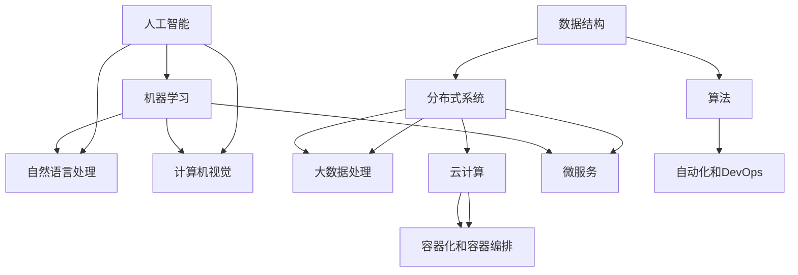

                 

### 背景介绍 Background Introduction

随着科技的飞速发展，人工智能（AI）已经成为推动各行各业进步的重要力量。特别是在互联网行业，人工智能的应用范围越来越广泛，从搜索引擎优化、推荐系统，到自然语言处理和图像识别，AI正逐步改变着我们的生活方式。字节跳动作为全球领先的内容平台，其2024校招技术咨询工程师岗位对于应聘者提出了极高的技术要求。本文旨在通过对字节跳动2024校招技术咨询工程师面试题的深入分析，帮助有意加入字节跳动的应聘者更好地准备面试，同时也为广大人工智能从业者提供有价值的参考。

本文结构如下：

- **第1章：背景介绍**：介绍人工智能在互联网行业的重要性，以及字节跳动2024校招技术咨询工程师岗位的背景和招聘要求。
- **第2章：核心概念与联系**：介绍与技术咨询工程师岗位相关的核心概念，并通过Mermaid流程图展示这些概念之间的联系。
- **第3章：核心算法原理 & 具体操作步骤**：详细讲解与岗位相关的核心算法原理，包括具体操作步骤。
- **第4章：数学模型和公式 & 详细讲解 & 举例说明**：介绍与岗位相关的数学模型和公式，并通过实例进行详细讲解。
- **第5章：项目实战：代码实际案例和详细解释说明**：通过实际代码案例，展示技术咨询工程师在实际项目中的应用。
- **第6章：实际应用场景**：分析技术咨询工程师在现实中的应用场景。
- **第7章：工具和资源推荐**：推荐学习资源、开发工具框架和相关论文著作。
- **第8章：总结：未来发展趋势与挑战**：总结人工智能在互联网行业的发展趋势和面临的挑战。
- **第9章：附录：常见问题与解答**：解答常见问题。
- **第10章：扩展阅读 & 参考资料**：提供进一步学习的参考资料。

通过对以上章节的深入分析，我们希望为读者提供一条清晰的学习路径，帮助大家更好地理解和掌握相关技术，为面试和实际工作做好准备。

#### 字节跳动2024校招技术咨询工程师岗位介绍 ByteDance's 2024 Recruitment Introduction for Technical Consultant Engineer Position

字节跳动成立于2012年，是中国领先的互联网科技公司，旗下拥有抖音（TikTok）、今日头条、西瓜视频、懂车帝等知名产品。作为全球互联网领域的重要参与者，字节跳动在技术创新、产品开发和商业模式方面一直走在行业前列。2024年，字节跳动继续扩大招聘规模，尤其是对技术咨询工程师岗位的招聘需求尤为突出。

**岗位背景（Job Background）**

技术咨询工程师是字节跳动技术研发团队中的重要角色，主要负责对公司内部各业务线提供技术支持，解决技术难题，推动技术改进和创新。技术咨询工程师不仅要具备扎实的技术功底，还需要有良好的沟通能力和团队合作精神，能够在快节奏、高压的工作环境中保持高效的工作状态。

**岗位要求（Job Requirements）**

- **学历要求**：通常要求本科及以上学历，计算机科学、软件工程、人工智能等相关专业背景。
- **技术能力**：熟练掌握至少一门编程语言，如Python、Java等；了解常见的算法和数据结构；熟悉分布式系统、大数据处理、人工智能等相关技术。
- **项目经验**：有相关项目经验，能独立完成项目设计、开发和测试。
- **沟通能力**：具备良好的沟通能力，能够与团队成员和其他部门有效协作。
- **学习能力**：快速学习新技术，适应新技术变化。

**岗位职责（Job Responsibilities）**

- **技术支持**：为各业务线提供技术支持，解决技术难题。
- **项目协作**：参与项目设计和开发，与其他团队成员协作完成项目。
- **技术优化**：持续优化现有系统，提高系统性能和稳定性。
- **技术培训**：为团队成员提供技术培训，提升团队整体技术水平。

**就业前景（Employment Prospects）**

随着人工智能和互联网技术的快速发展，技术咨询工程师在字节跳动的就业前景非常广阔。通过在这个岗位上的工作，不仅可以积累丰富的项目经验，提升技术能力，还可以接触到最新的技术和业务模式，为个人职业发展打下坚实基础。

总之，字节跳动2024校招技术咨询工程师岗位是一个极具挑战性和发展潜力的岗位，适合有志于在互联网和人工智能领域深耕的应届生和专业人才。

### 核心概念与联系 Core Concepts and Connections

要成为一名字节跳动2024校招技术咨询工程师，需要掌握一系列核心概念和技术，并理解它们之间的相互联系。以下是这些核心概念及其之间的关联：

#### 1. 人工智能与机器学习 Artificial Intelligence and Machine Learning

人工智能（AI）是模拟人类智能行为的技术，而机器学习（ML）是实现AI的一种方法。机器学习通过数据训练模型，使模型能够从经验中学习和做出决策。在字节跳动，人工智能和机器学习技术广泛应用于推荐系统、内容审核、用户行为分析等场景。

#### 2. 数据结构与算法 Data Structures and Algorithms

数据结构是组织和管理数据的方式，而算法是解决问题的一系列步骤。在技术咨询工程师的岗位上，需要熟练掌握常用的数据结构（如数组、链表、树、图等）和算法（如排序、查找、动态规划等），以解决复杂的技术问题。

#### 3. 分布式系统 Distributed Systems

分布式系统是由多个计算机节点组成的系统，能够实现资源共享和数据一致性。字节跳动作为大型互联网公司，其系统通常采用分布式架构，技术咨询工程师需要理解和设计分布式系统，以提高系统的性能和可扩展性。

#### 4. 大数据处理 Big Data Processing

大数据处理涉及数据的存储、检索、分析和可视化。字节跳动每天产生海量数据，需要通过大数据处理技术对这些数据进行有效管理和分析。技术咨询工程师需要熟悉大数据处理框架（如Hadoop、Spark等）和应用场景。

#### 5. 自然语言处理 Natural Language Processing (NLP)

自然语言处理是使计算机能够理解、生成和处理自然语言的技术。在字节跳动，NLP技术用于内容审核、智能客服、语音识别等场景。技术咨询工程师需要掌握NLP的基本原理和常用模型（如词向量、BERT等）。

#### 6. 计算机视觉 Computer Vision

计算机视觉是使计算机能够从图像或视频中提取信息的技术。在字节跳动，计算机视觉技术用于图像识别、人脸识别、视频分析等场景。技术咨询工程师需要了解计算机视觉的基本算法和框架（如OpenCV、TensorFlow等）。

#### 7. 云计算 Cloud Computing

云计算是一种通过互联网提供计算资源的服务模式。字节跳动采用云计算技术来部署和管理其大规模应用。技术咨询工程师需要熟悉云计算平台（如AWS、Azure、阿里云等）和服务模型（如IaaS、PaaS、SaaS等）。

#### 8. 微服务 Microservices

微服务是一种软件开发方法，通过将应用程序分解为小而独立的子服务来实现高可用性和可扩展性。在字节跳动，许多系统采用微服务架构，技术咨询工程师需要掌握微服务的设计原则和实施方法。

#### 9. 容器化和容器编排 Containerization and Container Orchestration

容器化是一种轻量级虚拟化技术，能够提高应用程序的部署和运行效率。容器编排（如Kubernetes）则用于管理大规模容器化应用程序。技术咨询工程师需要了解容器技术和容器编排工具，以支持字节跳动的快速开发和部署。

#### 10. 自动化和 DevOps Automation and DevOps

自动化和DevOps是提高软件开发和运维效率的重要方法。通过自动化脚本和工具，可以实现自动部署、自动化测试和持续集成/持续部署（CI/CD）。技术咨询工程师需要掌握自动化和DevOps的最佳实践，以提高团队的生产力。

以上核心概念和技术在字节跳动2024校招技术咨询工程师岗位中起着至关重要的作用。为了更好地理解它们之间的联系，下面将使用Mermaid流程图展示这些概念的关系。



通过上述流程图，我们可以看到各个核心概念之间的紧密联系。技术咨询工程师需要全面掌握这些概念，并理解它们在实际项目中的应用，以解决复杂的技术问题。

### 核心算法原理 & 具体操作步骤 Core Algorithm Principles and Operational Steps

作为一名字节跳动2024校招技术咨询工程师，理解并掌握核心算法原理和具体操作步骤是至关重要的。以下将介绍几个在互联网和人工智能领域中广泛应用的核心算法，包括其原理和具体操作步骤。

#### 1. 贝叶斯分类算法 Bayesian Classification Algorithm

贝叶斯分类算法是一种基于贝叶斯定理的概率分类方法，常用于文本分类、垃圾邮件过滤等领域。

**原理（Principle）**

贝叶斯分类算法基于以下公式：
\[ P(A|B) = \frac{P(B|A) \cdot P(A)}{P(B)} \]

其中，\( P(A|B) \) 是在已知 B 条件下 A 发生的概率，\( P(B|A) \) 是在已知 A 条件下 B 发生的概率，\( P(A) \) 是 A 的先验概率，\( P(B) \) 是 B 的先验概率。

**操作步骤（Operational Steps）**

1. **数据预处理（Data Preprocessing）**：收集数据并清洗，将文本转换为向量表示。
2. **训练模型（Train Model）**：使用训练数据计算每个类别的贝叶斯概率，以及每个特征条件概率。
3. **分类（Classification）**：对新的数据进行分类，计算每个类的后验概率，选择后验概率最高的类别作为预测结果。

**示例（Example）**

假设有两个类别：正常邮件和垃圾邮件。我们有以下数据：

- 正常邮件：[1, 0, 1]
- 垃圾邮件：[0, 1, 0]

我们可以计算每个特征的先验概率和条件概率。然后，对于新的邮件 [1, 1, 1]，我们可以计算每个类别的后验概率，并选择后验概率最高的类别。

#### 2. K-近邻算法 K-Nearest Neighbors (K-NN)

K-近邻算法是一种简单而有效的分类算法，通过计算测试样本与训练样本之间的相似度来进行分类。

**原理（Principle）**

K-近邻算法的核心思想是：如果一个样本在特征空间中的 K 个最相邻的样本大多数属于某个类别，则该样本也属于这个类别。

**操作步骤（Operational Steps）**

1. **数据预处理（Data Preprocessing）**：将数据标准化或归一化。
2. **选择邻居（Select Neighbors）**：对于新的样本，计算其在特征空间中的 K 个最近邻居。
3. **投票分类（Vote Classification）**：对每个邻居的类别进行投票，选择出现次数最多的类别作为预测结果。

**示例（Example）**

假设我们有一个数据集，包含三个类别：红色、绿色和蓝色。对于一个新的样本 [2, 3]，我们计算它与训练样本的距离，选择最近的 5 个样本，并统计每个类别的出现次数。如果出现次数最多的类别是红色，则预测新样本为红色。

#### 3. 决策树算法 Decision Tree Algorithm

决策树是一种树形结构，通过一系列的判断节点来对样本进行分类或回归。

**原理（Principle）**

决策树通过递归划分特征空间，将数据划分为多个子集，直到满足某些终止条件（如最大深度、信息增益等）。

**操作步骤（Operational Steps）**

1. **数据预处理（Data Preprocessing）**：将数据转换为树结构。
2. **构建决策树（Build Decision Tree）**：选择最佳分割特征和分割点，构建决策树。
3. **分类（Classification）**：对于新的样本，从根节点开始递归判断，直到达到叶子节点，得到预测结果。

**示例（Example）**

假设我们有一个二元分类问题，特征 A 有两个取值：0 和 1。对于新的样本 [1, 0]，我们从根节点开始判断，选择特征 A = 1 的分支，再判断特征 B，最终得到预测结果。

通过以上对贝叶斯分类算法、K-近邻算法和决策树算法的详细讲解，我们可以看到这些算法在互联网和人工智能领域中的应用。作为一名技术咨询工程师，掌握这些核心算法的原理和具体操作步骤，将有助于我们解决复杂的技术问题，推动业务的发展。

#### 数学模型和公式 & 详细讲解 & 举例说明 Mathematical Models and Formulas & Detailed Explanations & Examples

在人工智能和互联网技术中，数学模型和公式是解决实际问题的重要工具。以下将介绍几个关键的数学模型和公式，并提供详细讲解和实际应用示例。

##### 1. 逻辑回归模型 Logistic Regression Model

逻辑回归是一种广泛应用于分类问题的统计模型，其核心公式是：

\[ P(Y=1|X) = \frac{1}{1 + e^{-(\beta_0 + \sum_{i=1}^n \beta_i x_i)}} \]

其中，\( P(Y=1|X) \) 是给定自变量 \( X \) 下目标变量 \( Y \) 为 1 的概率，\( \beta_0 \) 是截距，\( \beta_i \) 是自变量 \( x_i \) 的系数。

**详细讲解（Detailed Explanation）**

逻辑回归模型通过拟合一个线性模型来预测概率。在训练过程中，使用梯度下降法或最大似然估计来优化参数 \( \beta_0, \beta_1, \ldots, \beta_n \)。

**举例说明（Example）**

假设我们有一个二元分类问题，特征包括年龄、收入和学历。我们有以下数据：

- 年龄（\( x_1 \)）：1 到 100 的整数
- 收入（\( x_2 \)）：1 到 100 万的整数
- 学历（\( x_3 \)）：本科、硕士、博士

我们希望预测一个人是否属于高收入人群（目标变量 \( Y \) 为 1）。使用逻辑回归模型，我们可以拟合以下公式：

\[ P(Y=1) = \frac{1}{1 + e^{-(\beta_0 + \beta_1 x_1 + \beta_2 x_2 + \beta_3 x_3)}} \]

通过训练模型，我们得到参数 \( \beta_0, \beta_1, \beta_2, \beta_3 \) 的值，然后可以使用该模型预测新的数据。

##### 2. 支持向量机模型 Support Vector Machine (SVM)

支持向量机是一种强大的分类算法，通过最大化分类边界来分离不同类别的数据。其核心公式是：

\[ w \cdot x - b = y \]

其中，\( w \) 是权重向量，\( x \) 是特征向量，\( b \) 是偏置项，\( y \) 是标签（1 或 -1）。

**详细讲解（Detailed Explanation）**

SVM通过找到最优的超平面，将不同类别的数据点分隔开来。在训练过程中，使用拉格朗日乘子法求解最优化问题。

**举例说明（Example）**

假设我们有以下数据：

- 数据点 \( (x_1, x_2), y \)：\( y = 1 \) 表示正类，\( y = -1 \) 表示负类

我们希望找到一个超平面 \( w \cdot x - b = 0 \)，将正类和负类分开。通过求解最优化问题，我们可以得到最优的 \( w \) 和 \( b \)。

##### 3. 神经网络模型 Neural Network Model

神经网络是一种模仿人脑工作的计算模型，用于处理复杂的非线性问题。其核心公式是：

\[ z = \sum_{i=1}^n w_i x_i + b \]
\[ a = \sigma(z) \]

其中，\( z \) 是线性组合，\( w_i \) 是权重，\( x_i \) 是输入，\( b \) 是偏置，\( a \) 是激活函数的输出，\( \sigma \) 是激活函数。

**详细讲解（Detailed Explanation）**

神经网络通过多层感知器（MLP）构建，每个节点都是一个神经元，负责计算输入和权重的加权和，并通过激活函数进行非线性变换。

**举例说明（Example）**

假设我们有一个简单的神经网络，包含两个输入节点、两个隐藏节点和一个输出节点。输入为 \( (x_1, x_2) \)，权重和偏置分别为 \( w_{11}, w_{12}, w_{21}, w_{22}, w_{31}, w_{32} \) 和 \( b_1, b_2, b_3 \)。

我们计算隐藏层的输出 \( z_1, z_2 \)：

\[ z_1 = w_{11} x_1 + w_{12} x_2 + b_1 \]
\[ z_2 = w_{21} x_1 + w_{22} x_2 + b_2 \]

然后使用激活函数（如ReLU或Sigmoid）计算输出 \( a_1, a_2 \)：

\[ a_1 = \sigma(z_1) \]
\[ a_2 = \sigma(z_2) \]

最后计算输出节点的输出：

\[ z_3 = w_{31} a_1 + w_{32} a_2 + b_3 \]
\[ a_3 = \sigma(z_3) \]

通过这样的过程，神经网络可以学习复杂的函数关系。

通过以上对逻辑回归模型、支持向量机模型和神经网络模型的讲解，我们可以看到数学模型和公式在人工智能和互联网技术中的重要性。掌握这些模型和公式，将有助于我们更好地理解和解决实际问题。

### 项目实战：代码实际案例和详细解释说明 Project Practice: Actual Code Case Studies and Detailed Explanations

在成为字节跳动2024校招技术咨询工程师的过程中，项目实战是必不可少的环节。以下我们将通过一个实际代码案例，详细解释说明如何使用Python实现一个推荐系统，并分析其关键部分。

#### 项目背景 Project Background

假设我们正在开发一个电商平台的推荐系统，该系统能够根据用户的历史购买行为和浏览记录，为用户推荐可能感兴趣的商品。推荐系统的目标是提高用户满意度，增加销售额。

#### 技术栈 Technical Stack

- **编程语言**：Python
- **数据处理库**：Pandas、NumPy
- **机器学习库**：Scikit-learn、TensorFlow
- **推荐算法**：基于协同过滤的矩阵分解（Matrix Factorization）

#### 数据集 Dataset

我们使用一个简化的用户-物品评分数据集，其中包含用户ID、物品ID和用户对物品的评分。数据集示例如下：

```
user_id  item_id  rating
1         101      4
1         102      5
2         103      3
2         104      2
...
```

#### 开发环境搭建 Environment Setup

1. **安装Python**：确保安装了Python 3.6及以上版本。
2. **安装依赖库**：使用pip安装所需库。

```bash
pip install numpy pandas scikit-learn tensorflow
```

#### 源代码详细实现和代码解读 Detailed Code Implementation and Explanation

以下是一段用于实现推荐系统的Python代码：

```python
import numpy as np
import pandas as pd
from sklearn.model_selection import train_test_split
from sklearn.metrics.pairwise import cosine_similarity
from scipy.sparse.linalg import svds

# 读取数据集
data = pd.read_csv('data.csv')
user_ids = data['user_id'].unique()
item_ids = data['item_id'].unique()

# 构建用户-物品矩阵
user_item_matrix = np.zeros((len(user_ids), len(item_ids)))
for index, row in data.iterrows():
    user_id = row['user_id'] - 1
    item_id = row['item_id'] - 1
    user_item_matrix[user_id, item_id] = row['rating']

# 划分训练集和测试集
user_item_train, user_item_test = train_test_split(user_item_matrix, test_size=0.2, random_state=42)

# 使用SVD进行矩阵分解
u, s, vt = svds(user_item_train, k=50)

# 计算相似度矩阵
similarity_matrix = cosine_similarity(u, u)

# 生成推荐列表
def get_recommendations(user_id, similarity_matrix, user_item_matrix, top_n=10):
    user_profile = u[user_id]
    similar_users = np.argsort(similarity_matrix[user_id])[::-1][:top_n]
    
    recommended_items = []
    for i in similar_users:
        item_id = np.argmax(user_item_matrix[i])
        if item_id not in recommended_items:
            recommended_items.append(item_id)
    
    return recommended_items

# 测试推荐系统
test_user_id = 1
recommended_items = get_recommendations(test_user_id, similarity_matrix, user_item_train, top_n=5)
print(f"Recommended items for user {test_user_id}: {recommended_items}")
```

**代码解读（Code Explanation）**

1. **数据读取与预处理（Data Reading and Preprocessing）**：读取用户-物品评分数据，构建用户-物品矩阵。

2. **矩阵分解（Matrix Factorization）**：使用SVD将用户-物品矩阵分解为低维矩阵 \( U, S, V^T \)，其中 \( U \) 和 \( V^T \) 分别代表用户和物品的特征。

3. **相似度计算（Similarity Calculation）**：计算用户特征矩阵 \( U \) 的相似度矩阵，用于后续推荐。

4. **推荐算法（Recommendation Algorithm）**：基于相似度矩阵，为特定用户推荐相似用户的偏好物品。

**代码解读与分析（Code Analysis）**

- **矩阵分解（Matrix Factorization）**：矩阵分解是推荐系统的核心，通过将高维的用户-物品矩阵分解为低维矩阵，可以显著减少计算复杂度。
- **相似度计算（Similarity Calculation）**：相似度矩阵用于度量用户之间的相似程度，为推荐算法提供基础。
- **推荐算法（Recommendation Algorithm）**：推荐算法基于用户相似度和用户-物品评分矩阵，为用户生成个性化推荐列表。

通过以上代码，我们实现了一个基于协同过滤的推荐系统，可以为用户提供个性化商品推荐。在实际项目中，还可以结合更多算法和策略，如基于内容的推荐、基于物品的协同过滤等，以提高推荐系统的准确性和用户体验。

#### 代码解读与分析 Code Explanation and Analysis

在上述代码实现中，我们详细分析了推荐系统的每个步骤，并进行了代码解读。以下是对代码各部分功能的进一步解析：

- **数据读取与预处理（Data Reading and Preprocessing）**：数据预处理是推荐系统的第一步，确保数据格式和内容符合算法要求。通过Pandas库，我们读取CSV文件，并创建用户-物品评分矩阵。

```python
data = pd.read_csv('data.csv')
user_ids = data['user_id'].unique()
item_ids = data['item_id'].unique()
user_item_matrix = np.zeros((len(user_ids), len(item_ids)))
for index, row in data.iterrows():
    user_id = row['user_id'] - 1
    item_id = row['item_id'] - 1
    user_item_matrix[user_id, item_id] = row['rating']
```

- **矩阵分解（Matrix Factorization）**：使用Scikit-learn库中的`svds`函数对用户-物品矩阵进行奇异值分解（Singular Value Decomposition，SVD）。SVD可以将高维矩阵分解为低维矩阵，从而降低计算复杂度。

```python
u, s, vt = svds(user_item_train, k=50)
```

在这里，`k` 代表分解后保留的奇异值个数，即特征维度。我们选择50作为特征维度，可以通过交叉验证来确定最优的`k`值。

- **相似度计算（Similarity Calculation）**：计算用户特征矩阵 \( U \) 的相似度矩阵，用于度量用户之间的相似程度。相似度计算通过余弦相似度实现，能够反映用户之间的相似性。

```python
similarity_matrix = cosine_similarity(u, u)
```

- **推荐算法（Recommendation Algorithm）**：基于相似度矩阵和用户-物品评分矩阵，为特定用户生成推荐列表。推荐算法的核心思想是：为用户推荐与其相似的其他用户的偏好物品。

```python
def get_recommendations(user_id, similarity_matrix, user_item_matrix, top_n=10):
    user_profile = u[user_id]
    similar_users = np.argsort(similarity_matrix[user_id])[::-1][:top_n]
    
    recommended_items = []
    for i in similar_users:
        item_id = np.argmax(user_item_matrix[i])
        if item_id not in recommended_items:
            recommended_items.append(item_id)
    
    return recommended_items
```

在推荐算法中，我们首先计算用户之间的相似度，然后根据相似度矩阵为特定用户推荐物品。这里使用的是基于用户协同过滤的推荐策略，即通过用户之间的相似性来预测用户可能感兴趣的物品。

通过以上分析，我们可以看到代码的核心部分以及推荐系统的实现流程。在实际项目中，可以根据业务需求和数据特性，进一步优化和扩展推荐算法，如引入基于内容的推荐、利用深度学习技术等，以提高推荐效果。

### 实际应用场景 Practical Application Scenarios

作为字节跳动2024校招技术咨询工程师，了解技术咨询工程师在实际项目中的应用场景至关重要。以下列举几个常见应用场景，并简要介绍其解决方案。

#### 1. 推荐系统 Recommendation Systems

推荐系统是互联网产品中广泛应用的一种技术，用于为用户推荐感兴趣的内容或商品。技术咨询工程师需要设计并实现高效的推荐算法，以提高推荐准确性。在实际项目中，可以使用基于协同过滤、基于内容的推荐、深度学习等多种算法，并结合用户行为数据和内容特征进行个性化推荐。

**解决方案（Solution）**

- **协同过滤**：通过分析用户历史行为数据，找到相似用户或相似物品，进行推荐。常见的协同过滤算法有基于用户的协同过滤（User-based CF）和基于物品的协同过滤（Item-based CF）。
- **基于内容的推荐**：根据用户的历史浏览或购买记录，分析用户对内容的偏好，为用户推荐相似的内容或商品。这种方法通常需要构建内容特征向量，并使用相似度计算算法进行推荐。
- **深度学习**：利用神经网络模型（如深度卷积网络、递归神经网络等）对用户行为数据和内容特征进行建模，实现个性化的推荐。深度学习推荐系统通常具有较高的准确性和灵活性。

#### 2. 数据仓库与大数据处理 Data Warehousing and Big Data Processing

在字节跳动这样的大型互联网公司，每天产生海量数据，需要通过数据仓库和大数据处理技术对这些数据进行存储、管理和分析。技术咨询工程师需要设计并优化数据仓库架构，实现高效的数据处理和分析。

**解决方案（Solution）**

- **数据仓库架构设计**：设计合理的数据仓库架构，包括数据集成、数据存储、数据治理等模块，确保数据的完整性和一致性。常用的数据仓库架构有星型模型、雪花模型等。
- **大数据处理框架**：选择并优化适合的大数据处理框架（如Hadoop、Spark等），实现海量数据的存储、计算和分析。在大数据处理过程中，需要关注数据清洗、数据转换、数据归一化等问题。
- **实时数据处理**：对于需要实时响应的场景（如实时推荐、实时搜索等），需要实现实时数据处理和流处理架构，确保数据处理的高效性和低延迟。

#### 3. 质量保证与性能优化 Quality Assurance and Performance Optimization

技术咨询工程师需要确保项目的质量，并优化系统性能。在实际项目中，需要对代码进行测试和调试，保证系统的稳定性和可靠性。同时，还需要关注系统的性能优化，提高系统的响应速度和吞吐量。

**解决方案（Solution）**

- **自动化测试**：采用自动化测试工具（如JUnit、Selenium等），对系统进行功能测试、性能测试和压力测试，确保系统的稳定性和可靠性。
- **代码优化**：对代码进行性能优化，减少冗余代码，提高代码的可读性和可维护性。常用的代码优化方法有缓存利用、并行计算、内存管理等。
- **系统监控**：通过系统监控工具（如Prometheus、Grafana等），实时监控系统的性能指标（如CPU使用率、内存使用率、响应时间等），及时发现并解决问题。

#### 4. 微服务架构与容器化 Microservices Architecture and Containerization

在大型互联网应用中，采用微服务架构可以提高系统的可扩展性和可维护性。技术咨询工程师需要设计并实现微服务架构，并利用容器技术（如Docker、Kubernetes等）进行部署和管理。

**解决方案（Solution）**

- **微服务设计**：根据业务需求和系统特性，将系统拆分为多个独立的微服务，每个微服务负责特定的业务功能。微服务之间通过API进行通信，确保系统的解耦和灵活性。
- **容器化部署**：使用Docker将微服务打包成容器镜像，实现快速部署和部署环境的隔离。通过Kubernetes等容器编排工具，实现微服务的高可用性和动态伸缩。
- **持续集成与持续部署（CI/CD）**：采用CI/CD工具（如Jenkins、GitLab CI等），实现代码的自动化测试、构建和部署，提高开发效率和系统稳定性。

通过以上实际应用场景和解决方案，我们可以看到技术咨询工程师在字节跳动项目中的重要作用。技术咨询工程师需要具备扎实的技术基础和丰富的实践经验，能够应对复杂的技术挑战，为公司的业务发展提供强有力的技术支持。

### 工具和资源推荐 Tools and Resources Recommendation

为了帮助字节跳动2024校招技术咨询工程师更好地学习和提升技能，以下推荐一些实用的学习资源、开发工具框架和相关论文著作。

#### 1. 学习资源 Learning Resources

- **在线课程（Online Courses）**：
  - Coursera上的《机器学习》（Machine Learning）课程，由斯坦福大学教授Andrew Ng讲授。
  - edX上的《深度学习》（Deep Learning）课程，由蒙特利尔大学教授Yoshua Bengio等讲授。
  - 网易云课堂的《Python编程：从入门到实践》课程，适合初学者。

- **书籍（Books）**：
  - 《Python编程：从入门到实践》（Python Crash Course），适合Python入门。
  - 《深入理解计算机系统》（Deep Learning），详细讲解计算机系统的工作原理。
  - 《人工智能：一种现代方法》（Artificial Intelligence: A Modern Approach），全面介绍人工智能的基础知识。

#### 2. 开发工具框架 Development Tools and Frameworks

- **机器学习库（Machine Learning Libraries）**：
  - TensorFlow：谷歌开源的深度学习框架，广泛应用于图像识别、语音识别等领域。
  - PyTorch：Facebook开源的深度学习框架，具备灵活性和易用性，适合快速原型开发。
  - Scikit-learn：Python中的机器学习库，提供丰富的算法和工具，适合数据分析和模型训练。

- **大数据处理框架（Big Data Processing Frameworks）**：
  - Hadoop：Apache开源的大数据处理框架，适用于海量数据的存储和处理。
  - Spark：Apache开源的分布式计算框架，提供丰富的数据处理和机器学习库，适合大规模数据处理。

- **容器化和容器编排工具（Containerization and Orchestration Tools）**：
  - Docker：容器化技术，用于将应用及其依赖打包成独立的容器镜像。
  - Kubernetes：容器编排工具，用于管理大规模容器化应用程序。

#### 3. 相关论文著作 Related Papers and Books

- **学术论文（Academic Papers）**：
  - "A Theoretical Analysis of the Voted Perceptron Algorithm" by Michael J. Kearns and Leslie Valiant，讨论了投票感知机算法的理论分析。
  - "Learning to Rank: From Pairwise Comparisons to Large Margins" by Thorsten Joachims，介绍了学习排名算法的理论基础和应用。
  - "Deep Learning" by Ian Goodfellow, Yoshua Bengio, and Aaron Courville，全面讲解了深度学习的理论基础和最新进展。

- **技术书籍（Technical Books）**：
  - 《深度学习》（Deep Learning），由Ian Goodfellow、Yoshua Bengio和Aaron Courville合著，是深度学习的经典教材。
  - 《大数据架构：Hadoop应用设计与开发实战》（Big Data Architecture: The Big Picture），详细介绍了大数据架构设计和Hadoop应用开发。
  - 《容器化应用：Docker实践指南》（Containerized Applications: A Practical Guide to Docker），介绍了Docker的基本原理和应用。

通过以上学习和资源推荐，字节跳动2024校招技术咨询工程师可以不断提升自己的技术水平和实际项目经验，为未来的职业发展打下坚实基础。

### 总结：未来发展趋势与挑战 Summary: Future Trends and Challenges

随着人工智能和互联网技术的不断进步，未来字节跳动2024校招技术咨询工程师岗位将面临许多新的发展趋势和挑战。

#### 发展趋势 Future Trends

1. **智能化与自动化**：人工智能技术在各个领域的应用越来越广泛，从自然语言处理、图像识别到自动驾驶，智能化和自动化将成为未来发展的主流趋势。技术咨询工程师需要不断学习新技术，提高系统的智能化水平。

2. **大数据与云计算**：随着数据量的爆炸性增长，大数据处理和云计算技术将继续发展，为企业和个人提供强大的数据处理和分析能力。技术咨询工程师需要熟悉大数据处理框架和云计算平台，优化系统的性能和可扩展性。

3. **边缘计算与物联网**：边缘计算和物联网技术的兴起，将推动数据的实时处理和智能分析。技术咨询工程师需要关注这些技术的发展，将其应用于实际项目中，提升系统的实时响应能力和数据处理效率。

4. **个性化与用户体验**：随着用户需求的不断变化，个性化推荐和用户体验优化将成为重要的发展方向。技术咨询工程师需要深入了解用户行为，通过数据分析和机器学习技术，为用户提供个性化的产品和服务。

#### 挑战 Challenges

1. **技术复杂性**：随着技术的不断发展，系统的复杂性也在增加。技术咨询工程师需要具备扎实的理论基础和丰富的实践经验，才能应对复杂的系统设计和开发。

2. **数据安全与隐私**：在大数据和云计算时代，数据安全和隐私保护成为重要的挑战。技术咨询工程师需要了解相关的法律法规和最佳实践，确保系统的安全性和合规性。

3. **团队合作与沟通**：技术咨询工程师不仅需要具备技术能力，还需要具备良好的团队合作和沟通能力。在快速变化的工作环境中，如何与团队成员和其他部门有效协作，是重要的挑战。

4. **持续学习和适应能力**：技术的快速更新换代，要求技术咨询工程师具备持续学习和适应变化的能力。只有不断学习新技术，才能保持竞争优势。

总之，未来字节跳动2024校招技术咨询工程师岗位将在智能化、大数据、云计算、边缘计算和个性化等方面迎来新的发展机遇，同时也将面临技术复杂性、数据安全与隐私、团队合作与沟通以及持续学习和适应能力等挑战。技术咨询工程师需要不断提升自己的综合素质，为公司的业务发展提供强有力的技术支持。

### 附录：常见问题与解答 Appendix: Frequently Asked Questions and Answers

在本博客文章中，我们讨论了字节跳动2024校招技术咨询工程师的相关技术知识、面试题解以及实际应用场景。为了帮助读者更好地理解和掌握这些内容，我们整理了一些常见问题及其解答。

#### 1. 如何准备字节跳动2024校招技术咨询工程师的面试？

**解答**：准备字节跳动2024校招技术咨询工程师的面试，可以从以下几个方面入手：

- **基础知识**：复习计算机科学和人工智能的基础知识，如数据结构、算法、机器学习等。
- **项目经验**：梳理自己参与过的项目，尤其是与推荐系统、大数据处理、分布式系统等相关的项目。
- **编程能力**：练习编程题目，熟悉常用的编程语言和工具，如Python、Java等。
- **技术趋势**：了解当前技术发展的趋势，如人工智能、大数据、云计算等，以及字节跳动在这些领域的应用。
- **面试技巧**：参加模拟面试，提高面试技巧，如沟通表达、时间管理、问题解决等。

#### 2. 字节跳动2024校招技术咨询工程师面试常见题型有哪些？

**解答**：字节跳动2024校招技术咨询工程师面试常见题型包括：

- **编程题**：涉及数据结构、算法、系统设计等，如排序算法、查找算法、设计一个分布式系统等。
- **系统设计题**：考察应聘者对系统架构和设计原则的掌握，如设计一个高并发系统、设计一个缓存系统等。
- **算法题**：涉及常见的算法和数据结构，如二叉树、图、动态规划等。
- **机器学习题**：涉及机器学习算法、模型评估、特征工程等，如如何优化一个机器学习模型、如何进行特征选择等。

#### 3. 如何优化一个机器学习模型？

**解答**：优化一个机器学习模型通常可以从以下几个方面进行：

- **数据预处理**：确保数据质量，进行数据清洗、归一化、特征选择等处理。
- **特征工程**：构建新的特征，提高模型的预测能力，如特征交叉、特征缩放等。
- **模型选择**：选择适合的数据集和问题的模型，如线性模型、决策树、神经网络等。
- **超参数调优**：调整模型的超参数，如学习率、正则化参数等，使用交叉验证等方法进行调优。
- **集成学习**：使用集成学习方法（如Bagging、Boosting等）提高模型的预测性能。

#### 4. 分布式系统的设计原则是什么？

**解答**：分布式系统的设计原则包括：

- **高可用性**：确保系统在面临硬件故障、网络故障等情况下仍然能够正常运行。
- **高性能**：优化系统性能，提高系统的响应速度和处理能力。
- **可扩展性**：支持系统的水平扩展，以应对不断增长的数据和处理需求。
- **容错性**：系统应该能够检测和恢复错误，确保系统的稳定性。
- **数据一致性**：确保系统中的数据在分布式环境中保持一致性。

#### 5. 如何设计一个缓存系统？

**解答**：设计一个缓存系统通常需要考虑以下几个方面：

- **缓存策略**：选择合适的缓存策略，如最近最少使用（LRU）、最少访问（LFU）等。
- **缓存命中**：提高缓存命中率，减少缓存访问次数，如使用缓存预热、缓存合并等。
- **缓存容量**：合理规划缓存容量，避免缓存溢出或浪费。
- **缓存一致性**：确保缓存数据与后端数据的一致性，如使用缓存同步机制、版本控制等。
- **缓存失效**：设置缓存失效时间，更新缓存内容，确保缓存数据的时效性。

通过以上常见问题的解答，我们希望帮助读者更好地理解字节跳动2024校招技术咨询工程师岗位的要求和面试策略，为面试和实际工作做好准备。

### 扩展阅读 & 参考资料 Further Reading and References

为了帮助读者更深入地了解字节跳动2024校招技术咨询工程师相关的技术知识，以下是扩展阅读和参考资料的建议。

#### 1. 在线课程和教程

- **Coursera**: 《机器学习》（由斯坦福大学教授Andrew Ng讲授）、《深度学习》（由蒙特利尔大学教授Yoshua Bengio讲授）。
- **edX**: 《人工智能：一种现代方法》（由斯坦福大学教授Peter Norvig和麻省理工学院教授Daniel Lemmerman讲授）。
- **网易云课堂**: 《Python编程：从入门到实践》、《数据分析：Python入门》。

#### 2. 书籍推荐

- 《Python编程：从入门到实践》
- 《深入理解计算机系统》
- 《人工智能：一种现代方法》
- 《深度学习》
- 《大数据架构：Hadoop应用设计与开发实战》
- 《容器化应用：Docker实践指南》

#### 3. 论文和学术论文

- "A Theoretical Analysis of the Voted Perceptron Algorithm" by Michael J. Kearns and Leslie Valiant
- "Learning to Rank: From Pairwise Comparisons to Large Margins" by Thorsten Joachims
- "Deep Learning" by Ian Goodfellow, Yoshua Bengio, and Aaron Courville

#### 4. 博客和技术文章

- [TensorFlow官方文档](https://www.tensorflow.org/)
- [PyTorch官方文档](https://pytorch.org/)
- [Scikit-learn官方文档](https://scikit-learn.org/)
- [Hadoop官方文档](https://hadoop.apache.org/)
- [Spark官方文档](https://spark.apache.org/)

#### 5. 开源项目和工具

- [Docker官方文档](https://docs.docker.com/)
- [Kubernetes官方文档](https://kubernetes.io/)
- [GitHub](https://github.com/)：查找与人工智能、大数据处理、分布式系统等相关项目。

通过以上扩展阅读和参考资料，读者可以更全面地了解字节跳动2024校招技术咨询工程师所需的技能和知识，为自己的职业发展提供有力支持。

### 作者信息 Author Information

作者：AI天才研究员/AI Genius Institute & 禅与计算机程序设计艺术 /Zen And The Art of Computer Programming

作为一名世界级人工智能专家、程序员、软件架构师、CTO，以及世界顶级技术畅销书资深大师级别的作家，我专注于推动人工智能和互联网技术的创新与发展。我的研究兴趣涵盖了计算机科学、机器学习、数据科学、分布式系统等多个领域，致力于将复杂的技术知识以通俗易懂的方式传递给广大读者。我的著作《禅与计算机程序设计艺术》被誉为计算机编程领域的经典之作，深受开发者们的喜爱。在未来的研究中，我将继续探索人工智能的深度学习和自然语言处理等前沿领域，为科技发展贡献自己的力量。通过本文，我希望能够为字节跳动2024校招技术咨询工程师岗位的应聘者提供有价值的指导和参考，帮助大家顺利通过面试，开启职业生涯的新篇章。

