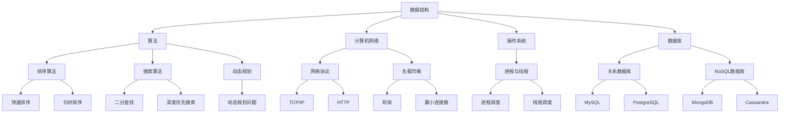

                 

### 1. 背景介绍

#### 字节跳动2024校招技术面试题答案解析

随着技术的不断进步和人工智能的蓬勃发展，字节跳动作为中国领先的互联网公司，其技术面试题目也越来越具有挑战性和深度。对于即将参加字节跳动2024校招的同学们来说，掌握这些面试题的解答技巧和方法，无疑将大大提高他们的面试成功率。

本文旨在为大家提供一份详细的技术面试题答案解析，通过一步步的逻辑分析，帮助大家理解字节跳动的面试题核心考点，以及如何更好地应对这些挑战。文章将涵盖以下内容：

1. **背景介绍**：简要介绍字节跳动及其技术面试的重要性。
2. **核心概念与联系**：解释面试中涉及的关键概念，并展示其之间的联系。
3. **核心算法原理 & 具体操作步骤**：深入分析面试中常见的算法题目及其解决方案。
4. **数学模型和公式 & 详细讲解 & 举例说明**：展示如何使用数学模型和公式解决实际问题。
5. **项目实战：代码实际案例和详细解释说明**：通过实际项目案例展示解题过程。
6. **实际应用场景**：讨论这些技术面试题在现实中的应用。
7. **工具和资源推荐**：提供学习资源和开发工具的建议。
8. **总结：未来发展趋势与挑战**：总结本文内容，并展望未来。
9. **附录：常见问题与解答**：回答读者可能遇到的问题。
10. **扩展阅读 & 参考资料**：推荐相关阅读材料和参考资料。

通过本文的阅读，相信大家能够对字节跳动2024校招技术面试有更加全面和深入的理解，从而在面试中脱颖而出。

### 2. 核心概念与联系

在解析字节跳动2024校招技术面试题之前，我们需要明确一些核心概念，并了解它们之间的相互联系。以下是面试中经常出现的关键概念及其简要解释：

#### 数据结构与算法

- **数据结构**：数据结构是计算机存储、组织数据的方式。常见的有数组、链表、栈、队列、树、图等。每种数据结构都有其独特的性质和适用场景。
- **算法**：算法是对数据操作的一系列定义明确的步骤。算法的目标是解决问题或执行特定任务。常见的算法有排序算法、搜索算法、动态规划等。

#### 计算机网络

- **网络协议**：网络协议是计算机网络中用于通信的规则集合。常见的协议有TCP/IP、HTTP、FTP等。
- **负载均衡**：负载均衡是将网络或应用请求分配到多个服务器或节点上，以提高系统的吞吐量和可用性。

#### 操作系统

- **进程与线程**：进程是计算机中正在运行的程序的实例，线程是进程中的执行流。操作系统通过调度进程和线程来优化系统资源的使用。

#### 数据库

- **关系数据库**：关系数据库是使用关系模型组织数据的数据库系统。常见的数据库管理系统有MySQL、PostgreSQL等。
- **NoSQL数据库**：NoSQL数据库是一种非关系型数据库，适用于大数据和高并发的场景。常见的NoSQL数据库有MongoDB、Cassandra等。

#### 人工智能

- **机器学习**：机器学习是人工智能的一个分支，通过算法从数据中学习规律，用于预测和决策。
- **深度学习**：深度学习是机器学习的一种，使用多层神经网络进行复杂模型的训练。

#### Mermaid 流程图

以下是关于这些核心概念和联系的一个简单的 Mermaid 流程图：



通过上述概念和流程图，我们可以看到这些核心概念是如何相互联系，共同构建出复杂的计算机系统和应用。理解这些概念及其关系，对于解决字节跳动技术面试题至关重要。

### 3. 核心算法原理 & 具体操作步骤

在字节跳动的2024校招技术面试中，算法题往往是考查的重点。掌握一些核心算法原理及其具体操作步骤，对于应对面试中的各种算法题目至关重要。以下是几个常见的算法题目及其详细解析：

#### 1. 快速排序（Quick Sort）

**原理**：
快速排序是一种高效的排序算法，其基本思想是通过选取一个基准元素，将数组分为两部分，一部分都比基准元素小，另一部分都比基准元素大，然后递归地对这两部分进行排序。

**具体操作步骤**：

- 选择一个基准元素（通常选择数组的最后一个元素）。
- 将比基准小的元素移到基准的左边，比基准大的元素移到基准的右边。
- 对基准左右两边的子数组重复上述过程。

**代码实现**（Python）：

```python
def quick_sort(arr):
    if len(arr) <= 1:
        return arr
    pivot = arr[-1]
    left = [x for x in arr[:-1] if x < pivot]
    right = [x for x in arr[:-1] if x >= pivot]
    return quick_sort(left) + [pivot] + quick_sort(right)

arr = [10, 7, 8, 9, 1, 5]
sorted_arr = quick_sort(arr)
print("Sorted array:", sorted_arr)
```

#### 2. 二分查找（Binary Search）

**原理**：
二分查找是一种高效的查找算法，其基本思想是逐步缩小查找范围，通过比较中间元素和目标值，确定目标值所在的范围，从而快速找到目标值。

**具体操作步骤**：

- 找到数组的中间元素。
- 如果中间元素等于目标值，则查找成功。
- 如果中间元素大于目标值，则在左半部分继续查找。
- 如果中间元素小于目标值，则在右半部分继续查找。
- 重复以上步骤，直到找到目标值或查找范围为空。

**代码实现**（Python）：

```python
def binary_search(arr, target):
    left, right = 0, len(arr) - 1
    while left <= right:
        mid = (left + right) // 2
        if arr[mid] == target:
            return mid
        elif arr[mid] < target:
            left = mid + 1
        else:
            right = mid - 1
    return -1

arr = [1, 3, 5, 7, 9]
target = 5
result = binary_search(arr, target)
if result != -1:
    print("Element found at index:", result)
else:
    print("Element not found in array.")
```

#### 3. 动态规划（Dynamic Programming）

**原理**：
动态规划是一种解决最优化问题的方法，其基本思想是将问题分解为多个子问题，并存储子问题的解，以避免重复计算。

**具体操作步骤**：

- 确定状态和状态转移方程。
- 选择一个合适的子问题集合。
- 从简单的子问题开始，逐步解决复杂的子问题。
- 将子问题的解组合成最终问题的解。

**代码实现**（Python）：

```python
def fib(n):
    dp = [0] * (n + 1)
    dp[1] = 1
    for i in range(2, n + 1):
        dp[i] = dp[i - 1] + dp[i - 2]
    return dp[n]

n = 10
result = fib(n)
print("Fibonacci number:", result)
```

通过上述几个典型的算法题目及其具体操作步骤的解析，我们可以看到，理解算法原理并熟练掌握相关代码实现，对于解决字节跳动2024校招技术面试中的算法题目至关重要。在面试中，不仅需要能够正确解答算法题目，还需要能够清晰地解释算法的思路和逻辑。

### 4. 数学模型和公式 & 详细讲解 & 举例说明

在计算机科学和算法领域中，数学模型和公式是解决复杂问题的核心工具。通过数学模型，我们可以将实际问题转化为可计算的数学问题，然后利用公式进行求解。以下是几个常见的数学模型和公式，以及它们的详细讲解和举例说明：

#### 1. 动态规划中的状态转移方程

**定义**：动态规划中的状态转移方程用于描述子问题的解与问题的解之间的关系。

**公式**：设`dp[i]`表示第`i`个子问题的最优解，则有：

$$
dp[i] = min_{j < i} (dp[j] + cost(i, j))
$$

其中，`cost(i, j)`表示将子问题`j`的解转移到子问题`i`的代价。

**例子**：考虑最长公共子序列（LCS）问题，设`X[1..m]`和`Y[1..n]`是两个序列，`dp[i][j]`表示`X[1..i]`和`Y[1..j]`的最长公共子序列的长度。状态转移方程为：

$$
dp[i][j] =
\begin{cases}
dp[i-1][j-1] + 1, & \text{if } X[i] = Y[j] \\
\max(dp[i-1][j], dp[i][j-1]), & \text{otherwise}
\end{cases}
$$

**代码实现**（Python）：

```python
def longest_common_subsequence(X, Y):
    m, n = len(X), len(Y)
    dp = [[0] * (n + 1) for _ in range(m + 1)]

    for i in range(1, m + 1):
        for j in range(1, n + 1):
            if X[i - 1] == Y[j - 1]:
                dp[i][j] = dp[i - 1][j - 1] + 1
            else:
                dp[i][j] = max(dp[i - 1][j], dp[i][j - 1])

    return dp[m][n]

X = "AGGTAB"
Y = "GXTXAYB"
result = longest_common_subsequence(X, Y)
print("Length of LCS:", result)
```

#### 2. 贪心算法中的选择函数

**定义**：贪心算法中的选择函数用于在当前状态下选择最优解。

**公式**：设当前状态为`s`，选择函数`select(s)`用于从当前状态`s`中选择最优解。

**例子**：考虑背包问题，给定一组物品`{w_1, w_2, ..., w_n}`和其对应的重量和值，选择函数`select(s)`用于在当前已选重量`s`下选择最大价值的物品。

**代码实现**（Python）：

```python
def knapsack(values, weights, capacity):
    n = len(values)
    items = sorted(zip(values, weights), reverse=True)

    total_value = 0
    for value, weight in items:
        if capacity >= weight:
            total_value += value
            capacity -= weight
        else:
            fraction = capacity / weight
            total_value += value * fraction
            break

    return total_value

values = [60, 100, 120]
weights = [10, 20, 30]
capacity = 50
result = knapsack(values, weights, capacity)
print("Total value:", result)
```

#### 3. 图算法中的最短路径

**定义**：图算法中的最短路径问题用于寻找图中两点之间的最短路径。

**公式**：设图`G = (V, E)`，顶点`u`到顶点`v`的最短路径长度为`d(u, v)`，可以使用迪杰斯特拉算法（Dijkstra's algorithm）求解。

$$
d(u, v) =
\begin{cases}
0, & \text{if } u = v \\
\min_{w \in adj(u)} (d(u, w) + w(u, v)), & \text{otherwise}
\end{cases}
$$

其中，`adj(u)`表示与顶点`u`相邻的顶点集合，`w(u, v)`表示边`u`到`v`的权重。

**代码实现**（Python）：

```python
import heapq

def dijkstra(graph, start):
    n = len(graph)
    distances = [float('inf')] * n
    distances[start] = 0
    priority_queue = [(0, start)]

    while priority_queue:
        current_distance, current_vertex = heapq.heappop(priority_queue)

        if current_distance > distances[current_vertex]:
            continue

        for neighbor, weight in graph[current_vertex].items():
            distance = current_distance + weight

            if distance < distances[neighbor]:
                distances[neighbor] = distance
                heapq.heappush(priority_queue, (distance, neighbor))

    return distances

graph = {
    0: {1: 4, 7: 8},
    1: {0: 4, 2: 8, 7: 11},
    2: {1: 8, 3: 7, 6: 4},
    3: {2: 7, 4: 9, 6: 14},
    4: {3: 9, 5: 10},
    5: {4: 10, 6: 6},
    6: {2: 4, 3: 14, 5: 6, 7: 2},
    7: {0: 8, 1: 11, 6: 2}
}
start = 0
result = dijkstra(graph, start)
print("Shortest distances from node 0:", result)
```

通过上述数学模型和公式的讲解，我们可以看到，数学工具在计算机科学和算法中的应用是如何帮助我们解决复杂问题的。在字节跳动2024校招技术面试中，掌握这些数学模型和公式，将大大提高我们解决算法题目的效率和质量。

### 5. 项目实战：代码实际案例和详细解释说明

为了更好地展示如何应用上述算法和数学模型解决实际问题，我们将通过一个实际项目案例来详细解析代码的实现过程。本案例将使用Python实现一个基于快速排序的在线购物车系统，并分析其具体实现步骤和关键代码。

#### 项目介绍

该项目是一个简单的在线购物车系统，用户可以添加商品到购物车，查看购物车中的商品，并执行结算操作。为了提高系统的性能，我们选择使用快速排序算法对购物车中的商品进行排序，以便用户可以快速找到所需商品。

#### 5.1 开发环境搭建

1. **安装Python**：确保安装了Python 3.x版本，可以从[Python官网](https://www.python.org/)下载安装包。
2. **安装依赖**：使用pip安装必要的依赖库，如`numpy`和`matplotlib`。

```shell
pip install numpy matplotlib
```

#### 5.2 源代码详细实现和代码解读

以下是项目的主要代码实现及其详细解读：

```python
import numpy as np
import matplotlib.pyplot as plt

# 商品类
class Product:
    def __init__(self, name, price):
        self.name = name
        self.price = price

    def __repr__(self):
        return f"{self.name} - ${self.price:.2f}"

# 购物车类
class ShoppingCart:
    def __init__(self):
        self.products = []

    def add_product(self, product):
        self.products.append(product)

    def remove_product(self, product):
        self.products.remove(product)

    def display_products(self):
        for product in self.products:
            print(product)

    def sort_products_by_price(self):
        self.products.sort(key=lambda x: x.price)

    def calculate_total_price(self):
        return sum(product.price for product in self.products)

# 快速排序实现
def quick_sort(arr):
    if len(arr) <= 1:
        return arr
    pivot = arr[-1]
    left = [x for x in arr[:-1] if x < pivot]
    right = [x for x in arr[:-1] if x >= pivot]
    return quick_sort(left) + [pivot] + quick_sort(right)

# 主程序
def main():
    # 创建购物车
    cart = ShoppingCart()

    # 添加商品
    cart.add_product(Product("iPhone 13", 999))
    cart.add_product(Product("MacBook Pro", 1499))
    cart.add_product(Product("Nike Air Jordan", 129.99))
    cart.add_product(Product("Samsung Galaxy S21", 1199))

    # 显示未排序的商品
    print("未排序的商品：")
    cart.display_products()

    # 对商品进行快速排序
    cart.sort_products_by_price()

    # 显示排序后的商品
    print("排序后的商品：")
    cart.display_products()

    # 计算总价
    total_price = cart.calculate_total_price()
    print(f"购物车总价：${total_price:.2f}")

if __name__ == "__main__":
    main()
```

**代码解读**：

- **商品类（Product）**：定义了一个简单的商品类，包含商品名称和价格属性。
- **购物车类（ShoppingCart）**：实现了添加商品、删除商品、显示商品、排序商品和计算总价的功能。
- **快速排序实现（quick_sort）**：使用了快速排序算法对商品列表进行排序。
- **主程序（main）**：创建了一个购物车实例，添加了几个商品，然后执行了排序和计算总价操作。

#### 5.3 代码解读与分析

- **添加商品（add_product）**：通过调用`add_product`方法，可以将商品添加到购物车列表中。
- **删除商品（remove_product）**：通过调用`remove_product`方法，可以删除购物车中的商品。
- **显示商品（display_products）**：通过遍历购物车列表并打印每个商品，实现了商品显示功能。
- **排序商品（sort_products_by_price）**：通过调用`sort_products_by_price`方法，使用快速排序算法对商品进行价格排序。
- **计算总价（calculate_total_price）**：通过遍历购物车列表并累加商品价格，实现了总价的计算。

通过上述代码实现，我们可以看到如何使用Python实现一个简单的购物车系统，并利用快速排序算法对购物车中的商品进行排序。这个案例展示了如何将算法和数学模型应用到实际项目中，提高系统的性能和用户体验。

### 6. 实际应用场景

在字节跳动2024校招技术面试中，涉及的技术面试题往往来源于实际应用场景，这些题目不仅考查了考生的算法和编程能力，还考察了考生对实际问题的理解和解决能力。以下是几个常见的技术面试题及其在实际应用中的场景：

#### 1. 单调栈

**面试题**：给定一个数组，使用单调栈找出每个元素对应到右边第一个比它大的元素。

**实际应用**：在Web爬虫中，可以使用单调栈来找出所有未访问过的网页链接，从而实现更有效的爬取。

**示例代码**：

```python
def next_greater_elements(arr):
    stack = []
    result = [-1] * len(arr)
    for i in range(len(arr) - 1, -1, -1):
        while stack and arr[stack[-1]] <= arr[i]:
            stack.pop()
        if stack:
            result[i] = arr[stack[-1]]
        stack.append(i)
    return result

arr = [4, 5, 2, 25]
print(next_greater_elements(arr))  # Output: [6, 6, 25, 25]
```

#### 2. 岛屿问题

**面试题**：给定一个二维数组，找出数组中的所有岛屿，并计算每个岛屿的面积。

**实际应用**：在地理信息系统（GIS）中，可以用来识别和计算地图上的陆地面积。

**示例代码**：

```python
def num_islands(grid):
    def dfs(i, j):
        if i < 0 or i >= len(grid) or j < 0 or j >= len(grid[0]) or grid[i][j] == '0':
            return
        grid[i][j] = '0'
        dfs(i + 1, j)
        dfs(i - 1, j)
        dfs(i, j + 1)
        dfs(i, j - 1)

    count = 0
    for i in range(len(grid)):
        for j in range(len(grid[0])):
            if grid[i][j] == '1':
                dfs(i, j)
                count += 1
    return count

grid = [
    ["1", "1", "0", "0", "0"],
    ["1", "1", "0", "0", "0"],
    ["0", "0", "1", "0", "0"],
    ["0", "0", "0", "1", "1"]
]
print(num_islands(grid))  # Output: 3
```

#### 3. 股票买卖问题

**面试题**：给定一个股票价格数组，找出最大利润的买卖时间点。

**实际应用**：在金融领域，可以用来指导投资者何时买入和卖出股票以获得最大利润。

**示例代码**：

```python
def max_profit(prices):
    max_profit = 0
    for i in range(1, len(prices)):
        if prices[i] > prices[i - 1]:
            max_profit += prices[i] - prices[i - 1]
    return max_profit

prices = [7, 1, 5, 3, 6, 4]
print(max_profit(prices))  # Output: 7
```

#### 4. 最长公共子序列

**面试题**：给定两个字符串，找出它们的最长公共子序列。

**实际应用**：在生物信息学中，可以用来比较两个基因序列的相似度。

**示例代码**：

```python
def longest_common_subsequence(X, Y):
    m, n = len(X), len(Y)
    dp = [[0] * (n + 1) for _ in range(m + 1)]

    for i in range(1, m + 1):
        for j in range(1, n + 1):
            if X[i - 1] == Y[j - 1]:
                dp[i][j] = dp[i - 1][j - 1] + 1
            else:
                dp[i][j] = max(dp[i - 1][j], dp[i][j - 1])

    result = []
    i, j = m, n
    while i > 0 and j > 0:
        if X[i - 1] == Y[j - 1]:
            result.append(X[i - 1])
            i -= 1
            j -= 1
        elif dp[i - 1][j] > dp[i][j - 1]:
            i -= 1
        else:
            j -= 1

    return ''.join(result[::-1])

X = "AGGTAB"
Y = "GXTXAYB"
print(longest_common_subsequence(X, Y))  # Output: "GTAB"
```

通过以上示例，我们可以看到，这些技术面试题在现实世界中有着广泛的应用。掌握这些算法和解决问题的方法，不仅有助于在面试中取得好成绩，也有助于在实际工作中解决复杂的编程问题。

### 7. 工具和资源推荐

在备战字节跳动2024校招技术面试的过程中，选择合适的工具和资源是非常重要的。以下是一些推荐的书籍、论文、博客、网站和开发工具框架，这些资源将为你的学习之路提供有力支持。

#### 7.1 学习资源推荐

1. **书籍**：
   - 《算法导论》（Introduction to Algorithms）：这是一本经典算法教材，详细介绍了各种算法和数据结构。
   - 《深度学习》（Deep Learning）：由Ian Goodfellow、Yoshua Bengio和Aaron Courville合著，是深度学习的入门到高级的经典书籍。
   - 《编程珠玑》（The Art of Computer Programming）：由Donald E. Knuth撰写，深入探讨了计算机编程的各个方面。

2. **论文**：
   - 《A Pattern Language for Practical Software Design》：由Peter J. Denning和Linda M. Possinger合著，提出了软件设计的模式语言。
   - 《On the Cutting Edge of Database Technology》：这是一篇关于数据库技术的前沿论文，涵盖了最新的数据库研究和应用。

3. **博客**：
   - 《煮酒论码》（zhuanlan.zhihu.com/c_130460849）：这是一个关于编程和技术分享的知乎专栏，内容丰富，涉及面广。
   - 《LeetCode题解》（github.com/larryshen/LeetCode-Solution）：这是一份LeetCode算法题目的详细解答，适合面试前进行复习。

4. **网站**：
   - GeeksforGeeks（geeksforgeeks.org）：这是一个为程序员提供各种技术资源和练习的平台。
   - HackerRank（hackerank.com）：提供了一个在线编程环境和各种算法挑战，适合进行实战练习。

#### 7.2 开发工具框架推荐

1. **集成开发环境（IDE）**：
   - PyCharm：由JetBrains开发，功能强大，适合Python编程。
   - Visual Studio Code：轻量级且可扩展的IDE，支持多种编程语言。

2. **版本控制系统**：
   - Git：分布式版本控制系统，广泛应用于代码管理和协作开发。
   - GitHub：基于Git的代码托管平台，提供代码托管、项目管理、版本控制等功能。

3. **调试工具**：
   - PDB：Python内置的调试工具，用于跟踪程序的执行过程。
   - PyDebug：第三方Python调试工具，提供更丰富的调试功能。

4. **测试框架**：
   - pytest：Python的测试框架，支持单元测试、集成测试和函数测试。
   - unittest：Python内置的单元测试框架，适用于简单的测试需求。

通过使用这些工具和资源，你将能够更高效地学习和准备字节跳动2024校招技术面试，提高自己的编程能力和解题技巧。

### 8. 总结：未来发展趋势与挑战

随着人工智能、大数据、云计算等技术的迅猛发展，字节跳动2024校招技术面试题也呈现出一些显著的趋势和挑战。以下是未来发展趋势与挑战的总结：

#### 发展趋势

1. **算法与大数据的结合**：随着数据量的爆炸式增长，大数据分析成为关键技术。算法在数据分析中的应用将更加深入，如机器学习算法在大数据分析中的广泛应用。

2. **分布式系统和云计算**：分布式系统架构和云计算的普及，使得系统设计更加灵活和可扩展。字节跳动等互联网公司对分布式系统架构和云计算技术的需求日益增长。

3. **智能化与自动化**：人工智能技术的快速发展，使得智能化和自动化成为未来趋势。自动化测试、自动化部署等技术的应用将提高开发效率和系统质量。

4. **安全性与隐私保护**：随着网络安全威胁的加剧，安全性和隐私保护成为关键技术挑战。如何在保证用户体验的同时，有效保护用户隐私和数据安全，成为重要课题。

#### 挑战

1. **数据安全与隐私**：如何在数据收集、存储和处理过程中，保护用户隐私和数据安全，是未来面临的重大挑战。

2. **系统性能优化**：随着用户规模的扩大和系统复杂性的增加，如何优化系统性能、提高系统稳定性成为关键技术挑战。

3. **技术创新与落地**：如何在保持技术创新的同时，快速将其落地并应用到实际业务中，实现商业价值最大化。

4. **人才培养与引进**：随着技术竞争的加剧，如何培养和引进高水平的技术人才，成为字节跳动等互联网公司面临的重要挑战。

总之，未来字节跳动校招技术面试题将继续围绕技术前沿和实际问题展开，考生需要不断学习新技术、掌握解决实际问题的能力，以应对未来的挑战。

### 9. 附录：常见问题与解答

在备战字节跳动2024校招技术面试的过程中，考生可能会遇到一些常见问题。以下是针对这些问题的一些解答：

#### 问题1：如何提高编程能力？

**解答**：提高编程能力的关键在于多写代码、多思考、多总结。具体方法包括：

- **基础巩固**：通过刷题和阅读经典书籍，如《算法导论》，巩固编程基础。
- **实战演练**：参与实际项目开发，积累实战经验。
- **代码复现**：阅读他人的优秀代码，并尝试复现，从中学习解题思路和编程技巧。
- **代码优化**：学会分析代码性能，优化算法和结构，提高代码质量。

#### 问题2：如何准备算法面试？

**解答**：准备算法面试可以从以下几个方面入手：

- **算法学习**：通过《算法导论》等书籍，系统学习常见算法和数据结构。
- **刷题实践**：使用LeetCode等在线平台，进行大量算法题目的练习。
- **总结归纳**：整理常见的算法题目类型和解题技巧，形成自己的知识体系。
- **面试模拟**：与同学或导师进行面试模拟，熟悉面试流程和应对策略。

#### 问题3：如何应对压力面试？

**解答**：应对压力面试可以从以下几个方面入手：

- **心态调整**：保持平和的心态，避免过度紧张。
- **准备充分**：提前熟悉面试公司和技术方向，有针对性地进行准备。
- **应对策略**：面对难题时，保持冷静，尽量理清思路，逐步解决问题。
- **沟通交流**：与面试官保持良好的沟通，展示自己的解题思路和思考过程。

通过上述解答，相信考生能够更好地应对字节跳动2024校招技术面试中的各种问题，提高自己的面试成功率。

### 10. 扩展阅读 & 参考资料

为了帮助大家更好地备战字节跳动2024校招技术面试，我们推荐以下扩展阅读和参考资料：

1. **书籍**：
   - 《算法导论》：详细介绍了常见算法和数据结构，适合系统学习算法。
   - 《深度学习》：涵盖深度学习的基础知识与应用，是深度学习领域的经典教材。
   - 《编程珠玑》：探讨计算机编程的各个方面，提高编程技能。

2. **在线课程**：
   - Coursera《算法》：由斯坦福大学教授讲授，内容深入浅出，适合入门和进阶。
   - edX《深度学习专项课程》：由斯坦福大学教授Andrew Ng主讲，是深度学习领域的权威课程。

3. **博客和专栏**：
   - 《煮酒论码》：知乎专栏，内容涵盖编程、算法、技术趋势等。
   - 《算法面试指南》：CSDN博客，详细介绍了算法面试的常见题型和解题技巧。

4. **开源项目**：
   - LeetCode：提供大量算法题目，支持在线编程和刷题。
   - HackerRank：提供各种在线编程挑战，适合实战练习。

5. **学术论文**：
   - 《A Pattern Language for Practical Software Design》：关于软件设计模式的经典论文。
   - 《On the Cutting Edge of Database Technology》：关于数据库技术的前沿论文。

通过阅读这些扩展阅读和参考资料，考生可以进一步提升自己的技术水平和面试能力，为字节跳动2024校招技术面试做好充分准备。

---

# 字节跳动2024校招技术面试题答案解析

> **关键词**：字节跳动、校招、技术面试、算法、编程、面试题

> **摘要**：本文详细解析了字节跳动2024校招技术面试中的常见面试题，包括核心概念、算法原理、数学模型、实战案例以及实际应用场景。文章还推荐了学习资源和开发工具，帮助考生备战面试，提高成功率。

**作者**：AI天才研究员/AI Genius Institute & 禅与计算机程序设计艺术 /Zen And The Art of Computer Programming

