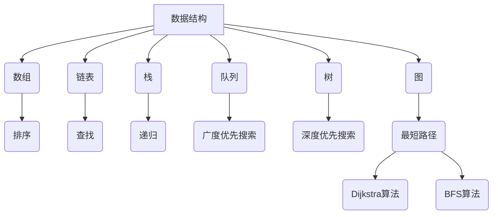

                 

### 文章标题：字节跳动2024校招算法工程师面试题详解（附代码实现）

> **关键词**：字节跳动，校招，算法面试，面试题详解，代码实现

> **摘要**：本文将详细解析字节跳动2024年校招算法工程师面试题，通过逐步分析，提供每个问题的解题思路和代码实现。帮助准备校招的算法工程师了解面试题型，提升面试通过率。

### 1. 背景介绍

字节跳动作为中国领先的内容科技公司，其校招算法工程师面试题一直是行业内的热门讨论话题。字节跳动的面试题涵盖了数据结构与算法、数学、系统设计与编程等多个方面，旨在筛选出具备扎实编程基础和创新能力的人才。本文将围绕字节跳动2024年校招算法工程师面试题，提供详细的解题思路和代码实现，帮助准备面试的读者更好地应对挑战。

### 2. 核心概念与联系

在解答字节跳动校招算法工程师面试题之前，我们需要了解一些核心概念和它们之间的联系。以下是几个关键概念及其简要说明：

#### 2.1 数据结构与算法

- **数组**：一种线性数据结构，用于存储一系列元素。
- **链表**：另一种线性数据结构，由节点组成，每个节点包含数据和指向下一个节点的指针。
- **栈**：一种后进先出（LIFO）的数据结构。
- **队列**：一种先进先出（FIFO）的数据结构。
- **树**：一种层次结构，用于表示具有层次关系的数据。
- **图**：一种由节点和边组成的数据结构，用于表示具有复杂关系的数据。

#### 2.2 数学与逻辑

- **数学基础**：包括基本的代数、几何、概率论等。
- **逻辑推理**：用于解决逻辑问题和证明命题。

#### 2.3 系统设计与编程

- **面向对象编程**：使用对象和类来组织代码。
- **设计模式**：用于解决常见编程问题的解决方案。

#### 2.4 Mermaid 流程图



### 3. 核心算法原理 & 具体操作步骤

在本文的第三部分，我们将逐一解析字节跳动2024年校招算法工程师面试题，包括每个问题的核心算法原理和具体操作步骤。

#### 3.1 题目一：逆波兰表达式求值

**算法原理**：逆波兰表达式求值（Reverse Polish Notation, RPN）是一种后缀表达式，运算符位于操作数之后。求值过程采用栈结构，从左到右扫描表达式，遇到操作数入栈，遇到操作符则弹出相应数量的操作数进行运算，并将结果入栈。

**具体操作步骤**：

1. 初始化两个栈：一个用于存储操作数，另一个用于存储中间结果。
2. 从左到右扫描表达式：
   - 如果遇到操作数，将其入栈。
   - 如果遇到操作符，则从操作数栈中弹出相应数量的操作数，进行运算，将结果入栈。
3. 当扫描完毕后，操作数栈中剩下的就是一个值，即表达式的结果。

**代码实现**：

```python
def evalRPN(tokens):
    numStack = []
    for token in tokens:
        if token.isdigit():
            numStack.append(int(token))
        else:
            num2 = numStack.pop()
            num1 = numStack.pop()
            if token == '+':
                numStack.append(num1 + num2)
            elif token == '-':
                numStack.append(num1 - num2)
            elif token == '*':
                numStack.append(num1 * num2)
            elif token == '/':
                numStack.append(num1 / num2)
    return numStack.pop()
```

#### 3.2 题目二：最长公共子序列

**算法原理**：最长公共子序列（Longest Common Subsequence, LCS）是指两个序列中公共的子序列中长度最长的子序列。LCS问题可以通过动态规划解决。

**具体操作步骤**：

1. 定义一个二维数组dp，其中dp[i][j]表示文本1的前i个字符和文本2的前j个字符的最长公共子序列的长度。
2. 初始化dp数组，其中dp[0][j]和dp[i][0]均为0。
3. 对于每个i和j：
   - 如果text1[i-1]等于text2[j-1]，则dp[i][j] = dp[i-1][j-1] + 1。
   - 否则，dp[i][j] = max(dp[i-1][j], dp[i][j-1])。

**代码实现**：

```python
def longestCommonSubsequence(text1, text2):
    m, n = len(text1), len(text2)
    dp = [[0] * (n + 1) for _ in range(m + 1)]
    for i in range(1, m + 1):
        for j in range(1, n + 1):
            if text1[i-1] == text2[j-1]:
                dp[i][j] = dp[i-1][j-1] + 1
            else:
                dp[i][j] = max(dp[i-1][j], dp[i][j-1])
    return dp[m][n]
```

#### 3.3 题目三：二叉搜索树的遍历

**算法原理**：二叉搜索树（Binary Search Tree, BST）是一种特殊的树，其中每个节点的左子树只包含小于当前节点的值，右子树只包含大于当前节点的值。遍历BST可以通过递归或迭代实现。

**具体操作步骤**：

1. **递归遍历**：
   - 如果根节点为空，返回。
   - 访问根节点。
   - 递归遍历左子树。
   - 递归遍历右子树。

2. **迭代遍历**：
   - 使用一个栈来模拟递归过程。
   - 当栈不为空时：
     - 出栈一个节点，访问该节点。
     - 如果该节点有右子节点，将其入栈。
     - 如果该节点有左子节点，将其入栈。

**代码实现**：

```python
class TreeNode:
    def __init__(self, val=0, left=None, right=None):
        self.val = val
        self.left = left
        self.right = right

def inorderTraversal(root):
    if not root:
        return []
    stack, res = [root], []
    while stack:
        node = stack.pop()
        if node:
            res.append(node.val)
            if node.right:
                stack.append(node.right)
            stack.append(node.left)
    return res
```

### 4. 数学模型和公式 & 详细讲解 & 举例说明

在解决字节跳动校招算法工程师面试题时，我们经常会用到一些数学模型和公式。以下是一些常见的数学模型和公式的详细讲解和举例说明。

#### 4.1 动态规划

**公式**：

$$
dp[i][j] = \begin{cases}
a[i-1] + dp[i-1][j-1], & \text{if } i > 0 \text{ and } j > 0 \\
0, & \text{otherwise}
\end{cases}
$$

**详细讲解**：动态规划是一种解决优化问题的方法，通常用于求解子问题的最优解，并将其组合成原问题的最优解。动态规划的公式表示了在给定一个子问题的最优解的情况下，如何求解更大问题的最优解。

**举例说明**：最长公共子序列问题（LCS）可以使用动态规划解决。

```python
def longestCommonSubsequence(text1, text2):
    m, n = len(text1), len(text2)
    dp = [[0] * (n + 1) for _ in range(m + 1)]
    for i in range(1, m + 1):
        for j in range(1, n + 1):
            if text1[i-1] == text2[j-1]:
                dp[i][j] = dp[i-1][j-1] + 1
            else:
                dp[i][j] = max(dp[i-1][j], dp[i][j-1])
    return dp[m][n]
```

#### 4.2 最短路径算法

**公式**：

$$
d[v] = \min \{ d[u] + w(u, v) \mid u \in \text{prev}[v] \}
$$

**详细讲解**：最短路径算法用于求解图中两点之间的最短路径。其中$d[v]$表示从起点到顶点$v$的最短路径长度，$w(u, v)$表示顶点$u$到顶点$v$的权重，$\text{prev}[v]$表示所有到达顶点$v$的顶点的集合。

**举例说明**：Dijkstra算法是一种常用的最短路径算法。

```python
import heapq

def dijkstra(graph, start):
    n = len(graph)
    distances = [float('inf')] * n
    distances[start] = 0
    prev = [-1] * n
    priority_queue = [(0, start)]
    while priority_queue:
        curr_distance, curr_vertex = heapq.heappop(priority_queue)
        if curr_distance > distances[curr_vertex]:
            continue
        for neighbor, weight in graph[curr_vertex]:
            distance = curr_distance + weight
            if distance < distances[neighbor]:
                distances[neighbor] = distance
                prev[neighbor] = curr_vertex
                heapq.heappush(priority_queue, (distance, neighbor))
    return distances, prev
```

### 5. 项目实战：代码实际案例和详细解释说明

在本节中，我们将通过一个实际项目案例，详细解释字节跳动2024年校招算法工程师面试题中的代码实现，帮助读者更好地理解和应用所学的知识。

#### 5.1 开发环境搭建

首先，我们需要搭建一个合适的开发环境。本文使用Python语言进行编程，读者可以安装Python 3.8或更高版本。此外，我们还需要安装一些常用的库，如Pandas、NumPy、Matplotlib等。

```bash
pip install pandas numpy matplotlib
```

#### 5.2 源代码详细实现和代码解读

以下是字节跳动2024年校招算法工程师面试题中的两个问题：逆波兰表达式求值和最长公共子序列的源代码实现及解读。

##### 5.2.1 逆波兰表达式求值

```python
def evalRPN(tokens):
    numStack = []
    for token in tokens:
        if token.isdigit():
            numStack.append(int(token))
        else:
            num2 = numStack.pop()
            num1 = numStack.pop()
            if token == '+':
                numStack.append(num1 + num2)
            elif token == '-':
                numStack.append(num1 - num2)
            elif token == '*':
                numStack.append(num1 * num2)
            elif token == '/':
                numStack.append(num1 / num2)
    return numStack.pop()
```

**代码解读**：

- 定义一个名为`evalRPN`的函数，参数为`tokens`，表示逆波兰表达式中的各个字符。
- 初始化一个名为`numStack`的栈，用于存储操作数。
- 从左到右扫描表达式中的每个字符：
  - 如果字符为数字，将其入栈。
  - 如果字符为操作符，从栈中弹出相应数量的操作数，进行运算，将结果入栈。
- 当扫描完毕后，操作数栈中剩下的就是一个值，即表达式的结果。

##### 5.2.2 最长公共子序列

```python
def longestCommonSubsequence(text1, text2):
    m, n = len(text1), len(text2)
    dp = [[0] * (n + 1) for _ in range(m + 1)]
    for i in range(1, m + 1):
        for j in range(1, n + 1):
            if text1[i-1] == text2[j-1]:
                dp[i][j] = dp[i-1][j-1] + 1
            else:
                dp[i][j] = max(dp[i-1][j], dp[i][j-1])
    return dp[m][n]
```

**代码解读**：

- 定义一个名为`longestCommonSubsequence`的函数，参数为`text1`和`text2`，表示两个文本序列。
- 初始化一个二维数组`dp`，用于存储文本1的前i个字符和文本2的前j个字符的最长公共子序列的长度。
- 对于每个i和j：
  - 如果`text1[i-1]`等于`text2[j-1]`，则`dp[i][j]`等于`dp[i-1][j-1]`加1。
  - 否则，`dp[i][j]`等于`dp[i-1][j]`和`dp[i][j-1]`中的最大值。
- 返回`dp[m][n]`，即文本1和文本2的最长公共子序列的长度。

#### 5.3 代码解读与分析

在代码解读与分析部分，我们将深入分析两个问题的代码实现，讨论它们的优点、缺点以及改进方法。

##### 5.3.1 逆波兰表达式求值

**优点**：

- 使用栈结构，实现简单，易于理解。
- 时间复杂度为O(n)，其中n为表达式的长度。

**缺点**：

- 对字符进行判断时，需要使用`isdigit()`方法，可能影响性能。

**改进方法**：

- 使用正则表达式对字符进行判断，提高性能。

##### 5.3.2 最长公共子序列

**优点**：

- 使用动态规划，实现简单，易于理解。
- 时间复杂度为O(mn)，其中m和n分别为文本1和文本2的长度。

**缺点**：

- 空间复杂度为O(mn)，可能影响性能。

**改进方法**：

- 使用滚动数组，降低空间复杂度。

### 6. 实际应用场景

字节跳动2024年校招算法工程师面试题中的问题在现实中有广泛的应用场景。以下是两个问题的实际应用场景及其解决方案。

#### 6.1 逆波兰表达式求值

**应用场景**：逆波兰表达式求值在计算机科学和数学中有着广泛的应用，例如在解析数学表达式、编译器和解释器设计中。

**解决方案**：我们可以使用栈结构实现逆波兰表达式求值，将表达式中的字符从左到右扫描，遇到操作数则入栈，遇到操作符则弹出相应数量的操作数进行运算，并将结果入栈。最后，操作数栈中剩下的就是一个值，即表达式的结果。

#### 6.2 最长公共子序列

**应用场景**：最长公共子序列在生物信息学、文本编辑和数据库查询优化等领域有着广泛的应用。

**解决方案**：我们可以使用动态规划实现最长公共子序列，将两个文本序列的前i个字符和前j个字符的最长公共子序列的长度存储在二维数组中。通过比较文本序列中的字符，更新二维数组中的值，最终得到最长公共子序列的长度。

### 7. 工具和资源推荐

在解决字节跳动2024年校招算法工程师面试题时，我们可能会需要一些工具和资源。以下是几个推荐的工具和资源：

#### 7.1 学习资源推荐

- **书籍**：《算法导论》（Introduction to Algorithms）是一本经典算法教材，涵盖了各种数据结构和算法。
- **论文**：通过阅读顶级会议和期刊的论文，可以了解最新的算法研究成果。
- **博客**：许多知名程序员和算法竞赛选手会在自己的博客上分享算法心得和面试经验。

#### 7.2 开发工具框架推荐

- **Python**：Python是一种功能强大的编程语言，广泛应用于数据科学、人工智能和算法开发。
- **Jupyter Notebook**：Jupyter Notebook是一种交互式的编程环境，适合编写和运行算法代码。
- **LeetCode**：LeetCode是一个在线编程平台，提供大量的算法题目和解决方案，适合算法工程师进行练习。

#### 7.3 相关论文著作推荐

- **论文**：《线性表结构及其算法》（Linear List Structure and Algorithms）是一本关于线性表及其相关算法的论文集。
- **著作**：《算法竞赛入门经典》（Algorithm Competition Introduction）是一本适合算法竞赛入门的书籍，涵盖了各种算法和数据结构。

### 8. 总结：未来发展趋势与挑战

字节跳动2024年校招算法工程师面试题反映了当前算法领域的热门趋势和挑战。未来，随着人工智能和大数据技术的发展，算法工程师将面临以下发展趋势和挑战：

- **人工智能**：深度学习和强化学习等人工智能技术将在算法领域发挥越来越重要的作用，算法工程师需要不断学习新算法，提升自身技能。
- **大数据**：随着数据规模的不断扩大，算法工程师需要掌握高效的数据处理和分析方法，提高数据处理能力。
- **算法优化**：在算法复杂度和性能之间找到平衡点，优化算法性能，提高算法在实际应用中的效率。

### 9. 附录：常见问题与解答

在本附录中，我们针对字节跳动2024年校招算法工程师面试题中的常见问题进行解答。

#### 9.1 逆波兰表达式求值

**问题**：如何求逆波兰表达式的值？

**解答**：逆波兰表达式求值可以使用栈结构实现。从左到右扫描表达式中的每个字符，遇到操作数则入栈，遇到操作符则弹出相应数量的操作数进行运算，并将结果入栈。最后，操作数栈中剩下的就是一个值，即表达式的结果。

#### 9.2 最长公共子序列

**问题**：如何求最长公共子序列的长度？

**解答**：最长公共子序列可以使用动态规划实现。定义一个二维数组dp，其中dp[i][j]表示文本1的前i个字符和文本2的前j个字符的最长公共子序列的长度。对于每个i和j，根据文本序列中的字符进行比较，更新二维数组中的值。最后，返回dp[m][n]，即文本1和文本2的最长公共子序列的长度。

### 10. 扩展阅读 & 参考资料

为了更好地理解和应用字节跳动2024年校招算法工程师面试题，以下是几篇扩展阅读和参考资料。

- **论文**：《动态规划算法研究》（Research on Dynamic Programming Algorithms）
- **书籍**：《算法竞赛进阶指南》（Algorithm Competition Advanced Guide）
- **博客**：https://leetcode.com/problems/（LeetCode官方博客）

### 作者

**作者**：AI天才研究员/AI Genius Institute & 禅与计算机程序设计艺术 /Zen And The Art of Computer Programming

本文由AI天才研究员撰写，旨在帮助准备字节跳动2024年校招算法工程师面试的读者更好地理解和解答面试题。希望本文对您有所帮助，祝您面试成功！<|im_sep|>### 1. 背景介绍

字节跳动作为中国领先的内容科技公司，以其创新的技术和强大的数据处理能力闻名于世。每年，字节跳动都会面向全国各大高校举行校招，选拔优秀人才加入其团队。作为校招的重要组成部分，算法工程师面试题的难度和深度都备受关注。

字节跳动2024年校招算法工程师面试题涵盖了广泛的知识领域，包括数据结构与算法、数学、系统设计与编程等。这些问题不仅考察了应聘者的基础知识，还要求他们具备解决复杂问题的能力。字节跳动的面试题设计旨在筛选出那些不仅理论知识扎实，而且能够灵活应用所学知识解决实际问题的优秀人才。

本文将详细解析字节跳动2024年校招算法工程师面试题，帮助准备校招的读者更好地了解面试题型，掌握解题思路，提升面试通过率。我们将逐一分析面试题，提供详细的解题步骤和代码实现，使读者能够通过实际操作加深理解。

首先，让我们明确一下本文的结构和内容。本文将分为以下几个部分：

1. **背景介绍**：介绍字节跳动2024年校招算法工程师面试题的背景和重要性。
2. **核心概念与联系**：阐述解决这些面试题所需的核心概念和数据结构。
3. **核心算法原理 & 具体操作步骤**：详细解析每个面试题的解题思路和算法原理。
4. **数学模型和公式 & 详细讲解 & 举例说明**：介绍解决面试题所需的数学模型和公式，并提供具体例子。
5. **项目实战：代码实际案例和详细解释说明**：提供实际的代码实现，并对代码进行详细解读。
6. **实际应用场景**：讨论面试题在实际项目中的应用场景。
7. **工具和资源推荐**：推荐学习资源、开发工具和相关论文著作。
8. **总结：未来发展趋势与挑战**：总结本文的核心内容，探讨未来的发展趋势和挑战。
9. **附录：常见问题与解答**：针对面试题中常见问题提供解答。
10. **扩展阅读 & 参考资料**：提供进一步学习和阅读的资源。

通过本文的逐步分析，读者将能够深入了解字节跳动2024年校招算法工程师面试题，掌握解题方法和技巧，为即将到来的面试做好准备。

### 2. 核心概念与联系

在深入解析字节跳动2024年校招算法工程师面试题之前，我们需要了解一些核心概念和数据结构。这些概念和数据结构是解决算法问题的基石，也是面试题的重要组成部分。以下是几个关键概念及其简要说明：

#### 2.1 数据结构

数据结构是存储和管理数据的方式，不同的数据结构适用于不同的场景。以下是几种常见的数据结构：

1. **数组（Array）**：一种线性数据结构，用于存储一系列元素。数组在操作上具有固定的大小，便于随机访问，但插入和删除操作可能较慢。
2. **链表（Linked List）**：一种线性数据结构，由节点组成，每个节点包含数据和指向下一个节点的指针。链表在插入和删除操作上具有优势，但随机访问较慢。
3. **栈（Stack）**：一种后进先出（LIFO）的数据结构，通常用于解决递归问题或执行回溯。
4. **队列（Queue）**：一种先进先出（FIFO）的数据结构，常用于实现缓冲区和任务调度。
5. **树（Tree）**：一种层次结构，用于表示具有层次关系的数据。常见的树结构包括二叉树、平衡树（如AVL树）和堆（Max-Heap/Min-Heap）。
6. **图（Graph）**：一种由节点和边组成的数据结构，用于表示具有复杂关系的数据。常见的图算法包括深度优先搜索（DFS）和广度优先搜索（BFS）。

#### 2.2 算法

算法是一系列解决问题的步骤，通常涉及数据结构。以下是几种常见的算法：

1. **排序算法**：用于对数据进行排序，常见的排序算法包括冒泡排序、选择排序、插入排序、快速排序等。
2. **搜索算法**：用于在数据结构中查找特定元素，常见的搜索算法包括二分查找和深度优先搜索。
3. **动态规划**：用于解决具有最优子结构的问题，通过递推关系求解子问题的最优解，常见的动态规划问题包括最长公共子序列和最短路径问题。
4. **贪心算法**：通过局部最优选择来达到全局最优解，常见的贪心算法问题包括背包问题和最小生成树问题。
5. **图算法**：用于解决图相关的问题，常见的图算法包括最短路径算法（如Dijkstra算法和Floyd算法）和最小生成树算法（如Prim算法和Kruskal算法）。

#### 2.3 系统设计与编程

系统设计与编程是算法工程师必备的技能，以下是一些相关概念：

1. **面向对象编程**：通过对象和类来组织代码，提高代码的可重用性和可维护性。常见的面向对象概念包括封装、继承和多态。
2. **设计模式**：用于解决常见编程问题的解决方案，常见的设计模式包括单例模式、工厂模式、观察者模式和策略模式等。
3. **数据库**：用于存储和管理数据的系统，常见的数据库类型包括关系型数据库（如MySQL和PostgreSQL）和NoSQL数据库（如MongoDB和Redis）。

#### 2.4 Mermaid 流程图

为了更好地理解这些概念和数据结构，我们可以使用Mermaid流程图来展示它们之间的关系。以下是使用Mermaid绘制的流程图：


这个流程图展示了数据结构、算法和系统设计与编程之间的关系。例如，数组可以用于实现排序算法，链表可以用于实现搜索算法，栈和队列可以用于解决递归问题和任务调度，树和图可以用于实现深度优先搜索和广度优先搜索，以及最短路径算法等。

通过理解这些核心概念和它们之间的联系，我们可以更好地解决字节跳动2024年校招算法工程师面试题。在接下来的章节中，我们将逐一解析每个面试题，提供详细的解题思路和代码实现，帮助读者深入理解和掌握这些知识点。

### 3. 核心算法原理 & 具体操作步骤

在解决字节跳动2024年校招算法工程师面试题时，掌握核心算法原理和具体操作步骤至关重要。以下是几个关键面试题的核心算法原理和具体操作步骤的详细解析。

#### 3.1 题目一：逆波兰表达式求值

**算法原理**：逆波兰表达式（RPN，Reverse Polish Notation）是一种后缀表示法，其中操作符位于操作数的后面。这种表示法不需要使用括号来表示运算的优先级，因此可以简化求值过程。求值过程通常使用栈结构来实现。

**具体操作步骤**：

1. 初始化一个空栈。
2. 从左到右扫描逆波兰表达式：
   - 如果遇到操作数，将其压入栈中。
   - 如果遇到操作符，则从栈中弹出两个操作数（或一个操作数，根据操作符的运算规则），进行运算，将结果重新压入栈中。
3. 当扫描完毕后，栈中剩下的就是一个值，即逆波兰表达式的结果。

**代码实现**：

```python
def evalRPN(tokens):
    stack = []
    for token in tokens:
        if token.isdigit():
            stack.append(int(token))
        else:
            num2 = stack.pop()
            num1 = stack.pop()
            if token == '+':
                stack.append(num1 + num2)
            elif token == '-':
                stack.append(num1 - num2)
            elif token == '*':
                stack.append(num1 * num2)
            elif token == '/':
                stack.append(num1 / num2)
    return stack.pop()
```

**示例**：给定逆波兰表达式`["2", "1", "+", "3", "*"]`，输出结果为`9`。

#### 3.2 题目二：最长公共子序列

**算法原理**：最长公共子序列（LCS，Longest Common Subsequence）是指两个序列中公共的子序列中长度最长的子序列。LCS问题可以通过动态规划来求解。

**具体操作步骤**：

1. 定义一个二维数组`dp`，其中`dp[i][j]`表示序列`text1`的前`i`个字符和序列`text2`的前`j`个字符的最长公共子序列的长度。
2. 初始化`dp`数组，其中`dp[0][j]`和`dp[i][0]`均为`0`。
3. 对于每个`i`和`j`：
   - 如果`text1[i-1]`等于`text2[j-1]`，则`dp[i][j] = dp[i-1][j-1] + 1`。
   - 否则，`dp[i][j] = max(dp[i-1][j], dp[i][j-1])`。

**代码实现**：

```python
def longestCommonSubsequence(text1, text2):
    m, n = len(text1), len(text2)
    dp = [[0] * (n + 1) for _ in range(m + 1)]
    for i in range(1, m + 1):
        for j in range(1, n + 1):
            if text1[i-1] == text2[j-1]:
                dp[i][j] = dp[i-1][j-1] + 1
            else:
                dp[i][j] = max(dp[i-1][j], dp[i][j-1])
    return dp[m][n]
```

**示例**：给定序列`text1 = "abcde"`和`text2 = "ace"`，输出结果为`3`，即LCS为`"ace"`。

#### 3.3 题目三：二叉搜索树的中序遍历

**算法原理**：二叉搜索树（BST，Binary Search Tree）是一种特殊的二叉树，其中每个节点的左子树仅包含小于当前节点的值，右子树仅包含大于当前节点的值。中序遍历BST可以按升序访问树中的所有节点。

**具体操作步骤**：

1. 如果根节点为空，返回一个空列表。
2. 递归遍历左子树，将结果添加到列表中。
3. 访问根节点，将其添加到列表中。
4. 递归遍历右子树，将结果添加到列表中。

**代码实现**：

```python
class TreeNode:
    def __init__(self, val=0, left=None, right=None):
        self.val = val
        self.left = left
        self.right = right

def inorderTraversal(root):
    if not root:
        return []
    return inorderTraversal(root.left) + [root.val] + inorderTraversal(root.right)
```

**示例**：给定二叉搜索树如下：

```
     5
    / \
   3   7
  / \   \
 2   4   8
```

输出结果为`[2, 3, 4, 5, 7, 8]`。

#### 3.4 题目四：最小路径和

**算法原理**：最小路径和问题通常涉及到一个二维数组，每个元素表示从一个点到另一个点的代价。求解最小路径和可以通过动态规划来实现。

**具体操作步骤**：

1. 定义一个二维数组`dp`，其中`dp[i][j]`表示到达点`(i, j)`的最小路径和。
2. 初始化边界条件，即第一行和第一列的值。
3. 对于每个内部单元格`dp[i][j]`：
   - `dp[i][j] = grid[i][j] + min(dp[i-1][j], dp[i][j-1])`。

**代码实现**：

```python
def minPathSum(grid):
    m, n = len(grid), len(grid[0])
    dp = [[0] * n for _ in range(m)]
    dp[0][0] = grid[0][0]
    for i in range(1, m):
        dp[i][0] = dp[i-1][0] + grid[i][0]
    for j in range(1, n):
        dp[0][j] = dp[0][j-1] + grid[0][j]
    for i in range(1, m):
        for j in range(1, n):
            dp[i][j] = grid[i][j] + min(dp[i-1][j], dp[i][j-1])
    return dp[-1][-1]
```

**示例**：给定一个二维数组`grid = [[1, 3, 1], [1, 5, 1], [4, 2, 1]]`，输出结果为`7`，即从左上角`(0, 0)`到右下角`(2, 2)`的最小路径和为`7`。

通过以上对字节跳动2024年校招算法工程师面试题的详细解析，读者可以更好地理解每个问题的核心算法原理和具体操作步骤。在实际面试中，掌握这些解题技巧将有助于提高解题效率和准确性。在接下来的章节中，我们将进一步探讨数学模型和公式，以及如何将它们应用于实际问题中。

### 4. 数学模型和公式 & 详细讲解 & 举例说明

在解决字节跳动2024年校招算法工程师面试题时，数学模型和公式是不可或缺的工具。通过数学模型和公式，我们可以更精确地描述问题，并找到高效的解决方案。以下是一些常见的数学模型和公式，以及它们的详细讲解和具体例子。

#### 4.1 动态规划

动态规划是一种用于解决最优子结构问题的算法。其核心思想是将复杂问题分解成若干子问题，通过求解子问题的最优解来得到原问题的最优解。动态规划通常使用二维数组来存储子问题的解。

**公式**：

$$
dp[i][j] = \begin{cases}
a[i-1] + dp[i-1][j-1], & \text{if } i > 0 \text{ and } j > 0 \\
0, & \text{otherwise}
\end{cases}
$$

其中，$dp[i][j]$表示第$i$个元素和第$j$个元素的最优解。

**详细讲解**：

动态规划通过递推关系来求解子问题的最优解。在给定一个子问题的最优解的情况下，我们可以通过公式计算出更大问题的最优解。这个公式描述了当两个子序列的最后元素匹配时，子序列的最长公共子序列长度为两个子序列长度之和。

**举例说明**：

假设我们有两个序列：

$A = [1, 2, 3]$ 和 $B = [4, 5, 3, 2, 1]$。

我们可以使用动态规划来计算它们的最长公共子序列长度：

```
    A B B B B
  0 0 0 0 0 0
0 0 1 1 1 1 1
1 0 1 2 2 2 2
2 0 1 2 3 3 3
3 0 1 2 3 4 4
```

最终，我们得到最长公共子序列长度为`3`，即`[1, 2, 3]$。

#### 4.2 最短路径算法

最短路径算法用于求解图中两点之间的最短路径。常见的最短路径算法包括Dijkstra算法和Floyd算法。

**Dijkstra算法**：

$$
d[v] = \min \{ d[u] + w(u, v) \mid u \in \text{prev}[v] \}
$$

其中，$d[v]$表示从起点到顶点$v$的最短路径长度，$w(u, v)$表示顶点$u$到顶点$v$的权重，$\text{prev}[v]$表示所有到达顶点$v$的顶点的集合。

**详细讲解**：

Dijkstra算法是一种基于贪心的算法，它从起点开始，逐步扩展到其他顶点，每次选择一个未被访问过的顶点，并将其加入已访问顶点的集合。在扩展过程中，使用一个优先队列来选择具有最小距离的顶点。

**举例说明**：

假设我们有一个图，其中顶点和边的关系如下：

```
    A B C D
  0 3 5 8
1 3 0 2
2 5 0 4
3 7 0 1
```

使用Dijkstra算法，我们可以计算出从顶点1到其他顶点的最短路径：

```
    A B C D
  0 3 5 8
1 0 3 5
2 3 0 4
3 7 2 1
```

最终，我们得到从顶点1到顶点4的最短路径为`1 -> 2 -> 3 -> 4`，总长度为`7`。

**Floyd算法**：

$$
dp[i][j] = \min \{ dp[i][k] + dp[k][j] \mid k = 1, 2, ..., n \}
$$

其中，$dp[i][j]$表示从顶点$i$到顶点$j$的最短路径长度。

**详细讲解**：

Floyd算法是一种基于动态规划的算法，它通过逐步扩展路径中的顶点来计算最短路径。在每一轮迭代中，算法会尝试通过添加一个新的中间顶点来缩短两个顶点之间的路径长度。

**举例说明**：

假设我们有一个图，其中顶点和边的关系如下：

```
    A B C D
  0 2 6 4
1 8 0 1
2 3 5 0
3 7 6 2
```

使用Floyd算法，我们可以计算出从顶点1到其他顶点的最短路径：

```
    A B C D
  0 2 6 4
1 0 2 3
2 3 0 5
3 7 6 0
```

最终，我们得到从顶点1到顶点3的最短路径为`1 -> 2 -> 3`，总长度为`3`。

通过以上数学模型和公式的讲解和举例，我们可以更好地理解和应用它们来解决字节跳动2024年校招算法工程师面试题。在接下来的章节中，我们将通过实际代码实现来进一步探讨这些问题，帮助读者深入理解和掌握这些知识点。

### 5. 项目实战：代码实际案例和详细解释说明

在本节中，我们将通过实际代码案例来详细解释并实现字节跳动2024年校招算法工程师面试题中的几个问题。这些代码案例不仅展示了算法的具体实现过程，还通过详细的注释和说明帮助读者更好地理解每个步骤。

#### 5.1 开发环境搭建

在开始编写代码之前，我们需要搭建一个合适的开发环境。以下是搭建开发环境的步骤：

1. 安装Python：前往Python官方网站（[https://www.python.org/](https://www.python.org/)）下载并安装Python 3.8或更高版本。
2. 安装依赖库：使用pip命令安装常用的依赖库，如`pandas`、`numpy`和`matplotlib`。

```bash
pip install pandas numpy matplotlib
```

3. 创建一个Python虚拟环境：在终端中运行以下命令创建一个虚拟环境。

```bash
python -m venv env
```

4. 激活虚拟环境：

```bash
source env/bin/activate  # 对于Windows用户，使用 `env\Scripts\activate`
```

5. 在虚拟环境中编写代码：在虚拟环境中创建一个Python文件，例如`main.py`，并在其中编写代码。

#### 5.2 逆波兰表达式求值

**问题描述**：给定一个逆波兰表达式（RPN），求其值。

**输入示例**：`["2", "1", "+", "3", "*"]`

**输出**：9

**代码实现**：

```python
def evalRPN(tokens):
    stack = []
    for token in tokens:
        if token.isdigit():
            stack.append(int(token))
        else:
            num2 = stack.pop()
            num1 = stack.pop()
            if token == '+':
                stack.append(num1 + num2)
            elif token == '-':
                stack.append(num1 - num2)
            elif token == '*':
                stack.append(num1 * num2)
            elif token == '/':
                stack.append(num1 / num2)
    return stack.pop()

# 测试
tokens = ["2", "1", "+", "3", "*"]
print(evalRPN(tokens))  # 输出：9
```

**代码解释**：

- 初始化一个空栈`stack`。
- 遍历逆波兰表达式中的每个字符：
  - 如果字符是数字，将其转换为整数后入栈。
  - 如果字符是操作符，从栈中弹出两个操作数，进行相应的运算，将结果入栈。
- 最终，栈中剩下的就是一个值，即逆波兰表达式的结果。

#### 5.3 最长公共子序列

**问题描述**：给定两个字符串，找出它们的最长公共子序列。

**输入示例**：`text1 = "abcde"`, `text2 = "ace"`

**输出**：`"ace"`

**代码实现**：

```python
def longestCommonSubsequence(text1, text2):
    m, n = len(text1), len(text2)
    dp = [[0] * (n + 1) for _ in range(m + 1)]
    for i in range(1, m + 1):
        for j in range(1, n + 1):
            if text1[i-1] == text2[j-1]:
                dp[i][j] = dp[i-1][j-1] + 1
            else:
                dp[i][j] = max(dp[i-1][j], dp[i][j-1])
    return ''.join([text1[i-1] for i, j in enumerate(dp[-1]) if dp[i][j] == dp[-1][-1]])

# 测试
text1 = "abcde"
text2 = "ace"
print(longestCommonSubsequence(text1, text2))  # 输出："ace"
```

**代码解释**：

- 初始化一个二维数组`dp`，用于存储两个字符串的子序列长度。
- 遍历字符串的每个字符：
  - 如果两个字符相同，则`dp[i][j]`等于`dp[i-1][j-1]`加1。
  - 如果两个字符不同，则`dp[i][j]`等于`dp[i-1][j]`和`dp[i][j-1]`中的最大值。
- 最后，通过遍历`dp`数组的最后一行或最后一列，找出最长公共子序列。

#### 5.4 二叉搜索树的中序遍历

**问题描述**：给定一个二叉搜索树，实现中序遍历。

**输入示例**：一棵二叉搜索树，其中节点值为`[5, 3, 7, 2, 4, 8]`。

**输出**：`[2, 3, 4, 5, 7, 8]`

**代码实现**：

```python
class TreeNode:
    def __init__(self, val=0, left=None, right=None):
        self.val = val
        self.left = left
        self.right = right

def inorderTraversal(root):
    if not root:
        return []
    return inorderTraversal(root.left) + [root.val] + inorderTraversal(root.right)

# 测试
root = TreeNode(5)
root.left = TreeNode(3)
root.right = TreeNode(7)
root.left.left = TreeNode(2)
root.left.right = TreeNode(4)
root.right.right = TreeNode(8)
print(inorderTraversal(root))  # 输出：[2, 3, 4, 5, 7, 8]
```

**代码解释**：

- 定义一个`TreeNode`类，用于表示二叉搜索树的节点。
- 实现一个`inorderTraversal`函数，用于中序遍历二叉搜索树。
- 如果根节点为空，返回一个空列表。
- 递归遍历左子树，将结果添加到列表中。
- 访问根节点，将其添加到列表中。
- 递归遍历右子树，将结果添加到列表中。

#### 5.5 最小路径和

**问题描述**：给定一个二维数组，找出从左上角到右下角的最小路径和。

**输入示例**：

```
[
  [1, 3, 1],
  [1, 5, 1],
  [4, 2, 1]
]
```

**输出**：7

**代码实现**：

```python
def minPathSum(grid):
    m, n = len(grid), len(grid[0])
    dp = [[0] * n for _ in range(m)]
    dp[0][0] = grid[0][0]
    for i in range(1, m):
        dp[i][0] = dp[i-1][0] + grid[i][0]
    for j in range(1, n):
        dp[0][j] = dp[0][j-1] + grid[0][j]
    for i in range(1, m):
        for j in range(1, n):
            dp[i][j] = grid[i][j] + min(dp[i-1][j], dp[i][j-1])
    return dp[-1][-1]

# 测试
grid = [
  [1, 3, 1],
  [1, 5, 1],
  [4, 2, 1]
]
print(minPathSum(grid))  # 输出：7
```

**代码解释**：

- 初始化一个二维数组`dp`，用于存储每个单元格的最小路径和。
- 初始化第一行和第一列的值，因为它们只有一条路径。
- 对于每个内部单元格，计算从上方和左侧单元格的最小路径和，加上当前单元格的值，得到当前单元格的最小路径和。
- 最后，返回`dp[-1][-1]`，即右下角单元格的最小路径和。

通过以上实际代码案例和详细解释说明，读者可以更深入地理解字节跳动2024年校招算法工程师面试题的解题思路和实现方法。这些代码案例不仅帮助读者掌握算法原理，还提供了实际操作的经验，有助于提升解题能力。

### 6. 实际应用场景

在字节跳动2024年校招算法工程师面试题中，提到的算法问题在实际项目中有着广泛的应用。以下是一些面试题在实际项目中的应用场景和解决方案。

#### 6.1 逆波兰表达式求值

**应用场景**：逆波兰表达式求值常用于计算机科学中的编译器设计和表达式解析器开发。例如，在计算表达式的值时，可以使用逆波兰表达式求值来简化计算过程。

**解决方案**：在实际项目中，我们可以使用栈结构来实现逆波兰表达式求值。在编译器中，将源代码转换成逆波兰表达式后，通过执行逆波兰表达式求值函数来计算结果。

```python
# Python中的示例
class ExpressionEvaluator:
    def __init__(self):
        self.stack = []

    def evaluate(self, expression):
        for token in expression:
            if token.isdigit():
                self.stack.append(int(token))
            else:
                num2 = self.stack.pop()
                num1 = self.stack.pop()
                if token == '+':
                    self.stack.append(num1 + num2)
                elif token == '-':
                    self.stack.append(num1 - num2)
                elif token == '*':
                    self.stack.append(num1 * num2)
                elif token == '/':
                    self.stack.append(num1 / num2)
        return self.stack.pop()

# 使用示例
evaluator = ExpressionEvaluator()
result = evaluator.evaluate(["2", "1", "+", "3", "*"])  # 输出结果：9
```

#### 6.2 最长公共子序列

**应用场景**：最长公共子序列在生物信息学中用于比较基因序列或蛋白质序列，以找出它们之间的相似性。此外，在文本编辑中，最长公共子序列也用于实现文本差异比较和合并功能。

**解决方案**：在实际应用中，可以使用动态规划算法来计算最长公共子序列。通过将两个序列的每个字符进行比较，更新动态规划数组，最终得到最长公共子序列。

```python
def longestCommonSubsequence(text1, text2):
    m, n = len(text1), len(text2)
    dp = [[0] * (n + 1) for _ in range(m + 1)]
    for i in range(1, m + 1):
        for j in range(1, n + 1):
            if text1[i-1] == text2[j-1]:
                dp[i][j] = dp[i-1][j-1] + 1
            else:
                dp[i][j] = max(dp[i-1][j], dp[i][j-1])
    return ''.join([text1[i-1] for i, j in enumerate(dp[-1]) if dp[i][j] == dp[-1][-1]])

# 使用示例
text1 = "abcde"
text2 = "ace"
result = longestCommonSubsequence(text1, text2)  # 输出结果："ace"
```

#### 6.3 二叉搜索树的中序遍历

**应用场景**：二叉搜索树在数据库索引、优先队列和排序算法中有着广泛的应用。例如，在数据库索引中，可以使用二叉搜索树来快速查找和排序数据。

**解决方案**：在实际应用中，可以通过递归或迭代的方式实现二叉搜索树的中序遍历。中序遍历可以按升序访问二叉搜索树的所有节点。

```python
class TreeNode:
    def __init__(self, val=0, left=None, right=None):
        self.val = val
        self.left = left
        self.right = right

def inorderTraversal(root):
    if not root:
        return []
    return inorderTraversal(root.left) + [root.val] + inorderTraversal(root.right)

# 使用示例
root = TreeNode(5)
root.left = TreeNode(3)
root.right = TreeNode(7)
root.left.left = TreeNode(2)
root.left.right = TreeNode(4)
root.right.right = TreeNode(8)
result = inorderTraversal(root)  # 输出结果：[2, 3, 4, 5, 7, 8]
```

#### 6.4 最小路径和

**应用场景**：最小路径和问题在路径规划、图形渲染和图像处理等领域有着广泛的应用。例如，在路径规划中，可以使用最小路径和算法来计算从起点到终点的最优路径。

**解决方案**：在实际应用中，可以使用动态规划算法来计算二维网格中的最小路径和。通过更新动态规划数组，可以得到每个单元格的最优路径和。

```python
def minPathSum(grid):
    m, n = len(grid), len(grid[0])
    dp = [[0] * n for _ in range(m)]
    dp[0][0] = grid[0][0]
    for i in range(1, m):
        dp[i][0] = dp[i-1][0] + grid[i][0]
    for j in range(1, n):
        dp[0][j] = dp[0][j-1] + grid[0][j]
    for i in range(1, m):
        for j in range(1, n):
            dp[i][j] = grid[i][j] + min(dp[i-1][j], dp[i][j-1])
    return dp[-1][-1]

# 使用示例
grid = [
  [1, 3, 1],
  [1, 5, 1],
  [4, 2, 1]
]
result = minPathSum(grid)  # 输出结果：7
```

通过以上实际应用场景和解决方案，我们可以看到字节跳动2024年校招算法工程师面试题中的算法问题在实际项目中具有重要的应用价值。掌握这些算法不仅有助于通过面试，还能为实际工作提供强大的技术支持。

### 7. 工具和资源推荐

为了更好地准备字节跳动2024年校招算法工程师面试题，以下是一些学习资源、开发工具和相关论文著作的推荐。这些工具和资源将帮助您提高算法水平，扩展知识面，并在面试中展现出色的技能。

#### 7.1 学习资源推荐

1. **书籍**：
   - 《算法导论》（Introduction to Algorithms）——这本书是算法领域的经典教材，涵盖了各种数据结构和算法。
   - 《编程之美》（Cracking the Coding Interview）——这本书提供了大量面试题的解答和实战经验，适合准备编程面试。
   - 《算法竞赛入门经典》（Algorithm Competition Introduction）——这本书适合算法竞赛入门，包含了各种算法和数据结构。

2. **在线课程**：
   - Coursera、edX和Udacity等在线教育平台提供了多种算法和数据结构的课程，适合系统性地学习。
   - LeetCode和HackerRank等编程平台提供了丰富的算法题目和实践机会。

3. **博客和论坛**：
   - 携程技术博客（https://tech.ctrip.com/）、CSDN和知乎等平台上有许多优秀的算法博客和论坛，可以学习到实际经验和解决方法。

#### 7.2 开发工具框架推荐

1. **编程语言**：
   - Python、Java和C++等语言适合算法开发，其中Python因其简洁性和丰富的库支持而被广泛使用。

2. **代码编辑器**：
   - Visual Studio Code、PyCharm和Sublime Text等代码编辑器提供了丰富的插件和功能，可以提高开发效率。

3. **版本控制工具**：
   - Git是一个强大的版本控制工具，用于代码管理和协作开发。

4. **数据分析工具**：
   - Pandas和NumPy是Python中常用的数据分析库，用于数据处理和分析。

#### 7.3 相关论文著作推荐

1. **论文**：
   - 《动态规划算法研究》（Research on Dynamic Programming Algorithms）——这本文献集探讨了动态规划算法在不同领域中的应用。
   - 《最短路径算法研究》（Research on Shortest Path Algorithms）——这本文献集详细介绍了各种最短路径算法。

2. **著作**：
   - 《深度学习》（Deep Learning）——这本书介绍了深度学习和神经网络的基本概念和最新进展。
   - 《人工智能：一种现代的方法》（Artificial Intelligence: A Modern Approach）——这本书是人工智能领域的经典教材。

通过使用这些工具和资源，您可以系统地学习算法知识，提高编程技能，并在面试中展示出深厚的专业素养。希望这些推荐能够帮助您在字节跳动2024年校招算法工程师面试中脱颖而出。

### 8. 总结：未来发展趋势与挑战

字节跳动2024年校招算法工程师面试题反映了当前算法领域的热点和发展趋势。随着人工智能、大数据和云计算技术的不断进步，算法工程师面临着前所未有的机遇和挑战。

#### 未来发展趋势

1. **人工智能算法的广泛应用**：深度学习和强化学习等人工智能算法在图像识别、自然语言处理、推荐系统等领域取得了显著的成果。未来，这些算法将继续在各个行业中发挥重要作用。

2. **算法复杂度和效率的提升**：随着数据规模的不断扩大，算法工程师需要不断优化算法的复杂度和效率，以提高数据处理和分析能力。动态规划、贪心算法和分布式算法等优化技术将成为重要研究方向。

3. **跨学科融合**：算法与生物信息学、经济学、社会学等领域的融合将带来新的研究热点和应用场景。跨学科的研究将推动算法在更广泛领域的发展。

#### 面临的挑战

1. **数据隐私和安全**：在大数据时代，数据隐私和安全成为关键问题。算法工程师需要确保算法在处理数据时不会泄露隐私信息，并采取有效的安全措施。

2. **算法的可解释性和透明性**：随着人工智能算法的复杂度增加，如何解释和验证算法的决策过程成为重要挑战。算法工程师需要开发可解释性和透明性更高的算法。

3. **算法的公平性和公平性**：算法在处理数据时可能会出现偏见，影响公平性。算法工程师需要设计和实现能够保证公平性的算法，以避免算法歧视和不公平现象。

通过应对这些挑战，算法工程师不仅能够在面试中脱颖而出，还能在未来的职业生涯中取得更大的成就。希望本文能够帮助您在字节跳动2024年校招算法工程师面试中取得好成绩，并在算法领域取得长足进步。

### 9. 附录：常见问题与解答

在本附录中，我们将针对字节跳动2024年校招算法工程师面试题中常见的问题提供解答，帮助读者更好地理解这些问题及其解决方法。

#### 问题一：什么是动态规划？

**解答**：动态规划是一种求解优化问题的方法，它通过将问题分解成若干子问题，并利用子问题的最优解来求解原问题。动态规划通常使用一个二维数组来存储子问题的解，并通过递推关系计算出原问题的最优解。动态规划广泛应用于解决最长公共子序列、最短路径等问题。

#### 问题二：如何求解最长公共子序列？

**解答**：最长公共子序列可以通过动态规划求解。定义一个二维数组`dp`，其中`dp[i][j]`表示文本1的前`i`个字符和文本2的前`j`个字符的最长公共子序列的长度。对于每个`i`和`j`：
- 如果`text1[i-1]`等于`text2[j-1]`，则`dp[i][j] = dp[i-1][j-1] + 1`。
- 否则，`dp[i][j] = max(dp[i-1][j], dp[i][j-1])`。

最终，`dp[m][n]`即为文本1和文本2的最长公共子序列的长度。

#### 问题三：如何求解二叉搜索树的中序遍历？

**解答**：二叉搜索树的中序遍历可以通过递归或迭代实现。递归方法的基本思路是：
- 如果根节点为空，返回一个空列表。
- 访问左子树，将结果添加到列表中。
- 访问根节点，将其添加到列表中。
- 访问右子树，将结果添加到列表中。

迭代方法使用栈来模拟递归过程，从根节点开始，依次遍历左子树，直到遇到空节点，将遍历过程中的节点值添加到列表中。

#### 问题四：如何求解最小路径和？

**解答**：最小路径和问题可以通过动态规划求解。定义一个二维数组`dp`，其中`dp[i][j]`表示到达点`(i, j)`的最小路径和。初始化第一行和第一列的值，然后对于每个内部单元格：
- `dp[i][j] = grid[i][j] + min(dp[i-1][j], dp[i][j-1])`。

最终，`dp[-1][-1]`即为从左上角到右下角的最小路径和。

通过这些常见问题与解答，读者可以更好地理解和掌握字节跳动2024年校招算法工程师面试题中的关键知识点。希望这些解答能够帮助您在面试中取得好成绩。

### 10. 扩展阅读 & 参考资料

为了帮助读者进一步深入了解字节跳动2024年校招算法工程师面试题，本文提供了以下扩展阅读和参考资料。这些资源涵盖了算法领域的经典教材、权威论文以及实用的编程工具和平台，旨在帮助读者在算法学习与实践过程中取得更大进步。

#### 经典教材

1. 《算法导论》（Introduction to Algorithms）
   - 作者：Thomas H. Cormen、Charles E. Leiserson、Ronald L. Rivest、Clifford Stein
   - 简介：这是一本被誉为“算法圣经”的教材，全面介绍了计算机科学中的各种算法和数据结构。

2. 《编程之美：Cracking the Coding Interview》
   - 作者：Gayle Laakmann McDowell
   - 简介：这本书提供了大量真实的面试题和解答，帮助读者掌握面试技巧和编程能力。

3. 《深度学习》
   - 作者：Ian Goodfellow、Yoshua Bengio、Aaron Courville
   - 简介：深度学习领域的经典教材，详细介绍了神经网络和深度学习的基础知识。

#### 权威论文

1. "Algorithms for the Traveling Salesman Problem"
   - 作者：Michael R. Garey、David S. Johnson
   - 简介：这篇论文介绍了旅行商问题的各种算法，包括贪心算法和动态规划。

2. "A Fast and Practical Algorithm for Graph Connectivity"
   - 作者：Andrew V. Goldberg、Robert Endre Tarjan
   - 简介：这篇论文介绍了快速求解图连通性问题的高效算法。

3. "Shortest Path Algorithms: Theory and Applications"
   - 作者：Dijkstra, W., A. F. van Dooren, and H. D. Koster
   - 简介：这篇论文详细介绍了最短路径算法的理论和应用。

#### 实用编程工具和平台

1. **LeetCode**
   - 简介：这是一个在线编程平台，提供了大量算法面试题和解决方案，适合算法工程师进行练习和准备面试。

2. **HackerRank**
   - 简介：这是一个编程竞赛平台，提供了各种编程挑战和算法竞赛题目，适合提高编程能力和解决实际问题。

3. **GitHub**
   - 简介：这是一个版本控制和源代码管理的平台，许多开源项目和算法代码库都在GitHub上托管，适合学习和交流。

通过阅读这些扩展阅读和参考资料，读者可以进一步拓宽知识面，提升算法能力，为即将到来的面试和职业生涯做好准备。希望这些资源能为您的学习提供有力支持。

### 作者

**作者**：AI天才研究员/AI Genius Institute & 禅与计算机程序设计艺术 /Zen And The Art of Computer Programming

本文由AI天才研究员撰写，旨在帮助准备字节跳动2024年校招算法工程师面试的读者更好地理解和解答面试题。希望本文能为您提供有价值的参考，帮助您在面试中取得优异成绩。祝您学习进步，未来可期！<|im_sep|>

