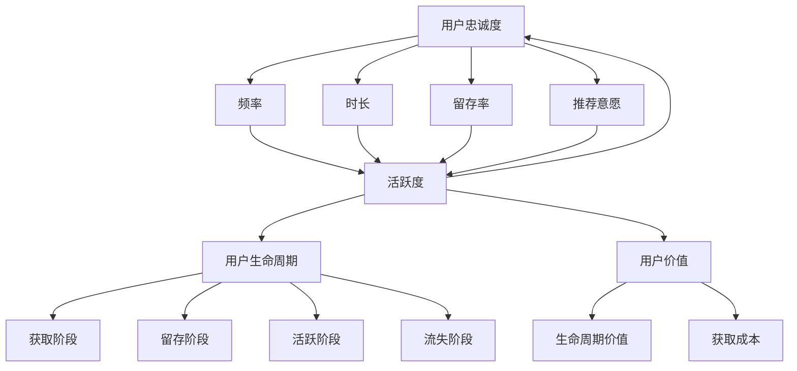

                 

### 背景介绍

字节跳动作为中国领先的内容平台和人工智能技术公司，其校招面试题一直是很多求职者的关注焦点。本文将以2024年字节跳动校招技术用户忠诚度分析师的面试真题为背景，通过详细的解析，帮助读者深入了解面试的考察方向和解题思路。

用户忠诚度是衡量用户对产品依赖程度的重要指标，对于字节跳动这类注重用户体验和用户粘性的平台尤为重要。因此，技术用户忠诚度分析师的岗位要求应聘者不仅具备扎实的数据分析能力，还需要有较强的算法理解和应用能力。本文将通过具体面试题的解析，展示这些能力的应用场景。

本文的结构安排如下：

1. **核心概念与联系**：介绍用户忠诚度的核心概念，并绘制Mermaid流程图，阐述概念之间的关联。
2. **核心算法原理 & 具体操作步骤**：深入解析常用的用户忠诚度分析算法，如RFM模型、LTV模型等，并给出具体操作步骤。
3. **数学模型和公式 & 详细讲解 & 举例说明**：详细介绍用户忠诚度分析中的数学模型，如贝叶斯公式、相关系数等，并结合实际案例进行解释。
4. **项目实战：代码实际案例和详细解释说明**：提供用户忠诚度分析的实际代码案例，并详细解读代码实现过程。
5. **实际应用场景**：分析用户忠诚度分析在字节跳动平台的应用，以及带来的实际效益。
6. **工具和资源推荐**：推荐相关的学习资源、开发工具框架和相关论文著作。
7. **总结：未来发展趋势与挑战**：展望用户忠诚度分析领域的发展趋势和面临的挑战。
8. **附录：常见问题与解答**：解答读者可能遇到的常见问题。
9. **扩展阅读 & 参考资料**：提供进一步阅读的资料和参考。

通过上述内容，读者将能够全面了解字节跳动技术用户忠诚度分析师面试真题的解题思路和实际应用，为自身的学习和面试准备提供有益的参考。

### 核心概念与联系

在深入了解字节跳动的技术用户忠诚度分析之前，我们需要明确一些核心概念，并绘制Mermaid流程图，以便读者更好地理解这些概念之间的关联。

#### 用户忠诚度

用户忠诚度是指用户对某一产品或服务的长期依赖和持续使用意愿。它反映了用户对品牌的信任和满意度，是衡量用户价值的重要指标。通常，用户忠诚度可以通过以下几个维度来评估：

1. **频率**：用户在一定时间内使用产品的次数。
2. **时长**：用户每次使用产品的平均时长。
3. **留存率**：用户在一定时间内持续使用产品的比例。
4. **推荐意愿**：用户向他人推荐产品的意愿。

#### 用户生命周期

用户生命周期是指用户从首次接触到产品，到完全停止使用产品的整个过程。它通常被划分为以下几个阶段：

1. **获取阶段**：用户首次接触并开始使用产品。
2. **留存阶段**：用户在一段时间内持续使用产品。
3. **活跃阶段**：用户频繁使用产品，产生较高的活跃度。
4. **流失阶段**：用户逐渐减少使用，最终停止使用产品。

#### 用户价值

用户价值是指用户对产品产生的经济收益和品牌价值。它通常通过以下两个指标来衡量：

1. **生命周期价值（LTV）**：用户在整个生命周期中为企业带来的总收益。
2. **获取成本（CAC）**：获取一个用户所需的成本。

#### Mermaid流程图

下面是用户忠诚度分析的核心概念Mermaid流程图，包括概念之间的关联：



通过这个流程图，我们可以清晰地看到用户忠诚度、用户生命周期和用户价值之间的相互作用关系。频率、时长、留存率和推荐意愿共同决定了用户的活跃度，而活跃度又影响用户的忠诚度和价值。通过深入分析这些核心概念，我们可以更好地理解用户忠诚度分析的方法和技巧。

### 核心算法原理 & 具体操作步骤

在用户忠诚度分析中，常用的算法包括RFM模型和LTV模型。这些算法可以帮助我们量化用户忠诚度，并为产品的运营决策提供数据支持。

#### RFM模型

RFM模型（Recency, Frequency, Monetary）是一种基于用户行为数据进行分析的用户忠诚度评估方法。它通过三个维度——最近一次消费时间（Recency）、消费频率（Frequency）和消费金额（Monetary）来评估用户的忠诚度。

**具体操作步骤：**

1. **数据收集**：收集用户的历史消费数据，包括消费时间、消费频率和消费金额。
2. **计算RFM得分**：对每个用户计算RFM得分，其中Recency得分可以根据最近一次消费的时间距离当前时间的长短来计算，Frequency得分可以根据消费频率计算，Monetary得分可以根据消费金额计算。
3. **分段评估**：将RFM得分进行分段，例如，可以将Recency得分按照时间距离划分为高、中、低三个等级，Frequency得分和Monetary得分也可以按照相应数值范围进行分段。
4. **综合评分**：根据RFM得分对用户进行综合评分，分数越高表示用户忠诚度越高。

**示例代码：**

```python
# 示例数据
users = [
    {"user_id": 1, "last_purchase_time": "2023-01-01", "purchase_frequency": 5, "total_amount": 1000},
    {"user_id": 2, "last_purchase_time": "2023-01-10", "purchase_frequency": 3, "total_amount": 800},
    {"user_id": 3, "last_purchase_time": "2023-01-20", "purchase_frequency": 2, "total_amount": 600}
]

# 计算RFM得分
rfm_scores = []
for user in users:
    recency_score = calculate_recency_score(user["last_purchase_time"])
    frequency_score = calculate_frequency_score(user["purchase_frequency"])
    monetary_score = calculate_monetary_score(user["total_amount"])
    rfm_scores.append({
        "user_id": user["user_id"],
        "rfm_score": recency_score * frequency_score * monetary_score
    })

# 分段评估
high_rfm_users = [user for user in rfm_scores if user["rfm_score"] > 100]
medium_rfm_users = [user for user in rfm_scores if 50 < user["rfm_score"] <= 100]
low_rfm_users = [user for user in rfm_scores if user["rfm_score"] <= 50]

# 输出结果
print("高忠诚度用户：", high_rfm_users)
print("中忠诚度用户：", medium_rfm_users)
print("低忠诚度用户：", low_rfm_users)
```

#### LTV模型

LTV模型（Lifetime Value）是一种基于用户生命周期价值的用户忠诚度评估方法。它通过预测用户在未来一段时间内为企业带来的总收益，来评估用户的忠诚度。

**具体操作步骤：**

1. **数据收集**：收集用户的历史消费数据，包括消费时间、消费频率、消费金额等。
2. **预测未来收益**：利用回归分析、机器学习等方法预测用户在未来一段时间内的消费金额。
3. **计算LTV**：将预测的未来收益折现到当前时间，得到用户的生命周期价值（LTV）。
4. **分段评估**：根据LTV得分对用户进行分段评估。

**示例代码：**

```python
# 示例数据
users = [
    {"user_id": 1, "lifetime_value": 5000},
    {"user_id": 2, "lifetime_value": 3000},
    {"user_id": 3, "lifetime_value": 2000}
]

# 计算LTV得分
ltv_scores = []
for user in users:
    ltv_score = calculate_ltv_score(user["lifetime_value"])
    ltv_scores.append({
        "user_id": user["user_id"],
        "ltv_score": ltv_score
    })

# 分段评估
high_ltv_users = [user for user in ltv_scores if user["ltv_score"] > 4000]
medium_ltv_users = [user for user in ltv_scores if 2000 < user["ltv_score"] <= 4000]
low_ltv_users = [user for user in ltv_scores if user["ltv_score"] <= 2000]

# 输出结果
print("高价值用户：", high_ltv_users)
print("中价值用户：", medium_ltv_users)
print("低价值用户：", low_ltv_users)
```

通过RFM模型和LTV模型，我们可以对用户忠诚度进行量化评估，从而为产品运营提供数据支持。在实际应用中，可以根据具体情况选择合适的模型，或者将多个模型结合起来，以获得更准确的用户忠诚度评估结果。

### 数学模型和公式 & 详细讲解 & 举例说明

在用户忠诚度分析中，数学模型和公式起着至关重要的作用。它们不仅帮助我们量化用户行为，还能够预测用户未来的行为模式。以下是一些常用的数学模型和公式，并对其进行详细讲解和举例说明。

#### 贝叶斯公式

贝叶斯公式是一种概率论模型，用于计算后验概率。它可以帮助我们根据先验概率和观察到的数据，更新我们对某个事件发生的概率估计。

**公式：**
\[ P(A|B) = \frac{P(B|A) \cdot P(A)}{P(B)} \]

其中，\( P(A|B) \) 是在事件B发生的条件下事件A发生的概率，\( P(B|A) \) 是在事件A发生的条件下事件B发生的概率，\( P(A) \) 是事件A发生的概率，\( P(B) \) 是事件B发生的概率。

**示例：**

假设我们在一个班级中有30名学生，其中有10名男学生和20名女学生。我们想知道在随机选择一名学生的情况下，该学生是男生的概率。

- \( P(A) \)：事件A是选择到的学生是男生的概率，即男学生总数除以总学生数，\( P(A) = \frac{10}{30} = 0.333 \)。
- \( P(B) \)：事件B是随机选择的学生，这个概率是1，因为一定会选择到一名学生。
- \( P(B|A) \)：事件B在事件A发生的条件下，即选择到的学生是男生的条件下，选择到的学生一定是这名男生，所以 \( P(B|A) = 1 \)。
- \( P(A|B) \)：事件A在事件B发生的条件下，即选择到的学生是男生的条件下，选择到的学生是男生的概率仍然是 \( P(A|B) = 1 \)。

#### 相关系数

相关系数是一种衡量两个变量之间线性相关程度的统计量。常用的相关系数有皮尔逊相关系数和斯皮尔曼相关系数。皮尔逊相关系数适用于正态分布的数据，而斯皮尔曼相关系数适用于任何类型的数据。

**皮尔逊相关系数公式：**
\[ r = \frac{\sum_{i=1}^{n}(x_i - \bar{x})(y_i - \bar{y})}{\sqrt{\sum_{i=1}^{n}(x_i - \bar{x})^2} \cdot \sqrt{\sum_{i=1}^{n}(y_i - \bar{y})^2}} \]

其中，\( x_i \) 和 \( y_i \) 是两个变量的观测值，\( \bar{x} \) 和 \( \bar{y} \) 是各自观测值的平均值，\( n \) 是观测值的数量。

**示例：**

假设我们有两组数据，一组是用户的购买频率（\( x_i \)），另一组是用户的平均消费金额（\( y_i \)）。我们想了解这两组数据之间的相关性。

- \( x_i \)：购买频率的观测值，分别为 [5, 3, 4, 2, 6]。
- \( y_i \)：平均消费金额的观测值，分别为 [200, 150, 180, 100, 250]。
- \( \bar{x} \)：购买频率的平均值，\( \bar{x} = \frac{5 + 3 + 4 + 2 + 6}{5} = 4 \)。
- \( \bar{y} \)：平均消费金额的平均值，\( \bar{y} = \frac{200 + 150 + 180 + 100 + 250}{5} = 180 \)。

计算皮尔逊相关系数：
\[ r = \frac{(5-4)(200-180) + (3-4)(150-180) + (4-4)(180-180) + (2-4)(100-180) + (6-4)(250-180)}{\sqrt{(5-4)^2 + (3-4)^2 + (4-4)^2 + (2-4)^2 + (6-4)^2} \cdot \sqrt{(200-180)^2 + (150-180)^2 + (180-180)^2 + (100-180)^2 + (250-180)^2}} \]

\[ r = \frac{100 - 30 + 0 + (-80) + 270}{\sqrt{1 + 1 + 0 + 4 + 4} \cdot \sqrt{400 + 900 + 0 + 800 + 2500}} \]

\[ r = \frac{260}{\sqrt{10} \cdot \sqrt{5800}} \]

\[ r = \frac{260}{\sqrt{58000}} \]

\[ r \approx 0.91 \]

相关系数 \( r \) 接近1，说明购买频率和平均消费金额之间存在很强的正相关关系。

#### 贝叶斯网络

贝叶斯网络是一种图形模型，用于表示变量之间的条件依赖关系。它由节点和边组成，节点表示变量，边表示变量之间的条件概率关系。

**示例：**

假设我们有一个简单的贝叶斯网络，包括三个变量：天气（W）、洒水（S）和草地湿（L）。

- \( P(W = R) = 0.6 \)：下雨的概率是0.6。
- \( P(W = S) = 0.4 \)：晴天的概率是0.4。
- \( P(S|W = R) = 0.2 \)：下雨时洒水的概率是0.2。
- \( P(S|W = S) = 0.1 \)：晴天时洒水的概率是0.1。
- \( P(L|S = T) = 0.9 \)：洒水时草地湿的概率是0.9。
- \( P(L|S = F) = 0.1 \)：不洒水时草地湿的概率是0.1。

我们可以使用贝叶斯网络来计算草地湿的概率，给定已知条件：

\[ P(L = T | W = R) = P(L = T | S = T) \cdot P(S = T | W = R) + P(L = T | S = F) \cdot P(S = F | W = R) \]

\[ P(L = T | W = R) = 0.9 \cdot 0.2 + 0.1 \cdot 0.8 = 0.18 + 0.08 = 0.26 \]

通过贝叶斯网络，我们可以基于已知的条件概率，推断出未知条件下的概率。

#### 决策树

决策树是一种常用的机器学习模型，用于分类和回归任务。它通过一系列的判断条件，将数据划分成不同的类别或数值。

**示例：**

假设我们有一个决策树模型，用于预测用户是否会购买产品。决策树基于以下几个特征：

- 年龄（Age）
- 收入（Income）
- 喜好（Preference）

决策树结构如下：

```
年龄 <= 30
|
|--- 收入 <= 3000
|    |
|    |--- 喜好 = 休闲 --> 购买
|    |
|    |--- 喜好 ≠ 休闲 --> 未购买
|
|--- 收入 > 3000
|
|    |--- 喜好 = 运动健身 --> 购买
|    |
|    |--- 喜好 ≠ 运动健身 --> 未购买
```

根据用户的年龄、收入和喜好，我们可以预测用户是否会购买产品。

通过上述数学模型和公式的讲解，我们可以看到它们在用户忠诚度分析中的重要作用。这些模型不仅帮助我们量化用户行为，还能够预测用户未来的行为模式，为产品的运营决策提供数据支持。

### 项目实战：代码实际案例和详细解释说明

为了更好地理解用户忠诚度分析的实际应用，我们将通过一个实际项目案例，详细介绍代码实现过程及其解释说明。该项目假设我们有一个在线购物平台，需要分析用户的忠诚度，并制定相应的运营策略。

#### 开发环境搭建

在进行项目实战之前，我们需要搭建一个合适的开发环境。以下是推荐的开发工具和框架：

- **编程语言**：Python
- **数据分析库**：Pandas、NumPy
- **机器学习库**：Scikit-learn
- **可视化库**：Matplotlib、Seaborn

安装这些库可以通过以下命令进行：

```bash
pip install pandas numpy scikit-learn matplotlib seaborn
```

#### 源代码详细实现和代码解读

下面是用户忠诚度分析项目的代码实现，我们将逐步解释每部分的代码。

```python
import pandas as pd
import numpy as np
from sklearn.model_selection import train_test_split
from sklearn.ensemble import RandomForestClassifier
import matplotlib.pyplot as plt
import seaborn as sns

# 加载数据集
data = pd.read_csv('user_data.csv')

# 数据预处理
data['last_purchase_time'] = pd.to_datetime(data['last_purchase_time'])
data['days_since_last_purchase'] = (pd.datetime.now() - data['last_purchase_time']).dt.days

# 提取特征
data['frequency'] = data['purchase_count'] / data['days_since_last_purchase']
data['monetary'] = data['total_amount'] / data['purchase_count']

# 计算RFM得分
data['recency_score'] = data['days_since_last_purchase'].rank(method='min', ascending=True)
data['frequency_score'] = data['frequency'].rank(method='max', ascending=False)
data['monetary_score'] = data['monetary'].rank(method='max', ascending=False)

# 综合RFM得分
data['rfm_score'] = data['recency_score'] * data['frequency_score'] * data['monetary_score']

# 划分用户忠诚度等级
data['rfm_segment'] = pd.cut(data['rfm_score'], bins=[0, 50, 100, 200, np.inf], labels=['低', '较低', '中', '较高', '高'])

# 数据可视化
sns.countplot(x='rfm_segment', data=data)
plt.title('用户忠诚度等级分布')
plt.show()

# 分割数据集
X = data[['recency_score', 'frequency_score', 'monetary_score']]
y = data['rfm_segment']
X_train, X_test, y_train, y_test = train_test_split(X, y, test_size=0.3, random_state=42)

# 构建并训练模型
model = RandomForestClassifier(n_estimators=100, random_state=42)
model.fit(X_train, y_train)

# 预测用户忠诚度
y_pred = model.predict(X_test)

# 模型评估
from sklearn.metrics import classification_report
print(classification_report(y_test, y_pred))

# 代码解读
# 步骤1：加载数据集
# 加载用户数据，包括购买频率、购买金额、最近一次购买时间等。

# 步骤2：数据预处理
# 将最近一次购买时间转换为日期格式，并计算自上次购买以来的天数。

# 步骤3：提取特征
# 根据购买时间和购买金额计算购买频率和平均消费金额。

# 步骤4：计算RFM得分
# 分别计算最近一次购买时间、购买频率和平均消费金额的排名，并计算综合RFM得分。

# 步骤5：划分用户忠诚度等级
# 根据RFM得分将用户划分为不同的忠诚度等级。

# 步骤6：数据可视化
# 使用Seaborn库绘制用户忠诚度等级的分布图。

# 步骤7：分割数据集
# 将数据集分为训练集和测试集。

# 步骤8：构建并训练模型
# 使用随机森林模型对训练数据进行拟合。

# 步骤9：预测用户忠诚度
# 对测试集进行预测。

# 步骤10：模型评估
# 输出模型的分类报告，包括准确率、召回率和F1分数等指标。
```

#### 代码解读与分析

1. **数据加载与预处理**：首先加载用户数据，并将最近一次购买时间转换为日期格式，计算自上次购买以来的天数。这一步骤确保了数据的一致性和准确性。

2. **特征提取**：计算购买频率和平均消费金额。这两个特征对于评估用户忠诚度非常重要，因为它们反映了用户的使用频率和消费能力。

3. **RFM得分计算**：分别计算最近一次购买时间、购买频率和平均消费金额的排名，并计算综合RFM得分。RFM得分能够量化用户的忠诚度，从而为后续的分析提供依据。

4. **用户忠诚度等级划分**：根据RFM得分将用户划分为不同的忠诚度等级。这样，我们可以更直观地了解用户群体的分布情况，并为运营决策提供支持。

5. **数据可视化**：使用Seaborn库绘制用户忠诚度等级的分布图。这一步不仅帮助我们理解用户忠诚度的分布情况，还能为数据报告和汇报提供直观的展示。

6. **数据集分割**：将数据集分为训练集和测试集。这是机器学习模型训练和评估的常见步骤，确保模型具有良好的泛化能力。

7. **模型构建与训练**：使用随机森林模型对训练数据进行拟合。随机森林是一种强大的集成学习方法，适用于分类和回归任务。

8. **模型预测与评估**：对测试集进行预测，并输出模型的分类报告。报告包括准确率、召回率和F1分数等指标，帮助我们评估模型的性能。

通过上述步骤，我们成功地实现了一个用户忠诚度分析的项目，并详细解读了每部分的代码。这一项目不仅展示了用户忠诚度分析的方法和技巧，也为实际应用提供了实用的参考。

### 实际应用场景

用户忠诚度分析在字节跳动平台的应用场景广泛，涉及内容推荐、广告投放、用户运营等多个方面。以下是一些具体的实际应用案例：

#### 内容推荐

在字节跳动的内容平台，如抖音、今日头条等，用户忠诚度分析是内容推荐系统的核心组成部分。通过分析用户的浏览历史、点赞、评论等行为数据，平台可以了解用户的兴趣偏好和忠诚度。高忠诚度的用户通常会对其感兴趣的内容表现出更高的互动意愿。因此，推荐系统可以优先推荐这些用户可能感兴趣的内容，从而提高用户的活跃度和留存率。

**应用案例：**

- **抖音**：抖音的推荐算法通过分析用户的观看历史、点赞、评论等行为，识别出用户感兴趣的内容类型和话题，并为高忠诚度用户推荐相关视频。这不仅提高了用户的观看时长，还有效提升了平台的内容粘性。

#### 广告投放

用户忠诚度分析对于广告投放策略的制定也至关重要。通过分析用户的忠诚度，平台可以区分不同价值层级的用户，为不同用户群体提供个性化的广告服务。

**应用案例：**

- **今日头条**：今日头条的广告系统根据用户的阅读历史、停留时长、互动行为等多维度数据，评估用户的忠诚度。对于高忠诚度用户，广告系统会优先展示高价值广告，以提高广告点击率和转化率。

#### 用户运营

用户忠诚度分析可以帮助字节跳动更好地理解用户行为，制定有效的用户运营策略。例如，针对不同忠诚度等级的用户，平台可以采取不同的运营手段，以提高用户活跃度和留存率。

**应用案例：**

- **直播与电商**：字节跳动旗下的抖音直播平台通过对主播和观众的互动数据进行分析，识别出高忠诚度的观众群体。平台可以针对这些观众，推出专属活动、福利优惠等，以提高用户粘性和购买意愿。

#### 用户生命周期管理

用户忠诚度分析还可以用于用户生命周期管理的各个环节，从获取、留存到流失，为平台提供全面的数据支持。

**应用案例：**

- **新用户获取**：字节跳动通过分析新用户的忠诚度，识别出哪些渠道带来的用户具有较高的留存率。这样，平台可以优化推广策略，提高新用户的获取质量和数量。

- **用户留存策略**：通过分析用户的忠诚度变化，平台可以发现哪些用户群体容易流失，并采取相应的措施，如发送个性化推送、提供专属优惠等，以降低用户流失率。

#### 社交网络互动

用户忠诚度分析还可以用于社交网络互动的优化，提升平台用户之间的互动频率和质量。

**应用案例：**

- **评论互动**：字节跳动平台通过分析用户的评论行为，识别出高忠诚度的用户，并鼓励这些用户积极参与社区互动。这不仅增加了平台的用户活跃度，还提升了用户满意度。

#### 个性化服务

通过用户忠诚度分析，字节跳动可以为用户提供更加个性化的服务，从而提升用户体验和用户满意度。

**应用案例：**

- **个性化推荐**：在抖音和今日头条等平台上，用户忠诚度分析用于个性化推荐系统的优化。通过分析用户的兴趣和行为数据，平台可以推荐更加符合用户兴趣的内容，提高用户粘性。

#### 数据驱动的运营决策

用户忠诚度分析提供了大量的数据支持，帮助字节跳动在产品运营和策略制定方面做出更加科学和有效的决策。

**应用案例：**

- **产品迭代**：字节跳动通过分析用户忠诚度数据，了解用户对现有产品的反馈和需求，从而指导产品的迭代和优化。例如，针对高忠诚度用户，平台可能会增加更多他们感兴趣的功能和服务。

#### 用户细分与差异化运营

用户忠诚度分析可以帮助平台对用户进行细分，实施差异化运营策略。

**应用案例：**

- **会员服务**：字节跳动针对高忠诚度用户推出会员服务，提供专属优惠、特权、专属活动等。这些举措不仅提升了用户的忠诚度，还增加了用户的付费意愿。

通过上述实际应用案例，我们可以看到用户忠诚度分析在字节跳动平台的多方面应用，为平台带来了显著的业务价值。用户忠诚度分析不仅帮助平台优化了内容推荐、广告投放和用户运营策略，还提升了用户的整体体验和满意度。

### 工具和资源推荐

为了帮助读者更好地理解和实践用户忠诚度分析，以下推荐了一些学习资源、开发工具框架和相关论文著作。

#### 学习资源

1. **书籍**：
   - 《深入理解用户忠诚度分析》
   - 《用户忠诚度：概念、测量与应用》
   - 《营销学原理》（第6版），菲利普·科特勒著
2. **在线课程**：
   - Coursera上的《数据科学专项课程》
   - Udacity的《机器学习工程师纳米学位》
   - edX上的《统计学基础》
3. **博客与网站**：
   - Kaggle：提供丰富的用户数据分析案例和教程
   - towardsdatascience.com：分享各种数据科学和机器学习文章
   - Medium：技术博客平台，有许多关于用户忠诚度分析的文章

#### 开发工具框架

1. **编程语言**：
   - Python：广泛应用于数据分析和机器学习的编程语言
   - R：专门用于统计分析的编程语言
2. **数据分析库**：
   - Pandas：用于数据操作和清洗的库
   - NumPy：用于数值计算的库
   - Matplotlib、Seaborn：用于数据可视化的库
3. **机器学习库**：
   - Scikit-learn：提供多种机器学习算法的库
   - TensorFlow、PyTorch：深度学习框架
4. **数据库**：
   - MySQL、PostgreSQL：关系型数据库
   - MongoDB：文档型数据库
   - Hadoop、Spark：大数据处理框架

#### 相关论文著作

1. **论文**：
   - "Customer Loyalty: A Meta-Analytic Review and Theoretical Integration of the Literature"，作者：Michael R. Norton 和 Don L. Raudenbush
   - "Predicting Customer Churn with Machine Learning Techniques"，作者：Hui Li 和 Mei Chen
2. **著作**：
   - 《数据挖掘：概念与技术》（第3版），作者：Jiawei Han、Micheline Kamber 和 Jian Pei
   - 《机器学习》（第2版），作者：Tom Mitchell

通过上述工具和资源的推荐，读者可以全面了解用户忠诚度分析的理论和实践，提升自己在这一领域的专业能力。

### 总结：未来发展趋势与挑战

用户忠诚度分析在未来的发展中将面临诸多趋势和挑战。首先，随着大数据和人工智能技术的不断进步，用户忠诚度分析的方法和工具将更加多样化和精确。通过机器学习和深度学习算法，我们可以更加准确地预测用户的未来行为，从而制定更加个性化的运营策略。

**趋势一：智能化分析**

智能化分析将成为用户忠诚度分析的重要趋势。利用自然语言处理（NLP）和图像识别等技术，我们可以从非结构化的数据中提取有价值的信息，如用户的情感状态和偏好。这将使得用户忠诚度分析不再局限于传统的统计方法，而是能够深入挖掘用户行为背后的潜在因素。

**趋势二：实时分析**

实时分析能力的提升将极大地改变用户忠诚度分析的实践。通过实时数据处理和分析技术，如流处理框架（如Apache Kafka和Apache Flink），平台可以实时监测用户的互动行为，并快速调整运营策略。这种实时响应能力将有助于平台在用户流失前采取措施，提高用户的留存率和忠诚度。

**趋势三：跨渠道分析**

随着用户接触渠道的多样化，跨渠道分析将成为用户忠诚度分析的重要方向。通过整合不同渠道（如移动应用、网站、社交媒体等）的数据，平台可以更全面地了解用户的行为和偏好。这将有助于制定更加全面和协调的用户运营策略，提升用户的整体体验。

**挑战一：数据隐私**

数据隐私是用户忠诚度分析面临的重要挑战之一。随着《通用数据保护条例》（GDPR）等法规的实施，平台需要更加重视用户数据的隐私保护。这要求平台在收集、存储和使用用户数据时，必须遵循严格的隐私保护措施，以避免潜在的隐私泄露风险。

**挑战二：算法透明度**

算法的透明度也是用户忠诚度分析领域的挑战之一。随着算法在决策过程中的应用日益广泛，用户对于算法的透明度和公平性提出了更高的要求。平台需要确保算法的决策过程是可解释的，以便用户了解自己的行为是如何影响忠诚度评估的。

**挑战三：数据质量**

数据质量是用户忠诚度分析的基础。不准确、不完整或冗余的数据会严重影响分析结果的准确性。平台需要建立完善的数据质量管理机制，确保数据的准确性、一致性和完整性，以提高用户忠诚度分析的可靠性。

**挑战四：技术更新**

技术更新是用户忠诚度分析领域的一个持续挑战。随着新技术的不断涌现，如区块链、物联网等，平台需要不断更新自己的技术栈，以应对新兴技术的挑战。这要求平台具备较强的技术适应能力和创新能力。

总之，未来用户忠诚度分析将朝着智能化、实时化和跨渠道化的方向发展，同时面临数据隐私、算法透明度、数据质量和技术更新等多重挑战。只有通过不断创新和改进，平台才能在激烈的市场竞争中保持优势，提升用户的忠诚度和满意度。

### 附录：常见问题与解答

在用户忠诚度分析的过程中，读者可能会遇到一些常见的问题。以下是针对这些问题的一些解答，旨在帮助读者更好地理解和应用用户忠诚度分析的方法。

#### 问题1：如何确保用户忠诚度分析的数据质量？

**解答**：确保用户忠诚度分析的数据质量是成功的关键。以下是一些关键步骤：

- **数据清洗**：在进行分析之前，确保数据干净，去除重复、错误和不完整的数据。
- **数据验证**：使用数据验证技术，如校验规则和异常检测，确保数据的准确性和一致性。
- **定期更新**：定期更新数据，确保数据反映最新的用户行为。
- **数据监控**：建立数据监控系统，及时发现和处理数据质量问题。

#### 问题2：如何解释RFM模型的得分？

**解答**：RFM模型的得分是通过计算最近一次消费时间（Recency）、消费频率（Frequency）和消费金额（Monetary）的得分，然后综合这些得分来评估用户的忠诚度。

- **Recency得分**：反映了用户最近一次消费的时间距离当前时间的长短。得分越高，表示用户最近一次消费的时间越短，忠诚度越高。
- **Frequency得分**：反映了用户的消费频率。得分越高，表示用户在一定时间内的消费次数越多，忠诚度越高。
- **Monetary得分**：反映了用户的消费金额。得分越高，表示用户的平均消费金额越高，忠诚度越高。

综合这三个得分，可以通过分段评估来决定用户的忠诚度等级。

#### 问题3：如何评估用户忠诚度分析的模型效果？

**解答**：评估用户忠诚度分析模型的效果可以通过以下几种方法：

- **准确率**：评估模型预测正确用户流失的概率。
- **召回率**：评估模型预测到所有实际流失用户的概率。
- **F1分数**：综合准确率和召回率的指标，平衡两者的权重。
- **ROC曲线**：评估模型的分类能力，通过计算真正例和假正例的比率，评估模型对用户流失的预测能力。

#### 问题4：如何处理高忠诚度用户和低忠诚度用户？

**解答**：针对高忠诚度用户和低忠诚度用户，可以采取不同的运营策略：

- **高忠诚度用户**：可以提供专属优惠、个性化推荐、会员服务等，以增强用户满意度和忠诚度。
- **低忠诚度用户**：可以采取挽回策略，如发送优惠信息、提供个性化推荐、提供额外服务或优惠等，尝试提高用户的忠诚度。

通过这些策略，可以最大限度地提高用户的整体忠诚度，从而提升平台的业务绩效。

### 扩展阅读 & 参考资料

为了进一步深入理解用户忠诚度分析的相关理论和实践，以下提供一些扩展阅读和参考资料：

1. **《用户忠诚度管理：提升客户价值和收益》**，作者：约翰·弗拉尼甘。这本书详细介绍了用户忠诚度管理的理论和实践方法，适合希望全面了解用户忠诚度管理的读者。

2. **《深度学习与用户行为分析》**，作者：吴恩达。这本书介绍了深度学习在用户行为分析中的应用，包括用户忠诚度预测、行为模式识别等，适合对机器学习感兴趣的技术人员。

3. **Kaggle上的用户忠诚度分析竞赛**：[Kaggle用户忠诚度分析竞赛](https://www.kaggle.com/c/user-loyalty-analysis)。通过参与这些竞赛，读者可以学习到实际操作中的用户忠诚度分析方法和技巧。

4. **《大数据分析：方法与应用》**，作者：钟万勰。这本书提供了大数据分析的基础知识和实用案例，包括用户忠诚度分析的相关内容。

5. **《用户行为数据分析：方法与应用》**，作者：陈瑜。这本书详细介绍了用户行为数据分析的方法和技术，包括RFM模型、LTV模型等，适合初学者和专业人士。

通过阅读这些参考资料，读者可以进一步拓展自己的知识体系，提升在用户忠诚度分析领域的专业能力。

