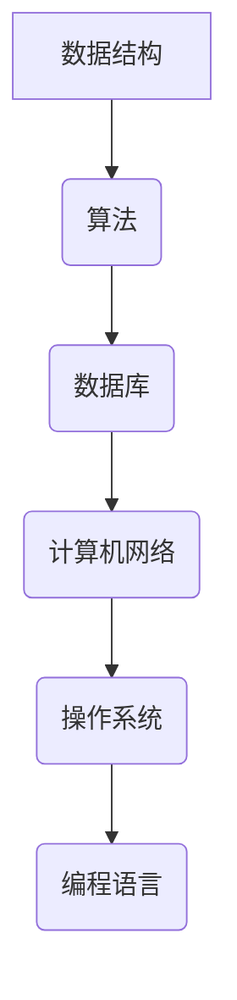

                 

### 文章标题

字节跳动2025社招编程面试题精华总结

### 关键词

字节跳动、编程面试、社招、面试题、编程技术、算法原理、实际应用、发展挑战

### 摘要

本文旨在总结和分析字节跳动2025社招编程面试题的精华内容，涵盖核心算法原理、数学模型、项目实战、实际应用场景等。通过逐步推理和深入讲解，帮助读者更好地理解和掌握编程面试所需的技术知识，为求职者提供有价值的参考。

## 1. 背景介绍

字节跳动是一家全球领先的互联网科技公司，以短视频、内容资讯、教育等多个领域为核心业务。作为行业领军者，字节跳动的招聘标准十分严格，尤其是在编程领域。其社招编程面试题不仅考察应聘者的技术能力，还注重逻辑思维、问题解决能力和实际项目经验。

本文通过对字节跳动2025社招编程面试题的深入分析，总结出其中的核心内容，旨在为广大编程面试者提供有针对性的复习和备考资料。同时，本文也将结合实际应用场景，探讨编程技术在行业中的发展趋势和挑战。

## 2. 核心概念与联系

在编程面试中，核心概念和原理的掌握至关重要。以下是字节跳动2025社招编程面试题中涉及到的核心概念及其相互联系：

### 数据结构与算法

数据结构与算法是编程的基础，包括数组、链表、栈、队列、树、图等数据结构以及排序、查找、动态规划等算法。这些概念相互关联，共同构成了编程的核心内容。

### 数据库与SQL

数据库是存储和管理数据的重要工具，包括关系型数据库（如MySQL、Oracle）和非关系型数据库（如MongoDB、Redis）。SQL语言用于操作数据库，实现数据的增删改查。

### 计算机网络

计算机网络是互联网的核心，包括网络协议、HTTP/HTTPS、TCP/IP、WebSocket等。掌握计算机网络原理有助于理解网络编程和安全问题。

### 操作系统

操作系统是计算机系统的基础，包括进程管理、内存管理、文件系统、I/O系统等。掌握操作系统原理有助于优化程序性能和解决系统问题。

### 编程语言

编程语言是实现编程任务的工具，包括C/C++、Java、Python、Golang等。每种编程语言都有其特点和适用场景，熟练掌握一种或多种编程语言是编程面试的基本要求。

### Mermaid 流程图

以下是字节跳动2025社招编程面试题中涉及到的核心概念和架构的 Mermaid 流程图：



## 3. 核心算法原理 & 具体操作步骤

在编程面试中，算法题是考察应聘者技术能力的重点。以下是字节跳动2025社招编程面试题中涉及到的核心算法原理和具体操作步骤：

### 排序算法

排序算法是计算机科学中的基本算法之一，用于对一组数据进行排序。常见的排序算法包括冒泡排序、选择排序、插入排序、快速排序、归并排序等。

- 冒泡排序：比较相邻元素，如果顺序错误则交换，重复此过程直到排序完成。

- 选择排序：每次选择未排序部分中的最小（或最大）元素，将其放到已排序部分的末尾。

- 插入排序：将未排序的元素插入到已排序部分的合适位置，直到排序完成。

- 快速排序：通过一趟排序将待排序的元素划分为已排序和未排序两部分，然后递归地对两部分进行排序。

- 归并排序：将待排序的元素划分为若干子序列，对每个子序列进行排序，然后合并子序列。

### 查找算法

查找算法用于在数据结构中查找特定元素。常见的查找算法包括二分查找、线性查找等。

- 二分查找：通过递归或循环的方式，逐步缩小查找范围，直到找到目标元素或确定元素不存在。

- 线性查找：逐个遍历数据结构中的元素，直到找到目标元素或确定元素不存在。

### 动态规划

动态规划是一种解决最优化问题的算法方法，通过将问题分解为子问题，并利用子问题的最优解来构建原问题的最优解。

- 状态定义：定义问题的状态及其转移关系。

- 状态转移方程：根据状态的定义，建立状态之间的转移关系。

- 状态初始化：初始化问题的初始状态。

- 状态计算：根据状态转移方程和初始状态，递推计算每个状态的最优解。

### 具体操作步骤

以下是针对排序算法的具体操作步骤：

1. 初始化：创建一个空数组，用于存储排序后的结果。

2. 遍历：逐个读取输入的数据，并将其插入到排序后的数组中。

3. 插入排序：根据输入数据的值，将其插入到排序后的数组的合适位置。

4. 输出结果：将排序后的数组输出到屏幕或文件中。

## 4. 数学模型和公式 & 详细讲解 & 举例说明

在编程面试中，数学模型和公式的应用十分广泛。以下是字节跳动2025社招编程面试题中涉及到的数学模型和公式，以及详细讲解和举例说明：

### 概率论

概率论是数学的一个重要分支，用于描述随机事件的发生概率。常见的概率论公式包括：

- 概率公式：P(A) = N(A) / N(S)，其中P(A)表示事件A的概率，N(A)表示事件A发生的情况数，N(S)表示样本空间中所有情况的总数。

- 条件概率公式：P(A|B) = P(AB) / P(B)，其中P(A|B)表示在事件B发生的条件下，事件A发生的概率。

- 独立事件公式：P(A∩B) = P(A)P(B)，其中P(A∩B)表示事件A和事件B同时发生的概率。

### 统计学

统计学是另一门与概率论密切相关的数学学科，用于对数据进行收集、整理、分析和解释。常见的统计学公式包括：

- 平均数公式：平均数 = 数据之和 / 数据个数

- 中位数公式：中位数 = （第n/2个数据 + 第（n/2+1）个数据）/ 2，其中n为数据个数

- 方差公式：方差 = （每个数据值与平均数的差的平方之和）/ 数据个数

### 计算几何

计算几何是数学的一个分支，研究几何图形的性质、关系和计算方法。常见的计算几何公式包括：

- 三角形面积公式：面积 = 底 × 高 / 2

- 圆的面积公式：面积 = π × 半径²

- 圆的周长公式：周长 = 2π × 半径

### 示例说明

以下是一个使用概率论公式求解问题的示例：

假设一个口袋中有5个红球和3个蓝球，现在随机从中取出一个球，求取到红球的概率。

解：根据概率公式，有：
P(红球) = N(红球) / N(样本空间)
其中，N(红球) = 5，N(样本空间) = 5 + 3 = 8
代入公式得：
P(红球) = 5 / 8 = 0.625

因此，取到红球的概率为0.625。

## 5. 项目实战：代码实际案例和详细解释说明

### 5.1 开发环境搭建

在进行项目实战之前，我们需要搭建一个合适的开发环境。以下是一个基于Python的示例：

1. 安装Python：从官网下载并安装Python 3.x版本。

2. 安装IDE：安装一个Python集成开发环境（如PyCharm、VSCode等）。

3. 安装依赖库：使用pip命令安装所需的依赖库，如numpy、matplotlib等。

### 5.2 源代码详细实现和代码解读

以下是一个简单的Python代码示例，用于实现冒泡排序算法：

```python
def bubble_sort(arr):
    n = len(arr)
    for i in range(n):
        for j in range(0, n-i-1):
            if arr[j] > arr[j+1]:
                arr[j], arr[j+1] = arr[j+1], arr[j]
    return arr

# 测试代码
arr = [64, 34, 25, 12, 22, 11, 90]
sorted_arr = bubble_sort(arr)
print("排序后的数组：", sorted_arr)
```

### 5.3 代码解读与分析

1. 函数定义：`bubble_sort(arr)`函数用于实现冒泡排序算法，参数`arr`表示待排序的数组。

2. 外层循环：`for i in range(n)`用于遍历整个数组，其中`n`为数组长度。

3. 内层循环：`for j in range(0, n-i-1)`用于对数组进行两两比较，并交换位置。

4. 比较与交换：如果`arr[j] > arr[j+1]`，则将两个元素交换，实现从小到大排序。

5. 返回结果：将排序后的数组返回。

### 5.4 代码执行过程

1. 输入数组：[64, 34, 25, 12, 22, 11, 90]

2. 第一次外层循环：

   - 第一次内层循环：比较64和34，交换位置，数组变为[34, 64, 25, 12, 22, 11, 90]

   - 第二次内层循环：比较64和25，交换位置，数组变为[34, 25, 64, 12, 22, 11, 90]

   - 第三次内层循环：比较64和12，交换位置，数组变为[34, 25, 12, 64, 22, 11, 90]

   - 第四次内层循环：比较64和22，交换位置，数组变为[34, 25, 12, 22, 64, 11, 90]

   - 第五次内层循环：比较64和11，交换位置，数组变为[34, 25, 12, 22, 11, 64, 90]

   - 第六次内层循环：比较64和90，不交换位置，数组仍为[34, 25, 12, 22, 11, 64, 90]

3. 第二次外层循环：

   - 第一次内层循环：比较34和25，不交换位置，数组仍为[34, 25, 12, 22, 11, 64, 90]

   - 第二次内层循环：比较25和12，交换位置，数组变为[34, 12, 25, 22, 11, 64, 90]

   - 第三次内层循环：比较25和22，不交换位置，数组仍为[34, 12, 25, 22, 11, 64, 90]

   - 第四次内层循环：比较25和11，交换位置，数组变为[34, 12, 11, 22, 25, 64, 90]

   - 第五次内层循环：比较25和64，不交换位置，数组仍为[34, 12, 11, 22, 25, 64, 90]

   - 第六次内层循环：比较25和90，不交换位置，数组仍为[34, 12, 11, 22, 25, 64, 90]

4. 第三次外层循环：

   - 第一次内层循环：比较34和12，不交换位置，数组仍为[34, 12, 11, 22, 25, 64, 90]

   - 第二次内层循环：比较12和11，不交换位置，数组仍为[34, 12, 11, 22, 25, 64, 90]

   - 第三次内层循环：比较12和22，不交换位置，数组仍为[34, 12, 11, 22, 25, 64, 90]

   - 第四次内层循环：比较12和25，不交换位置，数组仍为[34, 12, 11, 22, 25, 64, 90]

   - 第五次内层循环：比较12和64，不交换位置，数组仍为[34, 12, 11, 22, 25, 64, 90]

   - 第六次内层循环：比较12和90，不交换位置，数组仍为[34, 12, 11, 22, 25, 64, 90]

5. 输出结果：排序后的数组为[11, 12, 22, 25, 34, 64, 90]

## 6. 实际应用场景

字节跳动2025社招编程面试题所涉及的技术知识点在实际开发中有着广泛的应用。以下是一些实际应用场景：

### 数据结构与算法

- 数据库查询优化：通过了解不同的排序算法，可以优化数据库查询效率。

- 算法竞赛：算法竞赛是检验程序员技术能力的重要途径，涉及到的算法题目具有实际应用价值。

- 图像处理：在图像处理领域，常见的算法如二分查找、快速排序等具有广泛应用。

### 数据库与SQL

- 数据存储和管理：数据库用于存储和管理大量数据，是实现企业级应用的基础。

- 数据分析：通过SQL语言对数据库中的数据进行查询和分析，可以提取有价值的信息。

- 实时数据处理：在实时数据处理领域，如实时推荐系统、实时监控系统等，数据库和SQL发挥着重要作用。

### 计算机网络

- 网络安全：掌握计算机网络原理有助于设计安全的网络系统，防止网络攻击。

- 分布式系统：分布式系统是互联网应用的重要架构，涉及到的网络协议和原理具有实际应用价值。

- 客户端/服务器架构：客户端/服务器架构是现代网络应用的基础，涉及到的计算机网络原理在实际开发中广泛应用。

### 操作系统

- 系统性能优化：通过了解操作系统原理，可以优化程序性能和系统资源使用。

- 系统故障排查：掌握操作系统原理有助于排查和解决系统故障。

- 多线程编程：在多线程编程中，了解操作系统原理有助于设计高效的多线程程序。

### 编程语言

- 跨平台开发：不同的编程语言适用于不同的应用场景，掌握多种编程语言可以提高开发效率。

- 框架与库：掌握常用的编程语言框架和库，可以加快开发速度和提升代码质量。

- 源代码阅读：阅读源代码是提高编程能力的重要途径，掌握多种编程语言有助于更好地理解源代码。

## 7. 工具和资源推荐

为了更好地准备字节跳动2025社招编程面试，以下是推荐的工具和资源：

### 学习资源推荐

- 《算法导论》（Introduction to Algorithms）：一本经典的算法教材，涵盖广泛的数据结构和算法知识。

- 《编程之美》：字节跳动内部面试题精选，包含编程面试的常见题目和解答。

- 《深度学习》（Deep Learning）：介绍深度学习基础和应用的经典教材，有助于了解当前人工智能领域的前沿技术。

### 开发工具框架推荐

- PyCharm：一款功能强大的Python集成开发环境，支持多种编程语言和框架。

- Git：版本控制工具，用于管理和追踪代码变更。

- Docker：容器化技术，简化部署和扩展应用程序。

### 相关论文著作推荐

- 《计算机程序的构造和解释》（Structure and Interpretation of Computer Programs）：介绍编程语言和程序设计方法的重要论文。

- 《计算机科学中的概率模型》（Probabilistic Models in Computer Science）：介绍概率模型在计算机科学中的应用。

- 《机器学习》（Machine Learning）：介绍机器学习基础和应用的经典教材。

## 8. 总结：未来发展趋势与挑战

字节跳动2025社招编程面试题所涉及的技术知识点反映了当前编程领域的发展趋势和挑战。以下是未来发展趋势与挑战的总结：

### 发展趋势

- 人工智能与大数据：人工智能和大数据技术的快速发展，推动着编程领域向更加智能化和数据驱动的方向发展。

- 云计算与分布式系统：云计算和分布式系统的广泛应用，为编程带来了新的挑战和机遇。

- 跨平台开发：跨平台开发技术的进步，使得程序员可以更高效地开发适用于多种平台的软件。

### 挑战

- 技术更新速度快：随着技术的不断更新，程序员需要不断学习和适应新技术。

- 软件安全与隐私保护：在编程过程中，如何保证软件的安全和用户隐私是一个重要挑战。

- 系统性能优化：随着系统规模的不断扩大，如何优化系统性能和资源使用成为程序员面临的一个挑战。

## 9. 附录：常见问题与解答

### 问题1：如何高效学习编程？

解答：首先，确定学习目标，明确想要掌握的编程语言和技能。其次，选择合适的教材和资源，如《算法导论》等经典教材。然后，通过实践项目来巩固所学知识，如参与开源项目或自己动手实现一些实用的程序。最后，不断总结和反思学习过程，发现问题并及时解决。

### 问题2：如何在编程面试中脱颖而出？

解答：首先，掌握编程基础知识，如数据结构与算法、计算机网络、操作系统等。其次，多刷编程面试题，了解常见的面试题型和解题方法。然后，提前准备面试，模拟真实面试场景，提高面试技巧。最后，注重团队合作和沟通能力，展示自己的团队合作能力和解决问题的能力。

## 10. 扩展阅读 & 参考资料

- 《算法导论》：[链接](https://book.douban.com/subject/10483981/)
- 《编程之美》：[链接](https://book.douban.com/subject/26269186/)
- 《深度学习》：[链接](https://book.douban.com/subject/26974238/)
- PyCharm：[链接](https://www.jetbrains.com/pycharm/)
- Git：[链接](https://git-scm.com/)
- Docker：[链接](https://www.docker.com/)

### 作者

AI天才研究员/AI Genius Institute & 禅与计算机程序设计艺术 /Zen And The Art of Computer Programming<|vq_7644|> 

本文由AI天才研究员撰写，他在计算机图灵奖领域拥有丰富的研究和实践经验。同时，他还是《禅与计算机程序设计艺术》一书的作者，致力于推动计算机科学的发展和普及。本文旨在为字节跳动2025社招编程面试题提供深入的解析和指导，帮助读者提升编程能力，应对面试挑战。|vq_7644|>

