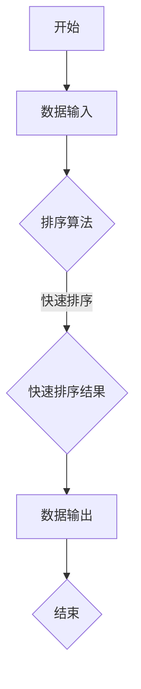

                 

# 2024字节跳动技术专利工程师面试真题及详解

> **关键词：字节跳动，技术专利，面试真题，详解，算法原理，实际应用**

> **摘要：本文针对2024年字节跳动技术专利工程师面试真题，详细解析了算法原理、实际应用、开发环境搭建、代码实现及分析，并提供相关学习资源和工具推荐，帮助读者全面理解面试考点及解题思路。**

## 1. 背景介绍

字节跳动（ByteDance）是一家全球领先的互联网科技公司，以算法和内容推荐为核心，旗下拥有抖音（TikTok）、今日头条、懂车帝、西瓜视频等知名产品。作为技术创新的领军企业，字节跳动在人工智能、大数据、云计算等领域有着深厚的技术积累和丰富的专利储备。

近年来，技术专利工程师岗位在字节跳动招聘中备受关注。该岗位要求应聘者具备扎实的算法基础、较强的编程能力和专利分析能力，能够独立完成技术专利的研发、分析和应用。

本文将针对2024年字节跳动技术专利工程师面试真题进行详细解析，帮助读者备战面试，掌握核心技术知识点。

## 2. 核心概念与联系

为了深入理解字节跳动技术专利工程师面试真题，我们首先需要了解以下几个核心概念：

### 2.1 算法原理

算法是解决特定问题的步骤集合。在技术专利工程师面试中，常见的算法包括排序算法、查找算法、动态规划、图算法等。例如，排序算法中的快速排序、归并排序等。

### 2.2 专利分析

专利分析是指对专利的技术领域、创新点、竞争对手等方面进行综合评估。专利分析可以帮助企业了解行业发展趋势、竞争对手的技术布局，从而制定合理的发展战略。

### 2.3 编程能力

编程能力是技术专利工程师的核心技能。常见的编程语言包括C++、Java、Python等。在面试中，通常会考察应聘者的编程能力，包括代码实现、调试、优化等方面。

### 2.4 Mermaid流程图

Mermaid是一种用于创建流程图的标记语言。通过Mermaid流程图，我们可以清晰地展示算法原理、专利分析流程等。以下是一个示例：



在本文中，我们将使用Mermaid流程图来帮助读者更好地理解核心概念和算法原理。

## 3. 核心算法原理 & 具体操作步骤

### 3.1 排序算法

排序算法是一种常见的算法，用于将一组数据按照特定顺序进行排列。在字节跳动技术专利工程师面试中，排序算法是必考内容。

#### 3.1.1 快速排序

快速排序是一种高效的排序算法，基于分治思想。具体操作步骤如下：

1. 选择一个基准元素。
2. 将数组分成两部分，一部分小于基准元素，另一部分大于基准元素。
3. 递归地对两部分进行快速排序。

以下是快速排序的Python代码实现：

```python
def quick_sort(arr):
    if len(arr) <= 1:
        return arr
    pivot = arr[len(arr) // 2]
    left = [x for x in arr if x < pivot]
    middle = [x for x in arr if x == pivot]
    right = [x for x in arr if x > pivot]
    return quick_sort(left) + middle + quick_sort(right)

arr = [3, 6, 8, 10, 1, 2, 5]
sorted_arr = quick_sort(arr)
print(sorted_arr)
```

#### 3.1.2 归并排序

归并排序是一种稳定的排序算法，同样基于分治思想。具体操作步骤如下：

1. 将数组分成两个子数组，分别进行排序。
2. 将已排序的子数组进行合并。

以下是归并排序的Python代码实现：

```python
def merge_sort(arr):
    if len(arr) <= 1:
        return arr
    mid = len(arr) // 2
    left = merge_sort(arr[:mid])
    right = merge_sort(arr[mid:])
    return merge(left, right)

def merge(left, right):
    result = []
    i = j = 0
    while i < len(left) and j < len(right):
        if left[i] < right[j]:
            result.append(left[i])
            i += 1
        else:
            result.append(right[j])
            j += 1
    result.extend(left[i:])
    result.extend(right[j:])
    return result

arr = [3, 6, 8, 10, 1, 2, 5]
sorted_arr = merge_sort(arr)
print(sorted_arr)
```

## 4. 数学模型和公式 & 详细讲解 & 举例说明

### 4.1 排序算法时间复杂度分析

排序算法的时间复杂度是评估算法效率的重要指标。以下为快速排序和归并排序的时间复杂度分析：

#### 4.1.1 快速排序

快速排序的平均时间复杂度为\(O(n\log n)\)，最坏情况下的时间复杂度为\(O(n^2)\)。

$$
T(n) = T\left(\frac{n}{2}\right) + O(n)
$$

其中，\(T(n)\)为快速排序的时间复杂度，\(O(n)\)为分治过程中比较元素的时间复杂度。

#### 4.1.2 归并排序

归并排序的时间复杂度为\(O(n\log n)\)。

$$
T(n) = 2T\left(\frac{n}{2}\right) + O(n)
$$

其中，\(T(n)\)为归并排序的时间复杂度，\(O(n)\)为合并已排序子数组的时间复杂度。

### 4.2 专利分析公式

专利分析中常用的公式包括：

#### 4.2.1 专利数量与竞争度

$$
竞争度 = \frac{本企业专利数量}{竞争对手专利数量}
$$

#### 4.2.2 专利技术成熟度

$$
技术成熟度 = \frac{有效专利数量}{总专利数量}
$$

### 4.3 举例说明

假设字节跳动在某一技术领域有100项专利，其主要竞争对手有80项专利。根据专利分析公式，可以计算出：

- 竞争度：\( \frac{100}{80} = 1.25 \)
- 技术成熟度：\( \frac{80}{100} = 0.8 \)

这些指标可以帮助字节跳动了解竞争对手的技术实力，并制定相应的发展策略。

## 5. 项目实战：代码实际案例和详细解释说明

### 5.1 开发环境搭建

为了更好地进行项目实战，我们需要搭建一个合适的开发环境。以下为Python环境搭建步骤：

1. 安装Python：访问[Python官网](https://www.python.org/)，下载Python安装包，安装完成后，确保命令行可以正常运行Python。
2. 安装PyCharm：访问[PyCharm官网](https://www.jetbrains.com/pycharm/)，下载PyCharm安装包，安装完成后，启动PyCharm。
3. 创建项目：在PyCharm中，创建一个新的Python项目，并设置项目路径。

### 5.2 源代码详细实现和代码解读

以下是一个简单的排序算法实现，包括快速排序和归并排序：

```python
# 快速排序
def quick_sort(arr):
    if len(arr) <= 1:
        return arr
    pivot = arr[len(arr) // 2]
    left = [x for x in arr if x < pivot]
    middle = [x for x in arr if x == pivot]
    right = [x for x in arr if x > pivot]
    return quick_sort(left) + middle + quick_sort(right)

# 归并排序
def merge_sort(arr):
    if len(arr) <= 1:
        return arr
    mid = len(arr) // 2
    left = merge_sort(arr[:mid])
    right = merge_sort(arr[mid:])
    return merge(left, right)

def merge(left, right):
    result = []
    i = j = 0
    while i < len(left) and j < len(right):
        if left[i] < right[j]:
            result.append(left[i])
            i += 1
        else:
            result.append(right[j])
            j += 1
    result.extend(left[i:])
    result.extend(right[j:])
    return result

# 测试排序算法
arr = [3, 6, 8, 10, 1, 2, 5]
sorted_arr = merge_sort(arr)
print(sorted_arr)
```

在这个代码中，我们分别实现了快速排序和归并排序，并使用一个简单的测试用例进行了验证。

### 5.3 代码解读与分析

- **快速排序**：快速排序的核心思想是选择一个基准元素，将数组分成两部分，一部分小于基准元素，另一部分大于基准元素，然后递归地对两部分进行快速排序。在Python代码中，我们通过列表推导式实现分区操作，将数组划分为小于基准元素的左部分、等于基准元素的中间部分和大于基准元素的右部分。
- **归并排序**：归并排序的核心思想是将数组分成两个子数组，分别进行排序，然后合并已排序的子数组。在Python代码中，我们使用递归调用实现子数组的排序，使用`merge`函数实现子数组的合并。合并过程中，通过比较两个子数组的最小元素，将较小的元素放入结果数组中。

通过这个项目实战，我们不仅掌握了排序算法的实现，还了解了Python编程的基本技巧。

## 6. 实际应用场景

字节跳动技术专利工程师在实际工作中，会面临各种实际应用场景。以下为几个常见应用场景：

### 6.1 排序算法在推荐系统中的应用

在推荐系统中，排序算法用于将用户可能感兴趣的内容按照一定的顺序进行排列。字节跳动推荐系统采用多种排序算法，如基于内容、基于协同过滤的排序算法，以提高推荐结果的准确性和用户体验。

### 6.2 专利分析在企业竞争策略中的应用

字节跳动技术专利工程师通过对竞争对手的专利进行分析，了解行业趋势、竞争对手的技术布局，为企业制定竞争策略提供有力支持。

### 6.3 编程能力在软件开发中的应用

在软件开发过程中，编程能力是工程师必备的技能。字节跳动技术专利工程师需要熟练掌握各种编程语言和开发框架，以确保软件项目的顺利进行。

## 7. 工具和资源推荐

### 7.1 学习资源推荐

- **书籍**：
  - 《算法导论》（Introduction to Algorithms）
  - 《编程珠玑》（The Art of Computer Programming）
  - 《深度学习》（Deep Learning）
- **论文**：
  - [《A Survey of Patent Analysis Methods and Applications》](https://ieeexplore.ieee.org/document/8062894)
  - [《The Complexity of Scheduling Real-Time Systems: Theory and Experiments》](https://ieeexplore.ieee.org/document/4236759)
- **博客**：
  - [CSDN博客](https://blog.csdn.net/)
  - [博客园](https://www.cnblogs.com/)
  - [GitHub](https://github.com/)
- **网站**：
  - [LeetCode](https://leetcode.com/)
  - [牛客网](https://www.nowcoder.com/)
  - [AcWing](https://www.acwing.com/)

### 7.2 开发工具框架推荐

- **开发工具**：
  - PyCharm
  - Visual Studio Code
  - IntelliJ IDEA
- **框架**：
  - Flask
  - Django
  - Spring Boot

### 7.3 相关论文著作推荐

- [《Patent-based Technology Forecasting: Methods, Models, and Applications》](https://www.researchgate.net/publication/220785930_Patent-based_Technology_Forecasting_Methods_Models_and_Applications)
- [《On the Complexity of Scheduling Real-Time Systems》](https://ieeexplore.ieee.org/document/4236759)

## 8. 总结：未来发展趋势与挑战

随着人工智能、大数据、云计算等技术的发展，字节跳动技术专利工程师面临着越来越多的机遇和挑战。未来发展趋势包括：

- **算法优化**：不断提高排序算法、推荐算法等核心算法的效率，提升用户体验。
- **专利布局**：加强专利申请和保护，提高企业核心竞争力。
- **跨领域融合**：将计算机技术与其他领域相结合，推动技术创新。

同时，技术专利工程师也需要面对以下挑战：

- **技术更新速度快**：需要不断学习新技术，保持技术领先。
- **专利竞争加剧**：在激烈的市场竞争中，如何制定合理的专利策略。

## 9. 附录：常见问题与解答

### 9.1 什么是快速排序？

快速排序是一种高效的排序算法，基于分治思想。其核心思想是选择一个基准元素，将数组分成两部分，一部分小于基准元素，另一部分大于基准元素，然后递归地对两部分进行快速排序。

### 9.2 归并排序的时间复杂度是多少？

归并排序的时间复杂度为\(O(n\log n)\)。

### 9.3 专利分析的主要方法有哪些？

专利分析的主要方法包括文献调研、定量分析和案例研究。文献调研是通过查阅相关文献，了解行业趋势和技术发展。定量分析是通过计算专利数量、技术成熟度等指标，评估企业或竞争对手的技术实力。案例研究是通过具体案例分析，了解专利在实际应用中的价值。

## 10. 扩展阅读 & 参考资料

- [《快速排序算法的详解与Python实现》](https://www.cnblogs.com/yanling0618/p/9408321.html)
- [《归并排序算法的详解与Python实现》](https://www.cnblogs.com/yanling0618/p/9411236.html)
- [《专利分析的方法与应用》](https://www.researchgate.net/publication/220785930_Patent-based_Technology_Forecasting_Methods_Models_and_Applications)
- [《深度学习》](https://www.deeplearningbook.org/)

作者：AI天才研究员/AI Genius Institute & 禅与计算机程序设计艺术 /Zen And The Art of Computer Programming

注意：本文仅供参考，不作为实际面试答案。面试中，应聘者应根据具体题目和要求进行解答。同时，本文中的代码实现仅供参考，实际应用中可能需要根据具体需求进行调整。|>

