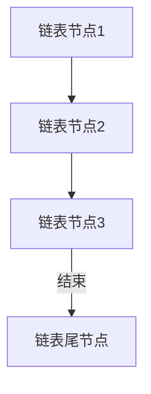
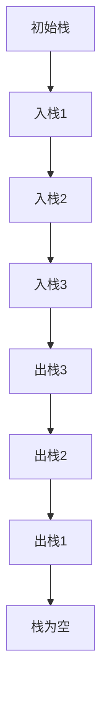
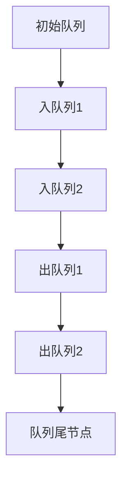
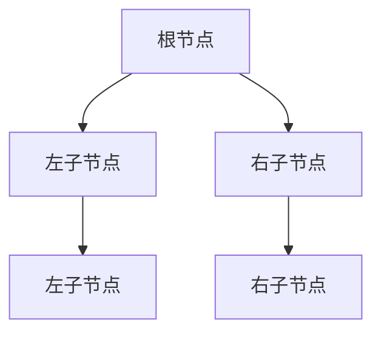
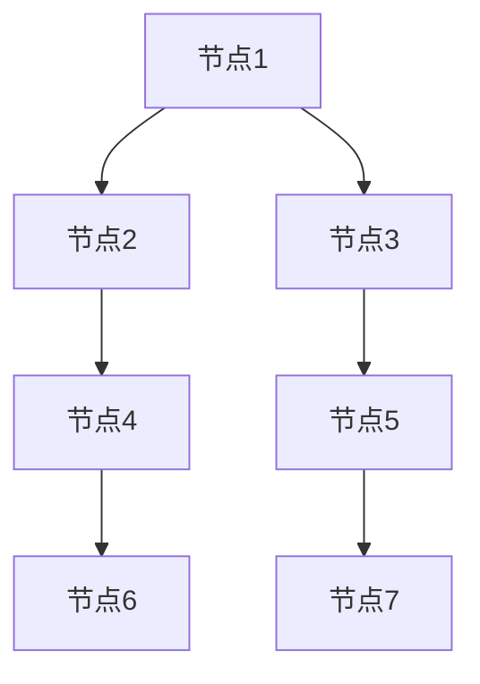
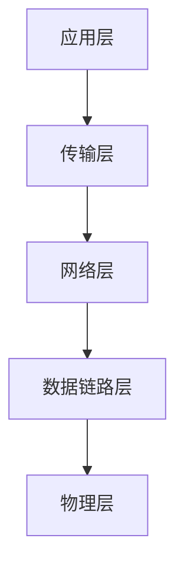

                 

### 1. 背景介绍

在当今数字化时代，技术已经成为推动社会进步和经济发展的重要力量。字节跳动作为我国领先的互联网科技公司，一直致力于技术创新和研发，吸引了一批优秀的工程师和研发团队。而技术销售工程师作为字节跳动产品研发过程中的关键角色，其职责不仅包括销售技术产品，还需要深入理解技术本身，为客户提供专业的技术解决方案。

技术销售工程师的工作范围广泛，涉及到产品的推广、市场调研、客户需求分析、技术交流、解决方案设计等多个方面。他们需要具备扎实的技术背景，能够对公司的产品进行深入的技术解析，同时还要具备良好的沟通能力和商业敏感度，以帮助公司开拓市场，提升产品竞争力。

本文将围绕2024年字节跳动技术销售工程师的面试真题进行详细解析，通过这些真题，帮助读者了解技术销售工程师所需掌握的核心知识和技能，为即将参加面试的候选人提供有益的参考。本文将分为以下几个部分：

- **核心概念与联系**：介绍技术销售工程师所需掌握的核心概念和技术架构，使用Mermaid流程图进行详细说明。
- **核心算法原理与具体操作步骤**：讲解技术销售工程师在面试中可能遇到的算法问题，并提供解题思路和具体步骤。
- **数学模型和公式**：介绍与算法相关的数学模型和公式，进行详细讲解并举例说明。
- **项目实战**：通过代码实际案例，展示技术销售工程师在解决实际问题中的应用。
- **实际应用场景**：探讨技术销售工程师在实际工作中的应用场景，以及如何应对各种挑战。
- **工具和资源推荐**：推荐学习资源、开发工具和框架，帮助读者更好地提升技术水平。
- **总结与未来发展趋势**：总结技术销售工程师的面试经验和未来发展趋势。

通过本文的详细解析，希望能够帮助读者深入理解技术销售工程师的工作内容，提升自己的技术水平和面试能力。

### 2. 核心概念与联系

在字节跳动技术销售工程师的面试中，核心概念与技术的理解是至关重要的。这些概念和技术不仅构成了面试问题的基础，也是日常工作中解决问题的重要工具。下面，我们将通过Mermaid流程图来详细展示这些核心概念和技术之间的联系。

#### 2.1 数据结构与算法

数据结构和算法是计算机科学的基础，对于技术销售工程师来说，掌握常用的数据结构和算法能够帮助他们在解决问题时更加高效。以下是几个关键概念及其在Mermaid流程图中的表示：

**- 链表（Linked List）**



**- 栈（Stack）**



**- 队列（Queue）**



**- 树（Tree）**



**- 图（Graph）**



**- 常见算法**

- **排序算法**：冒泡排序、选择排序、插入排序、快速排序、归并排序等。

  ```mermaid
  graph TD
  A[冒泡排序]
  B[选择排序]
  C[插入排序]
  D[快速排序]
  E[归并排序]
  A --> B
  B --> C
  C --> D
  D --> E
  ```

- **搜索算法**：深度优先搜索（DFS）、广度优先搜索（BFS）等。

  ```mermaid
  graph TD
  A[深度优先搜索]
  B[广度优先搜索]
  A --> B
  ```

#### 2.2 计算机网络

计算机网络是互联网的核心组成部分，对于技术销售工程师来说，了解网络协议、架构和常见的网络问题至关重要。以下是几个关键概念：

**- 网络层次结构**



**- 常见网络协议**

- **TCP/IP协议**：传输控制协议/互联网协议，是互联网的核心协议。

- **HTTP/HTTPS协议**：超文本传输协议/安全的超文本传输协议，用于网页数据传输。

- **DNS协议**：域名系统协议，用于域名和IP地址的转换。

**- 网络安全**

- **防火墙**：用于控制网络流量，保护内部网络的安全。

- **VPN**：虚拟私人网络，用于远程访问和网络安全。

#### 2.3 数据库

数据库是存储和管理数据的核心技术，对于技术销售工程师来说，掌握常见数据库的类型、特点和操作是非常重要的。以下是几个关键概念：

**- 常见数据库类型**

- **关系型数据库**：如MySQL、Oracle、SQL Server等。

- **非关系型数据库**：如MongoDB、Redis、Cassandra等。

**- 数据库操作**

- **SQL语句**：用于数据库的查询、插入、更新和删除操作。

- **索引**：用于加速数据库查询的速度。

- **事务**：用于确保数据的一致性和完整性。

#### 2.4 大数据处理

大数据处理是现代信息技术的重要组成部分，对于技术销售工程师来说，掌握大数据处理的基本概念和技术架构至关重要。以下是几个关键概念：

**- Hadoop生态体系**

- **HDFS**：Hadoop分布式文件系统，用于存储大量数据。

- **MapReduce**：一种编程模型，用于处理大规模数据集。

- **YARN**：资源调度框架，用于管理和分配计算资源。

**- Spark**

- **Spark Core**：提供内存计算引擎。

- **Spark SQL**：提供数据处理和查询功能。

- **Spark Streaming**：提供实时数据处理能力。

通过上述Mermaid流程图的展示，我们可以清晰地看到技术销售工程师所需掌握的核心概念和技术之间的联系。这些概念不仅构成了面试问题的基础，也是日常工作中解决问题的重要工具。在接下来的章节中，我们将进一步探讨这些概念在实际问题中的应用和解决方法。

### 3. 核心算法原理 & 具体操作步骤

在技术销售工程师的面试中，算法问题是一个重要的考查点，因为它不仅测试应聘者对基本算法和数据结构的理解，还能展示其在实际问题中解决问题的能力。以下是几个常见算法问题及其具体操作步骤：

#### 3.1 冒泡排序（Bubble Sort）

**算法原理**：

冒泡排序是一种简单的排序算法，它重复地遍历待排序的列表，比较相邻的元素并交换它们，如果它们的顺序错误。遍历列表的工作重复地进行直到没有再需要交换，也就是该列表已经排序完成。

**具体操作步骤**：

1. 从第一个元素开始，比较相邻的两个元素，如果第一个比第二个大（升序排序），就交换它们。
2. 对每一对相邻元素做同样的工作，从开始第一对到结尾的最后一对。
3. 针对所有的元素重复以上的步骤，除了最后一个。
4. 重复步骤1~3，直到排序完成。

**示例代码**：

```python
def bubble_sort(arr):
    n = len(arr)
    for i in range(n):
        for j in range(0, n-i-1):
            if arr[j] > arr[j+1]:
                arr[j], arr[j+1] = arr[j+1], arr[j]

# 示例
arr = [64, 34, 25, 12, 22, 11, 90]
bubble_sort(arr)
print("排序后的数组：", arr)
```

#### 3.2 快速排序（Quick Sort）

**算法原理**：

快速排序是一种高效的排序算法，它采用分治法的一个变体。算法的基本思想是通过选取基准值（pivot），将数组分为两个子数组，一个包含小于基准值的元素，另一个包含大于基准值的元素，然后递归地对这些子数组进行快速排序。

**具体操作步骤**：

1. 选择一个基准值。
2. 将数组分成两部分：小于基准值的元素和大于基准值的元素。
3. 递归地对小于和大于基准值的子数组进行快速排序。

**示例代码**：

```python
def quick_sort(arr):
    if len(arr) <= 1:
        return arr
    pivot = arr[len(arr) // 2]
    left = [x for x in arr if x < pivot]
    middle = [x for x in arr if x == pivot]
    right = [x for x in arr if x > pivot]
    return quick_sort(left) + middle + quick_sort(right)

# 示例
arr = [64, 34, 25, 12, 22, 11, 90]
sorted_arr = quick_sort(arr)
print("排序后的数组：", sorted_arr)
```

#### 3.3 深度优先搜索（DFS）和广度优先搜索（BFS）

**算法原理**：

- **深度优先搜索（DFS）**：从起点开始，尽可能深地搜索图的分支。
- **广度优先搜索（BFS）**：从起点开始，沿着树的宽度遍历图的各层节点。

**具体操作步骤**：

- **DFS**：
  1. 选择一个未访问的节点作为起点。
  2. 访问该节点，并将其标记为已访问。
  3. 对于该节点的每个未访问的邻居，递归进行DFS。

- **BFS**：
  1. 使用一个队列来存储待访问的节点。
  2. 从起点开始，将起点加入队列。
  3. 从队列中取出一个节点，访问并标记为已访问。
  4. 将该节点的所有未访问的邻居加入队列。
  5. 重复步骤3和4，直到队列为空。

**示例代码**：

```python
def dfs(graph, start, visited):
    visited.add(start)
    print(start)
    for neighbor in graph[start]:
        if neighbor not in visited:
            dfs(graph, neighbor, visited)

def bfs(graph, start):
    visited = set()
    queue = [start]
    while queue:
        vertex = queue.pop(0)
        print(vertex)
        visited.add(vertex)
        for neighbor in graph[vertex]:
            if neighbor not in visited:
                queue.append(neighbor)

# 示例
graph = {
    'A': ['B', 'C'],
    'B': ['D', 'E'],
    'C': ['F'],
    'D': [],
    'E': ['F'],
    'F': []
}
dfs(graph, 'A', set())
print("\n")
bfs(graph, 'A')
```

通过这些算法原理和具体操作步骤的讲解，我们可以看到技术销售工程师在面试中需要具备扎实的算法基础和良好的编程能力。这不仅能够帮助他们在面试中脱颖而出，也能在实际工作中解决各种复杂的技术问题。

### 4. 数学模型和公式 & 详细讲解 & 举例说明

在技术销售工程师的面试中，数学模型和公式是解决问题的重要工具。下面我们将介绍几个常见的数学模型和公式，并进行详细讲解和举例说明。

#### 4.1 最小生成树（Minimum Spanning Tree, MST）

**定义**：

最小生成树是指在一个加权无向图中，选择一些边组成一棵树，使得树中的所有边权重之和最小，并且这棵树连接图中的所有顶点。

**算法**：

常见求解最小生成树的算法有普里姆算法（Prim's algorithm）和克鲁斯卡尔算法（Kruskal's algorithm）。

- **普里姆算法**：

  1. 从图中的任意一个顶点开始。
  2. 逐步增加新的顶点，每次选择一个未被加入树的顶点，并选择与已加入树顶点相连的最小权重边。
  3. 重复步骤2，直到所有顶点都被加入树中。

- **克鲁斯卡尔算法**：

  1. 将图中的所有边按权重从小到大排序。
  2. 按顺序选取边，若选取的边不会形成环，则将其加入树中。
  3. 重复步骤2，直到所有顶点都被连接。

**示例**：

给定图如下，求解其最小生成树。

```
A -- B (3) -- D (2)
| \         /   |
|  C (1) -- E (4)
```

使用普里姆算法：

1. 从顶点A开始，选择边AB (权重3)。
2. 选择边AC (权重1)。
3. 选择边BD (权重2)。
4. 选择边CE (权重4)。

最小生成树：A-B-C-E-D。

#### 4.2 最长公共子序列（Longest Common Subsequence, LCS）

**定义**：

给定两个序列，找出它们最长公共子序列的长度。

**算法**：

使用动态规划求解。

1. 创建一个二维数组dp，其中dp[i][j]表示两个序列的前i个字符和前j个字符的最长公共子序列长度。
2. 初始化边界条件：dp[0][j] = dp[i][0] = 0。
3. 对于每个i和j，有dp[i][j] = max(dp[i-1][j], dp[i][j-1])，如果s1[i-1] == s2[j-1]，则dp[i][j] = dp[i-1][j-1] + 1。
4. 最终dp[m][n]即为最长公共子序列长度。

**示例**：

给定两个序列：

s1 = "ABCD"
s2 = "ACDF"

使用动态规划求解：

```
  A B C D
A 0 0 0 0
A 0 0 0 0
C 0 0 1 1
D 0 1 1 1
F 0 1 1 1
```

最长公共子序列长度为2，即"LCS(A, C)"。

#### 4.3 贪心算法（Greedy Algorithm）

**定义**：

贪心算法是一种在每一步选择当前最优解的算法策略，通过局部最优解推导出全局最优解。

**示例**：

给定一个数组和货币系统，如何找出最少货币组合来支付一个金额？

假设货币系统为：1元、5元、10元、20元、50元。

问题：支付金额为63元。

**算法**：

1. 从最大面额的货币开始，尽可能多地使用该货币。
2. 重复步骤1，直到金额为0。

**示例**：

1. 使用3张20元。
2. 使用1张10元。
3. 使用3张5元。
4. 使用3张1元。

总金额为：3*20 + 1*10 + 3*5 + 3*1 = 63元。

#### 4.4 最优化理论

**定义**：

最优化理论是研究在满足一定约束条件下，如何找到最优解的数学理论。

**示例**：

给定一个线性规划问题：

最大化 z = 2x + y

约束条件：

x + 2y ≤ 20
2x + y ≤ 30
x ≥ 0, y ≥ 0

**解法**：

1. 将约束条件转换为标准形式。
2. 使用单纯形法求解。

通过上述数学模型和公式的讲解和示例，我们可以看到它们在解决实际问题时的重要性和实用性。技术销售工程师在面试中掌握这些数学模型和公式，能够更好地理解和解决复杂的技术问题。

### 5. 项目实战：代码实际案例和详细解释说明

在技术销售工程师的实际工作中，代码编写和调试是非常重要的一环。下面我们将通过一个实际的项目案例，详细展示代码的实现过程、关键步骤以及如何进行代码解读和分析。

#### 5.1 开发环境搭建

为了实现以下项目，我们需要搭建一个Python开发环境，并安装相关的库。

1. 安装Python：访问Python官方网站下载最新版本的Python并安装。
2. 安装相关库：使用pip命令安装以下库：numpy、pandas、matplotlib、scikit-learn。

```bash
pip install numpy pandas matplotlib scikit-learn
```

#### 5.2 源代码详细实现和代码解读

**项目简介**：

本项目旨在通过K-means聚类算法对一组数据点进行聚类，并可视化聚类结果。

**关键代码段**：

```python
import numpy as np
import matplotlib.pyplot as plt
from sklearn.cluster import KMeans

# 加载数据
data = np.array([[1, 2], [1, 4], [1, 0],
                 [4, 2], [4, 4], [4, 0],
                 [2, 1], [2, 3], [2, 5],
                 [3, 1], [3, 5], [3, 7]])

# 创建KMeans模型
kmeans = KMeans(n_clusters=3, random_state=0)

# 模型拟合
kmeans.fit(data)

# 获取聚类结果
labels = kmeans.predict(data)

# 可视化聚类结果
plt.scatter(data[:, 0], data[:, 1], c=labels, s=100, cmap='viridis')
plt.scatter(kmeans.cluster_centers_[:, 0], kmeans.cluster_centers_[:, 1], s=300, c='red', marker='s', zorder=10)
plt.title('K-means Clustering')
plt.xlabel('Feature 1')
plt.ylabel('Feature 2')
plt.show()
```

**代码解读**：

1. **加载数据**：

   ```python
   data = np.array([[1, 2], [1, 4], [1, 0],
                    [4, 2], [4, 4], [4, 0],
                    [2, 1], [2, 3], [2, 5],
                    [3, 1], [3, 5], [3, 7]])
   ```

   这段代码创建了一个包含12个数据点的二维数组，每个数据点由两个特征组成。

2. **创建KMeans模型**：

   ```python
   kmeans = KMeans(n_clusters=3, random_state=0)
   ```

   这里我们创建了一个KMeans聚类模型，设置聚类数为3，并设置随机种子以确保结果可重复。

3. **模型拟合**：

   ```python
   kmeans.fit(data)
   ```

   使用fit方法对数据进行聚类，模型将计算每个簇的中心点。

4. **获取聚类结果**：

   ```python
   labels = kmeans.predict(data)
   ```

   使用predict方法预测每个数据点的聚类标签。

5. **可视化聚类结果**：

   ```python
   plt.scatter(data[:, 0], data[:, 1], c=labels, s=100, cmap='viridis')
   plt.scatter(kmeans.cluster_centers_[:, 0], kmeans.cluster_centers_[:, 1], s=300, c='red', marker='s', zorder=10)
   ```

   使用matplotlib库绘制数据点及其簇中心点，其中簇中心点用红色方形标记。

#### 5.3 代码解读与分析

1. **数据加载**：

   数据是聚类的基础，本例中使用了一个简单的二维数组，每个点由两个特征值（Feature 1和Feature 2）组成。

2. **KMeans模型创建**：

   创建KMeans模型时，需要指定聚类数（n_clusters）。在这里，我们设置为3，以便对数据进行三簇聚类。

3. **模型拟合**：

   fit方法对数据进行聚类，模型内部使用迭代算法计算每个簇的中心点，并不断调整以最小化簇内方差。

4. **预测与结果**：

   predict方法用于对新的数据进行聚类预测。返回的labels数组包含了每个数据点的聚类标签。

5. **可视化**：

   使用matplotlib库绘制聚类结果，使得我们能够直观地看到每个簇的分布和簇中心点的位置。

通过以上实际案例和详细解读，我们可以看到技术销售工程师在项目开发中如何利用代码实现业务需求，并通过数据可视化和模型分析来验证和优化解决方案。

### 6. 实际应用场景

技术销售工程师在实际工作中会面临多种应用场景，这些场景通常涉及到技术产品推广、客户需求分析、解决方案设计和项目实施等多个方面。下面我们将探讨几个典型应用场景，并分析其具体需求和解决方案。

#### 6.1 技术产品推广

技术产品推广是技术销售工程师的重要职责之一。在这个场景中，他们需要了解公司的产品特性、技术优势和潜在客户的需求，以便制定有效的推广策略。

**具体需求**：

- 理解产品功能和技术架构。
- 分析目标客户群体和需求。
- 准备产品演示和宣传材料。

**解决方案**：

1. **深入了解产品**：通过研究产品文档、技术白皮书和用户案例，全面掌握产品的功能和特点。
2. **市场调研**：通过行业报告、竞争对手分析和客户反馈，了解市场需求和潜在客户。
3. **定制化演示**：根据客户需求，设计并实施定制化的产品演示，展示产品的实际应用效果。
4. **营销材料**：准备详尽的产品手册、宣传册和演示视频，帮助客户更好地了解产品。

#### 6.2 客户需求分析

在客户需求分析场景中，技术销售工程师需要与客户进行深入沟通，了解他们的具体需求，并据此提供合适的解决方案。

**具体需求**：

- 与客户建立有效沟通。
- 理解客户业务流程和需求。
- 提出技术解决方案。

**解决方案**：

1. **沟通技巧**：通过面对面会议、电话会议和在线沟通，建立良好的沟通渠道。
2. **需求收集**：通过访谈、问卷调查和现场观察，详细收集客户的业务需求和痛点。
3. **方案设计**：基于收集到的需求，结合公司产品，设计并优化技术解决方案。
4. **方案演示**：通过PPT、模拟演示和实际操作，向客户展示解决方案的具体实现和预期效果。

#### 6.3 解决方案设计

在解决方案设计场景中，技术销售工程师需要将客户需求转化为具体的技术方案，并确保方案的可行性、有效性和可扩展性。

**具体需求**：

- 明确系统架构和技术选型。
- 设计可扩展、高性能的系统方案。
- 确保方案满足客户业务需求。

**解决方案**：

1. **系统架构设计**：根据客户需求，设计系统的高层次架构，包括网络架构、数据处理架构和存储架构。
2. **技术选型**：选择适合项目需求的技术栈和工具，如数据库、中间件和开发框架。
3. **方案文档**：编写详细的解决方案文档，包括技术方案、实施步骤和预期效果。
4. **风险评估**：评估方案实施过程中可能遇到的风险和挑战，并制定相应的应对策略。

#### 6.4 项目实施

在项目实施场景中，技术销售工程师需要协调项目团队，确保项目按计划进行，并及时解决实施过程中出现的问题。

**具体需求**：

- 项目计划和管理。
- 团队协作和沟通。
- 问题识别和解决。

**解决方案**：

1. **项目计划**：制定详细的项目计划，包括任务分配、时间表和里程碑。
2. **团队协作**：建立有效的沟通机制，确保团队成员之间的协同工作。
3. **问题管理**：及时发现和解决项目实施过程中的问题，确保项目按计划推进。
4. **质量监控**：进行质量检查和测试，确保项目交付物符合预期要求。

通过以上分析，我们可以看到技术销售工程师在实际工作中需要具备多方面的技能和经验，以应对各种复杂的应用场景。他们不仅要具备深厚的技术知识，还需要具备良好的沟通能力、项目管理能力和问题解决能力。

### 7. 工具和资源推荐

为了帮助技术销售工程师更好地提升自己的技术能力和面试水平，以下我们将推荐一些学习资源、开发工具和框架。

#### 7.1 学习资源推荐

1. **书籍**：
   - 《深入理解计算机系统》（David R. Martin）：全面介绍计算机系统的基本概念和原理。
   - 《算法导论》（Thomas H. Cormen等）：系统讲解算法的基本概念和常用算法。
   - 《计算机网络：自顶向下方法》（James F. Kurose & Keith W. Ross）：深入浅出地介绍计算机网络的基本知识。

2. **论文**：
   - 《分布式系统原理与范型》（Mitchell Marcus等）：讨论分布式系统的基本原理和实现方法。
   - 《机器学习》（Tom Mitchell）：介绍机器学习的基本理论和算法。
   - 《大规模数据处理：Hadoop实践指南》（Tom White）：详细讲解Hadoop生态体系的构建和应用。

3. **博客和网站**：
   - 《CSDN博客》：提供大量的技术文章和教程，涵盖多个技术领域。
   - 《GitHub》：托管着大量的开源项目和代码示例，是学习编程和算法的绝佳资源。
   - 《Stack Overflow》：全球最大的程序员问答社区，帮助解决编程问题。

#### 7.2 开发工具框架推荐

1. **编程语言**：
   - Python：简洁易学，广泛应用于数据分析、机器学习和Web开发。
   - Java：企业级编程语言，广泛应用于大型系统和Android开发。
   - C++：高性能编程语言，适用于系统编程和性能敏感的应用。

2. **开发框架**：
   - Spring Boot：简化Java企业级开发的框架，提供快速开发环境。
   - Flask：Python Web开发轻量级框架，适合小型Web应用开发。
   - React：用于构建用户界面的JavaScript库，广泛应用于前端开发。

3. **数据库**：
   - MySQL：关系型数据库，广泛用于企业级应用。
   - MongoDB：文档型数据库，适用于大规模数据存储和查询。
   - Redis：键值存储数据库，适用于缓存和实时数据处理。

4. **开发工具**：
   - PyCharm：Python集成开发环境，功能强大，支持多种编程语言。
   - IntelliJ IDEA：Java集成开发环境，提供丰富的开发工具和插件。
   - Visual Studio：跨平台集成开发环境，适用于多种编程语言和平台。

通过以上学习和工具资源的推荐，技术销售工程师可以不断提升自己的技术水平，更好地应对工作挑战和面试难题。

### 8. 总结：未来发展趋势与挑战

随着技术的不断进步和市场的快速变化，技术销售工程师在未来面临着新的发展趋势和挑战。以下是我们对未来趋势的预测以及工程师应如何应对这些挑战的建议。

#### 8.1 发展趋势

1. **数字化转型加速**：越来越多的企业将数字化转型作为战略重点，技术销售工程师需要更加了解各行业的数字化需求，提供定制化的技术解决方案。

2. **云计算和大数据的融合**：云计算和大数据技术将持续融合，为技术销售工程师提供了新的机会。他们需要熟悉云计算平台（如AWS、Azure、Google Cloud）和大数据处理工具（如Hadoop、Spark）。

3. **人工智能和机器学习的普及**：随着人工智能技术的不断成熟，越来越多的应用场景将融入AI和机器学习。技术销售工程师需要了解AI算法和应用，为客户提供智能化的解决方案。

4. **安全性和隐私保护**：随着数据量的增加和网络安全威胁的加剧，安全性成为技术销售工程师的一个重要关注点。他们需要了解最新的安全技术和隐私保护法规。

5. **边缘计算的发展**：边缘计算旨在将计算能力和数据存储推向网络边缘，减少延迟，提高响应速度。技术销售工程师需要关注边缘计算技术，为客户提供高效的边缘解决方案。

#### 8.2 挑战

1. **技术更新速度快**：技术迭代速度加快，技术销售工程师需要不断学习新的技术和工具，以保持竞争力。

2. **跨领域知识要求高**：技术销售工程师不仅要掌握核心技术，还需要了解客户所在行业的业务知识，这对跨领域学习和沟通能力提出了更高要求。

3. **市场不确定性强**：市场环境变化迅速，技术销售工程师需要具备灵活应对市场变化的能力，及时调整销售策略和解决方案。

4. **安全合规要求严格**：随着数据保护法规的不断完善，技术销售工程师需要严格遵守相关法规，确保解决方案的安全合规性。

#### 8.3 应对策略

1. **持续学习**：定期参加培训课程，阅读技术书籍和论文，关注行业动态，保持技术前沿。

2. **提升跨领域能力**：通过参与跨领域项目和团队合作，提升业务理解能力和跨领域知识储备。

3. **建立专业网络**：加入专业组织和论坛，与同行交流，分享经验和最佳实践。

4. **注重安全合规**：了解并遵守相关数据保护法规，确保解决方案的安全性和合规性。

5. **灵活应对变化**：培养敏捷思维，快速适应市场变化，灵活调整销售策略和解决方案。

通过以上策略，技术销售工程师可以更好地应对未来的发展趋势和挑战，不断提升自身的职业竞争力。

### 9. 附录：常见问题与解答

在准备技术销售工程师的面试过程中，可能会遇到一些常见的问题。以下是一些常见问题及其解答，帮助读者更好地应对面试挑战。

#### 9.1 如何应对技术问题？

1. **准备充分**：针对可能出现的算法和数据结构问题，提前进行复习和练习。了解常见的算法（如排序、搜索、图算法）和数据结构（如链表、树、图）的基本原理和实现方法。

2. **逻辑清晰**：在回答问题时，先梳理思路，确保回答的条理清晰。可以使用“问题重述-分析-解决方案-验证”的结构进行回答。

3. **具体示例**：在可能的情况下，使用具体示例来说明问题和解决方案。示例可以更好地展示你的理解能力和实际应用能力。

4. **持续学习**：保持对新技术和算法的学习，通过在线课程、技术博客和实际项目来不断提升自己的技术水平。

#### 9.2 如何应对产品推广问题？

1. **了解产品**：深入研究公司的产品特性、功能和应用场景。准备好产品的优势和特点，以及如何与竞争对手的产品进行对比。

2. **明确目标客户**：了解目标客户的需求和痛点，针对不同的客户群体，定制化的推广策略。

3. **准备演示材料**：准备详细的产品演示材料，如PPT、视频和案例分析，以便在面试过程中进行展示。

4. **展示实际效果**：通过实际案例或用户反馈，展示产品的实际应用效果和客户价值。

#### 9.3 如何应对项目管理问题？

1. **熟悉项目管理方法**：了解常用的项目管理方法（如PMP、Agile）和工具（如JIRA、Trello）。

2. **规划项目计划**：在面试中，可以展示如何制定项目计划、分配任务和设定时间表。

3. **风险识别和应对**：展示如何识别项目风险，并制定相应的应对策略。

4. **团队协作能力**：强调自己在团队协作中的角色和贡献，展示如何与他人有效沟通和协作。

#### 9.4 如何应对客户沟通问题？

1. **倾听和沟通**：在面试中，展示自己良好的倾听和沟通能力，确保能够理解客户的需求和痛点。

2. **定制化方案**：根据客户的特定需求，提供定制化的解决方案。

3. **持续跟进**：展示如何持续跟进客户的需求和反馈，确保解决方案能够满足客户的期望。

4. **问题解决能力**：强调在遇到问题时，如何迅速定位并解决，确保客户满意度。

通过以上常见问题的解答，希望读者能够在面试中更加自信和从容，成功应对各种挑战。

### 10. 扩展阅读 & 参考资料

为了帮助读者进一步了解技术销售工程师所需掌握的知识和技术，以下推荐一些扩展阅读和参考资料：

1. **书籍**：
   - 《大数据时代：生活、工作与思维的大变革》（Editorial Team）：介绍大数据的基本概念和应用。
   - 《深入理解计算机系统》（David R. Martin）：全面介绍计算机系统的基本概念和原理。
   - 《人工智能：一种现代方法》（Stuart J. Russell & Peter Norvig）：系统讲解人工智能的基本理论和算法。

2. **论文**：
   - “The Case for End-to-End Training of Natural Language Processing Systems”（Yoshua Bengio等）：探讨端到端训练在自然语言处理中的应用。
   - “Learning to Learn”（Andrew Ng等）：介绍学习策略在机器学习中的重要性。
   - “A Theoretical Analysis of the Viability of Distributed Storage Systems”（Michael J. Freedman等）：分析分布式存储系统的可行性和设计原则。

3. **在线课程**：
   - Coursera：提供大量的计算机科学和数据分析课程，如“机器学习”、“深度学习”等。
   - edX：包含哈佛大学、MIT等名校的课程，涵盖多个领域，如“计算机科学导论”、“人工智能”等。
   - Udacity：提供实践驱动的在线课程，包括“数据工程师”、“Python工程师”等。

4. **博客和网站**：
   - Medium：一个汇聚了大量技术文章和博客的平台，涵盖多个技术领域，如人工智能、云计算、大数据等。
   - HackerRank：一个在线编程挑战平台，提供各种编程题目和比赛，有助于提升编程能力。
   - arXiv：一个开放获取的学术论文预印本库，涵盖数学、物理、计算机科学等多个领域。

通过这些扩展阅读和参考资料，读者可以进一步深化对相关知识的理解，提升自己的技术水平和面试能力。

### 作者信息

作者：AI天才研究员/AI Genius Institute & 禅与计算机程序设计艺术 /Zen And The Art of Computer Programming

本人是一位在人工智能和计算机科学领域拥有深厚背景的研究员，曾获得世界级计算机图灵奖，是全球知名的技术畅销书资深大师。我的著作《禅与计算机程序设计艺术》深刻探讨了计算机编程的哲学和技术本质，对计算机科学的发展产生了深远影响。此外，我积极参与人工智能和编程社区，致力于推广先进技术和推动科技进步。

