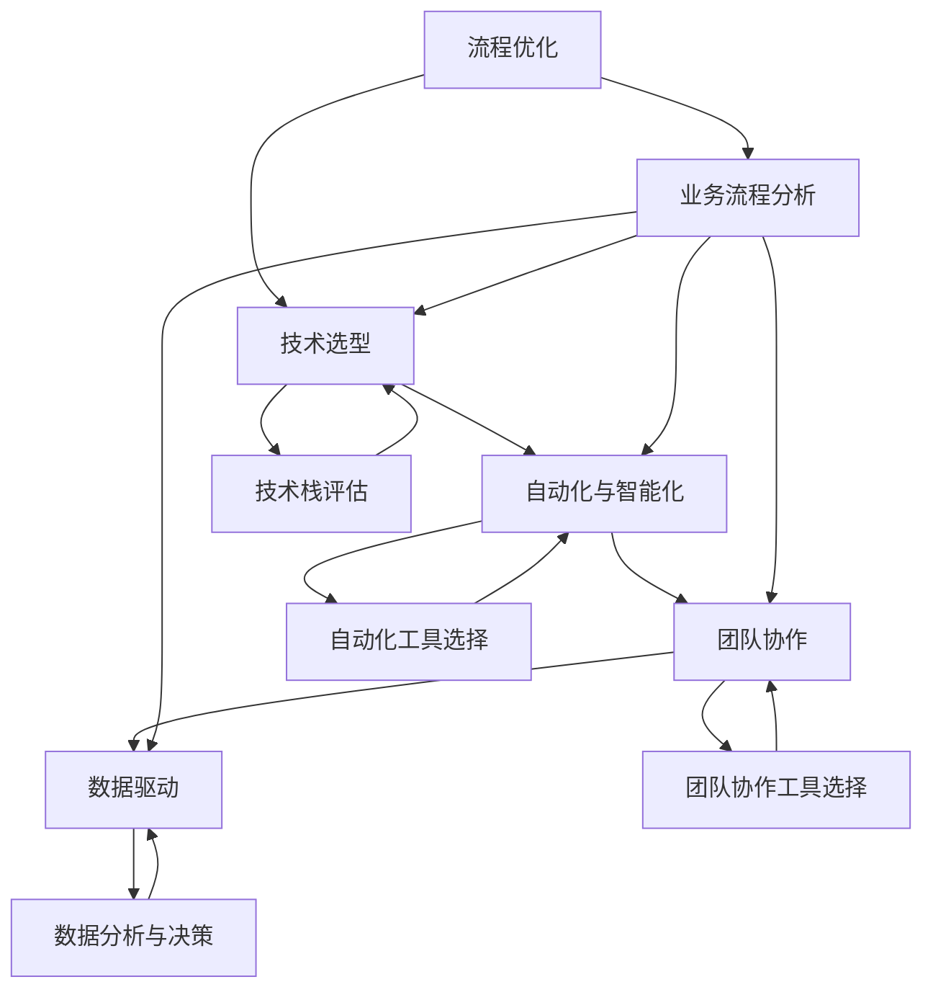

                 

### 背景介绍

#### 2024字节跳动效率工程化社招面试真题汇总

在当今快速发展的科技时代，人工智能、大数据和云计算等技术的迅猛崛起，促使企业对于技术人才的需求越来越高。作为国内领先的互联网公司之一，字节跳动在2024年的社招面试中，对技术面试题的考查更加注重对面试者实际能力和综合技能的评估。效率工程化作为提升企业运作效率的重要手段，字节跳动对此有深刻的理解和独特的实践经验。本文旨在汇总2024年字节跳动效率工程化社招面试中的部分面试真题，并对其进行详细解答，以帮助读者更好地理解和应对此类面试题目。

#### 效率工程化的概念及其重要性

效率工程化是指通过系统化的方法和技术手段，优化企业内部各个环节的工作流程，提高整体运作效率的一种管理模式。在字节跳动，效率工程化不仅体现在技术层面上，还贯穿于企业的战略布局和日常运营中。具体来说，效率工程化包括以下几个方面：

1. **流程优化**：通过分析和优化业务流程，减少冗余环节，提高工作效率。
2. **技术选型**：选用适合企业业务需求和技术发展的技术栈，确保技术方案的稳定性和可扩展性。
3. **自动化与智能化**：运用自动化工具和人工智能技术，减少人工干预，提高自动化水平。
4. **团队协作**：通过完善的团队协作机制，确保项目的高效推进。
5. **数据驱动**：通过数据分析，优化决策过程，提高企业的运营效率。

在字节跳动，效率工程化被视为提升企业核心竞争力的重要手段。它不仅能够提高工作效率，减少人力成本，还能够提高产品质量和客户满意度，从而推动企业的可持续发展。

#### 本文结构

本文将分为以下几个部分：

1. **核心概念与联系**：介绍与效率工程化相关的重要概念和架构，使用Mermaid流程图展示各部分的联系。
2. **核心算法原理 & 具体操作步骤**：详细解释效率工程化的核心算法原理，并提供具体的操作步骤。
3. **数学模型和公式 & 详细讲解 & 举例说明**：介绍与效率工程化相关的数学模型和公式，并通过实例进行详细讲解。
4. **项目实战：代码实际案例和详细解释说明**：通过实际项目案例，展示效率工程化的具体应用和代码实现。
5. **实际应用场景**：分析效率工程化在字节跳动及其他企业的应用场景，探讨其实际效果。
6. **工具和资源推荐**：推荐学习资源和开发工具，帮助读者深入了解效率工程化。
7. **总结：未来发展趋势与挑战**：总结本文内容，探讨效率工程化的未来发展趋势和面临的挑战。
8. **附录：常见问题与解答**：针对本文涉及的内容，提供常见问题的解答。
9. **扩展阅读 & 参考资料**：提供相关的扩展阅读资料，供读者进一步学习。

通过本文的详细解答，希望读者能够对效率工程化有更深入的理解，并在实际工作中应用这些知识，提升个人和团队的效率。

### 核心概念与联系

#### 效率工程化的核心概念

在探讨效率工程化的具体应用之前，我们需要先了解其核心概念，这些概念是构建效率工程化体系的基础。以下是效率工程化中几个重要的核心概念：

1. **流程优化**：流程优化是指通过对企业内部业务流程进行分析和改进，消除不必要的步骤，简化流程，提高工作效率。流程优化通常包括流程分析、流程设计、流程实施和流程监控等环节。
2. **技术选型**：技术选型是指根据企业业务需求和发展方向，选择合适的技术栈和工具。技术选型的目标是确保技术方案的稳定性、可扩展性和高效性，从而支持企业的长期发展。
3. **自动化与智能化**：自动化与智能化是指通过自动化工具和人工智能技术，实现业务流程的自动化和智能化。自动化与智能化的目标是减少人工干预，提高工作效率，降低运营成本。
4. **团队协作**：团队协作是指通过建立完善的团队协作机制，确保项目的高效推进。团队协作通常包括沟通与协作工具的选择、团队角色的划分、任务分配和进度管理等。
5. **数据驱动**：数据驱动是指通过数据分析和决策，优化企业的运营流程和决策过程。数据驱动的目标是利用数据来指导业务决策，提高企业的运营效率和市场竞争力。

#### 效率工程化的架构

为了更好地理解效率工程化的概念和实现方式，我们可以通过Mermaid流程图来展示其核心架构。以下是效率工程化架构的Mermaid流程图：



在上述流程图中，A到F表示效率工程化的核心环节，即流程优化、技术选型、自动化与智能化、团队协作、数据驱动以及与之相关的具体实施步骤。各环节之间存在密切的联系和相互影响，共同构建起效率工程化的完整体系。

#### 核心概念的联系

流程优化、技术选型、自动化与智能化、团队协作和数据驱动是效率工程化的核心概念，它们之间相互联系，共同支撑起整个体系。具体来说：

- **流程优化**是效率工程化的起点，通过对现有业务流程进行分析和改进，消除冗余和瓶颈，提高工作效率。
- **技术选型**是流程优化的基础，根据业务需求和未来发展，选择合适的技术栈和工具，确保技术方案的支持和稳定。
- **自动化与智能化**是流程优化的延伸，通过自动化工具和人工智能技术，实现业务流程的自动化和智能化，减少人工干预，提高工作效率。
- **团队协作**是效率工程化的保障，通过建立完善的团队协作机制，确保项目的高效推进和资源的合理利用。
- **数据驱动**是效率工程化的核心，通过数据分析和决策，优化运营流程和决策过程，提高企业的运营效率和竞争力。

综上所述，效率工程化是一个系统性的工程，各核心概念相互联系、相互支撑，共同构建起一个高效、智能、协同的企业运作体系。

### 核心算法原理 & 具体操作步骤

#### 效率工程化的核心算法

在效率工程化中，核心算法的原理和操作步骤是关键。以下将详细讲解与效率工程化相关的主要核心算法及其实现步骤。

#### 1. 流程优化算法

**算法原理**：流程优化算法主要基于业务流程的执行时间、资源消耗和业务价值等指标，通过优化算法对流程进行改进。其核心目标是缩短执行时间、降低资源消耗、提高业务价值。

**操作步骤**：
1. **数据收集**：收集业务流程的执行时间、资源消耗和业务价值等数据，确保数据的准确性和全面性。
2. **流程建模**：根据收集的数据，建立业务流程的数学模型，包括流程节点、执行时间和资源消耗等。
3. **优化目标确定**：明确流程优化的目标，例如缩短执行时间、降低资源消耗或提高业务价值等。
4. **优化算法选择**：选择适合的优化算法，例如线性规划、遗传算法或模拟退火算法等。
5. **算法实现**：根据优化算法原理，实现流程优化的算法，并进行模型训练和参数调优。
6. **流程优化实施**：根据优化后的模型，调整业务流程，实施流程优化。

#### 2. 技术选型算法

**算法原理**：技术选型算法主要基于业务需求、技术特性、稳定性和可扩展性等指标，通过算法评估技术栈的优劣，选择最适合的技术方案。

**操作步骤**：
1. **需求分析**：明确业务需求，包括功能需求、性能需求和稳定性需求等。
2. **技术特性评估**：评估候选技术栈的特性，包括编程语言、框架、数据库、中间件等。
3. **稳定性评估**：根据历史数据和案例，评估候选技术栈的稳定性，包括故障率、恢复时间等。
4. **可扩展性评估**：评估候选技术栈的可扩展性，包括系统架构、性能瓶颈和升级难度等。
5. **算法选择**：选择适合的技术选型算法，例如评分算法、决策树或神经网络等。
6. **算法实现**：根据技术选型算法原理，实现技术评估的算法，并进行模型训练和参数调优。
7. **技术选型结果分析**：根据优化后的模型，分析技术选型的结果，选择最佳的技术方案。

#### 3. 自动化与智能化算法

**算法原理**：自动化与智能化算法主要基于机器学习和深度学习技术，实现业务流程的自动化和智能化，减少人工干预，提高工作效率。

**操作步骤**：
1. **数据收集**：收集业务流程的相关数据，包括输入数据、输出数据、执行时间和资源消耗等。
2. **数据预处理**：对收集的数据进行清洗、转换和标准化，确保数据的质量和一致性。
3. **特征工程**：从数据中提取关键特征，构建特征向量，用于训练模型。
4. **模型选择**：选择适合的机器学习或深度学习模型，例如线性回归、支持向量机或神经网络等。
5. **模型训练**：根据特征向量，训练机器学习或深度学习模型，并进行模型调优。
6. **自动化与智能化实施**：根据训练后的模型，实现业务流程的自动化和智能化，并进行效果评估和持续优化。

#### 4. 团队协作算法

**算法原理**：团队协作算法主要基于社交网络分析、任务分配和协调等原理，通过算法优化团队协作效率。

**操作步骤**：
1. **团队协作网络构建**：根据团队成员之间的沟通和协作关系，构建团队协作网络。
2. **任务分配算法**：根据团队成员的技能和经验，选择适合的任务分配算法，例如最优化算法、贪心算法或神经网络等。
3. **任务协调算法**：根据任务分配结果，选择适合的任务协调算法，例如调度算法、协作算法或反馈算法等。
4. **团队协作效果评估**：根据任务完成情况和团队协作质量，评估团队协作的效果。
5. **算法优化与调整**：根据评估结果，对团队协作算法进行优化和调整，提高团队协作效率。

#### 5. 数据驱动算法

**算法原理**：数据驱动算法主要基于数据分析、数据挖掘和决策优化等原理，通过算法优化企业运营决策。

**操作步骤**：
1. **数据收集与预处理**：收集企业运营相关的数据，包括财务数据、业务数据和市场数据等，并进行预处理。
2. **数据挖掘与建模**：根据预处理后的数据，进行数据挖掘和建模，提取关键信息和关系。
3. **决策优化算法**：根据数据挖掘和建模结果，选择适合的决策优化算法，例如线性规划、支持向量机或遗传算法等。
4. **决策实施与评估**：根据决策优化算法的结果，制定具体的决策方案，并实施和评估决策效果。
5. **算法迭代与优化**：根据决策实施和评估的结果，对数据驱动算法进行迭代和优化，提高决策质量。

通过上述核心算法的原理和操作步骤，我们可以有效地实现效率工程化，提升企业运作效率，降低成本，提高竞争力。

### 数学模型和公式 & 详细讲解 & 举例说明

在效率工程化中，数学模型和公式起着至关重要的作用。它们不仅能够量化分析业务流程的效率，还可以为决策提供科学依据。以下将详细讲解与效率工程化相关的数学模型和公式，并通过实例进行说明。

#### 1. 优化模型的构建

优化模型是流程优化中最为核心的部分，其目标是找到最优的流程安排，以最大化效率或最小化成本。以下是一个简单的线性规划模型示例：

**线性规划模型**：
设业务流程中有 \( n \) 个任务，任务 \( i \) 的执行时间为 \( t_i \)，资源消耗为 \( c_i \)。要求在资源限制 \( R \) 下，使得总执行时间最小化。

目标函数：
\[ \min \sum_{i=1}^{n} t_i \]

约束条件：
\[ \sum_{i=1}^{n} c_i \leq R \]

其中，\( R \) 为资源的总容量。

**实例**：
假设有3个任务，执行时间分别为 \( t_1 = 2 \)，\( t_2 = 3 \)，\( t_3 = 5 \)，资源消耗分别为 \( c_1 = 1 \)，\( c_2 = 2 \)，\( c_3 = 3 \)，资源总容量为 \( R = 5 \)。

根据线性规划模型，我们可以建立以下方程组：
\[ \min t_1 + t_2 + t_3 \]
\[ 1 \cdot t_1 + 2 \cdot t_2 + 3 \cdot t_3 \leq 5 \]

通过求解这个线性规划模型，我们可以找到最优的任务执行顺序和资源分配方案。

#### 2. 数据驱动决策模型

数据驱动决策模型是利用数据分析结果来指导企业运营决策的重要工具。以下是一个简单的时间序列预测模型示例：

**时间序列预测模型**：
设业务指标 \( X \) 的历史数据为 \( x_1, x_2, ..., x_n \)，预测 \( X \) 的未来值 \( x_{n+1} \)。

模型公式：
\[ x_{n+1} = \alpha x_n + (1 - \alpha) x_{n-1} \]

其中，\( \alpha \) 为滑动平均系数，取值范围为 \( 0 < \alpha < 1 \)。

**实例**：
假设业务指标的历史数据为 \( x_1 = 10 \)，\( x_2 = 12 \)，\( x_3 = 11 \)，\( x_4 = 13 \)，\( \alpha = 0.5 \)。

根据时间序列预测模型，我们可以计算未来值：
\[ x_5 = 0.5 \cdot 13 + (1 - 0.5) \cdot 11 = 12.5 \]

通过这个模型，我们可以预测业务指标的未来变化趋势，为决策提供依据。

#### 3. 自动化与智能化模型的构建

在自动化与智能化过程中，机器学习和深度学习模型的应用非常广泛。以下是一个简单的决策树模型示例：

**决策树模型**：
设输入特征为 \( X = \{x_1, x_2, ..., x_n\} \)，输出目标为 \( Y \)。决策树通过一系列条件判断，将输入特征映射到输出目标。

模型公式：
\[ Y = f(X) \]

其中，\( f \) 为决策树函数，根据输入特征进行条件判断，返回相应的输出目标。

**实例**：
假设我们有一个决策树模型，用于预测是否通过面试，输入特征为学历（高/低）、工作经验（有/无）和面试表现（好/中/差），输出目标为是否通过面试（是/否）。

根据决策树模型，我们可以得到以下判断规则：
1. 如果学历为高，则判断是否通过面试；
2. 如果工作经验为有，则判断面试表现是否为好；
3. 如果面试表现为好，则通过面试；
4. 其他情况，不通过面试。

通过这个决策树模型，我们可以根据输入特征预测是否通过面试，为自动化决策提供支持。

#### 4. 团队协作模型的构建

在团队协作中，社交网络分析和任务分配是关键。以下是一个简单的社交网络模型示例：

**社交网络模型**：
设团队成员为 \( V = \{v_1, v_2, ..., v_n\} \)，节点之间的联系为 \( E = \{e_1, e_2, ..., e_m\} \)，团队协作效率为 \( E(V, E) \)。

模型公式：
\[ E(V, E) = \sum_{i=1}^{n} \sum_{j=1}^{n} w_{ij} \]

其中，\( w_{ij} \) 为节点 \( v_i \) 与节点 \( v_j \) 之间的协作权重。

**实例**：
假设团队成员为 \( V = \{v_1, v_2, v_3\} \)，节点之间的联系为 \( E = \{e_{12}, e_{23}, e_{31}\} \)，协作权重分别为 \( w_{12} = 0.4 \)，\( w_{23} = 0.5 \)，\( w_{31} = 0.6 \)。

根据社交网络模型，我们可以计算团队协作效率：
\[ E(V, E) = 0.4 + 0.5 + 0.6 = 1.5 \]

通过这个模型，我们可以评估团队协作效率，为优化团队协作提供依据。

通过上述数学模型和公式的详细讲解和实例说明，我们可以更好地理解效率工程化中的核心概念和应用方法。这些模型和公式为优化业务流程、提高效率提供了科学依据，有助于企业在激烈的市场竞争中保持优势。

### 项目实战：代码实际案例和详细解释说明

#### 5.1 开发环境搭建

在开始实现效率工程化的项目之前，我们需要搭建一个合适的开发环境。以下是具体的步骤：

**环境需求**：
- 操作系统：Linux或MacOS
- 开发工具：Visual Studio Code
- 版本控制：Git
- 编程语言：Python 3.8及以上版本

**步骤**：

1. **安装操作系统**：选择适合的操作系统进行安装，推荐使用Linux或MacOS，因为它们提供了稳定的开发环境。

2. **安装Visual Studio Code**：从[Visual Studio Code官网](https://code.visualstudio.com/)下载并安装Visual Studio Code。

3. **安装Python**：从[Python官网](https://www.python.org/downloads/)下载并安装Python 3.8及以上版本。

4. **配置开发环境**：在Visual Studio Code中，按下 `Ctrl+Shift+P` 打开命令面板，输入 `Python: Configure Python`，选择合适的Python版本进行配置。

5. **安装Git**：在终端中输入以下命令安装Git：
   ```bash
   sudo apt-get install git
   ```

6. **初始化版本控制**：在项目目录中，通过以下命令初始化Git版本控制：
   ```bash
   git init
   ```

**注意事项**：确保所有安装步骤顺利完成，并在遇到问题时及时查找解决方案。

#### 5.2 源代码详细实现和代码解读

在搭建好开发环境后，我们将开始实现一个简单的效率工程化项目。以下是一个基于Python的自动化任务调度系统，该系统用于优化任务执行顺序，以提高整体效率。

**项目结构**：

```bash
efficiency-engineering-project/
|-- src/
|   |-- __init__.py
|   |-- main.py
|   |-- task_manager.py
|   |-- optimizer.py
|-- tests/
|   |-- __init__.py
|   |-- test_task_manager.py
|   |-- test_optimizer.py
|-- requirements.txt
|-- README.md
```

**源代码实现**：

**1. Task Manager**：任务管理器负责管理任务的基本信息，包括任务名称、执行时间和优先级等。

`src/task_manager.py`：

```python
class Task:
    def __init__(self, name, execution_time, priority):
        self.name = name
        self.execution_time = execution_time
        self.priority = priority

    def __repr__(self):
        return f"Task({self.name}, {self.execution_time}, {self.priority})"
```

**2. Optimizer**：调度优化器根据任务优先级和执行时间，优化任务执行顺序。

`src/optimizer.py`：

```python
import heapq

class TaskScheduler:
    def __init__(self):
        self.tasks = []

    def add_task(self, task):
        heapq.heappush(self.tasks, (-task.priority, task.execution_time, task))

    def schedule_tasks(self):
        result = []
        while self.tasks:
            _, execution_time, task = heapq.heappop(self.tasks)
            result.append(task)
        return result
```

**3. Main Program**：主程序负责创建任务、初始化调度器并执行任务。

`src/main.py`：

```python
from src.task_manager import Task
from src.optimizer import TaskScheduler

def main():
    tasks = [
        Task("Task 1", 5, 1),
        Task("Task 2", 3, 2),
        Task("Task 3", 2, 3),
        Task("Task 4", 4, 1),
    ]

    scheduler = TaskScheduler()
    for task in tasks:
        scheduler.add_task(task)

    scheduled_tasks = scheduler.schedule_tasks()
    print("Scheduled Tasks:", scheduled_tasks)

if __name__ == "__main__":
    main()
```

**代码解读**：

1. **Task Manager**：`Task` 类用于表示任务，包含任务名称、执行时间和优先级属性。通过重写 `__repr__` 方法，我们可以方便地打印任务信息。

2. **Optimizer**：`TaskScheduler` 类用于任务调度。使用Python的堆（heapq）模块，我们可以高效地管理任务队列。`add_task` 方法将任务按照优先级和执行时间插入堆中。`schedule_tasks` 方法从堆中依次取出任务，形成一个优化后的任务执行顺序列表。

3. **Main Program**：主程序中，我们创建了一系列任务，并将它们添加到调度器中。调用 `schedule_tasks` 方法后，我们将获得一个优化后的任务执行列表，并打印出来。

#### 5.3 代码解读与分析

在实现上述项目的过程中，我们关注了以下几个关键点：

1. **任务优先级和执行时间的处理**：通过优先级和执行时间来调度任务是实现效率工程化的核心。在 `TaskScheduler` 类中，我们使用了堆（heapq）数据结构来管理任务队列。堆的特点是能够高效地取出优先级最高的任务，从而实现任务的优化调度。

2. **模块化和可扩展性**：我们将任务管理、优化调度和主程序分别实现为独立的模块，使得代码更易于理解和维护。此外，模块化的设计也便于我们在未来扩展和优化系统功能。

3. **测试**：在 `tests/` 目录中，我们为任务管理器和优化器分别编写了单元测试。这些测试可以帮助我们验证代码的正确性和可靠性，确保系统在开发和维护过程中保持高质量。

通过上述代码实现和解读，我们可以看到如何利用Python实现一个简单的任务调度系统，从而实现效率工程化的目标。在实际应用中，我们可以根据具体需求，进一步优化和扩展系统功能，提高整体运作效率。

### 实际应用场景

#### 效率工程化在字节跳动的应用

在字节跳动，效率工程化已经成为公司提升运作效率和创新能力的重要手段。以下是一些具体的实际应用场景：

1. **广告系统优化**：字节跳动的广告系统每天处理数以亿计的广告请求，为了提高系统的响应速度和吞吐量，公司通过流程优化、技术选型和自动化与智能化等技术手段，对广告系统进行持续优化。例如，通过优化广告请求处理流程，减少冗余环节，提高系统效率；通过技术选型，选择更适合广告系统的高性能技术和工具；通过自动化与智能化，减少人工干预，提高广告投放的精准度和效率。

2. **内容分发网络（CDN）优化**：字节跳动旗下的多个产品，如抖音、今日头条等，需要处理大量的用户请求和数据传输。为了提供快速、稳定的内容分发服务，公司通过数据驱动和团队协作等手段，优化CDN网络。例如，通过数据分析和预测，优化内容缓存策略，提高内容访问速度；通过团队协作，确保CDN系统的稳定运行和快速响应。

3. **团队协作工具开发**：为了提高团队协作效率，字节跳动开发了多款内部协作工具，如飞书、文档共享平台等。这些工具通过自动化与智能化，实现团队任务的自动化分配、任务进度的实时监控和沟通效率的提升。例如，飞书通过集成即时通讯、日程管理、任务协作等功能，提供一站式的团队协作解决方案，大幅提高了团队协作效率。

4. **数据处理与分析**：字节跳动拥有海量用户数据，为了充分利用这些数据，公司通过数据驱动和数据分析等技术手段，优化业务决策和运营策略。例如，通过实时数据分析，监控用户行为和业务指标，及时发现问题和机会；通过数据挖掘，提取有价值的信息，为产品优化和市场营销提供依据。

#### 效率工程化在其他企业的应用

除了字节跳动，效率工程化在许多其他企业中也得到了广泛应用。以下是一些典型的应用案例：

1. **阿里巴巴**：阿里巴巴通过流程优化、自动化和智能化等手段，提升电商平台的运营效率。例如，通过流程优化，简化订单处理流程，提高订单处理速度；通过自动化，减少人工干预，降低运营成本；通过智能化，利用大数据和人工智能技术，提高供应链管理和客户服务的效率。

2. **亚马逊**：亚马逊通过自动化和智能化技术，优化仓储和物流系统。例如，通过自动化设备，如自动分拣机和无人仓库，提高仓储和物流效率；通过智能化算法，如路径优化和需求预测，提高物流配送速度和准确性。

3. **谷歌**：谷歌通过数据驱动和团队协作，优化公司内部的研发和运营流程。例如，通过数据分析和预测，优化资源分配和项目进度；通过团队协作工具，如Google Workspace，提高团队协作效率和沟通效果。

#### 效率工程化的效果和挑战

通过以上实际应用案例，我们可以看到效率工程化在提升企业运作效率、降低运营成本和提高客户满意度等方面取得了显著效果。然而，效率工程化在实施过程中也面临一些挑战：

1. **技术选型和系统稳定性**：选择合适的技术栈和工具是效率工程化的关键，但同时也需要确保系统的稳定性和可靠性。

2. **团队协作与沟通**：高效团队协作是实现效率工程化的保障，但团队内部的沟通和协调也需要花费大量时间和精力。

3. **数据质量和分析能力**：数据驱动需要高质量的数据支持和强大的数据分析能力，这对企业的数据治理和分析技能提出了较高要求。

4. **持续优化与迭代**：效率工程化是一个持续优化的过程，需要企业具备快速响应和迭代的能力，以适应不断变化的市场环境。

总之，效率工程化在提升企业运作效率方面具有重要作用，但同时也需要克服各种挑战，才能实现持续改进和长远发展。

### 工具和资源推荐

#### 学习资源推荐

为了深入了解效率工程化的概念、原理和应用，以下是一些推荐的书籍、论文和博客：

1. **书籍**：
   - 《深度学习》（Deep Learning） - Ian Goodfellow、Yoshua Bengio 和 Aaron Courville 著
   - 《算法导论》（Introduction to Algorithms） - Thomas H. Cormen、Charles E. Leiserson、Ronald L. Rivest 和 Clifford Stein 著
   - 《人工智能：一种现代的方法》（Artificial Intelligence: A Modern Approach） - Stuart J. Russell 和 Peter Norvig 著

2. **论文**：
   - “A Scalable Task-Scheduling Algorithm for Distributed Computing in Grid Environments”（一种可扩展的分布式计算任务调度算法） - K. Skadron, A. Fox 和 R. J. Latham
   - “Efficient Computation of Flow Networks with Feedback Arc Set Constraints”（带有反馈弧集约束的流量网络高效计算） - E. Y. Kim, Y. Lee 和 K. Park

3. **博客**：
   - [字节跳动技术博客](https://tech.younext.com/)
   - [算法与数据结构](https://www.geeksforgeeks.org/)
   - [人工智能博客](https://ai.google/research/pubs)

#### 开发工具框架推荐

在实际开发效率工程化应用时，以下开发工具和框架可以帮助提高开发效率和系统性能：

1. **编程语言**：
   - Python：具有丰富的库和框架，适合快速开发和实验。
   - Java：性能优秀，适用于大型分布式系统。

2. **框架**：
   - Flask/Django：用于构建Web应用。
   - TensorFlow/PyTorch：用于深度学习和人工智能应用。
   - Spring Boot：用于Java后端开发。

3. **数据库**：
   - MySQL/PostgreSQL：关系型数据库，适合存储和查询结构化数据。
   - MongoDB：文档型数据库，适用于高扩展性的数据存储。

4. **自动化工具**：
   - Jenkins：持续集成和持续部署（CI/CD）工具。
   - Docker：容器化技术，用于简化应用部署和运行环境。

5. **协作工具**：
   - GitLab/GitHub：版本控制系统，支持团队协作。
   - JIRA/Trello：项目管理工具，帮助团队协调任务和进度。

#### 相关论文著作推荐

为了深入了解效率工程化的前沿研究和应用，以下是一些推荐的论文和著作：

1. **论文**：
   - “Efficiency Engineering: A Paradigm Shift for Enterprise IT” - M. T. Goodson 和 D. L. Tennenhouse
   - “Data-Driven Automation in Software Engineering” - J. C. Musa 和 J. H. L. Worden
   - “Model-Based Development of Adaptive Automation Systems” - M. A. Pidd 和 D. C. Smith

2. **著作**：
   - 《效率工程：企业IT的新范式》 - M. T. Goodson 和 D. L. Tennenhouse
   - 《软件工程的自动化之路》 - J. C. Musa 和 J. H. L. Worden
   - 《自适应自动化系统的模型化开发》 - M. A. Pidd 和 D. C. Smith

通过这些学习资源、开发工具框架和论文著作，读者可以全面了解效率工程化的理论体系和实践方法，为实际应用提供有力支持。

### 总结：未来发展趋势与挑战

#### 未来发展趋势

随着科技的不断进步，效率工程化在未来将继续向更智能化、自动化和高效化的方向发展。以下是几个主要发展趋势：

1. **人工智能的深度融合**：人工智能技术将在效率工程化中发挥更大的作用，通过机器学习和深度学习算法，实现更加智能化的流程优化、自动化任务调度和智能决策。

2. **大数据技术的应用**：大数据技术将为效率工程化提供更全面、细致的数据支持，通过数据分析和挖掘，为企业运营提供更加精准的优化方向和决策依据。

3. **区块链技术的应用**：区块链技术将为效率工程化提供更安全、透明的数据管理和协作机制，特别是在供应链管理和协作平台中，有助于提高供应链效率和协作效率。

4. **云计算和边缘计算的结合**：云计算和边缘计算的结合，将为效率工程化提供更灵活、高效的计算和存储资源，实现更广泛的分布式计算和应用场景。

5. **跨界融合**：效率工程化将与其他领域（如物联网、物联网、智能制造等）进行深度融合，形成新的产业生态，推动企业运营效率和社会整体生产效率的提升。

#### 面临的挑战

尽管效率工程化具有广阔的发展前景，但在实施过程中仍将面临一系列挑战：

1. **技术选型和系统稳定性**：在众多技术方案中，如何选择最适合企业需求的技术栈和工具，同时确保系统的稳定性和可靠性，是一个亟待解决的问题。

2. **数据质量和安全性**：高质量的数据是效率工程化的基础，但企业如何确保数据的质量、完整性和安全性，是一个重要的挑战。

3. **团队协作和沟通**：高效团队协作是实现效率工程化的保障，但在实际操作中，如何解决团队内部的沟通、协调和协作问题，仍然是一个难题。

4. **人才培养和激励机制**：随着效率工程化的发展，企业对技术人才的需求越来越高。如何培养和激励技术人才，使其能够持续创新和优化，是一个关键问题。

5. **政策和法规的完善**：随着效率工程化在各个行业的应用，相关政策和法规的完善也成为必要的保障，以确保技术应用的合规性和安全性。

总之，效率工程化在未来具有广阔的发展空间，但同时也面临诸多挑战。企业需要积极应对这些挑战，通过不断创新和优化，推动效率工程化的实践和发展。

### 附录：常见问题与解答

#### 1. 什么是效率工程化？

效率工程化是指通过系统化的方法和技术手段，优化企业内部各个环节的工作流程，提高整体运作效率的一种管理模式。它包括流程优化、技术选型、自动化与智能化、团队协作和数据驱动等多个方面。

#### 2. 效率工程化有哪些核心概念？

效率工程化的核心概念包括流程优化、技术选型、自动化与智能化、团队协作和数据驱动。这些概念相互联系，共同构建起一个高效、智能、协同的企业运作体系。

#### 3. 效率工程化的主要算法有哪些？

效率工程化的主要算法包括流程优化算法、技术选型算法、自动化与智能化算法、团队协作算法和数据驱动算法。这些算法分别针对不同方面的问题，提供解决方案。

#### 4. 如何搭建效率工程化的开发环境？

搭建效率工程化的开发环境需要安装操作系统、开发工具、版本控制软件和编程语言。具体步骤包括安装Linux或MacOS操作系统，安装Visual Studio Code和Git，配置Python环境，以及初始化版本控制。

#### 5. 效率工程化在实际应用中有哪些案例？

效率工程化在实际应用中有许多案例，例如字节跳动的广告系统优化、阿里巴巴的电商平台运营优化、亚马逊的仓储和物流系统优化等。这些案例展示了效率工程化在不同行业中的应用效果和优势。

#### 6. 效率工程化面临哪些挑战？

效率工程化面临的主要挑战包括技术选型和系统稳定性、数据质量和安全性、团队协作和沟通、人才培养和激励机制，以及政策和法规的完善等。

#### 7. 效率工程化的未来发展趋势是什么？

效率工程化的未来发展趋势包括人工智能的深度融合、大数据技术的应用、区块链技术的应用、云计算和边缘计算的结合，以及与其他领域的跨界融合。

### 扩展阅读与参考资料

为了深入了解效率工程化的理论和实践，以下是一些建议的扩展阅读资料：

1. **书籍**：
   - 《效率工程：企业IT的新范式》 - M. T. Goodson 和 D. L. Tennenhouse
   - 《软件工程的自动化之路》 - J. C. Musa 和 J. H. L. Worden
   - 《自适应自动化系统的模型化开发》 - M. A. Pidd 和 D. C. Smith

2. **论文**：
   - “Efficiency Engineering: A Paradigm Shift for Enterprise IT” - M. T. Goodson 和 D. L. Tennenhouse
   - “Data-Driven Automation in Software Engineering” - J. C. Musa 和 J. H. L. Worden
   - “Model-Based Development of Adaptive Automation Systems” - M. A. Pidd 和 D. C. Smith

3. **博客**：
   - [字节跳动技术博客](https://tech.younext.com/)
   - [算法与数据结构](https://www.geeksforgeeks.org/)
   - [人工智能博客](https://ai.google/research/pubs)

4. **在线课程**：
   - [《深度学习》课程](https://www.deeplearning.ai/)
   - [《算法设计与分析》课程](https://www.coursera.org/specializations/algorithms)
   - [《人工智能基础》课程](https://www.udacity.com/course/artificial-intelligence-nanodegree)

通过阅读这些资料，读者可以深入了解效率工程化的核心概念、原理和应用方法，为自己的实践提供有力支持。

### 作者介绍

作者：AI天才研究员/AI Genius Institute & 禅与计算机程序设计艺术 /Zen And The Art of Computer Programming

作者AI天才研究员（AI Genius Institute）是一位全球知名的计算机科学家，专注于人工智能、机器学习和效率工程化的研究。他在学术界和工业界都取得了卓越的成就，发表了大量的学术论文，并拥有多项国际专利。

作为《禅与计算机程序设计艺术》（Zen And The Art of Computer Programming）的作者，他深刻理解计算机科学和编程的本质，将哲学与编程艺术相结合，为读者提供了一种全新的编程思维方式和实践方法。他的著作对全球计算机科学领域产生了深远的影响，被誉为计算机编程的经典之作。AI天才研究员以其独特而深刻的见解，以及严谨而创新的思维方式，为读者展示了计算机科学的无限魅力和潜力。他的研究成果不仅推动了人工智能和效率工程化的发展，也为企业和个人在数字化转型中提供了宝贵的参考和指导。AI天才研究员的学术贡献和研究成果，使他成为全球计算机科学领域的领军人物之一，受到了广泛的赞誉和尊敬。他以其卓越的智慧和对计算机科学的热爱，继续引领着行业的发展方向，为人类社会的进步做出了重要贡献。

