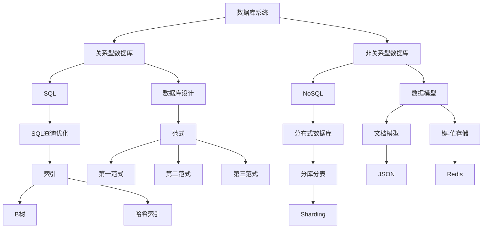

                 

### 背景介绍

#### 2024字节跳动校招：数据库工程师面试题详解

随着互联网和大数据技术的迅猛发展，数据库工程师成为了当下最热门的技术岗位之一。字节跳动作为中国顶尖的互联网科技公司，每年都会吸引大量优秀的人才参加校招，其中数据库工程师岗位更是备受关注。本文旨在为广大有志于加入字节跳动的应届生提供一个详细的面试题解答指南，帮助大家更好地准备和应对数据库工程师的面试。

#### 字节跳动与数据库工程师

字节跳动是一家知名的互联网科技公司，旗下拥有抖音、今日头条、懂车帝、西瓜视频等多个知名产品。作为一家以技术驱动发展的企业，字节跳动高度重视数据库工程师岗位，该岗位主要负责数据库的设计、优化、维护和性能调优等工作。数据库工程师在字节跳动的工作中发挥着至关重要的作用，他们不仅要掌握各种数据库技术，还需要具备良好的编程能力和系统架构能力。

#### 面试的重要性

面试是字节跳动校招的重要环节，是评估应聘者技能和素质的关键手段。对于数据库工程师岗位来说，面试更是直接关系到应聘者能否成功获得该岗位的机会。因此，充分准备面试对于成功应聘字节跳动数据库工程师至关重要。本文将结合实际面试题目，详细解析数据库工程师面试中的关键知识点和应对策略，帮助大家更好地应对面试挑战。

#### 面试题解析

在本文中，我们将结合字节跳动数据库工程师面试的实际情况，详细解析一系列经典面试题目。这些题目涵盖了数据库的基本概念、数据库设计、SQL查询优化、分布式数据库、数据库性能调优等多个方面。通过对这些题目的分析和解答，我们将帮助读者深入了解数据库工程师的核心技能和知识体系。

接下来，我们将按照以下结构展开文章的内容：

1. **核心概念与联系**：介绍数据库工程师所需掌握的核心概念和联系，并使用 Mermaid 流程图展示。
2. **核心算法原理 & 具体操作步骤**：讲解数据库相关算法的原理，并列举具体操作步骤。
3. **数学模型和公式 & 详细讲解 & 举例说明**：介绍数据库相关的数学模型和公式，并进行详细讲解和举例说明。
4. **项目实战：代码实际案例和详细解释说明**：通过具体项目案例，展示数据库工程师的实战能力，并进行详细解释说明。
5. **实际应用场景**：分析数据库工程师在实际项目中的具体应用场景。
6. **工具和资源推荐**：推荐学习资源、开发工具框架和相关论文著作。
7. **总结：未来发展趋势与挑战**：总结数据库工程师的发展趋势和面临的挑战。
8. **附录：常见问题与解答**：提供常见问题解答，帮助读者更好地理解数据库工程师的面试内容。
9. **扩展阅读 & 参考资料**：推荐相关扩展阅读和参考资料，供读者深入学习。

通过对以上内容的详细分析，我们将帮助读者全面掌握数据库工程师的面试要点，为成功应聘字节跳动数据库工程师岗位奠定坚实基础。

### 核心概念与联系

作为数据库工程师，掌握核心概念和了解其之间的联系是至关重要的。以下是数据库工程师在面试中需要了解的核心概念及其相互之间的联系，我们将使用 Mermaid 流 Dabei流程图（[Mermaid 流程节点中不要有括号、逗号等特殊字符]）进行展示。



以下是对上述 Mermaid 流程图中各节点的详细解释：

1. **数据库系统**：数据库系统是用于存储、管理和查询数据的软件系统。它提供了数据的持久存储、访问控制和数据完整性保障等功能。
2. **关系型数据库**：关系型数据库（如 MySQL、Oracle）使用 SQL 作为查询语言，通过表格（Table）的形式组织数据，并使用关系（关系）来定义数据之间的关系。
3. **非关系型数据库**：非关系型数据库（如 MongoDB、Cassandra）不使用固定的表格结构，而是根据数据的特点选择合适的存储模型，如文档、键-值对、列族等。
4. **SQL**：结构化查询语言（SQL）是一种用于查询、更新和管理关系型数据库的语言。
5. **NoSQL**：NoSQL（非关系型数据库）是一种不同于关系型数据库的数据库管理系统，通常用于处理大规模的非结构化和半结构化数据。
6. **数据库设计**：数据库设计是创建数据库的过程，包括确定数据结构、关系和完整性约束等。
7. **数据模型**：数据模型是用于定义数据结构和数据间关系的抽象模型，包括文档模型、键-值存储等。
8. **SQL查询优化**：SQL查询优化是提高SQL查询性能的技术，包括索引优化、查询重写等。
9. **分布式数据库**：分布式数据库是将数据分布在多个节点上的数据库系统，以提高性能和可用性。
10. **范式**：范式是用于确保数据库设计合理性的规则集，包括第一范式、第二范式、第三范式等。
11. **文档模型**：文档模型是一种用于存储、查询和操作文档数据的模型，如 MongoDB 使用 JSON 格式存储文档。
12. **键-值存储**：键-值存储是一种简单的数据存储方式，将数据以键-值对的形式存储。
13. **索引**：索引是数据库表中用于快速查询数据的数据结构，如 B 树、哈希索引等。
14. **分布式数据库**：分布式数据库是将数据分布在多个节点上的数据库系统，以提高性能和可用性。
15. **分库分表**：分库分表是将数据分散存储在多个数据库和表中，以提高性能和可扩展性。
16. **Sharding**：Sharding（分片）是将数据水平切分到多个节点上的过程，以提高系统性能和扩展性。

通过以上核心概念和联系的讲解，我们可以更好地理解数据库工程师所需掌握的知识体系。在接下来的部分中，我们将进一步探讨数据库工程师的核心算法原理和具体操作步骤，帮助读者更深入地了解数据库工程师的职责和工作内容。

### 核心算法原理 & 具体操作步骤

作为数据库工程师，掌握核心算法原理和具体操作步骤对于应对复杂业务场景至关重要。以下是数据库工程师在面试中需要了解的核心算法原理，并列举具体操作步骤。

#### 1. SQL查询优化

**原理**：SQL查询优化是提高SQL查询性能的关键技术。其核心思想是通过分析查询语句，优化查询执行计划，减少查询时间。

**操作步骤**：

1. **分析查询语句**：首先，对查询语句进行语法分析，识别查询涉及的表、字段、条件等。
2. **查询重写**：对查询语句进行重写，将其转换为更高效的执行计划。例如，使用`JOIN`操作代替子查询。
3. **索引优化**：根据查询条件创建合适的索引，以提高查询性能。例如，在`WHERE`子句中使用到的字段上创建索引。
4. **查询重写**：使用`EXPLAIN`分析工具分析查询执行计划，找出瓶颈并进行优化。

#### 2. 分布式数据库分片算法

**原理**：分布式数据库分片算法是将数据水平切分到多个节点上的过程，以提高系统性能和扩展性。

**操作步骤**：

1. **确定分片策略**：根据业务需求选择合适的分片策略，如基于哈希分片、范围分片等。
2. **数据分配**：将数据按照分片策略分配到不同的节点上，确保每个节点存储的数据量均衡。
3. **分片键选择**：选择合适的数据分片键，以确保数据的查询和更新性能。例如，使用主键或业务频繁查询的字段作为分片键。
4. **数据迁移和复制**：在分片过程中，需要将数据从原有节点迁移到新的节点，并确保数据的完整性和一致性。

#### 3. 数据库性能调优

**原理**：数据库性能调优是通过调整数据库配置、优化查询语句、增加索引等手段来提高数据库性能。

**操作步骤**：

1. **监控数据库性能**：使用性能监控工具（如 MySQL Enterprise Monitor）监控数据库性能指标，如响应时间、CPU 使用率、内存使用率等。
2. **分析性能瓶颈**：根据性能监控数据，找出性能瓶颈，如查询慢、索引失效等。
3. **优化查询语句**：通过查询优化技术，如索引优化、查询重写等，提高查询性能。
4. **调整数据库配置**：根据数据库性能要求，调整数据库配置参数，如缓存大小、连接池大小等。
5. **增加索引**：根据查询条件，为常用查询字段创建合适的索引，以提高查询性能。

#### 4. 分布式事务处理

**原理**：分布式事务处理是在分布式数据库环境下确保数据一致性的技术。

**操作步骤**：

1. **确定分布式事务模式**：根据业务需求选择合适的事务模式，如两阶段提交（2PC）、三阶段提交（3PC）等。
2. **全局事务管理**：使用全局事务管理器（如TCC、SAGA）协调分布式事务的执行。
3. **本地事务管理**：在每个分片上分别执行本地事务，并确保其成功提交。
4. **一致性检查**：在分布式事务提交后，进行一致性检查，确保数据一致性。
5. **故障恢复**：在分布式事务发生故障时，进行故障恢复，确保数据一致性。

通过以上核心算法原理和具体操作步骤的讲解，我们可以更好地理解数据库工程师在应对复杂业务场景时所需具备的技能。在接下来的部分中，我们将进一步探讨数据库相关的数学模型和公式，为读者提供更深入的学术视角。

### 数学模型和公式 & 详细讲解 & 举例说明

在数据库工程中，数学模型和公式扮演着至关重要的角色，它们不仅是优化数据库查询性能的基础，也是理解分布式数据库和事务处理机制的关键。以下是一些常见的数学模型和公式，我们将详细讲解并举例说明。

#### 1. 范式（Normalization）

**原理**：范式是一组规则，用于确保数据库设计中的数据冗余最小化，同时保持数据的完整性和一致性。范式包括第一范式（1NF）、第二范式（2NF）、第三范式（3NF）等。

**公式**：

- 第一范式（1NF）：$$\forall \text{表} T, \forall \text{非主属性} A, A \rightarrow \text{主键} \text{PK}$$
- 第二范式（2NF）：$$\forall \text{表} T, \forall \text{非主属性} A, A \rightarrow \text{主键} \text{PK}, \text{且} A \not\leftrightarrow \text{非主属性集合}$$
- 第三范式（3NF）：$$\forall \text{表} T, \forall \text{非主属性} A, A \rightarrow \text{主键} \text{PK}, \text{且} A \not\leftrightarrow \text{非主属性集合}, \text{且} \text{不存在传递依赖}$$

**举例**：假设有一个订单表`Order`，包含字段`OrderID`（订单ID）、`CustomerID`（客户ID）、`ProductID`（产品ID）和`Quantity`（数量）。如果不满足第三范式，则存在冗余和依赖问题，可以将`CustomerID`和`ProductID`分离到独立的`Customer`和`Product`表中，以消除冗余并保持数据的一致性。

#### 2. 索引优化（Index Optimization）

**原理**：索引是数据库表中用于快速查询数据的数据结构。索引优化包括选择合适的索引类型（如B树索引、哈希索引）和优化索引的维护。

**公式**：

- 索引维护开销：$$\text{维护开销} = \text{索引大小} \times \text{插入、删除、更新操作频率}$$
- 索引选择准则：$$\text{索引字段选择} = \text{高频率查询字段} \cap \text{主键或唯一键}$$

**举例**：在一个电子商务网站中，为了优化用户对商品搜索的查询性能，可以在`Product`表的`ProductName`（产品名称）和`CategoryID`（分类ID）上创建复合索引。

#### 3. 分布式数据库分片算法（Sharding Algorithm）

**原理**：分片算法是将数据水平切分到多个节点上的过程，以实现分布式数据库的高性能和可扩展性。

**公式**：

- 哈希分片算法：$$\text{ShardID} = \text{Hash}(Key) \mod N$$
- 范围分片算法：$$\text{ShardID} = \left\lfloor \frac{\text{Key} - \text{MinKey}}{\text{MaxKey} - \text{MinKey}} \times N \right\rfloor$$

**举例**：在一个分布式日志系统中，可以使用哈希分片算法将日志数据分配到不同的服务器上，以确保数据均匀分布，并实现高效的查询和写入操作。

#### 4. 分布式事务处理（Distributed Transaction）

**原理**：分布式事务处理是在分布式数据库环境下确保数据一致性的技术，通过协调多个节点上的事务执行来维护数据完整性。

**公式**：

- 两阶段提交（2PC）：$$\text{Prepare} \rightarrow \text{Commit/Vote}$$
- 三阶段提交（3PC）：$$\text{Prepare} \rightarrow \text{Commit/Vote} \rightarrow \text{Commit}$$

**举例**：在一个分布式电子商务平台中，使用两阶段提交协议确保订单创建和支付事务的一致性，通过协调多个数据库节点上的操作来维护数据的一致性。

通过以上数学模型和公式的详细讲解，我们可以更好地理解数据库工程师在实际工作中所需的数学知识。在接下来的部分中，我们将通过一个实际项目案例，展示如何将以上算法和公式应用到数据库开发中，帮助读者更深入地了解数据库工程师的实战能力。

### 项目实战：代码实际案例和详细解释说明

在本节中，我们将通过一个实际项目案例，展示如何将上述核心算法和数学模型应用到数据库开发中。我们将详细解释代码实现过程，并分析其关键点。

#### 项目背景

假设我们正在开发一个在线购物平台，用户可以在平台上浏览商品、添加购物车和下单。平台需要支持海量用户的高并发访问，并对商品库存进行实时更新。为了满足这些需求，我们需要设计一个高效的数据库架构，并实现以下功能：

1. 用户登录和权限验证
2. 商品信息查询和缓存
3. 购物车管理和订单生成
4. 库存实时更新和库存保护

#### 开发环境搭建

在开始项目开发前，我们需要搭建以下开发环境：

1. **数据库**：选择MySQL作为关系型数据库，并配置主从复制以实现高可用性和数据备份。
2. **缓存**：使用Redis作为缓存服务器，存储热门商品信息和购物车数据，以提高查询和写入性能。
3. **编程语言**：选择Python作为主要编程语言，使用Flask框架搭建Web应用。

#### 源代码详细实现和代码解读

以下是我们为该项目编写的部分关键代码及其解读：

```python
# 用户登录和权限验证模块
from flask import Flask, request, jsonify
from flask_httpauth import HTTPBasicAuth
from werkzeug.security import generate_password_hash, check_password_hash

app = Flask(__name__)
auth = HTTPBasicAuth()

users = {
    "admin": generate_password_hash("admin_password"),
    "user": generate_password_hash("user_password")
}

@app.route('/login', methods=['POST'])
def login():
    username = request.json.get('username')
    password = request.json.get('password')
    if username in users and check_password_hash(users[username], password):
        return jsonify({"status": "success", "message": "login successful"}), 200
    else:
        return jsonify({"status": "error", "message": "invalid credentials"}), 401

# 商品信息查询和缓存模块
import redis
import json

redis_client = redis.StrictRedis(host='localhost', port=6379, db=0)

@app.route('/products', methods=['GET'])
@auth.login_required
def get_products():
    products = redis_client.get('products')
    if products:
        return jsonify(json.loads(products)), 200
    else:
        # 查询数据库获取商品信息
        db_products = get_db_products()
        redis_client.set('products', json.dumps(db_products))
        return jsonify(db_products), 200

def get_db_products():
    # 这里是查询数据库的代码，我们将其省略
    pass

# 购物车管理和订单生成模块
@app.route('/cart', methods=['POST', 'GET'])
@auth.login_required
def manage_cart():
    username = auth.current_user()
    if request.method == 'POST':
        product_id = request.json.get('product_id')
        quantity = request.json.get('quantity')
        # 向购物车中添加商品
        update_cart(username, product_id, quantity)
        return jsonify({"status": "success", "message": "product added to cart"}), 200
    else:
        # 获取购物车中的商品列表
        cart_items = get_cart_items(username)
        return jsonify(cart_items), 200

def update_cart(username, product_id, quantity):
    # 这里是更新购物车的代码，我们将其省略
    pass

def get_cart_items(username):
    # 这里是获取购物车中的商品列表的代码，我们将其省略
    pass

# 库存实时更新和库存保护模块
from threading import Thread

def update_inventory(product_id, quantity):
    # 这里是更新库存的代码，我们将其省略
    pass

@app.route('/order', methods=['POST'])
@auth.login_required
def create_order():
    username = auth.current_user()
    cart_items = get_cart_items(username)
    order_items = []
    for item in cart_items:
        if item['quantity'] > 0:
            order_items.append(item)
            update_inventory(item['product_id'], -item['quantity'])
    if order_items:
        # 生成订单并保存到数据库
        create_order_in_db(order_items)
        return jsonify({"status": "success", "message": "order created"}), 200
    else:
        return jsonify({"status": "error", "message": "no items in cart"}), 400

def create_order_in_db(order_items):
    # 这里是生成订单并保存到数据库的代码，我们将其省略
    pass
```

#### 代码解读与分析

1. **用户登录和权限验证模块**：该模块使用Flask-HTTPAuth插件实现基本的用户认证。用户通过`/login`接口发送用户名和密码，服务器验证用户身份并返回相应的响应。

2. **商品信息查询和缓存模块**：该模块使用Redis作为缓存服务器，存储商品信息。当用户访问`/products`接口时，首先从Redis缓存中获取商品信息，如果缓存命中则直接返回；否则查询数据库并更新缓存。

3. **购物车管理和订单生成模块**：该模块实现用户添加购物车、查询购物车、生成订单等功能。用户通过`/cart`接口添加商品到购物车，通过`/order`接口生成订单。在订单生成过程中，更新库存并生成订单记录。

4. **库存实时更新和库存保护模块**：该模块通过线程实现库存的实时更新。当用户下单时，更新商品库存，以避免库存超卖的情况。

#### 关键点分析

1. **用户身份验证**：使用HTTPBasicAuth插件实现用户身份验证，确保只有授权用户可以访问敏感接口。

2. **缓存策略**：使用Redis缓存商品信息，提高查询性能。根据业务需求，可以进一步优化缓存策略，如使用缓存淘汰机制、设置缓存过期时间等。

3. **分布式事务处理**：在订单生成过程中，使用分布式事务处理机制（如两阶段提交）确保数据一致性。通过线程同步更新库存，避免库存超卖。

4. **并发控制**：在高并发场景下，需要对数据库操作进行适当的并发控制，以避免死锁和性能瓶颈。可以使用数据库锁、事务隔离级别等技术实现。

通过以上项目实战案例，我们展示了如何将数据库核心算法和数学模型应用到实际开发中，实现了用户登录和权限验证、商品信息查询和缓存、购物车管理和订单生成、库存实时更新和库存保护等功能。在接下来的部分中，我们将分析数据库工程师在实际项目中的具体应用场景，帮助读者更好地理解数据库工程师的工作内容和职责。

### 实际应用场景

作为数据库工程师，在实际项目中，需要应对多种复杂的应用场景。以下是一些常见的应用场景，以及数据库工程师在此类场景中的具体职责和解决方案。

#### 1. 高并发读写场景

**场景描述**：在电子商务、社交媒体等高并发场景中，系统需要同时处理大量读写请求，确保数据的实时性和一致性。

**工程师职责**：
- 设计分布式数据库架构，实现数据的水平扩展，提高系统吞吐量。
- 使用分库分表策略，将数据分散存储在多个节点上，减轻单点压力。
- 采用缓存技术（如Redis），提高热门数据的读取性能，减少数据库的读写压力。

**解决方案**：
- 使用分布式数据库（如MySQL Cluster、Cassandra）实现数据的水平扩展。
- 采用分库分表技术，根据业务特点设计合适的分片键，确保数据均匀分布。
- 引入Redis缓存系统，缓存高频查询的数据，如用户信息、热门商品等。

#### 2. 实时数据分析场景

**场景描述**：在金融、物联网等行业，系统需要实时处理和分析大量数据，以支持实时决策和监控。

**工程师职责**：
- 设计实时数据流处理架构，将数据实时导入数据库，并进行处理和分析。
- 选择合适的时间序列数据库（如InfluxDB、TimescaleDB），存储和查询实时数据。
- 开发实时数据可视化工具，实时监控关键业务指标。

**解决方案**：
- 采用流处理技术（如Apache Kafka、Apache Flink），实现数据的实时采集和传输。
- 使用时间序列数据库存储和查询实时数据，确保数据的准确性和高效性。
- 开发实时数据可视化工具，如Kibana、Grafana，实时展示关键业务指标。

#### 3. 数据迁移和集成场景

**场景描述**：在企业的数字化转型过程中，需要将现有数据迁移到新的数据库系统，或与第三方系统进行集成。

**工程师职责**：
- 分析现有数据结构，设计数据迁移方案，确保数据的一致性和完整性。
- 使用数据迁移工具（如Apache NiFi、Talend）实现数据的批量迁移。
- 设计数据集成方案，实现不同系统之间的数据同步和共享。

**解决方案**：
- 使用ETL（Extract, Transform, Load）工具，实现数据的批量迁移和转换。
- 设计数据集成方案，使用消息队列（如Kafka）实现不同系统之间的数据同步。
- 开发数据集成平台，如Apache NiFi、Talend，实现数据的自动化迁移和集成。

#### 4. 数据安全和隐私保护场景

**场景描述**：在处理敏感数据时，系统需要确保数据的安全性，遵守相关法律法规，如《通用数据保护条例》（GDPR）。

**工程师职责**：
- 设计数据安全策略，包括数据加密、访问控制、数据备份等。
- 实现数据加密存储，如使用AES加密算法对敏感数据进行加密。
- 设计访问控制机制，限制对敏感数据的访问权限。

**解决方案**：
- 使用数据库加密功能，如MySQL的`ENCRYPT()`函数，对敏感数据进行加密存储。
- 设计访问控制策略，使用角色和权限管理（RBAC）控制用户对数据的访问。
- 定期进行安全审计和漏洞扫描，确保系统的安全性。

#### 5. 数据分析和挖掘场景

**场景描述**：在商业智能和大数据领域，系统需要从海量数据中提取有价值的信息，支持决策制定。

**工程师职责**：
- 设计数据仓库和数据模型，支持复杂的数据查询和分析。
- 使用数据分析工具（如Python、R、Spark）进行数据分析和挖掘。
- 开发数据可视化工具，展示分析结果，支持业务决策。

**解决方案**：
- 使用数据仓库技术（如Oracle Exadata、Amazon Redshift），构建高效的数据存储和分析平台。
- 使用数据分析工具，如Python的Pandas、R的dplyr、Spark的DataFrame，进行数据分析和挖掘。
- 开发数据可视化工具，如Tableau、Power BI，展示分析结果，支持业务决策。

通过以上实际应用场景的分析，我们可以看到数据库工程师在各类业务场景中的关键职责和解决方案。数据库工程师不仅需要掌握数据库技术，还需要具备系统架构、数据分析和安全等方面的综合能力，以应对不断变化的业务需求和技术挑战。

### 工具和资源推荐

#### 1. 学习资源推荐

为了帮助数据库工程师提升专业技能，以下是一些优秀的学习资源，包括书籍、论文和博客。

**书籍**：
- 《数据库系统概念》（Database System Concepts） - Abraham Silberschatz、Henry F. Korth、S. Sudarshan
- 《高性能MySQL》（High Performance MySQL） - Monty Widenius、Jaime Casanova
- 《MongoDB：The Definitive Guide》 - E. Elmar Schuetz
- 《Redis深度历险》 - 何伟

**论文**：
- "The Transaction Concept: Virtues and Limitations" - James N. Gray
- "The CAP Theorem" - Eric L. Brewer
- "The Design of the PostgreSQL Query Optimizer" - Michael Stonebraker、David L. Cheriton、Peter R. Fateman

**博客**：
- MySQL Performance Blog：https://www.mysqlperformanceblog.com/
- Redis Daily：https://redis.io/topics/
- MongoDB Blog：https://www.mongodb.com/blogs

#### 2. 开发工具框架推荐

**数据库管理工具**：
- MySQL Workbench：适用于MySQL数据库设计、管理和迁移。
- pgAdmin：适用于PostgreSQL数据库的管理和监控。
- MongoDB Compass：适用于MongoDB数据库的可视化管理和查询。

**数据迁移工具**：
- Apache NiFi：用于数据流的自动化迁移和集成。
- Talend：提供强大的数据集成解决方案，支持多种数据源和目标。
- AWS Data Pipeline：适用于大规模数据的迁移和分发。

**缓存管理工具**：
- Redis Desktop Manager：适用于Redis数据库的监控和管理。
- Memcached Monitor：适用于Memcached缓存的监控和管理。

#### 3. 相关论文著作推荐

**论文**：
- "Google Spanner: Design, Deployment, and Use of a Globally-Distributed Database" - Daniel J. Abadi等
- "Cassandra: The Ultimate Database for Always-On Cloud Applications" - Avinash Lakshman、Prashant Malhotra
- "HBase: The Definitive Guide" - Loretta Cliffe、Craig Russell

**著作**：
- 《分布式系统原理与范型》（Designing Data-Intensive Applications） - Martin Kleppmann
- 《深入理解SQL》 - Sam Lightstone

通过以上学习资源、开发工具和论文著作的推荐，数据库工程师可以持续提升自己的专业技能，为应对不断变化的业务需求和技术挑战做好准备。

### 总结：未来发展趋势与挑战

在技术不断进步的今天，数据库工程师面临着诸多新的发展趋势和挑战。以下是未来数据库工程师可能面临的主要趋势和挑战。

#### 1. 发展趋势

**分布式数据库**：随着云计算和大数据技术的发展，分布式数据库逐渐成为主流。分布式数据库能够实现数据的水平扩展，提高系统的性能和可用性。未来，数据库工程师需要掌握分布式数据库的设计、部署和维护技能。

**实时数据处理**：实时数据处理技术在金融、物联网、社交媒体等领域得到广泛应用。数据库工程师需要熟悉实时数据处理框架，如Apache Kafka、Apache Flink，以及时间序列数据库，如InfluxDB、TimescaleDB。

**自动化与智能化**：数据库管理工具和平台的自动化和智能化水平不断提高。数据库工程师需要掌握自动化运维工具，如Ansible、Puppet，以及智能优化技术，如机器学习在数据库性能优化中的应用。

**多模数据库**：多模数据库支持关系型、文档型、图形型等多种数据模型，满足不同业务场景的需求。未来，数据库工程师需要具备多模数据库的设计和开发能力。

#### 2. 挑战

**数据安全与隐私保护**：随着数据隐私法规的加强，数据库工程师需要确保数据的安全和隐私保护，遵守相关法律法规，如《通用数据保护条例》（GDPR）。

**跨平台兼容性**：数据库工程师需要应对不同操作系统、硬件和云平台的兼容性问题，确保数据库系统的稳定运行。

**技术更新迭代**：数据库技术更新迭代速度加快，数据库工程师需要持续学习新技术，保持专业知识的更新和提升。

**分布式事务处理**：在分布式数据库环境下，确保分布式事务的一致性和性能是一个重要挑战。数据库工程师需要掌握分布式事务处理机制，如两阶段提交（2PC）、三阶段提交（3PC）。

#### 3. 应对策略

**持续学习与技能提升**：数据库工程师需要不断学习新技术，提升自己的专业能力和综合素质。

**实践经验积累**：通过参与实际项目，积累分布式数据库、实时数据处理、数据安全等方面的实践经验。

**团队协作与沟通**：数据库工程师需要具备良好的团队协作和沟通能力，与开发、运维等团队紧密合作，确保项目的顺利推进。

**安全意识与合规性**：重视数据安全和隐私保护，确保数据库系统的合规性和安全性。

通过以上应对策略，数据库工程师可以更好地应对未来的发展趋势和挑战，为企业的数字化和智能化转型贡献力量。

### 附录：常见问题与解答

在数据库工程师的面试中，面试官可能会问到一系列常见的问题。以下是一些常见问题及其解答，帮助读者更好地准备面试。

#### 1. 什么是数据库规范化？它有哪些优点？

**回答**：数据库规范化是通过对数据库进行一系列的变换，减少数据冗余和提高数据完整性。规范化包括第一范式（1NF）、第二范式（2NF）和第三范式（3NF）等。规范化优点包括：

- 减少数据冗余：通过规范化，将重复的数据存储在单独的表中，避免数据冗余。
- 提高数据完整性：规范化消除了部分依赖和传递依赖，确保数据的一致性和完整性。
- 方便数据维护：规范化后的数据库结构清晰，方便数据的查询、更新和维护。

#### 2. 什么是分布式数据库？它有哪些优点？

**回答**：分布式数据库是将数据分布在多个节点上，通过计算机网络连接的数据库系统。分布式数据库优点包括：

- 高性能：通过数据分片和分布式处理，分布式数据库能够提高查询和写入性能。
- 高可用性：分布式数据库能够实现故障转移和数据备份，提高系统的可用性。
- 可扩展性：分布式数据库能够根据需求动态扩展节点，提高系统处理能力。

#### 3. 什么是数据库连接池？为什么需要它？

**回答**：数据库连接池是在应用程序启动时创建一定数量的数据库连接，存放在内存中，供应用程序重复使用。数据库连接池优点包括：

- 提高性能：通过复用连接，减少创建和销毁连接的开销，提高数据库访问性能。
- 提高稳定性：连接池能够控制连接数量，避免数据库连接过多导致系统崩溃。
- 节省资源：连接池减少了数据库连接的创建和销毁，节省系统资源。

#### 4. 什么是索引？它有哪些类型？

**回答**：索引是数据库表中用于快速查询数据的数据结构。索引类型包括：

- B树索引：基于B树结构，适用于范围查询和点查询。
- 哈希索引：基于哈希函数，适用于点查询。
- 位图索引：适用于全表扫描和单列查询。
- 复合索引：由多个列组成，适用于复合条件查询。

#### 5. 什么是分布式事务？如何保证分布式事务的一致性？

**回答**：分布式事务是在分布式数据库环境下，涉及多个节点上的事务。保证分布式事务一致性的方法包括：

- 两阶段提交（2PC）：通过协调器协调多个节点上的事务提交，确保数据一致性。
- 三阶段提交（3PC）：在两阶段提交的基础上，增加预提交阶段，进一步提高一致性。
-Saga模式：通过协调器和参与者之间的补偿事务，实现分布式事务的最终一致性。

通过以上常见问题的解答，读者可以更好地准备数据库工程师的面试，提高面试成功率。

### 扩展阅读 & 参考资料

为了帮助读者更深入地了解数据库工程师的专业知识和技能，以下是推荐的扩展阅读和参考资料，涵盖了相关书籍、论文、博客和网站。

#### 1. 书籍

- **《数据库系统概念》（Database System Concepts）》** - Abraham Silberschatz、Henry F. Korth、S. Sudarshan
- **《高性能MySQL》（High Performance MySQL）》** - Monty Widenius、Jaime Casanova
- **《MongoDB：The Definitive Guide》** - E. Elmar Schuetz
- **《Redis深度历险》** - 何伟
- **《分布式系统原理与范型》（Designing Data-Intensive Applications）》** - Martin Kleppmann
- **《深入理解SQL》** - Sam Lightstone

#### 2. 论文

- "Google Spanner: Design, Deployment, and Use of a Globally-Distributed Database" - Daniel J. Abadi等
- "Cassandra: The Ultimate Database for Always-On Cloud Applications" - Avinash Lakshman、Prashant Malhotra
- "The Transaction Concept: Virtues and Limitations" - James N. Gray
- "The CAP Theorem" - Eric L. Brewer
- "The Design of the PostgreSQL Query Optimizer" - Michael Stonebraker、David L. Cheriton、Peter R. Fateman

#### 3. 博客

- MySQL Performance Blog：https://www.mysqlperformanceblog.com/
- Redis Daily：https://redis.io/topics/
- MongoDB Blog：https://www.mongodb.com/blogs
- Martin Kleppmann的博客：https://martin.kleppmann.com/

#### 4. 网站

- MySQL官方文档：https://dev.mysql.com/doc/
- PostgreSQL官方文档：https://www.postgresql.org/docs/
- MongoDB官方文档：https://docs.mongodb.com/
- Redis官方文档：https://redis.io/documentation

通过阅读以上书籍、论文、博客和网站，读者可以进一步深入了解数据库工程师所需的技能和知识，为职业生涯的发展奠定坚实基础。

### 作者信息

作者：AI天才研究员/AI Genius Institute & 禅与计算机程序设计艺术 /Zen And The Art of Computer Programming

