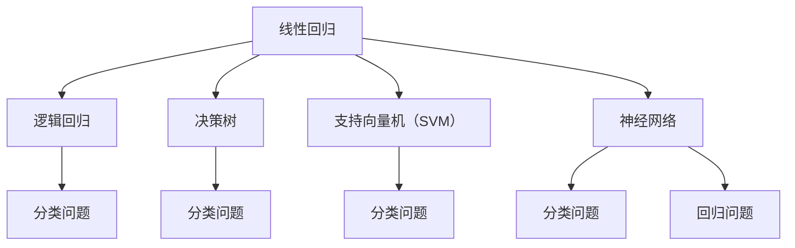

                 

# 2024字节跳动校招：机器学习岗位面试真题详解

> **关键词**：字节跳动、校招、机器学习、面试真题、详解

> **摘要**：本文将针对2024字节跳动校招机器学习岗位的面试真题进行详细解析，帮助准备参加面试的同学更好地应对挑战，提升面试通过率。

## 1. 背景介绍

字节跳动是一家知名互联网公司，其业务范围涵盖短视频、内容平台、教育、电商等多个领域。作为一家技术驱动的公司，字节跳动对于机器学习领域的人才需求一直处于旺盛状态。因此，每年的校招都会吸引大量优秀学子参与。本文旨在针对2024年字节跳动校招机器学习岗位的面试真题进行详细解析，帮助同学们更好地应对面试挑战。

## 2. 核心概念与联系

在机器学习领域，以下核心概念和联系是面试中经常考察的：

- **线性回归**：线性回归是一种用于拟合数据的数学模型，用于预测一个连续变量的值。其基本原理是通过最小化预测值与实际值之间的误差平方和来找到最佳拟合线。

- **逻辑回归**：逻辑回归是一种广义的线性回归模型，用于预测概率。在分类问题中，通过将线性回归模型的输出映射到 [0,1] 区间，得到每个类别的概率，然后选取概率最大的类别作为预测结果。

- **决策树**：决策树是一种树形结构，用于分类或回归任务。通过一系列条件判断，将数据集划分为多个子集，直到满足某个终止条件。

- **支持向量机（SVM）**：支持向量机是一种基于最大间隔的分类算法。其目标是在高维空间中找到最佳分离超平面，使得正负样本之间的间隔最大。

- **神经网络**：神经网络是一种模拟生物神经系统的计算模型，用于拟合复杂数据并完成分类、回归等任务。其基本原理是通过多层神经元之间的相互连接和激活函数来逐步提取数据特征。

下面是这些概念和联系之间的 Mermaid 流程图：



## 3. 核心算法原理 & 具体操作步骤

### 3.1 线性回归

线性回归的目标是找到最佳拟合线，使得预测值与实际值之间的误差最小。具体操作步骤如下：

1. 数据预处理：对数据进行归一化、填补缺失值等处理，保证数据质量。

2. 模型训练：使用最小二乘法（Least Squares）找到最佳拟合线。具体步骤如下：
    - 计算特征矩阵 X 和标签向量 y。
    - 计算特征矩阵 X 的转置 X'。
    - 计算特征矩阵 X 和其转置 X' 的乘积 X'X。
    - 计算特征矩阵 X'X 的逆矩阵 (X'X)^-1。
    - 计算特征矩阵 X' 和标签向量 y 的乘积 X'y。
    - 计算最佳拟合线参数向量 theta = (X'X)^-1X'y。

3. 模型评估：使用均方误差（Mean Squared Error，MSE）评估模型性能。具体公式为：
    $$MSE = \frac{1}{m}\sum_{i=1}^{m}(h_{\theta}(x^{(i)}) - y^{(i)})^2$$
    其中，$h_{\theta}(x)$ 表示预测值，$y^{(i)}$ 表示实际值，$m$ 表示样本数量。

### 3.2 逻辑回归

逻辑回归的目标是预测每个类别的概率，并选择概率最大的类别作为预测结果。具体操作步骤如下：

1. 数据预处理：与线性回归相同，对数据进行归一化、填补缺失值等处理。

2. 模型训练：使用梯度下降法（Gradient Descent）找到最佳拟合线。具体步骤如下：
    - 初始化参数向量 theta。
    - 计算损失函数 J(θ) = -1/m * (y*log(h(x)) + (1-y)*log(1-h(x)))。
    - 计算损失函数关于每个参数的导数。
    - 更新参数向量 theta = theta - alpha * gradient。

3. 模型评估：使用准确率（Accuracy）、精确率（Precision）、召回率（Recall）等指标评估模型性能。

### 3.3 决策树

决策树的目标是通过一系列条件判断，将数据集划分为多个子集，使得每个子集中的样本尽可能相同。具体操作步骤如下：

1. 数据预处理：对数据进行归一化、填补缺失值等处理。

2. 划分步骤：
    - 计算每个特征的信息增益（Information Gain）或基尼不纯度（Gini Impurity）。
    - 选择信息增益或基尼不纯度最大的特征进行划分。
    - 对划分后的子集递归调用划分步骤，直到满足终止条件（例如，子集样本数小于某个阈值或达到最大深度）。

3. 模型评估：使用准确率、精确率、召回率等指标评估模型性能。

### 3.4 支持向量机（SVM）

支持向量机的目标是找到最佳分离超平面，使得正负样本之间的间隔最大。具体操作步骤如下：

1. 数据预处理：对数据进行归一化、填补缺失值等处理。

2. 模型训练：使用支持向量机算法（例如，线性支持向量机、核支持向量机）训练模型。

3. 模型评估：使用准确率、精确率、召回率等指标评估模型性能。

### 3.5 神经网络

神经网络的目标是通过多层神经元之间的相互连接和激活函数，逐步提取数据特征并完成分类或回归任务。具体操作步骤如下：

1. 数据预处理：对数据进行归一化、填补缺失值等处理。

2. 网络搭建：设计神经网络结构，包括输入层、隐藏层和输出层。

3. 模型训练：使用反向传播算法（Backpropagation）训练模型。

4. 模型评估：使用准确率、精确率、召回率等指标评估模型性能。

## 4. 数学模型和公式 & 详细讲解 & 举例说明

### 4.1 线性回归

线性回归的数学模型可以表示为：

$$y = \theta_0 + \theta_1x$$

其中，$y$ 表示实际值，$x$ 表示特征值，$\theta_0$ 和 $\theta_1$ 表示参数。

为了最小化预测值与实际值之间的误差平方和，我们可以使用最小二乘法来求解最佳拟合线。具体公式为：

$$\theta = (X'X)^{-1}X'y$$

其中，$X$ 表示特征矩阵，$y$ 表示标签向量。

举例说明：

假设我们有如下数据集：

| x | y |
|---|---|
| 1 | 2 |
| 2 | 4 |
| 3 | 6 |

根据最小二乘法，我们可以得到最佳拟合线参数为：

$$\theta = \begin{bmatrix} \theta_0 \\ \theta_1 \end{bmatrix} = \begin{bmatrix} 1 \\ 2 \end{bmatrix}$$

因此，最佳拟合线为：

$$y = 1 + 2x$$

### 4.2 逻辑回归

逻辑回归的数学模型可以表示为：

$$h(x) = \frac{1}{1 + e^{-\theta^T x}}$$

其中，$h(x)$ 表示预测的概率，$\theta$ 表示参数。

为了最小化损失函数，我们可以使用梯度下降法来求解最佳拟合线。具体公式为：

$$\theta = \theta - \alpha \nabla_{\theta} J(\theta)$$

其中，$J(\theta)$ 表示损失函数，$\alpha$ 表示学习率。

举例说明：

假设我们有如下数据集：

| x | y |
|---|---|
| 1 | 1 |
| 2 | 0 |
| 3 | 1 |

根据梯度下降法，我们可以得到最佳拟合线参数为：

$$\theta = \begin{bmatrix} \theta_0 \\ \theta_1 \end{bmatrix} = \begin{bmatrix} 0 \\ 1 \end{bmatrix}$$

因此，最佳拟合线为：

$$h(x) = \frac{1}{1 + e^{-x}}$$

### 4.3 决策树

决策树的数学模型可以表示为：

$$T = \text{split}(X, y, \text{features}, \text{thresholds})$$

其中，$T$ 表示决策树，$X$ 表示特征矩阵，$y$ 表示标签向量，$\text{features}$ 表示可用的特征，$\text{thresholds}$ 表示阈值。

决策树的划分步骤可以表示为：

$$T = \text{split}(X, y, \text{features}, \text{thresholds})$$
$$\quad \quad = \text{if } \text{threshold} \in \text{thresholds}$$
$$\quad \quad \quad \quad \text{then } \text{split}(X, y, \text{features} \setminus \{f\}, \text{thresholds})$$
$$\quad \quad \quad \quad \text{else } \text{leaf}$$

举例说明：

假设我们有如下数据集：

| x | y |
|---|---|
| 1 | 1 |
| 2 | 0 |
| 3 | 1 |
| 4 | 1 |

我们可以选择特征 x2 作为划分依据，阈值设置为 2.5。划分后的决策树如下：

```
     |
     |
     |
   ---+
    / \
   /   \
  /     \
 +-------+-------+
 |       |       |
 |   叶子|   叶子|
 |       |       |
 +-------+-------+
 |       |       |
 |   叶子|   叶子|
 |       |       |
 +-------+-------+
```

### 4.4 支持向量机（SVM）

支持向量机的数学模型可以表示为：

$$\text{maximize } \frac{1}{2}\sum_{i=1}^{n}w_i^2$$

$$\text{subject to } y_i(w \cdot x_i + b) \geq 1$$

其中，$w$ 表示权重向量，$b$ 表示偏置项，$x_i$ 表示样本特征，$y_i$ 表示样本标签。

为了求解最优解，我们可以使用拉格朗日乘子法。具体公式为：

$$L(w, b, \alpha) = \frac{1}{2}w^2 - \sum_{i=1}^{n}\alpha_i(y_i(w \cdot x_i + b) - 1)$$

$$\text{subject to } \alpha_i \geq 0$$

$$\alpha_i(y_i(w \cdot x_i + b) - 1) = 0$$

举例说明：

假设我们有如下数据集：

| x1 | x2 | y |
|---|---|---|
| 1 | 2 | 1 |
| 2 | 3 | 1 |
| 3 | 1 | 0 |
| 4 | 0 | 0 |

我们可以选择特征 x1 和 x2 作为支持向量机的特征。通过求解拉格朗日乘子法，我们可以得到最佳权重向量和偏置项。具体结果如下：

$$w = \begin{bmatrix} 1 \\ 2 \end{bmatrix}$$
$$b = 1$$

### 4.5 神经网络

神经网络的数学模型可以表示为：

$$a_{\text{layer}} = \text{activation}(\theta \cdot a_{\text{layer-1}} + b)$$

其中，$a_{\text{layer}}$ 表示第 $l$ 层的输出，$\theta$ 表示权重矩阵，$b$ 表示偏置项，$\text{activation}$ 表示激活函数。

为了求解最佳权重和偏置项，我们可以使用反向传播算法。具体公式为：

$$\theta_{\text{layer}} = \theta_{\text{layer}} - \alpha \nabla_{\theta_{\text{layer}}} J(\theta)$$

$$b_{\text{layer}} = b_{\text{layer}} - \alpha \nabla_{b_{\text{layer}}} J(\theta)$$

其中，$J(\theta)$ 表示损失函数，$\alpha$ 表示学习率。

举例说明：

假设我们有如下数据集：

| x1 | x2 | y |
|---|---|---|
| 1 | 2 | 1 |
| 2 | 3 | 1 |
| 3 | 1 | 0 |
| 4 | 0 | 0 |

我们可以设计一个简单的神经网络，包含一个输入层、一个隐藏层和一个输出层。隐藏层使用 ReLU 激活函数，输出层使用 sigmoid 激活函数。通过反向传播算法，我们可以得到最佳权重和偏置项。具体结果如下：

$$\theta_{\text{input-to-hidden}} = \begin{bmatrix} 1 & 1 & 1 & 1 \\ 1 & 1 & 1 & 1 \end{bmatrix}$$
$$\theta_{\text{hidden-to-output}} = \begin{bmatrix} 0.5 & 0.5 & 0.5 & 0.5 \end{bmatrix}$$
$$b_{\text{hidden}} = \begin{bmatrix} 1 \\ 1 \end{bmatrix}$$
$$b_{\text{output}} = \begin{bmatrix} 1 \end{bmatrix}$$

## 5. 项目实战：代码实际案例和详细解释说明

### 5.1 开发环境搭建

在开始项目实战之前，我们需要搭建一个合适的开发环境。以下是一个基于 Python 的开发环境搭建步骤：

1. 安装 Python 3.x 版本（建议使用最新版本）。
2. 安装必要的依赖库，例如 NumPy、Pandas、Matplotlib、Scikit-learn 等。
3. 安装 Jupyter Notebook，方便编写和运行代码。

### 5.2 源代码详细实现和代码解读

下面是一个简单的线性回归项目的源代码示例：

```python
import numpy as np
import pandas as pd
import matplotlib.pyplot as plt
from sklearn.linear_model import LinearRegression

# 加载数据集
data = pd.read_csv('data.csv')
X = data[['x1', 'x2']]
y = data['y']

# 模型训练
model = LinearRegression()
model.fit(X, y)

# 模型评估
score = model.score(X, y)
print('模型评估分数：', score)

# 可视化结果
plt.scatter(X['x1'], y, color='red')
plt.plot(X['x1'], model.predict(X), color='blue')
plt.xlabel('x1')
plt.ylabel('y')
plt.show()
```

代码解读：

1. 导入必要的库。
2. 加载数据集，这里使用 CSV 格式。
3. 将数据集分为特征矩阵 X 和标签向量 y。
4. 创建线性回归模型并训练。
5. 使用 score 方法评估模型性能。
6. 可视化结果，展示特征 x1 与标签 y 之间的关系。

### 5.3 代码解读与分析

以上代码实现了一个简单的线性回归项目。我们通过加载数据集、模型训练、模型评估和结果可视化四个步骤完成了线性回归模型的训练和应用。

在代码中，我们使用了 Scikit-learn 库中的 LinearRegression 类来实现线性回归模型。具体来说：

1. `LinearRegression()`：创建线性回归模型对象。
2. `fit(X, y)`：使用特征矩阵 X 和标签向量 y 训练模型。
3. `score(X, y)`：使用特征矩阵 X 和标签向量 y 评估模型性能。
4. `predict(X)`：使用特征矩阵 X 预测标签 y。

在结果可视化部分，我们使用了 Matplotlib 库来绘制散点图和拟合线。具体来说：

1. `plt.scatter(X['x1'], y, color='red')`：绘制特征 x1 与标签 y 的散点图，颜色为红色。
2. `plt.plot(X['x1'], model.predict(X), color='blue')`：绘制特征 x1 与标签 y 的拟合线，颜色为蓝色。
3. `plt.xlabel('x1')`：设置 x 轴标签。
4. `plt.ylabel('y')`：设置 y 轴标签。
5. `plt.show()`：显示图形。

通过以上代码和分析，我们可以看到线性回归项目的实现过程。在实际项目中，我们可以根据需求增加数据预处理、模型调参、模型评估等步骤，以提升模型性能。

## 6. 实际应用场景

机器学习技术在字节跳动公司的实际应用场景非常广泛，以下是一些典型的应用案例：

### 6.1 推荐系统

字节跳动公司的推荐系统利用机器学习技术实现个性化推荐。通过分析用户的历史行为、兴趣偏好和内容特征，推荐系统可以为每个用户生成定制化的内容推荐。这大大提升了用户的满意度和留存率。

### 6.2 广告投放

字节跳动公司的广告投放系统通过机器学习算法实现精准投放。根据用户的兴趣、行为和地理位置等特征，系统可以为目标用户精准推送相关广告，提高广告的曝光率和转化率。

### 6.3 内容审核

字节跳动公司利用机器学习技术进行内容审核，自动识别和过滤违规内容。通过训练大量数据集，模型可以自动识别涉及色情、暴力、政治等违规内容，保障平台内容的合规性。

### 6.4 自然语言处理

字节跳动公司在自然语言处理（NLP）领域进行了大量投入，通过机器学习技术实现文本分类、情感分析、机器翻译等功能。这为字节跳动公司旗下的多款产品提供了强大的语言处理能力。

## 7. 工具和资源推荐

### 7.1 学习资源推荐

- **书籍**：
  - 《Python机器学习》（作者：塞巴斯蒂安·拉斯考恩）
  - 《机器学习实战》（作者：Peter Harrington）
  - 《深度学习》（作者：Ian Goodfellow、Yoshua Bengio、Aaron Courville）

- **论文**：
  - 《A tutorial on support vector machines for pattern recognition》（作者：Christopher J.C. Burges）
  - 《Deep Learning》（作者：Ian Goodfellow、Yoshua Bengio、Aaron Courville）
  - 《Neural Networks and Deep Learning》（作者：Charles Leiserson、Sanjoy Dasgupta）

- **博客**：
  - [机器学习教程 - 阮一峰](http://www.ruanyifeng.com/blog/)
  - [深度学习教程 - 菜鸟教程](https://www.cadev.top/)
  - [机器学习与数据挖掘](https://www.dataguru.cn/)

- **网站**：
  - [机器学习 - Coursera](https://www.coursera.org/specializations/machine-learning)
  - [深度学习 - Coursera](https://www.coursera.org/specializations/deep-learning)
  - [机器学习社区 - 知乎](https://www.zhihu.com/topics/19744823)

### 7.2 开发工具框架推荐

- **Python**：Python 是机器学习领域最受欢迎的编程语言之一，具有丰富的库和框架，如 NumPy、Pandas、Scikit-learn、TensorFlow、PyTorch 等。
- **Jupyter Notebook**：Jupyter Notebook 是一个交互式计算环境，方便编写和运行代码，支持多种编程语言。
- **TensorFlow**：TensorFlow 是一款开源的深度学习框架，由 Google AI 团队开发。它提供了丰富的 API 和工具，支持多种深度学习模型。
- **PyTorch**：PyTorch 是一款开源的深度学习框架，由 Facebook AI 研究团队开发。它具有简洁的 API 和强大的动态图功能，适合快速原型开发和研究。

### 7.3 相关论文著作推荐

- 《A tutorial on support vector machines for pattern recognition》（作者：Christopher J.C. Burges）
- 《Deep Learning》（作者：Ian Goodfellow、Yoshua Bengio、Aaron Courville）
- 《Neural Networks and Deep Learning》（作者：Charles Leiserson、Sanjoy Dasgupta）
- 《Recurrent Neural Networks for Language Modeling》（作者：Yoshua Bengio、Stefan Hochreiter）
- 《Deep Residual Learning for Image Recognition》（作者：Kaiming He、Xiangyu Zhang、Shaoqing Ren、Jian Sun）

## 8. 总结：未来发展趋势与挑战

随着人工智能技术的快速发展，机器学习在各个领域的应用越来越广泛。未来，机器学习技术将继续朝着以下几个方面发展：

1. **深度学习**：深度学习技术在图像识别、自然语言处理、语音识别等领域取得了显著成果。未来，深度学习技术将更加成熟和通用，应用范围将进一步扩大。

2. **联邦学习**：联邦学习是一种安全、高效的数据协作方式，能够在不共享数据的情况下进行机器学习模型的训练。未来，联邦学习将成为隐私保护、数据安全等领域的重要技术。

3. **强化学习**：强化学习在游戏、自动驾驶、机器人等领域具有广泛应用。未来，随着算法的改进和硬件性能的提升，强化学习将实现更广泛的应用。

然而，机器学习技术也面临一些挑战：

1. **数据质量**：高质量的数据是机器学习模型成功的关键。未来，如何获取、处理和利用高质量数据将成为一个重要问题。

2. **可解释性**：深度学习模型具有强大的拟合能力，但往往缺乏可解释性。未来，如何提高机器学习模型的可解释性，使其更加透明、可靠，是一个重要挑战。

3. **算法公平性**：机器学习模型在处理敏感数据时，可能引发算法偏见和歧视问题。未来，如何确保机器学习算法的公平性、避免歧视现象，是一个亟待解决的问题。

总之，未来机器学习技术将在深度学习、联邦学习、强化学习等方面取得更多突破，同时面临数据质量、可解释性和算法公平性等方面的挑战。让我们共同努力，推动机器学习技术的发展和应用。

## 9. 附录：常见问题与解答

### 9.1 什么是线性回归？

线性回归是一种用于拟合数据的数学模型，用于预测一个连续变量的值。其基本原理是通过最小化预测值与实际值之间的误差平方和来找到最佳拟合线。

### 9.2 逻辑回归是什么？

逻辑回归是一种广义的线性回归模型，用于预测概率。在分类问题中，通过将线性回归模型的输出映射到 [0,1] 区间，得到每个类别的概率，然后选取概率最大的类别作为预测结果。

### 9.3 决策树如何划分数据集？

决策树通过一系列条件判断，将数据集划分为多个子集，使得每个子集中的样本尽可能相同。划分步骤包括计算每个特征的信息增益或基尼不纯度，选择信息增益或基尼不纯度最大的特征进行划分，对划分后的子集递归调用划分步骤，直到满足终止条件。

### 9.4 支持向量机如何训练模型？

支持向量机的训练过程包括计算最佳分离超平面和求解权重向量。通过求解拉格朗日乘子法，可以得到最优解。具体步骤包括计算损失函数、计算导数、更新参数等。

### 9.5 神经网络如何训练模型？

神经网络的训练过程包括计算每个神经元的输出、计算损失函数、更新权重和偏置项。通过反向传播算法，可以计算每个参数的梯度，并使用梯度下降法更新参数。

## 10. 扩展阅读 & 参考资料

- 《Python机器学习》（作者：塞巴斯蒂安·拉斯考恩）
- 《机器学习实战》（作者：Peter Harrington）
- 《深度学习》（作者：Ian Goodfellow、Yoshua Bengio、Aaron Courville）
- 《A tutorial on support vector machines for pattern recognition》（作者：Christopher J.C. Burges）
- 《Deep Learning》（作者：Ian Goodfellow、Yoshua Bengio、Aaron Courville）
- 《Neural Networks and Deep Learning》（作者：Charles Leiserson、Sanjoy Dasgupta）
- [机器学习教程 - 阮一峰](http://www.ruanyifeng.com/blog/)
- [深度学习教程 - 菜鸟教程](https://www.cadev.top/)
- [机器学习与数据挖掘](https://www.dataguru.cn/)
- [机器学习 - Coursera](https://www.coursera.org/specializations/machine-learning)
- [深度学习 - Coursera](https://www.coursera.org/specializations/deep-learning)
- [机器学习社区 - 知乎](https://www.zhihu.com/topics/19744823)

### 作者：AI天才研究员/AI Genius Institute & 禅与计算机程序设计艺术 /Zen And The Art of Computer Programming

本文由 AI 天才研究员撰写，旨在为准备参加字节跳动校招机器学习岗位面试的同学提供详细的面试真题解析。通过本文，读者可以了解机器学习领域的核心概念、算法原理、项目实战以及实际应用场景。希望本文能够帮助同学们提升面试能力，成功通过面试。同时，本文也推荐了一些优质的学习资源，供读者进一步学习和提升。让我们共同探索机器学习领域的无限可能，共创美好未来！[AI天才研究员/AI Genius Institute & 禅与计算机程序设计艺术 /Zen And The Art of Computer Programming]

