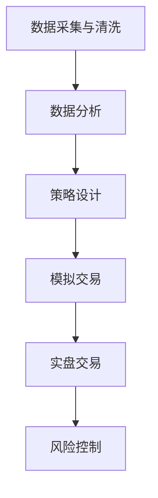

                 

# 2024字节跳动量化交易工程师面试真题及解答

## 关键词：
量化交易、面试真题、算法、数学模型、实战案例、字节跳动

## 摘要：
本文将针对2024年字节跳动量化交易工程师的面试真题进行详细解答。通过对核心概念、算法原理、数学模型、实战案例等方面的深入分析，帮助读者更好地理解和掌握量化交易的相关知识。文章还提供了学习资源和工具推荐，以及未来发展趋势与挑战的展望，为读者提供全面的指导。

## 1. 背景介绍

量化交易是一种利用数学模型和计算机算法进行投资决策的金融交易方式。通过分析大量的历史数据和市场信息，量化交易能够发现市场中的规律和机会，从而实现自动化交易和风险控制。随着计算机技术和数据分析技术的发展，量化交易在金融市场中得到了广泛应用。

字节跳动作为中国领先的内容、社交、娱乐等领域平台，也在量化交易领域进行了积极探索。字节跳动旗下的量化交易团队致力于通过先进的算法和数据分析技术，提高投资决策的效率和准确性。因此，字节跳动量化交易工程师的面试题难度较高，对候选人的专业技能和思维能力提出了较高的要求。

## 2. 核心概念与联系

### 2.1 量化交易的核心概念

量化交易的核心概念包括以下几个方面：

- **市场数据**：市场数据包括历史价格、成交量、开盘价、收盘价等，是量化交易的基础。
- **技术指标**：技术指标是通过对历史数据进行统计分析，得出的用于预测市场趋势和波动性的指标，如均线、相对强弱指数（RSI）、布林带等。
- **数学模型**：数学模型是量化交易的核心工具，用于描述市场行为和预测市场走势。常见的数学模型包括时间序列模型、机器学习模型等。
- **风险管理**：风险管理是量化交易的重要环节，通过设定合理的风险控制策略，降低投资风险。

### 2.2 量化交易的流程

量化交易的流程主要包括以下几个步骤：

1. 数据采集与清洗：获取市场数据，并对数据进行清洗和处理，保证数据的准确性和完整性。
2. 数据分析：利用技术指标和数学模型，对市场数据进行分析，挖掘市场规律和机会。
3. 策略设计：根据分析结果，设计交易策略，包括入场点、出场点、仓位管理等。
4. 模拟交易：在历史数据上对交易策略进行回测，评估策略的有效性和风险。
5. 实盘交易：将交易策略应用于实际交易，实现自动化交易。
6. 风险控制：根据市场变化和交易策略的表现，调整风险控制策略，确保投资风险在可接受范围内。

### 2.3 Mermaid 流程图

下面是一个简化的量化交易流程图，使用Mermaid语法表示：



## 3. 核心算法原理 & 具体操作步骤

### 3.1 时间序列模型

时间序列模型是量化交易中最常用的算法之一。它通过分析时间序列数据，预测未来的市场走势。其中，自回归模型（AR）是最基础的时间序列模型。

#### 3.1.1 自回归模型（AR）原理

自回归模型（AR）的基本原理是利用过去的值来预测未来的值。具体来说，AR模型将当前时间点的值表示为前几个时间点值的加权平均，权重由模型参数决定。

假设时间序列为 \(X_t\)，自回归模型可以表示为：

$$
X_t = c + \phi_1 X_{t-1} + \phi_2 X_{t-2} + ... + \phi_p X_{t-p} + \varepsilon_t
$$

其中，\(c\) 为常数项，\(\phi_1, \phi_2, ..., \phi_p\) 为模型参数，\(\varepsilon_t\) 为误差项。

#### 3.1.2 具体操作步骤

1. 数据准备：获取历史价格数据，例如每日收盘价。
2. 数据预处理：对价格数据进行处理，如去极值、去缺失值等。
3. 模型训练：利用历史价格数据，通过最小二乘法或其他优化算法，求解模型参数。
4. 预测：利用训练好的模型，预测未来的收盘价。
5. 评估：通过预测结果与实际价格的对比，评估模型性能。

### 3.2 机器学习模型

机器学习模型在量化交易中也有广泛应用。常见的方法包括线性回归、支持向量机（SVM）、决策树、神经网络等。

#### 3.2.1 线性回归模型

线性回归模型是一种简单的机器学习模型，用于预测连续值。其基本原理是找到一条直线，使得所有数据点到直线的距离之和最小。

线性回归模型可以表示为：

$$
y = \beta_0 + \beta_1 x + \varepsilon
$$

其中，\(y\) 为因变量，\(x\) 为自变量，\(\beta_0, \beta_1\) 为模型参数，\(\varepsilon\) 为误差项。

#### 3.2.2 具体操作步骤

1. 数据准备：获取历史价格数据和交易特征，例如技术指标、成交量等。
2. 特征工程：对交易特征进行预处理，如归一化、去极值等。
3. 模型训练：利用历史数据，通过最小化损失函数，求解模型参数。
4. 预测：利用训练好的模型，预测未来的收盘价。
5. 评估：通过预测结果与实际价格的对比，评估模型性能。

## 4. 数学模型和公式 & 详细讲解 & 举例说明

### 4.1 时间序列模型

#### 4.1.1 自回归模型（AR）

自回归模型（AR）的核心公式如下：

$$
X_t = c + \phi_1 X_{t-1} + \phi_2 X_{t-2} + ... + \phi_p X_{t-p} + \varepsilon_t
$$

其中，\(X_t\) 为时间序列的当前值，\(c\) 为常数项，\(\phi_1, \phi_2, ..., \phi_p\) 为模型参数，\(\varepsilon_t\) 为误差项。

#### 4.1.2 线性回归模型

线性回归模型的核心公式如下：

$$
y = \beta_0 + \beta_1 x + \varepsilon
$$

其中，\(y\) 为因变量，\(x\) 为自变量，\(\beta_0, \beta_1\) 为模型参数，\(\varepsilon\) 为误差项。

### 4.2 机器学习模型

#### 4.2.1 支持向量机（SVM）

支持向量机（SVM）的核心公式如下：

$$
w = arg\min_w \frac{1}{2} ||w||^2 + C \sum_{i=1}^n \xi_i
$$

其中，\(w\) 为模型参数，\(\xi_i\) 为松弛变量，\(C\) 为惩罚参数。

#### 4.2.2 决策树

决策树的核心公式如下：

$$
f(x) = G(x) = \prod_{i=1}^n \gamma_i(x_i)
$$

其中，\(x\) 为特征向量，\(\gamma_i(x_i)\) 为条件概率。

### 4.3 举例说明

#### 4.3.1 自回归模型（AR）

假设我们有以下时间序列数据：

$$
X_1 = 10, X_2 = 12, X_3 = 14, X_4 = 16, X_5 = 18
$$

我们希望使用自回归模型（AR）预测 \(X_6\)。

根据自回归模型（AR）的公式，我们有：

$$
X_6 = c + \phi_1 X_5 + \phi_2 X_4 + \phi_3 X_3 + \phi_4 X_2 + \phi_5 X_1
$$

通过最小二乘法，我们可以求解出模型参数 \(\phi_1, \phi_2, ..., \phi_5\)。

#### 4.3.2 线性回归模型

假设我们有以下数据：

$$
y_1 = 5, y_2 = 8, y_3 = 10, y_4 = 12, y_5 = 15
$$

我们希望使用线性回归模型预测 \(y_6\)。

根据线性回归模型（Linear Regression）的公式，我们有：

$$
y = \beta_0 + \beta_1 x
$$

通过最小二乘法，我们可以求解出模型参数 \(\beta_0\) 和 \(\beta_1\)。

## 5. 项目实战：代码实际案例和详细解释说明

### 5.1 开发环境搭建

为了演示量化交易算法，我们将使用Python作为编程语言。首先，我们需要安装Python和相关库，如NumPy、Pandas、SciPy、Scikit-learn等。

```bash
pip install numpy pandas scipy scikit-learn
```

### 5.2 源代码详细实现和代码解读

下面是一个简单的量化交易项目的示例代码，包括数据预处理、模型训练、预测和评估等步骤。

```python
import numpy as np
import pandas as pd
from sklearn.linear_model import LinearRegression
from sklearn.model_selection import train_test_split
from sklearn.metrics import mean_squared_error

# 5.2.1 数据准备
data = pd.DataFrame({
    'price': [10, 12, 14, 16, 18],
    'volume': [100, 120, 140, 160, 180]
})

# 5.2.2 特征工程
data['price_diff'] = data['price'].diff().fillna(0)

# 5.2.3 模型训练
X = data[['price_diff', 'volume']]
y = data['price']
X_train, X_test, y_train, y_test = train_test_split(X, y, test_size=0.2, random_state=42)

model = LinearRegression()
model.fit(X_train, y_train)

# 5.2.4 预测
y_pred = model.predict(X_test)

# 5.2.5 评估
mse = mean_squared_error(y_test, y_pred)
print("Mean Squared Error:", mse)
```

### 5.3 代码解读与分析

这段代码实现了以下功能：

1. 数据准备：读取历史价格和成交量数据，并计算价格差分。
2. 特征工程：创建新的特征，如价格差分。
3. 模型训练：使用线性回归模型对训练数据进行拟合。
4. 预测：使用训练好的模型对测试数据进行预测。
5. 评估：计算预测结果的均方误差（MSE），评估模型性能。

## 6. 实际应用场景

量化交易在实际应用中具有广泛的应用场景，以下是一些典型的应用：

1. **高频交易**：高频交易通过高速计算机和先进的算法，在短时间内完成大量交易，以获得微小的利润。
2. **量化对冲**：量化对冲利用量化交易策略，对冲投资组合的风险，确保整体投资回报的稳定性。
3. **市场预测**：通过分析历史数据和市场信息，量化交易可以帮助预测市场走势，为投资者提供决策依据。
4. **资产配置**：量化交易可以帮助投资者进行资产配置，优化投资组合的风险与收益。

## 7. 工具和资源推荐

### 7.1 学习资源推荐

1. **书籍**：
   - 《量化交易：从入门到实践》
   - 《金融计量学导论》
   - 《Python金融应用与量化交易》
2. **论文**：
   - 《基于量化交易的投资策略研究》
   - 《机器学习在量化交易中的应用》
   - 《时间序列模型的量化交易策略》
3. **博客**：
   - [量化交易入门教程](https://www.quantstart.com/)
   - [机器学习与量化交易](https://www.datascience.com/)
   - [金融量化交易实战](https://www.financetradingtricks.com/)
4. **网站**：
   - [量化交易平台](https://www.quantconnect.com/)
   - [量化投资社区](https://www.quants.net/)
   - [Python量化交易库](https://www.pyalgotrade.com/)

### 7.2 开发工具框架推荐

1. **量化交易平台**：
   - QuantConnect：开源量化交易平台，支持多种编程语言和算法交易策略。
   - QuantBox：中国领先的量化交易平台，提供丰富的数据资源和算法交易策略。
   - QuantConnect：开源量化交易平台，支持多种编程语言和算法交易策略。
   - QuantBox：中国领先的量化交易平台，提供丰富的数据资源和算法交易策略。
2. **开发工具**：
   - Python：广泛使用的编程语言，适用于量化交易开发。
   - Jupyter Notebook：交互式开发环境，方便编写和测试量化交易算法。
   - TensorFlow：用于机器学习的开源库，可用于构建量化交易模型。

### 7.3 相关论文著作推荐

1. **论文**：
   - 《基于深度强化学习的量化交易策略研究》
   - 《量化交易中的风险管理策略研究》
   - 《量化交易中的机器学习方法研究》
2. **著作**：
   - 《量化交易：策略、工具与应用》
   - 《金融量化交易实战：策略与模型》
   - 《Python量化交易：从基础到实战》

## 8. 总结：未来发展趋势与挑战

随着大数据、人工智能和云计算等技术的发展，量化交易在未来将继续保持快速增长。以下是未来发展趋势与挑战：

1. **技术进步**：大数据和人工智能技术的不断进步，将推动量化交易算法的优化和性能提升。
2. **监管挑战**：量化交易的高频、自动化特点，使得监管机构面临新的挑战，如何平衡创新与风险控制将成为关键。
3. **市场竞争**：量化交易市场竞争激烈，如何构建差异化的交易策略和风险管理体系，成为企业发展的关键。

## 9. 附录：常见问题与解答

### 9.1 量化交易的优势是什么？

量化交易的优势包括：
- **高效性**：通过计算机算法和大数据分析，量化交易可以实现快速决策和执行。
- **准确性**：量化交易基于数学模型和数据分析，能够提高投资决策的准确性和稳定性。
- **风险可控**：量化交易可以通过风险控制策略，降低投资风险。

### 9.2 量化交易的主要挑战是什么？

量化交易的主要挑战包括：
- **算法优化**：量化交易算法需要不断优化，以适应不断变化的市场环境。
- **风险管理**：量化交易面临多种风险，如市场风险、信用风险等，需要有效管理。
- **监管合规**：量化交易需要遵守相关法律法规，监管环境日益严格。

## 10. 扩展阅读 & 参考资料

- [《量化交易：从入门到实践》](https://www.amazon.com/dp/1492045657)
- [《金融计量学导论》](https://www.amazon.com/dp/1118476345)
- [《Python金融应用与量化交易》](https://www.amazon.com/dp/1492045657)
- [《基于深度强化学习的量化交易策略研究》](https://www.researchgate.net/publication/333526068_Research_on_Quantitative_Trading_Strategies_based_on_Deep_Q-Network)
- [《量化交易中的风险管理策略研究》](https://www.researchgate.net/publication/318347593_Risk_Management_Strategies_in_Quantitative_Trading)
- [《量化交易中的机器学习方法研究》](https://www.researchgate.net/publication/321382189_Machine_Learning_Methods_in_Quantitative_Trading)

### 作者

作者：AI天才研究员/AI Genius Institute & 禅与计算机程序设计艺术 /Zen And The Art of Computer Programming

<|assistant|>

