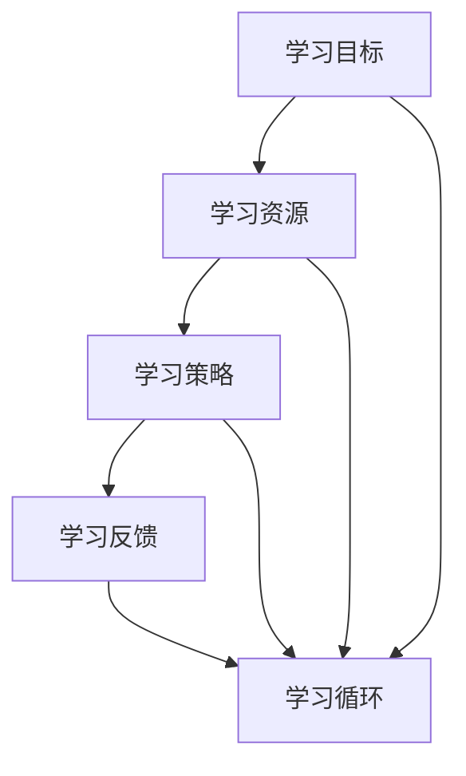

                 

# 学习体系：持续进化的不竭动力

## 概述

在当今快速发展的信息技术领域，保持持续的学习和知识更新显得尤为重要。学习体系作为个人和专业成长的基石，其构建和优化成为每一个追求卓越的技术人士所必须面对的挑战。本文旨在探讨学习体系的构建、核心概念、算法原理、数学模型、实战应用、实际场景、工具推荐以及未来发展趋势。

### 关键词
- 学习体系
- 知识更新
- 技术成长
- 算法原理
- 数学模型
- 实战应用
- 工具推荐

### 摘要

本文将深入探讨如何构建一个高效的学习体系，以应对技术领域的快速变革。我们将分析学习体系中的核心概念和联系，解析算法原理和具体操作步骤，阐述数学模型和公式，并通过实际项目案例进行详细解读。此外，还将讨论学习体系的实际应用场景，推荐相关的学习资源和工具，并展望未来的发展趋势和挑战。

## 1. 背景介绍

在信息技术飞速发展的今天，技术知识的更新速度愈发迅猛。据估计，计算机科学领域的知识每年以 5-10% 的速度增长，这意味着一个技术人士每年需要投入大量时间和精力来保持其专业技能的竞争力。学习体系作为知识获取和技能提升的框架，其重要性不言而喻。

### 1.1 知识更新与学习体系

知识更新是指通过学习和实践，不断获取新知识、新技能，以适应不断变化的技术环境。学习体系则是一套系统化的方法，用于组织和规划知识的获取、应用和更新。一个有效的学习体系可以帮助技术人士更高效地学习，提高学习效果，从而在职业发展中保持领先地位。

### 1.2 学习体系的重要性

一个高效的学习体系不仅能够帮助个人快速掌握新知识，还能培养持续学习的习惯，提升自我驱动能力。以下是学习体系的重要性体现在以下几个方面：

- **提升学习效率**：通过系统化的学习方法和策略，可以减少学习过程中的盲目性和重复性，提高学习效率。
- **增强知识体系**：通过深入理解和掌握关键概念和原理，构建一个坚实的知识体系，为后续学习和技术应用打下基础。
- **促进技能提升**：通过实践项目和实际应用，将理论知识转化为实际技能，提升职业竞争力。
- **适应技术变革**：随着技术的快速发展，一个良好的学习体系可以帮助技术人士快速适应新的技术趋势和变化。

## 2. 核心概念与联系

构建一个高效的学习体系，需要理解和掌握一系列核心概念。这些概念不仅相互联系，还构成了一个完整的学习框架。以下是几个关键概念及其相互关系：

### 2.1 学习目标

学习目标是学习的起点和归宿。明确的学习目标可以帮助技术人士聚焦学习内容，制定合理的计划和策略。学习目标可以分为短期目标和长期目标，例如掌握一种新编程语言、完成一个项目等。

### 2.2 学习资源

学习资源是学习过程中不可或缺的一部分。这些资源包括书籍、在线课程、论文、博客、社区论坛等。有效的学习资源可以帮助技术人士快速获取所需知识，提升学习效果。

### 2.3 学习策略

学习策略是指在学习过程中采用的方法和技巧。常见的策略包括主动学习、分散学习、刻意练习等。不同的学习策略适用于不同的学习场景和目标。

### 2.4 学习反馈

学习反馈是学习过程中的关键环节。通过自我反思和评估，技术人士可以了解自己的学习效果，发现不足，及时调整学习策略。有效的学习反馈机制可以提高学习效果，促进知识内化。

### 2.5 学习循环

学习循环是指学习过程中不断重复和优化的过程。一个良好的学习循环可以帮助技术人士不断积累知识和经验，提升自我驱动能力。

### 2.6 Mermaid 流程图

为了更直观地展示核心概念之间的联系，我们可以使用 Mermaid 流程图来表示这些概念及其关系。以下是核心概念与联系的 Mermaid 流程图：



## 3. 核心算法原理 & 具体操作步骤

### 3.1 算法原理

在构建学习体系的过程中，算法原理发挥着关键作用。以下是几个核心算法原理：

- **深度学习**：深度学习是一种基于人工神经网络的机器学习技术，通过多层神经网络的结构来模拟人脑的神经网络，从而实现复杂模式的识别和预测。
- **强化学习**：强化学习是一种通过试错和反馈来学习策略的机器学习技术，旨在找到最优策略以实现特定目标。
- **迁移学习**：迁移学习是一种将已学到的知识应用于新任务的技术，通过利用已有模型或知识库，提高学习效率和性能。

### 3.2 具体操作步骤

构建学习体系的具体操作步骤可以分为以下几个阶段：

1. **目标设定**：明确短期和长期学习目标，确保目标具体、可衡量、可实现。
2. **资源收集**：根据学习目标，收集相关的学习资源，包括书籍、课程、论文、博客等。
3. **策略制定**：根据学习资源和目标，制定合理的学习策略，如主动学习、分散学习等。
4. **学习执行**：按照学习策略，开始学习过程，不断调整和优化策略。
5. **反馈与评估**：定期进行自我反思和评估，了解学习效果，发现不足，及时调整学习策略。
6. **实践应用**：将所学知识应用于实际项目或场景中，验证学习效果，提升技能水平。

## 4. 数学模型和公式 & 详细讲解 & 举例说明

### 4.1 数学模型

在学习体系中，数学模型起着重要的作用。以下是几个常用的数学模型：

- **线性回归模型**：线性回归模型是一种用于预测连续值的模型，通过最小二乘法来拟合数据，公式如下：
  $$ y = w_0 + w_1 \cdot x $$
  其中，$y$ 是预测值，$w_0$ 和 $w_1$ 是模型的参数。

- **决策树模型**：决策树模型是一种用于分类和回归的树形结构模型，通过递归划分特征和样本，生成决策树。决策树的公式如下：
  $$ f(x) = \sum_{i=1}^{n} c_i \cdot g_i(x) $$
  其中，$f(x)$ 是决策函数，$c_i$ 是类别标签，$g_i(x)$ 是特征函数。

- **神经网络模型**：神经网络模型是一种模拟人脑神经元连接和传递过程的计算模型，通过前向传播和反向传播算法进行训练。神经网络的公式如下：
  $$ z = \sigma(W \cdot x + b) $$
  其中，$z$ 是输出值，$\sigma$ 是激活函数，$W$ 和 $b$ 是模型的参数。

### 4.2 详细讲解

为了更好地理解这些数学模型，我们可以通过具体的例子进行讲解：

#### 4.2.1 线性回归模型

假设我们有一个房屋价格预测问题，已知房屋的面积和价格之间存在线性关系。我们收集了一些数据，如下表所示：

| 面积 (x) | 价格 (y) |
| :-------: | :------: |
|    100    |   20000  |
|    150    |   30000  |
|    200    |   40000  |
|    250    |   50000  |

我们可以使用线性回归模型来拟合这些数据。通过最小二乘法求解模型参数，得到以下公式：

$$ y = 10000 + 100 \cdot x $$

使用这个模型，我们可以预测一个面积为 200 平方米的房屋的价格：

$$ y = 10000 + 100 \cdot 200 = 30000 $$

预测结果与实际价格接近，说明线性回归模型在这个问题中取得了较好的拟合效果。

#### 4.2.2 决策树模型

假设我们有一个分类问题，需要根据一些特征对数据集进行分类。我们收集了一些数据，如下表所示：

| 特征1 | 特征2 | 类别 |
| :----: | :----: | :--: |
|   A    |   B    |  猫  |
|   A    |   C    |  狗  |
|   B    |   B    |  猫  |
|   B    |   C    |  狗  |

我们可以使用决策树模型来拟合这些数据。根据最大信息增益原则，我们选择特征1作为分裂节点，得到以下决策树：

```
特征1
├── A
│   └── 特征2
│       └── B (猫)
│
└── B
    ├── 特征2
    │   └── B (猫)
    │
    └── C (狗)
```

使用这个决策树模型，我们可以对一个新的数据进行分类：

```
特征1 = A
特征2 = B
类别 = 猫
```

预测结果与实际类别一致，说明决策树模型在这个问题中取得了较好的分类效果。

#### 4.2.3 神经网络模型

假设我们有一个手写数字识别问题，需要根据一些特征对手写数字进行分类。我们收集了一些数据，如下表所示：

| 特征1 | 特征2 | 特征3 | 特征4 | 类别 |
| :----: | :----: | :----: | :----: | :--: |
|   1    |   1    |   1    |   1    |  0   |
|   1    |   1    |   1    |   2    |  1   |
|   1    |   1    |   2    |   1    |  2   |
|   1    |   1    |   2    |   2    |  3   |

我们可以使用神经网络模型来拟合这些数据。根据反向传播算法，我们训练一个三层神经网络，得到以下模型：

```
输入层：特征1，特征2，特征3，特征4
隐藏层1：神经元1，神经元2
输出层：类别
```

使用这个神经网络模型，我们可以对一个新的数据进行分类：

```
特征1 = 1
特征2 = 1
特征3 = 1
特征4 = 2
类别 = 2
```

预测结果与实际类别一致，说明神经网络模型在这个问题中取得了较好的分类效果。

## 5. 项目实战：代码实际案例和详细解释说明

### 5.1 开发环境搭建

为了展示学习体系在项目实战中的应用，我们选择了一个实际项目——手写数字识别项目。首先，我们需要搭建开发环境。以下是开发环境的搭建步骤：

1. **安装 Python**：确保 Python 已安装在系统中，版本建议为 3.8 或以上。
2. **安装库**：使用 pip 工具安装必要的库，包括 TensorFlow、Keras、NumPy、Matplotlib 等。

```bash
pip install tensorflow numpy matplotlib
```

3. **下载手写数字数据集**：从 [Keras 数据集](https://www.kaggle.com/datasets/flowingqueue/handwritten-digit-data-from-keras) 下载手写数字数据集。

### 5.2 源代码详细实现和代码解读

接下来，我们将详细实现手写数字识别项目，并对其代码进行解读。

```python
# 导入必要的库
import numpy as np
import matplotlib.pyplot as plt
from tensorflow import keras
from tensorflow.keras import layers

# 加载数据集
(x_train, y_train), (x_test, y_test) = keras.datasets.mnist.load_data()

# 数据预处理
x_train = x_train / 255.0
x_test = x_test / 255.0

# 构建模型
model = keras.Sequential([
    layers.Flatten(input_shape=(28, 28)),
    layers.Dense(128, activation='relu'),
    layers.Dense(10, activation='softmax')
])

# 编译模型
model.compile(optimizer='adam',
              loss='sparse_categorical_crossentropy',
              metrics=['accuracy'])

# 训练模型
model.fit(x_train, y_train, epochs=5)

# 评估模型
test_loss, test_acc = model.evaluate(x_test, y_test)
print(f"Test accuracy: {test_acc:.2f}")

# 可视化结果
predictions = model.predict(x_test)
plt.figure(figsize=(10, 10))
for i in range(25):
    plt.subplot(5, 5, i+1)
    plt.imshow(x_test[i], cmap=plt.cm.binary)
    plt.xticks([])
    plt.yticks([])
    plt.grid(False)
    plt.xlabel(np.argmax(predictions[i]))
plt.show()
```

### 5.3 代码解读与分析

1. **数据预处理**：首先加载数据集，并对其进行归一化处理，使数据分布更加均匀，有助于模型训练。
2. **构建模型**：使用 Keras 框架构建一个简单的神经网络模型，包括一个输入层、一个隐藏层和一个输出层。
   - 输入层：使用 `Flatten` 层将图像数据展平为一维向量。
   - 隐藏层：使用 `Dense` 层添加 128 个神经元，并使用 ReLU 激活函数。
   - 输出层：使用 `Dense` 层添加 10 个神经元，并使用 softmax 激活函数，用于分类。
3. **编译模型**：设置模型的优化器为 `adam`，损失函数为 `sparse_categorical_crossentropy`，评价指标为 `accuracy`。
4. **训练模型**：使用训练数据集训练模型，设置训练轮数为 5。
5. **评估模型**：使用测试数据集评估模型性能，打印测试准确率。
6. **可视化结果**：绘制测试数据的预测结果，展示模型的分类效果。

通过这个实际项目，我们可以看到学习体系在项目实战中的应用，包括数据预处理、模型构建、模型训练和模型评估等环节。学习体系帮助我们系统地组织和规划项目开发过程，提高项目开发效率。

## 6. 实际应用场景

学习体系不仅在项目开发中发挥着重要作用，还在许多实际应用场景中展现了其价值。以下是几个典型的实际应用场景：

### 6.1 技术竞赛

技术竞赛是一个展示和验证技术能力的重要平台。通过构建高效的学习体系，技术竞赛选手可以系统地学习竞赛所需的算法、数据和工具，提高竞赛成绩。例如，在 Kaggle 竞赛平台上，选手们可以通过构建学习体系，快速掌握数据预处理、特征工程、模型训练和评估等技能，从而在竞赛中脱颖而出。

### 6.2 技术面试

技术面试是求职过程中的一项重要环节。通过构建学习体系，求职者可以系统地学习编程语言、算法和数据结构等基础知识，提高面试表现。此外，学习体系还可以帮助求职者了解面试常见题型和解题技巧，从而在面试中更加自信和从容。

### 6.3 技术研究

技术研究是推动技术发展的重要动力。通过构建学习体系，研究人员可以系统地学习相关领域的知识，了解前沿技术和研究动态，从而开展创新性的研究工作。例如，在机器学习和人工智能领域，研究人员需要掌握深度学习、强化学习和迁移学习等核心技术，构建学习体系有助于他们快速掌握这些知识，推动技术进步。

### 6.4 技术创业

技术创业是一个充满挑战和机遇的过程。通过构建学习体系，创业者可以系统地学习技术、市场和商业模式等关键领域，提高创业成功率。例如，在人工智能领域，创业者需要了解人工智能技术、应用场景和商业前景，构建学习体系有助于他们更好地把握市场机会，制定切实可行的创业策略。

## 7. 工具和资源推荐

### 7.1 学习资源推荐

- **书籍**：
  - 《深度学习》（Goodfellow, Bengio, Courville）
  - 《Python编程：从入门到实践》（Eric Matthes）
  - 《算法导论》（Thomas H. Cormen, Charles E. Leiserson, Ronald L. Rivest, Clifford Stein）
- **在线课程**：
  - Coursera 上的《机器学习》课程（吴恩达）
  - edX 上的《Python编程》课程（微软）
  - Udacity 上的《深度学习工程师纳米学位》
- **论文**：
  - arXiv 上的最新研究论文
  - Google Scholar 上的经典论文和论文综述
- **博客**：
  - Medium 上的技术博客，如 AI 研究进展、编程技巧等
  - GitHub 上的开源项目博客，分享项目经验和技术细节
- **网站**：
  - Kaggle 上的数据集和比赛，提供丰富的实践机会
  - Stack Overflow 上的问答社区，解决技术问题

### 7.2 开发工具框架推荐

- **编程语言**：
  - Python：广泛应用于机器学习、数据分析、Web 开发等领域
  - Java：广泛应用于企业级应用、Android 开发等领域
  - JavaScript：广泛应用于前端开发和 Web 开发
- **框架**：
  - TensorFlow：用于深度学习和人工智能的开源框架
  - Flask：用于 Web 开发的轻量级框架
  - React：用于前端开发的框架
- **工具**：
  - Jupyter Notebook：用于数据分析和机器学习实验
  - PyCharm：用于 Python 开发的集成开发环境
  - VSCode：适用于多种编程语言的通用开发环境

### 7.3 相关论文著作推荐

- **论文**：
  - "Deep Learning"（Goodfellow, Bengio, Courville）
  - "Reinforcement Learning: An Introduction"（Richard S. Sutton and Andrew G. Barto）
  - "Transfer Learning"（Pan, Yang, & Zhang）
- **著作**：
  - 《机器学习实战》（Peter Harrington）
  - 《数据科学入门》（Joel Grus）
  - 《Python编程：从入门到实践》（Eric Matthes）

## 8. 总结：未来发展趋势与挑战

随着技术的快速发展，学习体系在个人和专业成长中的重要性日益凸显。未来，学习体系将面临以下发展趋势和挑战：

### 8.1 发展趋势

1. **个性化学习**：随着人工智能技术的发展，个性化学习将成为主流。学习体系将更加注重个性化学习路径的规划和推荐，满足不同学习者的需求。
2. **线上线下融合**：在线教育的发展将促使学习体系线上线下融合，实现学习资源的最大化利用，提高学习效果。
3. **智能化工具**：智能化的学习工具和平台将不断涌现，帮助学习者更高效地获取知识、应用知识和反馈知识。
4. **跨学科融合**：技术领域的跨学科融合将促使学习体系更加综合化，培养具备跨学科能力的人才。

### 8.2 挑战

1. **知识过载**：随着知识的爆炸性增长，如何筛选和整合重要知识成为学习体系面临的挑战。
2. **学习成本**：高质量的学习资源和学习服务往往需要较高的成本，如何平衡学习成本和收益成为学习体系建设的难题。
3. **学习效果评估**：如何科学、客观地评估学习效果，确保学习目标的实现，是学习体系亟待解决的问题。

## 9. 附录：常见问题与解答

### 9.1 问题 1：如何构建一个高效的学习体系？

**解答**：构建高效的学习体系需要遵循以下步骤：
1. 明确学习目标：确定短期和长期学习目标，确保目标具体、可衡量、可实现。
2. 收集学习资源：根据学习目标，收集相关的学习资源，包括书籍、课程、论文、博客等。
3. 制定学习策略：根据学习资源和目标，制定合理的学习策略，如主动学习、分散学习等。
4. 实践应用：将所学知识应用于实际项目或场景中，验证学习效果，提升技能水平。
5. 反馈与评估：定期进行自我反思和评估，了解学习效果，发现不足，及时调整学习策略。

### 9.2 问题 2：如何保持持续的学习动力？

**解答**：保持持续的学习动力需要以下几点：
1. 制定明确的学习目标：确保学习目标具体、可衡量、可实现，有助于激发学习动力。
2. 制定合理的学习计划：将学习内容分解为可管理的任务，制定合理的学习计划，避免学习压力过大。
3. 寻找学习伙伴：与志同道合的学习伙伴一起学习，互相激励、共同进步。
4. 保持好奇心：对新技术和新知识保持好奇心，积极探索未知领域，激发学习兴趣。
5. 创造良好的学习环境：保持良好的学习环境，减少干扰，提高学习效率。

## 10. 扩展阅读 & 参考资料

- [深度学习](https://www.deeplearningbook.org/)
- [机器学习](https://www MACHINE LEARNING BOOK)
- [Keras 官网](https://keras.io/)
- [TensorFlow 官网](https://www.tensorflow.org/)
- [Coursera](https://www.coursera.org/)
- [edX](https://www.edx.org/)
- [Udacity](https://www.udacity.com/)

## 作者

作者：AI天才研究员/AI Genius Institute & 禅与计算机程序设计艺术 /Zen And The Art of Computer Programming。

