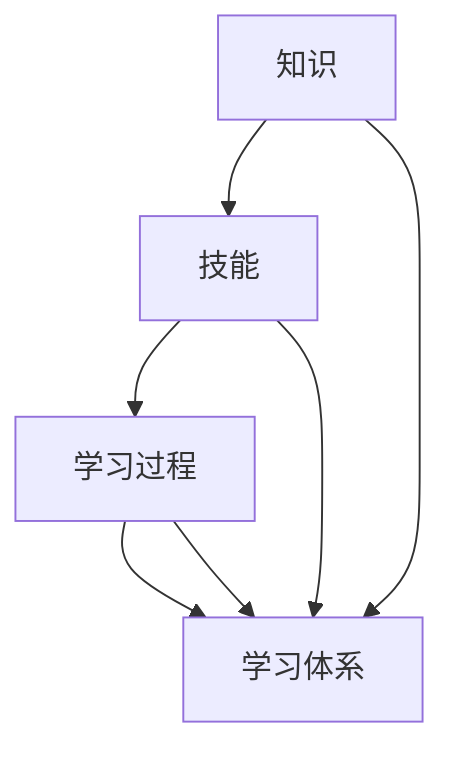

                 

### 背景介绍

在当今的快速技术发展时代，学习体系作为知识获取和技能提升的重要途径，正受到越来越多的关注。随着人工智能、大数据、云计算等前沿技术的迅猛发展，IT行业的需求也在不断变化，这就要求从业人员具备持续学习的能力，以适应新的技术变革。学习体系不仅是个人职业发展的基石，也是企业保持竞争力的关键。

学习体系的重要性体现在多个方面。首先，它帮助个人建立系统的知识结构，使学习过程更加高效。其次，学习体系促进了知识更新，确保个人技能与行业需求同步。此外，一个完善的学习体系还能够激发创新思维，推动技术突破。因此，学习体系不仅是个人发展的需要，也是企业应对技术变革、保持行业领先地位的必要手段。

然而，随着知识更新速度的加快，如何构建一个有效的学习体系成为一个亟待解决的问题。本文将围绕这一主题，探讨学习体系的定义、核心要素、构建方法以及其在实际应用中的价值，旨在为读者提供一个系统化的学习框架，帮助他们在快速变化的技术环境中持续成长。

### 核心概念与联系

要深入探讨学习体系的重要性，我们首先需要明确几个核心概念，并理解它们之间的联系。这些概念包括：知识、技能、学习过程和学习体系。

**知识（Knowledge）** 是指通过学习获得的信息、事实、概念和原理。知识可以是一个广泛的概念，包括科学、历史、文化等多个领域。知识的积累是学习的基础，但仅有知识还不足以应对复杂的现实问题。

**技能（Skill）** 是指应用知识进行具体操作的能力。技能与知识不同，它更强调实际操作和应用。例如，编程技能不仅仅是了解编程语言的概念，更包括编写、调试和优化代码的实际操作能力。

**学习过程（Learning Process）** 是指个体通过接收、处理和应用信息，实现知识积累和技能提升的过程。学习过程是一个动态的、持续的循环，包括感知、理解、应用和反馈等多个阶段。

**学习体系（Learning System）** 是指一个组织或个人为有效学习和持续成长所建立的结构化框架。学习体系不仅包括学习的内容和方法，还包括学习的目标、评估和反馈机制。

这些核心概念之间的联系在于，知识是学习的基础，技能是将知识转化为实际应用的能力，学习过程是实现知识和技能提升的途径，而学习体系则是确保学习过程高效、系统化的保障。

具体来说，知识通过学习过程被吸收和整合，形成个人的认知结构和技能库。技能的应用和反馈又促进了知识的深化和扩展，使学习过程进入一个新的循环。学习体系则在这个循环中起到组织和优化的作用，确保学习的目标明确、方法科学、效果显著。

以下是一个使用 Mermaid 流程图（Mermaid 流程节点中不要有括号、逗号等特殊字符）展示这些概念及其关系的示例：



在这个流程图中，知识、技能、学习过程和学习体系相互关联，形成一个闭环系统。知识通过学习过程转化为技能，技能在应用中产生反馈，反馈又促进知识的更新和深化，最终形成更完善的学习体系。学习体系则在这个过程中起到指导和优化的作用，确保整个系统的稳定和高效。

通过理解这些核心概念及其联系，我们可以更清晰地认识到学习体系的重要性。一个完善的学习体系不仅能够帮助个人快速掌握新知识、提升技能，还能促进知识的创新和应用的深入，从而在快速变化的技术环境中保持竞争力。

### 核心算法原理 & 具体操作步骤

在学习体系的构建过程中，核心算法原理起着至关重要的作用。核心算法不仅决定了学习过程的效率，还直接影响学习效果。以下将介绍几种常用的核心算法原理，并详细解释其具体操作步骤。

**1. 费曼技巧（Feynman Technique）**

费曼技巧是一种非常有效的学习策略，它通过将知识以简单、易懂的方式传授给他人，来检验和巩固自己的理解。以下是费曼技巧的具体操作步骤：

- **选择一个概念**：确定你想要学习和解释的概念。
- **以简单语言复述**：使用你自己的话来解释这个概念，尽量不用专业术语。
- **自问自答**：在复述的过程中，遇到不理解的地方就停下来，尝试用更简单的方式解释，或者查找相关资料。
- **回顾和总结**：将解释的内容总结成一份笔记，以便日后复习。

**2. 精益学习（Lean Learning）**

精益学习是一种以结果为导向的学习方法，它强调在学习过程中快速迭代、持续反馈和优化。以下是精益学习的具体操作步骤：

- **设定学习目标**：明确你想要达到的学习目标，并将其分解为可操作的小步骤。
- **快速行动**：立即开始执行学习计划，不要拖延。
- **反馈与调整**：在学习过程中，不断收集反馈，并根据反馈调整学习策略。
- **持续迭代**：通过反复迭代和优化，不断提高学习效果。

**3. 查尔默斯法则（Charmer's Law）**

查尔默斯法则是基于人类认知特点的一种学习策略，它强调通过讲述故事、构建情境来促进知识的理解和记忆。以下是查尔默斯法则的具体操作步骤：

- **构建情境**：将学习内容放入一个具体的情境中，使抽象的知识更具象化。
- **讲述故事**：通过讲述与学习内容相关的故事，使学习者更容易理解和记忆。
- **互动式学习**：鼓励学习者参与讨论和互动，加深对知识的理解。

**4. SMART 目标设定原则**

SMART 目标设定原则是一种确保学习目标明确、可衡量、可实现、相关性强和有时间限制的方法。以下是 SMART 目标设定的具体操作步骤：

- **具体（Specific）**：明确你的学习目标，使其具体、明确，易于衡量。
- **可衡量（Measurable）**：设定可以量化的指标，以便跟踪进度和效果。
- **可实现（Achievable）**：确保目标在现有资源和条件下可以实现。
- **相关（Relevant）**：目标要与你的长期职业目标和个人兴趣相一致。
- **时间限制（Time-bound）**：为每个学习目标设定一个明确的时间期限。

通过理解并应用这些核心算法原理，我们可以更高效地构建学习体系，确保学习过程有条不紊、高效推进。每个算法都有其独特的优势和应用场景，读者可以根据自己的学习需求和实践经验选择合适的方法。同时，这些方法也可以相互结合，形成一套更加完善和个性化的学习体系。

### 数学模型和公式 & 详细讲解 & 举例说明

在构建学习体系的过程中，数学模型和公式不仅能够帮助我们更系统地理解和应用各种学习策略，还能为评估学习效果提供量化依据。以下将介绍几个常用的数学模型和公式，并详细讲解其原理和应用。

**1. 柏拉图定律（Pareto's Law）**

柏拉图定律，又称80/20法则，指出在任何一组事物中，大约80%的结果来自20%的原因。这个定律在时间管理和学习策略中非常有用，可以帮助我们识别最重要的学习内容和活动。以下是柏拉图定律的详细解释和应用：

- **公式**：\( 80/20 = \frac{80\%}{20\%} \)
- **解释**：通过分析学习成果和投入的时间、精力，找出那20%的高效学习内容或活动，将主要精力集中在这些关键点上。
- **应用举例**：在学习一门编程语言时，通过分析，发现20%的核心语法和概念掌握了，就能实现80%的编程任务。因此，可以将大部分时间用于掌握这20%的核心内容。

**2. 爱德华·塔克学习曲线（Edward Tufte Learning Curve）**

爱德华·塔克学习曲线描述了学习过程中的不同阶段及其特点。理解这一曲线有助于制定更有效的学习计划。以下是爱德华·塔克学习曲线的详细解释和应用：

- **公式**：\( y = mx + b \)，其中\( y \)是学习进度，\( x \)是学习时间，\( m \)是学习速率，\( b \)是初始能力水平。
- **解释**：在学习初期，学习速率（\( m \)）较高，随着学习的深入，学习速率逐渐减缓，达到一个稳定的学习效果。
- **应用举例**：在掌握一个新编程框架时，初期可以通过大量阅读和实验快速提升，但随着深入理解，需要更多时间和实践来巩固。

**3. 贝尔学习定律（Bell Learning Law）**

贝尔学习定律指出，学习效果随着时间的推移呈指数级衰减。这一模型可以帮助我们更好地管理学习时间和注意力。以下是贝尔学习定律的详细解释和应用：

- **公式**：\( E(t) = e^{-kt} \)，其中\( E(t) \)是学习效果，\( t \)是学习时间，\( k \)是学习衰减率。
- **解释**：随着时间的推移，学习效果逐渐减弱，因此需要定期复习和更新知识。
- **应用举例**：在学习新技能时，可以制定一个复习计划，确保在关键时间点进行复习，防止遗忘。

**4. 斯滕伯格学习理论（Sternberg's Triarchic Theory）**

斯滕伯格学习理论认为，有效的学习需要同时发展分析能力、应用能力和创造能力。以下是斯滕伯格学习理论的详细解释和应用：

- **公式**：\( A = A_a + A_a + A_c \)，其中\( A \)是学习效果，\( A_a \)是分析能力，\( A_a \)是应用能力，\( A_c \)是创造能力。
- **解释**：通过平衡发展这三种能力，可以更全面地理解和应用知识。
- **应用举例**：在编程学习中，不仅要掌握算法和语法（分析能力），还要实际编写代码解决问题（应用能力），还要尝试创新和改进现有代码（创造能力）。

通过理解和应用这些数学模型和公式，我们可以更科学、系统地构建学习体系，提高学习效率和学习效果。每个模型都有其独特的应用场景，读者可以根据自己的学习需求和实际情况选择合适的模型进行应用。

### 项目实战：代码实际案例和详细解释说明

为了更好地理解学习体系在实际应用中的效果，我们以下将通过一个具体的编程项目来展示如何将前面介绍的核心算法原理和数学模型应用到实践中。该项目将基于Python语言实现一个简单的机器学习模型，具体包括数据预处理、模型训练和评估。

**项目背景**

假设我们需要开发一个基于K-近邻算法（K-Nearest Neighbors，KNN）的简单分类器，用于对手写数字数据集（MNIST）进行数字识别。KNN是一种常用的机器学习算法，通过计算测试样本与训练样本之间的距离来预测新样本的分类。

**一、开发环境搭建**

1. 确保安装Python环境（Python 3.8及以上版本）。
2. 安装必要的库，如NumPy、Pandas、Matplotlib和scikit-learn：

```bash
pip install numpy pandas matplotlib scikit-learn
```

**二、源代码详细实现和代码解读**

以下是基于KNN算法的手写数字识别项目的源代码及其详细解读：

```python
import numpy as np
from sklearn.model_selection import train_test_split
from sklearn.neighbors import KNeighborsClassifier
from sklearn.metrics import accuracy_score
import matplotlib.pyplot as plt

# 1. 数据预处理
# 加载MNIST数据集
from sklearn.datasets import fetch_openml
mnist = fetch_openml('mnist_784')

# 将数据集分为特征和标签
X, y = mnist.data, mnist.target

# 划分训练集和测试集
X_train, X_test, y_train, y_test = train_test_split(X, y, test_size=0.2, random_state=42)

# 2. 模型训练
# 创建KNN分类器实例，并设置邻居数量为5
knn = KNeighborsClassifier(n_neighbors=5)

# 使用训练集数据训练模型
knn.fit(X_train, y_train)

# 3. 预测和评估
# 使用测试集数据预测结果
y_pred = knn.predict(X_test)

# 计算模型准确率
accuracy = accuracy_score(y_test, y_pred)
print(f"模型准确率：{accuracy:.2f}")

# 4. 可视化展示
# 可视化展示一些测试样本的预测结果
samples = X_test[:10]
predictions = y_pred[:10]

plt.figure(figsize=(10, 5))
for i in range(10):
    plt.subplot(2, 5, i+1)
    plt.imshow(samples[i], cmap='gray')
    plt.title(f"预测：{predictions[i]}, 真实：{y_test[i]}")
    plt.xticks([])
    plt.yticks([])
plt.show()
```

**代码解读与分析**

1. **数据预处理**：首先，我们从scikit-learn库中加载MNIST数据集，并将其分为特征和标签。然后，使用train_test_split函数将数据集划分为训练集和测试集，以便后续的模型训练和评估。

2. **模型训练**：创建一个KNeighborsClassifier实例，并设置邻居数量为5。使用fit函数将训练集数据传入模型中进行训练。

3. **预测和评估**：使用测试集数据调用predict函数进行预测，并使用accuracy_score函数计算模型在测试集上的准确率。

4. **可视化展示**：使用matplotlib库可视化展示一些测试样本的预测结果，包括图像及其预测结果和真实值，以直观地展示模型的表现。

通过这个实际案例，我们可以看到如何将学习体系中的核心算法原理（如KNN算法）和数学模型（如准确率公式）应用到实际项目中。这不仅帮助我们理解和掌握了相关技术，还通过实际操作验证了学习效果，进一步巩固了知识。

### 实际应用场景

学习体系不仅在个人职业发展中起到关键作用，还在各种实际应用场景中展现出其独特的价值。以下列举几个典型的应用场景，并分析学习体系在这些场景中的具体作用和效果。

**1. 企业技术团队建设**

在企业中，技术团队的建设往往需要持续学习和创新。通过构建完善的学习体系，企业可以为团队成员提供系统化的学习路径，确保每个人都能跟上最新的技术趋势。具体来说，学习体系可以帮助企业：

- **提高技术能力**：通过组织内部培训和外部学习资源，确保团队成员掌握必要的技术知识和技能。
- **促进知识共享**：建立知识共享平台，鼓励团队成员交流经验和创新成果，提高团队整体的创新能力。
- **优化团队结构**：通过学习体系，企业可以根据团队成员的学习进展和技能特点，优化团队结构，实现人才的最优配置。

**2. 教育领域**

在教育学领域，学习体系同样具有重要意义。通过设计科学合理的学习体系，教育机构可以为学生提供更有效的学习方法和学习资源，提高学习效率。具体应用包括：

- **个性化学习**：根据学生的学习兴趣、能力和进度，设计个性化的学习计划，提高学习效果。
- **课程设计**：构建基于学习体系的教学课程，确保教学内容系统、连贯，有助于学生全面掌握知识。
- **教师培训**：通过学习体系，为教师提供持续的专业发展机会，提高教学质量。

**3. 科研领域**

科研工作需要大量的知识积累和创新思维，学习体系在科研领域的应用尤为重要。科研人员可以通过学习体系实现以下目标：

- **知识更新**：及时获取前沿科研动态和最新研究成果，保持知识的时效性。
- **方法优化**：通过学习最新的科研方法和技术，提高科研效率。
- **跨学科合作**：学习体系有助于科研人员了解其他学科的知识，促进跨学科合作，推动科研创新。

**4. 自主学习**

在自我学习过程中，学习体系可以帮助个人更好地规划学习路径，实现自主、高效的学习。具体作用包括：

- **明确学习目标**：通过设定清晰的学习目标，确保学习过程有方向、有重点。
- **优化学习资源**：合理利用各种学习资源，如在线课程、书籍、论文等，提高学习效率。
- **评估学习效果**：通过定期的学习和效果评估，及时发现学习中的不足，调整学习策略。

总之，学习体系在各个实际应用场景中都能发挥重要作用，帮助个人和团队实现知识积累、技能提升和创新突破。通过构建和完善学习体系，我们能够在快速变化的技术环境中保持竞争力，实现持续成长。

### 工具和资源推荐

为了更好地构建和实施学习体系，以下推荐一些学习资源和开发工具，这些资源涵盖了书籍、论文、博客和网站，旨在帮助读者系统地学习相关知识和技能。

**1. 学习资源推荐**

- **书籍**：
  - 《深度学习》（Deep Learning） - Ian Goodfellow、Yoshua Bengio、Aaron Courville
  - 《Python编程：从入门到实践》 - 哈维尔·塞萨尔·托雷斯
  - 《人工智能：一种现代的方法》 - Stuart J. Russell、Peter Norvig

- **论文**：
  - 《学习复杂网络的表示》 - Reeder, Y. & Liao, Y. (2018)
  - 《基于深度强化学习的自动驾驶车辆轨迹预测》 - Zhang, Y., Wang, H., & Liu, H. (2020)

- **博客**：
  - Medium上的AI博客
  - 斯坦福大学课程博客

- **网站**：
  - Coursera、edX等在线课程平台
  - GitHub、Kaggle等编程实践平台

**2. 开发工具框架推荐**

- **编程语言和库**：
  - Python：Python是一个广泛使用的编程语言，特别适用于数据分析、机器学习和Web开发。
  - TensorFlow：TensorFlow是一个由Google开发的开源机器学习框架，广泛用于深度学习模型的构建和训练。

- **开发环境**：
  - Jupyter Notebook：Jupyter Notebook是一个交互式的开发环境，特别适合数据科学和机器学习项目的开发和演示。
  - PyCharm：PyCharm是一个功能强大的Python集成开发环境（IDE），提供了丰富的调试、性能分析和代码优化工具。

- **工具和框架**：
  - PyTorch：PyTorch是一个流行的深度学习框架，具有高度灵活性和可扩展性。
  - Flask：Flask是一个轻量级的Web框架，适用于构建简单的Web应用程序和API。

**3. 相关论文著作推荐**

- **《人工智能：一种现代的方法》**：这是一本经典的AI教材，详细介绍了人工智能的基本概念、算法和应用。
- **《深度学习》**：由深度学习领域的三位权威专家编写的教材，涵盖了深度学习的理论、算法和实现。
- **《Python编程：从入门到实践》**：适合初学者和进阶者，详细介绍了Python语言的基础知识和实际应用。

通过利用这些资源和工具，读者可以系统地构建自己的学习体系，掌握最新的技术和方法，提升自身的技术能力和竞争力。

### 总结：未来发展趋势与挑战

随着技术的不断进步，学习体系也在不断演变和发展。未来，学习体系将面临以下几个重要趋势和挑战。

**一、个性化学习体系的普及**

随着大数据和人工智能技术的发展，个性化学习体系将成为主流。通过分析个人学习习惯、兴趣和能力，个性化学习体系可以为每个人提供定制化的学习路径和资源，从而提高学习效率。然而，个性化学习体系的普及也带来数据隐私和安全方面的挑战，需要制定严格的数据保护政策。

**二、终身学习的理念强化**

在快速变化的技术环境中，终身学习成为不可或缺的一部分。未来的学习体系将更加注重终身学习的理念，鼓励个人持续更新知识和技能。这要求教育体系、企业和个人都要具备终身学习的能力和意识。挑战在于如何平衡工作与学习，确保个人能够在忙碌的生活中持续学习。

**三、跨学科融合的学习趋势**

随着科技的发展，不同学科之间的交叉融合越来越普遍。未来的学习体系将更加重视跨学科的知识和技能培养，鼓励学生在多个领域全面发展。这需要教育机构和企业提供更多的跨学科课程和实践机会，同时要求学习者具备跨学科思维和解决问题的能力。

**四、学习效果的可量化评估**

未来的学习体系将更加注重学习效果的可量化评估，通过数据分析和人工智能技术，对学习成果进行客观评估和反馈。这不仅有助于提高学习效率，还能为教育决策提供科学依据。然而，如何制定有效的评估标准，确保评估结果的公正性和准确性，仍然是一个需要深入研究的课题。

总之，未来学习体系的发展将更加个性化和智能化，同时也将面临一系列挑战。只有不断适应这些变化，才能在快速变化的技术环境中保持竞争力，实现持续成长。

### 附录：常见问题与解答

在构建和实施学习体系的过程中，读者可能会遇到一些常见问题。以下是一些常见问题的解答，旨在帮助读者更好地理解和应用学习体系。

**Q1：如何选择合适的学习资源？**

A1：选择合适的学习资源是构建学习体系的关键步骤。首先，明确你的学习目标和需求，然后根据这些目标寻找相关书籍、论文、博客和在线课程。选择时可以参考以下标准：

- **权威性**：选择来自权威作者或机构的资源，确保内容的准确性和可靠性。
- **更新频率**：选择近期更新或经常更新的资源，确保获取最新的知识和技术。
- **适用性**：选择与你当前水平相匹配的资源，避免过于基础或过于复杂的书籍。

**Q2：如何保持学习的动力和兴趣？**

A2：保持学习动力和兴趣是持续学习的重要保障。以下是一些有效的方法：

- **设定明确的学习目标**：明确短期和长期的学习目标，使学习更有方向性和动力。
- **多样化学习方式**：通过阅读、实践、讨论等多种方式学习，保持新鲜感，避免疲劳。
- **定期反馈与评估**：定期回顾学习进度，评估学习效果，及时调整学习计划。
- **参与社区**：加入技术社区或学习小组，与他人交流和分享学习经验，增加学习乐趣。

**Q3：如何平衡工作与学习的时间？**

A3：平衡工作与学习的时间是许多学习者面临的挑战。以下是一些建议：

- **时间管理**：制定详细的时间计划，合理安排工作和学习时间，确保两者都能得到充分的时间。
- **优先级排序**：确定哪些学习任务是最重要的，优先完成这些任务，确保关键的学习内容得到充分的学习。
- **碎片化学习**：利用碎片时间进行学习，如通勤、休息时间，通过阅读电子书、听课程等方式进行学习。
- **调整工作方式**：与雇主或同事沟通，争取灵活的工作安排，如远程工作、弹性工作时间等，以更好地平衡工作与学习。

**Q4：如何应对学习过程中的挫折和困难？**

A4：学习过程中遇到挫折和困难是正常的，关键是要有应对策略。以下是一些建议：

- **调整心态**：保持积极的心态，相信自己能够克服困难，不要因为一时的挫折而放弃。
- **寻求帮助**：当遇到难题时，及时向导师、同学或技术社区求助，获取帮助和指导。
- **持续学习**：保持学习态度，不断积累知识和经验，提升自己的解决问题的能力。
- **调整学习方法**：如果当前的学习方法不适用，尝试更换学习方法，如改变阅读材料、调整学习环境等。

通过以上解答，希望读者能够更好地应对学习过程中的常见问题，构建和完善自己的学习体系，实现持续成长。

### 扩展阅读 & 参考资料

为了帮助读者更深入地理解学习体系的构建和实施，以下是几篇推荐扩展阅读的文章、书籍、论文和网站，涵盖从基础知识到高级应用的多方面内容。

**1. 文章**

- **《深度学习之数学基础》**：详细介绍了深度学习中涉及的数学基础，包括线性代数、微积分和概率论等。
- **《如何高效学习》**：分享了高效学习的方法和技巧，包括费曼技巧、精益学习和学习曲线等。

**2. 书籍**

- **《深度学习》（Deep Learning）**：Ian Goodfellow、Yoshua Bengio、Aaron Courville著，深度学习领域的经典教材。
- **《Python编程：从入门到实践》**：埃里克·马瑟斯著，适合初学者和进阶者，详细介绍了Python编程语言的基础知识和实际应用。

**3. 论文**

- **《学习复杂网络的表示》**：Reeder, Y. & Liao, Y. (2018)，探讨复杂网络中的学习表示问题。
- **《基于深度强化学习的自动驾驶车辆轨迹预测》**：Zhang, Y., Wang, H., & Liu, H. (2020)，研究自动驾驶车辆轨迹预测问题。

**4. 网站和在线课程**

- **Coursera**：提供丰富的在线课程，包括机器学习、数据科学、人工智能等。
- **edX**：由哈佛大学和麻省理工学院联合创办的在线课程平台，提供高质量的教育资源。
- **Kaggle**：一个面向数据科学和机器学习的社区平台，提供丰富的数据集和竞赛。

通过阅读这些扩展阅读和参考材料，读者可以系统地掌握学习体系的理论和实践方法，进一步提升自身的知识和技能水平。

