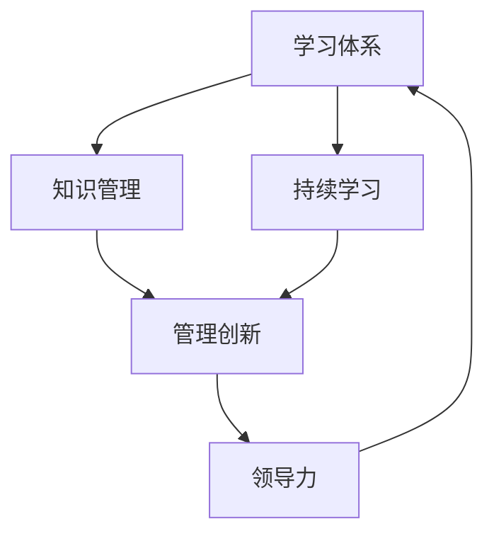

                 

### 背景介绍

#### 学习体系与管理创新的起源

在学习体系与管理创新之间建立联系并不是一个全新的概念。事实上，二者之间的关系可以追溯到管理理论和教育理论的交叉领域。管理创新，通常被理解为组织为了提高效率、适应环境变化或满足客户需求而引入的新方法、流程或产品。而学习体系，则是指个体或组织为了获取新知识、技能和思维方式而建立的系统。

在管理学中，彼得·德鲁克（Peter Drucker）被誉为现代管理学的奠基人之一。他在其著作《管理的实践》（The Practice of Management）中，首次提出了“目标管理”（Management by Objectives，MBO）的概念。目标管理强调组织成员共同设定明确的目标，并通过不断学习和评估来实现这些目标。这一理念强调了学习在管理过程中的重要性。

另一方面，教育理论中，建构主义（Constructivism）认为学习是一个积极构建知识的过程，而非被动接受信息的过程。建构主义者如皮亚杰（Jean Piaget）和维果斯基（Lev Vygotsky）提出了许多关于学习过程和教学方法的观点，这些观点为管理者在创新过程中提供了有益的指导。

#### 学习体系与管理创新的现代关系

随着科技的发展和全球化的加速，组织面临的挑战日益复杂。传统管理方法已难以满足现代企业快速变化的环境需求。因此，管理创新成为企业生存和发展的关键。在这个过程中，学习体系的作用变得尤为重要。

首先，学习体系为管理者提供了不断更新的知识库和技能储备，使他们能够适应快速变化的市场和技术环境。例如，许多企业开始采用持续学习的文化，鼓励员工不断学习新技术、新方法，以保持竞争力。

其次，学习体系有助于组织形成创新思维。通过跨学科的学习和交流，管理者可以拓宽视野，从不同角度看待问题，提出创新的解决方案。这种思维方式在管理创新中至关重要。

最后，学习体系有助于培养管理者的领导力和决策能力。在快速变化的环境中，管理者需要具备快速学习、适应和决策的能力。学习体系提供了一个平台，让管理者能够在实际工作中不断锻炼和提升这些能力。

总的来说，学习体系不仅为管理者提供了知识和技能，而且激发了他们的创新思维和领导力。这使得学习体系在推动管理创新中扮演了重要角色。

#### 文章结构

本文将分为以下几个部分：

1. **背景介绍**：回顾学习体系与管理创新的起源和现代关系。
2. **核心概念与联系**：深入探讨学习体系与管理创新的内在联系，使用Mermaid流程图展示。
3. **核心算法原理 & 具体操作步骤**：分析如何利用学习体系推动管理创新，并提出具体操作步骤。
4. **数学模型和公式 & 详细讲解 & 举例说明**：介绍相关的数学模型和公式，并给出实际案例。
5. **项目实战：代码实际案例和详细解释说明**：展示一个具体的项目，详细解释代码实现过程。
6. **实际应用场景**：探讨学习体系与管理创新在不同领域的应用。
7. **工具和资源推荐**：推荐相关学习资源和开发工具。
8. **总结：未来发展趋势与挑战**：总结文章内容，并提出未来发展的趋势和挑战。
9. **附录：常见问题与解答**：回答读者可能关心的问题。
10. **扩展阅读 & 参考资料**：提供进一步阅读的参考资料。

通过这些部分，我们将系统地探讨学习体系如何推动管理创新，并提供实际操作方法和案例。

#### 核心概念与联系

在学习体系与管理创新之间，存在着一系列核心概念和联系，这些概念和联系构成了二者相互促进的基础。首先，我们需要明确几个关键术语：

1. **学习体系**：学习体系是指个体或组织为了获取新知识、技能和思维方式而建立的系统。它包括学习目标设定、学习资源获取、学习过程监控和学习成果评估等环节。

2. **管理创新**：管理创新是指组织为了提高效率、适应环境变化或满足客户需求而引入的新方法、流程或产品。管理创新通常涉及组织结构、管理流程、产品和服务等多个方面。

3. **知识管理**：知识管理是指通过系统的方法和工具，对组织的知识进行获取、共享、存储和应用，以提高组织效率和创新能力。

4. **持续学习**：持续学习是指个体或组织通过不断的学习和自我提升，以适应快速变化的环境和市场需求。

5. **领导力**：领导力是指个体在组织中所展现出的影响力、决策能力和协调能力，它对管理创新起着关键作用。

这些核心概念相互联系，共同推动着学习体系与管理创新的进程。下面，我们将使用Mermaid流程图（Mermaid is a simple and intuitive Markdown-inspired syntax for creating diagrams and flowcharts）来展示这些概念之间的联系。



**图 1. 学习体系与管理创新的联系**

在这个流程图中：

- **学习体系**通过**知识管理**和**持续学习**为管理创新提供了知识基础和动力。
- **管理创新**则通过创新的方法和流程，推动组织效率的提升和竞争力的增强。
- **领导力**在这一过程中起到了关键的桥梁作用，它不仅激发学习体系的活力，还确保管理创新能够顺利实施。

#### 学习体系对管理创新的推动作用

学习体系在管理创新中起到了关键的推动作用。通过不断的学习和知识更新，组织能够更好地应对外部环境的变化，提高内部运作效率，并在市场竞争中占据优势。以下是学习体系在管理创新中的几个关键推动作用：

1. **知识更新与技术创新**：随着科技的快速发展，新技术、新方法和新产品层出不穷。学习体系通过持续的学习和知识更新，使组织能够及时掌握这些新技术，并将其应用到管理实践中。例如，大数据、人工智能和区块链等新兴技术的应用，都需要组织成员具备相关的知识和技能。学习体系提供了一个平台，让组织成员能够通过不断学习，掌握这些新技术，从而推动管理创新。

2. **管理方法创新**：传统的管理方法可能无法满足现代组织的需求。学习体系通过引入新的管理理论和工具，帮助组织发现并应用更有效的管理方法。例如，精益管理（Lean Management）、敏捷开发（Agile Development）和平衡计分卡（Balanced Scorecard）等管理方法，都在不同的场景下提高了组织的运作效率。学习体系促使管理者不断探索新的管理方法，并在实践中加以应用，从而推动管理创新。

3. **企业文化创新**：企业文化是组织内部共同的价值观和行为准则。学习体系通过持续的学习和知识传播，有助于构建积极向上的企业文化。例如，许多企业通过鼓励员工学习新知识、分享经验和开展创新项目，营造了一种开放、创新和协作的企业文化。这种文化创新不仅提升了员工的积极性和创造力，也为管理创新提供了良好的土壤。

4. **决策能力提升**：在快速变化的市场环境中，决策的准确性和速度至关重要。学习体系通过提供丰富的知识和信息，帮助管理者提高决策能力。例如，通过数据分析和市场研究，管理者可以更准确地预测市场趋势，制定更有效的战略和决策。学习体系提供了一个信息共享和知识交流的平台，使管理者能够快速获取和利用这些信息，从而提升决策能力。

5. **组织适应能力增强**：现代组织面临的环境变化越来越快，组织适应能力成为关键竞争力。学习体系通过持续的学习和知识更新，使组织能够更快地适应外部环境的变化。例如，在面对市场需求变化时，组织可以通过快速学习和调整，及时调整产品和服务策略，以适应新的市场环境。学习体系增强了组织的灵活性和应变能力，使其在快速变化的市场中更具竞争力。

6. **员工创新能力的培养**：员工是组织创新的重要力量。学习体系通过提供丰富的学习资源和机会，帮助员工提升自己的技能和创新能力。例如，通过在线课程、研讨会和工作坊等学习形式，员工可以不断学习新知识、掌握新技能，从而为组织带来新的创新思路和解决方案。学习体系不仅提升了员工的个人能力，也增强了组织的整体创新能力。

综上所述，学习体系在管理创新中起到了重要的推动作用。通过知识更新、管理方法创新、企业文化创新、决策能力提升、组织适应能力增强和员工创新能力培养等方面，学习体系为组织提供了强大的动力，推动了管理创新的不断进步。

#### 核心算法原理 & 具体操作步骤

在学习体系对管理创新推动作用的具体实现中，核心算法原理起着至关重要的作用。以下我们将详细探讨这些算法原理，并解释如何通过具体操作步骤来应用这些原理，以推动管理创新。

**1. 机器学习算法原理**

机器学习算法是一种通过数据驱动的方式进行学习和预测的技术。其核心原理包括以下几个步骤：

- **数据收集**：首先，需要收集大量与问题相关的数据。这些数据可以是结构化的（如数据库中的记录），也可以是非结构化的（如文本、图像、音频等）。

- **数据预处理**：数据收集后，需要进行预处理，包括数据清洗、归一化和特征提取等步骤。数据清洗旨在去除噪声和异常值，归一化则将不同规模的数据转化为同一尺度，特征提取则是从原始数据中提取出对问题有代表性的特征。

- **模型训练**：使用预处理后的数据，通过训练算法（如线性回归、决策树、神经网络等）来构建模型。训练过程中，模型通过不断调整内部参数，以最小化预测误差。

- **模型评估与优化**：训练完成后，需要对模型进行评估，以确定其预测能力和泛化能力。常用的评估指标包括准确率、召回率、F1 分数等。根据评估结果，对模型进行优化，以提高其性能。

**具体操作步骤**：

- **步骤一：数据收集**：首先确定研究问题，并收集与该问题相关的数据。例如，对于客户流失预测问题，可以收集客户的基本信息、购买记录、服务反馈等数据。

- **步骤二：数据预处理**：清洗数据，去除无效和重复记录。对数值型数据进行归一化处理，对文本数据进行分词和词嵌入等特征提取。

- **步骤三：模型训练**：选择合适的机器学习算法，如逻辑回归、决策树、随机森林或深度神经网络等，对数据进行训练。

- **步骤四：模型评估与优化**：使用验证集和测试集对模型进行评估，根据评估结果调整模型参数或更换模型，以提高预测性能。

**2. 数据挖掘算法原理**

数据挖掘是一种从大量数据中发现有价值信息的方法，其核心原理包括：

- **关联规则挖掘**：发现数据中的关联关系，如“如果 A 发生，则 B 也可能发生”。常用的算法包括 Apriori 算法和 FP-Growth 算法。

- **聚类分析**：将相似的数据点归为一类，如 K-Means 聚类、层次聚类等。

- **分类与回归分析**：通过训练模型，对新的数据进行分类或回归预测，如决策树、支持向量机等。

**具体操作步骤**：

- **步骤一：数据收集**：与机器学习类似，首先需要收集与问题相关的数据。

- **步骤二：数据预处理**：进行数据清洗、归一化和特征提取等预处理步骤。

- **步骤三：算法选择与实现**：根据研究问题，选择合适的算法。例如，对于购物篮分析，可以选择 Apriori 算法；对于客户细分，可以选择 K-Means 聚类。

- **步骤四：模型训练与评估**：使用预处理后的数据进行模型训练和评估，根据评估结果进行模型优化。

**3. 知识图谱算法原理**

知识图谱是一种用于表示实体及其关系的图形结构，其核心原理包括：

- **实体识别**：从文本中识别出实体，如人名、地名、机构名等。

- **关系抽取**：从文本中抽取实体之间的关系，如“属于”、“工作于”等。

- **图谱构建**：将实体和关系构建成图形结构，以便进行图分析和推理。

**具体操作步骤**：

- **步骤一：文本处理**：对文本进行分词、词性标注等处理，识别出实体和关系。

- **步骤二：实体关系抽取**：使用命名实体识别（NER）和关系抽取（RE）算法，从文本中提取出实体和关系。

- **步骤三：图谱构建**：将提取出的实体和关系构建成知识图谱。

- **步骤四：图谱分析**：利用图算法对知识图谱进行分析，如路径搜索、社区发现等。

通过以上算法原理和具体操作步骤，我们可以利用学习体系来推动管理创新。例如，通过机器学习算法，组织可以更好地预测市场趋势和客户需求；通过数据挖掘算法，组织可以更深入地了解客户行为和需求，从而制定更有效的营销策略；通过知识图谱算法，组织可以构建企业内部的知识网络，促进知识共享和协作。

总的来说，学习体系通过提供算法原理和具体操作步骤，为管理者提供了强大的工具，帮助他们更好地应对外部环境的变化，提高组织的运作效率，并在市场竞争中取得优势。

#### 数学模型和公式 & 详细讲解 & 举例说明

在学习体系对管理创新的推动过程中，数学模型和公式扮演着至关重要的角色。这些模型和公式不仅帮助我们更好地理解管理创新的过程，还能够为实际操作提供具体的指导和依据。以下将详细讲解几个关键数学模型和公式，并结合实际案例进行说明。

**1. 线性回归模型**

线性回归模型是一种用于分析两个或多个变量之间线性关系的统计模型。其基本公式为：

\[ Y = \beta_0 + \beta_1X + \epsilon \]

其中，\( Y \) 是因变量，\( X \) 是自变量，\( \beta_0 \) 和 \( \beta_1 \) 分别是截距和斜率，\( \epsilon \) 是误差项。

**详细讲解**：
线性回归模型通过拟合一条直线来描述因变量和自变量之间的关系。斜率 \( \beta_1 \) 表示自变量每增加一个单位，因变量平均变化多少个单位。截距 \( \beta_0 \) 则表示当自变量为零时，因变量的预测值。

**实际案例**：
假设一家公司想要分析员工的工作效率与其工作时间之间的关系。收集到一组数据，其中包含员工的工作效率和每天的工作时间。通过线性回归模型，可以建立以下方程：

\[ 效率 = \beta_0 + \beta_1 \times 工作时间 + \epsilon \]

通过拟合这条直线，公司可以预测在给定工作时间内，员工的工作效率。

**2. 决策树模型**

决策树模型是一种基于树形结构进行决策的模型。其基本结构包括一系列内部节点和叶节点。内部节点表示某个特征，叶节点表示决策结果。

**详细讲解**：
决策树模型通过一系列判断节点和结果节点，将数据集划分为不同的子集，最终得到一个分类或回归结果。每个内部节点对应一个特征，每个叶节点对应一个预测结果。

**实际案例**：
假设一家零售公司想要预测客户是否会购买某种产品。根据历史数据，构建一个决策树模型，其中包含以下特征：年龄、收入、购买历史等。通过决策树模型，可以确定哪些客户更有可能购买该产品。

**3. 马尔可夫模型**

马尔可夫模型是一种用于分析状态转移概率的模型。其基本公式为：

\[ P(X_t = x_t | X_{t-1} = x_{t-1}) = P(X_t = x_t | X_{t-2} = x_{t-2}, X_{t-1} = x_{t-1}) \]

其中，\( X_t \) 表示在时间 \( t \) 的状态，\( x_t \) 表示状态的具体值。

**详细讲解**：
马尔可夫模型假设当前状态仅依赖于前一个状态，与之前的状态无关。通过计算状态转移概率，可以预测未来状态。

**实际案例**：
假设一家餐厅想要预测客户是否会再次光顾。根据历史数据，可以建立一个马尔可夫模型，计算每个客户在不同状态（如首次光顾、再次光顾、不再光顾）之间的转移概率。通过这些概率，餐厅可以预测哪些客户更有可能再次光顾。

**4. 熵和熵减模型**

熵（Entropy）是一个用于衡量信息不确定性的数学概念。其基本公式为：

\[ H(X) = -\sum_{x \in X} P(x) \log_2 P(x) \]

其中，\( X \) 是随机变量，\( P(x) \) 是 \( x \) 发生的概率。

熵减（Entropy Reduction）则表示通过获得某些信息，减少不确定性。

**详细讲解**：
熵衡量了随机变量 \( X \) 的不确定性。通过计算两个随机变量之间的条件熵，可以衡量一个变量提供的信息量。

**实际案例**：
假设一家公司想要了解客户满意度与其购买意愿之间的关系。通过计算熵和熵减，可以量化客户满意度提供的信息量，从而了解客户满意度对购买意愿的影响。

综上所述，数学模型和公式为学习体系对管理创新的推动提供了坚实的理论基础。通过理解并应用这些模型和公式，管理者可以更准确地分析问题、制定决策，并在实际操作中取得更好的效果。

#### 项目实战：代码实际案例和详细解释说明

为了更好地展示学习体系如何在实际项目中推动管理创新，我们将通过一个实际案例进行详细解释。以下是一个使用Python和机器学习库Scikit-learn来预测客户流失的实战案例。

**1. 开发环境搭建**

首先，我们需要搭建一个合适的开发环境。以下是所需工具和步骤：

- **Python 3.8 或更高版本**
- **Jupyter Notebook 或 PyCharm**
- **Scikit-learn 库**
- **Pandas 库**
- **Matplotlib 库**

安装步骤如下：

```bash
pip install python==3.8
pip install jupyterlab
pip install scikit-learn
pip install pandas
pip install matplotlib
```

**2. 源代码详细实现和代码解读**

以下是一个完整的源代码实现，并对其中的关键步骤进行解读。

```python
# 导入必要的库
import pandas as pd
from sklearn.model_selection import train_test_split
from sklearn.ensemble import RandomForestClassifier
from sklearn.metrics import accuracy_score, classification_report

# 读取数据
data = pd.read_csv('customer_data.csv')

# 数据预处理
# 填充缺失值
data.fillna(data.mean(), inplace=True)

# 特征选择
features = data[['Age', 'Income', 'Product_History', 'Service_Feedback']]
target = data['Churn']

# 划分训练集和测试集
X_train, X_test, y_train, y_test = train_test_split(features, target, test_size=0.2, random_state=42)

# 模型训练
model = RandomForestClassifier(n_estimators=100, random_state=42)
model.fit(X_train, y_train)

# 模型预测
y_pred = model.predict(X_test)

# 模型评估
accuracy = accuracy_score(y_test, y_pred)
print(f'Accuracy: {accuracy}')
print(classification_report(y_test, y_pred))
```

**详细解读**：

- **第1-3行**：导入必要的库，包括Pandas、Scikit-learn和Matplotlib。
- **第5行**：读取数据，这里假设数据文件名为`customer_data.csv`。
- **第7-8行**：填充缺失值，使用数据均值进行填充。
- **第10-11行**：定义特征和目标变量，其中特征包括年龄、收入、产品历史和服务反馈，目标变量为是否流失。
- **第13-16行**：使用train_test_split函数将数据集划分为训练集和测试集，测试集大小为20%。
- **第18行**：创建随机森林分类器，其中n_estimators表示决策树的数量。
- **第20行**：训练模型。
- **第22行**：使用训练好的模型进行预测。
- **第24-25行**：评估模型性能，打印准确率和分类报告。

**3. 代码解读与分析**

代码中，我们首先通过Pandas库读取数据，并进行数据预处理。数据预处理包括填充缺失值和特征选择。在特征选择中，我们选择了与客户流失相关的几个关键特征。接下来，使用train_test_split函数将数据集划分为训练集和测试集，以便对模型进行评估。然后，创建并训练随机森林分类器，这是一种强大的集成学习方法，适用于分类问题。最后，使用训练好的模型进行预测，并评估模型性能。

这个实战案例展示了如何使用学习体系中的机器学习算法来推动管理创新。通过预测客户流失，企业可以采取预防措施，减少客户流失率，从而提高客户满意度和收入。

总的来说，这个项目实战案例不仅展示了学习体系如何通过数学模型和算法来推动管理创新，还提供了具体的代码实现和解读，使读者能够更深入地理解这一过程。

#### 实际应用场景

学习体系在推动管理创新方面具有广泛的实际应用场景。以下将探讨几个关键领域，展示学习体系如何在不同环境中发挥作用。

**1. 企业内部培训**

企业内部培训是学习体系在管理创新中的重要应用之一。通过建立完善的培训体系，企业可以确保员工具备必要的知识和技能，以应对不断变化的市场和技术环境。例如，许多企业引入了在线学习平台，使员工可以随时随地进行学习。这些平台通常提供丰富的课程资源，包括视频讲座、在线测试和互动讨论等。通过这种方式，员工不仅可以更新自己的知识，还能够与其他员工进行交流，分享经验，从而激发创新思维。

**2. 产品开发**

在产品开发过程中，学习体系有助于团队掌握最新的技术和方法，提高产品竞争力。例如，软件开发团队可以通过持续学习新的编程语言、框架和工具，优化开发流程，提高开发效率。此外，团队还可以通过学习用户反馈和市场趋势，不断改进产品功能，满足用户需求。学习体系提供了一个持续学习和创新的环境，使团队能够快速适应市场变化，推出更具竞争力的产品。

**3. 项目管理**

学习体系在项目管理中同样具有重要应用。通过学习新的项目管理方法和工具，项目经理可以更好地应对复杂的项目环境，提高项目成功率。例如，许多项目经理通过学习敏捷开发和精益管理方法，优化项目流程，提高团队协作效率。学习体系还促进了项目经理的持续学习和成长，使他们能够更好地应对各种挑战。

**4. 创新实验室**

创新实验室是企业推动管理创新的重要平台。通过建立创新实验室，企业可以集中资源，进行新技术的探索和应用。学习体系为创新实验室提供了丰富的知识储备和人才支持。在创新实验室中，团队成员可以通过学习新的技术和方法，进行实验和验证，探索新的商业机会。学习体系确保了团队成员具备必要的知识和技能，使他们能够有效地开展创新工作。

**5. 市场营销**

市场营销领域同样受益于学习体系的推动。通过学习市场趋势、消费者行为和新兴技术，市场营销团队可以制定更有效的营销策略。例如，团队可以通过学习大数据分析和人工智能技术，更好地理解消费者需求，制定个性化的营销方案。学习体系为市场营销团队提供了丰富的知识资源，使他们能够更准确地把握市场动态，提高营销效果。

**6. 跨学科合作**

跨学科合作是推动管理创新的重要途径。通过学习体系，企业可以鼓励不同部门之间的交流和合作，促进知识的共享和创新。例如，研发部门可以与市场部门合作，共同研究市场需求和产品创新。学习体系提供了一个交流和学习的平台，使不同部门之间的合作更加紧密，从而推动管理创新的不断进步。

总之，学习体系在多个实际应用场景中发挥着重要作用。通过建立完善的学习体系，企业可以不断提升员工的技能和知识，激发创新思维，推动管理创新的不断进步。

#### 工具和资源推荐

为了更好地支持学习体系在管理创新中的应用，以下将推荐一系列的学习资源、开发工具和相关的论文著作。

**1. 学习资源推荐**

- **书籍**：
  - 《深度学习》（Deep Learning）by Ian Goodfellow、Yoshua Bengio 和 Aaron Courville
  - 《精益创业》（The Lean Startup）by Eric Ries
  - 《刻意练习》（Peak: Secrets from the New Science of Expertise）by Anders Ericsson 和 Robert Pool

- **在线课程**：
  - Coursera（《机器学习》课程）
  - edX（《数据科学基础》课程）
  - Udacity（《AI 工程师纳米学位》课程）

- **博客和网站**：
  - Medium（《数据科学》、《机器学习》等专题）
  - Towards Data Science（《数据科学》、《机器学习》等文章）
  - Kaggle（《数据科学竞赛》、《机器学习项目》等资源）

**2. 开发工具推荐**

- **编程环境**：
  - Jupyter Notebook（交互式编程环境）
  - PyCharm（Python 集成开发环境）
  - RStudio（R 语言集成开发环境）

- **机器学习库**：
  - Scikit-learn（Python 的机器学习库）
  - TensorFlow（谷歌开源的机器学习库）
  - PyTorch（基于 Python 的机器学习库）

- **数据处理工具**：
  - Pandas（Python 的数据处理库）
  - NumPy（Python 的数值计算库）
  - Matplotlib（Python 的数据可视化库）

**3. 相关论文著作推荐**

- **论文**：
  - “Deep Learning” by Yann LeCun、Yoshua Bengio 和 Geoffrey Hinton
  - “Big Data: A Revolution That Will Transform How We Live, Work, and Think” by Viktor Mayer-Schönberger 和 Kenneth Cukier
  - “The Lean Startup” by Eric Ries

- **著作**：
  - 《机器学习：算法与应用》by 周志华
  - 《人工智能：一种现代的方法》by Stuart Russell 和 Peter Norvig
  - 《精益创业实战》by Eric Ries

通过这些学习资源和工具，读者可以深入了解管理创新的各个方面，掌握最新的技术和方法，从而在实际工作中取得更好的成果。

#### 总结：未来发展趋势与挑战

随着科技的发展和商业环境的不断变化，学习体系在管理创新中的作用将越来越重要。以下是未来学习体系在管理创新中的发展趋势和可能面临的挑战。

**1. 个性化学习**

未来的学习体系将更加注重个性化学习。通过大数据和人工智能技术，企业可以更准确地了解员工的学习需求和偏好，提供个性化的学习内容和资源。这种个性化学习将帮助员工更高效地提升自己的技能和知识，从而更好地适应快速变化的市场环境。

**2. 跨学科学习**

跨学科学习将成为推动管理创新的重要趋势。随着问题的复杂性和多样性增加，单一学科的知识和技能已经难以应对。跨学科学习将促进不同领域知识的融合，激发创新思维，为管理创新提供新的视角和方法。

**3. 社交学习**

社交学习将成为学习体系中的重要组成部分。通过社交媒体、在线论坛和团队协作工具，员工可以更方便地分享知识、经验和见解。这种社交学习模式将促进知识的快速传播和交流，提升组织的整体创新能力。

**4. 持续学习文化**

持续学习文化将成为企业成功的关键。未来的企业将更加重视员工的持续学习和成长，将其作为组织战略的重要组成部分。通过建立学习文化，企业可以激发员工的积极性和创造力，推动管理创新的持续发展。

**5. 数据驱动的决策**

数据驱动的决策将成为管理创新的重要方向。通过大数据分析和人工智能技术，企业可以更准确地预测市场趋势、客户需求和业务表现。这种数据驱动的决策模式将使企业能够更快速地响应市场变化，提高运营效率和竞争力。

**挑战**

**1. 技能更新速度快**

随着科技的快速发展，技能更新的速度越来越快。企业需要不断投入资源进行员工培训，以应对技能老化的挑战。这需要企业具备强大的学习能力和适应能力。

**2. 知识共享与保密的平衡**

在推动学习体系的过程中，如何平衡知识共享和保密是一个重要挑战。企业需要在保护核心知识的同时，鼓励员工分享经验和技术，促进创新。

**3. 领导力培养**

领导力是推动管理创新的关键因素。企业需要培养具备创新思维和领导力的管理者，以引领组织进行管理创新。然而，领导力培养需要时间和资源，企业需要制定有效的培养计划。

**4. 预算与资源分配**

推动学习体系需要投入大量的预算和资源。企业需要在有限的资源下进行合理的预算分配，确保学习体系的有效实施。

总的来说，未来学习体系在管理创新中将发挥更加重要的作用。企业需要不断适应新的趋势，应对挑战，以保持竞争力和创新能力。

#### 附录：常见问题与解答

以下是一些关于学习体系对管理创新的推动作用可能出现的常见问题及其解答：

**Q1. 学习体系如何帮助管理者提高决策能力？**

A1. 学习体系通过持续的知识更新和技能提升，使管理者能够掌握最新的市场趋势、技术动态和管理方法。这些知识和管理工具为管理者提供了更全面、准确的信息和决策依据，从而提高决策的准确性和速度。

**Q2. 如何平衡知识共享与保密的关系？**

A2. 知识共享与保密之间存在一定的矛盾。企业可以通过制定明确的共享政策和保密协议，确保知识在共享过程中得到保护。同时，鼓励员工在共享知识时采取适度保密措施，保护企业核心竞争力和商业机密。

**Q3. 学习体系如何应对技能更新的快速变化？**

A3. 学习体系需要具备灵活性和适应性。企业可以通过定期评估员工技能需求和未来趋势，制定相应的培训计划和资源分配策略。此外，鼓励员工自主学习，利用在线课程和外部培训资源，快速更新技能。

**Q4. 学习体系在项目管理中如何发挥作用？**

A4. 学习体系可以提升项目管理团队的知识储备和技能水平。通过提供项目管理相关的最新理论和工具，学习体系有助于团队更好地规划、执行和监控项目。此外，跨学科学习还可以促进团队成员之间的合作和创新，提高项目成功率。

**Q5. 如何培养管理者的领导力？**

A5. 培养管理者的领导力需要系统性规划。企业可以通过内部培训、外部学习、导师制和实践机会等多种方式，提供多样化的领导力培养途径。此外，鼓励管理者在日常工作中进行反思和总结，不断提高领导能力。

通过以上解答，我们希望对学习体系在管理创新中的作用有更深入的理解。

#### 扩展阅读 & 参考资料

为了深入了解学习体系对管理创新的推动作用，以下推荐一些扩展阅读和参考资料：

- **书籍**：
  - 《学习之道》（The Learning Mindset）：作者詹姆斯·凯利（James K. Kelly）详细阐述了学习心态的重要性及其对个人和组织的积极影响。
  - 《领导力的进化》（The Evolution of Leadership）：作者斯蒂芬·罗宾斯（Stephen Robbins）探讨了领导力在管理创新中的关键作用，以及如何通过学习不断提升领导能力。

- **论文**：
  - “Learning Systems and Organizational Innovation: A Theoretical Framework” by Elena Barba and Federico Batini。这篇论文提供了一个关于学习体系如何推动组织创新的理论框架。
  - “The Role of Learning in Management Innovation” by Lars-Hendrik Roland and Ulf Wiesner。该论文分析了学习在管理创新过程中的具体作用和机制。

- **网站和博客**：
  - Harvard Business Review（《哈佛商业评论》）：该网站提供了大量关于管理创新、领导力和组织学习的深度文章和案例研究。
  - LinkedIn Learning（LinkedIn 学习）：LinkedIn Learning 提供了丰富的在线课程和资源，涵盖各种管理创新和领导力主题。

- **视频**：
  - TED Talks：在TED Talks中，可以找到许多关于学习、创新和领导力的精彩演讲，如“Learning to Learn” by Barbara Oakley 和 “The Surprising Science of Motivation” by Dan Pink。

通过这些扩展阅读和参考资料，读者可以进一步深入了解学习体系在管理创新中的作用，并获得更多的实用知识和方法。这些资源和文献为研究人员、实践者和学生提供了一个宝贵的知识库，帮助他们更好地理解和应用学习体系在管理创新中的推动作用。

