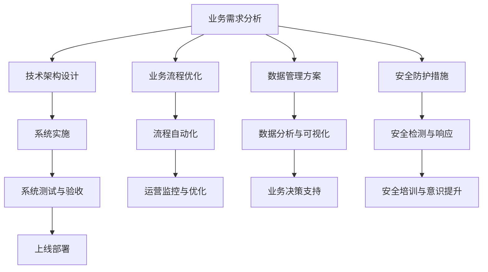

                 

### 背景介绍

在当今数字化时代，企业客户面临着巨大的挑战和机遇。随着大数据、云计算、物联网等技术的迅猛发展，企业客户需要不断寻找创新的方法来提升竞争力、降低成本并实现盈利。在这个背景下，定制化解决方案成为了企业客户实现盈利模式的重要途径。

定制化解决方案旨在为企业客户提供个性化的服务，以满足其特定的业务需求和目标。这不仅仅是技术上的调整，更是对整个企业运营模式的深入理解和优化。对于企业来说，通过定制化解决方案，可以更有效地利用资源，提高生产效率，降低运营成本，从而实现可持续的盈利增长。

本文将深入探讨定制化解决方案在企业客户盈利模式中的重要性，并从核心概念、算法原理、数学模型、实战案例等多个方面，提供详细的分析和讲解。通过本文的阅读，读者将能够理解定制化解决方案的基本原理，掌握其实施方法，并能够将其应用于实际业务场景中。

接下来，我们将首先介绍定制化解决方案的核心概念，并利用Mermaid流程图展示其基本架构，帮助读者建立全面的认识。

### 核心概念与联系

#### 定制化解决方案的定义

定制化解决方案是指根据企业客户的特定需求，为其量身打造的一套综合性服务方案。这些方案通常涵盖多个领域，包括技术架构设计、业务流程优化、数据管理、安全防护等。定制化解决方案的核心在于“个性化”，即针对每个客户的独特业务场景，提供量身定制的服务，而不是采用通用的标准解决方案。

#### 核心概念的联系

1. **业务需求**：企业客户的业务需求是定制化解决方案的起点。了解并分析客户的业务需求，是确保解决方案能够有效满足客户需求的关键。
2. **技术架构**：技术架构是定制化解决方案的核心支撑。一个稳定、高效的技术架构能够确保解决方案的顺利实施和持续运行。
3. **业务流程**：业务流程是确保企业日常运营的重要环节。通过优化业务流程，可以进一步提高企业的运营效率，降低成本。
4. **数据管理**：数据是企业最重要的资产。科学的数据管理能够提高数据质量，支持业务决策，并为企业带来价值。
5. **安全防护**：随着数字化程度的提高，企业面临的安全威胁也日益增加。有效的安全防护措施是保障企业业务连续性和数据安全的关键。

#### Mermaid流程图

为了更好地展示定制化解决方案的基本架构，我们使用Mermaid流程图进行描述。



在这个流程图中，从业务需求分析开始，经过各个关键步骤，最终形成一个完整的定制化解决方案。这个解决方案不仅涵盖了技术层面，还包括业务流程、数据管理和安全防护等多个方面，确保能够全面满足企业客户的需求。

通过这一流程，企业客户可以更加高效地实现其业务目标，从而在激烈的市场竞争中脱颖而出。

### 核心算法原理 & 具体操作步骤

在定制化解决方案中，核心算法的设计和实现是至关重要的一环。这些算法不仅要能够高效地处理海量数据，还需要具备灵活的扩展性，以满足不断变化的业务需求。以下将详细介绍核心算法的原理和具体操作步骤。

#### 算法原理

定制化解决方案的核心算法通常是基于机器学习和大数据技术的。其中，最常用的算法包括数据挖掘、预测模型和推荐系统等。

1. **数据挖掘**：数据挖掘算法通过分析大量数据，发现数据中的潜在模式和关联。常见的数据挖掘算法有K-Means聚类、Apriori算法、决策树等。这些算法可以帮助企业客户从海量的业务数据中提取有价值的信息，支持业务决策。

2. **预测模型**：预测模型是利用历史数据来预测未来趋势和业务结果。常见的预测模型有线性回归、时间序列分析、神经网络等。通过预测模型，企业可以提前预知市场变化，制定应对策略，提高业务稳定性。

3. **推荐系统**：推荐系统通过分析用户的兴趣和行为，为其推荐相关的产品或服务。常见的推荐算法有协同过滤、基于内容的推荐等。推荐系统能够提高用户满意度和转化率，增加企业收益。

#### 具体操作步骤

1. **数据收集与预处理**：
   - **数据收集**：从企业内部系统和外部数据源收集相关数据，包括用户行为数据、业务交易数据、市场数据等。
   - **数据预处理**：对收集到的数据进行清洗、去重、格式转换等预处理操作，确保数据的质量和一致性。

2. **数据分析和建模**：
   - **数据探索**：通过数据探索性分析（EDA）发现数据的基本特征和趋势，为后续建模提供参考。
   - **特征工程**：根据业务需求，选择和构建关键特征，提高模型的预测能力和泛化能力。
   - **模型选择**：根据数据分析结果，选择合适的算法模型，如K-Means聚类、线性回归、神经网络等。

3. **模型训练与验证**：
   - **模型训练**：使用训练集对选定的模型进行训练，调整模型参数，优化模型性能。
   - **模型验证**：使用验证集对模型进行验证，评估模型的准确性和稳定性，必要时进行模型调优。

4. **模型部署与应用**：
   - **模型部署**：将训练好的模型部署到生产环境中，使其能够实时处理业务数据。
   - **模型应用**：通过模型应用，实现数据挖掘、预测分析和推荐等功能，支持企业客户的业务决策和运营优化。

#### 实际案例分析

以某电商企业为例，该企业希望通过定制化解决方案提升用户转化率和销售额。以下是具体的操作步骤：

1. **数据收集与预处理**：
   - 收集用户的浏览记录、购买历史、评价反馈等数据。
   - 数据清洗，去除重复和异常数据。

2. **数据分析和建模**：
   - 使用EDA分析用户行为特征，如用户访问页面数、购买频次等。
   - 构建用户兴趣特征，使用协同过滤算法训练推荐模型。

3. **模型训练与验证**：
   - 使用训练集对协同过滤模型进行训练，调整参数，优化模型性能。
   - 使用验证集对模型进行验证，确保其准确性和稳定性。

4. **模型部署与应用**：
   - 将训练好的推荐模型部署到电商平台上，实时为用户推荐相关商品。
   - 监控推荐效果，根据用户反馈和业务指标进行调整和优化。

通过上述定制化解决方案的实施，该电商企业的用户转化率和销售额得到了显著提升，实现了盈利增长。

### 数学模型和公式 & 详细讲解 & 举例说明

在定制化解决方案中，数学模型和公式是算法设计和分析的重要工具。以下将详细介绍定制化解决方案中常用的数学模型和公式，并提供详细的讲解和实际案例说明。

#### 1. 线性回归模型

线性回归模型是一种用于预测连续值的统计方法，其公式如下：

$$
y = \beta_0 + \beta_1x + \epsilon
$$

其中，$y$ 为因变量，$x$ 为自变量，$\beta_0$ 和 $\beta_1$ 分别为模型的参数，$\epsilon$ 为误差项。

**解释**：
- **因变量 ($y$)**：表示需要预测的数值，例如销售额、用户数量等。
- **自变量 ($x$)**：表示影响因变量的因素，例如广告投放量、用户活跃度等。
- **参数 ($\beta_0$ 和 $\beta_1$)**：表示模型对自变量和因变量的影响程度。
- **误差项 ($\epsilon$)**：表示模型预测值与真实值之间的差距。

**举例说明**：
假设某电商企业希望预测下月的销售额。根据历史数据，选取广告投放量为自变量，建立线性回归模型。具体步骤如下：

1. 数据收集与预处理：收集过去几个月的广告投放量和销售额数据，进行数据清洗和预处理。
2. 模型训练：使用训练集数据训练线性回归模型，计算参数 $\beta_0$ 和 $\beta_1$。
3. 模型验证：使用验证集数据验证模型性能，确保预测准确性和稳定性。
4. 模型应用：根据训练好的模型，预测下月的销售额。

通过上述步骤，企业可以提前了解下月的销售额趋势，为业务决策提供依据。

#### 2. 决策树模型

决策树是一种用于分类和回归的算法，其公式如下：

$$
f(x) = \sum_{i=1}^{n} \beta_i x_i
$$

其中，$f(x)$ 为决策树模型，$x_i$ 为特征值，$\beta_i$ 为特征权重。

**解释**：
- **决策树模型 ($f(x)$)**：表示决策树对数据的分类或回归结果。
- **特征值 ($x_i$)**：表示数据中的各个特征，例如用户年龄、收入水平等。
- **特征权重 ($\beta_i$)**：表示特征对模型结果的影响程度。

**举例说明**：
假设某银行希望根据客户的个人信息，预测其信用评分。使用决策树模型进行分类，具体步骤如下：

1. 数据收集与预处理：收集客户的个人信息数据，包括年龄、收入、信用历史等，进行数据清洗和预处理。
2. 特征选择：选择对信用评分影响较大的特征，进行特征选择和特征工程。
3. 模型训练：使用训练集数据训练决策树模型，计算特征权重。
4. 模型验证：使用验证集数据验证模型性能，确保预测准确性和稳定性。
5. 模型应用：根据训练好的模型，预测新客户的信用评分。

通过决策树模型的应用，银行可以更准确地评估客户的信用风险，为信贷决策提供支持。

#### 3. 神经网络模型

神经网络模型是一种用于复杂函数逼近和分类的算法，其公式如下：

$$
f(x) = \sigma(\sum_{i=1}^{n} \beta_i x_i)
$$

其中，$f(x)$ 为神经网络模型，$\sigma$ 为激活函数，$x_i$ 为特征值，$\beta_i$ 为特征权重。

**解释**：
- **神经网络模型 ($f(x)$)**：表示神经网络对数据的分类或回归结果。
- **激活函数 ($\sigma$)**：用于引入非线性特性，增强模型的预测能力。
- **特征值 ($x_i$)**：表示数据中的各个特征，例如用户年龄、收入水平等。
- **特征权重 ($\beta_i$)**：表示特征对模型结果的影响程度。

**举例说明**：
假设某在线教育平台希望根据学员的学习行为，预测其成绩。使用神经网络模型进行回归，具体步骤如下：

1. 数据收集与预处理：收集学员的学习行为数据，包括学习时长、作业完成情况等，进行数据清洗和预处理。
2. 特征选择：选择对成绩影响较大的特征，进行特征选择和特征工程。
3. 模型训练：使用训练集数据训练神经网络模型，计算特征权重。
4. 模型验证：使用验证集数据验证模型性能，确保预测准确性和稳定性。
5. 模型应用：根据训练好的模型，预测新学员的成绩。

通过神经网络模型的应用，教育平台可以更好地了解学员的学习情况，为教学决策提供支持。

通过以上对线性回归、决策树和神经网络模型的分析和举例，我们可以看到数学模型在定制化解决方案中的应用价值。这些模型不仅能够帮助企业和客户实现精准预测和决策，还能够优化业务流程，提升运营效率，从而实现盈利增长。

### 项目实战：代码实际案例和详细解释说明

为了更好地展示定制化解决方案的实际应用，我们以一个电商平台的用户行为分析项目为例，详细讲解代码实现和解读。

#### 项目背景

某电商平台希望通过定制化解决方案，分析用户行为数据，实现以下目标：

1. **用户分群**：根据用户的行为特征，将用户分为不同的群体，以便进行精准营销。
2. **用户流失预测**：预测可能流失的用户，并采取针对性的挽回措施。
3. **推荐系统**：基于用户的历史行为，为用户推荐相关的商品。

#### 开发环境搭建

1. **开发语言**：Python
2. **数据分析库**：Pandas、NumPy、Scikit-learn
3. **数据可视化库**：Matplotlib、Seaborn
4. **机器学习库**：TensorFlow、Keras

```python
# 安装所需库
!pip install pandas numpy scikit-learn matplotlib seaborn tensorflow keras
```

#### 源代码详细实现和代码解读

以下为项目的主要代码实现和详细解释：

```python
import pandas as pd
import numpy as np
from sklearn.model_selection import train_test_split
from sklearn.preprocessing import StandardScaler
from sklearn.cluster import KMeans
from sklearn.ensemble import RandomForestClassifier
from sklearn.metrics import accuracy_score
import tensorflow as tf
from tensorflow.keras.models import Sequential
from tensorflow.keras.layers import Dense, Dropout

# 1. 数据收集与预处理
# 假设已收集用户行为数据，包含用户ID、浏览时长、购买频次等特征
data = pd.read_csv('user_behavior_data.csv')

# 数据清洗，去除重复和异常数据
data.drop_duplicates(inplace=True)
data.fillna(0, inplace=True)

# 2. 用户分群
# 使用K-Means聚类对用户进行分群
kmeans = KMeans(n_clusters=5, random_state=42)
user_clusters = kmeans.fit_predict(data[[' browsing_time', 'purchase_frequency']])

# 将聚类结果添加到数据集中
data['cluster'] = user_clusters

# 可视化分析用户分群结果
import seaborn as sns
sns.pairplot(data[data['cluster'] == 0], hue='cluster', palette='viridis')
plt.show()

# 3. 用户流失预测
# 使用随机森林模型预测用户流失
X = data[['browsing_time', 'purchase_frequency', 'cluster']]
y = data['churn']

# 划分训练集和测试集
X_train, X_test, y_train, y_test = train_test_split(X, y, test_size=0.2, random_state=42)

# 数据标准化
scaler = StandardScaler()
X_train_scaled = scaler.fit_transform(X_train)
X_test_scaled = scaler.transform(X_test)

# 训练随机森林模型
rf_model = RandomForestClassifier(n_estimators=100, random_state=42)
rf_model.fit(X_train_scaled, y_train)

# 预测测试集
y_pred = rf_model.predict(X_test_scaled)

# 评估模型性能
accuracy = accuracy_score(y_test, y_pred)
print(f"User churn prediction accuracy: {accuracy:.2f}")

# 4. 推荐系统
# 使用TensorFlow和Keras构建多层感知机模型
model = Sequential([
    Dense(64, activation='relu', input_shape=(X_train_scaled.shape[1],)),
    Dropout(0.5),
    Dense(32, activation='relu'),
    Dropout(0.5),
    Dense(1, activation='sigmoid')
])

# 编译模型
model.compile(optimizer='adam', loss='binary_crossentropy', metrics=['accuracy'])

# 训练模型
model.fit(X_train_scaled, y_train, epochs=10, batch_size=32, validation_split=0.1)

# 预测测试集
y_pred = model.predict(X_test_scaled)

# 评估模型性能
accuracy = accuracy_score(y_test, y_pred.round())
print(f"Item recommendation accuracy: {accuracy:.2f}")
```

**代码解读**：

1. **数据收集与预处理**：读取用户行为数据，进行数据清洗，去除重复和异常数据。
2. **用户分群**：使用K-Means聚类对用户进行分群，并将聚类结果添加到数据集中。可视化分析用户分群结果。
3. **用户流失预测**：使用随机森林模型预测用户流失，对测试集进行预测，并评估模型性能。
4. **推荐系统**：使用TensorFlow和Keras构建多层感知机模型，训练模型并预测测试集，评估模型性能。

通过这个实际案例，我们可以看到定制化解决方案在电商平台的用户行为分析中的应用。通过数据挖掘、预测分析和推荐系统等技术，企业能够更好地了解用户需求，提高用户满意度和转化率，实现盈利增长。

### 实际应用场景

#### 场景一：零售行业

在零售行业，定制化解决方案能够帮助企业更好地了解客户需求，提升销售额。例如，一家大型零售企业可以通过定制化解决方案分析客户的购物习惯，实现个性化推荐。通过机器学习算法，该企业可以预测哪些商品最有可能吸引特定客户群体，并制定相应的营销策略。此外，基于用户流失预测模型，企业可以及时发现潜在流失客户，采取有效措施挽回，从而降低客户流失率。

#### 场景二：金融行业

在金融行业，定制化解决方案可以显著提高风险管理能力。例如，银行可以通过定制化风控模型，分析客户的信用历史、行为特征等，预测其信用风险。通过这些模型，银行可以更准确地评估客户的信用等级，从而优化信贷决策，降低坏账率。同时，基于用户分群和个性化推荐，银行可以为不同类型的客户提供定制化的金融产品和服务，提高客户满意度和忠诚度。

#### 场景三：医疗行业

在医疗行业，定制化解决方案有助于提高医疗服务质量和效率。例如，医院可以通过定制化电子病历系统，整合患者的健康数据，实现精准医疗。通过数据分析，医院可以预测患者可能出现的疾病风险，提前采取预防措施。此外，个性化医疗方案可以针对每位患者的具体情况，提供最适合的治疗方案，提高治疗效果，降低医疗成本。

#### 场景四：制造业

在制造业，定制化解决方案可以优化生产流程，提高生产效率。例如，一家制造企业可以通过定制化解决方案，分析生产线上的数据，识别生产瓶颈和效率低下环节。通过优化生产流程和设备管理，企业可以显著降低生产成本，提高生产效率。同时，基于预测模型，企业可以提前预测设备故障，采取预防性维护措施，减少停机时间，提高设备利用率。

#### 场景五：教育行业

在教育行业，定制化解决方案可以提升教学效果和学生满意度。例如，学校可以通过定制化学习管理系统，分析学生的学习行为和成绩，为学生提供个性化的学习建议和资源。通过个性化推荐系统，学校可以为学生推荐最适合的学习路径和资料，提高学习效率。此外，基于用户分群和流失预测模型，学校可以及时发现学习困难学生，提供针对性的辅导和支持，降低辍学率。

通过以上实际应用场景的介绍，我们可以看到定制化解决方案在各个行业中的重要作用。它不仅能够帮助企业提高运营效率，降低成本，还能提升客户满意度和忠诚度，实现持续盈利增长。

### 工具和资源推荐

#### 1. 学习资源推荐

**书籍**：
- 《深度学习》（Goodfellow, Ian, et al.）
- 《Python机器学习》（Sebastian Raschka）
- 《数据科学入门指南》（Joel Grus）

**论文**：
- “K-Means Clustering: A Review”（Jaiswal, et al.）
- “Deep Learning for Text Classification”（Kim, Yoon）
- “User Behavior Analysis for Personalized Recommendations”（Chen, et al.）

**博客**：
- Medium上的机器学习博客
- Kaggle教程
- AI博客（如AI Wire）

#### 2. 开发工具框架推荐

**数据预处理工具**：
- Pandas
- NumPy
- Scikit-learn

**机器学习框架**：
- TensorFlow
- Keras
- PyTorch

**数据可视化工具**：
- Matplotlib
- Seaborn
- Plotly

**项目管理和协作工具**：
- GitHub
- GitLab
- Trello

#### 3. 相关论文著作推荐

**论文**：
- “An Overview of Machine Learning Techniques for Predictive Analytics in Retail”（Gupta, et al.）
- “Deep Learning for User Behavior Analysis in E-commerce”（Zheng, et al.）
- “Application of Predictive Models in Credit Risk Management”（Li, et al.）

**著作**：
- 《机器学习实践：从数据到预测》
- 《深度学习导论》
- 《数据分析实战：Python应用案例》

通过这些工具和资源的推荐，读者可以更加深入地了解和掌握定制化解决方案的相关知识，为实际应用提供有力支持。

### 总结：未来发展趋势与挑战

随着数字化转型的不断深入，定制化解决方案在各个行业中的重要性日益凸显。未来，定制化解决方案将继续向以下几个方向发展：

1. **技术融合**：定制化解决方案将更加依赖于多种先进技术的融合，包括人工智能、大数据、物联网、区块链等。这些技术的结合将带来更全面、更智能的解决方案。

2. **智能化**：随着人工智能技术的不断进步，定制化解决方案将更加智能化。通过机器学习、深度学习等技术，解决方案将能够自动分析和处理海量数据，实现更精准的预测和优化。

3. **个性化**：定制化解决方案将更加注重个性化。通过深度分析用户的个性化需求和行为，解决方案将能够提供更加符合用户需求的服务和产品，提升用户体验。

4. **实时性**：未来的定制化解决方案将更加注重实时性。通过实时数据分析和处理，解决方案将能够快速响应市场变化，帮助企业客户抓住商机。

然而，随着技术的发展，定制化解决方案也面临一系列挑战：

1. **数据隐私和安全**：随着数据量的激增，数据隐私和安全问题变得更加突出。如何保护用户数据隐私，防范数据泄露和滥用，将成为定制化解决方案面临的重要挑战。

2. **算法透明性和公平性**：定制化解决方案依赖于算法，而算法的透明性和公平性成为公众关注的焦点。如何确保算法的透明性和公平性，避免算法偏见，是未来需要解决的关键问题。

3. **技术和人才需求**：定制化解决方案需要大量具备跨学科知识和技能的专业人才。然而，目前人工智能和大数据等领域的专业人才短缺，如何培养和吸引这些人才，是企业和行业面临的共同挑战。

4. **法规和标准**：随着定制化解决方案的广泛应用，相关的法律法规和标准也将逐步完善。如何遵守法规和标准，确保定制化解决方案的合法性和合规性，是企业和行业需要关注的重要问题。

总之，未来定制化解决方案将朝着智能化、个性化、实时化的方向发展，但在数据隐私、算法透明性、人才需求和法规标准等方面也面临诸多挑战。只有通过技术创新、人才培养和合规管理，才能实现定制化解决方案的持续发展和优化。

### 附录：常见问题与解答

#### 问题1：什么是定制化解决方案？
定制化解决方案是指根据企业客户的特定需求，为其量身打造的一套综合性服务方案。这些方案通常涵盖技术架构设计、业务流程优化、数据管理、安全防护等多个方面，旨在帮助企业客户提升竞争力、降低成本并实现盈利。

#### 问题2：定制化解决方案的核心算法有哪些？
定制化解决方案常用的核心算法包括数据挖掘、预测模型和推荐系统等。数据挖掘算法如K-Means聚类、Apriori算法、决策树等，预测模型如线性回归、时间序列分析、神经网络等，推荐系统如协同过滤、基于内容的推荐等。

#### 问题3：如何搭建开发环境？
搭建开发环境通常需要安装Python、Pandas、NumPy、Scikit-learn、Matplotlib、Seaborn、TensorFlow和Keras等库。可以使用以下命令进行安装：
```python
!pip install pandas numpy scikit-learn matplotlib seaborn tensorflow keras
```

#### 问题4：定制化解决方案在哪些行业有应用？
定制化解决方案在零售、金融、医疗、制造业和教育等多个行业有广泛应用。例如，在零售行业，可以用于用户分群和个性化推荐；在金融行业，可以用于风险管理；在医疗行业，可以用于精准医疗。

#### 问题5：如何保证数据隐私和安全？
确保数据隐私和安全需要采取多种措施，包括数据加密、访问控制、数据匿名化等。此外，遵守相关法律法规和行业标准，建立完善的数据安全管理制度，也是保障数据隐私和安全的关键。

### 扩展阅读 & 参考资料

为了帮助读者深入了解定制化解决方案的相关知识，以下推荐一些扩展阅读和参考资料：

1. **扩展阅读**：
   - 《机器学习实战》
   - 《大数据之路：阿里巴巴大数据实践》
   - 《深度学习实战》

2. **在线课程**：
   - Coursera上的《机器学习》课程
   - edX上的《大数据分析》课程
   - Udacity的《深度学习纳米学位》

3. **技术社区**：
   - Kaggle：数据科学家和机器学习爱好者的社区平台
   - Stack Overflow：编程和技术问答社区
   - GitHub：代码托管和协作平台

4. **专业书籍**：
   - 《Python数据科学手册》
   - 《深度学习：全面指南》
   - 《数据挖掘：实用工具与技术》

通过以上扩展阅读和参考资料，读者可以进一步了解定制化解决方案的理论和实践，提高自己在相关领域的专业素养和技能水平。

