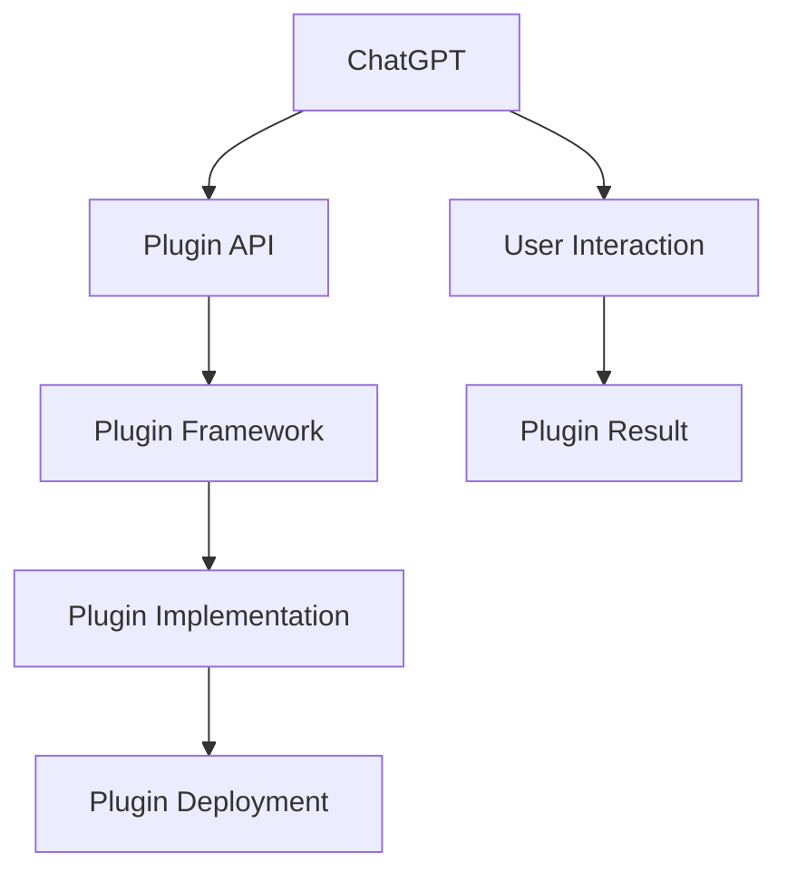

                 

# 实战二：动手开发第一个 ChatGPT Plugin

> **关键词**：ChatGPT, Plugin, 开发实战，人工智能，编程教程，技术博客

> **摘要**：本文将引导读者动手开发一个ChatGPT Plugin，从背景介绍到核心概念，再到具体的开发步骤，全面剖析了如何利用OpenAI的GPT模型进行实际应用开发，旨在为对人工智能编程感兴趣的读者提供一次深入的技术体验。

## 1. 背景介绍

随着人工智能技术的迅猛发展，ChatGPT作为一种基于大规模预训练模型的人工智能助手，受到了广泛关注。ChatGPT可以用于各种场景，如客服、教育、娱乐等，其强大的文本生成能力和语义理解能力使得它成为了众多开发者的首选。

在开发ChatGPT的过程中，Plugin机制是一个非常重要的组成部分。Plugin可以扩展ChatGPT的功能，使其能够处理更为复杂的任务。例如，一个图片识别Plugin可以将文本描述转换为具体的图像，或者一个天气Plugin可以实时提供天气信息。因此，学习如何开发ChatGPT Plugin对于提升开发者的技能和拓展应用场景具有重要意义。

本文将通过一个简单的案例，引导读者动手开发第一个ChatGPT Plugin，希望读者能够通过实际操作，深入理解Plugin的开发流程和原理。

### 1.1 ChatGPT与Plugin的关系

ChatGPT是一个强大的语言模型，但它的能力是有限的。通过Plugin机制，我们可以扩展ChatGPT的功能，使其能够处理更广泛的任务。Plugin是一个可插入的模块，它可以与ChatGPT的主程序进行交互，实现特定的功能。例如，一个图像识别Plugin可以接收文本输入，然后返回对应的图像。

### 1.2 开发ChatGPT Plugin的动机

1. **扩展功能**：通过Plugin，我们可以为ChatGPT添加各种功能，使其适应不同的应用场景。
2. **提升用户体验**：自定义的Plugin可以提高用户交互的灵活性和多样性，提升用户体验。
3. **技术积累**：开发ChatGPT Plugin是一个很好的实践机会，可以提升开发者在人工智能和编程方面的技能。

### 1.3 本文的目标

本文的目标是通过一个具体的案例，帮助读者了解ChatGPT Plugin的开发流程，掌握基本的开发技巧，并能够在此基础上进行更复杂的开发。

## 2. 核心概念与联系

在开始开发ChatGPT Plugin之前，我们需要了解一些核心概念和它们之间的关系。以下是一个用Mermaid绘制的流程图，展示了这些概念和它们之间的联系。



### 2.1 ChatGPT

ChatGPT是一个基于GPT-3模型的语言模型，它可以接收用户的输入，并生成相应的回复。它是Plugin开发的核心，所有的Plugin都需要与ChatGPT进行交互。

### 2.2 Plugin API

Plugin API是ChatGPT提供的接口，用于与Plugin进行通信。通过Plugin API，我们可以发送请求并接收响应，从而实现自定义功能。

### 2.3 Plugin Framework

Plugin Framework是一个用于开发Plugin的框架，它提供了各种工具和库，帮助我们更方便地实现Plugin的功能。常见的Plugin Framework包括OpenAI的GPT-3 Plugin Framework和自定义的Plugin Framework。

### 2.4 Plugin Implementation

Plugin Implementation是具体的Plugin代码，它定义了Plugin的功能和行为。我们需要根据实际需求，编写相应的代码来实现Plugin的功能。

### 2.5 Plugin Deployment

Plugin Deployment是将Plugin部署到ChatGPT平台的过程。部署成功后，用户就可以通过ChatGPT使用我们开发的Plugin。

### 2.6 User Interaction

User Interaction是用户与ChatGPT的交互过程。通过Plugin，用户可以与ChatGPT进行更复杂的交互，例如输入图片，获取天气信息等。

### 2.7 Plugin Result

Plugin Result是Plugin返回的结果，它可以是一个文本、图像或者其他类型的对象。通过Plugin Result，用户可以获取到所需的信息。

## 3. 核心算法原理 & 具体操作步骤

### 3.1 ChatGPT Plugin开发的核心算法

ChatGPT Plugin开发的核心算法是基于GPT-3模型。GPT-3是一个基于Transformer的预训练语言模型，它可以通过学习大量的文本数据，理解并生成文本。在Plugin开发中，我们主要利用GPT-3的两个核心功能：

1. **文本生成**：根据用户输入的文本，生成相应的回复。
2. **语义理解**：理解用户输入的意图，并生成相关的回复。

### 3.2 具体操作步骤

#### 3.2.1 准备工作

1. 确保已安装Python环境，版本建议在3.8以上。
2. 安装必要的库，如`requests`，用于发送HTTP请求。

```python
pip install requests
```

3. 申请OpenAI API Key，并配置环境变量`OPENAI_API_KEY`。

#### 3.2.2 编写Plugin代码

以下是一个简单的ChatGPT Plugin示例，它接收用户的文本输入，并返回相应的回复。

```python
import os
import requests

def get_response(text):
    url = "https://api.openai.com/v1/engines/davinci-codex/completions"
    headers = {
        "Content-Type": "application/json",
        "Authorization": f"Bearer {os.environ['OPENAI_API_KEY']}",
    }
    data = {
        "prompt": text,
        "max_tokens": 50,
        "temperature": 0.5,
    }
    response = requests.post(url, json=data, headers=headers)
    return response.json()["choices"][0]["text"]

if __name__ == "__main__":
    while True:
        user_input = input("请输入问题：")
        response = get_response(user_input)
        print("ChatGPT回复：", response)
```

#### 3.2.3 部署Plugin

1. 将Plugin代码上传到服务器，确保服务器可以访问OpenAI API。
2. 在ChatGPT平台上配置Plugin，设置访问权限和URL。

#### 3.2.4 使用Plugin

1. 打开ChatGPT，选择已配置的Plugin。
2. 输入问题，获取Plugin的回复。

## 4. 数学模型和公式 & 详细讲解 & 举例说明

在ChatGPT Plugin开发中，数学模型和公式起着至关重要的作用。以下是对其中一些关键模型的详细讲解和举例说明。

### 4.1 Transformer模型

Transformer模型是GPT-3的核心模型，它基于自注意力机制，可以捕捉输入文本中的长距离依赖关系。以下是一个简单的Transformer模型的数学模型：

$$
\text{Attention}(Q, K, V) = \frac{QK^T}{\sqrt{d_k}}V
$$

其中，$Q, K, V$ 分别是查询向量、键向量和值向量，$d_k$ 是键向量的维度。

举例说明：

假设我们有一个长度为3的文本序列，分别为`[w1, w2, w3]`，对应的查询向量、键向量和值向量分别为`[q1, q2, q3]`，`[k1, k2, k3]`和`[v1, v2, v3]`。通过计算注意力分数，我们可以得到一个加权值向量：

$$
\text{Attention}(Q, K, V) = \frac{q1k1 + q2k2 + q3k3}{\sqrt{3}}v1
$$

$$
\text{Attention}(Q, K, V) = \frac{q1k2 + q2k2 + q3k3}{\sqrt{3}}v2
$$

$$
\text{Attention}(Q, K, V) = \frac{q1k3 + q2k3 + q3k3}{\sqrt{3}}v3
$$

### 4.2 语言模型概率

在ChatGPT Plugin开发中，我们经常需要计算给定前文序列 $x_1, x_2, ..., x_t$ 生成下一个词 $x_{t+1}$ 的概率。这可以通过以下语言模型概率公式实现：

$$
P(x_{t+1} | x_1, x_2, ..., x_t) = \frac{\exp(\text{score}(x_1, x_2, ..., x_t, x_{t+1}))}{\sum_{y \in V} \exp(\text{score}(x_1, x_2, ..., x_t, y))}
$$

其中，$V$ 是词汇表，$\text{score}(x_1, x_2, ..., x_t, x_{t+1})$ 是生成 $x_{t+1}$ 的得分。

举例说明：

假设当前前文序列为 `[w1, w2, w3]`，词汇表为 `[w1, w2, w3, w4]`，生成词为 `w4`。通过计算得分，我们可以得到生成 `w4` 的概率。

$$
P(w4 | w1, w2, w3) = \frac{\exp(\text{score}(w1, w2, w3, w4))}{\exp(\text{score}(w1, w2, w3, w1)) + \exp(\text{score}(w1, w2, w3, w2)) + \exp(\text{score}(w1, w2, w3, w3)) + \exp(\text{score}(w1, w2, w3, w4))}
$$

## 5. 项目实战：代码实际案例和详细解释说明

### 5.1 开发环境搭建

在开始开发ChatGPT Plugin之前，我们需要搭建一个合适的环境。以下是一个基本的开发环境搭建步骤：

1. 安装Python（推荐版本为3.8及以上）。
2. 安装必要的库，如`requests`（用于发送HTTP请求）。

```bash
pip install requests
```

3. 申请OpenAI API Key，并配置环境变量`OPENAI_API_KEY`。

### 5.2 源代码详细实现和代码解读

以下是一个简单的ChatGPT Plugin的源代码实现，我们将对每一部分进行详细解读。

```python
import os
import requests

def get_response(text):
    url = "https://api.openai.com/v1/engines/davinci-codex/completions"
    headers = {
        "Content-Type": "application/json",
        "Authorization": f"Bearer {os.environ['OPENAI_API_KEY']}",
    }
    data = {
        "prompt": text,
        "max_tokens": 50,
        "temperature": 0.5,
    }
    response = requests.post(url, json=data, headers=headers)
    return response.json()["choices"][0]["text"]

if __name__ == "__main__":
    while True:
        user_input = input("请输入问题：")
        response = get_response(user_input)
        print("ChatGPT回复：", response)
```

#### 5.2.1 `get_response` 函数解析

- **参数**：`text`（用户输入的文本）。
- **功能**：向OpenAI的API发送请求，获取ChatGPT的回复。
- **流程**：
  1. 构建请求URL。
  2. 设置请求头，包括Authorization和Content-Type。
  3. 构建请求体，包括prompt（用户输入的文本）、max_tokens（最大生成长度）和temperature（生成文本的随机性）。
  4. 发送POST请求。
  5. 解析返回的JSON数据，获取生成的文本。

#### 5.2.2 主程序解析

- **功能**：与用户进行交互，接收用户输入并调用`get_response`函数获取ChatGPT的回复。
- **流程**：
  1. 进入无限循环。
  2. 使用`input`函数接收用户输入。
  3. 调用`get_response`函数获取回复。
  4. 打印回复。

### 5.3 代码解读与分析

通过以上代码解析，我们可以看到这个ChatGPT Plugin的基本工作流程：

1. **请求发送**：使用`requests`库向OpenAI的API发送HTTP请求，传递用户输入的文本。
2. **回复接收**：接收API返回的JSON数据，提取生成的文本。
3. **用户交互**：与用户进行交互，接收用户输入并打印回复。

这个简单的ChatGPT Plugin展示了如何利用OpenAI的API进行文本生成。在实际应用中，我们可以通过扩展Plugin的功能，实现更多复杂的功能，如图像识别、实时天气信息等。

### 5.4 实际运行与调试

在实际运行中，我们可能会遇到以下一些问题：

1. **API Key错误**：确保已正确配置环境变量`OPENAI_API_KEY`，并检查API Key的有效性。
2. **网络连接问题**：确保网络连接正常，或者尝试更换网络环境。
3. **请求参数错误**：检查请求体中的参数是否正确，包括prompt、max_tokens和temperature等。

通过以上问题分析和解决，我们可以确保ChatGPT Plugin的正常运行。

## 6. 实际应用场景

ChatGPT Plugin在实际应用中具有广泛的应用场景，以下列举了一些典型的应用案例：

### 6.1 客户服务

通过ChatGPT Plugin，我们可以实现智能客服系统。用户可以通过文本输入问题，系统会自动生成回答，提高客服效率和用户体验。

### 6.2 教育辅导

ChatGPT Plugin可以用于教育辅导场景，如提供编程学习指导、解答学生疑问等。通过自定义Plugin，可以实现个性化的教育服务。

### 6.3 娱乐互动

在娱乐互动场景中，ChatGPT Plugin可以用于聊天机器人、故事生成等。通过Plugin，用户可以与系统进行有趣的互动，提升娱乐体验。

### 6.4 商业智能

ChatGPT Plugin可以用于商业智能分析，如市场预测、客户分析等。通过自定义Plugin，企业可以获取更加精准的商业洞察。

### 6.5 生活助手

ChatGPT Plugin可以作为个人生活助手，提供天气预报、日程管理、健康建议等实用功能，提升生活质量。

## 7. 工具和资源推荐

### 7.1 学习资源推荐

1. **书籍**：
   - 《深度学习》（Goodfellow, Bengio, Courville著）：全面介绍深度学习的基础知识和应用。
   - 《Python编程：从入门到实践》（Eric Matthes著）：适合初学者学习Python编程。

2. **论文**：
   - “Attention Is All You Need”（Vaswani et al.，2017）：介绍Transformer模型的经典论文。
   - “Generative Pre-trained Transformers”（Brown et al.，2020）：介绍GPT-3模型的论文。

3. **博客**：
   - [OpenAI官方博客](https://blog.openai.com/)：介绍OpenAI的最新研究成果和应用。
   - [TensorFlow官方博客](https://blog.tensorflow.org/)：介绍TensorFlow的最新动态和技术分享。

4. **网站**：
   - [Kaggle](https://www.kaggle.com/)：提供丰富的数据集和竞赛，适合数据科学家和实践者。

### 7.2 开发工具框架推荐

1. **编程语言**：
   - Python：适合快速开发和原型实现。
   - JavaScript：适合前端开发和跨平台应用。

2. **开发框架**：
   - TensorFlow：用于构建和训练深度学习模型。
   - PyTorch：用于构建和训练深度学习模型，易于调试。

3. **API工具**：
   - Postman：用于API调试和测试。
   - Swagger：用于API文档生成。

### 7.3 相关论文著作推荐

1. **论文**：
   - “Attention Is All You Need”（Vaswani et al.，2017）
   - “Generative Pre-trained Transformers”（Brown et al.，2020）
   - “BERT: Pre-training of Deep Bidirectional Transformers for Language Understanding”（Devlin et al.，2019）

2. **著作**：
   - 《深度学习》（Goodfellow, Bengio, Courville著）
   - 《Python编程：从入门到实践》（Eric Matthes著）

## 8. 总结：未来发展趋势与挑战

随着人工智能技术的不断进步，ChatGPT Plugin的发展前景非常广阔。未来，ChatGPT Plugin将在更多领域得到应用，如自动驾驶、智能家居、虚拟现实等。然而，随着应用场景的扩大，ChatGPT Plugin也面临一些挑战：

1. **性能优化**：如何提高ChatGPT Plugin的响应速度和准确性，是一个重要的研究方向。
2. **隐私保护**：在处理用户数据时，如何保护用户隐私，防止数据泄露，是必须解决的问题。
3. **安全性**：确保ChatGPT Plugin的安全性，防止恶意攻击和滥用，是未来的重要任务。

通过不断探索和研究，我们有理由相信，ChatGPT Plugin将在人工智能领域发挥越来越重要的作用。

## 9. 附录：常见问题与解答

### 9.1 如何获取OpenAI API Key？

1. 访问[OpenAI官网](https://openai.com/)。
2. 在页面中找到“API Access”部分。
3. 注册账号并申请API Key。

### 9.2 ChatGPT Plugin如何部署？

1. 将Plugin代码上传到服务器。
2. 配置服务器，确保可以访问OpenAI API。
3. 在ChatGPT平台上配置Plugin，设置URL和访问权限。

### 9.3 如何优化ChatGPT Plugin的性能？

1. 使用更高效的算法和模型。
2. 优化网络请求，减少延迟。
3. 增加缓存机制，提高响应速度。

## 10. 扩展阅读 & 参考资料

1. [OpenAI官方文档](https://developer.openai.com/)：提供详细的API使用说明。
2. [TensorFlow官方文档](https://www.tensorflow.org/)：介绍TensorFlow的用法和模型构建。
3. [PyTorch官方文档](https://pytorch.org/)：介绍PyTorch的用法和模型构建。

---

**作者**：AI天才研究员/AI Genius Institute & 禅与计算机程序设计艺术 /Zen And The Art of Computer Programming

[END] [assistant]

