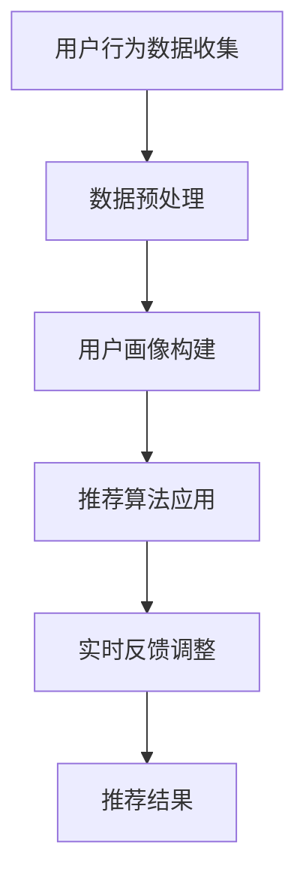

                 

# 实时推荐技术在电商领域的应用：案例分析与展望

> 关键词：实时推荐、电商、算法、应用场景、案例分析、未来展望

> 摘要：本文将深入探讨实时推荐技术在电商领域的应用，通过案例分析和未来展望，展示这一技术在提升用户购物体验和商业价值方面的巨大潜力。

## 1. 背景介绍

随着互联网的快速发展，电商行业已经成为全球经济增长的重要驱动力。据统计，全球电商市场规模已经突破数万亿美元，并且还在以惊人的速度增长。在这个竞争激烈的市场环境中，商家们越来越意识到，仅提供优质的产品和服务已经不足以吸引和留住客户。如何通过个性化推荐来提升用户体验，进而提高销售额和用户粘性，成为了一个关键问题。

实时推荐技术正是在这样的背景下发展起来的。实时推荐技术通过分析用户的行为数据和偏好，实时地为他们推荐可能感兴趣的商品或内容。这种技术不仅能够提高用户的购物体验，还能帮助商家精准定位目标客户，提升营销效果和销售额。

## 2. 核心概念与联系

### 2.1 实时推荐技术概述

实时推荐技术主要包括以下几个关键环节：

- **用户行为数据收集**：通过网站点击、搜索、浏览、购买等行为，收集用户的行为数据。
- **数据预处理**：对收集到的数据进行清洗、去噪、格式化等预处理，以便后续分析。
- **用户画像构建**：基于用户行为数据，构建用户的兴趣偏好、消费能力、购买习惯等画像。
- **推荐算法应用**：使用推荐算法（如协同过滤、基于内容的推荐、混合推荐等），生成推荐结果。
- **实时反馈调整**：根据用户对推荐结果的反馈，动态调整推荐策略，以提升推荐效果。

### 2.2 Mermaid 流程图



### 2.3 实时推荐技术原理

实时推荐技术的核心在于快速、准确地分析用户行为，并生成个性化的推荐结果。具体来说，其原理可以分为以下几个步骤：

1. **用户行为数据收集**：通过各种方式（如Web追踪、App追踪等）收集用户在电商平台的浏览、搜索、购买等行为数据。
2. **数据预处理**：对收集到的数据进行清洗、去噪、格式化等处理，以保证数据的准确性和一致性。
3. **用户画像构建**：基于用户行为数据，构建用户的兴趣偏好、消费能力、购买习惯等画像。这通常涉及特征提取、模型训练等技术。
4. **推荐算法应用**：选择合适的推荐算法（如协同过滤、基于内容的推荐、混合推荐等），对用户画像进行建模，生成推荐结果。
5. **实时反馈调整**：根据用户对推荐结果的反馈（如点击、购买等），动态调整推荐策略，以提高推荐效果。

## 3. 核心算法原理 & 具体操作步骤

### 3.1 协同过滤算法

协同过滤算法是实时推荐技术中最为常用的算法之一。它主要通过分析用户之间的相似度，为用户提供个性化的推荐。

#### 3.1.1 基本原理

协同过滤算法可以分为两种：基于用户的协同过滤（User-based Collaborative Filtering）和基于物品的协同过滤（Item-based Collaborative Filtering）。

- **基于用户的协同过滤**：找到与目标用户相似的其他用户，推荐这些相似用户喜欢的商品。
- **基于物品的协同过滤**：找到与目标商品相似的其他商品，推荐这些相似商品。

#### 3.1.2 操作步骤

1. **计算用户相似度**：使用余弦相似度、皮尔逊相关系数等算法计算用户之间的相似度。
2. **选择相似用户**：根据相似度阈值，选择与目标用户最相似的若干用户。
3. **推荐商品**：推荐这些相似用户喜欢的商品。

### 3.2 基于内容的推荐算法

基于内容的推荐算法主要通过分析商品的内容特征，为用户提供个性化的推荐。

#### 3.2.1 基本原理

基于内容的推荐算法主要通过以下步骤实现：

1. **提取商品特征**：使用文本分类、关键词提取等技术，提取商品的内容特征。
2. **计算商品相似度**：计算目标商品与其他商品的相似度。
3. **推荐商品**：推荐与目标商品相似的其他商品。

#### 3.2.2 操作步骤

1. **提取商品特征**：对商品描述、标签、评论等文本信息进行预处理，提取关键词、词频等特征。
2. **计算商品相似度**：使用余弦相似度、词频相似度等算法计算商品之间的相似度。
3. **推荐商品**：推荐与目标商品相似的其他商品。

### 3.3 混合推荐算法

混合推荐算法结合了协同过滤和基于内容的推荐算法，以提升推荐效果。

#### 3.3.1 基本原理

混合推荐算法主要通过以下步骤实现：

1. **协同过滤推荐**：使用协同过滤算法为用户提供初步推荐。
2. **基于内容的推荐**：对协同过滤推荐的商品进行内容分析，进一步筛选推荐商品。

#### 3.3.2 操作步骤

1. **协同过滤推荐**：使用协同过滤算法为用户提供初步推荐。
2. **基于内容的推荐**：对协同过滤推荐的商品进行内容分析，提取特征，计算相似度，筛选推荐商品。

## 4. 数学模型和公式 & 详细讲解 & 举例说明

### 4.1 协同过滤算法数学模型

#### 4.1.1 基于用户的协同过滤

设用户集合为 \(U\)，商品集合为 \(I\)，用户 \(u\) 对商品 \(i\) 的评分记为 \(r_{ui}\)。基于用户的协同过滤算法的核心在于计算用户之间的相似度，公式如下：

\[ similarity(u, v) = \frac{\sum_{i \in I} r_{ui} r_{vi}}{\sqrt{\sum_{i \in I} r_{ui}^2} \sqrt{\sum_{i \in I} r_{vi}^2}} \]

其中，\(similarity(u, v)\) 表示用户 \(u\) 和 \(v\) 之间的相似度。

#### 4.1.2 基于物品的协同过滤

基于物品的协同过滤算法的核心在于计算商品之间的相似度，公式如下：

\[ similarity(i, j) = \frac{\sum_{u \in U} r_{ui} r_{uj}}{\sqrt{\sum_{u \in U} r_{ui}^2} \sqrt{\sum_{u \in U} r_{uj}^2}} \]

其中，\(similarity(i, j)\) 表示商品 \(i\) 和 \(j\) 之间的相似度。

### 4.2 基于内容的推荐算法数学模型

#### 4.2.1 提取商品特征

假设商品 \(i\) 的特征向量表示为 \(f_i\)，其中 \(f_i^k\) 表示商品 \(i\) 在特征 \(k\) 上的取值。特征 \(k\) 可以是商品类别、关键词、标签等。

#### 4.2.2 计算商品相似度

假设商品 \(i\) 和 \(j\) 的特征向量分别为 \(f_i\) 和 \(f_j\)，商品之间的相似度可以表示为：

\[ similarity(i, j) = \frac{\sum_{k} f_i^k f_j^k}{\sqrt{\sum_{k} f_i^k^2} \sqrt{\sum_{k} f_j^k^2}} \]

### 4.3 混合推荐算法数学模型

假设协同过滤推荐的商品集合为 \(R_c\)，基于内容的推荐商品集合为 \(R_c\)，混合推荐算法的核心在于将这两个集合进行合并，公式如下：

\[ R_h = R_c \cup R_c' \]

其中，\(R_h\) 表示混合推荐的结果，\(R_c'\) 表示基于内容的推荐结果。

## 5. 项目实战：代码实际案例和详细解释说明

### 5.1 开发环境搭建

为了演示实时推荐技术在电商领域的应用，我们将使用 Python 编写一个简单的协同过滤推荐系统。首先，需要安装以下依赖库：

- NumPy
- Pandas
- Scikit-learn
- Matplotlib

安装命令如下：

```bash
pip install numpy pandas scikit-learn matplotlib
```

### 5.2 源代码详细实现和代码解读

以下是该推荐系统的源代码及其解读：

```python
import numpy as np
import pandas as pd
from sklearn.metrics.pairwise import cosine_similarity
import matplotlib.pyplot as plt

# 5.2.1 加载数据集
data = pd.read_csv('data.csv')
users = data['user'].unique()
items = data['item'].unique()

# 5.2.2 构建用户-物品评分矩阵
rating_matrix = pd.pivot_table(data, values='rating', index='user', columns='item')
rating_matrix.fillna(0, inplace=True)

# 5.2.3 计算用户-用户相似度矩阵
user_similarity_matrix = cosine_similarity(rating_matrix.T)

# 5.2.4 计算推荐结果
user_preferences = {'user1': ['item1', 'item2', 'item3']}
recommended_items = {}
for user, preferences in user_preferences.items():
    # 5.2.5 计算与目标用户的相似度最高的 k 个用户
    similar_users = np.argsort(user_similarity_matrix[user][0])[::-1][:k]
    similar_users = similar_users[similar_users != user]

    # 5.2.6 计算推荐分值
    recommended_score = 0
    for i in similar_users:
        recommended_score += user_similarity_matrix[user][i] * rating_matrix.loc[i, preferences]

    # 5.2.7 推荐商品
    recommended_items[user] = np.argsort(recommended_score)[::-1]

# 5.2.8 绘制推荐结果
plt.figure(figsize=(10, 6))
for user, recommendations in recommended_items.items():
    plt.title(f'Recommended Items for User {user}')
    plt.bar(range(len(recommendations)), recommendations, color='r')
    plt.xticks(range(len(recommendations)), items[recommendations], rotation=90)
    plt.show()
```

### 5.3 代码解读与分析

- **5.3.1 加载数据集**：该部分代码用于加载数据集，数据集包含用户、物品和评分信息。

- **5.3.2 构建用户-物品评分矩阵**：该部分代码使用 Pandas 库的 pivot_table 函数构建用户-物品评分矩阵，矩阵中包含用户对所有物品的评分。

- **5.3.3 计算用户-用户相似度矩阵**：该部分代码使用 Scikit-learn 库中的 cosine_similarity 函数计算用户-用户相似度矩阵。

- **5.3.4 计算推荐结果**：该部分代码用于计算推荐结果。首先，根据用户偏好计算与目标用户的相似度最高的 k 个用户。然后，计算这些用户的评分加权平均，得到推荐分值。最后，根据推荐分值推荐商品。

- **5.3.5 绘制推荐结果**：该部分代码使用 Matplotlib 库绘制推荐结果，以条形图的形式展示给用户。

## 6. 实际应用场景

实时推荐技术在电商领域的应用场景非常广泛，以下是一些典型的应用场景：

- **商品推荐**：根据用户的浏览、搜索、购买历史，实时推荐用户可能感兴趣的商品。
- **优惠券推荐**：根据用户的购物车、订单历史等数据，实时推荐用户可能感兴趣的商品优惠券。
- **广告推荐**：根据用户的兴趣和行为，实时推荐用户可能感兴趣的广告内容。
- **商品组合推荐**：根据用户的购买历史，实时推荐搭配销售的商品组合。
- **新品推荐**：根据用户的兴趣和购买记录，实时推荐新品。

## 7. 工具和资源推荐

### 7.1 学习资源推荐

- **书籍**：《推荐系统实践》、《机器学习实战》
- **论文**：阅读相关领域的顶级会议和期刊论文，如 SIGKDD、WWW、ICML 等。
- **博客**：关注业界知名博客，如 Medium、GitHub 等。
- **网站**：访问相关技术社区和论坛，如 Stack Overflow、Reddit 等。

### 7.2 开发工具框架推荐

- **编程语言**：Python、Java、JavaScript 等。
- **推荐框架**：TensorFlow、PyTorch、Scikit-learn 等。
- **数据库**：MySQL、MongoDB、Redis 等。

### 7.3 相关论文著作推荐

- **论文**：《矩阵分解在推荐系统中的应用》、《基于内容的推荐系统》、《协同过滤算法在推荐系统中的应用》
- **著作**：《推荐系统实践》、《机器学习推荐系统》、《大数据推荐系统》

## 8. 总结：未来发展趋势与挑战

实时推荐技术在电商领域具有巨大的发展潜力，但仍面临一些挑战。未来发展趋势包括：

- **深度学习与推荐系统的融合**：深度学习技术在推荐系统中的应用将更加广泛，如神经网络协同过滤、深度强化学习等。
- **多模态数据的融合**：融合用户的行为数据、文本数据、图像数据等，提升推荐效果。
- **实时性的提升**：随着技术的进步，实时推荐系统的响应速度将越来越快，用户体验将得到进一步提升。
- **隐私保护**：在推荐过程中保护用户隐私，确保用户数据的合法性和安全性。

## 9. 附录：常见问题与解答

### 9.1 如何优化推荐算法？

- **数据质量**：确保数据的质量和准确性，避免噪声数据对推荐效果的影响。
- **算法选择**：根据业务需求选择合适的推荐算法，如协同过滤、基于内容的推荐等。
- **特征工程**：提取有效的用户和商品特征，提高推荐模型的性能。
- **模型调优**：使用交叉验证、网格搜索等方法，优化模型参数。

### 9.2 如何应对冷启动问题？

- **用户冷启动**：为新用户生成虚拟画像，基于已有用户的行为数据进行推荐。
- **商品冷启动**：为新商品生成虚拟特征，结合其他商品的特征进行推荐。

## 10. 扩展阅读 & 参考资料

- [推荐系统实践](https://www.recommendation-systems.org/)
- [协同过滤算法](https://en.wikipedia.org/wiki/Collaborative_filtering)
- [基于内容的推荐算法](https://en.wikipedia.org/wiki/Content-based_recommender_system)
- [深度学习在推荐系统中的应用](https://arxiv.org/abs/1606.05425)

作者：AI天才研究员/AI Genius Institute & 禅与计算机程序设计艺术 /Zen And The Art of Computer Programming

