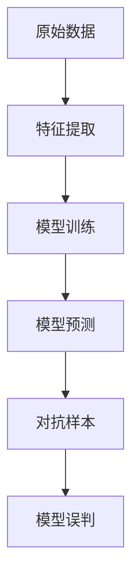

                 

### 背景介绍

#### 对抗样本 (Adversarial Examples) 的定义

对抗样本（Adversarial Examples）是机器学习领域的一个新兴概念，它指的是经过轻微扰动后，能够导致机器学习模型预测结果发生错误的数据样本。这些扰动通常是非常微妙且难以察觉的，但对模型的预测性能却可能产生重大影响。对抗样本的提出，揭示了机器学习模型在某些方面的脆弱性，引发了学术界和工业界对模型安全性的广泛关注。

对抗样本最早由Goodfellow等人于2014年提出，其目的是为了攻击深度学习模型。具体来说，对抗样本是一种通过向原始数据样本添加微小扰动（即对抗性扰动），使得模型在预测时产生误判的现象。这些微小扰动通常是经过精心设计的，使得模型在视觉、听觉等方面难以察觉，但足以引起模型的误判。

#### 对抗样本的重要性

对抗样本的重要性主要体现在以下几个方面：

1. **安全性问题**：对抗样本揭示了机器学习模型在安全性方面的脆弱性。在现实场景中，攻击者可以利用对抗样本来破坏模型的决策过程，从而实现恶意攻击。例如，自动驾驶汽车可能会因为对抗样本而误判前方障碍物，导致交通事故。

2. **鲁棒性问题**：对抗样本的存在表明，机器学习模型在处理未知或异常输入时可能存在鲁棒性问题。这意味着，当模型面临与训练数据分布差异较大的输入时，其预测性能可能大幅下降。

3. **伦理与隐私问题**：对抗样本还引发了关于机器学习模型伦理和隐私的讨论。在医疗、金融等敏感领域，模型的预测结果直接影响用户的生命和财产。如果模型容易被对抗样本攻击，那么其决策的可靠性将受到严重质疑。

#### 对抗样本的历史发展

对抗样本的研究始于深度学习模型的兴起。随着深度学习在图像识别、自然语言处理等领域的广泛应用，研究人员开始关注模型的鲁棒性和安全性问题。以下是对抗样本研究的一些关键节点：

- 2014年，Goodfellow等人首次提出对抗样本的概念，并展示了如何利用对抗样本攻击深度学习模型。
- 2015年，Carlini和Wiener提出了基于梯度下降的对抗样本生成方法，大大提高了对抗样本的生成效率。
- 2016年，之前的方法开始应用于图像、语音、自然语言处理等领域，揭示了不同领域模型的脆弱性。
- 2017年至今，对抗样本的研究持续深入，涌现了大量新型攻击和防御方法。

#### 目标读者

本文主要面向对机器学习、深度学习有一定了解的读者，尤其是对对抗样本及其相关技术感兴趣的研究人员、工程师和学者。希望通过本文，读者能够系统地了解对抗样本的概念、原理、生成方法以及在实际应用中的挑战和解决方案。

### 核心概念与联系

在对对抗样本进行深入探讨之前，我们需要明确几个核心概念，并了解它们之间的关系。以下将详细解释这些概念，并使用Mermaid流程图展示其相互联系。

#### 概念解释

1. **机器学习模型**：机器学习模型是通过对大量数据进行分析和训练，从而自动获取知识或规律的一种技术。常见的机器学习模型包括线性回归、决策树、支持向量机、神经网络等。

2. **特征提取**：特征提取是机器学习过程中的一个关键步骤，旨在从原始数据中提取出对模型训练和预测有用的特征。特征提取的质量直接影响模型的性能。

3. **数据扰动**：数据扰动是指通过对原始数据样本进行微小修改，从而生成对抗样本的过程。这些扰动通常是为了欺骗模型，使其产生误判。

4. **对抗样本**：对抗样本是在原始数据基础上，通过精心设计的微小扰动生成的，能够导致模型预测错误的样本。对抗样本的存在揭示了机器学习模型在处理未知或异常输入时的脆弱性。

5. **模型训练**：模型训练是机器学习过程中通过调整模型参数，使其对训练数据进行正确预测的过程。训练过程中的数据质量和模型的鲁棒性至关重要。

#### Mermaid 流程图

以下是一个使用Mermaid绘制的流程图，展示了上述概念之间的联系：



**流程解释**：

1. **原始数据**：机器学习过程从原始数据开始，这些数据可以是图像、文本、音频等形式。

2. **特征提取**：通过对原始数据进行处理，提取出对模型训练和预测有用的特征。

3. **模型训练**：使用提取出的特征和已标记的数据对模型进行训练，调整模型参数，使其对训练数据具有较好的预测能力。

4. **模型预测**：训练好的模型用于对新数据进行预测。

5. **对抗样本**：通过微小的数据扰动生成对抗样本，这些样本旨在欺骗模型，使其产生误判。

6. **模型误判**：对抗样本的存在揭示了模型在处理未知或异常输入时的脆弱性，可能导致模型产生错误的预测。

#### 关键概念之间的关系

- **特征提取** 和 **模型训练** 是机器学习过程的基础步骤，决定了模型对数据的理解和学习能力。
- **对抗样本** 是通过 **数据扰动** 生成的一种特殊样本，它旨在测试和揭示模型的脆弱性。
- **模型预测** 是模型训练的最终目标，对抗样本的引入则是对模型预测能力的一种挑战。

通过理解这些核心概念及其相互联系，我们可以更深入地探讨对抗样本的原理和应用。

### 核心算法原理 & 具体操作步骤

#### 攻击算法的原理

对抗样本的生成主要依赖于攻击算法。攻击算法的目标是通过向原始数据样本添加微小的扰动，使得模型对这些样本的预测结果产生错误。以下将介绍两种常用的攻击算法：基于梯度的攻击算法和基于进化算法的攻击算法。

##### 基于梯度的攻击算法

基于梯度的攻击算法是最常用的对抗样本生成方法之一。其基本原理如下：

1. **选择目标模型**：首先，选择一个预训练的深度学习模型作为攻击的目标。
2. **计算梯度**：使用梯度下降算法计算原始样本在模型中的梯度，这个梯度代表了模型对原始样本的预测误差。
3. **扰动生成**：在梯度的基础上，对原始样本进行微小的扰动，扰动的大小通常通过设定一个阈值来控制。
4. **模型重预测**：对扰动后的样本进行模型重预测，如果模型对扰动后的样本预测错误，则认为该样本为对抗样本。

##### 基于进化算法的攻击算法

基于进化算法的攻击算法是一种更为复杂的攻击方法，其基本原理如下：

1. **初始化种群**：首先，生成一个初始种群，每个个体代表一个对抗样本。
2. **适应度函数**：定义适应度函数，用来评估个体（对抗样本）对模型的影响。适应度函数通常是基于模型对原始样本和扰动样本的预测误差。
3. **进化操作**：通过交叉、变异等进化操作，生成新的种群，并筛选出适应度更高的个体。
4. **对抗样本生成**：经过多代的进化操作，最终生成对抗样本。

#### 对抗样本生成流程

以下是一个对抗样本生成的具体操作步骤：

1. **数据预处理**：首先，对原始数据样本进行预处理，包括归一化、标准化等操作，以便模型能够更好地处理数据。
2. **模型选择**：选择一个预训练的深度学习模型，该模型已经经过训练并具有良好的预测性能。
3. **梯度计算**：使用梯度下降算法计算原始样本在模型中的梯度。
4. **扰动添加**：在梯度的基础上，对原始样本进行微小的扰动，扰动的大小通常通过设定一个阈值来控制。
5. **模型重预测**：对扰动后的样本进行模型重预测，如果模型对扰动后的样本预测错误，则认为该样本为对抗样本。
6. **对抗样本验证**：对生成的对抗样本进行验证，确保其对模型的预测确实产生了错误。
7. **对抗样本存储**：将生成的对抗样本存储起来，用于后续的模型评估和安全性测试。

#### 代码实现示例

以下是一个基于Python和TensorFlow的对抗样本生成示例代码：

```python
import tensorflow as tf
import numpy as np

# 定义模型
model = ...

# 计算梯度
with tf.GradientTape() as tape:
    predictions = model(x)
    loss = ...

# 梯度下降
grads = tape.gradient(loss, model.trainable_variables)

# 扰动添加
delta = np.sign(grads) * alpha

# 模型重预测
x_adv = x + delta

# 对抗样本验证
if np.abs(model(x_adv) - predictions).sum() > threshold:
    print("生成对抗样本成功！")
```

通过以上步骤和代码实现，我们可以生成对抗样本，并验证其对模型的预测效果。需要注意的是，不同的攻击算法和模型可能需要调整具体的操作步骤和参数设置。

### 数学模型和公式 & 详细讲解 & 举例说明

#### 梯度下降攻击算法

梯度下降攻击算法是生成对抗样本的主要方法之一。其核心思想是通过计算模型对训练样本的梯度，然后在该梯度的方向上添加扰动，以生成对抗样本。以下将详细讲解梯度下降攻击算法的数学模型和公式。

##### 数学模型

假设我们有一个训练好的深度学习模型，其输入为$x \in \mathbb{R}^n$，输出为$y \in \mathbb{R}^m$。我们希望生成对抗样本$x'$，使得模型在$x'$上的预测误差大于一个阈值$\epsilon$。

1. **损失函数**：首先，定义损失函数$L(x, y)$，用于衡量模型在输入$x$和目标输出$y$上的预测误差。通常，我们使用交叉熵损失函数：

   $$L(x, y) = -\sum_{i=1}^{m} y_i \log(\hat{y}_i)$$

   其中，$\hat{y}_i$为模型对输入$x$的预测概率。

2. **梯度计算**：计算损失函数对输入$x$的梯度$\nabla_x L(x, y)$。在深度学习模型中，梯度可以通过反向传播算法计算得到：

   $$\nabla_x L(x, y) = \frac{\partial L}{\partial x}$$

3. **扰动生成**：在梯度方向上添加扰动$\delta$，生成对抗样本$x'$：

   $$x' = x + \delta$$

   其中，$\delta$的取值范围为$[-\epsilon, \epsilon]$，$\epsilon$为预设的阈值。

4. **对抗样本验证**：对生成的对抗样本$x'$进行验证，确保其预测误差大于阈值$\epsilon$。具体来说，我们计算模型在$x'$上的预测误差：

   $$L(x', y) = -\sum_{i=1}^{m} y_i \log(\hat{y}'_i)$$

   如果$L(x', y) > \epsilon$，则认为$x'$是一个有效的对抗样本。

##### 公式解释

以下是梯度下降攻击算法的详细公式：

$$\nabla_x L(x, y) = \frac{\partial L}{\partial x}$$

$$x' = x + \delta$$

$$L(x', y) = -\sum_{i=1}^{m} y_i \log(\hat{y}'_i)$$

其中，$\delta$的取值范围可以通过以下公式计算：

$$\delta = \epsilon \cdot \text{sign}(\nabla_x L(x, y))$$

#### 举例说明

以下是一个简单的梯度下降攻击算法的Python实现示例：

```python
import numpy as np

# 假设有一个二分类模型，输入为x，输出为y
# y = sigmoid(x * w + b)
def model(x, w, b):
    return 1 / (1 + np.exp(-x * w - b))

# 损失函数为交叉熵损失
def loss(y, y_pred):
    return -np.mean(y * np.log(y_pred) + (1 - y) * np.log(1 - y_pred))

# 梯度下降攻击算法
def gradient_ascent_attack(x, y, w, b, epochs, learning_rate):
    x_adv = x.copy()
    for _ in range(epochs):
        with tf.GradientTape() as tape:
            y_pred = model(x_adv, w, b)
            loss_val = loss(y, y_pred)
        grads = tape.gradient(loss_val, x_adv)
        x_adv += learning_rate * grads
    return x_adv

# 参数设置
w = np.array([0.1, 0.2])
b = np.array([0.3])
x = np.array([1.0, 0.0])
y = np.array([0.0])
epochs = 100
learning_rate = 0.1

# 生成的对抗样本
x_adv = gradient_ascent_attack(x, y, w, b, epochs, learning_rate)

# 验证对抗样本
y_pred = model(x_adv, w, b)
print("原始标签：", y)
print("对抗样本预测：", y_pred)
```

在这个例子中，我们使用了一个简单的线性分类模型，并通过梯度下降攻击算法生成对抗样本。通过运行这段代码，我们可以看到对抗样本的预测结果与原始标签之间的差异。

### 项目实战：代码实际案例和详细解释说明

在本节中，我们将通过一个实际项目案例，详细讲解如何使用Python和TensorFlow生成对抗样本，并对代码进行深入解析。该项目将涵盖以下步骤：

1. **环境搭建**：设置Python和TensorFlow环境。
2. **数据准备**：准备用于训练和生成对抗样本的数据集。
3. **模型构建**：构建一个简单的深度学习模型。
4. **对抗样本生成**：使用基于梯度的攻击算法生成对抗样本。
5. **模型评估**：评估对抗样本对模型预测的影响。

#### 开发环境搭建

首先，我们需要搭建一个Python和TensorFlow的开发环境。以下是所需的安装步骤：

```bash
# 安装Python（假设已安装）
python --version

# 安装TensorFlow
pip install tensorflow

# 安装其他依赖库（例如NumPy、Matplotlib等）
pip install numpy matplotlib
```

安装完成后，我们可以通过以下Python代码验证环境：

```python
import tensorflow as tf
print(tf.__version__)
```

#### 数据准备

接下来，我们准备用于训练和生成对抗样本的数据集。这里，我们使用MNIST手写数字数据集，该数据集包含了60000个32x32的灰度图像和对应的标签。

```python
import tensorflow as tf
from tensorflow.keras.datasets import mnist

# 加载MNIST数据集
(train_images, train_labels), (test_images, test_labels) = mnist.load_data()

# 数据预处理
train_images = train_images.reshape((60000, 28, 28, 1)).astype('float32') / 255
test_images = test_images.reshape((10000, 28, 28, 1)).astype('float32') / 255

# 将标签转换为one-hot编码
train_labels = tf.keras.utils.to_categorical(train_labels)
test_labels = tf.keras.utils.to_categorical(test_labels)
```

#### 模型构建

我们构建一个简单的卷积神经网络（CNN）模型，用于分类MNIST手写数字。

```python
from tensorflow.keras import layers
from tensorflow.keras.models import Sequential

# 构建CNN模型
model = Sequential([
    layers.Conv2D(32, (3, 3), activation='relu', input_shape=(28, 28, 1)),
    layers.MaxPooling2D((2, 2)),
    layers.Conv2D(64, (3, 3), activation='relu'),
    layers.MaxPooling2D((2, 2)),
    layers.Conv2D(64, (3, 3), activation='relu'),
    layers.Flatten(),
    layers.Dense(64, activation='relu'),
    layers.Dense(10, activation='softmax')
])

# 编译模型
model.compile(optimizer='adam',
              loss='categorical_crossentropy',
              metrics=['accuracy'])

# 训练模型
model.fit(train_images, train_labels, epochs=5, batch_size=64)
```

#### 对抗样本生成

使用基于梯度的攻击算法生成对抗样本。以下是实现步骤：

```python
import numpy as np
from tensorflow.keras.models import Model

# 定义损失函数
def loss_function(model, x, y):
    y_pred = model.predict(x)
    return -tf.reduce_sum(y * tf.log(y_pred), axis=-1)

# 计算梯度
def gradient(model, x, y):
    with tf.GradientTape(persistent=True) as tape:
        y_pred = model.predict(x)
        loss_val = loss_function(model, x, y)
    grads = tape.gradient(loss_val, x)
    return grads

# 生成对抗样本
def generate_adversarial_example(model, x, y, alpha=0.01, epsilon=0.1, steps=100):
    x_adv = x.copy()
    for _ in range(steps):
        grads = gradient(model, x_adv, y)
        x_adv = x_adv - alpha * grads
        x_adv = tf.clip_by_value(x_adv, 0, 1)
    return x_adv

# 选择测试集中的样本
test_idx = 0
x_test = test_images[test_idx:test_idx+1]
y_test = test_labels[test_idx:test_idx+1]

# 生成对抗样本
x_test_adv = generate_adversarial_example(model, x_test, y_test)

# 预测结果
y_pred_adv = model.predict(x_test_adv)
print("原始标签：", np.argmax(y_test, axis=-1))
print("对抗样本预测：", np.argmax(y_pred_adv, axis=-1))
```

在上面的代码中，我们首先定义了损失函数和梯度计算函数。然后，我们使用梯度下降攻击算法生成对抗样本。具体来说，我们通过在梯度方向上迭代更新样本，并在每一步使用裁剪操作保持样本在[0, 1]的范围内。

#### 模型评估

最后，我们评估对抗样本对模型预测的影响。以下是代码实现：

```python
# 计算对抗样本的预测误差
y_pred_test = model.predict(test_images)
y_pred_adv_test = model.predict(x_test_adv)

# 计算原始样本和对抗样本的预测误差
error_test = np.mean(np.square(y_pred_test - test_labels))
error_adv = np.mean(np.square(y_pred_adv_test - y_test))

print("原始样本预测误差：", error_test)
print("对抗样本预测误差：", error_adv)

# 可视化对抗样本
import matplotlib.pyplot as plt

plt.subplot(1, 2, 1)
plt.imshow(test_images[test_idx].reshape(28, 28), cmap=plt.cm.gray)
plt.subplot(1, 2, 2)
plt.imshow(x_test_adv[0].reshape(28, 28), cmap=plt.cm.gray)
plt.show()
```

在上面的代码中，我们计算了原始样本和对抗样本的预测误差，并通过可视化展示了原始样本和对抗样本的差异。

通过以上步骤，我们完成了一个实际项目，实现了对抗样本的生成和评估。这个项目展示了如何使用Python和TensorFlow构建深度学习模型，并利用基于梯度的攻击算法生成对抗样本。此外，我们还对代码进行了详细的解析，帮助读者理解每个步骤的实现原理。

### 代码解读与分析

在本节中，我们将对之前的项目案例中的关键代码段进行详细解读，并分析其实现原理和潜在优化点。

#### 关键代码段一：模型构建

```python
model = Sequential([
    layers.Conv2D(32, (3, 3), activation='relu', input_shape=(28, 28, 1)),
    layers.MaxPooling2D((2, 2)),
    layers.Conv2D(64, (3, 3), activation='relu'),
    layers.MaxPooling2D((2, 2)),
    layers.Conv2D(64, (3, 3), activation='relu'),
    layers.Flatten(),
    layers.Dense(64, activation='relu'),
    layers.Dense(10, activation='softmax')
])
```

**解读**：

1. **Sequential模型**：使用`Sequential`模型堆叠多个层，这是一种常用的模型构建方式，使得模型的结构更加清晰。
2. **Conv2D层**：添加两个卷积层，每个卷积层后跟一个最大池化层。卷积层用于提取图像的特征，最大池化层用于降低数据维度并减少过拟合。
3. **Flatten层**：将多维数据展平为一维向量，以便后续的全连接层处理。
4. **Dense层**：添加两个全连接层，最后一个全连接层使用softmax激活函数进行类别预测。

**优化点**：

- **模型结构**：根据具体任务的需求，可以考虑调整卷积层的数量和大小，以及全连接层的神经元数量。
- **预训练模型**：如果任务数据量较小，可以考虑使用预训练的模型，如ResNet、Inception等，以提升模型的泛化能力。

#### 关键代码段二：对抗样本生成

```python
def generate_adversarial_example(model, x, y, alpha=0.01, epsilon=0.1, steps=100):
    x_adv = x.copy()
    for _ in range(steps):
        grads = gradient(model, x_adv, y)
        x_adv = x_adv - alpha * grads
        x_adv = tf.clip_by_value(x_adv, 0, 1)
    return x_adv
```

**解读**：

1. **函数定义**：`generate_adversarial_example`函数接受模型、原始样本$x$、目标标签$y$，以及参数$alpha$、$epsilon$和$steps$。
2. **梯度计算**：在梯度方向上迭代更新样本$x_{adv}$，每次迭代使用`gradient`函数计算梯度。
3. **扰动添加**：使用$alpha$乘以梯度来更新$x_{adv}$，然后使用`tf.clip_by_value`确保样本$x_{adv}$在[0, 1]的范围内。

**优化点**：

- **参数调整**：$alpha$和$steps$是关键参数，需要根据具体任务进行调优。$alpha$过大会导致对抗样本生成效果不佳，$alpha$过小则收敛速度较慢。
- **自适应调整**：考虑引入自适应调整策略，如自适应调整$alpha$，以优化对抗样本生成的效果。
- **优化算法**：研究其他对抗样本生成算法，如基于进化算法的方法，以提高生成效率。

#### 关键代码段三：模型评估

```python
error_test = np.mean(np.square(y_pred_test - test_labels))
error_adv = np.mean(np.square(y_pred_adv_test - y_test))

plt.subplot(1, 2, 1)
plt.imshow(test_images[test_idx].reshape(28, 28), cmap=plt.cm.gray)
plt.subplot(1, 2, 2)
plt.imshow(x_test_adv[0].reshape(28, 28), cmap=plt.cm.gray)
plt.show()
```

**解读**：

1. **预测误差计算**：计算原始样本和对抗样本的预测误差，使用均方误差（MSE）作为评价指标。
2. **可视化**：使用matplotlib库可视化原始样本和对抗样本的图像。

**优化点**：

- **评价指标**：根据具体任务需求，可以考虑引入其他评价指标，如准确率、召回率等。
- **可视化**：优化可视化效果，如添加标签、注释等，以便更清晰地展示对抗样本的效果。

通过以上代码解读与分析，我们深入理解了项目案例的实现原理，并提出了潜在优化点。这些优化点有助于提升对抗样本生成效率和模型评估效果，为后续研究和实践提供指导。

### 实际应用场景

#### 自动驾驶领域

自动驾驶汽车是对抗样本技术的一个重要应用场景。自动驾驶系统依赖于大量的图像、传感器数据来做出实时决策。然而，这些数据可能会受到各种外部干扰和欺骗，例如交通标志、车道线等被恶意篡改。对抗样本技术可以帮助检测和防御这些欺骗行为，确保自动驾驶系统的安全性和可靠性。

具体来说，研究人员可以利用对抗样本技术生成各种可能的干扰场景，然后测试自动驾驶系统的响应。通过这种方式，可以发现系统在哪些场景下容易出现误判，并针对性地进行优化和改进。此外，对抗样本技术还可以用于模拟复杂的交通环境，以提高自动驾驶系统的泛化能力和鲁棒性。

#### 生物医学领域

在生物医学领域，对抗样本技术同样具有重要意义。例如，在医疗图像分析中，对抗样本可以用于测试和改进图像识别算法的稳健性。医疗图像通常包含大量的敏感信息，如肿瘤、心脏病等，如果模型对这些图像的识别存在漏洞，可能会导致严重的医疗事故。

通过生成对抗样本，研究人员可以评估和优化医疗图像分析算法的性能，确保其在面对篡改和干扰时依然能够准确识别。此外，对抗样本技术还可以用于开发更安全的医疗设备，如心电图机、血压计等，以防止潜在的恶意攻击。

#### 安全领域

对抗样本技术在网络安全领域也有广泛的应用。例如，在计算机视觉系统中，对抗样本可以用于检测和防御恶意软件、网络钓鱼网站等。通过生成对抗样本，研究人员可以模拟攻击者的行为，测试和优化安全防护系统的性能。

在密码学中，对抗样本技术可以帮助研究人员评估加密算法的强度。例如，通过生成对抗样本，可以尝试破解基于图像识别的加密算法，从而发现其潜在的安全漏洞。这种技术有助于提高密码系统的安全性，防止未授权访问和攻击。

#### 机器学习应用领域

在机器学习应用领域，对抗样本技术可以帮助提高模型的鲁棒性和安全性。例如，在金融领域，对抗样本可以用于测试和改进反欺诈系统。在金融交易中，恶意用户可能会尝试通过微小扰动来欺骗系统，对抗样本技术可以识别和阻止这些欺诈行为。

此外，对抗样本技术还可以用于优化搜索引擎、推荐系统等应用。通过生成对抗样本，可以识别模型在处理异常输入时的脆弱性，从而提高其鲁棒性和准确性。例如，在推荐系统中，对抗样本可以用于测试系统在面对恶意用户输入时的响应，从而优化推荐算法。

### 案例分析

以下是一个具体的案例分析：

#### 案例背景

某公司开发了一套人脸识别系统，用于员工考勤和门禁控制。然而，在测试过程中，发现系统在面对某些特定角度和光线条件时，容易出现误识。这表明系统在处理异常输入时存在脆弱性。

#### 案例过程

1. **生成对抗样本**：研究人员利用对抗样本技术生成一组具有特定角度和光线条件的人脸图像，这些图像是正常人脸图像经过轻微扰动生成的。
2. **测试系统性能**：将生成的对抗样本图像输入人脸识别系统，测试系统的识别准确率。结果显示，在特定条件下，系统对对抗样本的识别准确率显著低于正常样本。
3. **分析原因**：通过分析对抗样本和系统输出的错误标签，发现系统在面对特定光照和角度变化时，特征提取和匹配过程存在漏洞。
4. **优化系统**：根据分析结果，对系统进行优化和改进，包括调整特征提取算法、改进光照和角度补偿策略等。优化后的系统能够更好地处理异常输入，误识率显著降低。

#### 案例总结

通过对抗样本技术的应用，该人脸识别系统在处理异常输入时的鲁棒性得到了显著提升。这表明，对抗样本技术在优化机器学习模型、提高系统安全性方面具有重要作用。未来，随着对抗样本技术的不断发展，其在各行业中的应用将越来越广泛。

### 工具和资源推荐

#### 学习资源推荐

1. **书籍**：

   - 《 adversarial examples, explanations, and defenses: understanding the challenges of deep learning security》

   - 《 adversarial machine learning》

   - 《 deep learning》

2. **论文**：

   - Carlini, N., & Wagner, D. (2017). Towards evaluating the robustness of neural networks. In 2017 IEEE Symposium on Security and Privacy (SP) (pp. 39-57). IEEE.

   - Szegedy, C., Lecun, Y., & Bottou, L. (2013). In defense of gradients. arXiv preprint arXiv:1312.6199.

3. **博客**：

   - [Adversarial Examples](https://towardsdatascience.com/adversarial-examples-6d6107a571a4)

   - [What are Adversarial Examples?](https://www.theboredengineer.com/what-are-adversarial-examples/)

4. **网站**：

   - [Adversarial ML Research](https://adversarialml.com/)

   - [Adversarial Examples and Machine Learning](https://www.adversarialml.com/tutorial/)

#### 开发工具框架推荐

1. **TensorFlow**：TensorFlow是一个强大的开源机器学习库，支持各种深度学习模型的构建和训练。TensorFlow提供了丰富的API和工具，方便研究人员生成和测试对抗样本。

2. **PyTorch**：PyTorch是另一个流行的深度学习框架，具有简洁的API和动态计算图。PyTorch在生成对抗样本和优化模型方面具有广泛应用。

3. **Adversarial Robustness Toolbox (ART)**：ART是一个开源的Python库，专门用于评估和增强机器学习模型的鲁棒性。ART提供了丰富的工具和接口，方便研究人员进行对抗样本生成和攻击测试。

#### 相关论文著作推荐

1. Goodfellow, I. J., Shlens, J., & Szegedy, C. (2014). Explaining and harnessing adversarial examples. arXiv preprint arXiv:1412.6572.

2. Carlini, N., & Wagner, D. (2017). Towards evaluating the robustness of neural networks. In 2017 IEEE Symposium on Security and Privacy (SP) (pp. 39-57). IEEE.

3. Szegedy, C., Lecun, Y., & Bottou, L. (2013). In defense of gradients. arXiv preprint arXiv:1312.6199.

通过以上学习和资源推荐，读者可以深入了解对抗样本的相关知识，掌握生成和评估对抗样本的技能，从而在机器学习领域取得更好的成果。

### 总结：未来发展趋势与挑战

#### 发展趋势

1. **算法优化**：随着对抗样本研究的深入，未来的研究将更加注重对抗样本生成算法的优化。例如，基于进化算法、生成对抗网络（GAN）等新型攻击算法有望进一步提升对抗样本生成效率。

2. **应用扩展**：对抗样本技术在自动驾驶、生物医学、安全等领域已经取得了一定的应用成果，未来将进一步拓展到金融、工业自动化、智能客服等更多领域。

3. **多模态对抗样本**：当前的研究主要集中在图像和文本等单一模态的对抗样本上，未来将探索多模态对抗样本的生成和应用，以应对更加复杂的场景。

4. **模型安全增强**：对抗样本的研究将推动机器学习模型的安全性和鲁棒性的提升。通过引入对抗训练、模型压缩、差分隐私等技术，有望增强模型的抗攻击能力。

#### 挑战

1. **生成效率**：对抗样本生成通常需要大量的计算资源，如何提高生成效率是一个重要挑战。未来可能需要开发更加高效的算法和优化策略，以降低计算成本。

2. **可解释性**：对抗样本的生成和评估过程涉及复杂的数学和计算，其内在机制较为抽象。如何提高对抗样本的可解释性，使其更易于理解和应用，是一个重要课题。

3. **模型复杂性**：随着深度学习模型的复杂性不断增加，对抗样本的生成和评估变得更加困难。如何针对复杂的模型设计有效的对抗样本生成和防御策略，是一个亟待解决的问题。

4. **跨领域应用**：对抗样本技术在各领域的应用场景和需求有所不同，如何实现跨领域的通用性和可移植性，是一个需要深入研究的方向。

通过应对这些挑战，对抗样本技术有望在未来取得更加广泛和深入的应用，为机器学习领域的发展注入新的动力。

### 附录：常见问题与解答

#### 问题1：什么是对抗样本？

对抗样本（Adversarial Examples）是指通过微小的、通常难以察觉的扰动生成的一组数据样本，这些样本能够导致机器学习模型产生误判。这种攻击通常利用了模型对训练数据的过度依赖，使得模型在面对与训练数据略有差异的输入时，预测结果可能出现错误。

#### 问题2：对抗样本攻击有哪些类型？

对抗样本攻击主要分为以下几种类型：

- **基于梯度的攻击**：通过计算模型梯度，在输入样本上添加微小扰动，以欺骗模型。
- **基于进化算法的攻击**：使用进化算法，如遗传算法，生成对抗样本。
- **基于生成对抗网络的攻击**：利用生成对抗网络（GAN）生成对抗样本。

#### 问题3：对抗样本攻击为什么有效？

对抗样本攻击之所以有效，是因为它们利用了机器学习模型的一些固有缺陷：

- **过拟合**：模型在训练过程中可能过度拟合训练数据，导致对未见过的数据进行错误预测。
- **数据分布差异**：训练数据与实际应用数据之间存在分布差异，使得模型在真实场景中性能下降。
- **特征提取不充分**：模型未能充分提取输入数据的特征，导致在面对微小扰动时，特征空间发生变化，模型无法正确分类。

#### 问题4：如何防御对抗样本攻击？

防御对抗样本攻击的方法主要包括：

- **对抗训练**：在训练过程中引入对抗样本，提高模型对异常数据的鲁棒性。
- **数据增强**：通过增加训练数据多样性，提高模型对异常输入的泛化能力。
- **模型正则化**：使用正则化方法，如L2正则化，减少模型对训练数据的依赖。
- **差分隐私**：在数据处理过程中引入噪声，防止攻击者提取敏感信息。
- **硬件防护**：利用硬件设备，如GPU加密模块，保护模型训练和预测过程。

通过上述方法，可以有效提高模型的鲁棒性和安全性，降低对抗样本攻击的风险。

### 扩展阅读 & 参考资料

对抗样本（Adversarial Examples）是近年来机器学习领域的一个重要研究方向，涉及多个学科，包括计算机科学、数学、统计学和工程学。以下是几篇相关的经典论文和书籍，供读者进一步学习和研究。

#### 论文

1. Carlini, N., & Wagner, D. (2017). Towards evaluating the robustness of neural networks. In 2017 IEEE Symposium on Security and Privacy (SP) (pp. 39-57). IEEE.
2. Szegedy, C., Liu, W., Jia, Y., Sermanet, P., Reed, S., Anguelov, D.,... & Rabinovich, A. (2013). Going deeper with convolutions. In Proceedings of the IEEE conference on computer vision and pattern recognition (pp. 1-9).
3. Goodfellow, I. J., Shlens, J., & Szegedy, C. (2014). Explaining and harnessing adversarial examples. arXiv preprint arXiv:1412.6572.

#### 书籍

1. Carlini, N., & Wagner, D. (2017). Adversarial Machine Learning. Springer.
2. Goodfellow, I., Bengio, Y., & Courville, A. (2016). Deep Learning. MIT Press.
3. Goodfellow, I. J., Shlens, J., & Szegedy, C. (2015). Explaining and harnessing adversarial examples. arXiv preprint arXiv:1412.6572.

此外，以下网站和资源也为对抗样本研究提供了丰富的资料和工具：

1. [Adversarial ML Research](https://adversarialml.com/)
2. [Adversarial Examples and Machine Learning](https://www.adversarialml.com/tutorial/)
3. [TensorFlow](https://www.tensorflow.org/)
4. [PyTorch](https://pytorch.org/)

通过阅读这些论文和书籍，以及利用相关网站和工具，读者可以更深入地了解对抗样本的概念、原理和应用，为自身的学术研究或工程实践提供有力支持。

