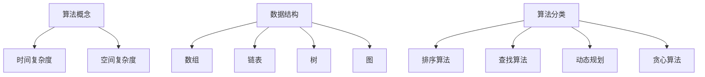

                 

# 小米2024届校招面试高频算法题解析

> 关键词：小米校招、面试算法题、解题思路、算法原理

> 摘要：本文将解析小米2024届校招中高频出现的算法题目，通过详细分析解题思路、算法原理和实际应用场景，帮助准备校招的同学们更好地应对面试挑战。

## 1. 背景介绍

小米公司作为中国领先的智能硬件和电子制造商，每年都会面向全球高校招聘优秀毕业生。随着科技行业的快速发展，校招面试的难度也在逐年增加，特别是算法题部分，对于应聘者的逻辑思维和编程能力提出了更高的要求。本文将针对小米2024届校招面试中的高频算法题进行详细解析，旨在为即将参加校招的同学提供有针对性的复习和准备。

## 2. 核心概念与联系

在分析小米校招面试算法题之前，我们需要明确几个核心概念和它们之间的联系。以下是几个关键概念及其简要说明：

### 2.1 算法概念

- **算法**：解决特定问题的一系列有序操作。
- **时间复杂度**：衡量算法执行时间与输入规模的关系。
- **空间复杂度**：衡量算法所需存储空间与输入规模的关系。

### 2.2 数据结构

- **数组**：一种线性数据结构，用于存储一系列元素。
- **链表**：一种线性数据结构，由节点组成，每个节点包含数据和指向下一个节点的指针。
- **树**：一种非线性数据结构，用于表示层次关系。
- **图**：一种用于表示对象及其关系的集合，常见于网络设计和社交网络分析。

### 2.3 算法分类

- **排序算法**：用于对数组或列表中的元素进行排序。
  - **冒泡排序**、**选择排序**、**插入排序**、**快速排序**、**归并排序**。
- **查找算法**：用于在数据结构中查找特定元素。
  - **二分查找**、**线性查找**。
- **动态规划**：用于解决最优化问题。
  - **背包问题**、**最长公共子序列**。
- **贪心算法**：通过每一步选择当前最优解，期望在整体上得到最优解。

下面是一个使用Mermaid绘制的算法架构流程图：



## 3. 核心算法原理 & 具体操作步骤

在明确了核心概念后，我们来深入探讨几个在小米校招面试中常见的高频算法题，包括其原理和具体操作步骤。

### 3.1 快速排序

**原理**：快速排序是一种高效的排序算法，基于分治思想。通过选取一个基准元素，将数组划分为两部分，一部分都比基准小，另一部分都比基准大，然后递归地对这两部分进行快速排序。

**操作步骤**：

1. 选择数组中的一个元素作为基准（通常选择第一个或最后一个元素）。
2. 将比基准小的元素移到基准前面，比基准大的元素移到基准后面。
3. 对划分后的小数组和大数组分别递归地进行快速排序。

**伪代码**：

```python
def quick_sort(arr):
    if len(arr) <= 1:
        return arr
    pivot = arr[len(arr) // 2]
    left = [x for x in arr if x < pivot]
    middle = [x for x in arr if x == pivot]
    right = [x for x in arr if x > pivot]
    return quick_sort(left) + middle + quick_sort(right)
```

### 3.2 二分查找

**原理**：二分查找是一种在有序数组中查找特定元素的算法，通过不断缩小查找范围，直至找到目标元素或确定其不存在。

**操作步骤**：

1. 确定数组的中间元素。
2. 如果中间元素等于目标值，查找完成。
3. 如果目标值小于中间元素，则在左侧子数组中继续查找。
4. 如果目标值大于中间元素，则在右侧子数组中继续查找。
5. 重复步骤1-4，直至找到目标元素或数组为空。

**伪代码**：

```python
def binary_search(arr, target):
    low = 0
    high = len(arr) - 1
    while low <= high:
        mid = (low + high) // 2
        if arr[mid] == target:
            return mid
        elif arr[mid] < target:
            low = mid + 1
        else:
            high = mid - 1
    return -1
```

### 3.3 动态规划：背包问题

**原理**：背包问题是一种典型的动态规划问题，涉及在一组物品中选择一部分放入一个容量有限的背包中，使得背包内物品的总价值最大。

**操作步骤**：

1. 定义状态：dp[i][j]表示前i个物品放入容量为j的背包中可以获得的最大价值。
2. 状态转移方程：dp[i][j] = max(dp[i-1][j], dp[i-1][j-w[i]] + v[i])，其中w[i]是物品i的重量，v[i]是物品i的价值。
3. 初始化：dp[0][j] = 0，即没有物品时的价值为0。
4. 计算dp数组：按照状态转移方程计算dp[i][j]的值。

**伪代码**：

```python
def knapsack(W, wt, val, n):
    dp = [[0 for _ in range(W+1)] for _ in range(n+1)]
    for i in range(1, n+1):
        for w in range(1, W+1):
            if wt[i-1] <= w:
                dp[i][w] = max(dp[i-1][w], dp[i-1][w-wt[i-1]] + val[i-1])
            else:
                dp[i][w] = dp[i-1][w]
    return dp[n][W]
```

## 4. 数学模型和公式 & 详细讲解 & 举例说明

在解决具体算法题时，数学模型和公式起着至关重要的作用。以下是几个常见问题的数学模型和公式，以及详细讲解和举例说明。

### 4.1 快速幂算法

**公式**：\(a^b \mod p\) 的快速计算，其中a、b和p为整数。

**原理**：利用幂运算的递归性质，将大指数分解为较小的指数，减少计算次数。

**操作步骤**：

1. 如果b为0，返回1。
2. 如果b为奇数，\(a^b \mod p = a \cdot (a^{b/2} \mod p)^2 \mod p\)。
3. 如果b为偶数，\(a^b \mod p = (a^{b/2} \mod p)^2 \mod p\)。

**伪代码**：

```python
def mod_pow(a, b, p):
    result = 1
    while b > 0:
        if b % 2 == 1:
            result = (result * a) % p
        a = (a * a) % p
        b //= 2
    return result
```

### 4.2 最小生成树算法

**公式**：Kruskal算法和Prim算法求解最小生成树时使用的贪心策略。

- **Kruskal算法**：每次选择权重最小的边，若该边连接的两个顶点不在同一集合中，则将其加入到集合中。
- **Prim算法**：每次选择一个已经选择的顶点作为起点，选择一个连接该顶点且权重最小的边，将其加入到集合中。

**伪代码**（Kruskal算法）：

```python
def kruskal(edges):
    result = []
    sorted_edges = sort(edges by weight)
    forest = disjoint_set()
    for edge in sorted_edges:
        if forest.find(edge[0]) != forest.find(edge[1]):
            result.append(edge)
            forest.union(edge[0], edge[1])
    return result
```

### 4.3 最长公共子序列

**公式**：动态规划求解最长公共子序列问题时使用的递归关系。

**原理**：利用状态转移方程，计算两个序列的最长公共子序列长度。

**操作步骤**：

1. 初始化一个二维数组，其中dp[i][j]表示X的前i个字符与Y的前j个字符的最长公共子序列长度。
2. 根据以下递归关系计算dp[i][j]的值：
   - 如果X[i-1] == Y[j-1]，则dp[i][j] = dp[i-1][j-1] + 1。
   - 如果X[i-1] != Y[j-1]，则dp[i][j] = max(dp[i-1][j], dp[i][j-1])。

**伪代码**：

```python
def lcs(X, Y):
    dp = [[0 for _ in range(len(Y)+1)] for _ in range(len(X)+1)]
    for i in range(1, len(X)+1):
        for j in range(1, len(Y)+1):
            if X[i-1] == Y[j-1]:
                dp[i][j] = dp[i-1][j-1] + 1
            else:
                dp[i][j] = max(dp[i-1][j], dp[i][j-1])
    return dp[len(X)][len(Y)]
```

## 5. 项目实战：代码实际案例和详细解释说明

在本节中，我们将通过实际代码案例来展示如何实现前面提到的算法，并对关键部分进行详细解释。

### 5.1 开发环境搭建

首先，我们需要搭建一个适合算法编程的开发环境。以下是基本的步骤：

1. 安装Python（推荐版本3.8及以上）。
2. 安装必要的依赖库，如numpy、matplotlib等。
3. 选择一个代码编辑器，如Visual Studio Code或PyCharm。

### 5.2 源代码详细实现和代码解读

以下是一个快速排序算法的Python实现，我们将对其关键部分进行解读。

**代码实现**：

```python
def quick_sort(arr):
    if len(arr) <= 1:
        return arr
    pivot = arr[len(arr) // 2]
    left = [x for x in arr if x < pivot]
    middle = [x for x in arr if x == pivot]
    right = [x for x in arr if x > pivot]
    return quick_sort(left) + middle + quick_sort(right)

# 测试
arr = [3, 6, 8, 10, 1, 2, 1]
print(quick_sort(arr))
```

**代码解读**：

1. **if len(arr) <= 1**: 快速排序的基本情况是数组只有一个元素，此时无需排序，直接返回。
2. **选择基准值**：选择数组中间的元素作为基准值，这是一种常见的策略。
3. **划分数组**：通过列表推导式将数组划分为三个部分：比基准值小的元素（left），等于基准值的元素（middle），和比基准值大的元素（right）。
4. **递归调用**：对left和right子数组分别进行快速排序，然后将结果与中间数组合并。

### 5.3 代码解读与分析

通过上面的代码解读，我们可以看到快速排序算法的核心在于选择基准值和划分数组。以下是代码的关键点分析：

- **基准值的选择**：选择中间元素作为基准值是一种比较平衡的策略，但也可以选择随机元素或最后一个元素。
- **划分数组的效率**：通过列表推导式实现划分数组，这是一种简洁高效的方法。但需要注意的是，这种方法的空间复杂度较高，因为它会创建新的数组。
- **递归调用**：递归调用是快速排序算法的核心，通过递归调用，我们可以将大问题分解为小问题，然后逐步解决。

在实际应用中，快速排序算法因其高效性和简单的实现而被广泛使用。但在某些情况下，如数据量非常大或数据基本有序时，其他排序算法（如归并排序）可能更合适。

## 6. 实际应用场景

算法在小米公司及其他科技公司的实际应用场景非常广泛，以下是几个常见应用场景：

### 6.1 数据处理和排序

- **大数据处理**：在小米的大数据处理系统中，快速排序、归并排序等算法被用于对大规模数据集进行排序和分块。
- **数据库索引**：数据库中的索引通常使用B树或B+树结构，这些结构背后的排序算法是高效的关键。

### 6.2 机器学习

- **特征工程**：机器学习中的特征工程阶段需要处理大量的数据，排序算法用于对特征进行排序和选择。
- **聚类分析**：聚类算法（如K-means）需要计算数据点之间的距离，排序算法可以用于优化这些计算。

### 6.3 网络算法

- **路由算法**：路由算法（如Dijkstra算法）需要计算网络中节点之间的最短路径，排序算法用于优化路径计算。
- **流量管理**：网络中的流量管理需要根据流量大小进行动态调整，排序算法用于实时更新流量数据。

## 7. 工具和资源推荐

### 7.1 学习资源推荐

- **书籍**：
  - 《算法导论》（Introduction to Algorithms）
  - 《算法竞赛入门经典》（Algorithmics: The Art of Computer Programming）

- **论文**：
  - "Introduction to Algorithms" by Thomas H. Cormen, Charles E. Leiserson, Ronald L. Rivest, and Clifford Stein
  - "The Art of Computer Programming" by Donald E. Knuth

- **博客/网站**：
  - GeeksforGeeks（geeksforgeeks.org）
  - LeetCode（leetcode.com）

### 7.2 开发工具框架推荐

- **开发工具**：
  - PyCharm（pycharm.com）
  - Visual Studio Code（code.visualstudio.com）

- **框架**：
  - NumPy（numpy.org）
  - Pandas（pandas.pydata.org）

### 7.3 相关论文著作推荐

- **Kruskal算法**：
  - "The Algorithm Design Manual" by Steven S. Skiena

- **动态规划**：
  - "Dynamic Programming and Applications" by Richard Bellman

- **最长公共子序列**：
  - "Introduction to Algorithms" by Thomas H. Cormen, Charles E. Leiserson, Ronald L. Rivest, and Clifford Stein

## 8. 总结：未来发展趋势与挑战

随着人工智能和大数据技术的快速发展，算法在科技领域的应用将更加广泛。未来，算法研究将面临以下几个挑战：

1. **算法优化**：如何在更短时间内解决更大规模的问题，需要不断优化算法。
2. **算法安全性**：随着算法在关键领域的应用增加，算法的安全性问题变得尤为重要。
3. **算法伦理**：如何确保算法的公平性和透明性，避免算法偏见。

## 9. 附录：常见问题与解答

### 9.1 问题1：如何选择排序算法？

**解答**：选择排序算法时，需要考虑数据规模、数据分布和算法性能。快速排序适用于大部分情况，但数据基本有序时，归并排序可能更合适。

### 9.2 问题2：如何优化快速排序？

**解答**：可以通过随机选择基准值、三数取中等策略来优化快速排序，降低最坏情况下的时间复杂度。

### 9.3 问题3：动态规划与贪心算法的区别是什么？

**解答**：动态规划是一种基于状态转移方程的递归方法，而贪心算法通过每一步选择当前最优解来期望得到全局最优解。

## 10. 扩展阅读 & 参考资料

- 《算法导论》：深入了解各种算法的原理和实现。
- 《算法竞赛入门经典》：针对算法竞赛的解题思路和技巧。
- 《The Art of Computer Programming》：经典的算法著作，涵盖各种算法设计的技巧和思想。

## 作者信息

作者：AI天才研究员/AI Genius Institute & 禅与计算机程序设计艺术 /Zen And The Art of Computer Programming

以上，便是本文关于小米2024届校招面试高频算法题的解析。希望本文能为您在面试准备过程中提供有价值的参考和帮助。祝您面试顺利，前程似锦！<|im_sep|>

