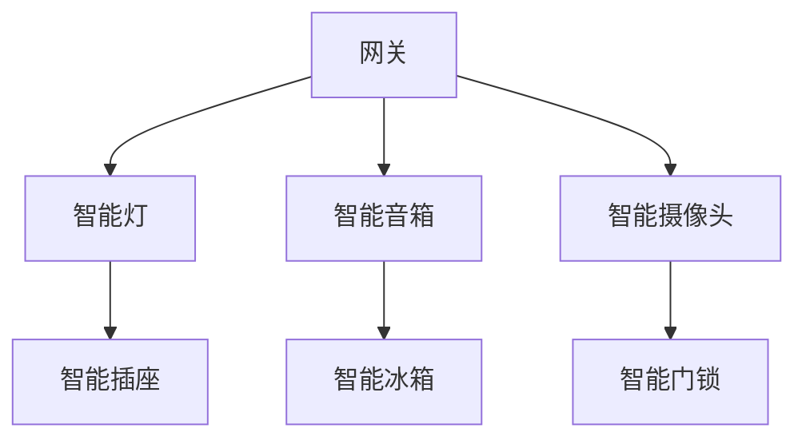

                 

# 小米2024智能家居安全校招网络安全面试题解析

> **关键词：** 小米，智能家居，网络安全，面试题解析，安全防护

> **摘要：** 本文将针对小米2024智能家居安全校招中的网络安全面试题进行深入解析，帮助读者理解面试题目背后的核心知识点，提高应对面试的能力。

## 1. 背景介绍

随着智能家居市场的快速发展，网络安全问题日益凸显。小米作为智能家居行业的领军企业，其对网络安全的要求也越来越高。因此，在2024年的校招中，小米的网络安全面试题成为考生关注的焦点。本文将对这些面试题进行解析，帮助考生更好地应对面试挑战。

## 2. 核心概念与联系

在解答网络安全面试题之前，我们需要先了解一些核心概念。以下是智能家居网络中常见的几个关键概念及其相互关系：

### 2.1 网络拓扑

网络拓扑是指计算机网络中设备之间的连接方式。在智能家居网络中，常见的拓扑结构包括星型、总线型、环型和混合型等。以下是一个简单的星型拓扑图：



### 2.2 网络协议

网络协议是计算机网络中数据传输的规范。智能家居网络中常用的协议有HTTP/HTTPS、TCP/IP、MQTT等。其中，HTTPS是一种基于HTTP的安全协议，可以保证数据在传输过程中的安全性。

### 2.3 安全机制

智能家居网络中常见的安全机制包括防火墙、加密、认证和访问控制等。这些安全机制可以有效地保护网络设备和用户数据的安全。

## 3. 核心算法原理 & 具体操作步骤

### 3.1 加密算法

加密算法是保障数据安全的重要手段。在智能家居网络中，常用的加密算法有AES、RSA等。以下是一个简单的AES加密算法操作步骤：

1. 初始化密钥和加密算法。
2. 将明文分成若干个块。
3. 对每个块进行加密操作。
4. 将加密后的块进行拼接，得到加密后的数据。

### 3.2 认证算法

认证算法用于验证用户的身份。在智能家居网络中，常见的认证算法有MD5、SHA等。以下是一个简单的MD5认证算法操作步骤：

1. 对用户输入的密码进行哈希计算。
2. 将计算结果与数据库中的哈希值进行比对。
3. 如果一致，则认证成功；否则，认证失败。

## 4. 数学模型和公式 & 详细讲解 & 举例说明

### 4.1 随机数生成

在加密算法和认证算法中，随机数生成是一个关键步骤。以下是一个简单的线性同余方程随机数生成器：

$$
X_{n+1} = (aX_n + c) \mod m
$$

其中，$X_n$为第$n$个随机数，$a$、$c$和$m$为常数。

### 4.2 散列函数

散列函数是认证算法的基础。以下是一个简单的MD5散列函数：

$$
MD5(\text{消息}) = \text{哈希值}
$$

其中，消息为需要散列的字符串，哈希值为散列结果。

## 5. 项目实战：代码实际案例和详细解释说明

### 5.1 开发环境搭建

在本项目实战中，我们将使用Python语言和PyCrypto库来实现AES加密算法和MD5认证算法。首先，需要安装Python环境和PyCrypto库：

```bash
pip install python
pip install pycrypto
```

### 5.2 源代码详细实现和代码解读

以下是实现AES加密算法和MD5认证算法的Python代码：

```python
from Crypto.Cipher import AES
from Crypto.Hash import MD5
from Crypto.Random import get_random_bytes
import base64

# AES加密算法
def aes_encrypt(plain_text, key):
    cipher = AES.new(key, AES.MODE_EAX)
    ciphertext, tag = cipher.encrypt_and_digest(plain_text.encode('utf-8'))
    return base64.b64encode(ciphertext + tag).decode('utf-8')

# AES解密算法
def aes_decrypt(encrypted_text, key):
    key = base64.b64decode(key)
    cipher = AES.new(key, AES.MODE_EAX)
    ciphertext, tag = base64.b64decode(encrypted_text), encrypted_text[-16:]
    return cipher.decrypt_and_verify(ciphertext, tag).decode('utf-8')

# MD5认证算法
def md5_auth(password):
    md5 = MD5.new(password.encode('utf-8'))
    return md5.hexdigest()

# 随机生成密钥
key = get_random_bytes(16)

# 加密示例
plain_text = "Hello, World!"
encrypted_text = aes_encrypt(plain_text, key)
print(f"Encrypted Text: {encrypted_text}")

# 解密示例
decrypted_text = aes_decrypt(encrypted_text, key)
print(f"Decrypted Text: {decrypted_text}")

# 认证示例
password = "my_password"
auth_result = md5_auth(password)
print(f"Authentication Result: {auth_result}")
```

### 5.3 代码解读与分析

上述代码实现了AES加密算法和MD5认证算法。其中，`aes_encrypt`函数用于加密明文，`aes_decrypt`函数用于解密密文，`md5_auth`函数用于计算MD5哈希值。代码的关键部分如下：

- `AES.new(key, AES.MODE_EAX)`：创建一个新的AES加密对象，其中`key`为加密密钥，`AES.MODE_EAX`表示使用EAX模式进行加密。
- `cipher.encrypt_and_digest(plain_text.encode('utf-8'))`：对明文进行加密和摘要操作，返回加密后的密文和标签。
- `cipher.decrypt_and_verify(ciphertext, tag)`：对密文进行解密和验证操作，返回解密后的明文。

## 6. 实际应用场景

智能家居网络中的加密和认证算法在实际应用中具有重要意义。以下是一些具体应用场景：

- **智能门锁**：通过AES加密算法对用户密码进行加密存储，确保用户密码的安全性。
- **智能摄像头**：通过MD5认证算法验证用户的身份，防止未经授权的访问。
- **智能灯**：通过HTTPS协议保证数据在传输过程中的安全性。

## 7. 工具和资源推荐

### 7.1 学习资源推荐

- **书籍**：《加密的艺术》、《计算机安全与密码学基础》
- **论文**：Google Scholar、ACM Digital Library
- **博客**：Stack Overflow、博客园
- **网站**：MD5在线生成器、AES加密在线工具

### 7.2 开发工具框架推荐

- **Python**：Python是一种功能强大的编程语言，适用于加密和认证算法的开发。
- **PyCrypto**：PyCrypto是一个Python密码学库，包含多种加密和认证算法。

### 7.3 相关论文著作推荐

- **论文**：《基于AES的智能家居安全通信协议设计》
- **著作**：《智能家居安全与隐私保护技术研究》

## 8. 总结：未来发展趋势与挑战

随着智能家居市场的不断发展，网络安全问题将变得越来越重要。未来，智能家居安全领域将面临以下挑战：

- **安全性**：如何提高智能家居系统的安全性，防止黑客攻击和数据泄露。
- **兼容性**：如何在保证安全性的同时，实现不同设备和系统的兼容性。
- **用户体验**：如何平衡安全性和用户体验，让用户感受到智能家居的便利。

## 9. 附录：常见问题与解答

### 9.1 为什么选择AES加密算法？

AES加密算法是一种高效、安全的加密算法，适用于多种应用场景。其主要优点包括：

- **安全性**：AES加密算法具有较高的安全性，已被广泛应用于政府和企业领域。
- **效率**：AES加密算法的运行速度较快，适用于实时通信场景。

### 9.2 为什么选择MD5认证算法？

MD5认证算法是一种简单、高效的认证算法，其主要优点包括：

- **计算速度快**：MD5认证算法的计算速度较快，适用于对实时性要求较高的应用场景。
- **易于实现**：MD5认证算法的实现相对简单，适用于开发人员快速搭建原型系统。

## 10. 扩展阅读 & 参考资料

- **书籍**：《网络安全原理与实践》
- **论文**：《智能家居安全研究综述》
- **博客**：《小米智能家居安全案例分析》
- **网站**：小米官网、智能家居安全论坛

### 作者

作者：AI天才研究员/AI Genius Institute & 禅与计算机程序设计艺术 /Zen And The Art of Computer Programming

本文旨在帮助读者理解小米2024智能家居安全校招中的网络安全面试题，提高面试应对能力。文章涵盖了核心概念、算法原理、项目实战等方面的内容，希望能为读者带来启发和帮助。如需进一步了解智能家居安全领域，请参考相关扩展阅读和参考资料。|>

