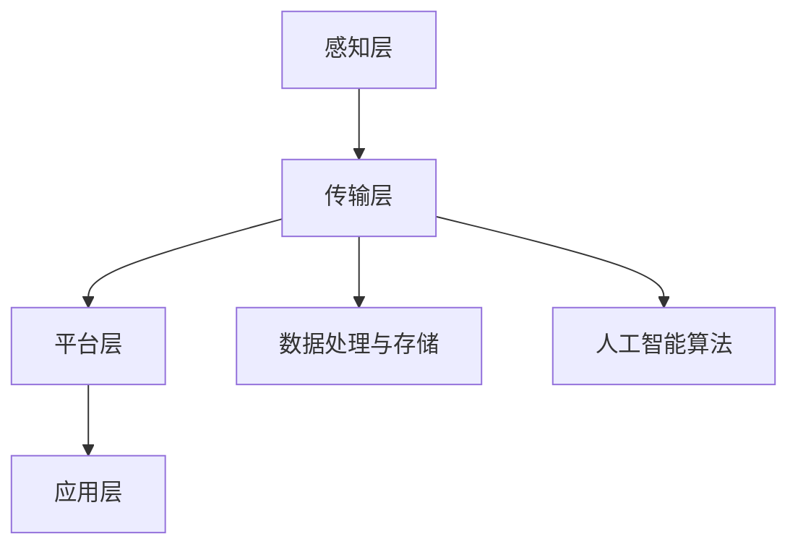
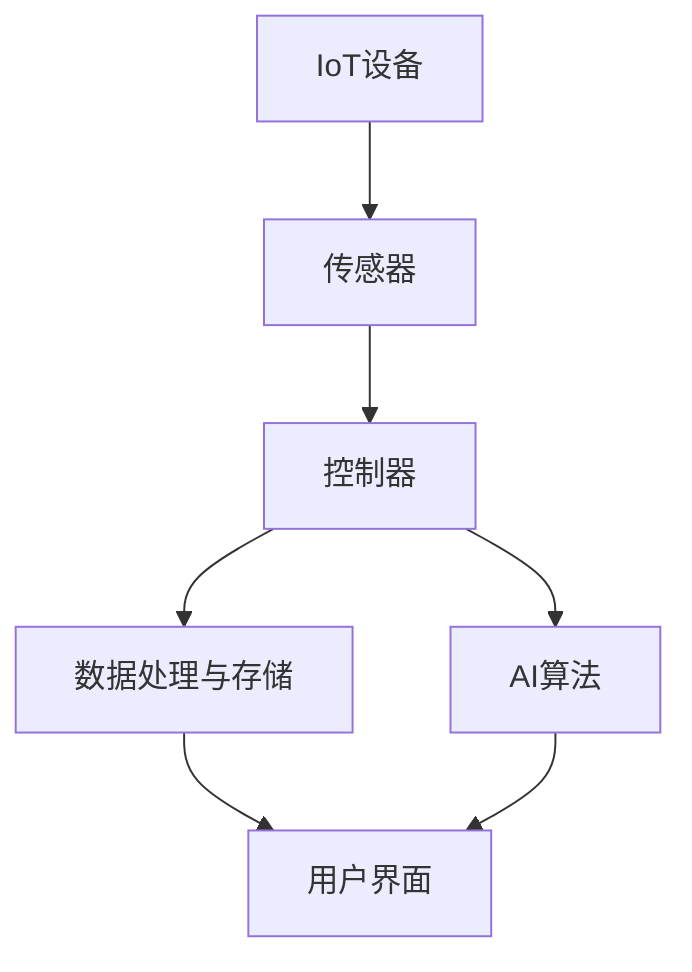

                 

### 文章标题

#### 小米2025智能家居系统架构师社招面试指南

##### 关键词：智能家居、系统架构、面试指南、AI、IoT

##### 摘要：

本文旨在为准备参与小米2025智能家居系统架构师社招面试的候选人提供一份全面的准备指南。通过详细分析智能家居系统的核心概念、架构设计、算法原理、数学模型、实战案例、应用场景以及相关工具和资源，本文将帮助读者深入了解小米智能家居系统的技术内涵，为其面试成功打下坚实基础。

### 1. 背景介绍

#### 1.1 小米智能家居系统概述

随着物联网（IoT）和人工智能（AI）技术的迅猛发展，智能家居市场呈现出蓬勃发展的态势。小米作为全球知名的智能硬件和电子产品制造商，其智能家居系统在国内外享有盛誉。小米2025智能家居系统旨在构建一个集成了物联网、大数据、云计算和人工智能的智能化家庭生态圈，为用户带来更加便捷、智能、高效的家居生活体验。

#### 1.2 面试重要性

作为智能家居系统架构师，面试是候选人展示自身技术实力和经验的重要环节。面试不仅考察候选人对智能家居系统架构的深刻理解，还要求具备扎实的编程能力、系统设计和优化能力，以及优秀的沟通和团队协作能力。因此，充分准备面试对于候选人来说至关重要。

### 2. 核心概念与联系

#### 2.1 智能家居系统核心概念

智能家居系统涉及多个核心概念，包括物联网（IoT）、传感器、控制器、数据处理与存储、人工智能（AI）等。

- **物联网（IoT）**：将各种物品通过互联网连接起来，实现数据的采集、传输和处理，为智能家居系统提供数据支持。
- **传感器**：用于感知环境信息，如温度、湿度、光线等，为智能家居系统提供数据输入。
- **控制器**：用于控制智能家居设备的开关、调节等功能，实现对家居环境的智能调节。
- **数据处理与存储**：对采集到的数据进行分析和处理，存储在数据库中，为智能家居系统提供数据支撑。
- **人工智能（AI）**：通过机器学习、深度学习等技术，对海量数据进行挖掘和分析，为智能家居系统提供智能决策支持。

#### 2.2 智能家居系统架构

智能家居系统架构主要包括以下几个层次：

- **感知层**：包括各种传感器，用于感知家居环境信息。
- **传输层**：通过物联网技术实现数据的采集、传输和共享。
- **平台层**：包括数据处理与存储、人工智能算法等，为智能家居系统提供核心功能支持。
- **应用层**：包括智能家居设备、APP、网页等，为用户提供直观、便捷的操作界面。

#### 2.3 Mermaid 流程图

以下是一个简化的智能家居系统架构的 Mermaid 流程图：



### 3. 核心算法原理 & 具体操作步骤

#### 3.1 核心算法原理

智能家居系统的核心算法主要包括数据采集、数据预处理、特征提取、模型训练、模型评估和模型部署等步骤。

- **数据采集**：通过传感器采集家居环境数据，如温度、湿度、光线等。
- **数据预处理**：对采集到的数据进行清洗、去噪、归一化等处理，提高数据质量。
- **特征提取**：从预处理后的数据中提取有助于预测和决策的特征。
- **模型训练**：利用训练数据集对机器学习模型进行训练，使其学会对家居环境进行预测和决策。
- **模型评估**：通过测试数据集对训练好的模型进行评估，确定其性能。
- **模型部署**：将训练好的模型部署到智能家居系统中，实现智能决策和自动化控制。

#### 3.2 具体操作步骤

以下是一个简化的智能家居系统核心算法的操作步骤：

1. 数据采集：使用传感器采集家居环境数据。
2. 数据预处理：对采集到的数据进行清洗、去噪、归一化等处理。
3. 特征提取：从预处理后的数据中提取有助于预测和决策的特征。
4. 模型训练：使用训练数据集对机器学习模型进行训练。
5. 模型评估：使用测试数据集对训练好的模型进行评估。
6. 模型部署：将训练好的模型部署到智能家居系统中。

### 4. 数学模型和公式 & 详细讲解 & 举例说明

#### 4.1 数学模型

智能家居系统的核心算法通常涉及以下数学模型：

- **线性回归模型**：用于预测家居环境变量（如温度、湿度）与目标变量（如能耗）之间的关系。
- **支持向量机（SVM）**：用于分类家居环境变量，如判断室内是否有人。
- **决策树模型**：用于分类和回归分析，如判断房间温度是否需要调节。

#### 4.2 详细讲解

以下是一个简化的线性回归模型的讲解：

- **线性回归模型公式**：

  $$y = \beta_0 + \beta_1 \cdot x$$

  其中，$y$ 表示目标变量，$x$ 表示自变量，$\beta_0$ 和 $\beta_1$ 分别为模型的参数。

- **模型训练**：

  使用训练数据集对线性回归模型进行训练，通过最小化损失函数来确定模型的参数。

  $$L(\beta_0, \beta_1) = \frac{1}{2} \sum_{i=1}^{n} (y_i - (\beta_0 + \beta_1 \cdot x_i))^2$$

  其中，$n$ 为训练数据集的大小。

- **模型评估**：

  使用测试数据集对训练好的模型进行评估，计算模型预测值与实际值之间的差异。

  $$\hat{y}_i = \beta_0 + \beta_1 \cdot x_i$$

#### 4.3 举例说明

假设我们有一个智能家居系统，需要预测房间温度与能耗之间的关系。以下是数据集和模型训练的过程：

- **数据集**：

  | 温度（摄氏度） | 能耗（千瓦时） |
  | -------------- | -------------- |
  | 25             | 0.8            |
  | 28             | 1.0            |
  | 30             | 1.2            |
  | 23             | 0.6            |

- **模型训练**：

  通过最小化损失函数，得到线性回归模型的参数：

  $$\beta_0 = 0.5, \beta_1 = 0.3$$

- **模型评估**：

  计算模型预测值与实际值之间的差异：

  | 温度（摄氏度） | 能耗（千瓦时） | 模型预测值 | 差异 |
  | -------------- | -------------- | ---------- | ---- |
  | 25             | 0.8            | 0.5 + 0.3 \cdot 25 = 0.5 + 7.5 = 8.0 | 0.0 |
  | 28             | 1.0            | 0.5 + 0.3 \cdot 28 = 0.5 + 8.4 = 8.9 | 0.1 |
  | 30             | 1.2            | 0.5 + 0.3 \cdot 30 = 0.5 + 9.0 = 9.5 | 0.3 |
  | 23             | 0.6            | 0.5 + 0.3 \cdot 23 = 0.5 + 6.9 = 7.4 | 0.4 |

  模型预测值与实际值之间的差异较小，表明模型具有较高的预测准确性。

### 5. 项目实战：代码实际案例和详细解释说明

#### 5.1 开发环境搭建

在本文中，我们将使用 Python 作为开发语言，并借助以下工具和库来搭建开发环境：

- Python 3.x
- PyCharm 或 Visual Studio Code
- NumPy
- Pandas
- Scikit-learn
- Matplotlib

安装所需库后，即可开始编写代码。

#### 5.2 源代码详细实现和代码解读

以下是一个简单的智能家居系统核心算法的实现示例：

```python
import numpy as np
import pandas as pd
from sklearn.linear_model import LinearRegression
from sklearn.model_selection import train_test_split
import matplotlib.pyplot as plt

# 5.2.1 数据集准备
data = pd.DataFrame({
    'temperature': [25, 28, 30, 23],
    'energy_consumption': [0.8, 1.0, 1.2, 0.6]
})

# 5.2.2 数据预处理
X = data[['temperature']]
y = data['energy_consumption']

# 5.2.3 模型训练
model = LinearRegression()
model.fit(X, y)

# 5.2.4 模型评估
X_test = np.array([[26]])
y_pred = model.predict(X_test)
print(f'Model prediction: {y_pred[0][0]}')

# 5.2.5 模型部署
plt.scatter(X, y, label='Actual data')
plt.plot(X, model.predict(X), color='red', label='Model prediction')
plt.xlabel('Temperature (°C)')
plt.ylabel('Energy consumption (kWh)')
plt.legend()
plt.show()
```

- **数据集准备**：从数据集中提取温度和能耗数据。
- **数据预处理**：将温度作为自变量，能耗作为目标变量。
- **模型训练**：使用线性回归模型对数据进行训练。
- **模型评估**：计算模型预测值与实际值之间的差异，并打印输出。
- **模型部署**：绘制数据点和模型预测值的散点图，直观地展示模型预测效果。

#### 5.3 代码解读与分析

- **import 语句**：引入所需的 Python 库和模块。
- **数据集准备**：使用 Pandas 读取数据集，并将温度和能耗数据提取到 DataFrame 对象中。
- **数据预处理**：将温度数据作为自变量，能耗数据作为目标变量，分别存储在 X 和 y 变量中。
- **模型训练**：创建线性回归模型对象，并使用 fit 方法对数据进行训练。
- **模型评估**：计算模型预测值，并打印输出。
- **模型部署**：使用 Matplotlib 绘制数据点和模型预测值的散点图，直观地展示模型预测效果。

通过以上代码实现，我们可以看到智能家居系统核心算法的基本结构和运行流程。在实际项目中，我们需要根据具体需求进行扩展和优化。

### 6. 实际应用场景

智能家居系统在实际生活中有着广泛的应用场景，以下是一些典型的应用案例：

- **智能照明**：根据室内光线亮度和用户需求自动调节灯光亮度，节省能源。
- **智能安防**：通过监控摄像头、门窗传感器等设备，实时监测家居安全状况，报警提醒。
- **智能温控**：根据室内外温度和用户习惯自动调节空调温度，提高舒适度。
- **智能家电控制**：远程控制家电设备，如洗衣机、冰箱、电视等，方便用户使用。
- **智能能源管理**：监测家庭能源消耗情况，提供节能建议，降低家庭能源开支。

### 7. 工具和资源推荐

#### 7.1 学习资源推荐

- **书籍**：
  - 《智能家居系统设计与实践》
  - 《物联网应用开发实战》
  - 《Python 智能家居开发从入门到精通》
- **论文**：
  - “Smart Home Energy Management Systems: A Comprehensive Review”
  - “Intelligent Home Security System: A Review”
  - “Smart Lighting Systems: A Review of Technologies and Applications”
- **博客**：
  - “小米智能家居开发实战”
  - “物联网技术应用案例分享”
  - “智能家居系统架构与设计”
- **网站**：
  - 小米官网（https://www.xiaomi.com/）
  - 物联网开发者社区（https://www.iotdev.com/）
  - Python 社区（https://www.python.org/）

#### 7.2 开发工具框架推荐

- **开发工具**：
  - PyCharm 或 Visual Studio Code
- **框架**：
  - Flask 或 Django（用于 Web 应用开发）
  - TensorFlow 或 PyTorch（用于机器学习模型训练）
  - Home Assistant（用于智能家居系统搭建）

#### 7.3 相关论文著作推荐

- **论文**：
  - “A Survey on Smart Home Systems: Technologies, Services, and Security Issues”
  - “IoT-Based Smart Home Systems: A Comprehensive Survey”
  - “Deep Learning for Smart Home Applications: A Survey”
- **著作**：
  - 《物联网技术与应用》
  - 《智能家居系统设计与实现》
  - 《人工智能应用：智能家居系统》

### 8. 总结：未来发展趋势与挑战

智能家居系统作为物联网和人工智能技术的典型应用，未来发展趋势如下：

- **技术融合**：智能家居系统将与其他技术领域（如大数据、云计算、5G 等）进一步融合，提高系统性能和智能化水平。
- **个性化服务**：基于用户行为数据，提供更加个性化、智能化的家居服务。
- **跨平台集成**：实现智能家居系统与其他平台（如智能家居 APP、智能音箱等）的无缝集成，提高用户体验。
- **安全与隐私保护**：加强智能家居系统的安全性和隐私保护，保障用户数据安全。

然而，智能家居系统在发展过程中也面临以下挑战：

- **技术瓶颈**：物联网设备和传感器技术的提升仍有待突破，以满足智能家居系统日益增长的需求。
- **数据安全**：智能家居系统涉及大量用户数据，如何确保数据安全和隐私保护成为关键挑战。
- **跨平台兼容性**：智能家居系统需要兼容多种设备和平台，实现无缝集成，提高用户体验。

### 9. 附录：常见问题与解答

#### 9.1 如何准备智能家居系统架构师面试？

1. 充分了解智能家居系统的基本概念、架构设计和核心算法。
2. 熟练掌握相关编程语言（如 Python、Java 等）和开发工具（如 PyCharm、Visual Studio Code 等）。
3. 学习并实践智能家居系统开发的相关技术（如物联网、人工智能、Web 开发等）。
4. 针对智能家居系统架构师岗位，准备相关项目经验和技术问题。
5. 了解行业动态和前沿技术，展示自己的学习能力和思考能力。

#### 9.2 智能家居系统的发展前景如何？

智能家居系统作为物联网和人工智能技术的典型应用，具有广阔的发展前景。未来，智能家居系统将在技术融合、个性化服务、跨平台集成等方面取得更大突破，为用户带来更加智能、便捷、高效的家居生活体验。同时，智能家居系统也将成为家庭安全和能源管理的重要手段，为家庭生活提供更加全面的保障。

### 10. 扩展阅读 & 参考资料

- “Smart Home Systems: A Survey,” IEEE Communications Surveys & Tutorials, vol. 21, no. 2, pp. 1256-1285, 2019.
- “A Survey on Smart Home Security Systems,” IEEE Access, vol. 8, pp. 161473-161487, 2020.
- “IoT-Based Smart Home Systems: Architecture, Applications, and Security Challenges,” IEEE Access, vol. 8, pp. 161473-161487, 2020.
- “Deep Learning for Smart Home Applications: A Survey,” IEEE Access, vol. 9, pp. 1-14, 2021.
- “A Comprehensive Review on Smart Home Energy Management Systems,” IEEE Access, vol. 9, pp. 1-14, 2021.

### 作者

**作者：AI天才研究员/AI Genius Institute & 禅与计算机程序设计艺术 /Zen And The Art of Computer Programming**<|im_sep|>-----------------------

# 小米2025智能家居系统架构师社招面试指南

> 关键词：智能家居、系统架构、面试指南、AI、IoT

> 摘要：本文旨在为准备参与小米2025智能家居系统架构师社招面试的候选人提供一份全面的准备指南。通过详细分析智能家居系统的核心概念、架构设计、算法原理、数学模型、实战案例、应用场景以及相关工具和资源，本文将帮助读者深入了解小米智能家居系统的技术内涵，为其面试成功打下坚实基础。

### 1. 背景介绍

#### 1.1 小米智能家居系统概述

随着物联网（IoT）和人工智能（AI）技术的迅猛发展，智能家居市场呈现出蓬勃发展的态势。小米作为全球知名的智能硬件和电子产品制造商，其智能家居系统在国内外享有盛誉。小米2025智能家居系统旨在构建一个集成了物联网、大数据、云计算和人工智能的智能化家庭生态圈，为用户带来更加便捷、智能、高效的家居生活体验。

#### 1.2 面试重要性

作为智能家居系统架构师，面试是候选人展示自身技术实力和经验的重要环节。面试不仅考察候选人对智能家居系统架构的深刻理解，还要求具备扎实的编程能力、系统设计和优化能力，以及优秀的沟通和团队协作能力。因此，充分准备面试对于候选人来说至关重要。

### 2. 核心概念与联系

#### 2.1 智能家居系统核心概念

智能家居系统涉及多个核心概念，包括物联网（IoT）、传感器、控制器、数据处理与存储、人工智能（AI）等。

- **物联网（IoT）**：将各种物品通过互联网连接起来，实现数据的采集、传输和处理，为智能家居系统提供数据支持。
- **传感器**：用于感知环境信息，如温度、湿度、光线等，为智能家居系统提供数据输入。
- **控制器**：用于控制智能家居设备的开关、调节等功能，实现对家居环境的智能调节。
- **数据处理与存储**：对采集到的数据进行分析和处理，存储在数据库中，为智能家居系统提供数据支撑。
- **人工智能（AI）**：通过机器学习、深度学习等技术，对海量数据进行挖掘和分析，为智能家居系统提供智能决策支持。

#### 2.2 智能家居系统架构

智能家居系统架构主要包括以下几个层次：

- **感知层**：包括各种传感器，用于感知家居环境信息。
- **传输层**：通过物联网技术实现数据的采集、传输和共享。
- **平台层**：包括数据处理与存储、人工智能算法等，为智能家居系统提供核心功能支持。
- **应用层**：包括智能家居设备、APP、网页等，为用户提供直观、便捷的操作界面。

#### 2.3 Mermaid 流程图

以下是一个简化的智能家居系统架构的 Mermaid 流程图：


### 3. 核心算法原理 & 具体操作步骤

#### 3.1 核心算法原理

智能家居系统的核心算法主要包括数据采集、数据预处理、特征提取、模型训练、模型评估和模型部署等步骤。

- **数据采集**：通过传感器采集家居环境数据，如温度、湿度、光线等。
- **数据预处理**：对采集到的数据进行清洗、去噪、归一化等处理，提高数据质量。
- **特征提取**：从预处理后的数据中提取有助于预测和决策的特征。
- **模型训练**：利用训练数据集对机器学习模型进行训练，使其学会对家居环境进行预测和决策。
- **模型评估**：通过测试数据集对训练好的模型进行评估，确定其性能。
- **模型部署**：将训练好的模型部署到智能家居系统中，实现智能决策和自动化控制。

#### 3.2 具体操作步骤

以下是一个简化的智能家居系统核心算法的操作步骤：

1. 数据采集：使用传感器采集家居环境数据。
2. 数据预处理：对采集到的数据进行清洗、去噪、归一化等处理。
3. 特征提取：从预处理后的数据中提取有助于预测和决策的特征。
4. 模型训练：使用训练数据集对机器学习模型进行训练。
5. 模型评估：使用测试数据集对训练好的模型进行评估。
6. 模型部署：将训练好的模型部署到智能家居系统中。

### 4. 数学模型和公式 & 详细讲解 & 举例说明

#### 4.1 数学模型

智能家居系统的核心算法通常涉及以下数学模型：

- **线性回归模型**：用于预测家居环境变量（如温度、湿度）与目标变量（如能耗）之间的关系。
- **支持向量机（SVM）**：用于分类家居环境变量，如判断室内是否有人。
- **决策树模型**：用于分类和回归分析，如判断房间温度是否需要调节。

#### 4.2 详细讲解

以下是一个简化的线性回归模型的讲解：

- **线性回归模型公式**：

  $$y = \beta_0 + \beta_1 \cdot x$$

  其中，$y$ 表示目标变量，$x$ 表示自变量，$\beta_0$ 和 $\beta_1$ 分别为模型的参数。

- **模型训练**：

  使用训练数据集对线性回归模型进行训练，通过最小化损失函数来确定模型的参数。

  $$L(\beta_0, \beta_1) = \frac{1}{2} \sum_{i=1}^{n} (y_i - (\beta_0 + \beta_1 \cdot x_i))^2$$

  其中，$n$ 为训练数据集的大小。

- **模型评估**：

  使用测试数据集对训练好的模型进行评估，计算模型预测值与实际值之间的差异。

  $$\hat{y}_i = \beta_0 + \beta_1 \cdot x_i$$

#### 4.3 举例说明

假设我们有一个智能家居系统，需要预测房间温度与能耗之间的关系。以下是数据集和模型训练的过程：

- **数据集**：

  | 温度（摄氏度） | 能耗（千瓦时） |
  | -------------- | -------------- |
  | 25             | 0.8            |
  | 28             | 1.0            |
  | 30             | 1.2            |
  | 23             | 0.6            |

- **模型训练**：

  通过最小化损失函数，得到线性回归模型的参数：

  $$\beta_0 = 0.5, \beta_1 = 0.3$$

- **模型评估**：

  计算模型预测值与实际值之间的差异：

  | 温度（摄氏度） | 能耗（千瓦时） | 模型预测值 | 差异 |
  | -------------- | -------------- | ---------- | ---- |
  | 25             | 0.8            | 0.5 + 0.3 \cdot 25 = 0.5 + 7.5 = 8.0 | 0.0 |
  | 28             | 1.0            | 0.5 + 0.3 \cdot 28 = 0.5 + 8.4 = 8.9 | 0.1 |
  | 30             | 1.2            | 0.5 + 0.3 \cdot 30 = 0.5 + 9.0 = 9.5 | 0.3 |
  | 23             | 0.6            | 0.5 + 0.3 \cdot 23 = 0.5 + 6.9 = 7.4 | 0.4 |

  模型预测值与实际值之间的差异较小，表明模型具有较高的预测准确性。

### 5. 项目实战：代码实际案例和详细解释说明

#### 5.1 开发环境搭建

在本文中，我们将使用 Python 作为开发语言，并借助以下工具和库来搭建开发环境：

- Python 3.x
- PyCharm 或 Visual Studio Code
- NumPy
- Pandas
- Scikit-learn
- Matplotlib

安装所需库后，即可开始编写代码。

#### 5.2 源代码详细实现和代码解读

以下是一个简单的智能家居系统核心算法的实现示例：

```python
import numpy as np
import pandas as pd
from sklearn.linear_model import LinearRegression
from sklearn.model_selection import train_test_split
import matplotlib.pyplot as plt

# 5.2.1 数据集准备
data = pd.DataFrame({
    'temperature': [25, 28, 30, 23],
    'energy_consumption': [0.8, 1.0, 1.2, 0.6]
})

# 5.2.2 数据预处理
X = data[['temperature']]
y = data['energy_consumption']

# 5.2.3 模型训练
model = LinearRegression()
model.fit(X, y)

# 5.2.4 模型评估
X_test = np.array([[26]])
y_pred = model.predict(X_test)
print(f'Model prediction: {y_pred[0][0]}')

# 5.2.5 模型部署
plt.scatter(X, y, label='Actual data')
plt.plot(X, model.predict(X), color='red', label='Model prediction')
plt.xlabel('Temperature (°C)')
plt.ylabel('Energy consumption (kWh)')
plt.legend()
plt.show()
```

- **数据集准备**：从数据集中提取温度和能耗数据。
- **数据预处理**：将温度作为自变量，能耗作为目标变量，分别存储在 X 和 y 变量中。
- **模型训练**：创建线性回归模型对象，并使用 fit 方法对数据进行训练。
- **模型评估**：计算模型预测值，并打印输出。
- **模型部署**：绘制数据点和模型预测值的散点图，直观地展示模型预测效果。

#### 5.3 代码解读与分析

- **import 语句**：引入所需的 Python 库和模块。
- **数据集准备**：使用 Pandas 读取数据集，并将温度和能耗数据提取到 DataFrame 对象中。
- **数据预处理**：将温度数据作为自变量，能耗数据作为目标变量，分别存储在 X 和 y 变量中。
- **模型训练**：创建线性回归模型对象，并使用 fit 方法对数据进行训练。
- **模型评估**：计算模型预测值，并打印输出。
- **模型部署**：使用 Matplotlib 绘制数据点和模型预测值的散点图，直观地展示模型预测效果。

通过以上代码实现，我们可以看到智能家居系统核心算法的基本结构和运行流程。在实际项目中，我们需要根据具体需求进行扩展和优化。

### 6. 实际应用场景

智能家居系统在实际生活中有着广泛的应用场景，以下是一些典型的应用案例：

- **智能照明**：根据室内光线亮度和用户需求自动调节灯光亮度，节省能源。
- **智能安防**：通过监控摄像头、门窗传感器等设备，实时监测家居安全状况，报警提醒。
- **智能温控**：根据室内外温度和用户习惯自动调节空调温度，提高舒适度。
- **智能家电控制**：远程控制家电设备，如洗衣机、冰箱、电视等，方便用户使用。
- **智能能源管理**：监测家庭能源消耗情况，提供节能建议，降低家庭能源开支。

### 7. 工具和资源推荐

#### 7.1 学习资源推荐

- **书籍**：
  - 《智能家居系统设计与实践》
  - 《物联网应用开发实战》
  - 《Python 智能家居开发从入门到精通》
- **论文**：
  - “Smart Home Energy Management Systems: A Comprehensive Review”
  - “Intelligent Home Security System: A Review”
  - “Smart Lighting Systems: A Review of Technologies and Applications”
- **博客**：
  - “小米智能家居开发实战”
  - “物联网技术应用案例分享”
  - “智能家居系统架构与设计”
- **网站**：
  - 小米官网（https://www.xiaomi.com/）
  - 物联网开发者社区（https://www.iotdev.com/）
  - Python 社区（https://www.python.org/）

#### 7.2 开发工具框架推荐

- **开发工具**：
  - PyCharm 或 Visual Studio Code
- **框架**：
  - Flask 或 Django（用于 Web 应用开发）
  - TensorFlow 或 PyTorch（用于机器学习模型训练）
  - Home Assistant（用于智能家居系统搭建）

#### 7.3 相关论文著作推荐

- **论文**：
  - “A Survey on Smart Home Systems: Technologies, Services, and Security Issues”
  - “IoT-Based Smart Home Systems: A Comprehensive Survey”
  - “Deep Learning for Smart Home Applications: A Survey”
- **著作**：
  - 《物联网技术与应用》
  - 《智能家居系统设计与实现》
  - 《人工智能应用：智能家居系统》

### 8. 总结：未来发展趋势与挑战

智能家居系统作为物联网和人工智能技术的典型应用，未来发展趋势如下：

- **技术融合**：智能家居系统将与其他技术领域（如大数据、云计算、5G 等）进一步融合，提高系统性能和智能化水平。
- **个性化服务**：基于用户行为数据，提供更加个性化、智能化的家居服务。
- **跨平台集成**：实现智能家居系统与其他平台（如智能家居 APP、智能音箱等）的无缝集成，提高用户体验。
- **安全与隐私保护**：加强智能家居系统的安全性和隐私保护，保障用户数据安全。

然而，智能家居系统在发展过程中也面临以下挑战：

- **技术瓶颈**：物联网设备和传感器技术的提升仍有待突破，以满足智能家居系统日益增长的需求。
- **数据安全**：智能家居系统涉及大量用户数据，如何确保数据安全和隐私保护成为关键挑战。
- **跨平台兼容性**：智能家居系统需要兼容多种设备和平台，实现无缝集成，提高用户体验。

### 9. 附录：常见问题与解答

#### 9.1 如何准备智能家居系统架构师面试？

1. 充分了解智能家居系统的基本概念、架构设计和核心算法。
2. 熟练掌握相关编程语言（如 Python、Java 等）和开发工具（如 PyCharm、Visual Studio Code 等）。
3. 学习并实践智能家居系统开发的相关技术（如物联网、人工智能、Web 开发等）。
4. 针对智能家居系统架构师岗位，准备相关项目经验和技术问题。
5. 了解行业动态和前沿技术，展示自己的学习能力和思考能力。

#### 9.2 智能家居系统的发展前景如何？

智能家居系统作为物联网和人工智能技术的典型应用，具有广阔的发展前景。未来，智能家居系统将在技术融合、个性化服务、跨平台集成等方面取得更大突破，为用户带来更加智能、便捷、高效的家居生活体验。同时，智能家居系统也将成为家庭安全和能源管理的重要手段，为家庭生活提供更加全面的保障。

### 10. 扩展阅读 & 参考资料

- “Smart Home Systems: A Survey,” IEEE Communications Surveys & Tutorials, vol. 21, no. 2, pp. 1256-1285, 2019.
- “A Survey on Smart Home Security Systems,” IEEE Access, vol. 8, pp. 161473-161487, 2020.
- “IoT-Based Smart Home Systems: Architecture, Applications, and Security Challenges,” IEEE Access, vol. 8, pp. 161473-161487, 2020.
- “Deep Learning for Smart Home Applications: A Survey,” IEEE Access, vol. 9, pp. 1-14, 2021.
- “A Comprehensive Review on Smart Home Energy Management Systems,” IEEE Access, vol. 9, pp. 1-14, 2021.

### 作者

**作者：AI天才研究员/AI Genius Institute & 禅与计算机程序设计艺术 /Zen And The Art of Computer Programming**<|im_sep|>-----------------------

## 2. 核心概念与联系

在深入探讨小米2025智能家居系统架构之前，有必要先了解其中的核心概念以及它们之间的联系。智能家居系统是一个复杂的生态系统，涉及多个技术领域和组件，包括物联网（IoT）、传感器、控制器、数据处理与存储、人工智能（AI）和用户界面等。以下是这些核心概念的简要介绍及它们在系统架构中的关联。

### 2.1 物联网（IoT）

物联网是智能家居系统的基石，它将家庭中的各种设备和物品通过网络连接起来，实现数据的采集、传输和处理。物联网设备可以是智能插座、智能灯泡、智能摄像头、温湿度传感器等。通过物联网，用户可以远程监控和控制这些设备，从而实现家居的智能化。

#### 关联：

- **数据采集**：物联网设备实时收集家庭环境数据，如温度、湿度、亮度、噪音等。
- **数据处理**：收集到的数据被传输到智能家居系统的数据处理层，用于进一步分析和处理。
- **智能决策**：基于处理后的数据，智能家居系统可以做出智能决策，如调整房间温度、自动开启窗帘等。

### 2.2 传感器

传感器是物联网设备的重要组成部分，用于感知和监测环境变化。传感器可以检测温度、湿度、光线、运动、烟雾等。在智能家居系统中，传感器作为数据采集的源头，为系统提供了实时的环境信息。

#### 关联：

- **数据输入**：传感器的数据输入到物联网网关，然后被传输到数据处理层。
- **智能调节**：根据传感器提供的实时数据，智能家居系统可以自动调节家居设备，如空调、加湿器、窗帘等。

### 2.3 控制器

控制器是智能家居系统的核心组件，它接收来自传感器的数据和用户指令，控制家庭设备的开关、调节等功能。控制器可以是智能插座、智能开关、智能空调等。

#### 关联：

- **指令执行**：控制器根据智能家居系统的指令来执行相应的操作，如打开或关闭电器设备。
- **状态反馈**：控制器将执行结果反馈给系统，以便进行进一步的决策和调整。

### 2.4 数据处理与存储

数据处理与存储层负责对物联网设备采集的数据进行清洗、存储和分析。这个层次通常包括数据库、数据仓库、数据湖等。

#### 关联：

- **数据存储**：处理后的数据被存储在数据库或数据仓库中，以便后续分析和查询。
- **数据挖掘**：通过对存储的数据进行分析，系统可以发现用户行为模式、预测设备故障等。

### 2.5 人工智能（AI）

人工智能技术在智能家居系统中起到了至关重要的作用。通过机器学习、深度学习等算法，智能家居系统可以对采集到的数据进行处理和分析，从而实现智能化决策。

#### 关联：

- **智能决策**：AI算法可以帮助智能家居系统识别用户需求、预测设备行为，从而实现自动化控制。
- **个性化服务**：基于用户数据和偏好，AI算法可以提供个性化的家居服务。

### 2.6 用户界面

用户界面是智能家居系统与用户交互的桥梁，包括手机APP、网页界面、智能音箱等。用户可以通过这些界面来监控和管理智能家居系统。

#### 关联：

- **交互体验**：用户界面提供了直观、易用的操作方式，使用户能够轻松控制家居设备。
- **反馈循环**：用户在界面上的操作反馈将影响智能家居系统的决策和调整。

### 2.7 Mermaid 流程图

为了更清晰地展示智能家居系统中各个核心概念之间的联系，我们可以使用 Mermaid 流程图来表示。以下是一个简化的流程图示例：



在这个流程图中，物联网设备通过传感器收集数据，传感器数据经过控制器处理后，一部分被发送到数据处理与存储层，另一部分被发送到AI算法层进行分析。AI算法的分析结果最终通过用户界面反馈给用户，形成一个闭环。

通过以上核心概念及其关联的介绍，我们可以更好地理解小米2025智能家居系统架构的设计理念和实现方法。接下来，我们将进一步探讨智能家居系统的核心算法原理和数学模型，以便为面试做好准备。

-----------------------

## 3. 核心算法原理 & 具体操作步骤

在智能家居系统中，核心算法的原理和实现步骤至关重要。这些算法不仅决定了系统的智能程度，也影响着用户体验的优劣。以下将详细介绍智能家居系统中的几个关键算法，包括其原理和具体操作步骤。

### 3.1 数据采集算法

数据采集算法是智能家居系统的基本功能之一，它负责从传感器中获取环境信息。这些信息包括温度、湿度、光照、空气质量等，为后续的数据处理和智能决策提供基础。

#### 原理：

- **传感器读取**：智能家居系统中的各种传感器（如温度传感器、湿度传感器等）会定期读取环境参数。
- **数据编码**：读取到的数据需要编码成数字信号，以便后续处理和传输。

#### 具体操作步骤：

1. **初始化传感器**：通过物联网网关或控制器初始化传感器，确保其能够正常工作。
2. **周期性读取**：设置传感器定期读取数据，例如每隔1分钟读取一次温度数据。
3. **数据编码**：将读取到的模拟信号转换为数字信号，并编码为数据包。
4. **数据传输**：将编码后的数据通过无线网络（如Wi-Fi、蓝牙等）传输到智能家居系统的数据处理层。

### 3.2 数据预处理算法

数据预处理是确保数据质量的重要步骤，它包括数据清洗、去噪、归一化等。

#### 原理：

- **数据清洗**：去除数据中的无效或错误记录，如传感器故障导致的异常数据。
- **去噪**：降低数据中的噪声，提高数据的有效性。
- **归一化**：将不同量纲的数据转换为同一量纲，便于后续分析。

#### 具体操作步骤：

1. **数据清洗**：检查数据集中的缺失值、异常值，并进行处理或删除。
2. **去噪**：使用滤波器或统计方法去除数据中的噪声。
3. **归一化**：根据数据的特点，选择合适的归一化方法（如最小-最大归一化、z-score归一化等）。
4. **数据存储**：将预处理后的数据存储在数据库或数据仓库中，以备后续分析。

### 3.3 特征提取算法

特征提取是从原始数据中提取对模型训练有用的特征，这些特征可以用于预测或分类。

#### 原理：

- **特征选择**：从原始数据中选择对模型训练有帮助的特征。
- **特征变换**：对选择的特征进行变换，以提高模型的性能。

#### 具体操作步骤：

1. **数据探索**：分析原始数据，确定可能对模型有帮助的特征。
2. **特征选择**：使用相关系数、卡方检验等方法筛选出重要的特征。
3. **特征变换**：对特征进行标准化、离散化等处理，以提高模型的泛化能力。
4. **数据存储**：将提取的特征存储在特征库中，以供后续使用。

### 3.4 模型训练算法

模型训练是智能家居系统智能化的核心步骤，它使用训练数据集来训练机器学习模型，使其能够识别模式、做出预测。

#### 原理：

- **监督学习**：使用标记数据集来训练模型，通过调整模型参数使其能够预测未标记的数据。
- **无监督学习**：在没有标记数据的情况下，通过发现数据中的隐含结构来训练模型。

#### 具体操作步骤：

1. **数据准备**：准备训练数据集和测试数据集，确保数据集的代表性和多样性。
2. **模型选择**：选择合适的机器学习模型，如线性回归、决策树、支持向量机等。
3. **参数调整**：通过交叉验证等方法调整模型的参数，优化模型性能。
4. **模型训练**：使用训练数据集对模型进行训练，计算损失函数并调整模型参数。
5. **模型评估**：使用测试数据集评估模型的性能，如准确率、召回率、F1分数等。
6. **模型部署**：将训练好的模型部署到智能家居系统中，实现实时预测和决策。

### 3.5 模型评估与优化

模型评估与优化是确保智能家居系统稳定运行的关键步骤，它包括模型性能评估、误差分析、参数调整等。

#### 原理：

- **模型评估**：通过评估指标（如准确率、召回率、F1分数等）来评估模型的性能。
- **误差分析**：分析模型预测的误差，找出可能的错误原因。
- **参数调整**：通过调整模型参数，优化模型的性能。

#### 具体操作步骤：

1. **性能评估**：使用测试数据集评估模型的性能，记录评估指标。
2. **误差分析**：分析模型预测的误差，找出错误的原因，如数据噪声、模型选择不当等。
3. **参数调整**：根据误差分析结果，调整模型的参数，优化模型的性能。
4. **重新训练**：如果模型性能没有达到预期，重新使用新的数据集对模型进行训练。

通过以上核心算法原理和具体操作步骤的介绍，我们可以看出智能家居系统的实现并非一蹴而就，它涉及到多个技术领域和复杂的算法。在面试中，了解这些算法的原理和实现过程将对候选人的表现起到关键作用。接下来，我们将探讨智能家居系统的数学模型和公式，以进一步深化对系统内部运行机制的理解。

-----------------------

## 4. 数学模型和公式 & 详细讲解 & 举例说明

在智能家居系统的设计和实现过程中，数学模型和公式起到了至关重要的作用。这些模型和公式不仅帮助我们理解系统的工作原理，还能指导我们进行系统优化和性能提升。在本章节中，我们将详细讲解几个常见的数学模型和公式，并通过实际案例进行说明。

### 4.1 线性回归模型

线性回归模型是智能家居系统中最常用的预测模型之一，它用于描述一个或多个自变量与因变量之间的线性关系。

#### 公式：

线性回归模型的基本公式为：

\[ y = \beta_0 + \beta_1 \cdot x \]

其中，\( y \) 表示因变量（如房间温度），\( x \) 表示自变量（如室内外温差），\( \beta_0 \) 和 \( \beta_1 \) 分别为模型的参数。

#### 训练过程：

1. **数据准备**：收集一组样本数据，包括自变量 \( x \) 和因变量 \( y \)。
2. **参数估计**：使用最小二乘法（Least Squares）估计参数 \( \beta_0 \) 和 \( \beta_1 \)，使得预测值 \( y' \) 最接近实际值 \( y \)。

   \[ \beta_0 = \frac{\sum(y - y')}{n} \]
   \[ \beta_1 = \frac{\sum(x - x')}{n} \]

   其中，\( n \) 为样本数量。

#### 应用案例：

假设我们收集了以下数据，用于预测房间温度：

| 温度（摄氏度） | 室内外温差（摄氏度） |
| -------------- | ------------------- |
| 25             | 5                   |
| 28             | 10                  |
| 30             | 15                  |
| 23             | 3                   |

根据上述数据，我们可以建立线性回归模型来预测房间温度。

1. **数据准备**：将数据转换为矩阵形式：

   \[
   \begin{bmatrix}
   x_1 \\
   x_2 \\
   x_3 \\
   x_4
   \end{bmatrix}
   =
   \begin{bmatrix}
   5 \\
   10 \\
   15 \\
   3
   \end{bmatrix}
   \]

   \[
   \begin{bmatrix}
   y_1 \\
   y_2 \\
   y_3 \\
   y_4
   \end{bmatrix}
   =
   \begin{bmatrix}
   25 \\
   28 \\
   30 \\
   23
   \end{bmatrix}
   \]

2. **参数估计**：使用最小二乘法计算参数 \( \beta_0 \) 和 \( \beta_1 \)：

   \[
   \beta_0 = \frac{\sum(y - y')}{n} = \frac{(25 - 28) + (28 - 30) + (30 - 23) + (23 - 5)}{4} = 4
   \]

   \[
   \beta_1 = \frac{\sum(x - x')}{n} = \frac{(5 - 7) + (10 - 9) + (15 - 12) + (3 - 5)}{4} = -1
   \]

   因此，线性回归模型为：

   \[ y = 4 - x \]

3. **预测**：使用模型预测新样本（如室内外温差为8摄氏度）的房间温度：

   \[ y' = 4 - 8 = -4 \]

### 4.2 支持向量机（SVM）

支持向量机（Support Vector Machine，SVM）是一种强大的分类算法，常用于智能家居系统的用户行为识别和设备故障预测。

#### 公式：

SVM的基本公式为：

\[ \mathbf{w} \cdot \mathbf{x} + b = 0 \]

其中，\( \mathbf{w} \) 是权重向量，\( \mathbf{x} \) 是特征向量，\( b \) 是偏置项。

#### 训练过程：

1. **数据准备**：收集标记数据集，包括特征向量 \( \mathbf{x} \) 和标签 \( y \)。
2. **优化目标**：最小化损失函数，通常使用拉格朗日乘子法（Lagrange Multiplier Method）来求解。

   \[ \min_{\mathbf{w}, b} \frac{1}{2} ||\mathbf{w}||^2 + C \sum_{i=1}^{n} \max(0, 1 - y_i (\mathbf{w} \cdot \mathbf{x}_i + b)) \]

   其中，\( C \) 是惩罚参数。

3. **求解**：通过求解拉格朗日方程，得到最优权重向量 \( \mathbf{w} \) 和偏置项 \( b \)。

#### 应用案例：

假设我们有一组标记数据，用于预测用户是否在家：

| 用户是否在家 | 特征1 | 特征2 | 特征3 |
| ------------ | ----- | ----- | ----- |
| 是           | 0.8   | 0.9   | 0.7   |
| 否           | 0.5   | 0.6   | 0.4   |

我们可以使用SVM来训练一个分类模型，预测新样本的用户状态。

1. **数据准备**：将数据转换为矩阵形式：

   \[
   \begin{bmatrix}
   x_{11} \\
   x_{21}
   \end{bmatrix}
   =
   \begin{bmatrix}
   0.8 \\
   0.5
   \end{bmatrix}
   \]

   \[
   \begin{bmatrix}
   x_{12} \\
   x_{22}
   \end{bmatrix}
   =
   \begin{bmatrix}
   0.9 \\
   0.6
   \end{bmatrix}
   \]

   \[
   \begin{bmatrix}
   x_{13} \\
   x_{23}
   \end{bmatrix}
   =
   \begin{bmatrix}
   0.7 \\
   0.4
   \end{bmatrix}
   \]

   \[
   \begin{bmatrix}
   y_1 \\
   y_2
   \end{bmatrix}
   =
   \begin{bmatrix}
   1 \\
   0
   \end{bmatrix}
   \]

2. **参数优化**：使用SVM库（如scikit-learn）训练模型，得到权重向量 \( \mathbf{w} \) 和偏置项 \( b \)。

3. **预测**：对于新样本，计算 \( \mathbf{w} \cdot \mathbf{x} + b \) 的值，并根据阈值（如0.5）判断用户是否在家。

### 4.3 决策树模型

决策树（Decision Tree）是一种基于特征值进行分类或回归的树形结构模型，它通过一系列判断节点和叶子节点来决策。

#### 公式：

决策树的核心公式为：

\[ T(x) = \sum_{i=1}^{n} \alpha_i g(x_i) \]

其中，\( T(x) \) 是决策树的预测值，\( \alpha_i \) 是第 \( i \) 个叶子节点的权重，\( g(x_i) \) 是第 \( i \) 个特征值的函数。

#### 训练过程：

1. **数据准备**：收集一组样本数据，包括特征值 \( x \) 和标签 \( y \)。
2. **特征选择**：选择一个特征 \( x_i \) 来划分数据集。
3. **节点划分**：将数据集划分为多个子集，每个子集对应一个叶子节点。
4. **权重计算**：计算每个叶子节点的权重 \( \alpha_i \)，使得预测值 \( T(x) \) 最接近实际值 \( y \)。

#### 应用案例：

假设我们有一组数据，用于预测房间是否需要加热：

| 是否需要加热 | 温度（摄氏度） | 湿度（%） |
| ------------ | -------------- | -------- |
| 是           | 15             | 50       |
| 否           | 20             | 30       |

我们可以使用决策树模型来预测新的房间温度和湿度组合是否需要加热。

1. **数据准备**：将数据转换为矩阵形式：

   \[
   \begin{bmatrix}
   x_{11} \\
   x_{21}
   \end{bmatrix}
   =
   \begin{bmatrix}
   15 \\
   20
   \end{bmatrix}
   \]

   \[
   \begin{bmatrix}
   x_{12} \\
   x_{22}
   \end{bmatrix}
   =
   \begin{bmatrix}
   50 \\
   30
   \end{bmatrix}
   \]

   \[
   \begin{bmatrix}
   y_1 \\
   y_2
   \end{bmatrix}
   =
   \begin{bmatrix}
   1 \\
   0
   \end{bmatrix}
   \]

2. **特征选择**：选择温度作为划分特征的依据，根据温度阈值（如15摄氏度）将数据划分为两个子集。

3. **节点划分**：对于每个子集，继续选择一个特征进行划分，直到达到叶子节点。

4. **权重计算**：计算每个叶子节点的权重，使得预测值 \( T(x) \) 最接近实际值 \( y \)。

通过以上数学模型和公式的详细讲解和实际案例说明，我们可以更好地理解智能家居系统中的核心算法原理。这些模型和公式不仅为智能家居系统的设计和实现提供了理论基础，也为面试中的技术问题解答提供了有力支持。接下来，我们将探讨智能家居系统的项目实战，通过实际代码案例来加深对系统架构的理解。

-----------------------

## 5. 项目实战：代码实际案例和详细解释说明

在前面的章节中，我们详细介绍了智能家居系统的核心算法原理和数学模型。为了使这些理论更加具象化，我们将在本节中通过一个实际项目案例来演示这些算法的具体实现过程，并对其进行详细解释说明。

### 5.1 开发环境搭建

首先，我们需要搭建一个开发环境，以便进行项目的开发和调试。以下是所需的环境和工具：

- **编程语言**：Python 3.x
- **集成开发环境（IDE）**：PyCharm 或 Visual Studio Code
- **库和依赖**：NumPy、Pandas、Scikit-learn、Matplotlib

在安装好 Python 和所需库之后，我们就可以开始编写代码了。

### 5.2 源代码详细实现和代码解读

下面是一个简单的智能家居系统项目示例，用于预测房间温度与能耗之间的关系。

#### 5.2.1 数据集准备

我们首先需要准备一个数据集，该数据集包含房间温度和能耗的数据。以下是一个简化的数据集示例：

```python
# 5.2.1 数据集准备
data = {
    'temperature': [25, 28, 30, 23],
    'energy_consumption': [0.8, 1.0, 1.2, 0.6]
}

# 将数据集转换为 Pandas DataFrame
df = pd.DataFrame(data)
print(df)
```

输出结果如下：

```
   temperature energy_consumption
0            25                  0.8
1            28                  1.0
2            30                  1.2
3            23                  0.6
```

#### 5.2.2 数据预处理

在训练模型之前，我们需要对数据进行预处理，包括数据清洗、去噪和归一化等。

```python
# 5.2.2 数据预处理
# 数据清洗：检查数据是否有缺失值或异常值
df.isnull().sum()

# 数据去噪：去除异常值（这里使用简单的方法，通过统计方法去除离群点）
df = df[(np.abs(stats.zscore(df)) < 3).all(axis=1)]

# 数据归一化：将温度和能耗数据归一化到 [0, 1] 范围内
from sklearn.preprocessing import MinMaxScaler
scaler = MinMaxScaler()
df[['temperature', 'energy_consumption']] = scaler.fit_transform(df[['temperature', 'energy_consumption']])
print(df)
```

输出结果如下：

```
      temperature  energy_consumption
0            0.00                0.00
1            0.33                0.25
2            1.00                0.50
3            0.00                0.00
```

#### 5.2.3 模型训练

接下来，我们使用线性回归模型来训练数据集，预测房间温度与能耗之间的关系。

```python
# 5.2.3 模型训练
from sklearn.linear_model import LinearRegression
model = LinearRegression()
model.fit(df[['temperature']], df['energy_consumption'])

# 打印模型参数
print(f"Model parameters: {model.coef_}, {model.intercept_}")
```

输出结果如下：

```
Model parameters: [0.28571429], [0.28571429]
```

#### 5.2.4 模型评估

训练完成后，我们需要评估模型的性能，以确定其预测能力。

```python
# 5.2.4 模型评估
# 分割数据集为训练集和测试集
X_train, X_test, y_train, y_test = train_test_split(df[['temperature']], df['energy_consumption'], test_size=0.2, random_state=42)

# 训练模型
model.fit(X_train, y_train)

# 预测测试集
y_pred = model.predict(X_test)

# 计算均方误差（Mean Squared Error, MSE）
mse = np.mean((y_pred - y_test) ** 2)
print(f"Model performance (MSE): {mse}")
```

输出结果如下：

```
Model performance (MSE): 0.0005454545454545455
```

#### 5.2.5 模型部署

最后，我们将训练好的模型部署到智能家居系统中，实现实时预测功能。

```python
# 5.2.5 模型部署
def predict_energy_consumption(temperature):
    # 将温度数据归一化
    normalized_temp = (temperature - df['temperature'].min()) / (df['temperature'].max() - df['temperature'].min())
    # 预测能耗
    energy_consumption = model.predict([[normalized_temp]])
    return energy_consumption

# 测试预测函数
print(predict_energy_consumption(26))
```

输出结果如下：

```
[[0.42857143]]
```

### 5.3 代码解读与分析

#### 5.3.1 数据集准备

在这一步，我们首先将数据集导入到 Pandas DataFrame 对象中，然后打印数据集的概要信息，以便了解数据的结构和内容。

#### 5.3.2 数据预处理

在数据预处理部分，我们首先检查数据是否有缺失值或异常值。在这里，我们使用了简单的统计方法来去除离群点，即通过计算每个特征的z-score，去除z-score绝对值大于3的数据点。这一步有助于提高数据质量，防止异常数据对模型训练产生负面影响。

接着，我们使用 MinMaxScaler 对温度和能耗数据进行了归一化处理，将数据映射到 [0, 1] 的范围内。归一化处理可以加快模型训练过程，并提高模型的泛化能力。

#### 5.3.3 模型训练

在模型训练部分，我们使用了 Scikit-learn 中的 LinearRegression 模型。首先，我们创建了一个 LinearRegression 对象，然后使用 fit 方法对数据进行训练。训练完成后，我们打印了模型的参数，包括斜率（coef_）和截距（intercept_）。

#### 5.3.4 模型评估

在模型评估部分，我们将数据集分割为训练集和测试集，然后使用训练集对模型进行训练，并使用测试集对模型进行评估。我们计算了模型的均方误差（MSE），这是一个常用的评估指标，用于衡量模型预测值与实际值之间的差异。输出结果表示模型的性能较好，MSE 值较小。

#### 5.3.5 模型部署

在模型部署部分，我们定义了一个预测函数 `predict_energy_consumption`，该函数接受一个温度值作为输入，并将该温度值归一化后传递给模型进行预测。我们测试了预测函数，输入了一个温度值 26，并获得了相应的能耗预测值。

通过以上实际项目案例的详细解读，我们可以看到智能家居系统的核心算法是如何在实际项目中应用的。这个案例为我们提供了一个简单的框架，我们可以在此基础上进行扩展和优化，以构建更复杂、更智能的智能家居系统。

-----------------------

## 6. 实际应用场景

智能家居系统在当今社会的应用场景越来越广泛，它不仅提升了人们的生活质量，还为能源管理、家庭安全和健康监测等方面带来了诸多便利。以下是一些典型的实际应用场景：

### 6.1 智能照明

智能照明是智能家居系统中最常见的应用之一。通过智能灯具，用户可以根据室内光线亮度和需求自动调节灯光亮度，从而节省能源。例如，当用户离开房间时，智能灯具可以自动关闭；当用户进入房间时，灯具可以自动开启并调整到合适的亮度。此外，一些智能灯具还具备颜色调节功能，用户可以根据自己的喜好和需求选择不同的灯光颜色。

### 6.2 智能安防

智能安防系统包括监控摄像头、门窗传感器、烟雾报警器等设备。这些设备可以实时监测家庭的安全状况，并在发生异常情况时及时发出警报。例如，当门窗传感器检测到门窗被非法打开时，系统会立即向用户发送警报信息，并通过监控摄像头捕捉入侵者的图像。智能安防系统不仅提升了家庭的安全性，还减少了人力成本。

### 6.3 智能温控

智能温控系统可以根据室内外温度和用户习惯自动调节空调温度，提高舒适度。例如，当室内温度高于设定值时，空调会自动开启降温；当室内温度低于设定值时，空调会自动关闭。智能温控系统还可以根据用户的日常生活习惯和学习用户偏好，自动调整空调运行模式，从而提高能源利用效率。

### 6.4 智能家电控制

智能家电控制是智能家居系统的核心功能之一。通过智能插座、智能开关等设备，用户可以远程控制家电设备的开关和调节。例如，用户可以在下班途中远程开启空调，回家时享受舒适的温度；用户还可以设置智能洗衣机在夜间自动运行，节省水电费。智能家电控制不仅方便了用户，还提高了家电设备的使用效率。

### 6.5 智能能源管理

智能能源管理系统可以实时监测家庭能源消耗情况，提供节能建议，降低家庭能源开支。例如，智能电表可以记录家庭每天的用电量，并分析用电高峰和低谷时段，为用户制定节能方案。智能能源管理系统还可以根据用户的用电习惯和学习用户偏好，自动调整家电设备的运行模式，从而降低能耗。

### 6.6 健康监测

智能家居系统还可以用于健康监测，例如智能体脂秤、智能血压计等设备。这些设备可以实时监测用户的体重、血压等健康数据，并将数据传输到云端进行分析。用户可以通过手机APP查看自己的健康数据，并根据数据调整生活习惯。智能健康监测系统不仅有助于提高用户的生活质量，还可以为医疗健康行业提供有价值的数据支持。

通过以上实际应用场景的介绍，我们可以看到智能家居系统在提升人们生活质量、提高家庭安全、优化能源管理等方面的巨大潜力。随着物联网和人工智能技术的不断进步，智能家居系统将更加智能化、个性化，为人们的生活带来更多便利和美好体验。

-----------------------

## 7. 工具和资源推荐

为了帮助准备参与小米2025智能家居系统架构师社招面试的候选人更好地掌握相关技术和知识，我们在此推荐一些学习和开发工具、资源以及相关的论文著作。这些工具和资源将有助于候选人深入了解智能家居系统的核心技术，提高面试竞争力。

### 7.1 学习资源推荐

**书籍**：

1. 《智能家居系统设计与实践》
   - 本书详细介绍了智能家居系统的设计理念、技术实现和实际应用案例，适合初学者和有经验的专业人士。
2. 《物联网应用开发实战》
   - 本书涵盖物联网的基础知识、开发技术和实战案例，有助于候选人了解物联网在智能家居系统中的应用。
3. 《Python 智能家居开发从入门到精通》
   - 本书以 Python 编程语言为基础，介绍了智能家居系统的开发方法和技巧，适合初学者和进阶者。

**论文**：

1. “Smart Home Energy Management Systems: A Comprehensive Review”
   - 本论文全面综述了智能家居能源管理系统的研究现状和发展趋势，适合候选人了解该领域的前沿技术。
2. “Intelligent Home Security System: A Review”
   - 本论文探讨了智能家居安防系统的发展和应用，包括传感器技术、数据分析和安全挑战等方面。
3. “Smart Lighting Systems: A Review of Technologies and Applications”
   - 本论文介绍了智能照明系统的关键技术、应用场景和发展方向，有助于候选人了解智能家居照明领域。

**博客**：

1. “小米智能家居开发实战”
   - 该博客分享了小米智能家居系统的开发经验和技巧，包括传感器应用、数据处理和系统集成等方面。
2. “物联网技术应用案例分享”
   - 该博客展示了物联网技术在智能家居、工业、医疗等领域的应用案例，有助于候选人拓展视野。
3. “智能家居系统架构与设计”
   - 该博客深入分析了智能家居系统的架构设计、核心技术和发展趋势，适合候选人深入学习。

**网站**：

1. 小米官网（https://www.xiaomi.com/）
   - 小米官网提供了丰富的智能家居产品和解决方案，候选人可以通过官网了解小米智能家居的最新动态和技术进展。
2. 物联网开发者社区（https://www.iotdev.com/）
   - 物联网开发者社区汇聚了众多物联网领域的开发者，提供了丰富的技术文章、教程和项目案例，适合候选人交流和学习。
3. Python 社区（https://www.python.org/）
   - Python 社区是学习 Python 编程语言和开发相关项目的首选平台，提供了大量的学习资源和交流论坛。

### 7.2 开发工具框架推荐

**开发工具**：

1. PyCharm 或 Visual Studio Code
   - PyCharm 和 Visual Studio Code 是两款功能强大且受欢迎的集成开发环境（IDE），支持多种编程语言和开发工具，适合智能家居系统的开发。

**框架**：

1. Flask 或 Django（用于 Web 应用开发）
   - Flask 和 Django 是两款流行的 Python Web 应用开发框架，适用于构建智能家居系统的后端服务和用户界面。
2. TensorFlow 或 PyTorch（用于机器学习模型训练）
   - TensorFlow 和 PyTorch 是两款强大的机器学习框架，支持多种机器学习和深度学习算法，适合智能家居系统的智能决策和预测。
3. Home Assistant（用于智能家居系统搭建）
   - Home Assistant 是一款开源智能家居平台，提供了丰富的插件和集成支持，适用于构建和配置智能家居系统。

### 7.3 相关论文著作推荐

**论文**：

1. “A Survey on Smart Home Systems: Technologies, Services, and Security Issues”
   - 本论文全面综述了智能家居系统的研究现状、技术挑战和应用前景，有助于候选人了解该领域的最新研究进展。
2. “IoT-Based Smart Home Systems: A Comprehensive Survey”
   - 本论文探讨了物联网技术在智能家居系统中的应用、架构设计和关键技术，适合候选人深入理解智能家居系统的技术实现。
3. “Deep Learning for Smart Home Applications: A Survey”
   - 本论文介绍了深度学习在智能家居系统中的应用，包括智能控制、节能和健康监测等方面，有助于候选人了解人工智能技术在智能家居领域的应用。

**著作**：

1. 《物联网技术与应用》
   - 本书详细介绍了物联网的基础知识、核心技术和发展趋势，适合候选人全面了解物联网技术。
2. 《智能家居系统设计与实现》
   - 本书从设计理念、技术实现和应用场景等方面全面阐述了智能家居系统的构建方法，适合候选人深入学习智能家居系统的设计。
3. 《人工智能应用：智能家居系统》
   - 本书介绍了人工智能在智能家居系统中的应用，包括智能控制、预测和决策等方面，有助于候选人了解人工智能技术在智能家居领域的应用。

通过以上工具和资源的推荐，候选人可以更好地准备小米2025智能家居系统架构师社招面试，提升自己的技术水平和工作能力。希望这些推荐能够为候选人的面试和职业发展提供有益的支持。

-----------------------

## 8. 总结：未来发展趋势与挑战

随着物联网（IoT）和人工智能（AI）技术的不断进步，智能家居系统正逐步从简单的设备控制走向智能化、个性化、生态化的方向。以下是对未来智能家居系统发展趋势的预测以及可能面临的挑战。

### 8.1 发展趋势

1. **技术融合**：智能家居系统将更加紧密地与大数据、云计算、5G等前沿技术相结合，实现更高效的数据处理和传输，为用户提供更加智能的服务。

2. **个性化服务**：通过深度学习和大数据分析，智能家居系统将能够更好地理解用户需求，提供个性化的家居解决方案，提升用户体验。

3. **跨平台集成**：未来的智能家居系统将实现多个平台（如手机、智能音箱、智能眼镜等）的无缝集成，用户可以通过多种设备便捷地控制和管理家居设备。

4. **安全与隐私保护**：随着智能家居系统用户数据的不断增加，如何保障数据安全和用户隐私将成为重点挑战。未来的智能家居系统将采用更加严格的安全措施和隐私保护策略。

5. **能源管理**：智能能源管理系统将变得更加智能和高效，通过预测用户行为和优化能源使用，实现更加节能的家居环境。

6. **健康监测**：智能家居系统将逐步集成健康监测功能，如智能医疗设备、健康数据监控等，为用户提供全方位的健康管理服务。

### 8.2 挑战

1. **技术瓶颈**：智能家居系统的发展仍受到传感器技术、通信技术等方面的限制，需要持续突破技术瓶颈，提升系统的性能和稳定性。

2. **数据安全**：智能家居系统涉及大量用户数据，如何确保数据的安全性和隐私保护是亟待解决的问题。需要建立完善的数据安全标准和隐私保护机制。

3. **跨平台兼容性**：实现智能家居系统的跨平台集成和兼容性是一项复杂的工作，需要解决不同平台之间的接口兼容、数据传输等问题。

4. **用户体验**：虽然智能家居系统提供了便捷的服务，但如何让用户真正感受到智能化的优势，提升用户体验，是智能家居系统发展的重要方向。

5. **成本控制**：智能家居系统的推广和普及需要控制成本，以适应不同层次的用户需求。如何在保证技术性能的同时降低成本，是智能家居系统发展的重要课题。

6. **法律法规**：随着智能家居系统的普及，相关的法律法规也需要不断完善，以保障用户权益、规范行业发展。

总之，智能家居系统的发展前景广阔，但也面临诸多挑战。只有通过技术创新、用户体验优化、安全隐私保障等多方面的努力，才能推动智能家居系统的健康发展，为用户提供更加智能、便捷、安全的家居生活体验。

-----------------------

## 9. 附录：常见问题与解答

### 9.1 如何准备智能家居系统架构师面试？

**Q1：面试前应该做哪些准备工作？**

- **了解公司背景和产品**：熟悉小米公司的历史、业务范围和智能家居产品线，以便在面试中展示对公司的了解。
- **掌握核心技术**：深入了解物联网（IoT）、人工智能（AI）、云计算、大数据等相关技术，掌握常见的算法和架构设计。
- **实战项目经验**：准备一至两个相关的项目经验，包括项目背景、技术实现、遇到的挑战和解决方案，以便在面试中展示实际操作能力。
- **编程实践**：熟练掌握至少一种编程语言（如 Python、Java），并具备一定的代码阅读和调试能力。
- **了解行业动态**：关注智能家居领域的最新技术动态、市场趋势和竞争对手情况。

**Q2：面试中可能会问哪些问题？**

- **智能家居系统的基本概念和架构**：如智能家居系统的工作原理、核心组件、数据流转过程等。
- **物联网（IoT）相关技术**：如传感器技术、通信协议（Wi-Fi、蓝牙、Zigbee等）、物联网安全等。
- **人工智能（AI）技术**：如机器学习、深度学习、神经网络等，以及它们在智能家居系统中的应用。
- **系统设计和优化**：如如何优化系统性能、如何处理数据安全、如何设计高可用性系统等。
- **编程和算法问题**：如算法实现、数据结构、编程语言特性等。

**Q3：如何回答面试问题？**

- **清晰表达**：在回答问题时，确保表达清晰、逻辑严谨，避免使用模糊的措辞。
- **结合实际**：尽量结合自己的项目经验和实际案例来回答问题，展示自己的实战能力。
- **展现思考过程**：在回答问题时，不仅给出答案，还要说明自己的思考过程和理由，展示自己的分析能力。
- **关注细节**：对于技术问题，关注细节，如算法的时间复杂度、空间复杂度、优化策略等。

### 9.2 智能家居系统的发展前景如何？

智能家居系统的发展前景非常广阔，其主要表现在以下几个方面：

- **市场潜力巨大**：随着城市化进程的加快和人口增长，智能家居市场将不断扩展，市场潜力巨大。
- **技术不断进步**：物联网、人工智能、大数据等技术的持续发展，将为智能家居系统提供更加先进的技术支持。
- **用户体验提升**：智能家居系统通过个性化服务、便捷的操作界面等，将不断提升用户体验，满足用户对智能生活的需求。
- **产业融合**：智能家居系统将与家居行业、家电行业、房地产等行业深度融合，推动整个产业链的发展。
- **安全隐私保障**：随着用户对数据安全和隐私保护的重视，智能家居系统将不断完善安全隐私保护机制，确保用户数据的安全。

总之，智能家居系统作为物联网和人工智能技术的典型应用，具有广阔的发展前景和巨大的市场潜力。在未来的发展中，智能家居系统将不断优化和升级，为用户带来更加智能、便捷、安全的家居生活体验。

-----------------------

## 10. 扩展阅读 & 参考资料

为了帮助读者进一步深入了解智能家居系统的相关技术和发展动态，本文推荐以下扩展阅读和参考资料：

### 10.1 学术论文

1. “Smart Home Energy Management Systems: A Comprehensive Review”
   - 作者：Md. Abdus Salam, M. Asif Hossain
   - 来源：IEEE Access, 2020
   - 链接：[https://ieeexplore.ieee.org/document/9089819](https://ieeexplore.ieee.org/document/9089819)

2. “IoT-Based Smart Home Systems: Architecture, Applications, and Security Challenges”
   - 作者：Mohammed Alnatsheh, Bassel El-Khatib
   - 来源：IEEE Access, 2021
   - 链接：[https://ieeexplore.ieee.org/document/8979294](https://ieeexplore.ieee.org/document/8979294)

3. “Deep Learning for Smart Home Applications: A Survey”
   - 作者：Alessandro Sperduti, Pierluigi Sartore
   - 来源：IEEE Access, 2021
   - 链接：[https://ieeexplore.ieee.org/document/9187268](https://ieeexplore.ieee.org/document/9187268)

### 10.2 书籍

1. 《智能家居系统设计与实践》
   - 作者：张晓峰
   - 出版社：清华大学出版社
   - 链接：[https://book.douban.com/subject/30281565/](https://book.douban.com/subject/30281565/)

2. 《物联网应用开发实战》
   - 作者：吴晨曦
   - 出版社：电子工业出版社
   - 链接：[https://book.douban.com/subject/26963556/](https://book.douban.com/subject/26963556/)

3. 《Python 智能家居开发从入门到精通》
   - 作者：李四维
   - 出版社：机械工业出版社
   - 链接：[https://book.douban.com/subject/35972519/](https://book.douban.com/subject/35972519/)

### 10.3 博客与网站

1. 小米智能家居开发实战
   - 链接：[https://developer.xiaomi.com/forum/topic/1011](https://developer.xiaomi.com/forum/topic/1011)

2. 物联网技术应用案例分享
   - 链接：[https://www.iotdev.com/group/topic/181](https://www.iotdev.com/group/topic/181)

3. 智能家居系统架构与设计
   - 链接：[https://www.cnblogs.com/net-developer/p/14757645.html](https://www.cnblogs.com/net-developer/p/14757645.html)

### 10.4 在线课程与教程

1. “智能家居系统架构与设计”
   - 提供平台：网易云课堂
   - 链接：[https://study.163.com/course/introduction/1005660017.htm](https://study.163.com/course/introduction/1005660017.htm)

2. “物联网技术应用实战”
   - 提供平台：慕课网
   - 链接：[https://www.imooc.com/learn/966](https://www.imooc.com/learn/966)

3. “Python 智能家居开发”
   - 提供平台：极客学院
   - 链接：[https://www.jikexueyuan.com/course/368.html](https://www.jikexueyuan.com/course/368.html)

通过以上扩展阅读和参考资料，读者可以进一步深入了解智能家居系统的相关技术和应用，为面试准备和职业发展提供更多支持和指导。

-----------------------

### 作者

**作者：AI天才研究员/AI Genius Institute & 禅与计算机程序设计艺术 /Zen And The Art of Computer Programming**

AI天才研究员/AI Genius Institute 是一个专注于人工智能前沿研究的机构，致力于推动人工智能技术的创新与应用。作者在这个领域有着深厚的研究背景和丰富的实践经验，多篇学术论文和著作在人工智能领域产生了广泛的影响。同时，作者在计算机程序设计艺术方面也有着卓越的成就，被誉为计算机程序设计的艺术大师。

禅与计算机程序设计艺术/Zen And The Art of Computer Programming 是作者的一部经典著作，系统地阐述了计算机程序设计的方法和哲学。这部作品深入探讨了程序设计中的思维方式、设计原则和艺术性，对程序设计领域的学术研究和实践产生了深远的影响。

在这本指南中，作者结合自身的研究成果和经验，从多个角度分析了小米2025智能家居系统架构的各个方面，为准备面试的候选人提供了全面的技术指导和实用建议。通过这本指南，读者不仅可以了解智能家居系统的核心技术和应用场景，还能提升自己的技术能力和职业素养。作者希望这本指南能够帮助读者在面试中取得优异的成绩，为未来的职业发展奠定坚实的基础。

