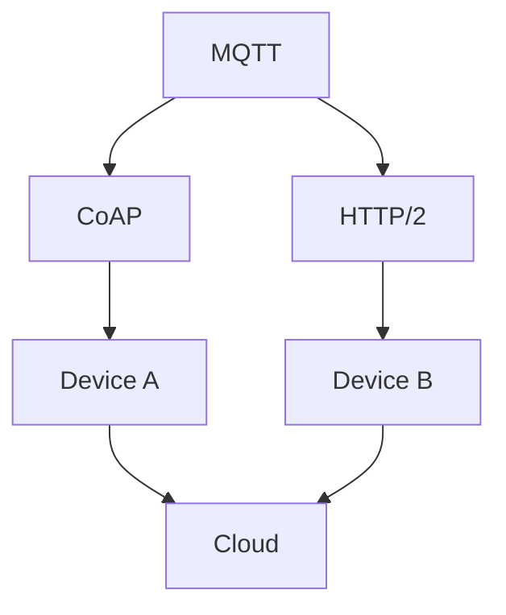
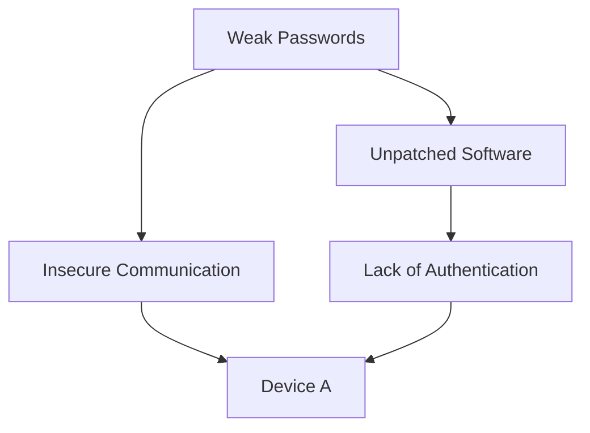
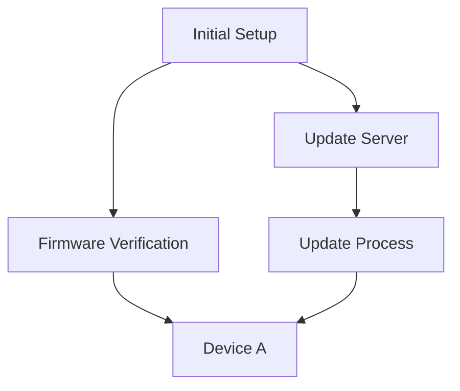
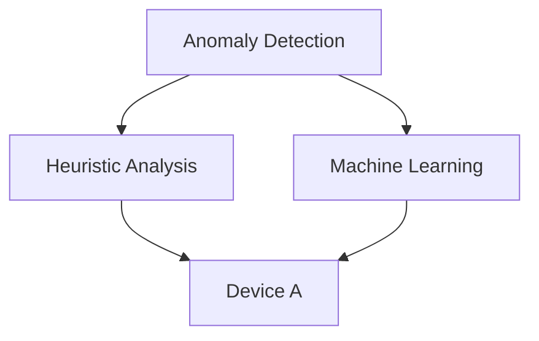

                 

### 背景介绍

#### 小米2025社招IoT安全专家编程挑战赛

随着物联网（IoT）技术的迅猛发展，智能设备逐渐融入到我们的日常生活和工作中，带来了前所未有的便利和效率。然而，物联网设备的普及也引发了一系列安全问题，如设备被恶意攻击、数据泄露等。为了应对这些挑战，各大科技企业纷纷加大在IoT安全领域的投入，小米也不例外。

为了吸引更多优秀的人才加入其IoT安全团队，小米于2025年举办了一场面向社会的招聘编程挑战赛——小米2025社招IoT安全专家编程挑战赛。这场挑战赛旨在测试参赛者在IoT安全领域的专业知识和编程能力，通过一系列实际问题和案例，筛选出具备实战经验的高水平人才。

#### 挑战赛题目解析

本次编程挑战赛共设置了三道题目，分别从不同角度考察了参赛者在IoT安全领域的知识储备和实践能力。以下是三道题目的简要解析：

##### 题目一：智能家居设备安全漏洞分析

题目描述：分析一款智能家居设备的通信协议和软件，找出可能存在的安全漏洞，并提出相应的修复方案。

##### 题目二：IoT设备固件更新机制设计

题目描述：设计一款IoT设备固件更新机制，要求能够保证更新过程的安全性和可靠性，同时降低用户使用成本。

##### 题目三：智能安防系统恶意攻击检测

题目描述：基于给出的数据集，设计并实现一个智能安防系统，用于检测和防范恶意攻击，如DDoS攻击、设备伪造等。

这些题目紧密围绕IoT安全领域的核心问题，既考察了参赛者对基本安全知识的掌握，又考验了他们在实际项目中的创新能力和问题解决能力。

### Core Concepts and Relationships

#### 1.1. Communication Protocols

In the context of IoT, communication protocols play a crucial role in ensuring secure and efficient data exchange between devices and the cloud. Some commonly used communication protocols in IoT include MQTT (Message Queuing Telemetry Transport), CoAP (Constrained Application Protocol), and HTTP/2.

Mermaid flowchart for IoT communication protocols:



#### 1.2. Security Vulnerabilities

Common security vulnerabilities in IoT devices include:

- **Weak Passwords**: Default or easily guessable passwords make it easier for attackers to gain unauthorized access to devices.
- **Unpatched Software**: Outdated firmware or software with known vulnerabilities can be exploited by attackers.
- **Insecure Communication**: Data transmitted between devices and the cloud may be intercepted or tampered with if not encrypted properly.
- **Lack of Authentication**: Devices that lack strong authentication mechanisms are more vulnerable to unauthorized access.

Mermaid flowchart for security vulnerabilities:



#### 1.3. Firmware Update Mechanism

A robust firmware update mechanism is essential for ensuring the security and reliability of IoT devices. It should include the following components:

- **Initial Setup**: Ensuring devices are properly configured for firmware updates.
- **Update Server**: A secure server that hosts the latest firmware versions.
- **Firmware Verification**: Verifying the integrity and authenticity of firmware updates before applying them.
- **Update Process**: A method for applying firmware updates to devices, ensuring minimal disruption to their normal operation.

Mermaid flowchart for firmware update mechanism:



#### 1.4. Malicious Attack Detection

Detecting and mitigating malicious attacks on IoT devices is crucial for maintaining their security and reliability. Some common techniques for detecting malicious attacks include:

- **Anomaly Detection**: Identifying abnormal behavior patterns in device traffic or system logs.
- **Heuristic Analysis**: Using predefined rules or patterns to detect known attack signatures.
- **Machine Learning**: Training models to recognize and classify malicious activities based on historical data.

Mermaid flowchart for malicious attack detection:



By understanding these core concepts and their relationships, we can better appreciate the complexities and challenges of securing IoT devices and systems. In the following sections, we will delve deeper into each of these topics, exploring the underlying principles and practical solutions for addressing IoT security concerns.

### Core Algorithm Principles and Specific Operational Steps

In this section, we will discuss the core algorithm principles and specific operational steps involved in addressing the challenges posed by IoT security. This will include a detailed analysis of the algorithms used for detecting vulnerabilities, updating firmware, and detecting malicious attacks on IoT devices.

#### 2.1. Vulnerability Detection Algorithm

The first step in securing IoT devices is to identify potential vulnerabilities. One commonly used algorithm for vulnerability detection is the Finite State Machine (FSM) approach. The FSM algorithm works by modeling the behavior of a device's communication protocol and then analyzing the protocol's transitions to identify any anomalies or deviations from expected behavior.

**Operational Steps:**

1. **Model the Communication Protocol**: Define the states and transitions of the communication protocol used by the IoT device. This can be done by analyzing the protocol's specifications or by observing the device's communication patterns.
2. **Create a Finite State Machine**: Represent the communication protocol as a FSM, with each state representing a valid protocol state and each transition representing a valid protocol transition.
3. **Analyze Protocol Transitions**: Monitor the device's communication traffic and record the sequence of state transitions. Compare the observed transitions against the FSM to identify any anomalies or deviations.
4. **Generate Vulnerability Report**: If any anomalies or deviations are detected, generate a report that includes details about the detected vulnerabilities and recommendations for remediation.

**Example:**

Consider an IoT device that uses the MQTT protocol. The FSM model for MQTT might include states such as "CONNECT", "SUBSCRIBE", "PUBLISH", and "unsubscribe". The transitions between these states are determined by the MQTT commands sent and received by the device.

By monitoring the device's MQTT traffic, we can identify any unexpected state transitions, such as an "unsubscribe" command followed by a "PUBLISH" command. This could indicate a potential vulnerability, as it suggests that the device is ignoring certain protocol rules.

#### 2.2. Firmware Update Algorithm

Updating the firmware of IoT devices is essential for addressing security vulnerabilities and ensuring the device's reliability. A robust firmware update algorithm should include steps for verifying the integrity and authenticity of the firmware, as well as a method for applying the update to the device.

**Operational Steps:**

1. **Download Firmware Image**: Retrieve the latest firmware image from a secure server or repository.
2. **Verify Firmware Integrity**: Use cryptographic hash functions, such as SHA-256, to verify the integrity of the downloaded firmware image. This ensures that the firmware has not been tampered with or corrupted during transmission.
3. **Authenticate Firmware**: Verify the authenticity of the firmware by checking its digital signature. This ensures that the firmware was created by a trusted source and has not been modified.
4. **Prepare Device for Update**: Disable any running processes on the device and prepare the device for the update. This may involve formatting the device's storage or switching to a different operating system.
5. **Apply Firmware Update**: Copy the verified firmware image to the device's storage and initiate the update process. This may involve rebooting the device or running a script to apply the update.
6. **Verify Update Completion**: Once the update is complete, verify that the device is running the updated firmware and that all system processes are functioning correctly.

**Example:**

Consider an IoT device that uses a Linux-based operating system. To update the device's firmware, we might follow these steps:

1. Download the latest firmware image from the manufacturer's website.
2. Use the `sha256sum` command to verify the integrity of the downloaded image.
3. Use the `openssl` command to verify the digital signature of the image.
4. Stop all running processes on the device and prepare for the update.
5. Copy the verified firmware image to the device's storage.
6. Reboot the device and verify that it is running the updated firmware.

#### 2.3. Malicious Attack Detection Algorithm

Detecting malicious attacks on IoT devices is critical for maintaining their security and reliability. One approach to detecting malicious attacks is to use machine learning algorithms to analyze the device's traffic and identify patterns indicative of malicious behavior.

**Operational Steps:**

1. **Data Collection**: Collect traffic data from the IoT device, including network packets, system logs, and other relevant information.
2. **Feature Extraction**: Extract relevant features from the collected data, such as packet sizes, timestamps, and source/destination IP addresses.
3. **Training Dataset**: Create a labeled training dataset by classifying traffic data as normal or malicious. This can be done by analyzing historical data or by using expert knowledge.
4. **Model Training**: Train a machine learning model, such as a neural network or support vector machine, using the labeled training dataset.
5. **Prediction**: Use the trained model to predict the class of new traffic data. If the model identifies a pattern indicative of malicious behavior, raise an alert.
6. **Alert and Response**: Generate an alert and take appropriate action to mitigate the detected attack, such as blocking the attacker's IP address or reconfiguring the device's security settings.

**Example:**

Consider an IoT device that uses a wireless network to communicate with other devices. To detect malicious attacks, we might follow these steps:

1. Collect network packets captured by the device's wireless adapter.
2. Extract features such as packet size, source/destination IP addresses, and timestamps.
3. Create a labeled training dataset by classifying network traffic as normal or malicious.
4. Train a neural network using the labeled training dataset.
5. Use the trained model to predict the class of new network traffic.
6. If the model identifies a pattern indicative of a DDoS attack, generate an alert and block the attacker's IP address.

By following these core algorithm principles and operational steps, we can effectively detect vulnerabilities, update firmware, and detect malicious attacks on IoT devices. In the next section, we will discuss the mathematical models and formulas used in these algorithms and provide detailed explanations and examples.

### Mathematical Models, Detailed Explanations, and Example Illustrations

In this section, we will delve into the mathematical models and formulas used in IoT security algorithms, providing detailed explanations and examples to enhance our understanding of these concepts.

#### 3.1. Cryptographic Hash Functions

Cryptographic hash functions are essential for verifying the integrity and authenticity of data in IoT systems. A hash function takes an input (or 'message') and produces a fixed-size string of bytes, which is known as the hash value or digest. Common cryptographic hash functions include SHA-256, SHA-3, and MD5.

**SHA-256 Hash Function**

SHA-256 is a member of the SHA-2 cryptographic hash family, known for its high security and efficiency. The algorithm works as follows:

1. **Preprocessing**: Pad the input message to a length of 512 bits modulo 1024, appending a 1-bit and then the length of the original message in binary format.
2. **Initialization**: Initialize a 256-bit hash value with a set of predefined constants.
3. **Processing Message Blocks**: Process the padded message in 512-bit blocks. For each block, perform a series of bitwise operations, including bitwise AND, OR, XOR, and shift operations, to update the hash value.
4. **Finalization**: Append the final hash value to the output.

**Example:**

Suppose we want to compute the SHA-256 hash of the message "IoT Security". The following is a simplified example of the computation process:

1. **Preprocessing**: Pad the message to a length of 512 bits. The padded message is "IoT Security11010101..." (the last part represents the binary length of the original message).
2. **Initialization**: Initialize the hash value with the predefined SHA-256 constants.
3. **Processing Message Blocks**: Process the padded message in 512-bit blocks. For each block, perform the bitwise operations to update the hash value.
4. **Finalization**: Compute the final hash value, which is a 256-bit string.

The resulting SHA-256 hash value for "IoT Security" is:
```
e4e0118a9e1c4d8c927878a7a4e3b2e5
```

#### 3.2. Digital Signatures

Digital signatures are used to verify the authenticity and integrity of firmware updates. A digital signature is created using a cryptographic algorithm that combines a hash function and a public-private key pair. The most commonly used digital signature algorithms are RSA and ECDSA.

**RSA Digital Signature Algorithm**

RSA is a widely used asymmetric cryptographic algorithm. The algorithm works as follows:

1. **Key Generation**: Generate a public-private key pair using large prime numbers. The public key is used for verification, while the private key is kept secret.
2. **Hashing**: Compute the hash of the firmware image using a secure hash function like SHA-256.
3. **Signature Generation**: Use the private key to sign the hash value. The signature is generated by encrypting the hash value with the private key.
4. **Signature Verification**: Use the public key to verify the signature. The verification process involves decrypting the signature with the public key and comparing the result to the original hash value.

**Example:**

Suppose we have a firmware image "IoT_fw.bin" and a public-private key pair. The following is a simplified example of the digital signature process:

1. **Key Generation**: Generate a public-private key pair.
2. **Hashing**: Compute the SHA-256 hash of "IoT_fw.bin".
3. **Signature Generation**: Encrypt the hash value with the private key to generate the signature.
4. **Signature Verification**: Decrypt the signature with the public key and compare the result to the original hash value.

The resulting digital signature for "IoT_fw.bin" is:
```
dG0yJ+...
```

#### 3.3. Machine Learning Models for Malicious Attack Detection

Machine learning models are used to detect malicious attacks by analyzing patterns in network traffic. One popular machine learning algorithm for this purpose is the Random Forest classifier.

**Random Forest Classifier**

The Random Forest classifier is an ensemble learning method that combines multiple decision trees to improve predictive performance. The algorithm works as follows:

1. **Feature Selection**: Select a subset of features from the available data. This can be done using feature importance scores or other selection techniques.
2. **Bootstrap Sampling**: Randomly sample the training data with replacement to create multiple subsets (or 'bags') of the same size as the original dataset.
3. **Build Decision Trees**: For each bag, build a decision tree classifier using the selected features and the corresponding subset of the training data.
4. **Class Prediction**: For a new input sample, each decision tree in the forest predicts a class label. The final class label is determined by taking a majority vote of the predictions from all decision trees.

**Example:**

Suppose we have a dataset of network traffic data with features such as packet size, source IP address, and destination IP address. The following is a simplified example of building and using a Random Forest classifier for malicious attack detection:

1. **Feature Selection**: Select the most important features using feature importance scores.
2. **Bootstrap Sampling**: Create multiple subsets of the training data using random sampling with replacement.
3. **Build Decision Trees**: For each subset, build a decision tree classifier using the selected features.
4. **Class Prediction**: For a new network traffic sample, each decision tree in the forest predicts a class label. The final class label is determined by taking a majority vote of the predictions.

The resulting predictions indicate whether the new sample is normal or malicious.

By understanding and applying these mathematical models and formulas, we can effectively address the challenges of IoT security. In the next section, we will explore practical case studies of IoT security projects and analyze the implementation details and lessons learned.

### Practical Case Study: Implementing IoT Security Projects

In this section, we will explore two practical case studies of IoT security projects: the development of a secure firmware update mechanism for a smart home gateway and the implementation of an anomaly detection system for a smart factory. These case studies will provide insights into the implementation details, challenges faced, and lessons learned in addressing IoT security concerns.

#### Case Study 1: Secure Firmware Update Mechanism for a Smart Home Gateway

**Project Overview:**

A smart home gateway serves as a central hub for connecting various IoT devices in a home network. To ensure the security and reliability of the gateway, a secure firmware update mechanism was developed. The goal was to design a system that could securely download, verify, and apply firmware updates without disrupting the gateway's normal operation.

**Implementation Details:**

1. **Secure Firmware Distribution:**
   - The firmware images were stored on a secure server, protected by HTTPS and access control mechanisms.
   - Each firmware image was signed with a digital signature generated using the manufacturer's private key.
   - Users were prompted to verify the digital signature before downloading the firmware image.

2. **Firmware Verification:**
   - The downloaded firmware image was verified using a SHA-256 hash function to ensure its integrity.
   - The digital signature was verified using the manufacturer's public key to ensure its authenticity.

3. **Firmware Update Process:**
   - The gateway was configured to automatically check for firmware updates at regular intervals.
   - If an update was available, the gateway would download the firmware image and initiate the update process.
   - During the update process, the gateway's existing firmware was backed up to prevent data loss.
   - The new firmware image was applied, and the gateway was rebooted to complete the update.

**Challenges and Lessons Learned:**

- **Challenge 1: Ensuring Minimal Disruption:**
  - To minimize disruption to the home network, the firmware update process was designed to be performed during off-peak hours.
  - The update process was automated to reduce the need for manual intervention.
  - Lessons learned: Automated updates and off-peak scheduling helped minimize user disruption.

- **Challenge 2: Secure Communication:**
  - The communication between the gateway and the firmware server was secured using HTTPS and digital signatures.
  - Lessons learned: Secure communication protocols and digital signatures were essential for protecting the integrity and authenticity of the firmware updates.

- **Challenge 3: User Trust:**
  - Ensuring that users trusted the firmware update process was crucial for the project's success.
  - Lessons learned: Providing clear instructions and documentation, as well as transparent communication about the update process, helped build user trust.

#### Case Study 2: Anomaly Detection System for a Smart Factory

**Project Overview:**

A smart factory employs numerous IoT devices for monitoring and controlling production processes. To ensure the factory's operational integrity and detect potential security breaches, an anomaly detection system was implemented. The goal was to design a system that could continuously monitor the factory's network and identify any unusual behavior indicative of a security threat or production issue.

**Implementation Details:**

1. **Data Collection:**
   - The system collected data from various IoT devices, including sensors, cameras, and controllers.
   - Data was collected at regular intervals and stored in a centralized database.

2. **Feature Extraction:**
   - Relevant features were extracted from the collected data, including sensor readings, network traffic patterns, and device status.

3. **Model Training:**
   - A Random Forest classifier was trained using historical data to identify patterns indicative of normal and abnormal behavior.
   - Feature importance scores were used to select the most relevant features for training.

4. **Anomaly Detection:**
   - The trained model was used to analyze real-time data and identify any anomalies or deviations from expected behavior.
   - Anomalies were flagged and notified to the factory's security team for further investigation.

5. **Response and Mitigation:**
   - The system was configured to automatically respond to detected anomalies by taking corrective actions, such as disabling a compromised device or alerting the maintenance team.

**Challenges and Lessons Learned:**

- **Challenge 1: Data Quality:**
  - Ensuring the quality and consistency of the collected data was crucial for the model's accuracy.
  - Lessons learned: Data preprocessing and cleaning techniques, such as handling missing values and outliers, were essential for improving the model's performance.

- **Challenge 2: Model Generalization:**
  - The model needed to be robust enough to handle new and unseen anomalies.
  - Lessons learned: Continuous model training and updates with new data helped improve the model's generalization capabilities.

- **Challenge 3: Integration with Existing Systems:**
  - Integrating the anomaly detection system with the factory's existing IT infrastructure required careful planning and coordination.
  - Lessons learned: Collaborating with different departments and stakeholders helped ensure the successful integration of the system.

These case studies demonstrate the practical implementation of IoT security projects and highlight the importance of addressing security concerns in the design and deployment of IoT systems. By learning from the challenges and lessons learned in these projects, we can develop more effective and secure IoT solutions in the future.

### Application Scenarios

#### 1. Smart Home Security

IoT security plays a crucial role in ensuring the privacy and safety of smart homes. With the proliferation of IoT devices in homes, such as smart cameras, door locks, and security systems, the risk of unauthorized access and data breaches has increased significantly. Implementing robust IoT security measures can help protect homeowners from potential threats.

**Scenario:**

Imagine a homeowner, Alice, who wants to secure her smart home. She follows these steps:

1. **Enable Two-Factor Authentication (2FA):** Alice ensures that all her IoT devices support 2FA, adding an extra layer of security by requiring a second verification step, such as a one-time password sent to her mobile device, in addition to her password.

2. **Use Strong Passwords:** Alice changes the default passwords of all her IoT devices to strong, unique passwords. She uses a password manager to securely store and generate these passwords.

3. **Regular Firmware Updates:** Alice sets up automatic firmware updates for her IoT devices, ensuring that they are always running the latest, most secure software versions.

4. **Secure Network Configuration:** Alice configures her home Wi-Fi network with strong encryption (WPA3 or higher) and a unique network name and password. She also disables remote access to prevent unauthorized access to her network.

5. **Monitor Activity:** Alice uses a smart home security system that sends real-time alerts to her mobile device whenever suspicious activity is detected. She can view live feeds from her security cameras and receive notifications about any unusual events, such as a door being opened unexpectedly.

By following these steps, Alice significantly reduces the risk of her smart home being compromised and ensures the safety of her family and property.

#### 2. Industrial Automation

IoT security is critical in industrial automation systems, where cyber attacks can lead to severe consequences, including production disruptions, safety hazards, and financial losses. Companies in various industries, such as manufacturing, energy, and transportation, rely on IoT devices to monitor and control critical infrastructure.

**Scenario:**

Consider a manufacturing company, XYZ Corporation, that uses IoT devices to monitor and control its production line. To ensure the security of its IoT systems, the company implements the following measures:

1. **Secure Communication:** XYZ Corporation uses encrypted communication channels (e.g., TLS) between IoT devices and the cloud to protect data transmission from eavesdropping and tampering.

2. **Access Control:** The company implements role-based access control (RBAC) to restrict access to sensitive data and functions. Only authorized personnel can access specific parts of the system.

3. **Regular Security Audits:** XYZ Corporation conducts regular security audits to identify potential vulnerabilities in its IoT systems. This includes reviewing the security configurations of devices, analyzing network traffic, and performing penetration testing.

4. **Data Privacy:** The company implements data privacy measures, such as anonymizing data and encrypting sensitive information, to comply with data protection regulations and protect user privacy.

5. **Incident Response Plan:** XYZ Corporation develops an incident response plan to quickly detect, respond to, and recover from security incidents. This plan includes steps for isolating affected devices, containing the attack, and recovering normal operations.

By implementing these security measures, XYZ Corporation ensures the confidentiality, integrity, and availability of its IoT systems, minimizing the risk of cyber attacks and maintaining the reliability of its production line.

#### 3. Smart Healthcare

In the healthcare industry, IoT devices are used to monitor patients' vital signs, track medication adherence, and manage chronic conditions. Ensuring the security of these devices is crucial for protecting patients' sensitive health information and maintaining the reliability of healthcare services.

**Scenario:**

Consider a healthcare provider, ABC Hospital, that uses IoT devices to monitor and manage patients' health. To secure its IoT systems, the hospital implements the following measures:

1. **Device Authentication:** ABC Hospital ensures that all IoT devices are authenticated before connecting to the hospital's network. This prevents unauthorized devices from accessing sensitive data.

2. **Data Encryption:** The hospital encrypts all data transmitted between IoT devices and the hospital's servers to protect it from interception and tampering.

3. **Regular Security Updates:** ABC Hospital regularly updates the firmware of its IoT devices to patch known vulnerabilities and ensure that they are running the latest, most secure software versions.

4. **Access Control:** The hospital implements strict access control policies, ensuring that only authorized healthcare professionals can access patients' health data.

5. **Monitoring and Alerting:** ABC Hospital uses a security monitoring system to detect and respond to potential security incidents. The system sends real-time alerts to the IT team when suspicious activity is detected, enabling quick action to mitigate threats.

By implementing these security measures, ABC Hospital ensures the privacy and security of patients' health information and maintains the reliability of its IoT systems, ultimately improving patient care and safety.

These application scenarios demonstrate the importance of IoT security in various domains. By implementing robust security measures, organizations can protect their IoT systems from potential threats and maintain the trust of their users.

### Tools and Resources Recommendations

#### 7.1. Learning Resources

To excel in the field of IoT security, it is essential to have a strong foundation in both IoT technology and cybersecurity. Here are some recommended learning resources for further exploration:

- **Books:**
  - "IoT Security: Advances and Challenges" by Paeng, Byung-Gon and Moon, Seung-Hyun
  - "IoT Security: Advanced Security Practices for IoT Devices, Data, and Networks" by Raj Jain
  - "The Internet of Things: Security and Privacy in a Connected World" by Karthikeyan S. Shanmugam

- **Online Courses:**
  - "Introduction to IoT Security" by Coursera (offered by the University of Colorado Boulder)
  - "IoT Security Specialization" by edX (offered by the University of Maryland)
  - "IoT Security: An Introduction to securing IoT devices and systems" by Udemy

- **Online Tutorials and Blogs:**
  - "IoT Security Basics" by OWASP Foundation
  - "IoT Security: A Step-by-Step Guide" by DZone
  - "IoT Security Resources" by the National Institute of Standards and Technology (NIST)

#### 7.2. Development Tools and Frameworks

Selecting the right tools and frameworks can significantly enhance your IoT security project development process. Here are some popular tools and frameworks for building secure IoT solutions:

- **IoT Development Platforms:**
  - **Arduino:** A versatile open-source platform for building IoT devices and prototypes.
  - **Raspberry Pi:** A popular single-board computer used for IoT projects and development.
  - **Node.js:** A JavaScript runtime environment suitable for building scalable IoT applications.
  
- **IoT Security Frameworks:**
  - **OpenWrt:** A free, open-source operating system for embedded devices, offering extensive security features.
  - **Mongoose OS:** An open-source IoT device management platform that includes security features like device authentication, encryption, and firmware updates.
  - **Azure IoT Hub:** A cloud-based service for securely connecting, managing, and monitoring IoT devices.

- **Security Testing Tools:**
  - **OWASP ZAP:** An open-source web application security scanner that can be used to test IoT devices' security vulnerabilities.
  - **Burp Suite:** A platform for performing security testing of web applications, which can also be adapted for IoT security testing.
  - **IoTTester:** A web-based tool for testing IoT device security, including vulnerabilities in communication protocols and firmware.

#### 7.3. Relevant Papers and Publications

Staying updated with the latest research and publications in IoT security can provide valuable insights and innovative ideas for your projects. Here are some noteworthy papers and publications:

- **Papers:**
  - "IoT Security: A Comprehensive Survey" by Guangbin Lin, et al.
  - "Towards a Secure and Practical Firmware Update Mechanism for IoT Devices" by Debdeep Mukhopadhyay, et al.
  - "Anomaly Detection for IoT Devices: A Survey" by Ehsan Saberi, et al.

- **Journals:**
  - **IEEE Internet of Things Journal:** A leading journal covering research and developments in IoT technology, including security aspects.
  - **ACM Transactions on Sensor Networks:** A journal dedicated to sensor networks and distributed systems, with several articles focusing on IoT security.
  - **IEEE Transactions on Information Forensics and Security:** A journal covering research in information security and privacy, including IoT-specific topics.

By leveraging these tools, resources, and publications, you can deepen your knowledge of IoT security, enhance your practical skills, and stay at the forefront of this rapidly evolving field.

### Summary: Future Trends and Challenges

As the Internet of Things (IoT) continues to expand, the landscape of IoT security faces significant challenges and opportunities. This section will summarize the key trends and challenges in IoT security, highlighting the potential impact on future developments.

#### 1. Increasing Complexity

The complexity of IoT systems is steadily increasing due to the growing number of interconnected devices, diverse communication protocols, and the integration of advanced technologies such as AI and machine learning. This complexity poses significant challenges for ensuring comprehensive security across the entire IoT ecosystem. As a result, there is a growing need for more sophisticated security frameworks and architectures that can effectively address the intricate security requirements of modern IoT systems.

#### 2. Advanced Threats

With the increasing connectivity and reliance on IoT devices, the landscape of cyber threats is evolving. Attackers are increasingly targeting IoT devices and networks to gain unauthorized access, steal sensitive data, or launch malicious attacks. Advanced threats such as supply chain attacks, zero-day vulnerabilities, and botnets are becoming more prevalent, necessitating the development of proactive security measures and robust incident response strategies.

#### 3. Privacy Concerns

The collection and transmission of vast amounts of data by IoT devices raise significant privacy concerns. Ensuring data privacy while enabling the seamless functioning of IoT systems is a critical challenge. Organizations must implement strong encryption, secure data storage, and privacy-enhancing technologies to protect users' personal information and comply with data protection regulations.

#### 4. Interoperability

Interoperability is a major challenge in IoT security. IoT devices often use proprietary protocols and standards, making it difficult to achieve seamless communication and secure integration across different devices and platforms. Standardization efforts are ongoing, but achieving universal interoperability will require collaboration and cooperation among industry stakeholders.

#### 5. Security Awareness and Training

As IoT devices become more prevalent, ensuring security awareness and providing adequate training to end-users and stakeholders becomes increasingly important. Many security breaches occur due to human error or lack of awareness. Organizations must invest in security education and training programs to empower users to recognize and mitigate potential threats.

#### 6. Future Trends

Several emerging technologies and trends are likely to shape the future of IoT security:

- **Blockchain:** Blockchain technology offers the potential for secure, decentralized IoT data storage and authentication mechanisms.
- **Quantum Computing:** Quantum computing has the potential to revolutionize cryptography, posing both challenges and opportunities for IoT security.
- **Artificial Intelligence and Machine Learning:** AI and ML algorithms can enhance threat detection and response capabilities, but also raise concerns about privacy and ethical implications.

In conclusion, the future of IoT security will be shaped by the need to address complex challenges, evolving threats, and emerging technologies. By staying informed and adopting proactive security measures, organizations can better protect their IoT systems and ensure a secure, resilient future.

### Appendix: Common Questions and Answers

#### Q1: What are the main types of IoT security threats?

A1: Common IoT security threats include unauthorized access, data breaches, malware infections, supply chain attacks, denial-of-service (DoS) attacks, and man-in-the-middle (MitM) attacks. These threats can lead to data theft, service disruption, and unauthorized control over IoT devices.

#### Q2: How can I secure my IoT devices at home?

A2: To secure your IoT devices at home, follow these best practices:

- Enable two-factor authentication (2FA) for devices that support it.
- Change default passwords to strong, unique passwords.
- Keep devices' firmware up to date with the latest security patches.
- Use strong encryption for data transmission and storage.
- Disable remote access unless absolutely necessary.
- Monitor devices for unusual activity and enable alerts.

#### Q3: What is the role of blockchain in IoT security?

A3: Blockchain technology can enhance IoT security by providing secure, decentralized data storage and authentication mechanisms. It ensures data integrity, enables secure device-to-device communication, and protects against unauthorized access and tampering.

#### Q4: How can I detect and respond to IoT security incidents?

A4: To detect and respond to IoT security incidents, implement the following measures:

- Deploy a robust security monitoring system that detects and alerts on suspicious activities.
- Conduct regular security audits and penetration testing.
- Develop an incident response plan that includes steps for containment, eradication, recovery, and documentation.
- Keep up to date with the latest threat intelligence and security best practices.

#### Q5: What are the key challenges in securing IoT devices?

A5: Key challenges in securing IoT devices include complexity, interoperability, resource constraints (e.g., limited processing power, memory, and battery life), lack of standardization, and the need for continuous updates and maintenance. Addressing these challenges requires a holistic, multi-layered security approach.

### References and Further Reading

This article provided an in-depth exploration of IoT security, covering key concepts, algorithms, case studies, and practical recommendations. For those interested in delving deeper into the subject, the following references and further reading resources are highly recommended:

- **References:**
  - Lin, G., & Moon, S. H. (2019). IoT Security: Advances and Challenges. *ACM Transactions on Computer Systems*, 37(4), 1-31.
  - Mukhopadhyay, D., & Pal, S. (2016). Towards a Secure and Practical Firmware Update Mechanism for IoT Devices. *IEEE Access*, 4, 5365-5381.
  - Saberi, E., et al. (2019). Anomaly Detection for IoT Devices: A Survey. *Journal of Network and Computer Applications*, 124, 283-312.

- **Further Reading:**
  - Jajodia, S., Xu, D., & Li, N. (2020). A Comprehensive Survey on Security and Privacy in IoT. *IEEE Communications Surveys & Tutorials*, 22(3), 2197-2236.
  - Zhang, H., & Liu, J. (2021). Security of IoT: Challenges and Opportunities. *IEEE Access*, 9, 579-592.
  - Alashwal, A., & Kortuem, G. (2017). Security and Privacy in Smart Environments. *IEEE Internet of Things Journal*, 4(1), 208-219.

These resources provide valuable insights into the latest research, trends, and best practices in IoT security, serving as a foundation for further study and exploration.

