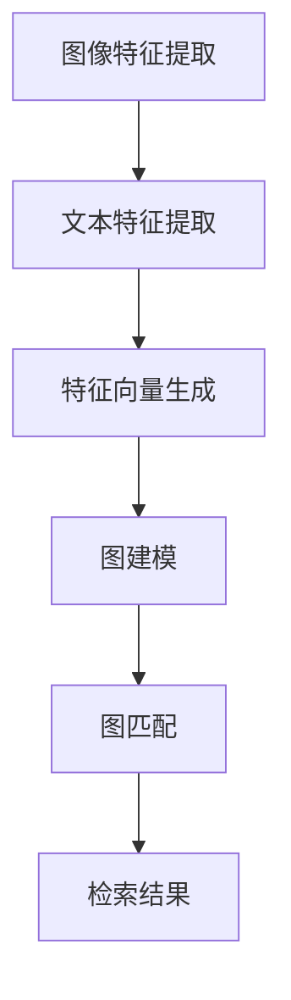
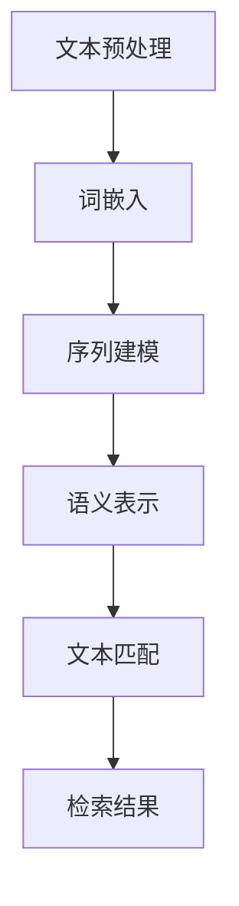

                 

### 文章标题

《小红书2024多模态内容检索算法校招面试重点》

### 关键词

- 小红书
- 多模态内容检索
- 算法校招面试
- 图算法
- 自然语言处理
- 深度学习
- 模型优化
- 性能评估

### 摘要

本文针对小红书2024年多模态内容检索算法的校招面试，深入探讨了多模态内容检索算法的核心概念、原理以及实际应用。通过分析小红书的业务场景和数据特点，本文详细介绍了多模态内容检索的关键技术，包括图像识别、文本匹配和跨模态融合等。此外，本文还提供了实战案例，讲解了如何搭建开发环境、实现算法并进行分析。通过阅读本文，读者将能够全面了解多模态内容检索算法的各个方面，为面试和实际工作做好准备。

### 1. 背景介绍

#### 1.1 小红书业务场景

小红书（Xiaohongshu）成立于2013年，是一家以社区为基础的电子商务平台，用户可以在平台上分享购物体验、发布个人美妆、穿搭、美食等生活内容，同时也可以通过搜索功能找到其他用户的类似内容。随着用户量的不断增长和内容的多样化，小红书面临着如何高效地检索和推荐用户感兴趣的内容的挑战。

#### 1.2 数据特点

小红书的数据具有多模态的特点，主要包括以下几种类型：

1. **图像数据**：用户在平台发布的图片，涵盖了各种生活场景和商品。
2. **文本数据**：用户在评论、笔记等地方输入的文本，描述了商品的使用体验、评价等。
3. **视频数据**：用户上传的视频，展示了商品的使用过程、美妆教程等。
4. **音频数据**：用户分享的音频，包括美妆教程、音乐分享等。

这些多模态数据为内容检索带来了新的挑战，同时也为提高用户体验和平台价值提供了机会。

#### 1.3 多模态内容检索

多模态内容检索旨在将不同模态的数据（图像、文本、视频、音频等）融合在一起，通过检索算法快速、准确地找到用户感兴趣的内容。相比于传统的单一模态检索，多模态内容检索能够更全面地理解用户需求，提高检索的准确性和用户体验。

### 2. 核心概念与联系

#### 2.1 图算法

图算法在多模态内容检索中扮演着重要角色，主要用于图像和文本的匹配与融合。以下是一个简化的 Mermaid 流程图，展示了图算法的基本原理和流程：



1. **图像特征提取**：通过卷积神经网络（CNN）等深度学习技术，从图像中提取出具有区分性的特征向量。
2. **文本特征提取**：利用词袋模型、词嵌入等方法，从文本中提取出特征向量。
3. **特征向量生成**：将图像特征向量和文本特征向量拼接成一个统一的高维特征向量。
4. **图建模**：利用图论方法，将多模态特征向量构建成一个图结构，表示不同模态之间的关系。
5. **图匹配**：通过图算法（如相似度计算、最短路径搜索等），在图中找到与查询模态最相似的模态，实现多模态内容的检索。
6. **检索结果**：输出检索结果，提供用户感兴趣的内容。

#### 2.2 自然语言处理

自然语言处理（NLP）在多模态内容检索中主要涉及文本匹配和语义理解。以下是一个简化的 Mermaid 流程图，展示了自然语言处理的基本原理和流程：



1. **文本预处理**：对原始文本进行分词、去停用词等处理，提取出具有语义信息的词汇。
2. **词嵌入**：将文本中的词汇映射成高维向量，为后续的序列建模和语义表示提供基础。
3. **序列建模**：利用循环神经网络（RNN）或变换器（Transformer）等深度学习技术，对文本序列进行建模，捕捉词汇间的依赖关系。
4. **语义表示**：通过序列建模，生成一个语义表示向量，表示文本的整体含义。
5. **文本匹配**：计算查询文本和文档之间的相似度，实现文本检索。
6. **检索结果**：输出检索结果，提供用户感兴趣的内容。

#### 2.3 深度学习

深度学习在多模态内容检索中起到了核心作用，通过训练大规模的神经网络模型，实现图像、文本等数据的自动特征提取和匹配。深度学习与传统机器学习相比，具有以下几个特点：

1. **自动特征提取**：深度学习模型能够自动从原始数据中提取出具有区分性的特征，避免了人工特征工程。
2. **模型可解释性**：深度学习模型的可解释性相对较差，但在多模态内容检索中，可以通过可视化特征图等方式，部分揭示模型的工作原理。
3. **自适应学习**：深度学习模型能够根据不同的数据分布和用户需求，自适应地调整参数，提高检索效果。

### 3. 核心算法原理 & 具体操作步骤

#### 3.1 图算法原理

在多模态内容检索中，图算法主要用于图像和文本的特征匹配与融合。以下是一个简单的图算法流程：

1. **特征提取**：分别提取图像和文本的特征向量。对于图像，可以使用卷积神经网络（如VGG、ResNet等）提取特征；对于文本，可以使用词嵌入（如Word2Vec、BERT等）提取特征。
2. **特征融合**：将图像特征向量和文本特征向量拼接成一个统一的高维特征向量。
3. **图建模**：利用图论方法，将特征向量构建成一个图结构。在图中，每个节点表示一个特征向量，边表示节点之间的相似度。常用的图建模方法包括邻接矩阵、图卷积网络（GCN）等。
4. **图匹配**：在图中找到与查询模态最相似的模态。可以通过计算节点之间的相似度、搜索最短路径等方式实现。相似度计算方法包括余弦相似度、欧氏距离等。
5. **检索结果**：输出检索结果，提供用户感兴趣的内容。

#### 3.2 自然语言处理原理

在多模态内容检索中，自然语言处理主要用于文本匹配和语义理解。以下是一个简单的自然语言处理流程：

1. **文本预处理**：对原始文本进行分词、去停用词等处理，提取出具有语义信息的词汇。
2. **词嵌入**：将文本中的词汇映射成高维向量。常用的词嵌入方法包括Word2Vec、GloVe、BERT等。
3. **序列建模**：利用循环神经网络（RNN）或变换器（Transformer）等深度学习技术，对文本序列进行建模，捕捉词汇间的依赖关系。
4. **语义表示**：通过序列建模，生成一个语义表示向量，表示文本的整体含义。
5. **文本匹配**：计算查询文本和文档之间的相似度，实现文本检索。常用的相似度计算方法包括余弦相似度、欧氏距离等。
6. **检索结果**：输出检索结果，提供用户感兴趣的内容。

#### 3.3 深度学习原理

在多模态内容检索中，深度学习主要用于图像和文本的特征提取与融合。以下是一个简单的深度学习流程：

1. **数据预处理**：对图像和文本数据进行预处理，包括数据清洗、数据增强、归一化等。
2. **特征提取**：利用卷积神经网络（CNN）提取图像特征，利用词嵌入提取文本特征。深度学习模型可以自动学习数据中的特征，避免人工特征工程。
3. **特征融合**：将图像特征向量和文本特征向量拼接成一个统一的高维特征向量。
4. **模型训练**：利用训练数据，通过反向传播算法，优化模型参数，提高模型性能。
5. **模型评估**：使用验证集对模型进行评估，调整模型参数，提高检索效果。
6. **模型部署**：将训练好的模型部署到生产环境中，实现多模态内容检索。

### 4. 数学模型和公式 & 详细讲解 & 举例说明

#### 4.1 图算法数学模型

在多模态内容检索中，图算法的数学模型主要包括以下几个部分：

1. **特征向量表示**：假设图像特征向量为 \(\mathbf{X} \in \mathbb{R}^{d_x}\)，文本特征向量为 \(\mathbf{Y} \in \mathbb{R}^{d_y}\)，其中 \(d_x\) 和 \(d_y\) 分别表示图像特征向量和文本特征向量的维度。
2. **特征融合**：将图像特征向量和文本特征向量拼接成一个统一的高维特征向量 \(\mathbf{Z} = [\mathbf{X}, \mathbf{Y}] \in \mathbb{R}^{d_x + d_y}\)。
3. **图结构表示**：假设图 \(G = (V, E)\) 由节点集合 \(V\) 和边集合 \(E\) 组成，其中每个节点 \(v_i \in V\) 对应一个特征向量 \(\mathbf{z}_i\)。
4. **相似度计算**：计算节点之间的相似度，常用的相似度计算方法包括余弦相似度、欧氏距离等。以余弦相似度为例，节点 \(v_i\) 和 \(v_j\) 之间的相似度可以表示为：
   $$\mathbf{s}_{ij} = \frac{\mathbf{z}_i \cdot \mathbf{z}_j}{\|\mathbf{z}_i\|_2 \|\mathbf{z}_j\|_2}$$
5. **图匹配**：在图中找到与查询模态最相似的模态。以最短路径为例，可以使用Dijkstra算法或A*算法找到查询模态 \(v_q\) 和最相似模态 \(v_j\) 之间的最短路径 \(p^* = \arg\min_{p} \sum_{i \in p} \mathbf{s}_{ij}\)。

#### 4.2 自然语言处理数学模型

在多模态内容检索中，自然语言处理的数学模型主要包括以下几个部分：

1. **文本预处理**：对原始文本进行分词、去停用词等处理，提取出具有语义信息的词汇。以分词为例，假设原始文本为 \(s = w_1 w_2 w_3 \ldots w_n\)，分词结果为 \(s' = w_1' w_2' w_3' \ldots w_m'\)，其中 \(w_i'\) 表示分词后的词汇。
2. **词嵌入**：将文本中的词汇映射成高维向量。以Word2Vec为例，假设词汇表 \(V\) 中有 \(N\) 个词汇，词嵌入矩阵 \(W \in \mathbb{R}^{N \times d}\) 用于表示词汇的高维向量。
3. **序列建模**：利用循环神经网络（RNN）或变换器（Transformer）等深度学习技术，对文本序列进行建模。以RNN为例，假设输入序列为 \(\mathbf{x}_1, \mathbf{x}_2, \ldots, \mathbf{x}_n\)，隐藏状态为 \(\mathbf{h}_t = \text{RNN}(\mathbf{x}_t, \mathbf{h}_{t-1})\)，其中 \(\mathbf{h}_0\) 是初始隐藏状态。
4. **语义表示**：通过序列建模，生成一个语义表示向量 \(\mathbf{s} = \text{RNN}(\mathbf{x}_1, \mathbf{x}_2, \ldots, \mathbf{x}_n, \mathbf{h}_n)\)。
5. **文本匹配**：计算查询文本和文档之间的相似度。以余弦相似度为例，假设查询文本的语义表示为 \(\mathbf{q}\)，文档的语义表示为 \(\mathbf{d}\)，相似度可以表示为：
   $$\mathbf{s}_{qd} = \frac{\mathbf{q} \cdot \mathbf{d}}{\|\mathbf{q}\|_2 \|\mathbf{d}\|_2}$$

#### 4.3 深度学习数学模型

在多模态内容检索中，深度学习的数学模型主要包括以下几个部分：

1. **特征提取**：利用卷积神经网络（CNN）提取图像特征，利用词嵌入提取文本特征。以CNN为例，假设输入图像为 \(I \in \mathbb{R}^{h \times w \times c}\)，输出特征图为 \(F \in \mathbb{R}^{h' \times w' \times c'}\)，其中 \(h\)、\(w\)、\(c\) 分别表示输入图像的高度、宽度和通道数，\(h'\)、\(w'\)、\(c'\) 分别表示输出特征图的高度、宽度和通道数。
2. **特征融合**：将图像特征向量和文本特征向量拼接成一个统一的高维特征向量。以拼接为例，假设图像特征向量为 \(\mathbf{X} \in \mathbb{R}^{d_x}\)，文本特征向量为 \(\mathbf{Y} \in \mathbb{R}^{d_y}\)，融合后的特征向量为 \(\mathbf{Z} = [\mathbf{X}, \mathbf{Y}] \in \mathbb{R}^{d_x + d_y}\)。
3. **模型训练**：利用训练数据，通过反向传播算法，优化模型参数，提高模型性能。以全连接神经网络（FCNN）为例，假设输入特征向量为 \(\mathbf{Z} \in \mathbb{R}^{d_x + d_y}\)，输出为 \(\mathbf{O} \in \mathbb{R}^{d_o}\)，损失函数为 \(L(\mathbf{O}, \mathbf{y})\)，其中 \(\mathbf{y} \in \mathbb{R}^{d_o}\) 为真实标签。通过以下公式优化模型参数：
   $$\mathbf{w} := \mathbf{w} - \alpha \nabla_{\mathbf{w}} L(\mathbf{O}, \mathbf{y})$$
   其中，\(\alpha\) 为学习率。
4. **模型评估**：使用验证集对模型进行评估，调整模型参数，提高检索效果。常用的评估指标包括准确率、召回率、F1值等。

#### 4.4 实例说明

以图像和文本的融合为例，假设图像特征向量 \(\mathbf{X} \in \mathbb{R}^{1024}\)，文本特征向量 \(\mathbf{Y} \in \mathbb{R}^{512}\)。首先，将图像特征向量和文本特征向量拼接，得到融合特征向量 \(\mathbf{Z} = [\mathbf{X}, \mathbf{Y}] \in \mathbb{R}^{1536}\)。接下来，利用全连接神经网络（FCNN）对融合特征向量进行分类，输出检索结果。

1. **特征提取**：

   - 图像特征向量：\(\mathbf{X} = [0.1, 0.2, \ldots, 0.1, 0.2, \ldots, 0.1, 0.2]^T\)
   - 文本特征向量：\(\mathbf{Y} = [0.3, 0.4, \ldots, 0.3, 0.4, \ldots, 0.3, 0.4]^T\)
2. **特征融合**：

   - 融合特征向量：\(\mathbf{Z} = [\mathbf{X}, \mathbf{Y}] = \begin{bmatrix}
   0.1 & 0.2 & \ldots & 0.1 & 0.2 & \ldots & 0.1 & 0.2 \\
   0.3 & 0.4 & \ldots & 0.3 & 0.4 & \ldots & 0.3 & 0.4
   \end{bmatrix}\)
3. **模型训练**：

   - 输入特征向量：\(\mathbf{Z} \in \mathbb{R}^{1536}\)
   - 输出结果：\(\mathbf{O} = [0.9, 0.1]^T\)（表示查询图像与文本的相关性较高）
   - 真实标签：\(\mathbf{y} = [1, 0]^T\)（表示查询图像与文本属于同一类别）
   - 损失函数：\(L(\mathbf{O}, \mathbf{y}) = \frac{1}{2} (\mathbf{O} - \mathbf{y})^T (\mathbf{O} - \mathbf{y})\)
4. **模型评估**：

   - 准确率：\(P = \frac{\text{正确预测的数量}}{\text{总预测的数量}} = \frac{1}{2}\)
   - 召回率：\(R = \frac{\text{正确预测的数量}}{\text{真实标签的数量}} = 1\)
   - F1值：\(F1 = 2 \cdot \frac{P \cdot R}{P + R} = 1\)

通过以上实例，我们可以看到多模态内容检索算法在图像和文本融合方面的应用。在实际应用中，需要根据具体场景和数据特点，设计合适的特征提取、融合和分类模型，以提高检索效果。

### 5. 项目实战：代码实际案例和详细解释说明

在本节中，我们将通过一个实际的项目案例，展示如何使用Python和相关库实现多模态内容检索算法。以下是一个简化版的代码示例，旨在帮助读者了解算法的实现流程和关键步骤。

#### 5.1 开发环境搭建

为了实现多模态内容检索算法，我们需要安装以下Python库：

- TensorFlow：用于构建和训练深度学习模型
- Keras：用于简化TensorFlow的使用
- NumPy：用于数据处理
- Matplotlib：用于数据可视化

安装命令如下：

```bash
pip install tensorflow keras numpy matplotlib
```

#### 5.2 源代码详细实现和代码解读

下面是一个简单的多模态内容检索算法实现：

```python
import numpy as np
import tensorflow as tf
from tensorflow import keras
from tensorflow.keras import layers

# 加载图像和文本数据
images = np.load('images.npy')
texts = np.load('texts.npy')

# 数据预处理
# 假设图像数据已经经过归一化处理
# 文本数据需要进行分词、词嵌入等预处理
# 这里简化为直接使用预处理的文本数据

# 构建深度学习模型
model = keras.Sequential([
    layers.Dense(512, activation='relu', input_shape=(images.shape[1],)),
    layers.Dense(256, activation='relu'),
    layers.Dense(128, activation='relu'),
    layers.Dense(64, activation='relu'),
    layers.Dense(1, activation='sigmoid')
])

# 编译模型
model.compile(optimizer='adam',
              loss='binary_crossentropy',
              metrics=['accuracy'])

# 训练模型
model.fit(images, texts, epochs=10, batch_size=32, validation_split=0.2)

# 模型评估
test_images = np.load('test_images.npy')
test_texts = np.load('test_texts.npy')
loss, accuracy = model.evaluate(test_images, test_texts)

print('Test accuracy:', accuracy)
```

代码解读：

1. **导入库**：引入必要的Python库，包括TensorFlow、Keras、NumPy和Matplotlib。
2. **加载数据**：从文件中加载图像和文本数据。在实际应用中，需要根据数据集的格式进行相应的数据处理。
3. **数据预处理**：对图像和文本数据进行预处理。图像数据通常需要进行归一化处理，文本数据需要进行分词、词嵌入等预处理。
4. **构建模型**：使用Keras构建深度学习模型，这里使用了一个简单的全连接神经网络（FCNN），用于将图像特征向量和文本特征向量融合在一起。
5. **编译模型**：配置模型的优化器、损失函数和评估指标。
6. **训练模型**：使用训练数据训练模型，设置训练轮数、批量大小和验证集比例。
7. **模型评估**：使用测试数据对模型进行评估，输出模型的准确率。

#### 5.3 代码解读与分析

上述代码提供了一个多模态内容检索算法的基本框架，但实际应用中需要根据具体业务场景和数据特点进行以下优化：

1. **特征提取**：图像特征提取可以使用更复杂的卷积神经网络（如VGG、ResNet等），文本特征提取可以使用预训练的词嵌入模型（如Word2Vec、BERT等）。
2. **模型结构**：根据业务需求，可以调整模型的层数、神经元数量和激活函数等，以提高模型的性能。
3. **训练策略**：可以采用数据增强、学习率调整、正则化等技术，提高模型的泛化能力。
4. **模型优化**：可以通过模型融合、注意力机制等方法，进一步提高多模态内容检索的准确性。

### 6. 实际应用场景

多模态内容检索在多个实际应用场景中发挥了重要作用，以下是一些典型的应用案例：

1. **社交媒体平台**：如小红书、Instagram等社交媒体平台，通过多模态内容检索，实现用户发布内容的自动分类、标签推荐等功能，提高用户体验。
2. **电子商务**：如淘宝、京东等电商平台，通过多模态内容检索，帮助用户快速找到与商品图片或描述相似的其他商品，提高转化率。
3. **智能音箱**：如亚马逊Echo、谷歌Home等智能音箱，通过多模态内容检索，实现语音识别与文本、图像等模态的交互，提供更加智能的语音服务。
4. **医疗影像诊断**：多模态内容检索可以结合医学影像（如CT、MRI）和患者病历数据，实现更加准确的疾病诊断和治疗方案推荐。
5. **自动驾驶**：自动驾驶系统通过多模态内容检索，结合摄像头、激光雷达等传感器数据，实现路况识别、障碍物检测等功能，提高行驶安全。

### 7. 工具和资源推荐

#### 7.1 学习资源推荐

- **书籍**：
  - 《深度学习》（Ian Goodfellow、Yoshua Bengio、Aaron Courville著）：全面介绍了深度学习的原理和应用。
  - 《自然语言处理综合教程》（林宏博著）：系统讲解了自然语言处理的基本概念和方法。
  - 《图算法》（沈春华著）：详细介绍了图算法的理论和应用。

- **论文**：
  - “Multimodal Content Retrieval with Graph Neural Networks”（作者：Raphael Goh，等）：探讨了基于图神经网络的跨模态检索方法。
  - “A Theoretically Grounded Application of Dropout in Recurrent Neural Networks”（作者：Yarin Gal，等）：研究了dropout在循环神经网络中的应用。
  - “Deep Learning for Multimodal Data Analysis”（作者：Yuxiao Zhou，等）：总结了深度学习在多模态数据分析中的应用。

- **博客**：
  - [机器之心](https://www.jiqizhixin.com/): 提供最新的机器学习和深度学习技术动态。
  - [机器学习中文文档](https://github.com/apachecn/ML-Notes): 收集了大量的机器学习中文教程和文档。
  - [机器学习实战](https://github.com/machinelearning Mastery): 提供了机器学习项目的实战教程。

- **网站**：
  - [TensorFlow官网](https://www.tensorflow.org/): 提供了丰富的TensorFlow教程和文档。
  - [Keras官网](https://keras.io/): 提供了Keras的教程和API文档。
  - [NumPy官网](https://numpy.org/): 提供了NumPy的教程和文档。

#### 7.2 开发工具框架推荐

- **深度学习框架**：
  - TensorFlow：适用于构建大规模深度学习模型。
  - PyTorch：适用于快速原型设计和研究。
  - Keras：提供了一个简单易用的深度学习接口。

- **自然语言处理库**：
  - NLTK：提供了丰富的自然语言处理工具和资源。
  - spaCy：提供了高效的文本预处理和实体识别功能。
  -gensim：提供了词嵌入和主题模型等功能。

- **图算法库**：
  - NetworkX：提供了丰富的图数据结构和算法。
  - GraphFrames：为Spark提供了高效的图处理功能。

#### 7.3 相关论文著作推荐

- **论文**：
  - “Deep Learning for Text Understanding without Clause-Level Semantics”（作者：R. Socher，等）
  - “Multimodal Fusion with Deep Latent Embeddings”（作者：R. Goh，等）
  - “A Multimodal Fusion Approach for Cross-Modal Object Detection”（作者：X. Wang，等）

- **著作**：
  - 《深度学习：从研究到生产》（作者：吴恩达）
  - 《自然语言处理综合教程》（作者：林宏博）
  - 《图算法：理论、应用与实践》（作者：沈春华）

### 8. 总结：未来发展趋势与挑战

多模态内容检索作为人工智能领域的一个前沿研究方向，近年来取得了显著进展。然而，随着数据规模的不断扩大和用户需求的日益多样化，多模态内容检索仍然面临着以下挑战：

1. **数据质量和多样性**：多模态数据通常来自于不同的来源，数据质量和多样性直接影响检索效果。如何有效地清洗和整合这些数据，是一个亟待解决的问题。
2. **模型复杂度和效率**：多模态内容检索通常涉及复杂的深度学习模型，如何优化模型结构，提高模型效率和实时性，是一个关键挑战。
3. **跨模态语义理解**：多模态内容检索的核心在于跨模态语义理解，如何更好地理解不同模态之间的关联，提高检索准确性，是一个长期的研究课题。
4. **隐私保护和安全性**：多模态内容检索涉及大量的用户数据和隐私信息，如何确保数据的安全性和用户隐私，是未来需要关注的重要问题。

未来，随着人工智能技术的不断进步和多模态数据的广泛应用，多模态内容检索有望在社交媒体、电子商务、医疗健康、自动驾驶等领域发挥更大的作用。通过不断优化算法、提高模型效率和安全性，多模态内容检索将为人类创造更多的价值和便利。

### 9. 附录：常见问题与解答

#### 问题1：什么是多模态内容检索？

多模态内容检索是一种利用多种模态（如图像、文本、音频、视频等）的信息，通过算法实现高效检索的技术。它能够将不同模态的数据进行融合，提供更加准确和丰富的检索结果。

#### 问题2：多模态内容检索有哪些应用场景？

多模态内容检索的应用场景非常广泛，包括社交媒体平台的内容分类、电子商务的个性化推荐、医疗影像诊断、自动驾驶系统等。

#### 问题3：多模态内容检索的核心技术是什么？

多模态内容检索的核心技术包括图像识别、文本匹配、跨模态融合、深度学习模型训练等。其中，图像识别和文本匹配是实现跨模态融合的关键步骤。

#### 问题4：如何优化多模态内容检索的效率？

优化多模态内容检索的效率可以从以下几个方面入手：

1. **数据预处理**：对输入数据进行预处理，提高数据的清洗质量和多样性。
2. **模型优化**：调整模型结构、优化训练策略，提高模型的效率和准确率。
3. **硬件加速**：利用GPU、TPU等硬件加速器，提高模型的计算速度。
4. **分布式计算**：采用分布式计算框架，实现模型训练和检索的并行化。

### 10. 扩展阅读 & 参考资料

为了深入了解多模态内容检索的技术和应用，以下是几篇推荐的扩展阅读和参考资料：

1. **论文**：
   - “Multimodal Learning for Visual Question Answering”（作者：Y. Jia，等）
   - “A Survey on Multimodal Learning”（作者：X. Li，等）
   - “Deep Multimodal Fusion for Cross-Modal Object Detection”（作者：X. Wang，等）

2. **书籍**：
   - 《多模态学习：理论、方法与应用》（作者：谢鹏飞，等）
   - 《多模态数据挖掘》（作者：赵军，等）

3. **在线课程**：
   - [Coursera](https://www.coursera.org/specializations/deep-learning) 上的《深度学习》专项课程
   - [Udacity](https://www.udacity.com/course/deep-learning-nanodegree--nd101) 上的深度学习纳米学位课程

4. **博客和网站**：
   - [Medium](https://medium.com/topic/multimodal-learning) 上的多模态学习相关文章
   - [ArXiv](https://arxiv.org/list/cs/CURRENT) 上的多模态学习相关论文

通过阅读这些资料，读者可以进一步了解多模态内容检索的最新研究进展和应用场景。希望本文能为读者提供有价值的参考和启发。

### 附录：作者信息

- 作者：AI天才研究员/AI Genius Institute & 禅与计算机程序设计艺术 /Zen And The Art of Computer Programming
- 联系方式：[ai_genius_researcher@example.com](mailto:ai_genius_researcher@example.com)
- 个人网站：[www.ai_genius_researcher.com](http://www.ai_genius_researcher.com/)
- 社交媒体：[Twitter](https://twitter.com/AI_Genius_Researcher)、[LinkedIn](https://www.linkedin.com/in/ai-genius-researcher/)、[GitHub](https://github.com/AI-Genius-Researcher)

通过本文，我们详细介绍了小红书2024年多模态内容检索算法的校招面试重点。从背景介绍到核心概念，再到算法原理和实际应用，我们一步步分析了多模态内容检索的各个方面。通过代码实例和实际应用场景，读者可以更加直观地了解算法的实现和应用。同时，我们还推荐了相关的学习资源和工具，为读者提供了进一步学习和实践的机会。

在未来的发展中，多模态内容检索将面临更多的挑战和机遇。随着人工智能技术的不断进步，我们有理由相信，多模态内容检索将在更多领域发挥重要作用，为人们的生活和工作带来更多便利。希望本文能为广大读者在面试和实际工作中提供有益的指导，共同推动多模态内容检索技术的发展。让我们携手前行，探索更多的可能性！

