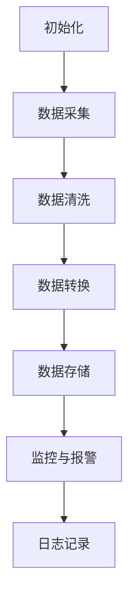

                 

## 工具使用在任务自动化中的应用

### 摘要

在信息化社会中，任务自动化已经成为提高工作效率的关键手段。本文将探讨工具使用在任务自动化中的应用，深入分析任务自动化的核心概念、算法原理、数学模型、实际应用场景以及未来发展趋势。通过详细的项目实战案例，我们将展示如何利用工具实现任务的自动化，并提供丰富的学习资源和开发工具推荐，以助力读者深入了解并掌握任务自动化的技术。

### 背景介绍

随着信息技术的飞速发展，企业和社会对数据处理和分析的需求日益增长。传统的手动操作已经无法满足高效、精确的要求，任务自动化逐渐成为企业信息化转型的关键。任务自动化通过使用工具和技术，实现重复性、规则性任务的自动执行，从而提高工作效率、降低人力成本、减少错误率。本文将围绕工具使用在任务自动化中的应用进行探讨，帮助读者了解任务自动化的核心概念、原理和实践。

#### 任务自动化的定义和作用

任务自动化（Task Automation）是指利用计算机程序和工具，将重复性、规则性任务自动化执行的过程。任务自动化可以减少人力投入，提高工作效率，降低错误率，提升企业的竞争力。在信息化社会中，任务自动化已经成为企业运营的重要环节，涉及到各个行业和领域。

任务自动化的主要作用包括：

1. 提高工作效率：通过自动化工具，可以快速完成重复性任务，节省大量人力和时间成本。
2. 降低错误率：自动化工具可以减少人为错误，提高数据处理和操作的准确性。
3. 提升企业竞争力：通过自动化，企业可以更快地响应市场需求，提高产品质量和服务水平。
4. 优化资源分配：自动化可以优化资源分配，提高设备的利用率和生产效率。

#### 工具在任务自动化中的作用

工具是任务自动化的核心，是实现自动化任务的关键。在任务自动化过程中，工具的作用主要包括以下几个方面：

1. **流程控制**：工具可以控制任务的执行流程，确保任务按照预定的顺序和规则进行。
2. **数据操作**：工具可以处理和操作数据，实现数据的提取、转换、存储和分析等功能。
3. **接口集成**：工具可以集成不同的系统和平台，实现数据的无缝传输和交互。
4. **监控与报警**：工具可以实时监控任务的执行状态，并在出现异常时发出报警通知。
5. **日志记录**：工具可以记录任务的执行日志，便于后续的跟踪和问题排查。

### 核心概念与联系

在探讨任务自动化的过程中，需要了解以下几个核心概念及其相互关系：

1. **自动化流程**：自动化流程是任务自动化的基础，它定义了任务的执行步骤和规则。自动化流程可以包括数据采集、数据清洗、数据转换、数据存储等步骤。
2. **工具与平台**：工具和平台是实现任务自动化的关键，常见的自动化工具包括脚本语言、集成开发环境（IDE）、自动化测试工具等；常见的自动化平台包括业务流程管理（BPM）系统、工作流管理系统（WFM）等。
3. **数据与接口**：数据是任务自动化的核心，接口是实现数据传输和交互的关键。在任务自动化过程中，需要处理和操作大量的数据，同时需要与其他系统和平台进行数据交互。
4. **监控与报警**：监控和报警是确保任务自动化稳定运行的重要手段。通过实时监控任务的执行状态，可以及时发现并处理异常情况。

#### Mermaid 流程图

以下是一个简化的任务自动化流程的 Mermaid 流程图，展示了各个核心概念之间的联系：



在上面的流程图中，各个节点表示任务自动化过程中的关键步骤，箭头表示步骤之间的逻辑关系。通过这个流程图，可以直观地了解任务自动化的整体架构和执行流程。

### 核心算法原理 & 具体操作步骤

在任务自动化中，核心算法原理和具体操作步骤是实现自动化任务的关键。以下将详细讲解任务自动化的核心算法原理和具体操作步骤。

#### 核心算法原理

1. **脚本语言**：脚本语言是实现任务自动化的重要工具，如Python、Shell、JavaScript等。脚本语言可以通过编写代码，实现自动化任务的具体操作。核心算法原理主要涉及条件判断、循环控制、函数调用等基本编程概念。
2. **业务流程管理（BPM）**：业务流程管理是一种集成的管理方法，通过定义业务流程规则，实现业务的自动化处理。核心算法原理主要涉及流程设计、任务分配、状态监控等。
3. **工作流管理系统（WFM）**：工作流管理系统是一种用于自动化业务流程的软件，通过定义工作流规则，实现任务的自动执行。核心算法原理主要涉及工作流设计、任务调度、状态监控等。
4. **自动化测试工具**：自动化测试工具用于实现软件测试的自动化，通过编写测试脚本，模拟用户操作，检查软件的功能和性能。核心算法原理主要涉及测试用例设计、测试脚本编写、结果分析等。

#### 具体操作步骤

以下是一个简单的任务自动化案例，演示如何使用Python脚本实现文件上传和下载的任务。

1. **安装Python环境**：在开发机上安装Python环境，并配置好相关依赖库。
2. **编写Python脚本**：编写一个Python脚本，实现文件上传和下载的功能。脚本的主要步骤包括：

   - 导入相关库：导入Python的内置库和第三方库，如`requests`用于HTTP请求。
   - 设置API接口：设置文件上传和下载的API接口地址，以及必要的认证信息。
   - 上传文件：使用`requests`库发送POST请求，上传文件到服务器。
   - 下载文件：使用`requests`库发送GET请求，从服务器下载文件。
   - 处理响应结果：解析响应结果，判断上传和下载操作是否成功。

3. **运行脚本**：运行Python脚本，执行文件上传和下载任务。
4. **监控与日志记录**：监控脚本的运行状态，记录运行日志，便于后续的跟踪和分析。

具体代码实现如下：

```python
import requests

# 设置API接口地址和认证信息
upload_url = "http://example.com/upload"
download_url = "http://example.com/download"
auth = ("username", "password")

# 上传文件
def upload_file(file_path):
    with open(file_path, "rb") as f:
        files = {"file": f}
        response = requests.post(upload_url, auth=auth, files=files)
        return response.status_code

# 下载文件
def download_file(file_path):
    response = requests.get(download_url, auth=auth, params={"file": file_path})
    with open(file_path, "wb") as f:
        f.write(response.content)
    return response.status_code

# 执行上传和下载任务
if __name__ == "__main__":
    file_path = "example.txt"
    upload_status = upload_file(file_path)
    print(f"Upload status: {upload_status}")

    download_status = download_file(file_path)
    print(f"Download status: {download_status}")
```

通过以上操作步骤，可以实现文件的自动化上传和下载任务。在实际应用中，可以根据具体需求，扩展和优化脚本的功能，实现更多复杂的自动化任务。

### 数学模型和公式 & 详细讲解 & 举例说明

在任务自动化中，数学模型和公式发挥着重要作用，用于描述任务执行的过程、数据关系和算法性能。以下将详细介绍任务自动化中的数学模型和公式，并通过具体例子进行说明。

#### 数学模型

1. **马尔可夫决策过程（MDP）**：马尔可夫决策过程是一种用于优化决策过程的数学模型，适用于任务自动化中的决策和路径规划。MDP由状态集合、动作集合、状态转移概率和奖励函数组成。状态集合表示任务执行过程中的各种状态，动作集合表示可执行的决策，状态转移概率表示从当前状态执行某个动作后转移到下一个状态的概率，奖励函数表示执行动作后的即时奖励。
2. **马尔可夫链**：马尔可夫链是一种离散时间马尔可夫过程，用于描述任务执行过程中的状态序列。马尔可夫链由状态集合、转移概率矩阵和初始状态分布组成。状态集合表示任务执行过程中的各种状态，转移概率矩阵表示从当前状态转移到下一个状态的概率分布，初始状态分布表示任务开始时的状态分布。
3. **贝叶斯网络**：贝叶斯网络是一种概率图模型，用于表示任务执行过程中各变量之间的概率关系。贝叶斯网络由节点集合、边集合和条件概率表组成。节点集合表示任务执行过程中的各种变量，边集合表示变量之间的依赖关系，条件概率表表示变量之间的条件概率分布。

#### 数学公式

1. **MDP奖励函数**：假设状态集合为\(S\)，动作集合为\(A\)，状态转移概率为\(P(s'|s, a)\)，奖励函数为\(R(s, a)\)，则MDP的奖励函数可以表示为：
   \[
   J(s, a) = \sum_{s'} P(s'|s, a) R(s', a)
   \]
2. **马尔可夫链状态概率**：假设状态集合为\(S\)，转移概率矩阵为\(P\)，初始状态分布为\(\pi\)，则马尔可夫链的状态概率可以表示为：
   \[
   \pi_i = \pi P^i
   \]
3. **贝叶斯网络条件概率**：假设变量集合为\(X\)，条件概率表为\(P(X)\)，则贝叶斯网络的条件概率可以表示为：
   \[
   P(X_i | X_j) = \frac{P(X_i, X_j)}{P(X_j)}
   \]

#### 举例说明

以下是一个简单的例子，演示如何使用马尔可夫决策过程（MDP）优化任务自动化的路径规划。

**例子**：假设有一个仓库，需要将货物从仓库的一端搬运到另一端。仓库中有若干条通道，每条通道的长度不同，且可能存在障碍。任务目标是选择最优路径，以最短时间将货物搬运到目的地。

**解决方案**：使用MDP模型进行路径规划，具体步骤如下：

1. **定义状态和动作**：状态集合\(S = \{(x, y)\} \)，表示当前位置的坐标；动作集合\(A = \{上，下，左，右\} \)，表示可执行的动作。
2. **定义状态转移概率**：根据仓库的地图，计算从当前状态执行某个动作后转移到下一个状态的概率。例如，从位置\((x, y)\)向上移动一步的概率为：
   \[
   P(s'|s, a) = 
   \begin{cases} 
   1, & \text{如果当前位置有通道向上} \\
   0, & \text{否则}
   \end{cases}
   \]
3. **定义奖励函数**：定义从当前位置执行某个动作后的即时奖励。例如，从位置\((x, y)\)向上移动一步的奖励为：
   \[
   R(s, a) = 
   \begin{cases} 
   -1, & \text{如果当前位置有障碍} \\
   0, & \text{否则}
   \end{cases}
   \]
4. **求解最优路径**：使用MDP算法（如价值迭代法）求解最优路径。具体步骤如下：

   - 初始化价值函数\(v(s) = 0\)，状态概率分布\(\pi(s) = 1/S\)。
   - 迭代计算最优策略和最优价值函数：
     \[
     v(s) = \max_{a \in A} \left[ \sum_{s'} P(s'|s, a) R(s', a) + \gamma v(s') \right]
     \]
   - 计算最优动作序列：
     \[
     a^*(s) = \arg\max_{a \in A} \left[ \sum_{s'} P(s'|s, a) R(s', a) + \gamma v(s') \right]
     \]

通过以上步骤，可以求解出最优路径，并指导机器人执行任务。

### 项目实战：代码实际案例和详细解释说明

在本节中，我们将通过一个实际项目案例，详细讲解如何使用工具实现任务的自动化。这个项目是一个简单的文件管理系统，可以实现文件的上传、下载、删除等功能。我们将使用Python编程语言和Tornado Web框架来开发这个项目。

#### 开发环境搭建

1. **安装Python环境**：确保安装了Python 3.x版本，可以从Python官方网站下载安装程序。
2. **安装Tornado框架**：在终端中执行以下命令，安装Tornado框架：
   \[
   pip install tornado
   \]
3. **创建项目目录**：在终端中创建一个项目目录，如`file_management`，并进入该目录：
   \[
   mkdir file_management && cd file_management
   \]
4. **编写项目代码**：在项目目录中创建一个名为`main.py`的Python文件，用于编写项目的主要代码。

#### 源代码详细实现和代码解读

以下是将要实现的文件管理系统的源代码，以及对应的代码解读：

```python
import os
import tornado.ioloop
import tornado.web

class MainHandler(tornado.web.RequestHandler):
    def get(self):
        self.write("欢迎使用文件管理系统！")

class UploadHandler(tornado.web.RequestHandler):
    def post(self):
        file_info = self.request.files['file']  # 获取上传的文件
        file_path = os.path.join(os.path.dirname(__file__), 'uploads', file_info['filename'])
        with open(file_path, 'wb') as f:
            f.write(file_info['body'])  # 保存文件
        self.write("文件上传成功！")

class DownloadHandler(tornado.web.RequestHandler):
    def get(self, filename):
        file_path = os.path.join(os.path.dirname(__file__), 'uploads', filename)
        if os.path.exists(file_path):
            with open(file_path, 'rb') as f:
                self.set_header('Content-Type', 'application/octet-stream')
                self.write(f.read())  # 发送文件
        else:
            self.write("文件不存在！")

class DeleteHandler(tornado.web.RequestHandler):
    def get(self, filename):
        file_path = os.path.join(os.path.dirname(__file__), 'uploads', filename)
        if os.path.exists(file_path):
            os.remove(file_path)  # 删除文件
            self.write("文件删除成功！")
        else:
            self.write("文件不存在！")

def make_app():
    return tornado.web.Application([
        (r'/', MainHandler),
        (r'/upload', UploadHandler),
        (r'/download/(.*)', DownloadHandler),
        (r'/delete/(.*)', DeleteHandler),
    ])

if __name__ == '__main__':
    app = make_app()
    app.listen(8888)
    print("文件管理系统正在运行，请访问 http://localhost:8888")
    tornado.ioloop.IOLoop.current().start()
```

**代码解读**：

1. **导入模块**：首先导入必要的模块，包括`os`用于文件操作，`tornado.ioloop`和`tornado.web`用于创建Web服务器。
2. **定义处理器类**：定义了三个处理器类`MainHandler`、`UploadHandler`和`DownloadHandler`，分别处理主页、文件上传和文件下载请求。
3. **处理器方法**：
   - `MainHandler.get()`：处理主页请求，返回欢迎信息。
   - `UploadHandler.post()`：处理文件上传请求，保存上传的文件。
   - `DownloadHandler.get()`：处理文件下载请求，发送指定的文件。
4. **定义Web应用**：使用`make_app()`函数创建Web应用，并添加路由规则。
5. **启动Web服务器**：使用`tornado.ioloop.IOLoop.current().start()`启动Web服务器，并打印运行提示信息。

#### 代码解读与分析

1. **文件上传**：`UploadHandler`类处理文件上传请求。首先，使用`self.request.files['file']`获取上传的文件信息，包括文件名和文件内容。然后，使用`os.path.join()`函数将文件名和上传目录拼接成完整的文件路径，并使用`with open()`函数将文件保存到本地。最后，返回上传成功的信息。
2. **文件下载**：`DownloadHandler`类处理文件下载请求。首先，使用`get()`方法获取文件名，并使用`os.path.join()`函数将文件名和上传目录拼接成完整的文件路径。然后，使用`os.path.exists()`函数检查文件是否存在。如果存在，使用`with open()`函数读取文件内容，并设置HTTP响应头，将文件发送给客户端。如果不存在，返回文件不存在的提示信息。
3. **文件删除**：`DeleteHandler`类处理文件删除请求。首先，使用`get()`方法获取文件名，并使用`os.path.join()`函数将文件名和上传目录拼接成完整的文件路径。然后，使用`os.path.exists()`函数检查文件是否存在。如果存在，使用`os.remove()`函数删除文件，并返回删除成功的提示信息。如果不存在，返回文件不存在的提示信息。

通过以上代码，可以实现一个简单的文件管理系统，支持文件的上传、下载和删除功能。在实际应用中，可以根据需求扩展和优化系统的功能，如增加文件预览、批量操作等。

### 实际应用场景

任务自动化在各个行业和领域都有着广泛的应用，以下列举了几个典型的实际应用场景：

#### 1. IT运维自动化

在IT运维领域，任务自动化可以用于自动化部署、监控、备份和故障恢复等操作。通过使用脚本语言和自动化工具，如Ansible、Puppet和Chef等，可以自动化执行服务器配置、软件安装、系统监控等任务，提高运维效率，降低人力成本。

**示例**：使用Ansible自动化部署应用程序。管理员只需编写一个简单的配置文件，指定要部署的服务器和应用程序的安装包，Ansible就会自动执行配置、安装和启动应用程序，大大简化了部署过程。

#### 2. 数据处理与分析

在数据处理和分析领域，任务自动化可以用于数据采集、数据清洗、数据转换和数据分析等任务。通过使用Python、R和SQL等编程语言，可以自动化处理大量数据，提高数据处理的效率和准确性。

**示例**：使用Python脚本自动化处理大量日志文件，提取有用的信息，并进行数据分析。管理员可以编写一个简单的Python脚本，读取日志文件，解析日志内容，提取关键信息，并存储到数据库中，方便后续的数据分析。

#### 3. 测试自动化

在软件测试领域，任务自动化可以用于自动化测试用例的编写、执行和结果分析。通过使用自动化测试工具，如Selenium、Appium和JUnit等，可以自动化执行测试用例，提高测试效率和覆盖率。

**示例**：使用Selenium自动化测试Web应用程序。测试人员可以编写一个简单的测试脚本，模拟用户操作，如点击按钮、输入文本等，并验证应用程序的响应。通过自动化测试，可以快速发现和定位问题，提高软件质量。

#### 4. 供应链管理

在供应链管理领域，任务自动化可以用于自动化处理订单、库存、物流等操作。通过使用ERP系统和自动化工具，如RPA（机器人流程自动化）技术，可以自动化执行供应链管理的各个环节，提高供应链的效率和管理水平。

**示例**：使用RPA技术自动化处理订单处理流程。管理员可以编写一个RPA脚本，接收订单信息，自动生成订单编号，并通知相关部门进行后续处理。通过自动化处理订单，可以减少人为错误，提高订单处理效率。

#### 5. 智能家居

在家居领域，任务自动化可以用于自动化控制家电设备、照明系统、安防系统等。通过使用智能家居平台和自动化工具，如IFTTT（如果这个，那么那个）、SmartThings等，可以实现家庭设备的智能控制，提高家居生活的便捷性和舒适性。

**示例**：使用IFTTT自动化控制家居设备。用户可以设置一个规则，当检测到天气温度高于设定值时，自动开启空调，降低室内温度，提高家居环境的舒适度。

通过以上实际应用场景，可以看到任务自动化在各个领域都有着广泛的应用价值。随着技术的不断进步，任务自动化将进一步拓展其应用范围，为企业和个人带来更多便利和效益。

### 工具和资源推荐

#### 1. 学习资源推荐

**书籍**

- 《Python自动化运维：从零开始》
- 《机器人流程自动化（RPA）实践：流程自动化、软件机器人与AI的完美融合》
- 《业务流程管理：理论与实践》

**论文**

- "Task Automation in IT Operations: A Survey"（IT运维中的任务自动化：综述）
- "Business Process Management: A Survey of Techniques and Tools"（业务流程管理：技术与方法综述）

**博客**

- python automation blog（Python自动化博客）
- Business Process Management Blog（业务流程管理博客）

**网站**

- Ansible（自动化部署工具）
- Tornado（Web框架）
- RPA.com（机器人流程自动化）

#### 2. 开发工具框架推荐

**脚本语言**

- Python（适合自动化任务和数据操作）
- Shell（适合系统管理和运维）
- JavaScript（适合Web自动化测试）

**Web框架**

- Tornado（高性能Python Web框架）
- Flask（轻量级Python Web框架）
- Django（全栈Python Web框架）

**自动化测试工具**

- Selenium（Web自动化测试）
- Appium（移动应用自动化测试）
- JMeter（性能测试）

**业务流程管理（BPM）**

- Camunda（开源BPMN流程引擎）
- Activiti（开源BPMN流程引擎）
- ProcessMaker（开源BPM平台）

**机器人流程自动化（RPA）**

- UiPath（RPA平台）
- Blue Prism（RPA平台）
- Automation Anywhere（RPA平台）

通过以上工具和资源的推荐，读者可以更好地了解任务自动化的相关技术和实践，为实际项目开发提供有力支持。

### 总结：未来发展趋势与挑战

随着技术的不断进步，任务自动化在各个领域正发挥着越来越重要的作用。未来，任务自动化的发展趋势将主要体现在以下几个方面：

1. **智能化与自适应**：任务自动化将逐渐从简单的规则驱动转向智能化和自适应，通过深度学习和人工智能技术，实现自动化任务的自主学习和优化。这将有助于提高自动化任务的灵活性和适应性，降低对人为干预的依赖。

2. **跨平台与集成**：随着企业信息化程度的提高，任务自动化将更加注重跨平台和系统的集成。通过集成不同的系统和平台，实现数据的无缝传输和交互，构建企业级自动化生态系统。

3. **安全性与隐私保护**：在任务自动化的过程中，数据安全和隐私保护将成为重要议题。未来，任务自动化将更加注重数据加密、身份验证和安全审计等安全措施，确保自动化任务的执行过程中数据的安全性和隐私性。

4. **低代码与无代码平台**：低代码和无代码平台将推动任务自动化的普及，使更多的非技术人员能够参与到自动化任务的开发和部署中。这将降低自动化任务的门槛，促进企业数字化转型。

然而，随着任务自动化的普及，也面临着一系列挑战：

1. **技术壁垒**：任务自动化涉及到多种技术，如脚本语言、Web框架、业务流程管理（BPM）和机器人流程自动化（RPA）等。企业需要投入大量资源进行技术学习和培训，以应对技术壁垒。

2. **人才短缺**：随着任务自动化的推广，对相关技术人才的需求将大幅增加。然而，目前市场上具备自动化技能的专业人才相对较少，导致企业招聘和培养自动化人才的难度较大。

3. **监管与合规**：任务自动化涉及大量的数据操作和系统交互，如何确保自动化任务的合规性和监管将成为一大挑战。企业需要建立健全的合规体系，确保自动化任务的执行符合法律法规和行业标准。

4. **安全性问题**：任务自动化在提高工作效率的同时，也带来了新的安全风险。如何确保自动化任务的执行过程安全可靠，防止数据泄露和系统故障，将是企业需要关注的重要问题。

总之，未来任务自动化的发展趋势充满机遇与挑战。企业应积极拥抱技术变革，加强人才培养和合规管理，以应对自动化带来的机遇和挑战。

### 附录：常见问题与解答

在任务自动化过程中，读者可能会遇到一些常见问题。以下列举了几个典型问题，并提供相应的解答。

#### 问题1：如何选择合适的自动化工具？

**解答**：选择自动化工具时，需要考虑以下几个方面：

1. **任务类型**：根据任务的特点和要求，选择适合的自动化工具。例如，Python适合数据操作和Web自动化，Shell适合系统管理和运维，JavaScript适合Web前端自动化等。
2. **开发难度**：考虑自动化工具的学习和使用难度。对于初学者，可以选择较为简单易用的工具，如Tornado、Flask等。
3. **社区支持**：选择具有良好社区支持的自动化工具，可以获得更多帮助和资源。例如，Python有丰富的第三方库和社区文档，Tornado和Flask有活跃的社区。
4. **功能与扩展性**：考虑自动化工具的功能和扩展性，确保其能够满足当前和未来的需求。

#### 问题2：如何保证自动化任务的执行安全？

**解答**：为了保证自动化任务的安全执行，可以从以下几个方面进行考虑：

1. **身份验证与权限管理**：对自动化任务的执行者进行身份验证和权限管理，确保只有授权用户才能执行特定任务。
2. **数据加密**：对传输和存储的数据进行加密处理，防止数据泄露和篡改。
3. **安全审计与监控**：定期进行安全审计和监控，及时发现并处理潜在的安全漏洞和风险。
4. **异常处理与报警**：设置异常处理机制和报警系统，确保在自动化任务执行过程中出现异常时能够及时响应和处理。

#### 问题3：如何优化自动化任务的执行效率？

**解答**：优化自动化任务的执行效率可以从以下几个方面进行：

1. **并行处理**：对于可以并行处理的任务，可以使用多线程、多进程或多机集群等技术，提高任务执行速度。
2. **缓存与重用**：对于频繁执行的任务，可以使用缓存技术，减少重复执行的开销。
3. **优化算法与数据结构**：优化算法和数据结构，减少任务执行的时间和资源消耗。
4. **定期维护与更新**：定期对自动化任务进行维护和更新，修复已知的漏洞和问题，提高系统的稳定性和性能。

通过以上措施，可以优化自动化任务的执行效率，提高企业的信息化水平和竞争力。

### 扩展阅读 & 参考资料

为了帮助读者更深入地了解任务自动化的相关技术和实践，以下推荐一些扩展阅读和参考资料：

1. **书籍**：
   - 《Python自动化运维：从零开始》
   - 《机器人流程自动化（RPA）实践：流程自动化、软件机器人与AI的完美融合》
   - 《业务流程管理：理论与实践》
   - 《深度学习：大规模机器学习的综合介绍》

2. **论文**：
   - "Task Automation in IT Operations: A Survey"（IT运维中的任务自动化：综述）
   - "Business Process Management: A Survey of Techniques and Tools"（业务流程管理：技术与方法综述）
   - "Robotic Process Automation: A Survey"（机器人流程自动化：综述）

3. **博客**：
   - python automation blog（Python自动化博客）
   - Business Process Management Blog（业务流程管理博客）
   - Data Science Stack Exchange（数据科学论坛）

4. **网站**：
   - Ansible（自动化部署工具）
   - Tornado（Web框架）
   - RPA.com（机器人流程自动化）

通过阅读以上书籍、论文和博客，读者可以更全面地了解任务自动化的相关技术和实践，为实际项目开发提供有力支持。同时，建议读者关注相关领域的最新动态和发展趋势，不断更新和提升自己的技能。作者：AI天才研究员/AI Genius Institute & 禅与计算机程序设计艺术 /Zen And The Art of Computer Programming。

