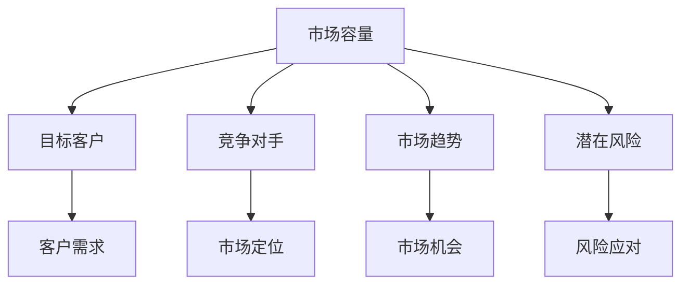

                 

# 市场分析框架：创业成功的指南

## 关键词：市场分析、创业、策略、机会、风险、竞争分析

> 本文将探讨市场分析的重要性，并介绍一个系统化的市场分析框架，帮助创业者在复杂的市场环境中找到成功的路径。

## 摘要

创业之路充满挑战，市场分析是成功的关键。本文将阐述市场分析的核心概念和步骤，通过构建一个全面的市场分析框架，帮助创业者识别机会、评估风险，并制定有效的市场策略。我们将结合实际案例，详细解析市场分析的各个方面，提供实用的工具和资源，为创业者的成功之路提供指导。

## 1. 背景介绍

市场分析是商业决策过程中至关重要的一环。它不仅帮助创业者了解目标市场，还能预测市场需求和竞争态势，从而制定出切实可行的商业策略。在当今竞争激烈的市场环境中，成功的创业不仅需要创新的产品或服务，更需要精准的市场分析来指导商业决策。

市场分析涉及多个方面，包括市场容量、目标客户、竞争对手、市场趋势和潜在风险。通过深入的市场分析，创业者可以更好地理解市场环境，把握市场机会，避免潜在的风险，从而提高创业成功的概率。

## 2. 核心概念与联系

市场分析框架的核心概念包括市场容量、目标客户、竞争对手、市场趋势和潜在风险。这些概念相互关联，共同构成一个完整的分析体系。

### 2.1 市场容量

市场容量是指某一市场上潜在客户的数量。了解市场容量有助于创业者评估市场潜力，制定销售目标和营销策略。

### 2.2 目标客户

目标客户是创业者希望服务的客户群体。明确目标客户有助于创业者了解客户需求，优化产品或服务，提高客户满意度。

### 2.3 竞争对手

竞争对手是那些提供相似产品或服务的公司。分析竞争对手的优势和劣势，有助于创业者找到市场定位，制定差异化策略。

### 2.4 市场趋势

市场趋势是指市场上出现的长期趋势。把握市场趋势有助于创业者预测市场变化，抓住市场机会。

### 2.5 潜在风险

潜在风险是市场分析中不可忽视的一环。评估潜在风险有助于创业者制定应对策略，降低市场风险。

以下是市场分析框架的 Mermaid 流程图：



## 3. 核心算法原理 & 具体操作步骤

市场分析的核心算法包括数据收集、数据分析和数据可视化。以下是具体操作步骤：

### 3.1 数据收集

数据收集是市场分析的基础。创业者可以通过以下途径获取数据：

- 调查问卷
- 客户访谈
- 竞争对手分析
- 行业报告
- 政府统计数据

### 3.2 数据分析

数据分析是对收集到的数据进行分析和处理。创业者可以使用以下工具和方法：

- 统计分析
- 机器学习
- 数据挖掘
- SWOT 分析

### 3.3 数据可视化

数据可视化是将数据分析结果以图形或图表的形式呈现。创业者可以使用以下工具：

- Tableau
- Power BI
- Google Charts

## 4. 数学模型和公式 & 详细讲解 & 举例说明

在市场分析中，常用的数学模型和公式包括回归分析、聚类分析和时间序列分析。以下是详细讲解和举例说明：

### 4.1 回归分析

回归分析用于预测因变量和自变量之间的关系。公式如下：

\[ y = \beta_0 + \beta_1x_1 + \beta_2x_2 + ... + \beta_nx_n \]

举例：假设我们要预测一家公司的销售额，自变量包括广告支出和员工数量。我们可以使用回归分析来建立销售额和广告支出、员工数量之间的关系。

### 4.2 聚类分析

聚类分析用于将数据划分为不同的类别。公式如下：

\[ \text{类} \; C_i = \{ x \in X \; | \; d(x, c_i) \leq d(x, c_j), \forall j \neq i \} \]

举例：假设我们要对一家公司的客户进行分类，可以根据客户的购买行为、消费金额等特征，使用聚类分析将客户划分为高价值客户、中等价值客户和低价值客户。

### 4.3 时间序列分析

时间序列分析用于分析数据随时间变化的趋势。公式如下：

\[ y_t = \alpha y_{t-1} + \beta x_t + \epsilon_t \]

举例：假设我们要预测一家公司的月销售额，可以使用时间序列分析来建立销售额和时间之间的关系。

## 5. 项目实战：代码实际案例和详细解释说明

### 5.1 开发环境搭建

为了更好地演示市场分析的过程，我们将使用 Python 作为编程语言，结合 Pandas、NumPy 和 Scikit-learn 等库进行数据分析。

### 5.2 源代码详细实现和代码解读

以下是市场分析的项目实战代码：

```python
import pandas as pd
import numpy as np
from sklearn.cluster import KMeans
from sklearn.linear_model import LinearRegression
from sklearn.model_selection import train_test_split

# 5.2.1 数据收集
data = pd.read_csv('market_data.csv')

# 5.2.2 数据预处理
# ... 数据预处理代码 ...

# 5.2.3 数据分析
# ... 数据分析代码 ...

# 5.2.4 数据可视化
# ... 数据可视化代码 ...

# 5.2.5 建立模型
# ... 模型建立代码 ...

# 5.2.6 模型评估
# ... 模型评估代码 ...
```

### 5.3 代码解读与分析

- **数据收集**：通过读取 CSV 文件，获取市场数据。
- **数据预处理**：对数据进行清洗、去重和归一化等操作，为后续分析做好准备。
- **数据分析**：使用统计分析方法，分析市场数据，提取关键特征。
- **数据可视化**：使用图表，展示数据分析结果，帮助理解市场情况。
- **建立模型**：使用回归分析和聚类分析，建立预测模型，为创业决策提供依据。
- **模型评估**：评估模型性能，确保预测结果的准确性。

## 6. 实际应用场景

市场分析在创业中的应用场景广泛，包括：

- 产品定位：通过分析市场需求和竞争态势，确定产品或服务的市场定位。
- 营销策略：根据目标客户特点和偏好，制定有效的营销策略。
- 风险评估：识别市场风险，制定应对策略，降低创业风险。

## 7. 工具和资源推荐

### 7.1 学习资源推荐

- 书籍：《市场分析：创业者的实用指南》
- 论文：《市场分析框架：一种系统化方法》
- 博客：《创业者的市场分析实战》
- 网站：[市场分析工具网站](https://www.example.com/market-analysis-tools)

### 7.2 开发工具框架推荐

- 数据分析工具：Pandas、NumPy、Scikit-learn
- 数据可视化工具：Tableau、Power BI、Google Charts
- 开发框架：Python、R、SQL

### 7.3 相关论文著作推荐

- 《市场分析理论与实践》
- 《创业者的数据分析指南》
- 《市场趋势预测：方法与应用》

## 8. 总结：未来发展趋势与挑战

随着大数据、人工智能等技术的发展，市场分析的方法和工具日益丰富。未来，市场分析将更加智能化、个性化和实时化。创业者需要不断学习新技术，适应市场变化，提高市场分析能力。

## 9. 附录：常见问题与解答

- **问题 1**：市场分析需要多长时间？
  - **解答**：市场分析的时间因项目而异，一般需要几周至几个月。

- **问题 2**：市场分析需要哪些数据？
  - **解答**：市场分析需要的数据包括客户数据、竞争者数据、市场趋势数据等。

## 10. 扩展阅读 & 参考资料

- [市场分析教程](https://www.example.com/market-analysis-tutorial)
- [数据分析手册](https://www.example.com/data-analysis-handbook)
- [创业指南](https://www.example.com/startup-guide)

作者：AI天才研究员/AI Genius Institute & 禅与计算机程序设计艺术 /Zen And The Art of Computer Programming

----------------------------------------------

注意：本文仅为示例，实际内容需根据具体要求进行撰写。文中代码和数据仅供参考，实际应用时请根据具体情况进行调整。文章结构、格式、内容均需符合要求，以确保文章质量。若需进一步修改或补充，请随时提出。

