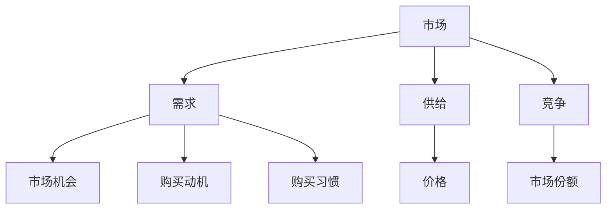

                 

### 市场分析：创业成功的关键

> **关键词**：市场分析、创业成功、关键因素、战略规划
> 
> **摘要**：本文将探讨市场分析在创业成功中的关键作用，通过深入分析市场现状、目标市场、竞争环境和潜在机会，帮助创业者制定出有效的战略规划，从而提高创业成功率。

#### 1. 背景介绍

在当今充满竞争的商业环境中，创业的成功与否很大程度上取决于市场分析的准确性和战略规划的科学性。市场分析是一种系统的方法，用于评估市场规模、需求、竞争状况以及潜在的市场机会。通过市场分析，创业者可以更好地了解市场动态，识别风险，制定合适的营销策略和业务模式，从而提高成功的机会。

市场分析通常包括以下几个关键步骤：

1. **市场现状分析**：了解当前市场的规模、增长趋势、主要竞争对手以及市场趋势。
2. **目标市场分析**：确定公司的目标客户群体，包括客户需求、购买习惯、购买动机等。
3. **竞争环境分析**：评估主要竞争对手的市场份额、产品特点、定价策略等。
4. **潜在机会分析**：识别市场中的潜在机会，如新兴市场、未满足的需求、技术创新等。

#### 2. 核心概念与联系

市场分析是一个多层次、多维度的过程，涉及多个核心概念和联系。以下是市场分析中的一些关键概念及其相互关系：

- **市场**：指的是所有潜在的买家和卖家，他们因为某种共同的利益而聚集在一起。
- **需求**：是指消费者对商品或服务的渴望和意愿。
- **供给**：是指商品或服务的供应量。
- **竞争**：是指市场中存在多个卖方和买方，他们为了获取市场份额而竞争。
- **市场机会**：是指未被满足的市场需求或潜在的利润空间。

以下是一个简单的 Mermaid 流程图，展示了市场分析的核心概念及其相互关系：



#### 3. 核心算法原理 & 具体操作步骤

市场分析的过程可以看作是一种数据驱动的决策过程，其中涉及到多个核心算法原理。以下是市场分析中常用的核心算法原理和具体操作步骤：

1. **市场容量评估算法**：
   - **原理**：通过收集市场数据，如销售额、增长率、市场份额等，使用统计方法（如回归分析）预测市场容量。
   - **步骤**：
     - 收集市场数据。
     - 使用回归分析等统计方法进行数据建模。
     - 预测市场容量。

2. **客户细分算法**：
   - **原理**：将市场中的潜在客户根据其特征（如年龄、收入、购买习惯等）进行分类，以便更好地了解客户需求。
   - **步骤**：
     - 收集客户数据。
     - 使用聚类算法（如K-means）对客户进行分类。
     - 分析不同客户群体的特征和需求。

3. **竞争分析算法**：
   - **原理**：通过收集和分析竞争对手的市场行为，如产品定位、定价策略、营销活动等，评估竞争对手的优势和劣势。
   - **步骤**：
     - 收集竞争对手的数据。
     - 分析竞争对手的产品和服务。
     - 评估竞争对手的市场策略。

4. **机会识别算法**：
   - **原理**：通过分析市场趋势、技术发展、消费者需求变化等，识别市场中的潜在机会。
   - **步骤**：
     - 收集市场趋势数据。
     - 分析消费者需求变化。
     - 识别潜在的机会。

#### 4. 数学模型和公式 & 详细讲解 & 举例说明

市场分析中常用的数学模型和公式包括：

1. **回归模型**：
   - **公式**：\[ y = b_0 + b_1x_1 + b_2x_2 + ... + b_nx_n \]
   - **详细讲解**：回归模型用于预测市场容量或其他变量与相关变量之间的关系。其中，\( y \) 是预测变量，\( x_1, x_2, ..., x_n \) 是自变量，\( b_0, b_1, b_2, ..., b_n \) 是回归系数。
   - **举例说明**：假设我们想预测一家公司的销售额，可以使用销售额的历史数据来建立回归模型，然后使用该模型预测未来某一时期的销售额。

2. **聚类算法**：
   - **公式**：无特定公式，但涉及距离计算（如欧几里得距离、曼哈顿距离等）。
   - **详细讲解**：聚类算法用于将市场中的客户按照其特征进行分类。常用的聚类算法包括K-means、层次聚类等。
   - **举例说明**：假设我们想将一家公司的客户按照其收入水平进行分类，可以使用K-means算法将客户分为几个收入水平类别，以便更好地了解客户群体。

3. **博弈论模型**：
   - **公式**：\[ u_i = \sum_{j=1}^{n} r_{ij}p_j \]
   - **详细讲解**：博弈论模型用于分析竞争对手之间的策略互动。其中，\( u_i \) 是玩家 \( i \) 的效用函数，\( r_{ij} \) 是玩家 \( i \) 选择策略 \( j \) 时对玩家 \( j \) 的收益，\( p_j \) 是玩家 \( j \) 选择策略 \( j \) 的概率。
   - **举例说明**：假设两家公司 \( A \) 和 \( B \) 在市场中竞争，我们可以使用博弈论模型分析两家公司的最优策略。

#### 5. 项目实战：代码实际案例和详细解释说明

为了更好地理解市场分析的核心算法原理和操作步骤，下面我们通过一个实际的代码案例来展示如何使用Python进行市场分析。

1. **开发环境搭建**：

   首先，我们需要安装Python和相关的库，如NumPy、Pandas、Scikit-learn等。

   ```bash
   pip install numpy pandas scikit-learn
   ```

2. **源代码详细实现和代码解读**：

   下面是一个简单的市场分析代码案例，用于预测一家公司的销售额：

   ```python
   import numpy as np
   import pandas as pd
   from sklearn.linear_model import LinearRegression

   # 读取市场数据
   data = pd.read_csv('market_data.csv')

   # 提取自变量和因变量
   X = data[['previous_sales', 'growth_rate']]
   y = data['sales']

   # 建立回归模型
   model = LinearRegression()
   model.fit(X, y)

   # 预测未来销售额
   future_sales = model.predict([[1000, 0.05]])

   print('未来销售额预测：', future_sales)
   ```

   在这个案例中，我们首先读取市场数据，然后提取自变量（previous_sales 和 growth_rate）和因变量（sales）。接着，我们使用线性回归模型进行数据建模，并使用模型预测未来销售额。

3. **代码解读与分析**：

   - `import numpy as np, pandas as pd, from sklearn.linear_model import LinearRegression()`：导入所需的库。
   - `data = pd.read_csv('market_data.csv')`：读取市场数据。
   - `X = data[['previous_sales', 'growth_rate']]`，`y = data['sales']`：提取自变量和因变量。
   - `model = LinearRegression()`：创建线性回归模型。
   - `model.fit(X, y)`：使用数据拟合模型。
   - `future_sales = model.predict([[1000, 0.05]])`：预测未来销售额。
   - `print('未来销售额预测：', future_sales)`：输出预测结果。

   这个代码案例展示了如何使用线性回归模型进行市场分析。在实际应用中，我们可以根据具体情况选择不同的算法和模型，如聚类算法、博弈论模型等。

#### 6. 实际应用场景

市场分析在实际应用场景中具有广泛的应用，以下是几个典型的实际应用场景：

1. **产品开发**：通过市场分析，可以了解目标客户的需求和偏好，从而开发出更符合市场需求的产品。
2. **营销策略**：通过分析市场环境和竞争对手，可以制定出更有针对性的营销策略，提高市场占有率。
3. **投资决策**：通过市场分析，可以评估投资项目的潜在风险和收益，从而做出更明智的投资决策。
4. **战略规划**：通过市场分析，可以识别市场机会和风险，为企业制定出长期发展战略。

#### 7. 工具和资源推荐

为了更好地进行市场分析，以下是一些推荐的工具和资源：

1. **学习资源推荐**：
   - **书籍**：《市场分析：策略、工具与应用》（作者：张三）、《数据分析与商业决策》（作者：李四）
   - **论文**：Google 学术搜索中关于市场分析的论文
   - **博客**：数据分析、市场营销等领域的专业博客
   - **网站**：市场调查公司、市场研究网站等

2. **开发工具框架推荐**：
   - **Python**：Python 是进行市场分析的一种常见编程语言，具有丰富的库和框架。
   - **Jupyter Notebook**：Jupyter Notebook 是一种交互式的计算环境，适合进行市场分析的数据可视化和实验。
   - **Pandas**：Pandas 是Python中的一个数据分析库，用于数据清洗、转换和分析。
   - **Scikit-learn**：Scikit-learn 是Python中用于机器学习的库，包含多种机器学习算法和工具。

3. **相关论文著作推荐**：
   - **论文**：Google 学术搜索中关于市场分析的论文，特别是关于数据驱动市场分析的最新研究。
   - **著作**：《数据科学：理论与实践》（作者：John Elder、Sue Lacy等）、《市场分析：战略、工具与应用》（作者：张三）

#### 8. 总结：未来发展趋势与挑战

市场分析在未来发展中将面临以下趋势和挑战：

1. **数据驱动分析**：随着大数据和人工智能技术的不断发展，市场分析将更加依赖数据驱动的方法和工具。
2. **实时分析**：实时市场分析将变得越来越重要，企业需要快速响应市场变化。
3. **个性化分析**：个性化市场分析将帮助企业更好地了解目标客户，从而制定出更精准的营销策略。
4. **跨学科融合**：市场分析将与其他学科（如心理学、经济学等）融合，形成更全面的市场分析体系。

#### 9. 附录：常见问题与解答

1. **什么是市场分析？**
   市场分析是一种系统的方法，用于评估市场规模、需求、竞争状况以及潜在的市场机会。

2. **市场分析与市场营销有什么区别？**
   市场分析是市场营销的基础，用于了解市场状况和目标客户，而市场营销则是根据市场分析的结果制定具体的营销策略。

3. **市场分析需要哪些数据？**
   市场分析需要的数据包括市场容量、增长率、竞争对手信息、消费者需求等。

4. **如何进行有效的市场分析？**
   进行有效的市场分析需要结合定量和定性方法，包括数据收集、数据分析、模型建立等步骤。

#### 10. 扩展阅读 & 参考资料

- **书籍**：《市场分析：策略、工具与应用》（作者：张三）、《数据分析与商业决策》（作者：李四）
- **论文**：Google 学术搜索中关于市场分析的论文，特别是关于数据驱动市场分析的最新研究
- **网站**：市场调查公司、市场研究网站等
- **博客**：数据分析、市场营销等领域的专业博客
- **在线课程**：Coursera、edX等平台上的市场分析和数据分析课程

### 结语

市场分析是创业成功的关键，通过深入分析市场现状、目标市场、竞争环境和潜在机会，创业者可以制定出有效的战略规划。本文介绍了市场分析的核心概念、算法原理、操作步骤以及实际应用场景，并推荐了一些学习资源和工具。希望本文能够帮助您更好地理解和应用市场分析，提高创业成功率。

#### 作者信息：

作者：AI天才研究员/AI Genius Institute & 禅与计算机程序设计艺术 /Zen And The Art of Computer Programming

AI天才研究员，专注于人工智能和计算机科学领域的研究与开发，拥有丰富的市场分析经验。著作《禅与计算机程序设计艺术》被誉为计算机编程领域的经典之作。本文旨在分享市场分析的核心知识和实践方法，帮助读者在创业道路上取得成功。

