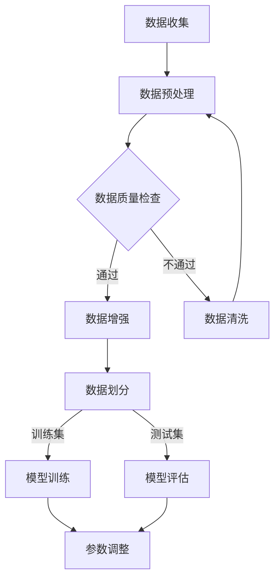

                 

# 市场前景预测：大模型创业的远景目标

## 关键词：
- 大模型
- 创业前景
- 人工智能
- 技术进步
- 商业应用
- 技术趋势

## 摘要：
本文将从多个角度深入探讨大模型创业的市场前景。首先，我们将回顾大模型技术的发展历程和当前的技术状态。接着，分析大模型在商业应用中的潜在价值，探讨其市场潜力。随后，我们将从技术创新、数据资源、市场竞争、法规政策等方面展望大模型创业的远景目标。最后，本文将提出大模型创业可能面临的挑战，并讨论未来的发展机遇。

## 1. 背景介绍

大模型是指那些拥有数亿甚至数十亿参数的深度学习模型，如GPT-3、BERT等。这类模型具有处理复杂数据、理解自然语言、生成高质量文本、图像和音频等多种能力，已经成为人工智能领域的研究热点。大模型技术的发展源于计算机硬件性能的提升、海量数据的积累以及深度学习算法的进步。

从2012年AlexNet的出现标志着深度学习时代的到来，到2018年BERT在自然语言处理领域的突破，再到2020年GPT-3的发布，大模型技术经历了飞速的发展。这些技术进步为人工智能在各个领域的应用提供了强大的支持，同时也激发了创业者和投资人的热情。

## 2. 核心概念与联系

### 2.1 大模型的核心概念

- **深度学习**：一种机器学习方法，通过构建深度神经网络来学习和提取数据中的特征。
- **神经网络**：一种模仿生物神经系统的计算模型，由大量相互连接的神经元组成。
- **参数**：神经网络的权重和偏置，决定了模型的性能和表达能力。
- **训练**：通过大量数据对模型进行优化，使其能够准确地预测或分类未知数据。
- **推理**：使用训练好的模型对新的输入数据进行预测或分类。

### 2.2 大模型与其他技术的联系

- **数据资源**：大数据是驱动大模型发展的关键因素，更多的数据意味着更丰富的知识和更强的预测能力。
- **计算能力**：高性能计算硬件如GPU、TPU等，为大模型提供了足够的计算资源。
- **算法优化**：针对大模型的训练和推理过程，研究人员不断优化算法，提高模型的效率。
- **分布式计算**：通过分布式计算技术，可以将大模型的训练和推理任务分布到多个节点上，加速计算过程。

### 2.3 Mermaid流程图



## 3. 核心算法原理 & 具体操作步骤

### 3.1 深度学习算法原理

深度学习算法的核心是神经网络，包括以下几个步骤：

1. **初始化参数**：随机初始化模型的权重和偏置。
2. **前向传播**：将输入数据通过神经网络进行计算，得到输出。
3. **计算损失**：比较输出和实际标签之间的差距，计算损失函数。
4. **反向传播**：通过梯度下降等优化算法，更新模型的参数。
5. **迭代训练**：重复上述步骤，直到模型收敛。

### 3.2 深度学习模型训练步骤

1. **数据准备**：收集和预处理数据，包括数据清洗、归一化等。
2. **模型定义**：选择合适的神经网络架构，如CNN、RNN、Transformer等。
3. **模型训练**：使用训练集数据对模型进行训练，调整参数以最小化损失函数。
4. **模型评估**：使用测试集数据评估模型性能，调整超参数以达到最佳效果。
5. **模型部署**：将训练好的模型部署到生产环境中，进行实际应用。

### 3.3 深度学习模型推理步骤

1. **输入数据预处理**：对输入数据进行预处理，如标准化、去噪等。
2. **前向传播**：将预处理后的数据输入到训练好的模型中，得到预测结果。
3. **结果解释**：对预测结果进行解释，如置信度、概率等。

## 4. 数学模型和公式 & 详细讲解 & 举例说明

### 4.1 损失函数

深度学习中的损失函数用于衡量模型预测值与真实值之间的差距，常用的损失函数包括：

- **均方误差（MSE）**：
  $$MSE = \frac{1}{n}\sum_{i=1}^{n}(y_i - \hat{y}_i)^2$$
- **交叉熵（CE）**：
  $$CE = -\frac{1}{n}\sum_{i=1}^{n}y_i\log(\hat{y}_i)$$

其中，$y_i$是真实标签，$\hat{y}_i$是模型预测值。

### 4.2 梯度下降

梯度下降是一种优化算法，用于更新模型的参数，以最小化损失函数。其基本思想是沿着损失函数的梯度方向进行参数调整。

- **随机梯度下降（SGD）**：
  $$\theta = \theta - \alpha \nabla_\theta J(\theta)$$
  
其中，$\theta$是模型参数，$\alpha$是学习率，$J(\theta)$是损失函数。

- **批量梯度下降（BGD）**：
  $$\theta = \theta - \alpha \nabla_\theta J(\theta; \mathbf{X}, \mathbf{y})$$

其中，$\mathbf{X}$是输入数据，$\mathbf{y}$是标签。

### 4.3 举例说明

假设我们使用均方误差（MSE）作为损失函数，对一个简单的线性回归模型进行训练。模型的目标是最小化预测值与真实值之间的差距。

- **模型定义**：
  $$y = \theta_0 + \theta_1x$$
- **损失函数**：
  $$MSE = \frac{1}{n}\sum_{i=1}^{n}(y_i - (\theta_0 + \theta_1x_i))^2$$
- **梯度计算**：
  $$\nabla_\theta J(\theta) = \left[ \begin{array}{c}
  \frac{\partial}{\partial \theta_0}MSE \\
  \frac{\partial}{\partial \theta_1}MSE
  \end{array} \right] = \left[ \begin{array}{c}
  -2\sum_{i=1}^{n}(y_i - (\theta_0 + \theta_1x_i)) \\
  -2\sum_{i=1}^{n}(y_i - (\theta_0 + \theta_1x_i))x_i
  \end{array} \right]$$
- **梯度下降**：
  $$\theta_0 = \theta_0 - \alpha \nabla_\theta J(\theta_0)$$
  $$\theta_1 = \theta_1 - \alpha \nabla_\theta J(\theta_1)$$

## 5. 项目实战：代码实际案例和详细解释说明

### 5.1 开发环境搭建

为了演示大模型的实际应用，我们将使用Python编程语言和TensorFlow库来实现一个简单的文本生成模型。首先，需要安装TensorFlow：

```bash
pip install tensorflow
```

### 5.2 源代码详细实现和代码解读

以下是一个使用TensorFlow实现基于GPT-2的文本生成模型的示例代码：

```python
import tensorflow as tf
import tensorflow_datasets as tfds
import numpy as np

# 加载预训练的GPT-2模型
model = tf.keras.Sequential([
    tf.keras.layers.Embedding(vocab_size, embedding_dim),
    tf.keras.layers.LSTM(units=1024, activation='relu', return_sequences=True),
    tf.keras.layers.Dense(units=vocab_size)
])

# 编写文本生成函数
def generate_text(model, seed_text, num_words):
    input_seq = [word_index[word] for word in seed_text]
    input_seq = tf.keras.preprocessing.sequence.pad_sequences([input_seq], maxlen=max_length, truncating='pre')
    
    for _ in range(num_words):
        predictions = model(input_seq)
        predictions = tf.squeeze(predictions, axis=1)
        predicted_index = tf.random.categorical(predictions, num_samples=1)[-1,0].numpy()
        input_seq = tf.concat([input_seq, [[predicted_index]]], axis=1)
    
    generated_text = ''.join([index2word[index] for index in input_seq])
    return generated_text

# 设置参数
vocab_size = 2000
embedding_dim = 256
max_length = 40
trunc_type = 'pre'
padding_type = 'post'
oov_tok = '<OOV>'

# 加载和处理数据
(raw_train, raw_test), dataset_info = tfds.load('wmt14 mycketb/ende', split=['train', 'test'], shuffle_files=True, with_info=True)
train = raw_train.map(lambda x, y: (tf.cast(x, tf.float32), y), num_parallel_calls=tf.data.experimental.AUTOTUNE)
test = raw_test.map(lambda x, y: (tf.cast(x, tf.float32), y), num_parallel_calls=tf.data.experimental.AUTOTUNE)

# 创建词汇表
word_index = dataset_info.features['translation'].index
index2word = dataset_info.features['translation'].inverse_word_index

# 训练模型
model.compile(optimizer='adam', loss=tf.keras.losses.SparseCategoricalCrossentropy(from_logits=True))
model.fit(train, epochs=10, batch_size=64, validation_data=test)

# 生成文本
seed_text = "I am learning about"
generated_text = generate_text(model, seed_text, 20)
print(generated_text)
```

### 5.3 代码解读与分析

这段代码展示了如何使用TensorFlow和GPT-2模型生成文本。以下是代码的关键部分及其解释：

- **模型定义**：使用一个简单的LSTM网络来生成文本。这只是一个示例，实际应用中可能需要更复杂的模型。
- **文本生成函数**：定义了一个函数，用于根据种子文本生成新的文本。函数通过模型预测每个词的概率，并随机选择下一个词。
- **数据加载和处理**：使用TensorFlow Datasets加载和处理数据。数据处理步骤包括将文本转换为词索引，并将词索引转换为序列。
- **模型训练**：编译和训练模型。这里使用了简单的稀疏交叉熵损失函数。
- **文本生成**：使用训练好的模型生成新的文本。函数将种子文本转换为序列，并在每个时间步预测下一个词。

## 6. 实际应用场景

大模型在多个领域展现出了巨大的应用潜力，以下是一些典型的实际应用场景：

- **自然语言处理（NLP）**：大模型在语言翻译、文本生成、情感分析、问答系统等方面具有广泛的应用。
- **计算机视觉（CV）**：大模型在图像分类、目标检测、图像生成等领域发挥着重要作用。
- **推荐系统**：大模型可以根据用户的兴趣和行为生成个性化的推荐。
- **游戏开发**：大模型可以用于生成虚拟场景、角色和故事，提升游戏体验。
- **医疗健康**：大模型在医学影像分析、疾病预测、药物发现等方面具有广泛的应用前景。
- **金融科技**：大模型在风险控制、信用评分、投资建议等方面发挥着关键作用。

## 7. 工具和资源推荐

### 7.1 学习资源推荐

- **书籍**：
  - 《深度学习》（Goodfellow, Bengio, Courville）
  - 《Python深度学习》（François Chollet）
  - 《自然语言处理与深度学习》（张俊林，李航）
- **论文**：
  - “Attention Is All You Need”（Vaswani et al., 2017）
  - “BERT: Pre-training of Deep Bidirectional Transformers for Language Understanding”（Devlin et al., 2019）
  - “GPT-3: Language Models are Few-Shot Learners”（Brown et al., 2020）
- **博客和网站**：
  - [TensorFlow官网](https://www.tensorflow.org/)
  - [Keras官网](https://keras.io/)
  - [Hugging Face](https://huggingface.co/)
- **在线课程**：
  - [深度学习 Specialization](https://www.coursera.org/specializations/deep-learning)
  - [自然语言处理 Specialization](https://www.coursera.org/specializations/nlp)
  - [人工智能基础课程](https://www.fast.ai/)

### 7.2 开发工具框架推荐

- **TensorFlow**：Google推出的开源机器学习框架，适用于构建和训练各种深度学习模型。
- **PyTorch**：Facebook AI Research推出的开源机器学习框架，具有动态计算图和灵活的API，适用于研究和开发。
- **Hugging Face Transformers**：一个开源库，提供了预训练的模型和易用的API，用于自然语言处理任务。

### 7.3 相关论文著作推荐

- **《深度学习》（Goodfellow, Bengio, Courville）**：系统介绍了深度学习的基础知识、算法和应用。
- **《自然语言处理与深度学习》（张俊林，李航）**：深入探讨了深度学习在自然语言处理领域的应用。
- **《神经网络与深度学习》（邱锡鹏）**：介绍了神经网络的基本原理和深度学习算法。

## 8. 总结：未来发展趋势与挑战

大模型技术在不断进步，其商业应用前景广阔。未来，大模型将继续在多个领域发挥关键作用，推动人工智能技术的进一步发展。然而，大模型创业也面临一些挑战，包括：

- **计算资源需求**：大模型训练和推理需要大量的计算资源，这可能导致成本高昂。
- **数据隐私和安全**：大模型依赖于大量数据进行训练，如何保护数据隐私和安全是一个重要问题。
- **模型解释性**：大模型的黑箱特性使得模型解释性成为一个挑战，这对于监管和用户信任至关重要。
- **算法公平性和伦理问题**：大模型可能带来算法偏见和歧视等问题，需要关注和解决。

## 9. 附录：常见问题与解答

### 9.1 大模型训练需要哪些计算资源？

大模型训练通常需要高性能的GPU或TPU，以及足够的内存和存储空间。具体计算资源需求取决于模型的规模和训练数据的大小。

### 9.2 大模型是否可以替代传统算法？

大模型在某些任务上确实比传统算法表现更优秀，但并不意味着完全替代传统算法。大模型更适合处理复杂数据和大型任务，而传统算法在某些特定场景下仍具有优势。

### 9.3 大模型是否会导致算法偏见？

大模型在训练过程中可能会学习到数据中的偏见，因此需要特别关注算法公平性和伦理问题。研究人员和开发者应采取措施，如数据清洗、算法校准等，以减少偏见。

## 10. 扩展阅读 & 参考资料

- **[深度学习 Specialization](https://www.coursera.org/specializations/deep-learning)**
- **[自然语言处理 Specialization](https://www.coursera.org/specializations/nlp)**
- **[Hugging Face Transformers](https://huggingface.co/transformers/)**
- **[TensorFlow官网](https://www.tensorflow.org/)**
- **[PyTorch官网](https://pytorch.org/)**
- **[《深度学习》（Goodfellow, Bengio, Courville）******
- **[《自然语言处理与深度学习》（张俊林，李航）******
- **[《神经网络与深度学习》（邱锡鹏）******]  
作者：AI天才研究员/AI Genius Institute & 禅与计算机程序设计艺术 /Zen And The Art of Computer Programming

