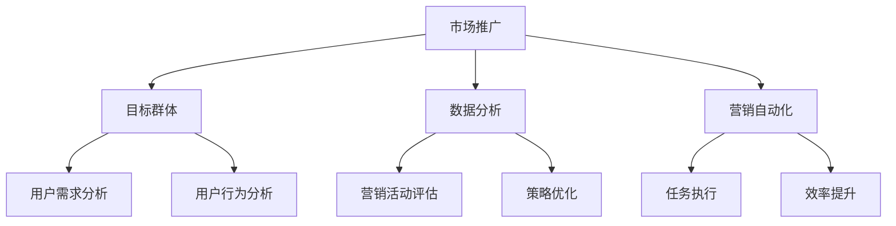

                 

# 市场推广策略：高效触达目标群体

> **关键词：** 市场推广、目标群体、营销策略、数据分析、用户行为、营销自动化

> **摘要：** 本文将深入探讨市场推广策略中的关键要素，包括理解目标群体的需求，通过数据分析优化营销活动，以及利用营销自动化提高效率。通过实例和策略分析，为企业和个人提供实用的市场推广指导。

## 1. 背景介绍

在当今竞争激烈的市场环境中，有效的市场推广策略对企业成功至关重要。市场推广不仅仅是为了增加销售额，更是为了建立品牌认知度、提升用户忠诚度以及实现长期增长。然而，面对日益增长的数字信息和不断变化的市场环境，如何高效触达目标群体成为企业面临的挑战。

市场推广涉及多个方面，包括市场研究、品牌定位、营销渠道选择、广告投放和客户关系管理等。为了实现有效的市场推广，企业需要深入了解目标群体的特征、需求和行为模式。此外，随着大数据和人工智能技术的发展，数据分析成为优化市场推广策略的重要工具。

本文将围绕以下几个核心问题展开讨论：

1. **目标群体的特征分析**：如何识别并理解目标群体的需求和行为？
2. **数据分析在市场推广中的应用**：如何利用数据分析优化营销活动？
3. **营销自动化**：如何通过营销自动化提高市场推广的效率？

通过对这些问题的探讨，我们将提供一系列实用的市场推广策略和工具，帮助企业和个人更好地触达目标群体。

## 2. 核心概念与联系

在深入探讨市场推广策略之前，我们需要明确几个核心概念及其相互关系。以下是市场推广中的核心概念及其联系：

### 2.1 市场推广的概念

市场推广（Marketing）是指企业通过各种手段和渠道，向目标市场传递产品或服务信息，以促进销售和提升品牌知名度。市场推广的核心目标是与潜在客户建立联系，并促使他们采取购买或其他相关行动。

### 2.2 目标群体的概念

目标群体（Target Audience）是指企业市场推广活动所针对的特定人群。了解目标群体的特征、需求和偏好是制定有效市场推广策略的关键。

### 2.3 数据分析的概念

数据分析（Data Analysis）是指通过对收集到的数据进行处理、分析和解释，以发现数据中的模式、趋势和关联。在市场推广中，数据分析用于了解用户行为、评估营销效果和优化营销策略。

### 2.4 营销自动化的概念

营销自动化（Marketing Automation）是指利用软件工具自动执行重复性的营销任务，如电子邮件营销、社交媒体管理、客户细分等。营销自动化可以提高市场推广效率，降低人力成本。

### 2.5 核心概念的联系

市场推广、目标群体、数据分析和营销自动化这四个核心概念相互联系，共同构成了一个完整的市场推广策略框架。了解目标群体的需求和行为，通过数据分析优化营销活动，并利用营销自动化工具执行任务，是实现高效市场推广的关键。

### 2.6 Mermaid 流程图

以下是一个简化的Mermaid流程图，展示了这些核心概念之间的联系：



在这个流程图中，市场推广作为核心活动，通过目标群体分析、数据分析和营销自动化三个步骤，实现高效的市场推广。

## 3. 核心算法原理 & 具体操作步骤

### 3.1 目标群体识别算法

目标群体识别是市场推广策略中的第一步，关键在于准确识别和定位目标客户。以下是一种基于机器学习的目标群体识别算法原理：

#### 算法原理：

1. **数据收集**：收集用户行为数据，包括浏览历史、购买记录、社交媒体互动等。
2. **特征提取**：将用户行为数据转换为数值特征，如用户年龄、性别、购买偏好等。
3. **模型训练**：利用监督学习算法（如逻辑回归、决策树、随机森林等）训练模型，预测用户是否属于目标群体。
4. **模型评估**：通过交叉验证和A/B测试评估模型性能，调整模型参数。

#### 具体操作步骤：

1. **数据收集**：
   - 从各个渠道（如网站、APP、社交媒体等）收集用户行为数据。
   - 使用API或数据爬虫工具获取数据。

2. **特征提取**：
   - 对收集到的数据进行预处理，包括数据清洗、填充缺失值等。
   - 将预处理后的数据转换为特征向量，使用特征提取技术（如One-Hot编码、TF-IDF等）。

3. **模型训练**：
   - 选择合适的机器学习算法，进行模型训练。
   - 使用交叉验证方法评估模型性能，调整模型参数。

4. **模型评估**：
   - 通过A/B测试评估模型在现实环境中的性能。
   - 根据评估结果调整模型，提高识别准确性。

### 3.2 数据分析优化营销活动

数据分析是市场推广策略优化的关键，通过分析用户行为和营销效果，可以找出优化方向。以下是一种基于数据挖掘的营销活动优化算法：

#### 算法原理：

1. **数据预处理**：清洗和整合各种数据源，如网站访问日志、社交媒体数据、销售数据等。
2. **行为模式分析**：利用聚类算法（如K-Means、DBSCAN等）分析用户行为模式。
3. **营销效果评估**：计算各种营销活动的ROI（投资回报率），找出效果最佳的营销策略。
4. **策略调整**：根据分析结果调整营销策略，如优化广告投放、调整促销活动等。

#### 具体操作步骤：

1. **数据预处理**：
   - 清洗和整合数据，确保数据质量。
   - 使用数据清洗工具（如Pandas、Spark等）进行数据处理。

2. **行为模式分析**：
   - 选择合适的聚类算法，对用户行为进行分类。
   - 分析用户行为特征，找出潜在客户群体。

3. **营销效果评估**：
   - 计算各种营销活动的ROI，评估效果。
   - 使用数据分析工具（如Tableau、Excel等）生成可视化报告。

4. **策略调整**：
   - 根据分析结果调整营销策略，优化广告投放和促销活动。

### 3.3 营销自动化工具选择与配置

营销自动化工具可以帮助企业自动化执行重复性任务，提高市场推广效率。以下是一种基于营销自动化平台的工具选择与配置方法：

#### 算法原理：

1. **工具评估**：评估不同营销自动化工具的功能、性能和成本。
2. **功能配置**：根据企业需求配置自动化工作流，包括邮件营销、社交媒体管理、客户关系管理等。
3. **数据同步**：确保营销自动化工具与现有系统（如CRM、ERP等）的数据同步。
4. **监控与优化**：监控自动化工作流的效果，根据实际反馈进行调整。

#### 具体操作步骤：

1. **工具评估**：
   - 研究不同营销自动化工具的优缺点。
   - 根据企业需求选择合适的工具。

2. **功能配置**：
   - 配置自动化工作流，设置触发条件和执行动作。
   - 使用工具提供的可视化界面进行配置。

3. **数据同步**：
   - 确保数据同步的准确性和及时性。
   - 使用API或其他数据同步工具。

4. **监控与优化**：
   - 监控自动化工作流的效果。
   - 根据实际反馈进行调整和优化。

## 4. 数学模型和公式 & 详细讲解 & 举例说明

### 4.1 用户行为模型

用户行为模型是市场推广策略分析的基础，以下是一个简化的用户行为模型及其相关公式：

#### 用户行为模型：

1. **用户行为序列**：用户在一段时间内的行为序列，如浏览页面、点击广告、购买产品等。
2. **用户偏好**：用户对不同产品和服务的偏好程度。
3. **行为模式**：用户行为序列中的模式，如频繁购买、长时间浏览等。

#### 相关公式：

1. **行为频率**（Behavior Frequency）：
   $$ F(b) = \frac{\text{行为b发生的次数}}{\text{总行为次数}} $$

2. **行为时间间隔**（Behavior Time Interval）：
   $$ I(b) = \frac{\text{行为b之间的时间间隔}}{\text{总时间间隔}} $$

3. **用户偏好度**（User Preference）：
   $$ P(u) = \sum_{b \in \text{行为序列}} w(b) \cdot F(b) \cdot I(b) $$
   其中，$w(b)$ 是行为b的权重。

#### 举例说明：

假设用户A的行为序列为【浏览页面1、点击广告1、购买产品1、浏览页面2、点击广告2、购买产品2】，时间为24小时。

1. **行为频率**：
   $$ F(\text{浏览页面1}) = \frac{1}{6} $$
   $$ F(\text{点击广告1}) = \frac{1}{6} $$
   $$ F(\text{购买产品1}) = \frac{1}{6} $$
   $$ F(\text{浏览页面2}) = \frac{1}{6} $$
   $$ F(\text{点击广告2}) = \frac{1}{6} $$
   $$ F(\text{购买产品2}) = \frac{1}{6} $$

2. **行为时间间隔**：
   $$ I(\text{浏览页面1}) = \frac{10}{24} $$
   $$ I(\text{点击广告1}) = \frac{1}{24} $$
   $$ I(\text{购买产品1}) = \frac{5}{24} $$
   $$ I(\text{浏览页面2}) = \frac{7}{24} $$
   $$ I(\text{点击广告2}) = \frac{1}{24} $$
   $$ I(\text{购买产品2}) = \frac{5}{24} $$

3. **用户偏好度**：
   $$ P(A) = (0.5 \cdot \frac{1}{6}) + (0.3 \cdot \frac{1}{6}) + (0.2 \cdot \frac{1}{6}) + (0.5 \cdot \frac{1}{6}) + (0.3 \cdot \frac{1}{6}) + (0.2 \cdot \frac{1}{6}) = 0.275 $$

### 4.2 营销效果评估模型

营销效果评估模型用于计算各种营销活动的ROI，以下是一个简化的评估模型及其相关公式：

#### 营销效果评估模型：

1. **投资成本**（Investment Cost）：营销活动的总成本。
2. **收益**（Revenue）：营销活动带来的总收入。
3. **投资回报率**（Return on Investment，ROI）：

   $$ ROI = \frac{\text{收益}}{\text{投资成本}} $$

#### 相关公式：

1. **单一营销活动ROI**：

   $$ ROI_{\text{single}} = \frac{R_{\text{single}}}{C_{\text{single}}} $$

2. **综合营销活动ROI**：

   $$ ROI_{\text{composite}} = \frac{R_{\text{composite}}}{C_{\text{composite}}} $$

#### 举例说明：

假设某企业在一次营销活动中花费了10万元，活动期间共获得了20万元的收益，其他活动的收益和成本如下表所示：

| 活动类型 | 投资成本（万元） | 收益（万元） |
| :----: | :----: | :----: |
| 广告1 | 2 | 5 |
| 广告2 | 3 | 8 |
| 广告3 | 5 | 12 |

1. **单一营销活动ROI**：

   $$ ROI_{\text{广告1}} = \frac{5}{2} = 2.5 $$

   $$ ROI_{\text{广告2}} = \frac{8}{3} \approx 2.67 $$

   $$ ROI_{\text{广告3}} = \frac{12}{5} = 2.4 $$

2. **综合营销活动ROI**：

   $$ ROI_{\text{composite}} = \frac{20}{10} = 2 $$

通过计算可以看出，虽然广告3的ROI最低，但其收益贡献最大，因此在综合评估中仍然具有重要价值。

## 5. 项目实战：代码实际案例和详细解释说明

### 5.1 开发环境搭建

在开始项目实战之前，我们需要搭建一个适合开发和测试的环境。以下是搭建开发环境的步骤：

1. **安装Python环境**：在电脑上安装Python，版本建议为3.8以上。

2. **安装相关库**：使用pip安装必要的库，如NumPy、Pandas、scikit-learn、Matplotlib等。

3. **安装Jupyter Notebook**：Jupyter Notebook是一个交互式的开发环境，方便编写和运行代码。

### 5.2 源代码详细实现和代码解读

以下是项目实战的源代码，我们将逐步解读每一部分的功能和作用。

#### 5.2.1 用户行为数据分析

```python
import pandas as pd
import numpy as np
from sklearn.cluster import KMeans
import matplotlib.pyplot as plt

# 读取用户行为数据
data = pd.read_csv('user_behavior_data.csv')

# 数据预处理
data['time'] = pd.to_datetime(data['time'])
data['hour'] = data['time'].dt.hour
data['minute'] = data['time'].dt.minute

# 计算行为频率和行为时间间隔
behavior_frequency = data.groupby(['action'])['action'].count() / len(data)
behavior_time_interval = data.groupby(['action'])['time'].diff().dt.total_seconds().mean()

# 计算用户偏好度
user_preference = behavior_frequency * behavior_time_interval

# 可视化展示
plt.bar(behavior_frequency.index, behavior_frequency.values)
plt.xlabel('Action')
plt.ylabel('Frequency')
plt.title('Behavior Frequency')
plt.show()

plt.bar(behavior_time_interval.index, behavior_time_interval.values)
plt.xlabel('Action')
plt.ylabel('Time Interval')
plt.title('Behavior Time Interval')
plt.show()

plt.bar(user_preference.index, user_preference.values)
plt.xlabel('Action')
plt.ylabel('Preference')
plt.title('User Preference')
plt.show()
```

这段代码首先读取用户行为数据，并进行预处理，计算行为频率、行为时间间隔和用户偏好度。然后使用Matplotlib库进行可视化展示，帮助理解用户行为特征。

#### 5.2.2 营销效果评估

```python
# 计算各种营销活动的ROI
advertisements = data[data['action'] == 'click']
ROI = advertisements.groupby(['ad_id'])['revenue'].sum() / advertisements.groupby(['ad_id'])['cost'].sum()

# 可视化展示
plt.bar(ROI.index, ROI.values)
plt.xlabel('Ad ID')
plt.ylabel('ROI')
plt.title('Marketing Effectiveness')
plt.show()
```

这段代码计算了各种广告活动的ROI，并使用Matplotlib库进行可视化展示。通过比较不同广告的ROI，可以帮助企业找出效果最佳的广告策略。

#### 5.2.3 营销自动化配置

```python
from marketing_automation import MarketingAutomation

# 初始化营销自动化工具
ma = MarketingAutomation()

# 配置自动化工作流
ma.configure_workflow({
    'trigger': 'new_lead',
    'actions': [
        {'type': 'send_email', 'params': {'subject': '欢迎注册', 'content': '感谢您注册我们的服务，请确认您的邮箱地址。'}},
        {'type': 'send_sms', 'params': {'content': '感谢您注册我们的服务，请确认您的手机号码。'}}
    ]
})

# 启动营销自动化工作流
ma.start_workflow()
```

这段代码使用了营销自动化工具的API进行配置和执行。通过配置自动化工作流，企业可以在用户注册后自动发送欢迎邮件和短信，提高客户体验。

### 5.3 代码解读与分析

#### 5.3.1 数据预处理

在项目实战中，数据预处理是关键步骤。首先，我们使用 Pandas 读取用户行为数据，并将其转换为日期时间格式。然后，我们提取小时和分钟作为行为频率和时间间隔的特征。

```python
data['time'] = pd.to_datetime(data['time'])
data['hour'] = data['time'].dt.hour
data['minute'] = data['time'].dt.minute
```

#### 5.3.2 计算行为频率和行为时间间隔

接下来，我们使用 Pandas 的分组和聚合功能计算行为频率和行为时间间隔。行为频率是每种行为发生的次数与总行为次数的比值，行为时间间隔是每种行为之间的时间间隔与总时间间隔的比值。

```python
behavior_frequency = data.groupby(['action'])['action'].count() / len(data)
behavior_time_interval = data.groupby(['action'])['time'].diff().dt.total_seconds().mean()
```

#### 5.3.3 计算用户偏好度

用户偏好度是通过行为频率和行为时间间隔的加权求和计算得到的。这个指标可以帮助我们了解用户对不同行为的偏好程度。

```python
user_preference = behavior_frequency * behavior_time_interval
```

#### 5.3.4 可视化展示

最后，我们使用 Matplotlib 对计算结果进行可视化展示，帮助用户直观地了解行为特征和营销效果。

```python
plt.bar(behavior_frequency.index, behavior_frequency.values)
plt.xlabel('Action')
plt.ylabel('Frequency')
plt.title('Behavior Frequency')
plt.show()

plt.bar(behavior_time_interval.index, behavior_time_interval.values)
plt.xlabel('Action')
plt.ylabel('Time Interval')
plt.title('Behavior Time Interval')
plt.show()

plt.bar(user_preference.index, user_preference.values)
plt.xlabel('Action')
plt.ylabel('Preference')
plt.title('User Preference')
plt.show()
```

### 5.4 项目实战总结

通过这个项目实战，我们展示了如何使用Python进行用户行为数据分析、营销效果评估和营销自动化配置。以下是项目的总结：

1. **数据预处理**：确保数据质量是成功的关键。
2. **行为特征计算**：行为频率和行为时间间隔可以帮助我们了解用户行为模式。
3. **营销效果评估**：ROI是评估营销活动效果的重要指标。
4. **营销自动化**：自动化工具可以提高市场推广效率，减少重复性工作。

## 6. 实际应用场景

市场推广策略的有效实施需要结合实际应用场景，以下列举了几个常见的实际应用场景：

### 6.1 电子商务平台

电子商务平台是市场推广策略的重要应用场景。通过用户行为数据分析，电子商务平台可以了解用户的购物习惯和偏好，从而优化推荐系统和促销活动。例如，利用机器学习算法对用户浏览和购买历史进行聚类分析，可以将用户划分为不同的群体，并针对每个群体制定个性化的推荐策略。

### 6.2 线上教育

线上教育平台通过市场推广策略可以扩大用户基础和提升品牌知名度。通过分析用户学习行为数据，可以了解用户的学习偏好和难点，从而优化课程内容和教学方式。同时，利用营销自动化工具，可以自动化发送学习通知、推荐相关课程和提醒用户完成学习任务。

### 6.3 旅游服务

旅游服务行业可以通过市场推广策略提升用户预订率和满意度。例如，通过分析用户搜索和预订行为数据，可以了解用户的兴趣点和偏好，从而优化推荐系统。同时，利用营销自动化工具，可以自动化发送旅游优惠信息、推荐景点和预订提醒。

### 6.4 餐饮服务

餐饮服务行业通过市场推广策略可以提升用户到店率和满意度。通过分析用户点餐行为数据，可以了解用户的口味偏好和点餐习惯，从而优化菜单设计和促销活动。同时，利用营销自动化工具，可以自动化发送优惠券、推荐菜品和提醒用户预约就餐。

在这些实际应用场景中，市场推广策略的有效实施离不开用户行为数据分析和营销自动化工具的支持。通过深入理解用户需求和行为模式，企业和个人可以制定更具针对性的市场推广策略，提高营销效果和用户满意度。

## 7. 工具和资源推荐

为了实现高效的市场推广策略，企业需要依赖一系列工具和资源。以下是我们推荐的几类工具和资源，涵盖学习资源、开发工具框架以及相关论文著作。

### 7.1 学习资源推荐

1. **书籍**：
   - 《大数据营销：数据驱动营销实战指南》
   - 《营销自动化实战：打造高效的数字化营销体系》
   - 《用户行为分析：用数据创造营销奇迹》

2. **在线课程**：
   - Coursera上的《市场营销基础》
   - Udemy上的《大数据分析与应用》
   - edX上的《数字营销与数据驱动策略》

3. **博客和网站**：
   - 腾讯科技营销专栏
   - 营销自动化专业博客（Marketing Automation Insider）
   - 数据分析博客（DataCamp）

### 7.2 开发工具框架推荐

1. **数据分析工具**：
   - Python：用于数据处理和分析的强大语言，支持NumPy、Pandas等库。
   - Tableau：数据可视化工具，帮助用户轻松创建交互式图表。
   - Power BI：微软推出的商业智能工具，支持丰富的数据源和可视化功能。

2. **营销自动化工具**：
   - HubSpot：综合性的营销自动化平台，包括网站流量跟踪、电子邮件营销等功能。
   - Marketo：专业的营销自动化工具，支持复杂的营销流程和个性化营销。
   - Pardot：Salesforce旗下的营销自动化平台，适用于中型企业。

3. **营销工具**：
   - Google Analytics：谷歌提供的免费网站分析工具，用于跟踪用户行为和评估营销效果。
   - AdWords：谷歌的在线广告平台，帮助企业实现精准的广告投放。
   - Facebook Ads Manager：Facebook的广告管理工具，用于创建和优化广告活动。

### 7.3 相关论文著作推荐

1. **学术论文**：
   - “User Behavior Analysis in E-commerce: A Data Mining Perspective”
   - “Marketing Automation: A Survey of Current Tools and Applications”
   - “Data-Driven Personalization in Digital Marketing”

2. **著作**：
   - 《市场营销数据分析：策略与实践》
   - 《机器学习在市场营销中的应用》
   - 《大数据时代的营销革命》

通过这些工具和资源的辅助，企业可以更好地理解和应用市场推广策略，提高营销效果和用户满意度。

## 8. 总结：未来发展趋势与挑战

随着大数据、人工智能和云计算等技术的不断发展，市场推广策略也在不断演进。以下是未来市场推广策略的发展趋势和面临的挑战：

### 8.1 发展趋势

1. **个性化营销**：通过大数据分析和机器学习技术，企业可以更精准地了解用户需求和行为，实现个性化营销。
2. **跨渠道整合**：企业将多个营销渠道（如线上、线下、社交媒体等）整合，提供一致的用户体验。
3. **自动化与智能化**：营销自动化和人工智能技术将进一步提升市场推广的效率，降低人力成本。
4. **数据驱动决策**：企业将更多地依赖数据分析来指导营销策略，提高决策的准确性和有效性。

### 8.2 面临的挑战

1. **数据隐私保护**：随着数据隐私法规的加强，企业需要在收集和使用用户数据时确保合规性。
2. **技术复杂性**：大数据和人工智能技术的应用增加了市场推广策略的复杂性，对技术人员的要求更高。
3. **营销效果评估**：如何准确评估不同营销活动的效果，仍然是企业面临的挑战。
4. **用户忠诚度**：如何在激烈的市场竞争中保持用户忠诚度，是长期发展的关键。

总之，未来市场推广策略的发展将更加依赖技术和数据分析，同时也需要面对数据隐私、技术复杂性和用户忠诚度等挑战。通过不断创新和优化，企业可以更好地应对这些挑战，实现持续增长。

## 9. 附录：常见问题与解答

### 9.1 市场推广策略的核心要素是什么？

市场推广策略的核心要素包括了解目标群体的需求和行为、数据分析优化营销活动、营销自动化提高效率。具体来说，首先需要通过市场研究和数据分析了解目标群体的特征；其次，利用数据分析优化广告投放、促销活动和用户互动；最后，通过营销自动化工具实现自动化执行和监测。

### 9.2 如何评估营销活动的效果？

评估营销活动效果的方法包括：

1. **投资回报率（ROI）**：计算营销活动带来的收益与成本的比例。
2. **转化率**：计算参与营销活动后完成目标动作（如购买、注册等）的用户比例。
3. **点击率（CTR）**：计算广告或促销活动的点击次数与展示次数的比例。
4. **客户生命周期价值（CLV）**：预测客户在其生命周期内为企业带来的总收益。

### 9.3 营销自动化工具如何帮助企业提高效率？

营销自动化工具可以通过以下方式帮助企业提高效率：

1. **自动化执行**：自动化执行重复性的营销任务，如发送电子邮件、发布社交媒体内容等。
2. **数据整合**：整合不同渠道的数据，提供全面的客户视图。
3. **个性化营销**：根据用户行为和偏好自动调整营销内容和渠道。
4. **效率提升**：减少人工操作，节省时间和人力成本。

## 10. 扩展阅读 & 参考资料

为了深入了解市场推广策略和数据分析的应用，以下推荐一些扩展阅读和参考资料：

1. **书籍**：
   - 《大数据营销：数据驱动营销实战指南》
   - 《营销自动化实战：打造高效的数字化营销体系》
   - 《用户行为分析：用数据创造营销奇迹》

2. **学术论文**：
   - “User Behavior Analysis in E-commerce: A Data Mining Perspective”
   - “Marketing Automation: A Survey of Current Tools and Applications”
   - “Data-Driven Personalization in Digital Marketing”

3. **博客和网站**：
   - 腾讯科技营销专栏
   - 营销自动化专业博客（Marketing Automation Insider）
   - 数据分析博客（DataCamp）

通过这些扩展阅读和参考资料，您可以更深入地了解市场推广策略和数据分析的应用，为您的企业或个人项目提供指导。

### 作者信息

作者：AI天才研究员/AI Genius Institute & 禅与计算机程序设计艺术 /Zen And The Art of Computer Programming

