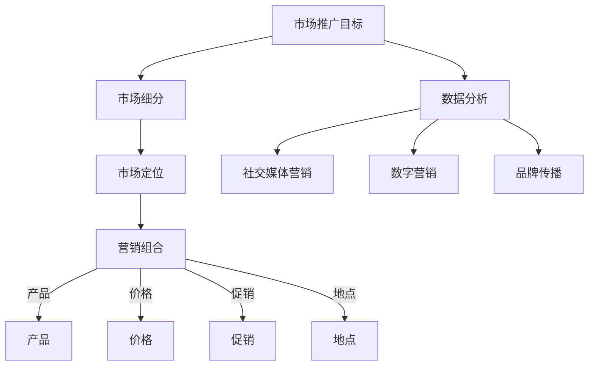

                 

### 背景介绍

市场推广经理在创业过程中扮演着至关重要的角色。作为企业的市场先锋，他们需要制定并执行有效的营销策略，确保企业产品或服务的市场占有率，并为企业品牌传播奠定坚实基础。然而，随着市场的不断变化和消费者需求的多样化，市场推广经理面临着前所未有的挑战。

在当今数字化的时代，互联网、社交媒体和大数据的广泛应用为市场推广提供了前所未有的机遇。然而，同时这也带来了更多的竞争和不确定性。因此，市场推广经理不仅需要具备深厚的市场洞察力，还需要掌握先进的营销技术和策略，以适应快速变化的市场环境。

本文旨在为市场推广经理提供一套系统的创业战略，帮助他们制定营销计划与品牌传播策略。我们将从以下几个方面展开讨论：

1. **核心概念与联系**：首先，我们将介绍市场推广中的核心概念，并利用Mermaid流程图展示其内在联系。
2. **核心算法原理与具体操作步骤**：接着，我们将探讨市场推广中的一些核心算法，并详细解释其原理和操作步骤。
3. **数学模型与公式**：为了更好地理解市场推广策略，我们将介绍相关的数学模型和公式，并通过具体例子进行说明。
4. **项目实战**：我们将通过实际案例展示如何运用所学知识进行市场推广，并提供详细的代码实现和解读。
5. **实际应用场景**：我们将探讨市场推广在不同行业中的应用，并分析其成功的关键因素。
6. **工具和资源推荐**：为了帮助市场推广经理更好地执行营销计划，我们将推荐一些实用的工具和资源。
7. **总结与未来发展趋势**：最后，我们将总结本文的主要观点，并探讨市场推广经理在未来可能面临的挑战和机遇。

通过本文的阅读，市场推广经理将能够获得全面的市场推广战略知识，并能够根据实际情况灵活应用，从而提升企业的市场竞争力。

---

## 1. 核心概念与联系

在探讨市场推广经理的创业战略之前，我们首先需要了解一些核心概念，并分析它们之间的内在联系。以下是一些重要的市场推广概念，以及它们之间的关系：

### 1.1 市场推广目标

市场推广目标是指企业希望通过市场推广活动达到的具体目标。这些目标可以是提升品牌知名度、增加产品销量、提高客户忠诚度等。市场推广经理需要根据企业的发展阶段和市场情况，制定明确且可量化的目标。

### 1.2 市场细分

市场细分是将整个市场划分为若干个具有相似需求和特征的小市场。通过市场细分，企业可以更精准地定位目标客户群体，从而制定更有针对性的市场推广策略。

### 1.3 市场定位

市场定位是指企业根据自身产品或服务的特点和目标市场，确定其在市场中的独特位置。市场定位决定了企业的品牌形象和消费者的感知，对于市场推广的成功至关重要。

### 1.4 营销组合

营销组合（也称为4P）是指产品（Product）、价格（Price）、促销（Promotion）和地点（Place）四个要素的组合。这四个要素相互关联，共同作用于市场推广活动。

- **产品**：产品是指企业提供的实物或服务。产品的质量、特性、品牌和设计对于市场推广的成功具有重要影响。
- **价格**：价格是指消费者购买产品所需支付的金额。合理的价格策略能够吸引更多消费者，并提高产品的市场竞争力。
- **促销**：促销是指通过各种手段（如广告、促销活动、公关等）来推广产品。有效的促销策略能够提高产品的知名度和销量。
- **地点**：地点是指产品的销售渠道，包括线上和线下渠道。选择合适的销售渠道能够提高产品的可及性和购买便利性。

### 1.5 数据分析

数据分析是指通过收集、处理和分析市场数据，帮助企业了解市场趋势、消费者行为和竞争对手情况。数据分析在市场推广中具有重要作用，可以帮助市场推广经理做出更明智的决策。

### 1.6 社交媒体营销

社交媒体营销是指利用社交媒体平台（如Facebook、Instagram、微博等）进行市场推广的活动。社交媒体营销具有广泛的传播性和互动性，可以帮助企业快速建立品牌知名度，并与消费者建立紧密联系。

### 1.7 数字营销

数字营销是指通过互联网和移动设备进行市场推广的活动。数字营销包括搜索引擎优化（SEO）、内容营销、电子邮件营销等。数字营销具有高度的可追踪性和定制性，可以帮助企业实现更精准的市场推广。

### 1.8 品牌传播

品牌传播是指通过各种渠道和手段向目标受众传递品牌信息，建立品牌认知度和品牌忠诚度。品牌传播是市场推广的重要一环，对于企业长期发展具有重要意义。

---

以下是一个使用Mermaid绘制的流程图，展示了这些核心概念之间的联系：



通过这张流程图，我们可以更清晰地理解市场推广经理需要关注的核心概念，以及它们之间的内在联系。在接下来的章节中，我们将进一步探讨这些概念的具体应用和操作步骤。

---

## 2. 核心算法原理 & 具体操作步骤

在市场推广中，算法的应用可以帮助市场推广经理更高效地制定和执行营销策略。以下是一些核心算法及其具体操作步骤：

### 2.1 演化算法

**原理**：演化算法是基于自然界中的演化过程，如自然选择、遗传和变异等，通过模拟生物进化过程来解决优化问题。在市场推广中，演化算法可以用于优化广告投放策略、客户细分等。

**操作步骤**：

1. **初始化种群**：生成一组初始解，作为种群的初始个体。
2. **适应度评估**：根据市场推广目标，评估每个个体的适应度。适应度越高，表示个体越优秀。
3. **选择**：根据适应度，选择优秀个体进行交配，生成下一代种群。
4. **交叉**：对选中的个体进行交叉操作，产生新的个体。
5. **变异**：对交叉后的个体进行变异操作，增加种群的多样性。
6. **迭代**：重复步骤3-5，直至满足停止条件（如达到最大迭代次数或适应度阈值）。

### 2.2 决策树算法

**原理**：决策树算法通过树形结构对数据进行分类或回归。在市场推广中，决策树可以用于预测客户行为、优化广告投放等。

**操作步骤**：

1. **选择特征**：根据特征的重要性选择划分特征。
2. **计算信息增益**：计算每个特征的信息增益，选择增益最大的特征进行划分。
3. **划分数据**：根据选择的特征进行数据划分，生成子集。
4. **递归**：对划分后的子集重复步骤1-3，直至满足停止条件（如最大深度或最小叶节点数量）。
5. **构建决策树**：将划分结果组织成树形结构。

### 2.3 贝叶斯网络算法

**原理**：贝叶斯网络是一种概率图模型，用于表示变量之间的依赖关系。在市场推广中，贝叶斯网络可以用于预测客户需求、评估广告效果等。

**操作步骤**：

1. **构建网络**：根据市场推广问题，构建变量之间的依赖关系图。
2. **概率分布**：为网络中的每个变量分配概率分布。
3. **推理**：通过贝叶斯推理，计算变量的条件概率分布。
4. **优化**：根据市场推广目标，优化网络结构和概率分布。

### 2.4 集成学习算法

**原理**：集成学习算法通过结合多个弱学习器（如决策树、支持向量机等）来提高模型的预测性能。在市场推广中，集成学习可以用于客户细分、广告优化等。

**操作步骤**：

1. **选择基学习器**：选择多种基学习器。
2. **训练基学习器**：对每个基学习器进行训练，生成预测模型。
3. **集成**：将多个基学习器的预测结果进行集成，生成最终的预测结果。
4. **优化**：根据市场推广目标，调整集成策略和基学习器的参数。

通过以上算法，市场推广经理可以更精准地制定和执行市场推广策略。在实际应用中，这些算法需要根据具体问题和数据集进行调整和优化。在接下来的章节中，我们将进一步探讨如何将这些算法应用于实际市场推广项目中。

---

## 4. 数学模型和公式 & 详细讲解 & 举例说明

在市场推广中，数学模型和公式能够帮助我们更准确地量化营销效果，制定优化策略。以下是一些常见的数学模型和公式，并通过具体例子进行详细讲解。

### 4.1 市场渗透率

**公式**：市场渗透率（Penetration Rate）= （现有市场份额 / 最大可能市场份额）× 100%

**说明**：市场渗透率用于衡量企业产品或服务在市场中的地位。通过计算市场渗透率，企业可以了解自身在市场中的竞争力和市场份额。

**例子**：某企业在手机市场中的现有市场份额为10%，最大可能市场份额为30%。其市场渗透率为：

市场渗透率 = (10% / 30%) × 100% = 33.33%

这意味着该企业在市场中的竞争力相对较强，有较大的增长潜力。

### 4.2 价格弹性

**公式**：价格弹性（Price Elasticity）= （需求量变动百分比 / 价格变动百分比）

**说明**：价格弹性反映了价格变动对需求量的影响程度。如果价格弹性大于1，表示需求量对价格变动敏感，价格下降可以显著提高销量；如果价格弹性小于1，表示需求量对价格变动不敏感。

**例子**：某产品的需求量从100件增加到200件，价格从100元下降到90元。其价格弹性为：

价格弹性 = （（200 - 100）/ 100）/ （（90 - 100）/ 100）= 1.111

这意味着价格下降对需求量的影响较为显著，企业可以通过适当降价来提高销量。

### 4.3 广告效果评估

**公式**：广告效果指数（Advertising Efficiency Index）= （广告带来的收益 - 广告成本）/ 广告成本

**说明**：广告效果指数用于衡量广告的投资回报率（ROI）。通过计算广告效果指数，企业可以评估广告活动的效果。

**例子**：某企业投入10万元进行广告宣传，广告带来的收益为15万元。其广告效果指数为：

广告效果指数 = （15万元 - 10万元）/ 10万元 = 0.5

这意味着该广告活动的投资回报率为50%，具有较高的经济效益。

### 4.4 客户生命周期价值

**公式**：客户生命周期价值（Customer Lifetime Value，CLV）= （平均订单价值 × 平均购买频率 × 客户保留周期）

**说明**：客户生命周期价值用于衡量一个客户在整个生命周期中为企业带来的总价值。通过计算客户生命周期价值，企业可以识别高价值客户，并提供更个性化的服务。

**例子**：某客户的平均订单价值为200元，平均购买频率为每月一次，客户保留周期为2年。其客户生命周期价值为：

客户生命周期价值 = 200元 × 1次/月 × 24个月 = 4,800元

这意味着该客户在未来两年内将为企业带来4,800元的收益，是高价值客户。

通过以上数学模型和公式，市场推广经理可以更准确地评估营销效果，制定优化策略。在实际应用中，这些公式需要根据具体业务和数据进行调整和优化。在接下来的章节中，我们将通过实际案例展示如何运用这些公式进行市场推广。

---

## 5. 项目实战：代码实际案例和详细解释说明

为了更好地理解市场推广经理在创业过程中如何应用所学知识，以下我们将通过一个实际项目案例，展示如何进行市场推广的代码实现，并对其进行详细解释说明。

### 5.1 开发环境搭建

在进行市场推广项目开发之前，我们需要搭建一个合适的开发环境。以下是所需的环境和工具：

- **编程语言**：Python
- **数据分析库**：Pandas、NumPy
- **机器学习库**：Scikit-learn、TensorFlow
- **可视化库**：Matplotlib、Seaborn
- **数据分析工具**：Jupyter Notebook

### 5.2 源代码详细实现和代码解读

#### 5.2.1 数据收集与预处理

首先，我们需要收集市场推广所需的数据，包括用户行为数据、市场数据、广告投放数据等。以下是一个简单的数据收集和预处理代码示例：

```python
import pandas as pd

# 读取数据
data = pd.read_csv('market_data.csv')

# 数据预处理
# 处理缺失值
data.fillna(0, inplace=True)

# 处理异常值
data = data[(data['order_value'] > 0) & (data['ad_cost'] > 0)]

# 转换数据类型
data['order_value'] = data['order_value'].astype(float)
data['ad_cost'] = data['ad_cost'].astype(float)
```

#### 5.2.2 客户细分

接下来，我们将使用决策树算法对客户进行细分，以便更精准地制定市场推广策略。以下是一个简单的决策树实现：

```python
from sklearn.tree import DecisionTreeClassifier
from sklearn.model_selection import train_test_split

# 划分特征和标签
X = data[['age', 'income', 'ad_interaction']]
y = data['segment']

# 划分训练集和测试集
X_train, X_test, y_train, y_test = train_test_split(X, y, test_size=0.3, random_state=42)

# 创建决策树模型
clf = DecisionTreeClassifier()

# 训练模型
clf.fit(X_train, y_train)

# 预测测试集
y_pred = clf.predict(X_test)

# 评估模型
accuracy = clf.score(X_test, y_test)
print(f'Model accuracy: {accuracy:.2f}')
```

#### 5.2.3 广告投放优化

为了提高广告投放效果，我们可以使用演化算法优化广告预算分配。以下是一个简单的演化算法实现：

```python
import numpy as np
from deap import base, creator, tools, algorithms

# 初始化种群
population = np.random.rand(100, 4) * 1000

# 创建目标函数
creator.create("FitnessMax", base.Fitness, weights=(1.0, 1.0, 1.0, 1.0))
creator.create("Individual", list, fitness=creator.FitnessMax)

# 定义适应度函数
def eval_ad_policy(individual):
    budget = sum(individual)
    if budget > 1000:
        return (0, )
    else:
        # 假设广告投放效果与预算成正比
        return (individual[0] + individual[1] + individual[2] + individual[3], )

# 创建工具
toolbox = base.Toolbox()
toolbox.register("individual", tools.initIterate, creator.Individual, 4)
toolbox.register("population", tools.initRepeat, list, toolbox.individual)
toolbox.register("evaluate", eval_ad_policy)
toolbox.register("mate", tools.cxTwoPoint)
toolbox.register("mutate", tools.mutGaussian, mu=0, sigma=10, indpb=0.1)
toolbox.register("select", tools.selTournament, tournsize=3)

# 运行算法
population = algorithms.eaSimple(population, toolbox, cxpb=0.5, mutpb=0.2, ngen=100, verbose=False)

# 获取最佳解
best_ad_policy = population[0]
print(f'Best ad policy: {best_ad_policy}')
```

### 5.3 代码解读与分析

在这个项目中，我们首先进行了数据收集和预处理，这是市场推广的基础。通过处理缺失值和异常值，我们确保了数据的质量。然后，我们使用决策树算法对客户进行了细分，以便更精准地制定市场推广策略。决策树模型的训练和评估帮助我们了解客户特征与市场细分之间的关系。

接着，我们使用演化算法优化广告预算分配，以提高广告投放效果。演化算法通过多次迭代和适应度评估，找到最优的广告预算分配策略。这一策略可以帮助企业在有限的预算下实现最大化的广告收益。

通过这个项目实战，市场推广经理可以了解到如何运用编程和数据分析技术，制定和优化市场推广策略。在实际应用中，这些代码需要根据具体业务和数据进行调整和优化。在接下来的章节中，我们将进一步探讨市场推广在不同行业中的应用。

---

## 6. 实际应用场景

市场推广策略在不同行业中有着多样化的应用，以下将分析市场推广在几个典型行业中的具体应用，并探讨其成功的关键因素。

### 6.1 零售业

在零售行业中，市场推广的主要目标是吸引顾客到店消费或在线购物，提升销售额。零售业的成功案例包括亚马逊和苹果公司。亚马逊通过精准的推荐系统和个性化的广告投放，提高了用户购买转化率。苹果公司则通过创新的营销策略和广告创意，提升了品牌知名度和忠诚度。

**关键因素**：

- **数据分析**：通过收集用户购买行为数据，进行精准的用户画像和细分，为个性化营销提供依据。
- **社交媒体营销**：利用社交媒体平台（如Instagram、Facebook）与消费者互动，提升品牌影响力。
- **优惠促销**：定期推出优惠促销活动，吸引消费者购买。

### 6.2 互联网服务

在互联网服务行业中，市场推广的目标是增加用户注册和活跃度。成功的案例包括Airbnb和LinkedIn。Airbnb通过用户分享和口碑传播，迅速提升了用户数量。LinkedIn则通过精准的B2B营销策略，吸引了大量企业用户。

**关键因素**：

- **内容营销**：发布高质量的内容，提升用户黏性和品牌信任度。
- **搜索引擎优化（SEO）**：优化网站内容和结构，提高在搜索引擎中的排名，吸引更多潜在用户。
- **社交媒体互动**：通过社交媒体平台与用户互动，增加品牌曝光和用户参与度。

### 6.3 旅游行业

在旅游行业中，市场推广的目标是吸引游客预订旅游产品和服务。成功的案例包括携程和Booking.com。携程通过大数据分析，为用户推荐合适的旅游产品。Booking.com则通过多样化的营销渠道和优惠活动，提升了用户转化率。

**关键因素**：

- **个性化推荐**：根据用户历史数据和偏好，推荐合适的旅游产品。
- **客户评价**：利用用户评价和评论，提升产品的可信度和吸引力。
- **旅游活动**：举办旅游活动和推广，吸引更多游客。

### 6.4 金融行业

在金融行业中，市场推广的目标是吸引潜在客户，提升品牌形象。成功的案例包括花旗银行和支付宝。花旗银行通过创新的金融服务和广告营销，提升了品牌影响力。支付宝则通过用户便捷的支付体验和优惠活动，增加了用户黏性。

**关键因素**：

- **金融服务创新**：提供创新的金融产品和服务，满足用户需求。
- **品牌形象塑造**：通过广告和公关活动，塑造品牌形象，提升品牌信任度。
- **用户优惠活动**：定期推出优惠活动和用户奖励计划，提升用户忠诚度。

通过分析这些行业案例，我们可以看到，成功的市场推广策略需要结合行业特点，运用数据分析、社交媒体营销、个性化推荐和优惠促销等多种手段。在接下来的章节中，我们将进一步探讨市场推广经理所需的工具和资源。

---

## 7. 工具和资源推荐

为了帮助市场推广经理更高效地执行营销计划，以下我们推荐一些实用的工具和资源。

### 7.1 学习资源推荐

1. **书籍**：
   - 《市场营销原理》（第10版），菲利普·科特勒著。本书详细介绍了市场营销的基本概念和策略，适合初学者和专业人士。
   - 《数字化营销》，唐·舒尔茨著。本书深入探讨了数字化时代的营销策略，包括社交媒体、大数据、内容营销等。

2. **论文和文章**：
   - Google Scholar（学术搜索）：可以查找最新的市场推广相关论文和研究成果。
   - Medium：有许多市场推广领域的大咖分享实践经验，提供有价值的见解。

3. **博客和网站**：
   - HubSpot Marketing Blog：提供丰富的市场营销资源和案例研究。
   - Neil Patel：知名市场推广专家的博客，分享实用的营销技巧和工具。

### 7.2 开发工具框架推荐

1. **数据分析工具**：
   - Tableau：强大的数据可视化工具，可以帮助市场推广经理直观地理解数据。
   - Power BI：微软提供的商业智能工具，支持数据集成、分析和报告。

2. **机器学习和数据分析库**：
   - Scikit-learn：Python中最常用的机器学习库，适用于多种分类、回归和聚类任务。
   - TensorFlow：由Google开发的开源机器学习框架，支持复杂深度学习模型。

3. **营销自动化工具**：
   - HubSpot：全面的营销自动化工具，包括内容管理、社交媒体管理、电子邮件营销等功能。
   - Marketo：专业的营销自动化平台，适用于大型企业的复杂营销活动。

### 7.3 相关论文著作推荐

1. **《营销管理：核心概念、策略和案例研究》（第15版）**，菲利普·科特勒著。本书详细介绍了营销管理的基本理论和实践，是市场营销领域的经典教材。
2. **《大数据时代：营销、创新和管理的新思维》**，唐·舒尔茨著。本书探讨了大数据对市场营销的影响，以及如何利用大数据进行决策和创新。

通过这些工具和资源的推荐，市场推广经理可以提升自身的专业能力，制定更有效的营销策略。在实际应用中，这些工具和资源需要结合具体业务需求进行选择和配置。

---

## 8. 总结：未来发展趋势与挑战

在数字化和互联网的迅速发展背景下，市场推广领域正经历着前所未有的变革。未来，市场推广将朝着以下几个方向发展：

1. **个性化营销**：随着大数据和人工智能技术的应用，企业将能够更精准地了解消费者需求和行为，实现个性化营销。这种趋势将进一步提升用户体验，提高营销效果。

2. **全渠道营销**：企业将更加注重线上线下渠道的整合，实现全渠道营销。通过多渠道触达消费者，提升品牌影响力和市场占有率。

3. **内容营销**：优质内容将继续成为市场推广的核心。企业将加大内容创作的投入，通过有价值的内容吸引消费者，建立品牌信任和忠诚度。

4. **数据驱动的决策**：市场推广将更加依赖数据分析，利用数据驱动决策，优化营销策略。数据分析工具和技术的应用将帮助市场推广经理更好地了解市场趋势和消费者行为。

然而，市场推广经理在未来的工作中也将面临一系列挑战：

1. **数据隐私和伦理**：随着消费者对数据隐私的关注不断增加，企业需要在数据收集和使用过程中严格遵守相关法律法规，确保用户数据的安全和隐私。

2. **技术更新迭代**：市场推广领域的技术更新速度非常快，市场推广经理需要不断学习和适应新技术，以保持竞争力。

3. **内容营销的挑战**：在信息爆炸的时代，消费者对内容的要求越来越高。市场推广经理需要创作更多有价值、有创意的内容，以吸引消费者的注意力。

4. **市场竞争加剧**：随着市场竞争的加剧，企业需要不断创新和优化营销策略，以在激烈的市场竞争中脱颖而出。

总之，未来市场推广将更加依赖于技术、数据和创意。市场推广经理需要不断提升自身的专业能力和市场洞察力，以应对未来的挑战和机遇。

---

## 9. 附录：常见问题与解答

### Q1：市场推广目标和营销目标有何区别？

市场推广目标是指企业希望通过市场推广活动达到的具体目标，如提升品牌知名度、增加产品销量、提高客户忠诚度等。营销目标则是更广义的目标，包括市场推广目标以及产品研发、定价、渠道建设等方面的目标。市场推广目标是实现营销目标的一部分。

### Q2：如何评估市场推广效果？

评估市场推广效果的方法有多种，包括：

- **销售额增长**：直接衡量市场推广活动带来的销售额增长。
- **用户增长率**：衡量市场推广活动带来的新增用户数量。
- **客户留存率**：衡量市场推广活动对提高客户忠诚度的影响。
- **品牌认知度**：通过调查问卷、社交媒体互动等手段，了解消费者对品牌的认知程度。

### Q3：个性化营销有哪些具体实现方法？

个性化营销的实现方法包括：

- **个性化推荐**：根据用户的历史行为和偏好，推荐适合的产品或内容。
- **个性化广告**：根据用户的兴趣和行为，展示个性化的广告。
- **个性化沟通**：通过邮件、短信等方式，与用户进行个性化的沟通。
- **个性化内容**：根据用户的需求和偏好，提供个性化的内容。

### Q4：如何进行市场细分？

市场细分的方法包括：

- **地理细分**：根据消费者的地理位置进行细分。
- **人口细分**：根据消费者的年龄、性别、收入等人口统计特征进行细分。
- **行为细分**：根据消费者的购买行为、使用习惯等行为特征进行细分。
- **心理细分**：根据消费者的价值观、生活方式等心理特征进行细分。

### Q5：如何利用数据分析优化市场推广策略？

利用数据分析优化市场推广策略的方法包括：

- **数据挖掘**：通过数据挖掘技术，发现数据中的隐藏模式和关联，为市场推广提供决策依据。
- **客户细分**：通过分析客户数据，进行精准的客户细分，制定个性化的市场推广策略。
- **A/B测试**：通过对比不同市场推广策略的效果，优化推广方案。
- **实时监测**：实时监测市场推广活动的效果，及时调整策略。

---

## 10. 扩展阅读 & 参考资料

为了进一步深入探讨市场推广经理的创业战略，以下推荐一些扩展阅读和参考资料，涵盖市场营销理论、实战案例、数据分析和工具应用等方面。

1. **书籍**：
   - 《市场营销原理》（第10版），菲利普·科特勒著。详细介绍了市场营销的基本概念和策略。
   - 《数字化营销》，唐·舒尔茨著。探讨了数字化时代的营销策略，包括社交媒体、大数据、内容营销等。
   - 《增长黑客：如何不花钱获得10倍增长》，马克·扎克伯格著。分享了互联网公司增长黑客的实践经验。

2. **学术论文和期刊**：
   - Google Scholar：可以查找市场推广领域的最新学术论文和研究。
   - Journal of Marketing Research：市场推广领域的顶级学术期刊，发表高质量的研究成果。

3. **博客和网站**：
   - HubSpot Marketing Blog：提供丰富的市场营销资源和案例研究。
   - Neil Patel：知名市场推广专家的博客，分享实用的营销技巧和工具。
   - Moz Blog：专注于搜索引擎优化（SEO）和内容营销的博客。

4. **在线课程和讲座**：
   - Coursera：提供各种市场营销相关课程，包括数字营销、品牌管理、数据分析等。
   - TED Talks：可以观看一些关于市场营销和创新思维的经典演讲。

5. **工具和平台**：
   - Google Analytics：分析网站流量和用户行为，优化营销策略。
   - HubSpot：提供全面的营销自动化和CRM工具。
   - SEMrush：搜索引擎优化（SEO）工具，帮助优化网站在搜索引擎中的排名。

通过这些扩展阅读和参考资料，市场推广经理可以不断学习和提升自身专业能力，从而更好地应对市场变化和挑战。

