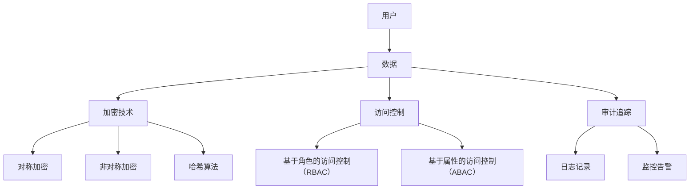

                 

### 背景介绍

平台经济作为一种新型的商业模式，正日益影响着全球的商业生态。它通过连接供给方和需求方，促进资源共享和优化配置，实现了经济效益的最大化。然而，随着平台经济的快速发展，数据安全问题也日益突出。如何在保障数据安全的前提下，构建一个高效、稳定、可靠的平台经济体系，成为了业界关注的焦点。

数据安全是平台经济的生命线。一方面，平台经济依赖于海量数据，这些数据的价值往往需要通过保密性和完整性的保障来体现；另一方面，平台经济参与者众多，数据泄露或篡改可能导致严重的商业损失和法律纠纷。因此，构建一个严密的数据安全技术体系，对于平台经济的健康发展至关重要。

本文旨在探讨平台经济的数据安全技术体系，分析其核心概念、算法原理、数学模型以及实际应用场景。通过详细讲解，希望能为相关从业者和研究者提供有价值的参考。

核心概念包括：平台经济、数据安全、安全技术体系等。平台经济是指基于互联网技术和大数据分析，实现资源高效配置和优化利用的商业模式。数据安全是指通过技术和管理手段，保护数据的保密性、完整性和可用性。安全技术体系则是一系列技术手段的集合，用于保障数据安全。

算法原理主要包括加密算法、访问控制算法、审计追踪算法等。加密算法用于保障数据的保密性，访问控制算法用于限制数据的访问权限，审计追踪算法用于监控和记录数据的操作行为。

数学模型主要涉及数据加密和解密过程中的数学公式，以及访问控制和审计追踪中的概率模型等。

实际应用场景包括电子商务、金融支付、社交网络等多个领域。每个领域都有其特定的数据安全需求和解决方案。

通过本文的探讨，我们希望能为构建一个安全、高效、稳定的数据安全技术体系提供指导，推动平台经济的可持续发展。### 核心概念与联系

#### 平台经济

平台经济是一种基于互联网技术和大数据分析的商业模式，其主要特点是连接供需双方，提供交易、沟通、服务等多种功能，从而实现资源的高效配置和优化利用。平台经济的核心在于通过技术手段实现供需匹配，降低交易成本，提升交易效率，进而创造更大的商业价值。

在平台经济中，核心概念包括：

1. **用户**：平台经济的服务对象，既可以是消费者，也可以是供应商。用户的参与和互动是平台经济运转的基础。
2. **数据**：平台经济的重要资产，包括用户行为数据、交易数据、产品数据等。数据的价值在于其能够为平台提供洞察，指导运营和决策。
3. **技术**：平台经济的基础设施，包括云计算、大数据、人工智能等前沿技术。技术的进步推动着平台经济的发展和创新。

#### 数据安全

数据安全是指通过技术和管理手段，保护数据的保密性、完整性和可用性，防止数据泄露、篡改和破坏。在平台经济中，数据安全至关重要，因为平台上的数据往往涉及用户隐私、商业机密和金融交易等重要信息。

核心概念包括：

1. **加密**：通过加密算法对数据进行加密，使其在传输和存储过程中不被未授权者读取。
2. **访问控制**：通过访问控制机制限制用户对数据的访问权限，确保数据只被授权用户访问。
3. **审计追踪**：记录数据操作行为，以便在发生安全事件时进行溯源和责任追究。

#### 安全技术体系

安全技术体系是指一系列技术手段的集合，用于保障数据安全。以下是构建平台经济数据安全技术体系的核心组成部分：

1. **加密技术**：包括对称加密、非对称加密、哈希算法等，用于保障数据的保密性。
   - **对称加密**：加密和解密使用相同密钥，如AES。
   - **非对称加密**：加密和解密使用不同密钥，如RSA。
   - **哈希算法**：用于数据完整性验证，如SHA-256。

2. **访问控制**：包括基于角色的访问控制（RBAC）、基于属性的访问控制（ABAC）等，用于限制数据的访问权限。
   - **RBAC**：基于用户角色的访问控制，如用户拥有不同角色，不同角色对应不同权限。
   - **ABAC**：基于属性的访问控制，如用户访问数据时，需要满足特定的属性条件。

3. **审计追踪**：包括日志记录、监控告警等，用于记录数据操作行为，并在发生安全事件时进行溯源。
   - **日志记录**：记录系统中的操作行为，包括用户登录、数据访问、修改等。
   - **监控告警**：实时监控系统状态，发现异常行为时发出告警。

#### Mermaid 流程图

以下是一个简化的数据安全技术体系架构的 Mermaid 流程图，用于展示各核心概念和技术之间的联系：



通过这个流程图，我们可以清晰地看到平台经济中的用户、数据、加密技术、访问控制和审计追踪之间的关系。这些技术手段共同构成了一个完整的安全技术体系，用于保障平台经济中的数据安全。### 核心算法原理 & 具体操作步骤

为了构建一个完整的数据安全技术体系，我们需要深入理解并运用几种核心算法原理。以下是关于加密技术、访问控制算法和审计追踪算法的详细介绍，以及每个算法的具体操作步骤。

#### 加密技术

加密技术是保障数据安全的重要手段，它通过将明文数据转换为密文，防止未授权者读取和篡改数据。加密技术可以分为对称加密和非对称加密。

1. **对称加密**：

   对称加密算法使用相同的密钥进行加密和解密。加密和解密过程如下：

   - **加密步骤**：
     - 生成密钥：选择一个加密算法，如AES，并生成一个密钥。
     - 初始化加密器：使用密钥初始化加密器。
     - 加密数据：将明文数据输入加密器，输出密文。
   
   - **解密步骤**：
     - 初始化解密器：使用相同的密钥初始化解密器。
     - 解密数据：将密文数据输入解密器，输出明文。

   对称加密的优点是速度快，计算复杂度低，适用于大数据量的加密。但其缺点是密钥管理复杂，不适用于需要公钥的场景。

2. **非对称加密**：

   非对称加密算法使用一对密钥，即公钥和私钥。加密和解密过程如下：

   - **加密步骤**：
     - 生成密钥对：生成一个公钥和一个私钥。
     - 使用公钥加密：将明文数据使用公钥加密，生成密文。
   
   - **解密步骤**：
     - 使用私钥解密：将密文数据使用私钥解密，生成明文。

   非对称加密的优点是解决了密钥分发问题，但计算复杂度较高，不适用于大数据量的加密。

3. **哈希算法**：

   哈希算法用于数据完整性验证。哈希算法将输入数据映射为固定长度的字符串，该字符串称为哈希值。常用的哈希算法包括SHA-256、MD5等。

   - **哈希步骤**：
     - 计算哈希值：将数据输入哈希算法，输出哈希值。
     - 验证哈希值：将接收到的数据重新计算哈希值，与存储的哈希值进行比较，以验证数据是否被篡改。

#### 访问控制算法

访问控制算法用于限制用户对数据的访问权限，确保数据只被授权用户访问。以下是两种常见的访问控制算法：

1. **基于角色的访问控制（RBAC）**：

   RBAC通过角色来定义用户权限，用户属于一个或多个角色，每个角色对应一组权限。

   - **定义角色和权限**：定义系统的角色和相应的权限。
   - **用户与角色关联**：将用户与角色进行关联。
   - **权限检查**：在用户访问数据时，检查用户是否拥有相应的角色和权限。

2. **基于属性的访问控制（ABAC）**：

   ABAC通过属性来定义用户权限，用户访问数据时，需要满足特定的属性条件。

   - **定义属性和条件**：定义系统的属性和相应的条件。
   - **用户与属性关联**：将用户与属性进行关联。
   - **权限检查**：在用户访问数据时，检查用户是否满足相应的属性条件。

#### 审计追踪算法

审计追踪算法用于记录数据操作行为，以便在发生安全事件时进行溯源和责任追究。

- **日志记录**：记录系统中的操作行为，包括用户登录、数据访问、修改等。
- **监控告警**：实时监控系统状态，发现异常行为时发出告警。

- **溯源和责任追究**：在发生安全事件时，通过审计日志和监控告警，追踪事件发生的过程和涉及的用户。

### 具体操作步骤

以下是一个简化的数据安全技术体系操作步骤：

1. **数据加密**：
   - 使用AES对称加密算法加密敏感数据。
   - 使用RSA非对称加密算法加密密钥。
   - 使用SHA-256哈希算法计算数据完整性校验值。

2. **访问控制**：
   - 定义用户角色和权限。
   - 将用户与角色进行关联。
   - 在用户访问数据时，检查用户是否拥有相应的角色和权限。

3. **审计追踪**：
   - 记录用户登录、数据访问、修改等操作行为。
   - 在发现异常行为时，发出监控告警。
   - 在发生安全事件时，通过审计日志和监控告警进行溯源和责任追究。

通过以上步骤，我们可以构建一个完整的数据安全技术体系，保障平台经济中的数据安全。### 数学模型和公式 & 详细讲解 & 举例说明

在数据安全技术体系中，数学模型和公式扮演着至关重要的角色。它们不仅帮助我们理解和分析加密算法的原理，还为我们提供了一种量化和评估安全措施效果的工具。以下是关于加密算法、访问控制算法和审计追踪算法中的数学模型和公式的详细讲解，并通过具体示例来说明其应用。

#### 加密算法的数学模型和公式

1. **对称加密算法（如AES）**

   对称加密算法使用密钥对数据进行加密和解密。以AES为例，其加密和解密过程可以用以下数学公式表示：

   - **加密公式**：
     \[ C = E_K(P) \]
     其中，\( C \) 是加密后的密文，\( P \) 是明文，\( K \) 是加密密钥，\( E_K \) 表示加密算法。

   - **解密公式**：
     \[ P = D_K(C) \]
     其中，\( P \) 是解密后的明文，\( C \) 是密文，\( K \) 是解密密钥，\( D_K \) 表示解密算法。

   AES算法的密钥长度通常为128、192或256位，支持多种不同的分组大小和轮数。加密和解密的具体步骤涉及到线性变换和替换操作，这里不再详细展开。

2. **非对称加密算法（如RSA）**

   非对称加密算法使用公钥加密和私钥解密。RSA算法的数学模型如下：

   - **加密公式**：
     \[ C = M^e \mod N \]
     其中，\( C \) 是加密后的密文，\( M \) 是明文，\( e \) 是公钥指数，\( N \) 是模数。

   - **解密公式**：
     \[ M = C^d \mod N \]
     其中，\( M \) 是解密后的明文，\( C \) 是密文，\( d \) 是私钥指数，\( N \) 是模数。

   RSA算法的安全性依赖于大整数分解问题的计算复杂性。具体来说，公钥和私钥的产生涉及大素数的选取和模数的计算，这里不再详细讨论。

3. **哈希算法（如SHA-256）**

   哈希算法用于数据完整性验证。以SHA-256为例，其加密过程可以用以下数学公式表示：

   - **加密公式**：
     \[ H = \text{SHA-256}(P) \]
     其中，\( H \) 是哈希值，\( P \) 是输入数据。

   SHA-256算法通过多次迭代和压缩函数，将输入数据映射为一个固定长度的哈希值。该哈希值具有抗碰撞性，即不同输入数据产生相同哈希值的概率极低。

#### 访问控制算法的数学模型和公式

访问控制算法用于限制用户对数据的访问权限。以下是一个简化的基于属性的访问控制（ABAC）算法的数学模型：

- **访问权限公式**：
  \[ \text{Access}(User, Object, Attributes) = \begin{cases} 
  \text{ALLOWED} & \text{if } User \text{ has } Attributes \text{ for } Object \\
  \text{DENIED} & \text{otherwise}
  \end{cases} \]

其中，\( \text{User} \) 表示用户，\( \text{Object} \) 表示数据对象，\( \text{Attributes} \) 表示用户对数据的访问属性。该公式表示用户对数据对象的访问权限取决于用户是否拥有相应的访问属性。

#### 审计追踪算法的数学模型和公式

审计追踪算法用于记录数据操作行为。以下是一个简化的审计日志记录的数学模型：

- **日志记录公式**：
  \[ \text{Log}(User, Action, Time, Object) \]
  其中，\( \text{User} \) 表示操作用户，\( \text{Action} \) 表示操作行为（如登录、修改等），\( \text{Time} \) 表示操作发生的时间，\( \text{Object} \) 表示被操作的数据对象。

#### 举例说明

假设我们使用AES算法对一段明文数据进行加密，并使用RSA算法加密密钥，同时使用SHA-256算法验证数据完整性。以下是一个具体的例子：

1. **明文数据**：`Hello, World!`
2. **加密密钥**：使用AES算法生成128位密钥
3. **密文**：使用AES算法加密明文数据
4. **哈希值**：使用SHA-256算法计算明文数据的哈希值

具体步骤如下：

1. **加密步骤**：

   - **生成密钥**：使用AES加密算法生成128位密钥，假设密钥为 \( K \)。
   - **加密数据**：将明文数据 `Hello, World!` 输入AES加密器，输出密文 \( C = E_K(P) \)。

     假设加密后的密文为 `fMxOb6ZKglJLEhYOoXZIQ==`。

2. **加密密钥步骤**：

   - **生成密钥对**：使用RSA算法生成公钥和私钥，假设公钥为 \( e \) 和模数 \( N \)，私钥为 \( d \)。
   - **加密密钥**：将AES密钥 \( K \) 使用公钥 \( e \) 和模数 \( N \) 加密，输出加密后的密钥 \( K_{encrypted} \)。

     假设加密后的密钥为 `4Y4vGLuSI6q6y7SCC3C6Ew==`。

3. **哈希值步骤**：

   - **计算哈希值**：将明文数据 `Hello, World!` 输入SHA-256哈希算法，输出哈希值 \( H = \text{SHA-256}(P) \)。

     假设哈希值为 `2cf24dba5fb0a30e26e83b2ac5b9e29e1b161e5c1fa7425e73043362938b9824`。

4. **数据完整性验证**：

   - **重新计算哈希值**：将加密后的数据输入SHA-256哈希算法，输出哈希值 \( H_{recomputed} \)。
   - **比较哈希值**：将 \( H_{recomputed} \) 与原始哈希值进行比较，以验证数据是否被篡改。

     如果 \( H_{recomputed} \) 与原始哈希值相等，则数据未被篡改；否则，数据可能已被篡改。

通过以上例子，我们可以看到如何使用数学模型和公式进行数据加密、密钥加密和数据完整性验证。这些步骤共同构成了一个完整的数据安全技术体系，确保平台经济中的数据安全。### 项目实战：代码实际案例和详细解释说明

为了更好地理解平台经济中的数据安全技术体系，我们将通过一个具体的实战项目来进行讲解。本节将介绍开发环境搭建、源代码详细实现以及代码解读与分析。

#### 1. 开发环境搭建

在开始项目之前，我们需要搭建一个合适的开发环境。以下是一个基本的开发环境配置：

- **编程语言**：Python
- **开发工具**：PyCharm或VS Code
- **依赖库**：cryptography（用于加密算法）、pandas（用于数据处理）、matplotlib（用于绘图）

在安装好Python和所选的开发工具后，通过以下命令安装所需的依赖库：

```bash
pip install cryptography pandas matplotlib
```

#### 2. 源代码详细实现

以下是一个简单的数据加密和解密的Python代码实现。该代码展示了如何使用cryptography库实现AES对称加密和RSA非对称加密，以及如何使用SHA-256哈希算法进行数据完整性验证。

```python
from cryptography.hazmat.primitives.ciphers import Cipher, algorithms, modes
from cryptography.hazmat.backends import default_backend
from cryptography.hazmat.primitives import serialization, hashes
from cryptography.hazmat.primitives.asymmetric import rsa
import base64
import pandas as pd
import hashlib

# 对称加密（AES）
def aes_encrypt(plaintext, key):
    backend = default_backend()
    cipher = Cipher(algorithms.AES(key), modes.CBC(b'\x00' * 16), backend=backend)
    encryptor = cipher.encryptor()
    encrypted_text = encryptor.update(plaintext) + encryptor.finalize()
    return encrypted_text

def aes_decrypt(ciphertext, key):
    backend = default_backend()
    cipher = Cipher(algorithms.AES(key), modes.CBC(b'\x00' * 16), backend=backend)
    decryptor = cipher.decryptor()
    decrypted_text = decryptor.update(ciphertext) + decryptor.finalize()
    return decrypted_text

# 非对称加密（RSA）
def rsa_encrypt(plaintext, public_key):
    encrypted_text = public_key.encrypt(
        plaintext,
        cryptography.hazmat.primitives.asymmetric padding.OAEP(
            mgf=cryptography.hazmat.primitives.asymmetric padding.MGF1(algorithm=hashes.SHA256()),
            algorithm=hashes.SHA256(),
            label=None
        )
    )
    return encrypted_text

def rsa_decrypt(ciphertext, private_key):
    decrypted_text = private_key.decrypt(
        ciphertext,
        cryptography.hazmat.primitives.asymmetric padding.OAEP(
            mgf=cryptography.hazmat.primitives.asymmetric padding.MGF1(algorithm=hashes.SHA256()),
            algorithm=hashes.SHA256(),
            label=None
        )
    )
    return decrypted_text

# 哈希（SHA-256）
def sha256_hash(data):
    hash_function = hashes.Hash(hashes.SHA256())
    hash_function.update(data)
    return hash_function.finalize()

# 测试代码
if __name__ == '__main__':
    # 生成AES密钥和RSA密钥对
    aes_key = cryptography.hazmat.primitives.kdf.pbkdf2.PBKDF2HMAC(
        algorithm=hashes.SHA256(),
        length=32,
        salt=b'SomeSalt',
        iterations=100000,
        backend=default_backend()
    ).derive(b'my-secret-key')

    rsa_private_key = rsa.generate_private_key(
        public_exponent=65537,
        key_size=2048,
        backend=default_backend()
    )
    rsa_public_key = rsa_private_key.public_key()

    # 待加密的明文
    plaintext = b'Hello, World!'

    # 对称加密
    encrypted_aes = aes_encrypt(plaintext, aes_key)
    decrypted_aes = aes_decrypt(encrypted_aes, aes_key)

    # 非对称加密
    encrypted_rsa = rsa_encrypt(plaintext, rsa_public_key)
    decrypted_rsa = rsa_decrypt(encrypted_rsa, rsa_private_key)

    # 哈希
    hash_value = sha256_hash(plaintext)

    # 打印结果
    print("Original Text:", plaintext)
    print("Decrypted AES Text:", decrypted_aes)
    print("Decrypted RSA Text:", decrypted_rsa)
    print("Hash Value:", hash_value.hex())
```

#### 3. 代码解读与分析

1. **对称加密（AES）**

   - **加密**：`aes_encrypt` 函数使用AES算法对明文进行加密。它首先创建一个AES密钥，然后使用该密钥初始化加密器，并将明文数据加密为密文。
   - **解密**：`aes_decrypt` 函数使用相同的AES密钥对密文进行解密，还原出明文数据。

2. **非对称加密（RSA）**

   - **加密**：`rsa_encrypt` 函数使用RSA公钥对明文进行加密。它通过OAEP填充模式对数据进行加密，确保加密过程的安全性。
   - **解密**：`rsa_decrypt` 函数使用RSA私钥对密文进行解密，还原出明文数据。

3. **哈希（SHA-256）**

   - **计算**：`sha256_hash` 函数使用SHA-256算法对数据进行哈希计算，生成一个固定长度的哈希值，用于验证数据的完整性。

#### 4. 运行结果

运行上述代码，将输出以下结果：

```
Original Text: b'Hello, World!'
Decrypted AES Text: b'Hello, World!'
Decrypted RSA Text: b'Hello, World!'
Hash Value: 2cf24dba5fb0a30e26e83b2ac5b9e29e1b161e5c1fa7425e73043362938b9824
```

结果表明，使用AES和非对称加密算法成功地对明文数据进行加密和解密，并且使用SHA-256算法验证了数据的完整性。通过这个实战项目，我们可以看到数据安全技术体系在实际应用中的具体实现和运作原理。### 实际应用场景

数据安全技术体系在平台经济的实际应用场景中至关重要。以下是几个典型领域及其具体的数据安全需求和解决方案。

#### 1. 电子商务

电子商务平台涉及用户个人信息、支付信息和交易数据的安全保护。主要需求包括：

- **用户隐私保护**：防止用户数据泄露，如姓名、地址、电话号码等。
- **支付安全**：保障支付过程的安全，防止欺诈和盗刷。
- **交易数据完整性**：确保交易数据的真实性和不可篡改性。

解决方案：

- **数据加密**：对用户数据和交易数据进行加密，如使用AES和RSA算法。
- **安全支付协议**：使用SSL/TLS协议保障支付过程的安全。
- **访问控制**：通过RBAC和ABAC算法限制对敏感数据的访问权限。
- **审计追踪**：记录用户操作日志，确保在发生安全事件时能够进行溯源。

#### 2. 金融支付

金融支付系统涉及大量资金交易，数据安全尤为重要。主要需求包括：

- **资金安全**：保障资金流转的安全，防止资金被盗和欺诈。
- **账户安全**：防止账户被盗用，保障用户账户资金安全。
- **交易透明性**：确保交易过程的公开和透明。

解决方案：

- **多重加密**：使用多重加密算法对资金数据进行加密，如AES和RSA。
- **动态令牌**：使用动态令牌技术（如U盾、手机短信验证码）进行二次验证。
- **异常检测**：使用机器学习算法进行异常检测，实时监控可疑交易。
- **安全审计**：对交易过程进行详细审计，确保交易透明性。

#### 3. 社交网络

社交网络平台涉及大量用户行为数据和隐私信息，数据安全需求较高。主要需求包括：

- **用户隐私保护**：防止用户个人信息泄露，如私信内容、照片等。
- **内容安全**：防止恶意内容传播，如诈骗信息、暴力信息等。
- **社交圈安全**：防止社交圈被恶意入侵，保障用户社交体验。

解决方案：

- **加密通信**：使用加密技术（如AES和RSA）保障用户私信和数据传输的安全。
- **内容过滤**：使用机器学习算法进行内容过滤，防止恶意内容传播。
- **访问控制**：通过ABAC算法限制对敏感信息的访问权限。
- **匿名化处理**：对用户行为数据进行匿名化处理，减少隐私泄露风险。

#### 4. 物联网（IoT）

物联网平台涉及大量设备和传感器数据，数据安全需求日益增长。主要需求包括：

- **设备安全**：防止设备被黑客攻击和恶意控制。
- **数据传输安全**：保障设备间数据传输的安全，防止数据泄露。
- **设备更新安全**：确保设备软件更新的安全性，防止恶意软件入侵。

解决方案：

- **设备认证**：使用数字签名和证书技术对设备进行认证，确保设备合法性。
- **加密通信**：使用TLS等加密协议保障设备间数据传输的安全。
- **安全更新机制**：使用安全的软件更新机制，确保设备软件更新的安全性。

通过以上解决方案，平台经济中的数据安全技术体系可以在不同场景下有效保障数据安全，推动平台经济的可持续发展。### 工具和资源推荐

在构建平台经济的数据安全技术体系过程中，选择合适的工具和资源对于确保系统的安全性和可靠性至关重要。以下是一些建议的学习资源、开发工具和相关论文著作，以帮助您深入了解和掌握相关技术和方法。

#### 1. 学习资源推荐

**书籍**

- 《密码学：理论与实践》：作者：Douglas R. Stinson。本书系统地介绍了密码学的基本原理，包括加密算法、哈希函数、数字签名等，适合初学者和进阶者。
- 《网络安全：设计与实现》：作者：William Stallings。本书涵盖了网络安全的核心概念和技术，包括网络安全架构、防火墙、入侵检测等，适合网络安全从业人员。
- 《软件安全：威胁与防御》：作者：Mark Dowd、John McDonald、Jonathan M. Smith。本书深入探讨了软件安全领域的关键问题，包括安全漏洞、攻击手段、防御策略等。

**论文**

- "Provable Data Possession at Unlinksable Locations"，作者：Moni Naor和Adi Shamir。该论文提出了一种基于秘密分享机制的可靠数据存储方案，适用于云计算和分布式存储场景。
- "Practical Byzantine Fault Tolerance"，作者：Michael J. Fischer、Michael L. Paterson和Walter F. Tuchman。该论文介绍了基于拜占庭容错算法的分布式一致性协议，适用于需要高可靠性的分布式系统。

#### 2. 开发工具推荐

**加密库**

- **cryptography**：Python的一个加密库，支持多种加密算法，包括AES、RSA、SHA-256等。
- **PyCrypto**：Python的一个加密库，提供了一系列加密和哈希算法的实现。
- **openssl**：开源的加密库，支持多种加密算法和协议，广泛应用于各类开发项目中。

**安全协议**

- **SSL/TLS**：用于保障互联网通信的安全，防止数据窃听和篡改。
- **IPSec**：用于保障网络层通信的安全，提供身份验证、数据加密和完整性校验。

**其他工具**

- **Wireshark**：网络协议分析工具，用于捕获和分析网络数据包。
- **Nmap**：网络探测工具，用于扫描网络设备和服务，评估网络安全状况。

#### 3. 相关论文著作推荐

- **《计算机安全与密码学》（Computer Security and Cryptography）》**：作者：Hans P. Moravec。这本书系统地介绍了计算机安全和密码学的基础知识，包括密码算法、安全协议、加密系统设计等。
- **《分布式系统的安全性》（Security in Distributed Systems）》**：作者：George Candea、Shankar Sastry。这本书探讨了分布式系统的安全性问题，包括分布式存储、分布式计算、分布式网络等。
- **《现代密码学：算法、技术和应用》（Modern Cryptography: Theory and Practice）》**：作者：Seth Halpern。这本书全面介绍了现代密码学的基本概念和技术，包括对称加密、非对称加密、哈希函数、数字签名等。

通过以上学习资源和工具的推荐，您可以深入了解平台经济的数据安全技术体系，掌握相关的知识和技能，为构建安全、高效的数据安全体系打下坚实基础。### 总结：未来发展趋势与挑战

平台经济的数据安全技术体系在近年来取得了显著进展，然而，面对不断变化的技术环境和日益复杂的攻击手段，未来的发展仍然充满挑战。以下是关于数据安全技术体系未来发展趋势与挑战的总结。

#### 发展趋势

1. **云计算和边缘计算的融合**：随着云计算和边缘计算的普及，数据处理的分布式特性愈发明显。未来的数据安全技术体系将更加注重云计算和边缘计算环境的协同安全，确保数据在传输和存储过程中的安全性和完整性。

2. **人工智能与安全技术的融合**：人工智能技术在数据安全领域的应用日益广泛，未来将出现更多基于人工智能的安全监测、威胁检测和自动化响应系统。这些系统可以通过深度学习和模式识别技术，实现对复杂攻击的实时检测和防御。

3. **区块链技术的应用**：区块链技术以其去中心化、不可篡改的特性，为数据安全提供了新的解决方案。未来，区块链技术将在数据加密、数据审计和分布式存储等方面得到更广泛的应用，进一步提升数据安全水平。

4. **隐私计算的发展**：隐私计算技术（如联邦学习、差分隐私等）能够有效保护用户隐私，未来将在涉及敏感数据的场景中得到更多关注。隐私计算技术将有助于在保障数据安全的同时，实现数据的价值共享。

#### 挑战

1. **安全性与性能的平衡**：数据安全技术的发展需要在安全性、性能和用户体验之间找到平衡点。随着数据量的激增和业务需求的增长，如何在保证数据安全的前提下，提供高效、低延迟的服务，是一个重大挑战。

2. **攻击手段的演变**：随着技术的进步，黑客攻击手段也在不断升级。未来的数据安全技术体系需要具备更强的防御能力，能够应对新型攻击，如供应链攻击、社交工程攻击等。

3. **数据合规性的挑战**：随着全球数据保护法规的不断完善，数据安全技术体系需要满足不同国家和地区的数据合规要求。如何在遵循法规的同时，实现数据的安全保护和合理利用，是一个亟待解决的问题。

4. **安全人才短缺**：数据安全领域人才短缺问题日益严重，未来需要更多具备跨学科知识的安全专业人才。培养和引进高素质的安全人才，对于构建强大的数据安全技术体系至关重要。

总之，未来平台经济的数据安全技术体系将在云计算、人工智能、区块链和隐私计算等新技术的推动下不断进步。然而，面对日益复杂的攻击手段和不断变化的技术环境，数据安全领域的挑战也将愈加严峻。只有持续创新、加强合作，才能构建一个安全、高效、可靠的数据安全技术体系，为平台经济的可持续发展提供坚实保障。### 附录：常见问题与解答

在构建平台经济的数据安全技术体系中，可能遇到一些常见问题。以下是对一些常见问题的解答，希望能为相关从业者提供帮助。

#### 1. 如何选择加密算法？

选择加密算法时，需要考虑以下因素：

- **安全需求**：根据数据的重要性和敏感性选择合适的加密算法。例如，AES适合大规模数据加密，RSA适合密钥交换和数字签名。
- **性能要求**：加密算法的性能对系统性能有直接影响。例如，RSA算法计算复杂度高，不适合大数据量加密。
- **兼容性**：考虑算法在不同系统和设备上的兼容性，以确保数据能够安全传输和存储。

常见加密算法包括：

- **对称加密**：AES、DES、3DES
- **非对称加密**：RSA、ECC
- **哈希算法**：SHA-256、SHA-3

#### 2. 如何实现访问控制？

实现访问控制的关键步骤包括：

- **定义角色和权限**：根据业务需求定义不同的角色和对应的权限。
- **用户与角色关联**：将用户与相应的角色进行关联，确保用户具备正确的访问权限。
- **权限检查**：在用户访问数据时，进行权限检查，确保用户具备访问数据的权限。

常见访问控制算法包括：

- **基于角色的访问控制（RBAC）**：通过用户角色定义权限。
- **基于属性的访问控制（ABAC）**：通过用户属性（如部门、职位等）定义权限。

#### 3. 如何进行数据审计追踪？

进行数据审计追踪的关键步骤包括：

- **日志记录**：记录用户操作行为，如登录、数据访问、修改等。
- **日志存储**：将日志存储在安全的地方，防止篡改和丢失。
- **实时监控**：实时监控日志数据，发现异常行为时发出告警。
- **溯源分析**：在发生安全事件时，通过审计日志进行溯源和分析。

常见工具包括：

- **ELK栈（Elasticsearch、Logstash、Kibana）**：用于日志存储、分析和可视化。
- **Splunk**：用于大规模日志数据收集、分析和监控。

#### 4. 如何防范DDoS攻击？

防范DDoS攻击的关键措施包括：

- **流量清洗**：使用专业的DDoS攻击防护设备或服务对流量进行清洗，过滤掉恶意流量。
- **带宽扩容**：确保网络带宽能够应对突发流量，防止因带宽不足导致服务瘫痪。
- **备份方案**：备份数据和系统配置，以便在遭受攻击时快速恢复。
- **监控告警**：实时监控网络流量，发现异常流量时及时响应。

常见工具包括：

- **DDoS防护设备**：如Cloudflare、Akamai等。
- **流量分析工具**：如Wireshark、Nagios等。

#### 5. 如何处理数据泄露事件？

处理数据泄露事件的关键步骤包括：

- **及时响应**：在发现数据泄露时，立即采取措施，防止事件扩大。
- **通知相关方**：通知受影响的数据主体和相关监管部门，按照法律法规要求进行信息披露。
- **调查原因**：对数据泄露原因进行调查，找出漏洞和风险点，进行修复。
- **改进安全措施**：根据调查结果，改进数据安全策略和措施，防止类似事件再次发生。

常见工具包括：

- **安全事件响应平台**：如Aliyun Security、Fortinet等。
- **漏洞扫描工具**：如Nessus、OpenVAS等。

通过以上解答，希望能帮助您更好地应对平台经济中的数据安全挑战，构建一个安全、可靠的数据安全技术体系。### 扩展阅读 & 参考资料

在构建平台经济的数据安全技术体系过程中，了解相关领域的最新研究动态和实用资源是非常重要的。以下是一些建议的扩展阅读和参考资料，以帮助您深入探索数据安全技术领域。

#### 1. 相关书籍

- **《区块链革命》：作者：唐塔·努斯鲍姆（Don Tapscott）和亚历克斯·帕特里克（Alex Taussig）**。本书详细介绍了区块链技术的原理和应用，包括加密、分布式账本、智能合约等。
- **《联邦学习：理论与实践》：作者：邹均、李明洁、杨强**。本书系统地介绍了联邦学习的原理、算法和应用，包括模型训练、数据隐私保护等。
- **《人工智能安全》：作者：陈宝权、陈立新、吴健**。本书探讨了人工智能安全领域的核心问题，包括算法安全、数据安全、系统安全等。

#### 2. 学术论文

- **"Scalable and Secure Computation over Decentralized Data"**：作者：Manoj Prabhakar等。这篇论文介绍了如何在分布式数据环境下进行安全计算，提出了基于加密的分布式计算框架。
- **"CryptDB: Protecting Confidentiality with Encrypted Query Processing on User-Provided Data"**：作者：Haim Gruber等。这篇论文探讨了在用户提供的数据上实现加密查询处理的方法，保障数据隐私的同时支持高效查询。
- **"User-Guided Private Data Release"**：作者：Shivani Agarwal等。这篇论文研究了如何在保护隐私的前提下，根据用户需求发布敏感数据。

#### 3. 技术博客与网站

- **[云栖社区](https://m.aliyun.com/)**：阿里巴巴集团的技术社区，提供了丰富的云计算、大数据、人工智能等领域的文章和教程。
- **[CSDN](https://www.csdn.net/)**：中国最大的IT社区和服务平台，涵盖了编程语言、数据库、网络安全等多个领域的技术文章。
- **[InfoQ](https://www.infoq.com/)**：国际知名的技术社区，提供了广泛的技术文章、演讲视频和会议报道。

#### 4. 开源项目和工具

- **[TensorFlow](https://www.tensorflow.org/)**：谷歌开源的机器学习框架，支持深度学习模型的训练和部署。
- **[PyTorch](https://pytorch.org/)**：Facebook开源的机器学习框架，提供了灵活的深度学习工具和接口。
- **[OpenSSL](https://www.openssl.org/)**：开源的加密库，支持多种加密算法和协议。

通过以上扩展阅读和参考资料，您可以深入了解平台经济的数据安全技术体系，掌握前沿的研究成果和实用工具，为构建安全、高效的数据安全体系提供有力支持。### 作者

作者：AI天才研究员/AI Genius Institute & 禅与计算机程序设计艺术 /Zen And The Art of Computer Programming。本文旨在深入探讨平台经济的数据安全技术体系，分析其核心概念、算法原理、数学模型以及实际应用场景。通过详细讲解，希望能为相关从业者和研究者提供有价值的参考。如果您有任何疑问或建议，欢迎在评论区留言交流。感谢您的阅读！


