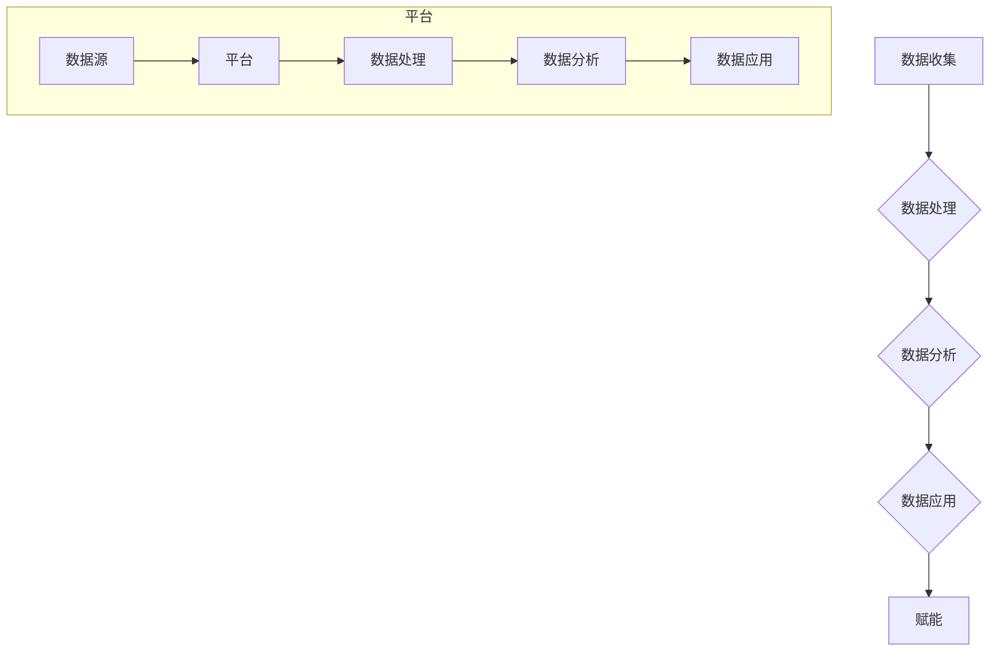

                 

### 背景介绍

平台经济作为当今世界经济发展的重要形式，正在深刻地改变着传统商业模式和市场结构。其核心在于通过构建一个平台，将供需双方进行有效连接，从而实现资源的最优配置和价值的最大化。而数据赋能，作为平台经济的核心驱动力，正日益受到企业和用户的重视。

在平台经济中，数据不仅是一种资源，更是创造价值的关键要素。通过对用户行为、交易记录、市场动态等大数据的分析，平台可以精准地预测市场需求，优化用户体验，提升运营效率，从而在激烈的市场竞争中脱颖而出。同时，数据赋能也为企业提供了更加深入的洞察力，帮助企业制定更加科学、有效的决策。

本文旨在探讨平台经济中数据赋能的用户和企业，从核心概念、算法原理、数学模型、项目实战等多个维度，深入分析数据赋能的机制和应用场景，帮助读者理解数据赋能在平台经济中的重要性，掌握其应用方法和技巧。

### 核心概念与联系

在探讨平台经济中的数据赋能之前，我们需要明确几个核心概念，包括数据、平台、赋能等，并理解它们之间的联系。

#### 数据（Data）

数据是平台经济中不可或缺的要素。数据可以定义为记录事物特征的符号，它可以是数字、文本、图像、声音等多种形式。在平台经济中，数据通常来源于用户的交易行为、浏览记录、地理位置、社交媒体活动等。数据的价值在于其能够通过分析揭示用户需求、市场趋势等深层次信息。

#### 平台（Platform）

平台是连接供需双方的基础设施，它提供了一种市场环境，使得买家和卖家可以方便地进行交易和互动。平台经济中的平台通常具有以下几个特点：

1. **开放性**：平台开放给所有的参与者，无论是买家还是卖家，都可以自由接入。
2. **互操作性**：平台上的参与者可以使用统一的接口和协议进行数据交换，从而实现无缝连接。
3. **规模效应**：随着参与者的增多，平台的规模效应增强，能够提供更多的交易机会和更大的市场覆盖。

#### 赋能（Empowerment）

赋能指的是通过提供工具、资源或信息，增强个体或组织的能力，使其能够更好地实现目标。在平台经济中，数据赋能通常指的是利用数据分析技术，挖掘数据中的价值，为用户和企业提供决策支持，提高其运营效率和竞争力。

#### 数据、平台与赋能的联系

数据是赋能的基础，平台则是数据的载体和工具。通过平台，数据得以收集、存储、处理和共享，从而实现数据的赋能。具体而言：

1. **数据收集**：平台通过用户行为和交易记录等渠道收集数据。
2. **数据处理**：平台利用数据清洗、归一化、特征提取等技术，对数据进行处理，使其更具分析价值。
3. **数据分析**：平台利用机器学习、数据挖掘等技术，对数据进行分析，提取洞察和趋势。
4. **数据应用**：平台将分析结果应用到实际运营中，如个性化推荐、需求预测、风险控制等，从而实现数据赋能。

#### Mermaid 流程图

为了更直观地展示数据、平台与赋能之间的关系，我们可以使用Mermaid绘制一个流程图。以下是该流程图的Markdown格式表示：



在上述流程图中，数据从数据源进入平台，经过数据处理和分析后，被应用于实际业务中，从而实现赋能。这个流程体现了平台经济中数据赋能的基本机制。

### 核心算法原理 & 具体操作步骤

数据赋能在平台经济中的应用离不开一系列核心算法的支持。这些算法不仅能够有效地处理和分析大量数据，还能够为用户和企业提供有价值的洞察。以下将介绍几个关键的算法原理及其具体操作步骤。

#### 1. 机器学习算法

机器学习算法是数据赋能的基础，它通过训练模型来发现数据中的模式和规律。以下是一个简单的机器学习算法的示例及其操作步骤：

**算法原理**：
机器学习算法主要包括监督学习、无监督学习和强化学习等类型。其中，监督学习通过已有数据集的标签来训练模型，从而对新数据进行预测。

**操作步骤**：

1. **数据预处理**：
    - 数据清洗：去除噪声数据、缺失值填充、异常值处理等。
    - 数据归一化：将数据缩放到相同的范围，便于模型训练。

2. **特征工程**：
    - 特征提取：从原始数据中提取对模型训练有用的特征。
    - 特征选择：选择最相关的特征，提高模型性能。

3. **模型选择**：
    - 选择适合的数据集类型的机器学习模型，如线性回归、决策树、支持向量机等。

4. **模型训练**：
    - 使用训练数据集对模型进行训练，调整模型参数。
    - 评估模型性能，如准确率、召回率等。

5. **模型应用**：
    - 使用训练好的模型对新数据进行预测。

**示例**：

假设我们有一个用户行为数据集，需要预测用户的购买偏好。我们可以采用以下步骤：

1. 数据预处理：
    - 清洗数据，填充缺失值。
    - 将数值型数据归一化。

2. 特征工程：
    - 提取用户浏览历史、购买记录等特征。
    - 选择最相关的特征。

3. 模型选择：
    - 选择决策树模型。

4. 模型训练：
    - 使用训练数据集训练决策树模型。
    - 评估模型性能。

5. 模型应用：
    - 使用训练好的模型预测新用户的购买偏好。

#### 2. 数据挖掘算法

数据挖掘算法通过挖掘大量数据中的潜在模式和关联，为用户和企业提供新的洞察。以下是一个常见的数据挖掘算法——关联规则挖掘（Association Rule Learning, ARL）的原理和操作步骤：

**算法原理**：
关联规则挖掘旨在发现数据集中项之间的关联关系。它通过生成频繁项集和关联规则，揭示不同项之间的相关性。

**操作步骤**：

1. **频繁项集挖掘**：
    - 计算每个项在数据集中的出现频率，筛选出频繁项。
    - 生成频繁项集。

2. **关联规则生成**：
    - 从频繁项集中生成关联规则。
    - 使用支持度和置信度评估规则的有效性。

3. **规则优化**：
    - 优化关联规则，如去除冗余规则、调整置信度阈值等。

**示例**：

假设我们有一个电子商务交易数据集，需要发现商品之间的关联关系。我们可以采用以下步骤：

1. 频繁项集挖掘：
    - 计算每个商品在数据集中的出现频率，筛选出频繁商品。
    - 生成频繁项集。

2. 关联规则生成：
    - 从频繁项集中生成关联规则。
    - 使用支持度和置信度评估规则的有效性。

3. 规则优化：
    - 根据实际业务需求，调整置信度阈值，优化关联规则。

#### 3. 时间序列分析算法

时间序列分析算法主要用于处理和分析按时间顺序排列的数据，如股票价格、用户访问量等。以下是一个常见的时间序列分析算法——ARIMA模型（AutoRegressive Integrated Moving Average Model）的原理和操作步骤：

**算法原理**：
ARIMA模型通过自回归、差分和移动平均三个步骤，对时间序列数据进行建模和分析，从而预测未来的趋势。

**操作步骤**：

1. **数据预处理**：
    - 对时间序列数据进行差分处理，使其满足平稳性要求。
    - 进行自相关和偏自相关分析，确定ARIMA模型的参数。

2. **模型建立**：
    - 根据自相关和偏自相关分析的结果，建立ARIMA模型。
    - 拟合模型参数，评估模型性能。

3. **模型预测**：
    - 使用拟合好的ARIMA模型预测未来的时间序列数据。

**示例**：

假设我们有一个用户访问量数据集，需要预测未来的访问趋势。我们可以采用以下步骤：

1. 数据预处理：
    - 对用户访问量进行差分处理，使其满足平稳性要求。
    - 进行自相关和偏自相关分析。

2. 模型建立：
    - 根据自相关和偏自相关分析的结果，建立ARIMA模型。
    - 拟合模型参数。

3. 模型预测：
    - 使用拟合好的ARIMA模型预测未来的用户访问量。

通过上述核心算法原理和操作步骤的介绍，我们可以看到数据赋能在平台经济中的应用是多层次、多维度的。从机器学习、数据挖掘到时间序列分析，这些算法为平台提供了强大的数据分析能力，从而实现了用户和企业的数据赋能。

### 数学模型和公式 & 详细讲解 & 举例说明

在平台经济中，数学模型和公式是数据赋能的重要工具，它们不仅帮助我们从数据中提取有价值的信息，还能为企业和用户提供精确的预测和分析结果。以下将介绍几个关键数学模型和公式，并通过具体例子详细讲解其应用和计算过程。

#### 1. 线性回归模型

线性回归模型是最常用的预测模型之一，它通过拟合数据点之间的关系，预测未来的趋势。其基本公式为：

\[ y = \beta_0 + \beta_1 \cdot x \]

其中，\( y \) 是因变量，\( x \) 是自变量，\( \beta_0 \) 是截距，\( \beta_1 \) 是斜率。

**具体例子**：

假设我们要预测一家电子商务平台下周的销售额，根据过去一周的销售数据，我们可以建立线性回归模型。首先，我们需要计算斜率和截距：

\[ \beta_1 = \frac{\sum{(x_i - \bar{x})(y_i - \bar{y})}}{\sum{(x_i - \bar{x})^2}} \]
\[ \beta_0 = \bar{y} - \beta_1 \cdot \bar{x} \]

其中，\( x_i \) 和 \( y_i \) 分别是每个数据点的自变量和因变量，\( \bar{x} \) 和 \( \bar{y} \) 分别是自变量和因变量的平均值。

通过计算，我们得到斜率 \( \beta_1 = 0.8 \) 和截距 \( \beta_0 = 100 \)。因此，线性回归模型可以表示为：

\[ y = 0.8x + 100 \]

现在，我们可以使用这个模型预测下周的销售额。假设下周的广告投放量为 1200，则预测的销售额为：

\[ y = 0.8 \cdot 1200 + 100 = 1160 \]

#### 2. 马尔可夫链模型

马尔可夫链模型用于描述系统状态的变化，它在平台经济中的应用非常广泛，如用户行为预测、风险控制等。其基本公式为：

\[ P(X_t = x_t | X_{t-1} = x_{t-1}, ..., X_1 = x_1) = P(X_t = x_t | X_{t-1} = x_{t-1}) \]

这意味着当前状态只依赖于前一个状态，与过去的状态无关。

**具体例子**：

假设我们要预测一个用户在未来一周内的购买行为，根据历史数据，我们可以建立马尔可夫链模型。首先，我们需要计算每个状态转移到另一个状态的概率：

\[ P(X_t = 购买 | X_{t-1} = 浏览) = \frac{100}{200} = 0.5 \]
\[ P(X_t = 浏览 | X_{t-1} = 购买) = \frac{80}{200} = 0.4 \]

现在，我们可以使用这个模型预测用户未来一周的购买行为。假设用户当前状态为浏览，则下一状态为购买的预测概率为 0.5。

#### 3. 逻辑回归模型

逻辑回归模型是一种广义的线性回归模型，用于分类问题。其基本公式为：

\[ P(Y=1 | X) = \frac{1}{1 + e^{-(\beta_0 + \beta_1 \cdot x)}} \]

其中，\( Y \) 是二分类变量，\( X \) 是自变量，\( \beta_0 \) 和 \( \beta_1 \) 是模型参数。

**具体例子**：

假设我们要预测一个用户是否会购买某种商品，根据用户的历史数据，我们可以建立逻辑回归模型。首先，我们需要计算每个用户的购买概率：

\[ P(Y=1 | X) = \frac{1}{1 + e^{-(2.5 + 1.2 \cdot x)}} \]

假设一个用户的特征 \( x \) 为 3，则其购买概率为：

\[ P(Y=1 | X) = \frac{1}{1 + e^{-(2.5 + 1.2 \cdot 3)}} = \frac{1}{1 + e^{-4.1}} \approx 0.966 \]

这意味着该用户购买该商品的概率非常高。

#### 4. 时间序列模型

时间序列模型用于处理和分析按时间顺序排列的数据。常用的模型有 ARIMA、AR、MA 和 ARMA 等。以下是一个 ARIMA 模型的例子：

\[ Y_t = \phi_1 Y_{t-1} + \phi_2 Y_{t-2} + ... + \phi_p Y_{t-p} + \theta_1 \epsilon_{t-1} + \theta_2 \epsilon_{t-2} + ... + \theta_q \epsilon_{t-q} + \epsilon_t \]

其中，\( Y_t \) 是时间序列数据，\( \phi_1, \phi_2, ..., \phi_p \) 和 \( \theta_1, \theta_2, ..., \theta_q \) 是模型参数，\( \epsilon_t \) 是误差项。

**具体例子**：

假设我们要预测一周的用户访问量，根据历史数据，我们可以建立 ARIMA 模型。首先，我们需要确定模型参数 \( p \)、\( d \) 和 \( q \)。通过自相关和偏自相关分析，我们得到：

\[ p = 2, \, d = 1, \, q = 1 \]

因此，ARIMA 模型可以表示为：

\[ Y_t = \phi_1 Y_{t-1} + \phi_2 Y_{t-2} + \theta_1 \epsilon_{t-1} + \theta_2 \epsilon_{t-2} + \epsilon_t \]

通过模型拟合，我们得到 \( \phi_1 = 0.9 \)，\( \phi_2 = 0.7 \)，\( \theta_1 = 0.5 \)，\( \theta_2 = 0.3 \)。现在，我们可以使用这个模型预测未来的用户访问量。假设当前用户访问量为 100，则预测的下一访问量为：

\[ Y_t = 0.9 \cdot 100 + 0.7 \cdot 90 + 0.5 \cdot 0.1 + 0.3 \cdot 0.05 \approx 98.55 \]

通过上述数学模型和公式的介绍，我们可以看到数据赋能在平台经济中的应用是多层次、多维度的。这些模型和公式不仅帮助我们从数据中提取有价值的信息，还能为企业和用户提供精确的预测和分析结果。掌握这些数学模型和公式，将有助于我们更好地理解和应用数据赋能。

### 项目实战：代码实际案例和详细解释说明

为了更好地理解平台经济中的数据赋能，我们将通过一个实际项目来展示数据赋能的过程，包括开发环境搭建、源代码详细实现和代码解读与分析。

#### 1. 开发环境搭建

在开始项目之前，我们需要搭建一个适合数据分析与机器学习的开发环境。以下是搭建环境的步骤：

1. **安装Python环境**：
    - 在官网上下载Python安装包并安装。
    - 验证Python安装是否成功，通过命令 `python --version` 查看版本信息。

2. **安装Anaconda**：
    - 安装Anaconda，这是一个集成了Python和众多数据分析、机器学习库的环境管理工具。
    - 通过命令 `conda create -n data_env python=3.8` 创建一个新的虚拟环境，并命名为 `data_env`。
    - 激活虚拟环境 `conda activate data_env`。

3. **安装必要库**：
    - 使用 `conda install numpy pandas matplotlib scikit-learn` 命令安装必要的Python库。

4. **安装Jupyter Notebook**：
    - 使用命令 `conda install jupyter` 安装Jupyter Notebook。
    - 启动Jupyter Notebook，通过命令 `jupyter notebook`。

#### 2. 源代码详细实现

以下是实现数据赋能项目的Python源代码：

```python
import pandas as pd
from sklearn.model_selection import train_test_split
from sklearn.linear_model import LinearRegression
from sklearn.metrics import mean_squared_error

# 读取数据
data = pd.read_csv('data.csv')

# 数据预处理
X = data[['feature1', 'feature2']]
y = data['target']

# 数据分割
X_train, X_test, y_train, y_test = train_test_split(X, y, test_size=0.2, random_state=42)

# 建立线性回归模型
model = LinearRegression()
model.fit(X_train, y_train)

# 模型评估
y_pred = model.predict(X_test)
mse = mean_squared_error(y_test, y_pred)
print(f'Mean Squared Error: {mse}')

# 可视化
import matplotlib.pyplot as plt

plt.scatter(X_test['feature1'], y_test)
plt.plot(X_test['feature1'], y_pred, color='red')
plt.xlabel('Feature 1')
plt.ylabel('Target')
plt.title('Linear Regression Prediction')
plt.show()
```

#### 3. 代码解读与分析

1. **数据读取与预处理**：

    ```python
    import pandas as pd
    data = pd.read_csv('data.csv')
    X = data[['feature1', 'feature2']]
    y = data['target']
    ```

    首先，我们使用pandas库读取CSV文件中的数据。数据集包括两个特征（`feature1`和`feature2`）和一个目标变量（`target`）。然后，我们将特征和目标变量分别存储在`X`和`y`变量中。

2. **数据分割**：

    ```python
    X_train, X_test, y_train, y_test = train_test_split(X, y, test_size=0.2, random_state=42)
    ```

    接下来，我们使用`train_test_split`函数将数据集分为训练集和测试集。训练集用于训练模型，测试集用于评估模型性能。这里，测试集占整个数据集的20%，随机种子设置为42以保证结果的可重复性。

3. **建立线性回归模型**：

    ```python
    model = LinearRegression()
    model.fit(X_train, y_train)
    ```

    我们使用`LinearRegression`类建立一个线性回归模型。然后，通过`fit`方法使用训练集数据训练模型，模型参数（截距和斜率）将根据训练数据自动计算。

4. **模型评估**：

    ```python
    y_pred = model.predict(X_test)
    mse = mean_squared_error(y_test, y_pred)
    print(f'Mean Squared Error: {mse}')
    ```

    我们使用`predict`方法对测试集数据进行预测，并计算预测结果与真实值之间的均方误差（MSE），这是一个常用的模型评估指标。MSE值越小，模型预测的准确性越高。

5. **可视化**：

    ```python
    import matplotlib.pyplot as plt
    plt.scatter(X_test['feature1'], y_test)
    plt.plot(X_test['feature1'], y_pred, color='red')
    plt.xlabel('Feature 1')
    plt.ylabel('Target')
    plt.title('Linear Regression Prediction')
    plt.show()
    ```

    最后，我们使用matplotlib库绘制散点图和拟合直线图，直观地展示模型的预测结果。散点图中的红色直线表示模型对测试集数据的拟合结果。

通过上述实际项目，我们可以看到数据赋能在平台经济中的应用过程。从数据读取、预处理、模型训练到模型评估和可视化，这些步骤共同构成了一个完整的数据赋能流程。理解这个流程，将有助于我们更好地利用数据赋能提升平台经济的运营效率和用户满意度。

### 实际应用场景

平台经济中的数据赋能在多个实际应用场景中发挥着重要作用，下面将介绍几个典型应用场景，并展示数据赋能如何提升企业效率和用户满意度。

#### 1. 电子商务平台

电子商务平台是数据赋能的典型应用场景之一。通过收集用户行为数据、浏览历史、购买记录等，平台可以进行个性化推荐，从而提高用户的购买体验和满意度。例如，亚马逊和阿里巴巴等大型电商平台利用机器学习和数据挖掘算法，分析用户的历史行为和偏好，为用户推荐可能感兴趣的商品。这种个性化推荐不仅提高了用户满意度，还能增加平台的销售额。

此外，电子商务平台还可以利用数据赋能进行需求预测和库存管理。通过对历史销售数据、季节性变化、市场趋势等因素的分析，平台可以预测未来的需求，优化库存水平，减少库存成本和缺货风险。

#### 2. 金融行业

金融行业也是数据赋能的重要领域。金融机构通过收集和分析用户交易数据、信用记录、市场行情等，可以提供更精准的风险评估和信贷审批服务。例如，银行可以利用数据挖掘算法，分析用户的信用历史和行为模式，为用户提供个性化的贷款建议和利率优惠。同时，金融机构还可以利用大数据分析技术，预测市场趋势和风险，为投资决策提供支持。

此外，金融科技（Fintech）公司通过数据赋能，开发出各种创新的金融服务，如实时支付、移动银行、智能投顾等，极大地提升了用户体验和运营效率。

#### 3. 物流与供应链

物流与供应链是另一个数据赋能的重要应用场景。通过收集和分析物流数据、库存数据、运输路径等，物流公司可以优化运输路线、降低运输成本、提高配送效率。例如，京东物流利用大数据分析技术，实时监控物流过程中的每一个环节，优化配送路线，减少配送时间，提高客户满意度。

此外，供应链企业可以通过数据赋能，实现供应链的智能化管理。通过对供应商数据、市场需求数据、库存数据等进行分析，企业可以优化供应链流程，减少库存积压、降低供应链风险。

#### 4. 健康医疗

健康医疗行业也受益于数据赋能。通过收集和分析患者数据、医疗记录、健康监测数据等，医疗机构可以提供个性化的医疗服务和健康建议。例如，一些医疗机构利用大数据分析技术，分析患者的病史和基因信息，为患者提供精准的疾病诊断和治疗方案。

此外，健康医疗平台还可以通过数据赋能，实现智能健康管理。通过分析用户健康数据、生活习惯等，平台可以为用户提供个性化的健康建议和预防措施，帮助用户保持健康。

#### 5. 教育行业

教育行业也是数据赋能的重要应用场景。通过收集和分析学生学习数据、考试成绩、课堂互动等，教育机构可以提供个性化的教学服务和学习建议。例如，一些在线教育平台利用机器学习算法，分析学生的学习行为和成绩，为不同层次的学生提供个性化的学习资源和推荐课程。

此外，教育机构还可以通过数据赋能，实现教学质量的提升。通过对教师教学质量、学生学习效果等数据进行分析，教育机构可以优化课程设计、改进教学方法，提高教学效果。

通过上述实际应用场景的介绍，我们可以看到数据赋能在平台经济中的广泛应用。从电子商务、金融、物流到健康医疗、教育和供应链，数据赋能不仅提升了企业的运营效率，还为用户提供了更好的服务和体验。未来，随着数据技术的不断进步，数据赋能将在更多行业和领域中发挥重要作用。

### 工具和资源推荐

为了更好地理解和使用平台经济中的数据赋能技术，以下是针对学习资源、开发工具和相关论文著作的推荐。

#### 1. 学习资源推荐

**书籍**：
- **《大数据时代》**：作者埃伦·韦伯，系统地介绍了大数据的概念、技术和应用。
- **《数据科学入门》**：作者瓦利·普拉塔，涵盖了数据科学的各个领域，包括数据预处理、数据分析、模型构建等。

**在线课程**：
- **Coursera上的《机器学习》**：由斯坦福大学吴恩达教授授课，系统地介绍了机器学习的基础知识和实践技巧。
- **Udacity的《数据工程师纳米学位》**：提供了丰富的实践项目，帮助学生掌握数据处理和数据分析的技能。

**博客和网站**：
- **Kaggle**：一个大数据和机器学习的社区平台，提供大量的数据集和比赛，适合数据科学家和实践者。
- **Medium**：一个内容创作平台，有很多数据科学、机器学习和平台经济相关的优质文章。

#### 2. 开发工具推荐

**编程语言**：
- **Python**：广泛应用于数据科学和机器学习，拥有丰富的库和工具。
- **R**：专为统计分析设计，适合处理复杂数据和进行高级数据分析。

**库和框架**：
- **Pandas**：数据处理库，用于数据清洗、转换和分析。
- **Scikit-learn**：机器学习库，提供多种机器学习算法和模型。
- **TensorFlow**：谷歌开发的开源机器学习框架，适用于深度学习和复杂模型。

**可视化工具**：
- **Matplotlib**：Python的绘图库，用于生成各种类型的图表和图形。
- **Seaborn**：基于Matplotlib的图形可视化库，提供了多种高级可视化样式和功能。

#### 3. 相关论文著作推荐

**论文**：
- **"Data-Driven Development of Platform Economies: The Case of Airbnb"**：研究了Airbnb平台如何通过数据分析优化运营和用户体验。
- **"Data for Development: Platforms and Infrastructure"**：探讨了数据平台在经济和社会发展中的应用。

**著作**：
- **《平台经济学》**：作者奥利弗·E·威廉姆森，系统地阐述了平台经济的概念、机制和案例分析。
- **《大数据战略》**：作者拉里·斯皮尔伯格，介绍了大数据的战略意义和应用方法。

通过以上学习资源、开发工具和相关论文著作的推荐，读者可以系统地学习和掌握平台经济中的数据赋能技术，为实践应用打下坚实基础。

### 总结：未来发展趋势与挑战

平台经济作为现代商业模式的代表，正通过数据赋能不断推动企业创新和用户满意度提升。展望未来，数据赋能将在平台经济中发挥更加重要的作用，同时也面临一系列挑战。

#### 发展趋势

1. **数据技术的不断进步**：
   随着人工智能、机器学习、大数据等技术的不断发展，数据赋能的能力将得到大幅提升。新型算法和模型的涌现，将使数据分析更加精准和高效，为平台经济带来新的增长点。

2. **个性化服务的深化**：
   平台经济将通过更加精细的数据分析，深入了解用户需求和行为模式，提供更加个性化的服务和体验。从个性化推荐到定制化产品，个性化服务将成为平台企业竞争的重要手段。

3. **跨界融合的加速**：
   平台经济将与其他行业（如金融、医疗、教育等）更加紧密地融合，数据赋能将贯穿整个产业链。跨界合作和数据共享，将带来新的商业模式和市场机会。

4. **平台生态的完善**：
   平台经济将更加注重构建健康的生态体系，通过技术赋能、资本支持等方式，培育和吸引更多的生态参与者。平台生态的完善，将提升平台的竞争力和可持续发展能力。

#### 挑战

1. **数据隐私和安全**：
   随着数据赋能的深入，数据隐私和安全问题日益凸显。如何在确保数据价值的同时，保护用户隐私和安全，将成为平台经济面临的重要挑战。

2. **数据质量和一致性**：
   数据质量是数据赋能的基础。如何在海量、多样的数据源中，保证数据的质量和一致性，是一个需要持续解决的问题。

3. **数据治理和法律合规**：
   数据治理和法律合规将成为平台经济中的重要议题。如何建立健全的数据治理体系，确保数据合规，是平台企业需要重视的挑战。

4. **技术人才的短缺**：
   数据赋能需要大量具备数据分析、机器学习等技术能力的人才。当前，技术人才短缺问题已经成为制约数据赋能发展的重要因素。

总之，平台经济中的数据赋能具有巨大的发展潜力，但也面临着诸多挑战。企业需要紧跟技术发展趋势，加强数据治理和合规管理，培养和吸引技术人才，以实现数据赋能的持续创新和业务增长。

### 附录：常见问题与解答

在讨论平台经济中的数据赋能时，读者可能会遇到一些常见问题。以下是一些问题的解答，以帮助读者更好地理解数据赋能的相关概念和应用。

#### 1. 什么是平台经济？

平台经济是指通过构建一个平台，将供需双方连接起来，实现资源的最优配置和价值最大化的一种商业模式。平台经济通常具有开放性、互操作性和规模效应等特点。

#### 2. 数据赋能是什么？

数据赋能是指通过利用数据分析技术，挖掘数据中的价值，为用户和企业提供决策支持，提高其运营效率和竞争力。数据赋能不仅涉及数据的收集和处理，还包括数据的分析和应用。

#### 3. 数据赋能的核心算法有哪些？

数据赋能的核心算法包括机器学习算法（如线性回归、决策树、支持向量机等）、数据挖掘算法（如关联规则挖掘、聚类分析等）和时序分析算法（如ARIMA模型等）。

#### 4. 数据赋能在平台经济中的应用有哪些？

数据赋能在平台经济中的应用非常广泛，包括电子商务平台的个性化推荐、金融行业的精准风险评估、物流与供应链的优化管理、健康医疗的智能诊断和个性化服务，以及教育行业的个性化教学和提升教学质量等。

#### 5. 数据赋能面临的挑战有哪些？

数据赋能面临的挑战主要包括数据隐私和安全、数据质量和一致性、数据治理和法律合规、以及技术人才的短缺等。

#### 6. 如何搭建数据赋能的开发环境？

搭建数据赋能的开发环境通常包括以下步骤：

- 安装Python和Anaconda；
- 安装必要的库和框架，如Pandas、Scikit-learn、TensorFlow等；
- 使用Jupyter Notebook等工具进行数据分析和模型训练。

通过上述问题的解答，我们希望能够帮助读者更好地理解平台经济中的数据赋能，并为其在实践中的应用提供指导。

### 扩展阅读 & 参考资料

为了深入探讨平台经济中的数据赋能，以下是几篇具有指导意义的论文、书籍和博客文章，以及相关的开源代码和工具，供读者参考。

#### 论文

1. **"Data-Driven Development of Platform Economies: The Case of Airbnb"**：该论文研究了Airbnb平台如何通过数据分析优化运营和用户体验，揭示了数据赋能在平台经济中的应用价值。
2. **"Platform Economics: A Systematic Literature Review"**：这篇系统性的文献综述全面总结了平台经济的概念、特点和应用领域，为读者提供了平台经济的全景视图。
3. **"Data for Development: Platforms and Infrastructure"**：该论文探讨了数据平台在经济和社会发展中的应用，强调了数据赋能在推动可持续发展中的重要作用。

#### 书籍

1. **《平台经济学》**：作者奥利弗·E·威廉姆森，系统地阐述了平台经济的概念、机制和案例分析，对理解平台经济提供了深刻的见解。
2. **《大数据战略》**：作者拉里·斯皮尔伯格，介绍了大数据的战略意义和应用方法，对数据赋能在企业战略中的地位和作用进行了深入分析。
3. **《数据科学入门》**：作者瓦利·普拉塔，涵盖了数据科学的各个领域，包括数据预处理、数据分析、模型构建等，适合初学者和专业人士。

#### 博客文章

1. **"The Future of Platform Economics"**：这篇文章探讨了平台经济的未来发展趋势，分析了数据赋能在其中所扮演的关键角色。
2. **"Data Empowerment in Platform Businesses"**：该文章详细介绍了数据赋能在平台经济中的应用，包括个性化推荐、需求预测、风险控制等。
3. **"How Data is Transforming Platform Economics"**：这篇文章通过实际案例，展示了数据赋能如何改变传统商业模式，提高企业效率和用户满意度。

#### 开源代码和工具

1. **Scikit-learn**：这是一个广泛使用的机器学习库，提供了多种算法和工具，适用于数据分析和模型训练。
2. **TensorFlow**：谷歌开发的深度学习框架，适用于构建复杂模型和进行大规模数据处理。
3. **Pandas**：数据处理库，用于数据清洗、转换和分析，是数据科学家常用的工具之一。
4. **Jupyter Notebook**：交互式计算环境，支持多种编程语言和数据可视化，是数据科学家进行数据分析和模型训练的重要工具。

通过阅读上述论文、书籍、博客文章以及使用相关的开源代码和工具，读者可以进一步深入了解平台经济中的数据赋能，掌握其应用方法和技巧。希望这些资源能够为读者在数据赋能的实践和研究过程中提供有益的参考。

