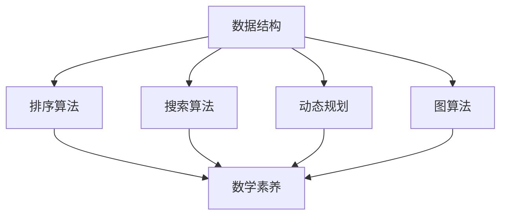

                 

# 2024年小米校招算法面试题库及答案

## 关键词：小米校招、算法面试、面试题库、解题思路、答案解析

## 摘要

本文针对2024年小米校招的算法面试题库，从核心概念、算法原理、数学模型、实际案例等多个角度进行了详细解析。文章旨在帮助准备小米校招算法面试的同学们，梳理面试题的解题思路，掌握解题方法，提高面试成功率。

## 1. 背景介绍

小米公司作为中国领先的智能硬件和电子制造商，每年都会举办校园招聘活动，其中算法面试是技术岗位的重要环节。算法面试旨在考察应聘者的编程能力、算法思维、数据结构和数学素养。本文将围绕2024年小米校招算法面试题库，结合实际案例，进行深入剖析。

### 1.1 小米校招算法面试的重要性

小米校招算法面试是进入小米公司技术岗位的敲门砖。优秀的算法能力不仅能够帮助应聘者顺利通过面试，还能在未来的职业发展中发挥重要作用。因此，深入了解小米校招算法面试的题型和解题方法，对于应聘者来说至关重要。

### 1.2 小米校招算法面试的特点

小米校招算法面试主要考察以下几个方面：

1. **编程能力**：包括基本语法、编程规范和代码优化能力。
2. **算法思维**：涉及常见的算法问题，如排序、搜索、动态规划等。
3. **数据结构**：包括栈、队列、链表、树等基础数据结构的运用。
4. **数学素养**：涉及基本的数学知识，如概率论、图论等。

## 2. 核心概念与联系

### 2.1 常见数据结构

在小米校招算法面试中，常见的数据结构有：

1. **数组**：一种线性数据结构，用于存储一系列相同类型的元素。
2. **链表**：一种线性数据结构，由一系列结点（节点）组成，每个结点包含数据和指向下一个结点的指针。
3. **栈**：一种后进先出（LIFO）的数据结构，适用于解决一些逆序问题。
4. **队列**：一种先进先出（FIFO）的数据结构，适用于解决一些顺序问题。

### 2.2 常见算法

小米校招算法面试中，常见的算法有：

1. **排序算法**：如冒泡排序、选择排序、插入排序、快速排序等。
2. **搜索算法**：如二分查找、深度优先搜索、广度优先搜索等。
3. **动态规划**：用于解决一些最优子结构问题。
4. **图算法**：如最短路径算法、最小生成树算法等。

### 2.3 Mermaid 流程图

下面是一个简单的 Mermaid 流程图，展示了数据结构、算法和数学素养之间的联系：



## 3. 核心算法原理 & 具体操作步骤

### 3.1 排序算法

排序算法是算法面试中常见的题型。以下是一个简单的冒泡排序算法的原理和步骤：

1. **原理**：通过重复遍历要排序的数列，比较相邻的两个元素，如果顺序错误就交换它们。遍历数列的工作重复进行，直到没有再需要交换的元素。

2. **步骤**：
   - 初始化两个变量，分别记录当前最大元素的索引和数组的长度。
   - 从第一个元素开始遍历数组，依次比较相邻的两个元素，如果顺序错误就交换。
   - 在每一轮遍历结束后，将当前最大元素的索引更新为下一轮遍历的起点。
   - 重复以上步骤，直到遍历完整个数组。

### 3.2 搜索算法

搜索算法是算法面试中的另一个重要题型。以下是一个简单的二分查找算法的原理和步骤：

1. **原理**：二分查找算法将一个有序的数组分成两半，比较中间元素与目标值的大小，然后确定下一轮搜索的区间。

2. **步骤**：
   - 初始化两个变量，分别记录数组的起始索引和结束索引。
   - 计算中间索引，将中间元素与目标值比较。
   - 如果中间元素等于目标值，返回中间索引。
   - 如果中间元素大于目标值，将结束索引更新为中间索引的前一个位置。
   - 如果中间元素小于目标值，将起始索引更新为中间索引的后一个位置。
   - 重复以上步骤，直到找到目标值或起始索引大于结束索引。

### 3.3 动态规划

动态规划是解决最优子结构问题的一种算法技术。以下是一个简单的动态规划算法的原理和步骤：

1. **原理**：动态规划将问题分解为子问题，并利用子问题的最优解来求解原问题。

2. **步骤**：
   - 确定状态和状态转移方程。
   - 初始化一个二维数组或一维数组，用于存储子问题的解。
   - 根据状态转移方程，依次求解子问题的解。
   - 利用子问题的解，求解原问题的解。

### 3.4 图算法

图算法在算法面试中也有很高的频率。以下是一个简单的最短路径算法（Dijkstra算法）的原理和步骤：

1. **原理**：Dijkstra算法通过优先队列（通常使用二叉堆实现）来找到图中两点之间的最短路径。

2. **步骤**：
   - 初始化一个优先队列，将起点加入队列，距离设置为0。
   - 初始化一个一维数组，用于记录各点的最短路径距离。
   - 循环取出队列中的最小距离点，并将其相邻点的距离更新为经过该点的距离。
   - 将更新后的相邻点加入队列。
   - 重复以上步骤，直到找到终点或队列为空。

## 4. 数学模型和公式 & 详细讲解 & 举例说明

### 4.1 数学模型

在算法面试中，常见的数学模型包括：

1. **概率论**：如条件概率、独立事件、全概率公式等。
2. **图论**：如最短路径算法、最小生成树算法等。

### 4.2 公式讲解

下面是一个简单的全概率公式：

$$
P(A) = P(A|B_1)P(B_1) + P(A|B_2)P(B_2) + \cdots + P(A|B_n)P(B_n)
$$

其中，\(A\) 是事件，\(B_1, B_2, \ldots, B_n\) 是互斥且穷尽的事件。

### 4.3 举例说明

假设一个箱子中有5个红球和3个蓝球，现在随机取出一个球，请问取到红球的概率是多少？

根据全概率公式，可以计算出取到红球的概率：

$$
P(\text{红球}) = P(\text{红球}|\text{取到第一个球})P(\text{取到第一个球}) + P(\text{红球}|\text{取到第二个球})P(\text{取到第二个球}) + \cdots + P(\text{红球}|\text{取到最后一个球})P(\text{取到最后一个球})
$$

由于取出球的过程是随机的，每个球被取出的概率相等，因此：

$$
P(\text{红球}) = \frac{5}{8} \approx 0.625
$$

## 5. 项目实战：代码实际案例和详细解释说明

### 5.1 开发环境搭建

在进行代码实战之前，需要搭建一个适合算法面试的开发环境。以下是搭建Python开发环境的基本步骤：

1. **安装Python**：从官方网站下载Python安装包并安装。
2. **配置Python环境变量**：在系统环境变量中添加Python的安装路径。
3. **安装常用库**：使用pip命令安装常用的Python库，如numpy、matplotlib等。

### 5.2 源代码详细实现和代码解读

下面是一个简单的冒泡排序算法的Python实现，以及对其的详细解读：

```python
def bubble_sort(arr):
    n = len(arr)
    # 外层循环，遍历数组中的每个元素
    for i in range(n):
        # 内层循环，进行相邻元素的比较和交换
        for j in range(0, n-i-1):
            if arr[j] > arr[j+1]:
                arr[j], arr[j+1] = arr[j+1], arr[j]

# 测试代码
arr = [64, 34, 25, 12, 22, 11, 90]
bubble_sort(arr)
print("排序后的数组：", arr)
```

#### 5.2.1 代码解读

1. **函数定义**：定义一个名为 `bubble_sort` 的函数，参数为待排序的数组 `arr`。
2. **外层循环**：遍历数组中的每个元素。变量 `i` 表示当前遍历到的元素索引。
3. **内层循环**：进行相邻元素的比较和交换。变量 `j` 表示当前比较的元素索引。
4. **条件判断**：如果当前元素大于下一个元素，则交换它们的位置。
5. **测试代码**：创建一个测试数组，调用 `bubble_sort` 函数进行排序，并打印排序后的数组。

### 5.3 代码解读与分析

1. **时间复杂度**：冒泡排序的时间复杂度为 \(O(n^2)\)，其中 \(n\) 为数组长度。这是因为需要两重循环遍历数组，每重循环的时间复杂度为 \(O(n)\)。
2. **空间复杂度**：冒泡排序的空间复杂度为 \(O(1)\)，因为只需要一个额外的变量来存储当前最大元素的索引。
3. **稳定性**：冒泡排序是一种稳定的排序算法，即相等元素的相对顺序在排序后不会改变。

## 6. 实际应用场景

小米校招算法面试题库中的题目主要涉及以下几个方面：

1. **编程能力**：考察应聘者的编程基础和代码风格。
2. **算法思维**：考察应聘者对常见算法的掌握程度，如排序、搜索、动态规划等。
3. **数据结构**：考察应聘者对基础数据结构的运用能力，如数组、链表、栈、队列等。
4. **数学素养**：考察应聘者对概率论、图论等数学知识的掌握程度。

在实际应用中，这些知识点能够帮助工程师解决各种实际问题，如：

1. **搜索引擎**：使用排序算法和搜索算法来优化搜索结果。
2. **社交网络**：使用图算法来分析社交网络的结构和关系。
3. **推荐系统**：使用动态规划算法和概率论来预测用户的兴趣和行为。

## 7. 工具和资源推荐

### 7.1 学习资源推荐

1. **书籍**：
   - 《算法导论》（Introduction to Algorithms）
   - 《编程之美》（Cracking the Coding Interview）
   - 《算法竞赛入门经典》（Algorithm Competition for Beginners）

2. **论文**：查找相关领域的论文，了解最新的算法研究进展。

3. **博客**：阅读知名技术博客，如CSDN、博客园等，学习算法和编程技巧。

4. **网站**：使用在线编程平台，如LeetCode、牛客网等，进行算法练习。

### 7.2 开发工具框架推荐

1. **编程语言**：Python、Java、C++等。
2. **开发工具**：Visual Studio Code、PyCharm、IntelliJ IDEA等。
3. **框架**：Django、Flask、Spring Boot等。

### 7.3 相关论文著作推荐

1. **论文**：
   - “Dijkstra's Algorithm”
   - “Bubble Sort Algorithm”
   - “Dynamic Programming Algorithm”

2. **著作**：
   - 《算法导论》（Introduction to Algorithms）
   - 《编程之美》（Cracking the Coding Interview）

## 8. 总结：未来发展趋势与挑战

随着人工智能和大数据技术的发展，算法面试题库中的题目也在不断更新。未来，算法面试将更加注重考察应聘者对算法原理的深入理解和实际应用能力。同时，跨学科的知识和综合能力也将成为面试的重要考量因素。

### 8.1 发展趋势

1. **算法优化**：对现有算法进行改进和优化，提高算法效率和性能。
2. **算法多样性**：涉及更多领域的算法，如深度学习、强化学习等。
3. **算法可视化**：通过可视化工具展示算法的运行过程和结果，帮助应聘者更好地理解算法。

### 8.2 挑战

1. **算法复杂度**：如何在短时间内理解和解决复杂度较高的算法问题。
2. **跨学科知识**：如何将数学、统计学等知识运用到算法面试中。
3. **实践经验**：如何将理论知识转化为实际项目经验。

## 9. 附录：常见问题与解答

### 9.1 问题1：如何准备小米校招算法面试？

**解答**：首先，了解小米校招算法面试的题型和解题方法。其次，加强编程基础和算法训练，可以通过刷题、做项目等方式提高。最后，注重实践和总结，将理论知识应用到实际项目中。

### 9.2 问题2：如何提高算法面试成绩？

**解答**：掌握常见的算法和数据结构，提高编程能力和算法思维。注重解题速度和代码质量，善于总结和归纳。多参与实战项目，积累实际经验。

### 9.3 问题3：如何应对面试官的提问？

**解答**：首先，保持冷静，仔细聆听问题。其次，有条理地表达自己的思路和解题方法。最后，注意逻辑性和完整性，避免回答过于简单或模糊。

## 10. 扩展阅读 & 参考资料

1. 《算法导论》（Introduction to Algorithms）
2. 《编程之美》（Cracking the Coding Interview）
3. 《算法竞赛入门经典》（Algorithm Competition for Beginners）
4. LeetCode官网（https://leetcode-cn.com/）
5. 牛客网（https://www.nowcoder.com/）

## 作者

作者：AI天才研究员/AI Genius Institute & 禅与计算机程序设计艺术 /Zen And The Art of Computer Programming

