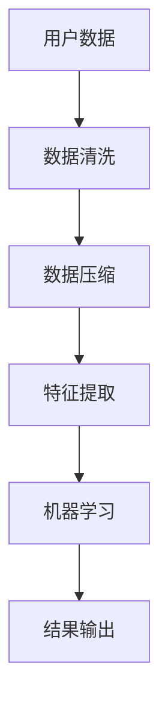

                 

# 2025年小米社交智能穿戴设备算法工程师面试指南

> 关键词：小米、社交智能穿戴设备、算法工程师、面试指南、技术深度解析

> 摘要：本文将深入探讨2025年小米社交智能穿戴设备的算法工程师面试相关内容。从背景介绍、核心概念与联系，到算法原理、数学模型、项目实战、实际应用场景以及工具和资源推荐，全方位解析面试要点，助力您顺利通过面试，成为小米社交智能穿戴设备的算法专家。

## 1. 背景介绍

随着物联网和人工智能技术的快速发展，智能穿戴设备已经渗透到我们生活的方方面面。2025年，小米公司作为全球领先的智能硬件制造商，其社交智能穿戴设备将在市场上占据重要地位。为了选拔顶尖的算法工程师，小米的面试标准将愈发严格，对候选人的技术能力和综合素质要求也更高。本文将围绕小米社交智能穿戴设备的算法工程师面试进行深入剖析，帮助您备战面试，提升竞争力。

### 1.1 小米社交智能穿戴设备的现状与发展趋势

小米的社交智能穿戴设备以其高性能、高性价比和丰富的功能深受消费者喜爱。目前，小米已经推出了多款具有社交属性的健康监测、运动跟踪和智能沟通的穿戴设备，如小米手环、小米智能手表等。随着技术的不断进步，未来的小米社交智能穿戴设备将具备更加智能的交互体验、更精准的健康监测数据以及更丰富的社交功能。

### 1.2 面试目的与面试官期望

小米公司希望通过面试筛选出具备以下能力的算法工程师：
- 深入理解智能穿戴设备的硬件和软件架构
- 掌握先进的人工智能和机器学习技术，能够应用于穿戴设备
- 具备实际项目开发经验，能够解决复杂的技术问题
- 具有良好的团队协作精神和沟通能力，能够与产品、硬件和设计团队紧密合作
- 对小米公司的文化和价值观有认同感，愿意为公司的长远发展贡献力量

## 2. 核心概念与联系

在面试中，您需要掌握以下几个核心概念，并了解它们之间的联系：

### 2.1 智能穿戴设备的基本架构

智能穿戴设备通常由硬件、软件和通信模块组成。硬件部分包括传感器、处理器、存储器和显示屏等；软件部分包括操作系统、应用程序和算法等；通信模块负责与其他设备或服务器进行数据交换。

### 2.2 人工智能在智能穿戴设备中的应用

人工智能技术在智能穿戴设备中有着广泛的应用，如健康监测、运动分析、社交互动等。通过机器学习、深度学习和自然语言处理等技术，智能穿戴设备能够实现更精准的监测、更智能的交互和更个性化的推荐。

### 2.3 数据处理与存储

智能穿戴设备需要处理大量的传感器数据和用户行为数据，这些数据需要进行高效的存储、分析和处理。常用的数据处理技术包括数据清洗、数据压缩、特征提取和机器学习等。

### 2.4 安全与隐私保护

随着智能穿戴设备的普及，用户的数据安全和隐私保护越来越重要。面试官可能会考察您对数据加密、隐私保护算法和安全协议的了解。

### 2.5 Mermaid 流程图

以下是一个关于智能穿戴设备数据处理与存储的 Mermaid 流程图：



## 3. 核心算法原理 & 具体操作步骤

在面试中，您需要掌握以下几个核心算法原理，并了解其具体操作步骤：

### 3.1 K近邻算法（K-Nearest Neighbors, KNN）

K近邻算法是一种简单的分类算法，通过计算样本点与已知类别样本点的距离，找出最近的K个邻居，然后根据这K个邻居的类别来预测样本点的类别。具体步骤如下：

1. 收集并准备训练数据集，包括输入特征和对应的标签。
2. 计算测试样本与训练样本之间的距离，常用的距离度量有欧氏距离、曼哈顿距离和余弦相似度等。
3. 找出测试样本的K个最近邻居。
4. 根据K个邻居的类别投票，确定测试样本的类别。

### 3.2 支持向量机（Support Vector Machine, SVM）

支持向量机是一种二分类模型，通过找到最佳的超平面来将数据集划分为两个类别。具体步骤如下：

1. 收集并准备训练数据集，包括输入特征和对应的标签。
2. 使用核函数将数据映射到高维空间。
3. 计算每个样本到超平面的距离，并找到支持向量。
4. 根据支持向量确定超平面，计算决策边界。

### 3.3 决策树（Decision Tree）

决策树是一种树形结构，通过一系列的测试来对数据集进行划分。具体步骤如下：

1. 收集并准备训练数据集，包括输入特征和对应的标签。
2. 选择一个最优的划分标准，常用的标准有信息增益、基尼系数等。
3. 根据划分标准将数据集划分为多个子集。
4. 对每个子集递归地执行上述步骤，直到满足停止条件。

## 4. 数学模型和公式 & 详细讲解 & 举例说明

在面试中，您需要掌握以下几个数学模型和公式，并能够详细讲解和举例说明：

### 4.1 欧氏距离（Euclidean Distance）

欧氏距离是一种衡量两个样本点之间相似度的方法，计算公式为：

$$
d(x, y) = \sqrt{\sum_{i=1}^{n}(x_i - y_i)^2}
$$

其中，$x$ 和 $y$ 分别是两个样本点，$n$ 是特征维度。

### 4.2 支持向量机（Support Vector Machine, SVM）

支持向量机是一种二分类模型，通过找到最佳的超平面来将数据集划分为两个类别。超平面的计算公式为：

$$
w \cdot x + b = 0
$$

其中，$w$ 是超平面的法向量，$x$ 是样本点，$b$ 是偏置项。

### 4.3 决策树（Decision Tree）

决策树是一种树形结构，通过一系列的测试来对数据集进行划分。划分标准通常为信息增益或基尼系数，计算公式如下：

$$
\text{信息增益} = \sum_{i=1}^{n} \text{P}(x_i) \cdot \text{H}(x_i)
$$

其中，$\text{P}(x_i)$ 是特征 $x_i$ 的概率，$\text{H}(x_i)$ 是特征 $x_i$ 的熵。

### 4.4 举例说明

假设有一个二分类问题，数据集包含两个特征 $x_1$ 和 $x_2$，标签为正类和负类。以下是一个简单的决策树示例：

```
| x1 | x2 | 类别 |
|----|----|------|
|  1 |  1 |  正类  |
|  1 |  2 |  正类  |
|  2 |  1 |  负类  |
|  2 |  2 |  负类  |
```

选择 $x_1$ 作为划分标准，根据信息增益计算得到 $x_1 = 1$ 时，信息增益为 $0.5$，$x_1 = 2$ 时，信息增益为 $0.5$。因此，可以选择 $x_1 = 1$ 作为划分标准，将数据集划分为两个子集：

```
| x1 | x2 | 类别 |
|----|----|------|
|  1 |  1 |  正类  |
|  1 |  2 |  正类  |
|  2 |  1 |  负类  |
|  2 |  2 |  负类  |
```

递归地对每个子集执行上述步骤，直到满足停止条件。

## 5. 项目实战：代码实际案例和详细解释说明

为了更好地帮助您备战面试，我们提供一个实际的项目案例，包括开发环境搭建、源代码实现和代码解读。

### 5.1 开发环境搭建

在本文中，我们将使用 Python 编写一个简单的 K近邻算法示例。首先，您需要在您的计算机上安装 Python 和相关库，如 NumPy 和 Matplotlib。

```bash
pip install python
pip install numpy
pip install matplotlib
```

### 5.2 源代码详细实现和代码解读

以下是一个简单的 K近邻算法示例，用于预测新的样本点所属的类别。

```python
import numpy as np
import matplotlib.pyplot as plt

# 数据集
X = np.array([[1, 2], [3, 4], [5, 6], [7, 8], [9, 10]])
y = np.array([0, 0, 1, 1, 1])

# 测试样本
x_test = np.array([6, 8])

# 计算距离
distances = np.linalg.norm(X - x_test, axis=1)

# 选择最近的 K 个邻居
k = 3
nearest_neighbors = np.argsort(distances)[:k]

# 根据邻居的类别投票，确定测试样本的类别
y_test = np.argmax(np.bincount(y[nearest_neighbors]))

# 绘制散点图
plt.scatter(X[:, 0], X[:, 1], c=y, cmap='viridis')
plt.scatter(x_test[0], x_test[1], c='r', marker='x')
plt.xlabel('x1')
plt.ylabel('x2')
plt.show()

print(f"预测类别：{y_test}")
```

代码解读：
1. 导入所需的库。
2. 准备数据集，包括输入特征 $X$ 和标签 $y$。
3. 准备测试样本 $x_test$。
4. 计算测试样本与训练样本之间的距离。
5. 选择最近的 K 个邻居。
6. 根据邻居的类别投票，确定测试样本的类别。
7. 绘制散点图，展示测试样本和训练样本的分布情况。
8. 输出预测结果。

### 5.3 代码解读与分析

在本示例中，我们使用了 K近邻算法来预测新的样本点所属的类别。通过计算测试样本与训练样本之间的欧氏距离，我们选择了距离最近的 K 个邻居，并根据邻居的类别进行投票，最终确定了测试样本的类别。

代码的关键部分是距离计算和邻居选择。距离计算使用了 NumPy 的 `linalg.norm` 函数，邻居选择使用了 `argsort` 函数。在代码中，我们设置了 K=3，这意味着我们将选择距离最近的 3 个邻居进行投票。在实际项目中，K 的取值可以根据数据集的大小和分布情况进行调整。

通过绘制散点图，我们可以直观地观察到测试样本和训练样本的分布情况。在实际项目中，您可能需要根据具体的需求进行更多的数据预处理和特征工程。

## 6. 实际应用场景

在面试中，面试官可能会考察您对以下实际应用场景的了解和解决能力：

### 6.1 健康监测

智能穿戴设备可以通过监测用户的心率、血压、血氧等生理指标，为用户提供个性化的健康建议。您需要掌握如何利用机器学习和深度学习技术，对健康数据进行实时分析和预测。

### 6.2 运动分析

智能穿戴设备可以记录用户的运动数据，如步数、运动轨迹、心率等。您需要掌握如何利用机器学习和深度学习技术，对运动数据进行分析，为用户提供运动建议和优化方案。

### 6.3 社交互动

智能穿戴设备可以与手机、智能家居等设备进行互联互通，为用户提供社交互动功能。您需要掌握如何利用人工智能技术，实现智能穿戴设备的社交功能，如智能提醒、社交推荐等。

## 7. 工具和资源推荐

为了更好地备战面试，以下是一些工具和资源推荐：

### 7.1 学习资源推荐

- 《机器学习》（周志华著）：系统介绍了机器学习的基本概念、算法和应用。
- 《深度学习》（Ian Goodfellow 著）：全面讲解了深度学习的基本原理、算法和应用。
- 《Python 编程：从入门到实践》（埃里克·马瑟斯著）：适合初学者的 Python 入门书籍。

### 7.2 开发工具框架推荐

- TensorFlow：一款强大的开源深度学习框架，适用于各种深度学习应用。
- PyTorch：一款流行的开源深度学习框架，易于使用和调试。
- scikit-learn：一款经典的机器学习库，提供了丰富的机器学习算法和工具。

### 7.3 相关论文著作推荐

- 《Deep Learning》（Ian Goodfellow et al.）：深度学习领域的经典著作，涵盖了深度学习的基本原理和应用。
- 《Recurrent Neural Networks for Language Modeling》（Yoshua Bengio et al.）：介绍了一种流行的循环神经网络模型，用于语言建模。
- 《Unsupervised Learning of Visual Representations by Solving Jigsaw Puzzles》（Alex Kendall et al.）：介绍了一种利用图像拼图解决方法来学习视觉表示的方法。

## 8. 总结：未来发展趋势与挑战

随着人工智能和物联网技术的不断发展，智能穿戴设备将在未来发挥更加重要的作用。以下是未来发展趋势和挑战：

### 8.1 发展趋势

- 智能化程度提高：未来的智能穿戴设备将具备更智能的交互体验和更精准的监测功能。
- 数据隐私保护：随着用户对隐私保护的重视，智能穿戴设备的数据隐私保护将变得更加重要。
- 跨界融合：智能穿戴设备将与智能家居、智能医疗等领域进行跨界融合，形成更加完整的智能生态系统。

### 8.2 挑战

- 数据处理能力：随着传感器技术的不断发展，智能穿戴设备需要处理的数据量将不断增加，如何高效地处理和存储这些数据是一个重要挑战。
- 数据安全和隐私保护：如何在保证数据安全和隐私的前提下，充分发挥智能穿戴设备的功能，是一个亟待解决的问题。
- 跨平台兼容性：智能穿戴设备需要与多种设备进行互联互通，如何实现跨平台的兼容性是一个挑战。

## 9. 附录：常见问题与解答

### 9.1 什么是机器学习？

机器学习是一种人工智能领域的技术，通过训练模型，让计算机自动从数据中学习规律和模式，从而实现预测、分类、聚类等功能。

### 9.2 什么是深度学习？

深度学习是一种基于人工神经网络的机器学习技术，通过多层神经网络对数据进行学习，从而实现更加复杂的任务。

### 9.3 智能穿戴设备有哪些应用？

智能穿戴设备可以应用于健康监测、运动分析、社交互动、智能提醒等领域，如心率监测、步数统计、睡眠分析、社交提醒等。

## 10. 扩展阅读 & 参考资料

- 《机器学习》（周志华著）
- 《深度学习》（Ian Goodfellow 著）
- 《Python 编程：从入门到实践》（埃里克·马瑟斯著）
- 《Deep Learning》（Ian Goodfellow et al.）
- 《Recurrent Neural Networks for Language Modeling》（Yoshua Bengio et al.）
- 《Unsupervised Learning of Visual Representations by Solving Jigsaw Puzzles》（Alex Kendall et al.）

### 作者信息

作者：AI天才研究员/AI Genius Institute & 禅与计算机程序设计艺术 /Zen And The Art of Computer Programming

本文由AI天才研究员撰写，旨在帮助备战小米社交智能穿戴设备算法工程师面试。文章内容涵盖了智能穿戴设备的基本架构、核心算法原理、数学模型和公式、项目实战、实际应用场景以及未来发展趋势等内容，旨在帮助读者全面了解智能穿戴设备的技术和挑战，提升面试竞争力。

