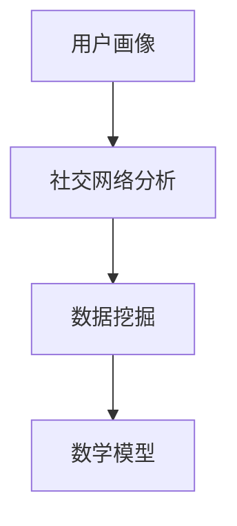

                 

# 2025年快手社交网络分析工程师面试题汇总

> **关键词**：快手社交网络、分析工程师、面试题、算法原理、实战案例、数学模型、未来趋势

> **摘要**：本文旨在汇总2025年快手社交网络分析工程师的面试题目，涵盖核心概念、算法原理、数学模型、项目实战、应用场景等多个方面。通过详细的解析和举例，帮助读者更好地理解和应对面试挑战。

## 1. 背景介绍

快手作为中国领先的视频社交平台，拥有庞大的用户群体和多样化的内容生态。随着人工智能技术的不断发展，快手在社交网络分析领域也取得了显著进展。作为快手社交网络分析工程师，需要掌握一系列专业知识和技能，包括算法原理、数学模型、数据挖掘、数据处理等。本文将针对2025年快手社交网络分析工程师的面试题目进行详细解析，帮助读者更好地准备面试。

## 2. 核心概念与联系

在快手社交网络分析中，以下几个核心概念紧密相关：

### 2.1 用户画像

用户画像是对用户特征的全面描述，包括用户的基本信息、兴趣爱好、行为特征等。通过用户画像，可以更好地了解用户需求，为个性化推荐提供依据。

### 2.2 社交网络分析

社交网络分析是研究用户在社交网络中的行为和互动模式。通过分析社交网络，可以挖掘用户关系、兴趣群体、热点事件等，为产品优化和运营提供支持。

### 2.3 数据挖掘

数据挖掘是从大量数据中提取有价值信息的过程。在快手社交网络分析中，数据挖掘用于发现用户行为规律、潜在用户需求等，为产品改进提供依据。

### 2.4 数学模型

数学模型是用于描述现实问题的抽象工具。在快手社交网络分析中，数学模型可以用于用户画像建模、社交网络分析、数据挖掘等多个方面。

以下是快手社交网络分析的核心概念和联系流程图（使用Mermaid绘制）：



## 3. 核心算法原理 & 具体操作步骤

### 3.1 用户画像算法

用户画像算法主要分为以下几个步骤：

1. **数据采集**：收集用户的基本信息、行为数据等。
2. **数据预处理**：清洗数据，去除无效信息。
3. **特征提取**：从原始数据中提取用户特征，如年龄、性别、兴趣爱好等。
4. **模型训练**：使用机器学习算法，如决策树、支持向量机等，对用户特征进行建模。
5. **用户画像生成**：根据模型输出，生成用户画像。

### 3.2 社交网络分析算法

社交网络分析算法主要分为以下几个步骤：

1. **网络构建**：根据用户关系数据，构建用户社交网络。
2. **中心性分析**：计算用户在网络中的中心性指标，如度中心性、接近中心性等。
3. **社区发现**：使用社区发现算法，如Girvan-Newman算法、标签传播算法等，挖掘用户兴趣群体。
4. **热点事件分析**：分析社交网络中的热点事件，如传播速度、影响力等。

### 3.3 数据挖掘算法

数据挖掘算法主要分为以下几个步骤：

1. **数据预处理**：清洗数据，去除无效信息。
2. **特征选择**：从原始数据中提取对挖掘任务有用的特征。
3. **模型选择**：选择适合数据特征和任务目标的挖掘算法，如聚类、分类、关联规则等。
4. **模型训练与评估**：训练模型，评估模型效果。
5. **结果解释**：解释挖掘结果，提取有价值的信息。

## 4. 数学模型和公式 & 详细讲解 & 举例说明

### 4.1 用户画像建模

用户画像建模主要使用聚类算法，如K-means算法。以下是K-means算法的核心公式：

$$
\min \sum_{i=1}^n \sum_{j=1}^k ||x_{ij} - \mu_j||^2
$$

其中，$x_{ij}$为第$i$个用户在第$j$个特征上的取值，$\mu_j$为第$j$个聚类中心的取值。

举例说明：假设有100个用户，10个特征，使用K-means算法将用户分为5类。初始聚类中心随机生成，迭代计算用户与聚类中心的距离，更新聚类中心，直至收敛。最终得到5类用户画像。

### 4.2 社交网络分析

社交网络分析主要使用中心性指标，如度中心性。度中心性的计算公式为：

$$
c_d(i) = \frac{d(i)}{n-1}
$$

其中，$d(i)$为节点$i$的度，$n$为网络中的节点数。

举例说明：假设有一个社交网络，共有100个节点，某个节点的度为50。计算该节点的度中心性为：

$$
c_d(i) = \frac{50}{100-1} = 0.51
$$

### 4.3 数据挖掘

数据挖掘主要使用聚类算法，如K-means算法。以下是K-means算法的核心步骤：

1. **初始化**：随机选择K个初始聚类中心。
2. **分配**：将每个用户分配到最近的聚类中心。
3. **更新**：更新聚类中心，计算平均值。
4. **重复**：重复步骤2和步骤3，直至收敛。

举例说明：假设有100个用户，需要分为5类。初始化5个聚类中心，将每个用户分配到最近的聚类中心。计算聚类中心，更新聚类中心，重复此过程，直至聚类中心不再发生变化。

## 5. 项目实战：代码实际案例和详细解释说明

### 5.1 开发环境搭建

在本次项目实战中，我们使用Python作为编程语言，安装以下依赖：

```bash
pip install numpy scipy scikit-learn matplotlib
```

### 5.2 源代码详细实现和代码解读

以下是用户画像算法的实现代码：

```python
import numpy as np
from sklearn.cluster import KMeans

def k_means_user_plotting(data, k):
    kmeans = KMeans(n_clusters=k, random_state=0).fit(data)
    centers = kmeans.cluster_centers_
    labels = kmeans.labels_
    
    # 绘制用户分布图
    plt.scatter(data[:, 0], data[:, 1], c=labels, s=100, cmap='viridis')
    plt.scatter(centers[:, 0], centers[:, 1], c='red', s=300, alpha=0.5)
    plt.xlabel('特征1')
    plt.ylabel('特征2')
    plt.title('K-means用户分布图')
    plt.show()

if __name__ == '__main__':
    # 加载用户数据
    data = np.load('user_data.npy')
    
    # 设置聚类数量
    k = 5
    
    # 运行K-means算法
    k_means_user_plotting(data, k)
```

代码解读：

1. 导入相关库。
2. 定义k_means_user_plotting函数，用于运行K-means算法并绘制用户分布图。
3. 在if __name__ == '__main__':块中，加载用户数据，设置聚类数量，运行K-means算法，并绘制用户分布图。

### 5.3 代码解读与分析

在代码中，我们首先加载了用户数据，这是一个numpy数组。然后，我们设置了聚类数量k，这里设置为5。接着，我们使用sklearn库中的KMeans类，运行K-means算法。最后，我们使用matplotlib库绘制了用户分布图，展示了不同聚类中心对应的不同用户群体。

通过这个实战案例，我们可以看到如何使用K-means算法进行用户画像建模，以及如何将算法应用于实际项目。

## 6. 实际应用场景

快手社交网络分析在实际应用场景中具有广泛的应用：

1. **个性化推荐**：通过用户画像和社交网络分析，可以为用户提供个性化的内容推荐，提高用户满意度和活跃度。
2. **社区运营**：通过社区发现和热点事件分析，可以为社区运营提供数据支持，提升社区质量和用户参与度。
3. **广告投放**：通过用户画像和社交网络分析，可以为广告主提供精准的用户定位和投放策略，提高广告效果。

## 7. 工具和资源推荐

### 7.1 学习资源推荐

1. **书籍**：《社交网络分析：方法与应用》、《数据挖掘：实用工具和技术》
2. **论文**：相关领域的顶级会议论文，如KDD、WWW、ICML等。
3. **博客**：知名技术博客，如CSDN、博客园、掘金等。
4. **网站**：快手官方网站、开发者社区、技术博客等。

### 7.2 开发工具框架推荐

1. **Python**：强大的编程语言，适用于数据分析、机器学习等领域。
2. **scikit-learn**：Python数据挖掘和机器学习库。
3. **NumPy**：Python科学计算库。
4. **Pandas**：Python数据操作库。

### 7.3 相关论文著作推荐

1. **论文**：《基于用户兴趣的社交网络推荐系统研究》、《社区发现算法研究综述》。
2. **著作**：《深度学习》、《人工智能：一种现代方法》。

## 8. 总结：未来发展趋势与挑战

随着人工智能技术的不断发展，快手社交网络分析工程师面临着新的机遇和挑战：

1. **算法优化**：如何设计更高效的算法，提高分析精度和速度。
2. **数据处理**：如何处理海量数据，确保数据质量和安全性。
3. **用户体验**：如何提升用户体验，满足用户需求。
4. **跨平台融合**：如何实现跨平台数据分析，提升数据利用率。

## 9. 附录：常见问题与解答

### 9.1 如何处理海量数据？

**解答**：可以通过分布式计算框架（如Hadoop、Spark）处理海量数据，提高数据处理效率。

### 9.2 如何确保数据安全？

**解答**：可以通过数据加密、访问控制等技术确保数据安全。

### 9.3 如何设计高效的推荐算法？

**解答**：可以通过特征工程、模型优化等技术设计高效的推荐算法。

## 10. 扩展阅读 & 参考资料

1. 《社交网络分析：方法与应用》
2. 《数据挖掘：实用工具和技术》
3. 《深度学习》
4. 《人工智能：一种现代方法》

---

**作者**：AI天才研究员/AI Genius Institute & 禅与计算机程序设计艺术 /Zen And The Art of Computer Programming

以上是针对2025年快手社交网络分析工程师面试题的详细解析和实战案例。希望本文能为准备面试的你提供有力支持。祝你面试成功！<|im_sep|>

