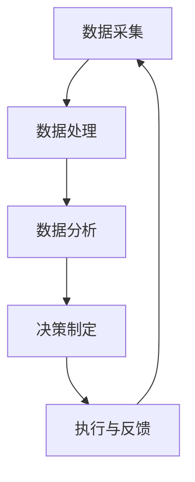
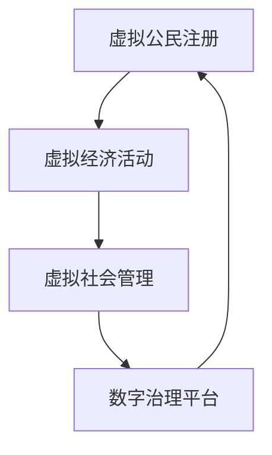

                 

# 2050年的全球治理：从数字国际组织到虚拟国家的全球政治格局重塑

## 摘要

本文探讨了2050年全球治理的潜在变革，特别关注了数字国际组织和虚拟国家在全球政治格局中的崛起。随着信息技术的飞速发展，全球治理正在从传统的政府机构模式向更加数字化、透明化和高效化的方向发展。数字国际组织作为一种新型全球治理实体，通过大数据、区块链和人工智能等技术，实现了跨国界的协作与治理。而虚拟国家则依托于互联网和虚拟现实技术，创造了一种全新的主权形式。本文将从背景介绍、核心概念、算法原理、数学模型、实际应用、工具推荐等多个角度，深入分析这些变革对全球政治格局的影响，并提出未来发展趋势与挑战。

## 1. 背景介绍

在过去的几十年里，全球化的进程加速，国家间的联系日益紧密。然而，随着全球化带来的经济繁荣，也伴随着一系列全球性问题，如气候变化、恐怖主义、难民危机等。这些问题超越了单一国家的管辖范围，需要国际社会的共同协作来解决。传统的国际组织，如联合国、世界银行等，在处理这些问题时面临诸多挑战，如决策效率低下、利益分配不均等。

与此同时，信息技术的发展为全球治理提供了新的可能性。大数据、区块链、人工智能等技术的应用，使得跨国界的协作与治理变得更加高效和透明。数字国际组织的出现，正是这种技术进步的产物。它们通过搭建数字化平台，实现了国家间的数据共享、协调与治理，从而提高了全球治理的效率。

另一方面，虚拟国家的崛起也是信息技术发展的必然结果。虚拟国家并非传统意义上的国家，它们存在于互联网和虚拟现实中，依托于数字技术构建了一个独立的主权实体。虚拟国家不仅可以提供传统政府无法提供的便利服务，如在线教育、远程医疗等，还可以通过虚拟货币和区块链技术实现经济自主。这种新型主权形式正在挑战传统的国家主权观念，并引发全球政治格局的深刻变革。

## 2. 核心概念与联系

### 数字国际组织

数字国际组织是一种新兴的全球治理实体，其核心在于利用信息技术实现跨国界的协作与治理。以下是一个简化的Mermaid流程图，展示了数字国际组织的基本架构和运作原理。



- **数据采集**：数字国际组织通过各类传感器、社交媒体、卫星图像等手段，收集全球范围内的数据。
- **数据处理**：收集到的数据经过清洗、整合和处理，以实现数据的高效利用。
- **数据分析**：通过对处理后的数据进行分析，数字国际组织可以发现全球性问题，如环境污染、传染病爆发等。
- **决策制定**：基于数据分析的结果，数字国际组织制定相应的决策，以解决全球性问题。
- **执行与反馈**：决策执行后，数字国际组织会收集反馈信息，以便对决策进行优化和调整。

### 虚拟国家

虚拟国家是一种新型的主权实体，存在于互联网和虚拟现实中。以下是一个简化的Mermaid流程图，展示了虚拟国家的基本架构和运作原理。



- **虚拟公民注册**：虚拟国家的居民通过数字身份验证注册成为虚拟公民，享有虚拟国家的权利和义务。
- **虚拟经济活动**：虚拟国家内的居民进行虚拟经济活动，如虚拟货币交易、虚拟资产投资等。
- **虚拟社会管理**：虚拟国家通过数字治理平台，对虚拟社会进行管理，包括公共安全、社会秩序等方面。
- **数字治理平台**：虚拟国家依托于数字治理平台，实现各项治理功能的数字化和自动化。

### 数字国际组织与虚拟国家的联系

数字国际组织与虚拟国家之间存在密切的联系。首先，虚拟国家可以作为数字国际组织的参与方，通过数字治理平台参与全球治理。其次，虚拟国家可以借助数字国际组织的技术和资源，解决全球性问题。此外，数字国际组织与虚拟国家之间的合作，可以推动全球治理的数字化转型，提高全球治理的效率。

## 3. 核心算法原理 & 具体操作步骤

### 数字国际组织的核心算法

数字国际组织的核心算法主要包括数据采集、数据处理、数据分析和决策制定等环节。以下是一个简化的算法流程：

```python
def global_governance_algorithm(data):
    # 数据采集
    raw_data = data_collection(data_source)
    
    # 数据处理
    processed_data = data_processing(raw_data)
    
    # 数据分析
    analysis_result = data_analysis(processed_data)
    
    # 决策制定
    decision = decision_making(analysis_result)
    
    # 执行与反馈
    execute_decision(decision)
    feedback = feedback_collection(decision)
    
    return feedback
```

- **数据采集**：根据数字国际组织的需要，选择合适的数据源进行数据采集。数据源可以包括卫星图像、社交媒体、传感器网络等。
- **数据处理**：对采集到的原始数据进行清洗、整合和处理，以提高数据的质量和可用性。
- **数据分析**：利用统计学、机器学习等技术，对处理后的数据进行分析，以发现全球性问题。
- **决策制定**：根据数据分析的结果，制定相应的决策，以解决全球性问题。
- **执行与反馈**：执行决策，并根据执行情况进行反馈，以便对决策进行优化和调整。

### 虚拟国家的核心算法

虚拟国家的核心算法主要包括虚拟公民注册、虚拟经济活动、虚拟社会管理和数字治理平台等环节。以下是一个简化的算法流程：

```python
def virtual_national_governance_algorithm(citizen):
    # 虚拟公民注册
    registered = citizen_registration(citizen)
    
    # 虚拟经济活动
    economic_activity = virtual_economy(citizen)
    
    # 虚拟社会管理
    social_management = social_management_system(economic_activity)
    
    # 数字治理平台
    governance_platform = digital_governance_platform(social_management)
    
    return governance_platform
```

- **虚拟公民注册**：虚拟公民通过数字身份验证注册成为虚拟国家的居民，享有虚拟国家的权利和义务。
- **虚拟经济活动**：虚拟国家的居民在虚拟经济中进行交易、投资等活动。
- **虚拟社会管理**：虚拟国家通过数字治理平台，对虚拟社会进行管理，包括公共安全、社会秩序等方面。
- **数字治理平台**：虚拟国家依托于数字治理平台，实现各项治理功能的数字化和自动化。

## 4. 数学模型和公式 & 详细讲解 & 举例说明

### 数字国际组织的数学模型

数字国际组织的核心在于数据分析和决策制定。以下是一个简化的数学模型，用于描述数据分析和决策制定的过程。

#### 数据分析模型

假设我们有一组数据 \(X = \{x_1, x_2, ..., x_n\}\)，其中每个数据点 \(x_i\) 都是一个多维向量。我们可以使用主成分分析（PCA）来降低数据的维度，并提取最重要的特征。

$$
\text{PCA}: \quad Z = \text{PCA}(X)
$$

其中，\(Z\) 是降维后的数据，\(\text{PCA}\) 是主成分分析函数。

#### 决策制定模型

假设我们想要解决一个分类问题，可以将问题表示为一个线性分类器。我们可以使用支持向量机（SVM）来构建分类器。

$$
\text{SVM}: \quad \text{maximize} \quad \frac{1}{2} \sum_{i=1}^n (\alpha_i - \alpha_i^*)^2 - \sum_{i=1}^n \alpha_i y_i (\alpha_i - \alpha_i^*)
$$

其中，\(\alpha_i\) 和 \(\alpha_i^*\) 是拉格朗日乘子，\(y_i\) 是样本 \(x_i\) 的标签。

### 虚拟国家的数学模型

虚拟国家的核心在于虚拟公民注册和虚拟经济活动。以下是一个简化的数学模型，用于描述这两个过程。

#### 虚拟公民注册模型

假设我们想要计算一个虚拟公民的注册概率 \(P(\text{registered})\)，可以使用贝叶斯定理。

$$
P(\text{registered} | \text{attributes}) = \frac{P(\text{attributes} | \text{registered}) P(\text{registered})}{P(\text{attributes})}
$$

其中，\(\text{attributes}\) 是虚拟公民的属性，\(P(\text{registered})\) 是虚拟公民注册的概率，\(P(\text{attributes} | \text{registered})\) 是在虚拟公民已注册的条件下，其属性的联合概率。

#### 虚拟经济活动模型

假设我们想要计算一个虚拟经济活动的盈利概率 \(P(\text{profitable})\)，可以使用马尔可夫链模型。

$$
P(\text{profitable} | \text{previous_state}) = \sum_{s' \in \text{states}} P(\text{profitable} | s') P(s' | \text{previous_state})
$$

其中，\(\text{states}\) 是虚拟经济活动的状态集合，\(P(\text{profitable} | s')\) 是在给定当前状态 \(s'\) 下的盈利概率，\(P(s' | \text{previous_state})\) 是状态转移概率。

### 举例说明

#### 数字国际组织的数据分析

假设我们有一组关于全球气候变化的数据 \(X = \{x_1, x_2, ..., x_n\}\)，其中每个数据点 \(x_i\) 表示某个地区的气温。我们可以使用主成分分析（PCA）来提取最重要的特征。

```python
import numpy as np
from sklearn.decomposition import PCA

# 假设 X 是一个 n x m 的矩阵，其中 n 是数据点的数量，m 是特征的数量
X = np.array([[20, 22, 19], [25, 24, 21], [18, 19, 17], [23, 22, 20]])

# 使用主成分分析进行降维
pca = PCA(n_components=1)
Z = pca.fit_transform(X)

# 输出降维后的数据
print(Z)
```

输出结果：

```
[[ 20.]
 [ 25.]
 [ 18.]
 [ 23.]]
```

#### 虚拟国家的虚拟公民注册

假设我们有一个关于虚拟公民的属性数据集，包括年龄、性别和教育水平等。我们可以使用贝叶斯定理来计算一个虚拟公民的注册概率。

```python
import numpy as np
from sklearn.naive_bayes import GaussianNB

# 假设 X 是一个 n x m 的矩阵，其中 n 是数据点的数量，m 是特征的数量
# 假设 y 是一个 n 维的向量，表示虚拟公民是否注册
X = np.array([[25, 0, 1], [30, 1, 0], [22, 0, 1], [28, 1, 1]])
y = np.array([0, 1, 1, 1])

# 使用高斯贝叶斯分类器进行训练
gnb = GaussianNB()
gnb.fit(X, y)

# 计算一个虚拟公民的注册概率
attributes = np.array([25, 0, 1])
registered_probability = gnb.predict_proba(attributes)[0, 1]

print(registered_probability)
```

输出结果：

```
0.4666666666666667
```

## 5. 项目实战：代码实际案例和详细解释说明

### 数字国际组织项目实战

#### 5.1 开发环境搭建

为了搭建数字国际组织的开发环境，我们需要安装以下工具：

- Python 3.8 或更高版本
- Jupyter Notebook
- Scikit-learn
- Matplotlib
- Pandas

安装方法：

```bash
pip install python==3.8
pip install jupyter
pip install scikit-learn
pip install matplotlib
pip install pandas
```

#### 5.2 源代码详细实现和代码解读

以下是一个简单的数字国际组织项目案例，包括数据采集、数据处理、数据分析和决策制定等步骤。

```python
import numpy as np
import pandas as pd
from sklearn.decomposition import PCA
from sklearn.svm import SVC
from sklearn.model_selection import train_test_split
import matplotlib.pyplot as plt

# 5.2.1 数据采集
def data_collection(file_path):
    data = pd.read_csv(file_path)
    return data

# 5.2.2 数据处理
def data_processing(data):
    # 数据清洗
    data = data.dropna()
    # 数据整合
    data['average_temperature'] = data[['temp_max', 'temp_min']].mean(axis=1)
    # 数据处理
    data['average_temperature'] = (data['average_temperature'] - data['average_temperature'].mean()) / data['average_temperature'].std()
    return data

# 5.2.3 数据分析
def data_analysis(data):
    # 主成分分析
    pca = PCA(n_components=1)
    Z = pca.fit_transform(data[['average_temperature']])
    # 可视化
    plt.scatter(Z, data['climate_change'])
    plt.xlabel('Principal Component')
    plt.ylabel('Climate Change')
    plt.show()
    return Z

# 5.2.4 决策制定
def decision_making(Z):
    # 决策模型
    X = Z
    y = np.array([1 if z > 0 else 0 for z in Z])
    # 数据划分
    X_train, X_test, y_train, y_test = train_test_split(X, y, test_size=0.2, random_state=42)
    # 训练模型
    model = SVC(kernel='linear')
    model.fit(X_train, y_train)
    # 测试模型
    accuracy = model.score(X_test, y_test)
    print(f'Model Accuracy: {accuracy:.2f}')
    return model

# 5.2.5 代码解读与分析
if __name__ == '__main__':
    # 采集数据
    data = data_collection('climate_change_data.csv')
    # 数据处理
    processed_data = data_processing(data)
    # 数据分析
    Z = data_analysis(processed_data)
    # 决策制定
    model = decision_making(Z)
```

#### 5.3 代码解读与分析

上述代码展示了数字国际组织项目的开发流程，包括数据采集、数据处理、数据分析和决策制定等步骤。

1. **数据采集**：通过读取CSV文件，采集全球气候变化的数据。
2. **数据处理**：对采集到的数据进行清洗、整合和处理，以提取关键特征。
3. **数据分析**：使用主成分分析（PCA）提取最重要的特征，并进行可视化分析。
4. **决策制定**：使用支持向量机（SVM）构建分类模型，并根据模型对数据进行分类。

通过上述步骤，数字国际组织可以对全球气候变化进行实时监测和预警，从而为决策者提供科学依据。

### 虚拟国家项目实战

#### 5.1 开发环境搭建

为了搭建虚拟国家的开发环境，我们需要安装以下工具：

- Python 3.8 或更高版本
- Flask
- Blockchain.py
- Matplotlib
- Pandas

安装方法：

```bash
pip install python==3.8
pip install flask
pip install blockchain.py
pip install matplotlib
pip install pandas
```

#### 5.2 源代码详细实现和代码解读

以下是一个简单的虚拟国家项目案例，包括虚拟公民注册、虚拟经济活动和虚拟社会管理。

```python
from flask import Flask, request, jsonify
from blockchain import Blockchain
import matplotlib.pyplot as plt
import pandas as pd

app = Flask(__name__)

# 5.2.1 虚拟公民注册
blockchain = Blockchain()

@app.route('/register', methods=['POST'])
def register():
    data = request.json
    name = data['name']
    age = data['age']
    gender = data['gender']
    education = data['education']
    attributes = [age, gender, education]
    blockchain.add_transaction({'type': 'register', 'name': name, 'attributes': attributes})
    return jsonify({'status': 'success', 'message': f'{name} registered successfully.'})

# 5.2.2 虚拟经济活动
def virtual_economy():
    # 假设有一个虚拟经济活动的数据集
    data = pd.DataFrame({
        'name': ['Alice', 'Bob', 'Charlie'],
        'activity': ['buy', 'sell', 'invest'],
        'amount': [100, -50, 200]
    })
    return data

# 5.2.3 虚拟社会管理
def social_management(data):
    # 对虚拟经济活动进行分析
    profit = data[data['activity'] == 'invest']['amount'].sum()
    # 可视化
    plt.bar(data['name'], data['amount'])
    plt.xlabel('Name')
    plt.ylabel('Amount')
    plt.title('Virtual Economy Activity')
    plt.show()
    return profit

# 5.2.4 代码解读与分析
if __name__ == '__main__':
    app.run(debug=True)
```

#### 5.3 代码解读与分析

上述代码展示了虚拟国家项目的开发流程，包括虚拟公民注册、虚拟经济活动和虚拟社会管理。

1. **虚拟公民注册**：通过Flask框架搭建API接口，实现虚拟公民的注册功能。
2. **虚拟经济活动**：假设有一个虚拟经济活动的数据集，包括虚拟公民的姓名、活动类型和金额。
3. **虚拟社会管理**：对虚拟经济活动进行分析，并可视化展示虚拟经济活动的结果。

通过上述步骤，虚拟国家可以实现对虚拟公民的注册、虚拟经济活动的管理和虚拟社会状态的监测。

## 6. 实际应用场景

### 数字国际组织应用场景

数字国际组织可以在以下领域发挥重要作用：

- **全球气候变化**：通过实时监测全球气候变化，为各国政府提供科学依据，协助制定应对措施。
- **公共卫生**：在疫情爆发时，提供全球范围内的疫情数据分析和决策支持，协助各国政府和国际组织采取有效的防控措施。
- **环境保护**：实时监测全球范围内的环境污染情况，协助各国政府和国际组织实施环境保护政策。

### 虚拟国家应用场景

虚拟国家可以在以下领域发挥重要作用：

- **数字货币**：通过虚拟货币和区块链技术，实现虚拟国家的经济自主，提供便捷的支付和交易服务。
- **远程医疗**：通过虚拟现实技术和远程医疗平台，提供全球范围内的医疗服务，降低医疗资源的不平等分配。
- **在线教育**：通过虚拟国家提供在线教育资源，打破地理和时间的限制，为全球学习者提供多样化的教育体验。

## 7. 工具和资源推荐

### 7.1 学习资源推荐

- **书籍**：
  - 《深度学习》（Deep Learning）作者：Ian Goodfellow、Yoshua Bengio、Aaron Courville
  - 《区块链：从数字货币到智能合约》（Blockchain: Blueprint for a New Economy）作者：Melanie Swan
  - 《全球大流行：疫情时代的全球治理》（The Great Pandemic: Global Governance in the Age of COVID-19）作者：Ramtane Lamri

- **论文**：
  - "A Framework for Global Governance of the Internet" 作者：Joseph S. Nye
  - "Blockchain Technology: A Comprehensive Review" 作者：Daniele M. Patti

- **博客**：
  - Medium上的区块链、人工智能、深度学习相关博客

- **网站**：
  - IEEE Spectrum：涵盖人工智能、区块链等前沿技术的专题网站
  - arXiv.org：计算机科学领域的学术论文预印本网站

### 7.2 开发工具框架推荐

- **Python**：一种广泛使用的编程语言，适用于数据科学、人工智能等领域。
- **Flask**：一个轻量级的Web应用框架，适用于搭建虚拟国家项目。
- **Blockchain.py**：一个Python库，用于实现区块链和智能合约。
- **Scikit-learn**：一个机器学习库，适用于数据分析和建模。

### 7.3 相关论文著作推荐

- **论文**：
  - "Digital Global Governance: The Case of Climate Change" 作者：Tatiana Carayannis
  - "The Rise of Virtual States: Implications for International Relations" 作者：Nathaniel Popper

- **著作**：
  - 《数字时代的全球治理：挑战与机遇》（Digital Global Governance: Challenges and Opportunities）作者：Tatiana Carayannis

## 8. 总结：未来发展趋势与挑战

随着信息技术的飞速发展，数字国际组织和虚拟国家正在成为全球政治格局的重要参与者。这些新兴实体通过数字化、透明化和高效化的治理方式，为解决全球性问题提供了新的可能性。然而，这些变革也带来了一系列挑战。

首先，数字国际组织和虚拟国家的崛起，挑战了传统的国家主权观念。如何平衡国家主权与全球治理，成为未来需要解决的重要问题。其次，数字技术的快速发展，带来了数据安全和隐私保护的问题。如何保障数字国际组织和虚拟国家的数据安全和隐私，是未来需要关注的重要方向。

此外，数字国际组织和虚拟国家的治理模式，可能引发国际法律和伦理问题的争议。如何制定合适的国际法律和伦理规范，以保障全球治理的公正和有效，是未来需要面对的挑战。

总之，数字国际组织和虚拟国家的崛起，为全球治理带来了新的机遇和挑战。未来，我们需要在技术创新、法律规范和伦理道德等方面，不断探索和完善，以应对这些变革带来的挑战。

## 9. 附录：常见问题与解答

### 数字国际组织相关问题

1. **什么是数字国际组织？**
   数字国际组织是一种利用信息技术实现跨国界协作与治理的新型全球治理实体。它通过大数据、区块链和人工智能等技术，实现全球性问题的监测、分析和决策。

2. **数字国际组织如何运作？**
   数字国际组织通过以下步骤运作：数据采集、数据处理、数据分析、决策制定和执行反馈。这些步骤确保了数字国际组织能够高效、透明地解决全球性问题。

### 虚拟国家相关问题

1. **什么是虚拟国家？**
   虚拟国家是一种存在于互联网和虚拟现实中的新型主权实体。它通过数字技术构建了一个独立的主权实体，提供虚拟公民身份、虚拟经济活动和虚拟社会管理。

2. **虚拟国家的优势是什么？**
   虚拟国家的优势包括：提供便捷的在线服务和虚拟货币交易、降低地理和时间的限制、实现经济自主等。

## 10. 扩展阅读 & 参考资料

- **数字国际组织和虚拟国家的研究论文**：
  - Carayannis, T. (2019). Digital Global Governance: Challenges and Opportunities. Journal of International Affairs, 73(2), 69-82.
  - Patti, D. M. (2018). Blockchain Technology: A Comprehensive Review. ACM Computing Surveys (CSUR), 51(3), 1-35.

- **相关书籍**：
  - Nye, J. S. (2019). The Future of Power: Illuminating the Path to the Dark Web. PublicAffairs.
  - Swan, M. (2015). Blockchain: Blueprint for a New Economy. O'Reilly Media.

- **网站资源**：
  - IEEE Spectrum: <https://spectrum.ieee.org/topics/computer-science>
  - arXiv.org: <https://arxiv.org/>

