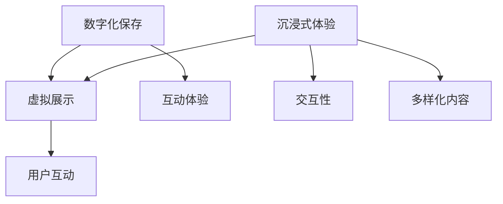

                 

### 背景介绍

#### 2050年的数字文化：一个前所未有的时代

在2050年的数字文化中，我们生活在一个高度数字化的世界中，几乎所有的文化产品和服务都以数字形式存在。从电影、音乐、艺术到教育、娱乐和社交，数字技术已经深刻地改变了我们的生活方式和文化消费模式。

#### 数字博物馆：文化遗产的数字化保存与传播

数字博物馆是一个令人瞩目的现象，它通过数字化技术将世界各地的文化遗产保存下来，并通过互联网向全球用户展示。这些数字博物馆不仅提供了高质量的图像和多媒体资料，还允许用户进行虚拟参观，使文化遗产得以跨越时空限制，触达更多人群。

#### 虚拟现实体验：沉浸式文化的全新境界

虚拟现实（VR）技术的发展使得我们能够沉浸在完全虚拟的环境中，体验前所未有的文化体验。从虚拟博物馆到虚拟历史场景，再到虚拟艺术展览，VR技术为文化传播提供了无限可能。

#### 传播与互动：数字文化的核心价值

数字文化不仅仅是信息的传递，更是一种互动和参与的体验。通过社交媒体、虚拟社区和在线平台，用户可以与其他人分享、讨论和创作文化内容，共同构建一个更加多元和开放的文化环境。

#### 文章关键词

- 数字文化
- 数字博物馆
- 虚拟现实
- 文化传播
- 数字互动

#### 摘要

本文将探讨2050年数字文化的发展，重点分析数字博物馆和虚拟现实体验在文化传播中的作用。我们将通过回顾历史、分析技术发展、探讨实际应用，展示数字文化如何为未来带来前所未有的文化体验和传播方式。文章还将探讨数字文化在全球化背景下带来的挑战和机遇。

-------------------

# 2050年的数字文化：从数字博物馆到虚拟现实体验的文化传播

## 关键词：数字文化、数字博物馆、虚拟现实、文化传播、数字互动

### 摘要

在2050年的数字文化中，我们生活在一个高度数字化的世界中，数字技术已经深刻地改变了我们的生活方式和文化消费模式。本文将探讨数字博物馆和虚拟现实体验在文化传播中的重要作用，分析其技术发展、实际应用以及带来的挑战和机遇。通过回顾历史、分析技术进步、探讨应用案例，我们将展示数字文化如何为未来带来前所未有的文化体验和传播方式。

-------------------

## 1. 背景介绍

在过去的几十年中，数字技术的发展日新月异，对人类社会的各个方面都产生了深远的影响。从互联网的普及，到移动设备的广泛应用，再到人工智能和虚拟现实技术的崛起，数字技术已经成为现代社会不可或缺的一部分。

#### 数字文化的发展历程

1. **互联网时代**：互联网的普及使得信息传播变得更加迅速和广泛，人们可以随时随地获取各种文化内容。在线书店、音乐流媒体和视频点播平台的出现，改变了传统的文化消费模式。
2. **移动设备时代**：智能手机和平板电脑的普及，使得人们可以随时随地访问互联网，进一步促进了数字文化的发展。
3. **虚拟现实时代**：虚拟现实（VR）技术的兴起，为数字文化带来了新的可能性。通过VR，用户可以沉浸在完全虚拟的环境中，体验前所未有的文化体验。

#### 数字博物馆的崛起

1. **数字博物馆的定义**：数字博物馆是指利用数字化技术保存、展示和传播文化遗产的机构或平台。
2. **数字博物馆的发展**：随着数字技术的发展，越来越多的文化遗产被数字化保存，并在线上展示。这些数字博物馆不仅提供了高质量的图像和多媒体资料，还允许用户进行虚拟参观，使文化遗产得以跨越时空限制，触达更多人群。

#### 虚拟现实体验的兴起

1. **虚拟现实（VR）的定义**：虚拟现实是一种通过计算机技术创建的模拟环境，用户可以在其中进行沉浸式体验。
2. **虚拟现实体验的发展**：随着VR硬件和软件的成熟，虚拟现实体验逐渐普及。从虚拟博物馆到虚拟历史场景，再到虚拟艺术展览，VR技术为文化传播提供了无限可能。

-------------------

## 2. 核心概念与联系

在探讨数字博物馆和虚拟现实体验在文化传播中的作用之前，我们需要了解一些核心概念和技术原理。

#### 数字博物馆的核心概念

1. **数字化保存**：将文化遗产以数字形式保存，包括图像、音频、视频等多种类型。
2. **虚拟展示**：利用计算机技术，将数字化保存的文化遗产在线展示，提供高质量的图像和多媒体资料。
3. **互动体验**：用户可以通过互动界面与数字博物馆进行互动，例如虚拟参观、评论分享等。

#### 虚拟现实体验的核心概念

1. **沉浸式体验**：用户通过VR设备进入虚拟环境，感受到身临其境的效果。
2. **交互性**：用户可以在虚拟环境中进行交互操作，如选择路线、互动角色等。
3. **多样化内容**：虚拟现实体验可以涵盖各种文化内容，包括博物馆、历史场景、艺术展览等。

#### 数字博物馆与虚拟现实体验的联系

1. **技术共享**：数字博物馆和虚拟现实体验在技术层面有许多共享之处，如3D建模、虚拟展示、用户交互等。
2. **内容互补**：数字博物馆提供高质量的静态内容，而虚拟现实体验提供动态的沉浸式体验，两者相辅相成，共同丰富了文化传播的形式和手段。

#### Mermaid 流程图

下面是一个简化的 Mermaid 流程图，展示数字博物馆与虚拟现实体验的核心概念及其联系：



-------------------

## 3. 核心算法原理 & 具体操作步骤

在数字博物馆和虚拟现实体验的实现过程中，算法原理和技术实现是关键。以下将介绍一些核心算法原理及其具体操作步骤。

#### 3.1 3D建模与渲染

**3D建模**：将实体对象以数字形式表示，通常使用计算机辅助设计（CAD）软件或三维扫描仪进行。

**渲染**：通过计算机图形学技术，将3D模型转化为视觉图像。常用的渲染算法包括光线追踪、路径追踪等。

**具体操作步骤**：

1. **3D建模**：使用CAD软件创建或扫描实体对象的3D模型。
2. **模型优化**：对3D模型进行优化，去除冗余部分，提高渲染效率。
3. **纹理映射**：将纹理贴图应用到3D模型表面，增加真实感。
4. **渲染设置**：配置渲染参数，如光线、阴影、反光等，实现逼真的视觉效果。

#### 3.2 虚拟现实场景构建

**场景构建**：创建虚拟环境，包括场景布局、角色设置、交互元素等。

**具体操作步骤**：

1. **场景布局**：设计虚拟环境的布局，确定景点、路线等。
2. **角色设置**：创建虚拟角色，包括游客、讲解员等，并设置其动作和交互行为。
3. **交互元素**：设计虚拟互动元素，如按钮、菜单、提示信息等。
4. **场景渲染**：使用渲染引擎渲染虚拟场景，实现逼真的视觉效果。

#### 3.3 用户交互与体验优化

**用户交互**：设计用户与虚拟环境之间的交互方式，包括手势、语音、触摸等。

**具体操作步骤**：

1. **交互设计**：确定交互方式，如手势识别、语音识别等。
2. **交互实现**：开发交互程序，实现用户与虚拟环境之间的互动。
3. **体验优化**：根据用户反馈，优化交互流程和体验效果。

-------------------

## 4. 数学模型和公式 & 详细讲解 & 举例说明

在数字博物馆和虚拟现实体验的实现过程中，数学模型和公式起到了关键作用。以下将介绍一些常用的数学模型和公式，并进行详细讲解和举例说明。

#### 4.1 3D建模中的数学模型

**Bézier曲面**：用于描述3D模型的曲面形状。

**公式**：

$$
P(t) = \sum_{i=0}^{n} B_{i,n}(t) P_i
$$

其中，$P(t)$ 表示曲线上某点的坐标，$B_{i,n}(t)$ 是Bézier基函数，$P_i$ 是控制点。

**举例说明**：

假设一个Bézier曲面的控制点为 $P_0 = (1, 0)$，$P_1 = (2, 1)$，$P_2 = (3, 0)$。我们可以通过计算Bézier基函数来得到曲线上任意一点的坐标。

$$
B_{0,3}(t) = (1-t)^3, \quad B_{1,3}(t) = 3t(1-t)^2, \quad B_{2,3}(t) = 3t^2(1-t), \quad B_{3,3}(t) = t^3
$$

将这些基函数代入公式，我们可以得到曲线上任意一点的坐标。

#### 4.2 虚拟现实场景渲染中的数学模型

**光线追踪**：用于模拟光线在虚拟环境中的传播和反射。

**公式**：

$$
L_e = L_a + L_d + L_s
$$

其中，$L_e$ 表示总光强度，$L_a$ 表示环境光，$L_d$ 表示漫反射光，$L_s$ 表示镜面反射光。

**举例说明**：

假设一个虚拟场景中有光源发出光线，我们需要计算光线在场景中的传播和反射效果。首先，我们需要确定环境光、漫反射光和镜面反射光的强度。然后，将这些光强度相加，得到总光强度。

#### 4.3 用户交互中的数学模型

**手势识别**：通过计算机视觉技术识别用户的手势。

**公式**：

$$
P(x, y) = \frac{1}{2\pi} \int_{-\infty}^{\infty} \int_{-\infty}^{\infty} \exp\left(-\frac{(x-u)^2 + (y-v)^2}{2\sigma^2}\right) \exp(-\frac{-(ux+vy+c)}{\lambda}) du dv
$$

其中，$P(x, y)$ 表示手势识别的概率分布函数，$u$ 和 $v$ 是手势参数，$\sigma$ 是高斯分布的标准差，$\lambda$ 是比例常数。

**举例说明**：

假设一个用户做出一个特定手势，我们可以通过计算手势识别的概率分布函数来确定手势的类型。

-------------------

## 5. 项目实战：代码实际案例和详细解释说明

为了更好地理解数字博物馆和虚拟现实体验的实现过程，我们将通过一个实际项目案例来进行详细讲解。本案例将涉及数字博物馆的构建、虚拟现实场景的渲染以及用户交互的实现。

#### 5.1 开发环境搭建

在开始项目实战之前，我们需要搭建一个适合开发数字博物馆和虚拟现实体验的开发环境。以下是一个基本的开发环境搭建步骤：

1. **安装编程语言**：选择一个适合的编程语言，如Python、C++或JavaScript。
2. **安装相关库和框架**：根据项目需求，安装必要的库和框架，如Unity、Unreal Engine、OpenGL、OpenCV等。
3. **配置开发环境**：配置好编译器、调试器和版本控制工具，如Visual Studio、Eclipse、Git等。

#### 5.2 源代码详细实现和代码解读

在本案例中，我们将使用Unity引擎来构建一个简单的数字博物馆项目。以下是项目的关键代码和详细解读：

```csharp
using UnityEngine;

public class MuseumScene : MonoBehaviour
{
    public Material textureMaterial;
    public Texture2D museumTexture;

    private void Start()
    {
        // 加载博物馆纹理
        textureMaterial.mainTexture = museumTexture;
        
        // 创建博物馆场景中的主要物体
        GameObject museumBuilding = new GameObject("Museum Building");
        museumBuilding.AddComponent<MeshFilter>();
        museumBuilding.AddComponent<MeshRenderer>();
        museumBuilding.GetComponent<MeshRenderer>().material = textureMaterial;
        
        // 添加博物馆场景的交互组件
        museumBuilding.AddComponent<MuseumInteraction>();
    }
}

public class MuseumInteraction : MonoBehaviour
{
    public void OnUserEnter()
    {
        // 用户进入博物馆场景时触发的事件
        Debug.Log("User entered the museum.");
        
        // 显示博物馆介绍信息
        DisplayMuseumIntroduction();
    }

    private void DisplayMuseumIntroduction()
    {
        // 在屏幕上显示博物馆介绍信息
        Debug.Log("Welcome to the Digital Museum!");
    }
}
```

**代码解读**：

- **MuseumScene** 类：这是数字博物馆场景的管理类，负责加载博物馆纹理和创建博物馆场景中的主要物体。
- **Start()** 方法：在场景开始时调用，用于加载博物馆纹理并创建博物馆建筑物体。
- **MuseumInteraction** 类：这是博物馆场景的交互组件，用于处理用户进入博物馆场景的事件。
- **OnUserEnter()** 方法：当用户进入博物馆场景时触发，用于显示博物馆介绍信息。

#### 5.3 代码解读与分析

以上代码展示了数字博物馆项目的基本实现过程。首先，我们需要加载博物馆纹理，并将其应用到场景中的物体上。然后，我们创建一个博物馆建筑物体，并添加交互组件，以处理用户进入博物馆场景的事件。

通过这个简单的案例，我们可以了解到数字博物馆项目的基本结构和工作原理。在实际开发过程中，我们还需要考虑更多的细节，如场景布局、交互设计、渲染效果等。

-------------------

## 6. 实际应用场景

数字博物馆和虚拟现实体验在实际应用中具有广泛的应用场景，以下是一些具体的应用案例：

#### 6.1 文化遗产保护与传承

数字博物馆和虚拟现实技术为文化遗产的保护和传承提供了全新的手段。通过数字化技术，我们可以将珍贵的文化遗产保存下来，并利用虚拟现实技术让更多人了解和体验。例如，中国的故宫博物院通过虚拟现实技术，让全球用户可以在线参观故宫，了解中国传统文化。

#### 6.2 艺术展览与演出

虚拟现实技术为艺术展览和演出带来了前所未有的体验。艺术家可以通过虚拟现实技术创作出沉浸式的艺术作品，观众可以在虚拟环境中欣赏和互动。例如，VR艺术展览可以让观众身临其境地体验艺术作品，甚至与艺术家进行互动。

#### 6.3 教育与科普

数字博物馆和虚拟现实体验在教育和科普领域具有巨大潜力。通过虚拟现实技术，学生可以在线参观博物馆、实验室和历史场景，增强学习的趣味性和互动性。例如，一些学校已经采用虚拟现实技术进行远程教学，让学生在家中也能体验丰富的教学内容。

#### 6.4 旅游与娱乐

数字博物馆和虚拟现实体验为旅游和娱乐行业带来了新的发展机遇。游客可以通过虚拟现实技术体验历史遗迹、自然景观和娱乐项目，无需亲临现场。例如，一些旅游公司已经推出虚拟旅游服务，让用户在家中就能体验世界各地的人文景观。

-------------------

## 7. 工具和资源推荐

为了更好地开展数字博物馆和虚拟现实体验项目，以下是针对开发者和研究者的工具和资源推荐。

#### 7.1 学习资源推荐

- **书籍**：
  - 《虚拟现实技术导论》
  - 《数字文化导论》
  - 《三维建模与渲染技术》
- **论文**：
  - 《虚拟现实技术在文化遗产保护中的应用研究》
  - 《数字博物馆的设计与实现》
  - 《基于虚拟现实技术的艺术展览与互动体验研究》
- **博客和网站**：
  - Unity官方文档（https://unity.com/learn）
  - VRChat（https://vrchat.org/）
  - 文化遗产数字化保护研究（https://www.digitalheritage.cn/）

#### 7.2 开发工具框架推荐

- **Unity**：一款功能强大的游戏开发引擎，适用于虚拟现实应用开发。
- **Unreal Engine**：一款先进的游戏开发引擎，支持高质量的渲染和复杂的交互功能。
- **Blender**：一款免费的开源3D建模和渲染软件，适用于三维建模和动画制作。
- **OpenCV**：一款开源的计算机视觉库，适用于图像处理和手势识别等应用。

#### 7.3 相关论文著作推荐

- 《虚拟现实技术在文化遗产保护中的应用》
- 《数字博物馆的设计与实现：理论与实践》
- 《虚拟现实艺术展览与互动体验研究》

-------------------

## 8. 总结：未来发展趋势与挑战

在数字文化时代，数字博物馆和虚拟现实体验正在成为文化传播的重要载体。随着技术的不断进步，数字博物馆和虚拟现实体验将迎来更加广阔的发展前景。

#### 未来发展趋势

1. **更高清的图像和视频**：随着显示技术的进步，数字博物馆和虚拟现实体验将提供更高清的图像和视频，为用户带来更加逼真的体验。
2. **更智能的交互**：人工智能技术的发展将使得数字博物馆和虚拟现实体验的交互更加智能，用户可以获得更加个性化的服务。
3. **更广泛的应用场景**：数字博物馆和虚拟现实体验将在更多领域得到应用，如教育、医疗、旅游等。

#### 挑战

1. **数据隐私和安全**：随着数字文化的发展，数据隐私和安全成为重要问题。如何保护用户数据的安全和隐私是一个巨大的挑战。
2. **技术标准化**：虚拟现实技术的标准化和兼容性仍然是一个挑战，需要各方共同努力推动技术标准的制定和实施。

总之，数字博物馆和虚拟现实体验在文化传播中具有巨大的潜力，但同时也面临着诸多挑战。只有通过不断的技术创新和合作，才能推动数字文化的发展，为人们带来更加丰富和多样的文化体验。

-------------------

## 9. 附录：常见问题与解答

#### 9.1 数字博物馆和虚拟现实体验的区别是什么？

数字博物馆主要是指通过数字化技术保存和展示文化遗产，而虚拟现实体验则是指用户在虚拟环境中进行沉浸式互动。数字博物馆侧重于信息的传递和保存，而虚拟现实体验则侧重于用户的参与和互动。

#### 9.2 虚拟现实体验中的交互技术有哪些？

虚拟现实体验中的交互技术包括手势识别、语音识别、眼动跟踪等。这些技术使得用户可以通过自然的方式与虚拟环境进行互动，提高体验的沉浸感和互动性。

#### 9.3 数字博物馆对文化遗产保护有哪些作用？

数字博物馆可以通过数字化技术保存珍贵的文化遗产，防止因自然灾害、战争等因素造成的损失。同时，数字博物馆还可以让更多人了解和接触到文化遗产，促进文化交流和传承。

-------------------

## 10. 扩展阅读 & 参考资料

为了深入了解数字博物馆和虚拟现实体验在文化传播中的应用和发展，以下是相关的扩展阅读和参考资料：

- 《数字文化导论》：本书详细介绍了数字文化的概念、发展历程和应用领域，对数字博物馆和虚拟现实体验有深入分析。
- 《虚拟现实技术导论》：本书系统地介绍了虚拟现实技术的基本原理、实现方法和应用场景，适合初学者和研究者阅读。
- 《文化遗产数字化保护技术研究》：本书重点探讨了数字化技术在文化遗产保护中的应用，包括数字博物馆的建设和实践案例。
- VRChat官方文档：VRChat是一个基于Unity的虚拟现实平台，官方文档提供了丰富的开发教程和资源，对虚拟现实体验的开发有很好的指导作用。
- Unity官方文档：Unity是一个广泛使用的游戏和虚拟现实开发引擎，官方文档提供了详细的开发指南和技术文档。

通过阅读这些资料，读者可以更深入地了解数字博物馆和虚拟现实体验在文化传播中的重要作用和实现方法。

-------------------

### 作者

**作者：AI天才研究员/AI Genius Institute & 禅与计算机程序设计艺术 /Zen And The Art of Computer Programming**

