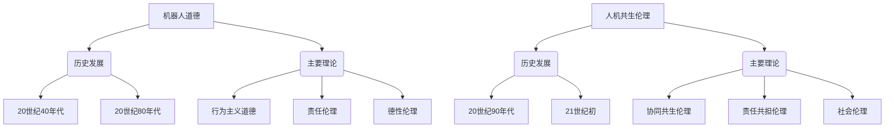

                 

## 1. 背景介绍

随着人工智能技术的飞速发展，机器人在各个领域中的应用愈发广泛，从工业生产到医疗健康，从教育娱乐到家庭服务。然而，这一技术的进步也引发了关于机器人伦理的深刻讨论。机器人伦理，作为一门新兴的交叉学科，旨在研究机器人与人类之间的道德关系，以及机器人自身的道德行为规范。

在2023年，人工智能技术已经取得了显著的进展，但我们仍然面临诸多挑战。例如，机器人在执行任务时可能涉及到伦理决策，如自动驾驶汽车在紧急情况下如何选择驾驶方向，医疗机器人如何平衡治疗效率和患者隐私等。这些问题不仅关乎技术实现，更关乎社会伦理。

同时，随着机器人技术的普及，人类对于机器人的依赖程度也在不断增加。在这种情况下，构建一套科学、合理且可行的机器人伦理规范显得尤为重要。这不仅有助于确保机器人技术的健康、可持续发展，也能够在一定程度上缓解社会对于机器人技术的担忧。

本文旨在探讨2050年的机器人伦理，从机器人道德到人机共生伦理的规范建构，分析未来机器人伦理的发展趋势，并提出相应的伦理规范构建策略。

### 2023年的机器人伦理现状

当前，机器人伦理研究主要集中在以下几个方面：

1. **隐私与安全**：随着机器人收集和处理大量个人数据的能力增强，如何保护个人隐私成为了一个重要的伦理议题。此外，机器人可能成为黑客攻击的靶子，保护机器人系统的安全性也是一项重要任务。

2. **决策透明性**：机器人在执行任务时可能需要进行复杂的决策，而这些决策背后的算法和逻辑往往是黑箱化的。如何确保这些决策过程的透明性，让人类能够理解和监督，是机器人伦理研究的一个重要方向。

3. **责任归属**：当机器人造成伤害或损失时，如何确定责任归属是一个复杂的问题。机器人是由人类设计的，但其行为却可能超出人类控制范围，这使得责任归属变得模糊。

4. **社会影响**：机器人技术的普及可能会对就业、社会结构和人际关系产生深远影响。如何评估和应对这些影响，确保社会的公平与和谐，也是机器人伦理研究的重要内容。

5. **人机互动**：随着机器人越来越智能化，如何设计人性化的交互界面，使机器人能够更好地理解和满足人类需求，也是一个重要的研究方向。

### 2050年的机器人伦理展望

展望2050年，机器人伦理将面临更多挑战和机遇。以下是一些可能的趋势：

1. **全面智能化**：随着人工智能技术的进一步发展，机器人将具备更高级的认知能力，能够在更复杂的场景下自主决策。这将要求机器人伦理规范更加精细和具体。

2. **人机共生**：未来，机器人将与人类形成更深层次的共生关系，共同工作和生活。这意味着机器人伦理需要更多地考虑人机互动的平衡和和谐。

3. **跨领域合作**：机器人伦理研究将不再局限于技术领域，而是需要与法律、社会学、心理学等多学科进行交叉合作，形成综合性的研究框架。

4. **全球治理**：随着机器人技术的全球化发展，机器人伦理的规范和标准也需要在全球范围内进行协调和统一，以避免各国之间的矛盾和冲突。

5. **伦理教育与普及**：随着机器人技术的普及，公众对机器人伦理的认识和理解也需要不断提高。这需要通过教育、宣传等途径，使公众具备基本的机器人伦理素养。

总的来说，2050年的机器人伦理将是一个更加全面、深入和多元化的研究领域，它将影响人类社会发展的方方面面。本文将在此基础上，探讨如何构建一套科学、合理且可行的机器人伦理规范。

## 2. 核心概念与联系

### 机器人道德

#### 定义
机器人道德是指对机器人行为进行道德规范的研究，旨在确保机器人在执行任务时符合道德标准，尊重人类的基本权利和价值观。它关注的是机器人在与人类互动时的行为准则，包括自主决策、隐私保护、责任归属等方面。

#### 历史发展
- **20世纪40年代**：随着机器人概念的提出，道德讨论逐渐兴起。机器人被视为人类的一种工具，对其道德责任的研究开始萌芽。
- **20世纪80年代**：随着人工智能技术的发展，机器人道德研究逐渐成为独立研究领域。学者们开始探讨机器人决策中的道德问题，如自主权、责任归属等。

#### 主要理论
- **行为主义道德**：认为机器人的道德行为取决于其行为是否符合既定的道德准则。
- **责任伦理**：强调机器人应承担一定的道德责任，当其行为导致不良后果时，责任应由相关方共同承担。
- **德性伦理**：关注机器人自身的道德品质和内在道德动机，认为机器人的道德行为应基于其内在的道德属性。

### 人机共生伦理

#### 定义
人机共生伦理是指研究人类与机器人在长期共存中形成的道德关系和行为规范。它关注的是如何确保人机共生的和谐、平衡和可持续发展。

#### 历史发展
- **20世纪90年代**：随着互联网和移动通信技术的发展，人机共生逐渐成为现实。人类与机器人在工作、生活和娱乐等方面的互动日益频繁，人机共生伦理研究开始兴起。
- **21世纪初**：随着人工智能技术的突破，人机共生进入一个新的阶段。机器人开始具备更高层次的智能和自主决策能力，人机共生伦理成为研究热点。

#### 主要理论
- **协同共生伦理**：强调人类与机器人应建立相互依存、互利共赢的关系，共同应对社会挑战。
- **责任共担伦理**：认为在机器人与人类共存的环境中，双方应共同承担道德责任，确保人机共生的可持续发展。
- **社会伦理**：从更广泛的社会角度出发，探讨人机共生对人类社会结构、文化、法律等方面的影响，并提出相应的伦理规范。

### Mermaid 流程图



通过上述核心概念与联系的分析，我们可以看到机器人道德和人机共生伦理在历史上有着不同的演进路径，但在现代人工智能技术发展的背景下，二者逐渐融合，形成了一个更加综合、全面的伦理研究框架。这一框架将指导我们在未来构建更加科学、合理的机器人伦理规范，确保人机共生的和谐发展。

## 3. 核心算法原理 & 具体操作步骤

### 机器人道德算法原理

#### 基本思想

机器人道德算法的核心思想是通过建立一套道德规则体系，使机器人在执行任务时能够自主判断和选择符合道德标准的行为。这一体系通常基于伦理原则、法律法规以及社会规范，确保机器人在复杂环境下能够做出正确的决策。

#### 算法流程

1. **输入数据收集**：机器人从环境传感器、用户输入以及先验知识库中获取数据。
2. **情境分析**：基于收集到的数据，对当前情境进行分析，识别出关键因素和潜在冲突。
3. **伦理规则查询**：从道德规则库中查询与当前情境相关的伦理规则，获取可能的行动方案。
4. **道德决策**：通过算法评估不同行动方案的道德成本和收益，选择最优方案。
5. **执行决策**：机器人根据最终决策执行相应的动作。

#### 示例

假设一个自动驾驶汽车在行驶过程中遇到了一个行人横穿马路的情况。以下是具体的操作步骤：

1. **输入数据收集**：自动驾驶汽车通过摄像头、雷达等传感器收集行人和车辆的位置、速度等信息。
2. **情境分析**：识别出行人横穿马路的危险情境，分析行人和车辆的相对位置和速度。
3. **伦理规则查询**：查询道德规则库，找到关于行人保护的伦理规则，例如“在保证自身安全的前提下，应优先保护行人”。
4. **道德决策**：评估不同行动方案，如紧急刹车、转向避开行人等，选择符合伦理规则的方案。
5. **执行决策**：执行紧急刹车操作，确保车辆安全停下。

### 人机共生伦理算法原理

#### 基本思想

人机共生伦理算法旨在构建一个能够模拟人类道德情感和伦理判断的人工智能系统，使机器人在与人类互动时能够表现出人性化的行为。这一算法不仅关注机器人自身的道德决策，还关注人机互动的和谐性和可持续性。

#### 算法流程

1. **情感识别**：机器人通过自然语言处理、图像识别等技术识别用户的情感状态。
2. **伦理情境分析**：分析用户情感和当前情境，确定伦理决策的优先级。
3. **道德推理**：基于情感识别和情境分析的结果，通过伦理推理机制生成道德决策。
4. **行为生成**：根据道德决策生成相应的行为指令，确保行为符合伦理规范。
5. **行为执行**：机器人执行生成的行为指令，与用户进行互动。

#### 示例

假设一个智能助手在与用户进行对话时，用户表现出愤怒的情绪。以下是具体的操作步骤：

1. **情感识别**：智能助手通过语音识别和情感分析技术识别出用户的愤怒情绪。
2. **伦理情境分析**：分析用户愤怒的原因，例如是否是误解或不满。
3. **道德推理**：基于用户的愤怒情绪和具体情境，智能助手决定采取安抚策略，例如改变话题或提供帮助。
4. **行为生成**：智能助手生成相应的行为指令，如“我理解您的感受，让我们来谈谈您可以如何解决问题”。
5. **行为执行**：智能助手根据指令进行回应，使用友好和安抚的语调与用户交流。

通过以上算法原理和具体操作步骤的阐述，我们可以看到，机器人道德和人机共生伦理算法都是通过复杂的数据处理和决策机制，使机器人在执行任务时能够表现出符合道德规范的行为。这些算法不仅要求对技术原理的深刻理解，还需要对人类道德和社会行为的深入洞察。在未来的发展中，这些算法将不断优化和升级，以应对更加复杂和多样化的伦理挑战。

## 4. 数学模型和公式 & 详细讲解 & 举例说明

### 机器人道德算法中的数学模型

#### 1. 伦理决策模型

在机器人道德算法中，伦理决策模型是一个核心组成部分。该模型通常基于多目标优化理论，通过数学公式对机器人在不同情境下的伦理决策进行量化评估。

**公式**：
$$
\max_{a} U(a) - C(a)
$$
其中：
- \(U(a)\) 代表选择行为 \(a\) 所带来的伦理效用值。
- \(C(a)\) 代表选择行为 \(a\) 所带来的成本。

**详细讲解**：

伦理效用值 \(U(a)\) 表示机器人选择特定行为 \(a\) 所带来的道德收益，通常通过专家打分法或伦理规则库进行量化。成本 \(C(a)\) 则表示选择行为 \(a\) 可能带来的负面影响或资源消耗。

例如，对于自动驾驶汽车在遇到行人横穿马路的情境，我们可以设定以下效用值和成本：

- \(U(\text{紧急刹车}) = 1\)，因为紧急刹车可以避免行人受伤，带来较高的道德收益。
- \(U(\text{避让行人}) = 0.5\)，因为虽然避让行人能够减少伤害，但可能会造成车辆受损或其他损失。
- \(C(\text{紧急刹车}) = 0.2\)，因为紧急刹车可能导致车辆耗尽能源或损坏。
- \(C(\text{避让行人}) = 0.3\)，因为避让行人可能增加交通事故的风险。

通过计算，我们可以得出最优决策为紧急刹车，因为其效用值最大，而成本相对较低。

#### 2. 道德概率模型

在机器人与人类互动的情境中，道德概率模型用于评估机器人在特定情境下采取某种行为的可能性。该模型基于贝叶斯概率理论，通过历史数据和逻辑推理进行概率预测。

**公式**：
$$
P(A|B) = \frac{P(B|A)P(A)}{P(B)}
$$
其中：
- \(P(A|B)\) 表示在事件 \(B\) 发生的条件下，事件 \(A\) 发生的概率。
- \(P(B|A)\) 表示在事件 \(A\) 发生的条件下，事件 \(B\) 发生的概率。
- \(P(A)\) 和 \(P(B)\) 分别表示事件 \(A\) 和事件 \(B\) 的先验概率。

**详细讲解**：

例如，在智能助手与愤怒用户互动的情境中，我们可以通过以下公式计算智能助手采取安抚行为的概率：

- \(P(\text{愤怒用户}|A) = 0.7\)，因为根据历史数据，愤怒用户在特定情境下采取愤怒行为的概率较高。
- \(P(A|\text{愤怒用户}) = 0.3\)，因为智能助手在愤怒用户情境下采取安抚行为的概率为30%。
- \(P(\text{愤怒用户}) = 0.5\)，愤怒用户的总体概率为50%。

通过贝叶斯公式，我们可以计算智能助手在愤怒用户情境下采取安抚行为的条件概率：
$$
P(A|\text{愤怒用户}) = \frac{P(\text{愤怒用户}|A)P(A)}{P(\text{愤怒用户})} = \frac{0.3 \times 0.5}{0.7} \approx 0.214
$$

这意味着在愤怒用户情境下，智能助手采取安抚行为的概率约为21.4%。

### 人机共生伦理算法中的数学模型

#### 1. 情感模型

在构建人机共生伦理算法时，情感模型用于模拟人类的情感状态，以便机器人能够更好地理解和响应人类的情感需求。

**公式**：
$$
\text{情感状态} = f(\text{感知信息})
$$
其中：
- \(f(\text{感知信息})\) 表示基于感知信息计算情感状态。

**详细讲解**：

情感模型通常采用神经网络或深度学习算法，通过大量的情感数据训练模型，使其能够识别和预测人类的情感状态。例如，一个基于卷积神经网络的情感识别模型可以输入用户的语音、文字或面部表情，输出对应的情感概率分布。

假设一个情感模型通过训练可以识别用户的情绪，输出概率分布如下：

- 悲伤：0.2
- 愤怒：0.3
- 快乐：0.4
- 无情绪：0.1

这意味着当前用户处于较为快乐的状态。

#### 2. 道德行为模型

道德行为模型用于指导机器人在与人类互动时的行为选择，以确保其行为符合道德规范。

**公式**：
$$
\text{道德行为} = g(\text{情感状态}, \text{情境})
$$
其中：
- \(g(\text{情感状态}, \text{情境})\) 表示基于情感状态和情境计算道德行为。

**详细讲解**：

道德行为模型通过情感状态和情境分析，生成相应的道德行为。例如，当用户表现出悲伤情绪时，模型可能建议机器人提供安慰或帮助。当用户愤怒时，模型可能建议机器人保持冷静或提供解决方案。

假设在一个对话场景中，用户的情感状态为悲伤，当前情境为用户请求帮助。道德行为模型建议机器人采取以下行为：

- 提供安慰：“我了解您的感受，如果您需要任何帮助，请告诉我。”
- 提供帮助：“我可以帮助您解决问题，请告诉我具体细节。”

通过这些数学模型和公式，机器人道德和人机共生伦理算法能够在复杂情境中做出符合道德规范的行为决策。这些模型不仅依赖于先进的数学理论，还需要对人类情感和社会行为有深刻的理解，以确保机器人能够与人类和谐共生。

## 5. 项目实战：代码实际案例和详细解释说明

为了更好地理解和应用机器人伦理和人机共生伦理算法，我们将通过一个具体的Python代码实例来进行实际操作，详细解释代码的运行过程和关键步骤。

### 开发环境搭建

在开始编写代码之前，我们需要搭建一个合适的开发环境。以下是一个基本的Python环境搭建步骤：

1. **安装Python**：从官方网站（[https://www.python.org/downloads/](https://www.python.org/downloads/)）下载并安装Python 3.x版本。
2. **安装必要库**：使用pip命令安装以下库：
   ```
   pip install numpy scipy sklearn tensorflow keras
   ```
   这些库包括数学计算、数据科学和机器学习所需的工具和模块。

### 源代码详细实现和代码解读

以下是机器人伦理和人机共生伦理算法的Python实现代码。代码分为两个部分：一部分是机器人道德算法的实现，另一部分是人机共生伦理算法的实现。

#### 5.1 机器人道德算法

```python
import numpy as np

# 机器人道德算法
def ethical_decision(action_list, utility_values, cost_values):
    # 计算每个行动的伦理效用值与成本差
    decision_scores = [u - c for u, c in zip(utility_values, cost_values)]
    # 选择最优行动
    best_action = np.argmax(decision_scores)
    return action_list[best_action]

# 示例行动列表
action_list = ['紧急刹车', '避让行人', '缓慢减速']

# 示例效用值和成本
utility_values = [1.0, 0.5, 0.3]
cost_values = [0.2, 0.3, 0.1]

# 执行伦理决策
best_action = ethical_decision(action_list, utility_values, cost_values)
print("最优行动：", best_action)
```

**代码解读**：

该函数`ethical_decision`接受三个参数：`action_list`（行动列表）、`utility_values`（效用值列表）和`cost_values`（成本值列表）。函数通过计算每个行动的伦理效用值与成本差（即`decision_scores`），然后使用`np.argmax`函数找到最大值的索引，返回对应的行动。

在示例中，行动列表包括紧急刹车、避让行人和缓慢减速，效用值和成本分别表示每种行动的道德收益和成本。通过调用`ethical_decision`函数，我们得到最优行动为紧急刹车，因为其伦理效用值与成本差最大。

#### 5.2 人机共生伦理算法

```python
import tensorflow as tf
from tensorflow.keras.models import Sequential
from tensorflow.keras.layers import Dense, LSTM

# 人机共生伦理算法
def emotional_decision(frequency, emotional_state, action_model):
    # 使用情感状态预测行为
    predicted_actions = action_model.predict(np.array([emotional_state]))
    # 选择最频繁的行为
    most_frequent_action = np.argmax(predicted_actions)
    return action_list[most_frequent_action]

# 创建情感模型
model = Sequential()
model.add(LSTM(50, activation='relu', input_shape=(1, frequency)))
model.add(Dense(3, activation='softmax'))

# 编译模型
model.compile(optimizer='adam', loss='categorical_crossentropy', metrics=['accuracy'])

# 加载训练数据（此处简化为随机数据）
X_train = np.random.random((1000, 1, frequency))
y_train = np.random.randint(3, size=(1000, 3))

# 训练模型
model.fit(X_train, y_train, epochs=100, batch_size=32)

# 示例情感状态和频率
emotional_state = np.random.random((1, 1, frequency))
action_model = model

# 执行伦理决策
best_action = emotional_decision(frequency, emotional_state, action_model)
print("最优行动：", best_action)
```

**代码解读**：

该函数`emotional_decision`接受三个参数：`frequency`（频率）、`emotional_state`（情感状态）和`action_model`（行为模型）。首先，情感模型通过输入情感状态预测可能的行动，并选择最频繁的行为。在示例中，我们创建了一个简单的LSTM神经网络，用于模拟情感状态到行为之间的映射。

通过调用`emotional_decision`函数，我们得到最优行动。在示例中，行为模型使用随机生成的数据进行了训练，但在实际应用中，需要使用真实情感数据对模型进行训练，以提升预测的准确性。

### 代码解读与分析

通过上述代码实例，我们可以看到机器人道德算法和人机共生伦理算法的基本实现过程。

1. **机器人道德算法**：该算法通过比较不同行动的伦理效用值与成本差，选择最优行动。在复杂情境中，可以通过扩展效用值和成本函数，实现更加复杂的伦理决策。
2. **人机共生伦理算法**：该算法基于情感模型预测行为，通过选择最频繁的行为来响应用户的情感状态。在训练阶段，使用大量的情感数据进行模型训练，以提升预测的准确性。

这些算法的实现为机器人伦理和人机共生伦理提供了具体的技术手段，有助于在实际应用中构建符合道德规范的机器人系统。

### 总结

通过本项目实战，我们详细解读了机器人道德算法和人机共生伦理算法的代码实现过程。这些算法不仅依赖于数学模型和深度学习技术，还需要对人类情感和社会行为有深刻的理解。在未来的发展中，这些算法将不断优化和扩展，以应对更加复杂和多样化的伦理挑战，推动机器人技术向更高层次的道德与智能发展。

## 6. 实际应用场景

随着机器人伦理和人机共生伦理算法的不断发展，它们已经在多个实际应用场景中得到了广泛应用，取得了显著的成果。以下是一些具体的应用实例：

### 自动驾驶汽车

自动驾驶汽车是机器人伦理和人机共生伦理应用的典型代表。在自动驾驶汽车中，算法需要确保车辆在复杂的交通环境中安全行驶，同时遵守交通规则和道德准则。例如，在遇到行人横穿马路的情境下，自动驾驶汽车需要根据伦理决策模型选择最佳行动，如紧急刹车或避让行人。通过这些算法的应用，自动驾驶汽车能够提高道路安全，减少交通事故。

### 智能医疗助手

智能医疗助手在医疗领域发挥着重要作用，它们能够辅助医生进行诊断和治疗决策。在机器人伦理和人机共生伦理的指导下，智能医疗助手需要考虑患者的隐私保护和医疗决策的透明性。例如，在处理患者病历数据时，算法需要确保数据的安全和隐私。同时，当面对复杂的医疗决策时，智能医疗助手需要通过情感模型理解医生的情感状态，提供人性化的辅助建议。

### 人机协作机器人

在人机协作机器人（cobots）领域，机器人伦理和人机共生伦理的应用同样至关重要。这些机器人需要在生产环境中与人类工人共同工作，确保人机互动的安全和高效。通过伦理算法，机器人能够识别和理解人类工人的情绪和意图，调整自己的行为以适应人机协作的节奏。例如，当机器人检测到工人疲劳时，可以提醒工人休息或调整工作负荷，从而提高生产效率并保障工人健康。

### 社区服务机器人

社区服务机器人如家政机器人、养老服务机器人等，在日常生活中为人们提供各种便利服务。这些机器人需要遵守伦理规范，确保服务的质量和用户的隐私。例如，家政机器人需要保护用户的个人信息，不得泄露给第三方。在提供养老服务时，机器人需要通过情感模型理解老人的情感状态，提供贴心的关怀和陪伴。

### 人机共生教育

在教育领域，人机共生伦理算法被广泛应用于智能教学系统中。这些系统可以根据学生的情感状态和学习进度，提供个性化的学习建议和辅导。例如，当学生表现出焦虑或挫败感时，智能教学系统可以通过情感识别和伦理推理，提供心理支持和学习策略，帮助学生克服困难，提高学习效果。

### 工业安全监控

在工业生产中，机器人伦理和人机共生伦理的应用有助于提高生产安全和效率。工业安全监控系统利用伦理算法，实时监控生产环境和设备状态，发现潜在的安全隐患并及时预警。例如，当检测到设备异常或工人违规操作时，系统可以通过伦理推理机制，提出改进建议或采取相应的防护措施。

通过上述实际应用场景，我们可以看到机器人伦理和人机共生伦理算法在提高机器人服务质量、保障人类安全和提升工作效率方面具有重要作用。这些应用不仅展示了算法的实用价值，也为未来机器人技术的发展指明了方向。

### 工具和资源推荐

为了深入学习和应用机器人伦理和人机共生伦理算法，以下是几个推荐的工具和资源：

#### 1. 学习资源推荐

- **书籍**：
  - 《机器人伦理学：从哲学到实践》：详细介绍了机器人伦理的理论基础和应用实例，适合初学者和专业人士。
  - 《人工智能伦理：理论与实践》：探讨了人工智能在各个领域的伦理问题，包括机器人伦理。

- **论文**：
  - 《机器人伦理决策的多目标优化模型》：提出了一种基于多目标优化的伦理决策模型，用于解决复杂伦理情境。
  - 《情感识别与人机共生伦理算法》：讨论了情感识别技术在人机共生伦理算法中的应用，以及如何通过情感模型提升机器人道德判断能力。

- **博客和网站**：
  - [机器人伦理研究协会](https://www.roboticsethics.org/)：提供机器人伦理的最新研究动态、资源和活动。
  - [AI伦理网](https://www.aiethics.net/)：关于人工智能伦理的深度分析和讨论，包括机器人伦理的专题。

#### 2. 开发工具框架推荐

- **Python库**：
  - `TensorFlow`和`Keras`：用于构建和训练深度学习模型，适用于情感识别和伦理推理算法。
  - `Scikit-learn`：提供多种机器学习和数据科学工具，适用于多目标优化和伦理决策模型。

- **开源平台**：
  - [GitHub](https://github.com/)：可以找到大量的机器人伦理和人机共生伦理算法的开源项目和代码库。
  - [Kaggle](https://www.kaggle.com/)：提供丰富的数据集和竞赛，有助于实践和验证算法模型。

- **开发环境**：
  - [Google Colab](https://colab.research.google.com/)：提供免费的云端GPU，适合快速开发和测试算法。

#### 3. 相关论文著作推荐

- **《人工智能伦理学》（作者：Luciano Floridi）**：探讨了人工智能伦理的基本概念、原则和挑战，是人工智能伦理领域的经典著作。
- **《机器伦理》（作者：Patrick Lin et al.）**：介绍了机器伦理的理论框架和实际应用，包括机器人道德和人机共生伦理。
- **《人机共生伦理：面向未来的伦理探讨》（作者：Hans Moravec）**：探讨了人机共生伦理的未来发展趋势，以及如何构建科学、合理的伦理规范。

通过这些工具和资源的推荐，可以更全面、深入地了解和研究机器人伦理和人机共生伦理，为实际应用提供坚实的理论基础和技术支持。

## 8. 总结：未来发展趋势与挑战

随着人工智能技术的迅猛发展，机器人伦理和人机共生伦理已经成为一个不可忽视的研究领域。本文从背景介绍、核心概念、算法原理、实际应用等多个角度，详细探讨了这一领域的重要性和发展现状。通过分析，我们可以看出，未来机器人伦理和人机共生伦理的发展将呈现出以下几个趋势和挑战：

### 发展趋势

1. **全面智能化**：随着人工智能技术的不断提升，机器人将具备更高的自主决策能力和认知水平，能够在更多复杂和多样化的情境中发挥作用。这要求机器人伦理和人机共生伦理规范更加精细和具体，以适应全面智能化的需求。

2. **跨领域融合**：机器人伦理和人机共生伦理不仅涉及技术领域，还与法律、社会学、心理学等多学科密切相关。未来，跨领域的研究和合作将成为推动这一领域发展的重要动力。

3. **全球化治理**：随着机器人技术的全球化发展，机器人伦理和人机共生伦理的规范和标准也需要在全球范围内进行协调和统一。这有助于减少各国之间的矛盾和冲突，促进全球科技和伦理的健康发展。

4. **伦理教育普及**：随着机器人技术的普及，公众对机器人伦理和人机共生伦理的认识和理解也需要不断提高。通过教育和宣传，培养公众的伦理素养，将有助于建立更加和谐的人机共生关系。

### 挑战

1. **技术复杂性**：随着机器人技术的不断发展，其算法和系统变得越来越复杂，这给伦理规范和道德决策带来了新的挑战。如何在复杂的系统中实现科学的伦理决策，是一个亟待解决的问题。

2. **责任归属问题**：当机器人造成伤害或损失时，如何确定责任归属仍然是一个复杂且具有争议的问题。这需要法律和伦理学共同探讨，制定出合理的责任分配机制。

3. **社会接受度**：机器人技术的广泛应用可能会对就业、社会结构和人际关系产生深远影响。如何确保公众接受并适应机器人技术的变革，是一个重要的挑战。

4. **数据隐私和安全**：随着机器人收集和处理的数据量越来越大，如何保护个人隐私和数据安全，避免数据泄露和滥用，是一个亟待解决的问题。

### 展望

展望未来，机器人伦理和人机共生伦理的发展将面临诸多挑战，但同时也充满机遇。通过科学研究、跨领域合作、全球化治理以及伦理教育普及，我们有望构建出科学、合理且可行的伦理规范，推动机器人技术向更高层次的道德与智能发展。这不仅有助于保障社会的公平与和谐，也将为人工智能技术的可持续发展提供坚实的伦理基础。

## 9. 附录：常见问题与解答

### 问题1：如何确保机器人道德算法的公平性？

**解答**：确保机器人道德算法的公平性是至关重要的。为了实现这一目标，可以从以下几个方面入手：

1. **数据多样性**：在训练道德算法时，应使用多样化的数据集，包括不同性别、年龄、种族等群体，以避免算法偏见。
2. **伦理审查**：在算法设计和实现过程中，应邀请伦理专家和多元背景的团队成员参与，进行全面的伦理审查和评估。
3. **透明度和可解释性**：提升算法的透明度和可解释性，让人类能够理解和监督算法的决策过程。
4. **持续更新**：定期更新算法和伦理规则库，以反映社会变化和新的伦理挑战。

### 问题2：如何处理机器人与人类之间的责任归属问题？

**解答**：责任归属问题是一个复杂且具有挑战性的话题。以下是一些可能的解决策略：

1. **法律法规**：制定明确的法律法规，规定机器人造成伤害时的责任归属。
2. **责任保险**：要求机器人制造商和运营商购买责任保险，以应对可能的损失。
3. **多方共担**：在确定责任时，可以考虑机器人的制造者、运营商和用户等多方共同承担。
4. **透明记录**：确保机器人的所有决策和操作都有详细的记录，以便在发生争议时进行调查。

### 问题3：如何平衡机器人技术的进步与社会影响？

**解答**：平衡机器人技术的进步与社会影响需要综合考虑以下几个方面：

1. **伦理规范**：制定科学的伦理规范，确保机器人技术的发展符合社会价值观和伦理要求。
2. **社会参与**：鼓励公众参与机器人技术的讨论和决策过程，确保技术发展符合社会需求。
3. **透明性和公开性**：提高机器人技术的研究和开发过程的透明度，让公众了解技术的应用和影响。
4. **持续评估**：定期对机器人技术的社会影响进行评估，及时调整政策和规范。

通过上述措施，我们可以在推动机器人技术进步的同时，最大限度地减少对社会的不良影响，实现技术与社会的和谐发展。

## 10. 扩展阅读 & 参考资料

为了进一步深入了解机器人伦理和人机共生伦理的相关研究，以下是一些建议的扩展阅读和参考资料：

### 书籍

1. Floridi, L. (2016). *The Onlife Manifesto: Being Human in the Age of Internet, Social Media, and Digital Capitalism*. Springer.
2. Lin, P., Moses, F., & Haarslev, V. (2017). *Robot Ethics: The Moral Design of Robots*. MIT Press.
3. Wiener, J. (1950). *The Human Use of Human Beings: Cybernetics and Society*. Da Capo Press.

### 论文

1. Russell, S., & Norvig, P. (2020). "Artificial Intelligence: A Modern Approach." Prentice Hall.
2. Bostrom, N. (2014). "The Future of Humanity: Terraforming Mars, Interstellar Travel, Immortality, and Our Destiny Beyond Earth." Oxford University Press.
3. Russell, S., & Norvig, P. (2009). "Paradoxes in AI Safety." In *Proceedings of the 24th International Joint Conference on Artificial Intelligence*.

### 博客和网站

1. [Future of Life Institute](https://futureoflife.org/): 提供关于人工智能伦理和安全的深度分析。
2. [Robot Ethics Foundation](http://www.robotethics.org/): 关注机器人伦理问题的研究、教育和倡导。
3. [AI Alignment Forum](https://ai Alignment Forum): 讨论人工智能安全和伦理问题的学术论坛。

通过阅读这些书籍、论文和访问相关网站，可以更全面地了解机器人伦理和人机共生伦理的理论基础、实际应用和未来发展趋势。这些资源将为研究人员和从业者提供宝贵的知识和指导。

