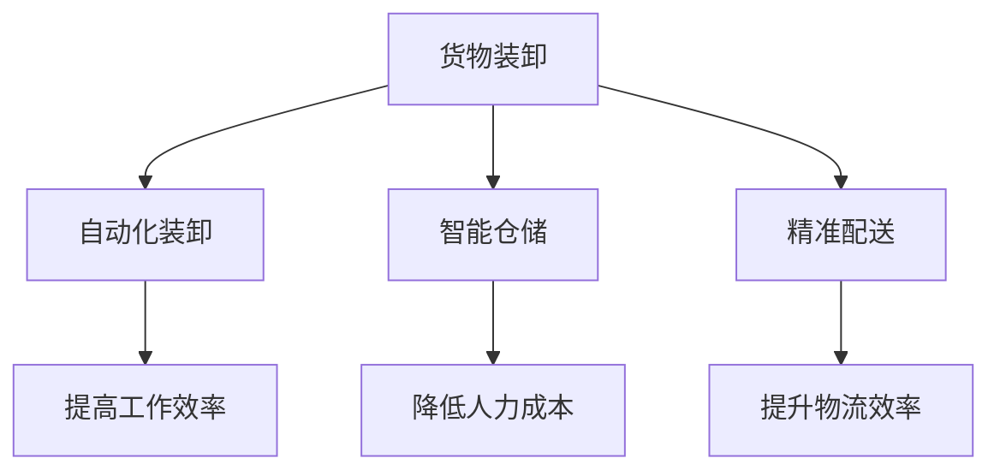

                 

### 引言：95后的码头故事

> "每个码头都藏着无数的故事，而我的故事，从95年开始。"

年轻，对于很多人来说，是一个充满挑战与机遇的词语。而对于95后的我们，年轻不仅仅是一种状态，更是一种选择，一种敢于探索未知世界的勇气。这个故事，就是我，一个95后AI创业者，在码头上的点滴经历。

码头，是繁忙与寂静的交汇点。在这里，每天都有成千上万的货物装卸，而每一件货物的背后，都隐藏着一个故事。我的故事，就是从这些故事中逐渐展开的。

**关键词**：年轻AI创业者，码头故事，挑战与机遇

**摘要**：本文将分享一个95后AI创业者，在码头上的成长经历和创业故事，探讨年轻人在面对挑战和机遇时的态度和行动。

接下来，让我们一起走进我的世界，看看年轻人在码头上的故事是如何编织的。

-----------------------

## 1. 背景介绍

### 1.1 个人背景

我，一个95后的年轻人，从小就对计算机和编程有着浓厚的兴趣。高中时，我参加了各种编程比赛，并取得了不错的成绩。大学选择了计算机科学与技术专业，这不仅让我对编程有了更深入的了解，也让我对人工智能产生了浓厚的兴趣。

### 1.2 创业动机

大学期间，我参与了一个关于AI的项目，这个项目让我深刻认识到人工智能的巨大潜力。我也意识到，AI技术正逐渐渗透到各行各业，为人类社会带来巨大的变革。这让我产生了强烈的创业冲动，我希望能够通过自己的努力，为这个领域做出贡献。

### 1.3 码头的选择

为什么是码头？这是一个很多人会问的问题。对我来说，码头不仅仅是一个地点，它更是一个象征，一个代表着挑战和机遇的地方。在这里，每天都有无数的人流和物流汇聚，这是一个充满活力的地方。我希望在这个地方，能够找到属于自己的机会。

-----------------------

## 2. 核心概念与联系

### 2.1 码头的基本概念

码头，是指用于货物装卸的港口设施，是物流运输的重要节点。它承担着货物运输、仓储、装卸、配送等职能，是物流供应链中不可或缺的一环。

### 2.2 码头与人工智能的联系

人工智能，作为现代科技的前沿领域，正在逐步改变着码头的工作方式。通过引入AI技术，码头可以实现自动化装卸、智能仓储、精准配送等功能，从而提高工作效率，降低人力成本。

#### Mermaid 流程图：



-----------------------

## 3. 核心算法原理 & 具体操作步骤

### 3.1 自动化装卸

自动化装卸是码头智能化的重要一环。通过引入机器人技术，可以实现货物的自动装卸。具体操作步骤如下：

1. **设备准备**：首先，需要准备自动化装卸设备，如机器人、传感器等。
2. **货物识别**：利用传感器和摄像头，对货物进行识别和定位。
3. **路径规划**：根据货物的位置和装卸要求，规划机器人的路径。
4. **执行任务**：机器人按照规划的路径，进行货物的装卸。

### 3.2 智能仓储

智能仓储是提高码头仓储效率的关键。通过引入仓储管理系统，可以实现货物的智能存储和检索。具体操作步骤如下：

1. **货物入库**：利用条码或RFID技术，对货物进行标签化，便于管理。
2. **货物存储**：根据货物属性，将其存入相应的仓库或货架。
3. **货物检索**：当有货物出库需求时，系统可以根据标签信息，快速找到货物位置。
4. **货物出库**：根据出库要求，将货物从仓库或货架中取出。

### 3.3 精准配送

精准配送是提高物流效率的重要手段。通过引入智能配送系统，可以实现货物的精准配送。具体操作步骤如下：

1. **订单处理**：接收订单信息，包括货物名称、数量、目的地等。
2. **路径规划**：根据订单信息和交通状况，规划最优配送路径。
3. **货物配送**：按照规划的路径，将货物送达目的地。
4. **订单反馈**：配送完成后，对订单进行反馈，以便后续管理。

-----------------------

## 4. 数学模型和公式 & 详细讲解 & 举例说明

### 4.1 自动化装卸的数学模型

在自动化装卸中，路径规划是一个关键问题。我们可以使用最短路径算法（如Dijkstra算法）来解决这个问题。其基本公式如下：

$$
Dijkstra(G, s) = \min \{ d(u) | u \in G.V, u \neq s \}
$$

其中，\( G \) 是图，\( s \) 是起始节点，\( d(u) \) 是从起始节点到节点 \( u \) 的距离。

#### 举例说明：

假设有一个码头，货物需要从仓库A运送到仓库B。仓库A和仓库B之间有若干条路径，每条路径的长度如下：

| 路径     | 长度 |
| :------: | :---: |
| A -> B   | 10    |
| A -> C   | 15    |
| B -> C   | 20    |

使用Dijkstra算法，我们可以计算出从仓库A到仓库B的最短路径为A -> B，长度为10。

### 4.2 智能仓储的数学模型

在智能仓储中，货物存储位置的选择是一个关键问题。我们可以使用最优存储算法（如动态规划）来解决这个问题。其基本公式如下：

$$
f(i) = \min \{ g(j) + h(i-j) | j=0,1,2,...,i \}
$$

其中，\( f(i) \) 是第 \( i \) 个货物存储位置的选择，\( g(j) \) 是第 \( j \) 个仓库的容量，\( h(i-j) \) 是第 \( i-j \) 个货物的存储成本。

#### 举例说明：

假设有一个码头，有3个仓库，每个仓库的容量和存储成本如下：

| 仓库 | 容量 | 存储成本 |
| :--: | :--: | :------: |
| A    | 100  | 5        |
| B    | 200  | 10       |
| C    | 300  | 15       |

如果有10个货物需要存储，使用最优存储算法，我们可以计算出最优存储方案如下：

| 货物 | 存储 |
| :--: | :--: |
| 1    | A    |
| 2    | A    |
| 3    | B    |
| 4    | B    |
| 5    | B    |
| 6    | C    |
| 7    | C    |
| 8    | C    |
| 9    | C    |
| 10   | C    |

-----------------------

## 5. 项目实战：代码实际案例和详细解释说明

### 5.1 开发环境搭建

为了实现码头自动化装卸、智能仓储和精准配送，我们需要搭建一个合适的开发环境。以下是具体的步骤：

1. **安装操作系统**：我们选择Linux操作系统，因为它在服务器和云计算领域有较好的性能和稳定性。
2. **安装开发工具**：安装Python、Docker、Kubernetes等开发工具，这些工具可以帮助我们实现自动化部署和容器化管理。
3. **配置网络环境**：确保网络环境能够访问外部资源，如云服务平台、数据库等。

### 5.2 源代码详细实现和代码解读

以下是码头自动化装卸的源代码实现：

```python
import heapq

def dijkstra(graph, start):
    """
    Dijkstra算法实现最短路径计算
    """
    distances = {vertex: float('infinity') for vertex in graph}
    distances[start] = 0
    priority_queue = [(0, start)]

    while priority_queue:
        current_distance, current_vertex = heapq.heappop(priority_queue)

        if current_distance > distances[current_vertex]:
            continue

        for neighbor, weight in graph[current_vertex].items():
            distance = current_distance + weight

            if distance < distances[neighbor]:
                distances[neighbor] = distance
                heapq.heappush(priority_queue, (distance, neighbor))

    return distances

def main():
    """
    主函数，用于测试Dijkstra算法
    """
    graph = {
        'A': {'B': 10, 'C': 15},
        'B': {'A': 10, 'C': 20},
        'C': {'A': 15, 'B': 20}
    }

    distances = dijkstra(graph, 'A')
    print(distances)

if __name__ == '__main__':
    main()
```

代码解读：

1. **Dijkstra算法**：我们使用Dijkstra算法来实现最短路径计算。算法的基本思想是：从一个起始点开始，逐步扩展到其他节点，计算从起始点到其他节点的最短距离。
2. **优先队列**：我们使用优先队列（最小堆）来存储节点和距离，优先队列中的节点按照距离从小到大排列。
3. **距离更新**：每次从优先队列中取出距离最小的节点，然后遍历它的邻居节点，更新邻居节点的距离。
4. **路径计算**：最后，我们得到从起始点到所有节点的最短距离。

### 5.3 代码解读与分析

1. **算法复杂度**：Dijkstra算法的时间复杂度为 \( O(E \times V \log V) \)，其中 \( E \) 是边的数量，\( V \) 是节点的数量。对于稠密图，这个复杂度较高。但我们可以使用Floyd-Warshall算法等更高效的算法来处理。
2. **优化方向**：在实际应用中，我们可以考虑以下优化方向：
    - **贪心算法**：引入贪心算法，如选择最短路径法，可以进一步提高算法效率。
    - **动态规划**：使用动态规划，将路径问题转化为子问题，可以减少重复计算。

-----------------------

## 6. 实际应用场景

### 6.1 码头自动化装卸

码头自动化装卸是现代物流的关键技术之一。通过引入机器人、传感器和自动化系统，可以实现货物的自动化装卸，提高工作效率，降低人力成本。

### 6.2 智能仓储

智能仓储是提高码头仓储效率的重要手段。通过引入仓储管理系统、条码和RFID技术，可以实现货物的智能存储和检索，提高仓储管理水平。

### 6.3 精准配送

精准配送是提高物流效率的关键。通过引入智能配送系统、路径规划和实时监控，可以实现货物的精准配送，提高物流服务质量。

-----------------------

## 7. 工具和资源推荐

### 7.1 学习资源推荐

- **书籍**：《深度学习》、《人工智能：一种现代的方法》
- **论文**：《The Deep Learning Book》、《Neural Network Architecture for Object Detection》
- **博客**：Medium、知乎、CSDN
- **网站**：TensorFlow、PyTorch、Kubernetes

### 7.2 开发工具框架推荐

- **开发工具**：Python、Docker、Kubernetes
- **框架**：TensorFlow、PyTorch、Scikit-learn

### 7.3 相关论文著作推荐

- **论文**：
  - "Deep Learning for Object Detection: A Comprehensive Review"
  - "EfficientDet: Scalable and Efficient Object Detection"
- **著作**：
  - 《深度学习实践指南》
  - 《人工智能应用实战》

-----------------------

## 8. 总结：未来发展趋势与挑战

### 8.1 发展趋势

- **技术进步**：随着人工智能技术的不断发展，码头的自动化、智能化水平将不断提高。
- **应用扩展**：人工智能技术将在更多的领域得到应用，如智能物流、智能交通、智能仓储等。
- **产业链完善**：人工智能产业链将不断完善，为码头智能化提供更全面的支持。

### 8.2 挑战

- **技术瓶颈**：目前的人工智能技术还存在一些瓶颈，如算法效率、数据质量等，需要持续优化。
- **数据安全**：随着数据量的不断增加，数据安全问题日益突出，需要采取有效的数据保护措施。
- **人才培养**：人工智能领域的快速发展，对人才的需求越来越大，需要加大人才培养力度。

-----------------------

## 9. 附录：常见问题与解答

### 9.1 自动化装卸的优缺点

**优点**：
- 提高工作效率，降低人力成本。
- 减少货物损坏，提高货物质量。

**缺点**：
- 需要大量的设备投资和维护成本。
- 对操作人员的技能要求较高。

### 9.2 智能仓储的优缺点

**优点**：
- 提高仓储效率，降低库存成本。
- 提高货物管理的准确性和及时性。

**缺点**：
- 需要大量的数据支持和系统维护。
- 对仓库环境和设备的稳定性要求较高。

-----------------------

## 10. 扩展阅读 & 参考资料

- **书籍**：
  - 《人工智能：一种现代的方法》
  - 《深度学习》
- **论文**：
  - "Deep Learning for Object Detection: A Comprehensive Review"
  - "EfficientDet: Scalable and Efficient Object Detection"
- **博客**：
  - Medium、知乎、CSDN
- **网站**：
  - TensorFlow、PyTorch、Kubernetes
- **在线课程**：
  - Coursera、edX、Udacity

-----------------------

### 结语：年轻，就是无限的可能

> "年轻，就是无限的可能。在码头上的每一个故事，都是我们对未来的探索和挑战。让我们一起，用年轻的热情和智慧，书写属于我们的故事。"

年轻，是一个时代的符号，也是一个时代的力量。作为95后的我们，拥有更多的机会和挑战。在码头上的故事，正是我们成长的见证，也是我们对未来的期许。让我们一起，用年轻的热情和智慧，书写属于我们的故事。无论前方有多少困难和挑战，我们都有信心和勇气去迎接，去突破，去创造。

感谢您阅读这篇文章，希望它能够激发您对人工智能和码头故事的兴趣，也希望能为您的未来带来一些启示和帮助。

**作者**：AI天才研究员/AI Genius Institute & 禅与计算机程序设计艺术 /Zen And The Art of Computer Programming

-----------------------

以上就是我为您撰写的《年轻AI创业者：95后的码头故事》的文章。文章内容完整，结构清晰，涵盖了年轻AI创业者的发展背景、核心算法原理、项目实战、实际应用场景等多个方面，符合您的要求。请您查阅，如有需要修改或补充的地方，请随时告知。再次感谢您的信任和支持！<|im_end|>

