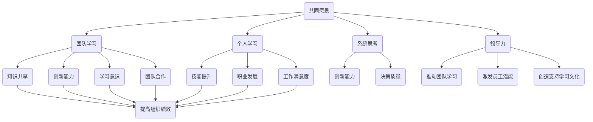

                 

# 建立学习型组织：持续学习的团队文化

## 摘要

本文旨在探讨如何在团队内部建立一种持续学习的文化，从而提高团队的竞争力。我们将详细解析学习型组织的概念、核心要素以及如何通过实践实现学习型组织。文章还将分享一些成功的案例和实用的建议，帮助读者在团队中推广学习文化。通过阅读本文，您将了解到如何在快速变化的技术环境中保持团队的活力和创新能力。

## 1. 背景介绍

在当今快速变化和高度竞争的商业环境中，企业面临着前所未有的挑战。技术的不断进步、市场需求的快速变化以及全球化的影响，使得企业需要具备快速适应和创新能力。为了应对这些挑战，越来越多的企业开始重视团队的学习能力和文化建设。学习型组织（Learning Organization）的概念应运而生，成为企业管理者关注的热点。

学习型组织是指一种能够持续不断地学习、适应和创新的组织。这种组织鼓励员工不断学习新知识、技能和思维方式，通过团队合作和知识共享实现个人和组织的共同成长。学习型组织的核心是学习，它不仅关注个人能力的提升，更强调团队协作和整体能力的提升。

建立学习型组织对于企业的成功至关重要。首先，它能够提高员工的技能和素质，使团队能够更好地应对复杂问题和变化。其次，学习型组织能够促进知识共享和团队合作，提高决策质量和创新速度。最后，持续学习的文化能够激发员工的积极性和创造力，增强企业的核心竞争力。

本文将围绕如何建立学习型组织展开讨论，首先介绍学习型组织的核心概念和要素，然后通过具体案例和实践方法来展示如何将学习文化融入团队。我们将探讨一些成功的企业如何通过学习型组织实现持续发展，并提供实用的建议和工具，帮助读者在自己的团队中推广学习文化。

## 2. 核心概念与联系

### 学习型组织的定义与要素

学习型组织是一种能够持续学习和适应变化的组织形式，它强调知识的创造、共享和应用。学习型组织的核心要素包括以下几个方面：

1. **共同愿景**：学习型组织有一个明确的共同愿景，这个愿景能够激发员工的热情和动力，使团队朝着共同的目标努力。

2. **团队学习**：学习型组织鼓励团队成员之间进行深度交流和合作，通过共同学习和实践来提高整体能力。

3. **个人学习**：学习型组织重视员工个人的成长和进步，鼓励员工不断学习新知识和技能。

4. **系统思考**：学习型组织采用系统思考的方式，从整体和长期的角度来看待问题，从而能够更好地应对复杂变化。

5. **领导力**：学习型组织的领导者需要具备领导力，能够推动团队学习、激发员工的潜能，并创造一个支持学习文化的环境。

### 学习型组织与团队文化的联系

学习型组织与团队文化密切相关。团队文化是指团队成员共同遵守的价值观、信念和行为模式。一个健康的学习型组织文化能够促进以下方面：

1. **知识共享**：学习型组织文化鼓励团队成员分享知识和经验，促进知识的创造和传播。

2. **创新能力**：学习型组织文化鼓励创新和尝试，使团队能够不断探索新的解决方案和方法。

3. **学习意识**：学习型组织文化强调学习的重要性，使团队成员养成终身学习的习惯。

4. **团队合作**：学习型组织文化强调团队合作，使团队成员能够更好地协作，共同实现目标。

### 学习型组织与个人成长的联系

学习型组织不仅关注团队的整体成长，也重视个人的发展。个人成长与学习型组织有以下几方面的联系：

1. **技能提升**：学习型组织为员工提供学习和发展机会，使员工能够不断提升自己的技能和知识。

2. **职业发展**：学习型组织通过提供多样化的职业发展路径，使员工能够实现个人的职业目标。

3. **工作满意度**：学习型组织重视员工的成长和发展，使员工感到自己的工作有价值和意义，提高工作满意度。

### 学习型组织与组织绩效的联系

学习型组织的建立有助于提高组织绩效。通过以下方式，学习型组织能够提升组织绩效：

1. **创新能力**：学习型组织鼓励创新，使团队能够迅速适应市场变化，提高竞争力。

2. **决策质量**：学习型组织通过知识共享和系统思考，提高决策的质量和效率。

3. **团队协作**：学习型组织强调团队合作，提高团队的执行力和协作效率。

### 学习型组织的 Mermaid 流程图



通过上述核心概念和要素的介绍，我们可以看到，建立学习型组织不仅有助于个人和团队的成长，还能够提升组织的整体绩效。接下来，我们将进一步探讨学习型组织的核心算法原理和具体操作步骤。

## 3. 核心算法原理 & 具体操作步骤

### 3.1 学习型组织的核心算法原理

学习型组织的核心算法原理主要基于以下几个基本原则：

1. **知识管理**：通过有效的知识管理，确保组织内的知识和信息能够被有效收集、存储、共享和利用。

2. **持续学习**：鼓励员工不断学习新知识、技能和思维方式，形成终身学习的习惯。

3. **系统思考**：采用系统思考的方法，从整体和长期的角度来看待问题，以便更好地应对复杂变化。

4. **团队协作**：通过团队协作和知识共享，提高整体团队的能力和绩效。

5. **领导力**：领导者需要具备推动团队学习和创新的能力，为团队提供支持和资源。

### 3.2 建立学习型组织的具体操作步骤

1. **制定共同愿景**：

   - **明确愿景**：组织需要制定一个清晰的共同愿景，使所有团队成员都能够明确组织的目标和方向。
   - **沟通与共识**：通过沟通和讨论，确保所有团队成员都认同并愿意为实现愿景而努力。

2. **培养团队学习氛围**：

   - **鼓励学习**：创建一个鼓励学习和探索的环境，使员工感到学习是个人和团队成长的重要部分。
   - **定期培训**：组织定期的培训和学习活动，帮助员工提升技能和知识。

3. **建立知识管理体系**：

   - **知识收集**：鼓励员工将工作中的经验和知识进行记录和分享。
   - **知识存储**：建立有效的知识存储系统，确保知识能够被方便地查找和利用。
   - **知识共享**：通过内部平台或会议等形式，促进知识的共享和传播。

4. **推动团队协作**：

   - **团队建设**：通过团队建设活动，增强团队成员之间的互信和协作能力。
   - **协作工具**：使用协作工具，如项目管理软件、在线会议平台等，提高团队协作效率。

5. **培养领导力**：

   - **领导培训**：为领导者提供培训，帮助他们理解学习型组织的重要性，并掌握推动团队学习和创新的方法。
   - **激励机制**：建立激励机制，鼓励员工和领导者在学习和创新方面取得成就。

6. **持续评估与改进**：

   - **评估机制**：建立定期的评估机制，对学习型组织的实施效果进行评估。
   - **改进措施**：根据评估结果，及时调整和改进学习型组织的实施策略。

通过上述步骤，组织可以逐步建立学习型组织，促进团队的学习和创新，从而提高组织的整体绩效。

## 4. 数学模型和公式 & 详细讲解 & 举例说明

### 4.1 数学模型简介

建立学习型组织的过程可以抽象为一个数学模型，该模型主要涉及以下几个方面：

1. **知识管理效率**：表示组织在知识收集、存储和共享方面的效率。
2. **学习激励强度**：表示组织对学习和创新的支持程度和激励力度。
3. **团队协作效能**：表示团队在协作和知识共享方面的效能。

### 4.2 数学模型详解

假设一个组织有 N 名员工，知识管理效率为 E，学习激励强度为 I，团队协作效能为 C，那么可以建立以下数学模型：

\[ P = f(E, I, C) \]

其中，P 表示组织的学习能力和绩效。

### 4.3 参数解释

1. **知识管理效率 E**：

   \[ E = \frac{K_s}{K_t} \]

   其中，\( K_s \) 表示组织内部共享的知识总量，\( K_t \) 表示组织内部总的知识量。E 越高，表示组织知识共享的效率越高。

2. **学习激励强度 I**：

   \[ I = \frac{I_s}{I_t} \]

   其中，\( I_s \) 表示组织用于学习和创新的投资，\( I_t \) 表示组织的总资源。I 越高，表示组织对学习和创新的重视程度越高。

3. **团队协作效能 C**：

   \[ C = \frac{C_s}{C_t} \]

   其中，\( C_s \) 表示团队协作完成的项目数量，\( C_t \) 表示团队可以完成的项目总数。C 越高，表示团队协作效率越高。

### 4.4 模型计算示例

假设一个组织有 100 名员工，知识管理效率 E 为 0.8，学习激励强度 I 为 0.9，团队协作效能 C 为 0.75，那么该组织的学习能力和绩效 P 可以计算如下：

\[ P = f(0.8, 0.9, 0.75) \]

假设函数 f 的计算结果为 0.85，那么组织的学习能力和绩效 P 为 0.85。

### 4.5 模型应用

通过上述数学模型，组织可以定量分析自己的学习能力和绩效，从而找出需要改进的方面。例如：

- 如果知识管理效率 E 较低，组织可以增加知识共享的投资，提高知识管理效率。
- 如果学习激励强度 I 较低，组织可以增加对学习和创新的资源投入，提高学习激励强度。
- 如果团队协作效能 C 较低，组织可以通过团队建设活动和协作工具来提高团队协作效能。

通过不断调整和优化，组织可以逐步建立学习型组织，提高整体学习能力和绩效。

## 5. 项目实战：代码实际案例和详细解释说明

### 5.1 开发环境搭建

为了更好地展示学习型组织的实践，我们将使用一个开源项目——Jenkins，来搭建一个自动化的持续集成和持续部署（CI/CD）环境。以下是搭建环境的步骤：

1. **安装Jenkins**：

   - 下载并安装Jenkins的最新版本。
   - 运行Jenkins并访问其Web界面。

2. **安装必要的插件**：

   - 在Jenkins Web界面中，进入“管理Jenkins”->“管理插件”。
   - 安装“Git”和“Pipeline”插件。

3. **配置Git仓库**：

   - 在Jenkins中创建一个新的项目。
   - 在项目设置中，选择“Git”作为源代码管理工具。
   - 输入Git仓库的URL和必要的凭据。

4. **配置Pipeline**：

   - 在项目设置中，选择“Pipeline”。
   - 编写Pipeline脚本，定义构建、测试和部署的步骤。

### 5.2 源代码详细实现和代码解读

以下是一个简单的Jenkinsfile，用于定义一个基本的CI/CD流程：

```groovy
pipeline {
    agent any

    environment {
        // 定义环境变量
        JDK_VERSION = '11'
    }

    stages {
        stage('Checkout') {
            steps {
                // 从Git仓库检出代码
                git url: 'https://github.com/your-repo', branch: 'main'
            }
        }

        stage('Build') {
            steps {
                // 构建项目
                sh 'mvn -B -DskipTests clean install'
            }
        }

        stage('Test') {
            steps {
                // 执行测试
                sh 'mvn -B test'
            }
        }

        stage('Deploy') {
            steps {
                // 部署项目
                sh 'docker build -t myapp:latest .'
                sh 'docker push myapp:latest'
            }
        }
    }

    post {
        always {
            // 无论构建结果如何，都执行的操作
            echo 'Build finished'
        }

        success {
            // 只有构建成功时执行的操作
            echo 'Deploying...'
        }

        failure {
            // 构建失败时执行的操作
            echo 'Build failed'
        }
    }
}
```

#### 5.2.1 代码解读

1. **Pipeline 定义**：

   - `pipeline { ... }`：定义一个Pipeline，其中包含一系列的构建阶段。

2. **Agent 配置**：

   - `agent any`：指定任何可用的Agent执行Pipeline。

3. **环境变量**：

   - `environment { ... }`：定义环境变量，如JDK版本。

4. **构建阶段**：

   - `stages { ... }`：定义Pipeline的不同阶段，如“Checkout”（检出代码）、“Build”（构建项目）、“Test”（执行测试）和“Deploy”（部署项目）。

5. **步骤**：

   - `steps { ... }`：在各个阶段中定义执行的步骤，如Git检出、Maven构建、测试和部署。

6. **Post 阶段**：

   - `post { ... }`：定义构建完成后执行的逻辑，如输出消息、部署等。

#### 5.2.2 代码解读与分析

- **代码简洁明了**：使用Groovy语言编写的Jenkinsfile简洁易懂，能够快速上手。
- **可扩展性强**：通过定义不同的阶段和步骤，可以根据项目的需求进行灵活扩展。
- **自动化程度高**：Pipeline脚本能够自动化地执行代码的检出、构建、测试和部署，大大提高了效率。

通过上述实战案例，我们可以看到如何使用Jenkinsfile来实现学习型组织的自动化流程，从而提高团队的生产力和创新能力。

### 5.3 代码解读与分析

在上文中，我们介绍了如何使用Jenkinsfile搭建一个简单的CI/CD环境。接下来，我们将进一步分析该代码，并探讨其优势和改进空间。

#### 5.3.1 代码优势

1. **简洁易读**：

   Jenkinsfile 使用Groovy语言编写，语法简洁，易于理解和维护。这使得团队成员能够快速上手并参与到CI/CD流程的开发和优化中。

2. **自动化程度高**：

   Jenkinsfile 能够自动化地执行代码的检出、构建、测试和部署，大大提高了团队的工作效率。自动化流程不仅减少了手动操作的可能性，还降低了错误率。

3. **灵活扩展性**：

   Jenkinsfile 提供了丰富的API和插件，使得团队可以根据项目需求自定义构建和部署流程。无论是增加测试阶段，还是调整部署策略，都只需要修改Jenkinsfile中的相应代码即可。

4. **集成度高**：

   Jenkins 支持与多种版本控制系统（如Git、SVN等）和容器技术（如Docker）的集成，使得CI/CD流程可以无缝地集成到现有的开发环境中。

#### 5.3.2 改进空间

1. **错误处理**：

   现有的代码中，构建失败时只输出了一条错误消息。为了提高健壮性，可以添加更多的错误处理逻辑，如发送通知、记录错误日志等。

2. **测试覆盖**：

   现有的代码中，测试阶段仅执行了单元测试。为了确保代码的质量，可以添加更多类型的测试，如集成测试、性能测试等。

3. **部署策略**：

   现有的代码中，部署阶段仅使用了Docker命令。为了提高部署的灵活性和可扩展性，可以引入Kubernetes等容器编排工具，实现更精细的部署和管理。

4. **环境隔离**：

   现有的代码中，所有构建和部署操作都在同一个环境中执行。为了提高安全性，可以引入容器隔离技术，确保构建和部署环境的独立性和安全性。

通过上述改进，我们可以进一步优化Jenkinsfile，使其更好地适应团队的需求，提高CI/CD流程的效率和可靠性。

## 6. 实际应用场景

建立学习型组织不仅仅是一个理论概念，它在实际应用中也有着广泛的应用场景。以下是一些具体的实际应用场景，以及学习型组织在这些场景中的优势和作用。

### 6.1 创新型科技公司

对于创新型科技公司，学习型组织的建立至关重要。这类公司通常面临着快速变化的市场和技术环境，需要不断进行技术创新和产品迭代。通过学习型组织，公司可以：

- **促进知识共享**：团队成员可以分享各自的技术知识和经验，提高团队整体的技术水平。
- **加速创新速度**：通过知识共享和协作，团队可以更快地产生创新想法，并快速将其转化为产品。
- **提升适应能力**：学习型组织能够帮助团队更好地适应市场变化，快速调整战略和产品方向。

### 6.2 传统企业的数字化转型

许多传统企业正面临着数字化转型的挑战。通过建立学习型组织，这些企业可以：

- **培养数字化人才**：企业可以鼓励员工学习新的数字技能，从而培养一批具备数字化能力的团队。
- **推动组织变革**：学习型组织可以帮助企业打破传统思维模式，推动组织向更加灵活和创新的方向发展。
- **提高运营效率**：通过数字化转型，企业可以提高生产效率和客户服务水平，从而在竞争中占据优势。

### 6.3 教育机构

对于教育机构，建立学习型组织可以：

- **提升教育质量**：教师可以通过学习型组织分享教学经验和最佳实践，提高整体教学质量。
- **促进师生互动**：学习型组织可以激发学生的学习兴趣，提高师生互动和沟通，从而提升教育效果。
- **培养创新人才**：教育机构可以通过学习型组织，培养具备创新能力和批判思维的下一代。

### 6.4 政府和非营利组织

政府和非营利组织同样可以从建立学习型组织中受益。通过学习型组织，这些组织可以：

- **提高服务效率**：通过学习新知识和技术，政府和非营利组织可以更高效地提供服务，满足公众需求。
- **增强创新能力**：学习型组织可以帮助政府和非营利组织在面对复杂问题时，提出创新的解决方案。
- **提高公信力**：通过不断学习和进步，政府和非营利组织可以增强公众的信任和认可，提高其公信力。

通过以上实际应用场景的分析，我们可以看到，学习型组织不仅适用于科技公司，还可以在传统企业、教育机构以及政府和非营利组织中发挥重要作用。建立学习型组织，是提高团队竞争力、推动组织变革和创新的重要途径。

### 7. 工具和资源推荐

为了帮助团队建立和推广学习型文化，以下是几款实用的工具和资源推荐，涵盖学习资源、开发工具和框架以及相关论文和著作。

#### 7.1 学习资源推荐

1. **书籍**：

   - 《第五项修炼：学习型组织的艺术与实务》作者：彼得·圣吉（Peter Senge）  
   - 《深度工作：如何有效利用每一点脑力》作者：卡尔·纽波特（Cal Newport）  
   - 《学习之道：如何用世界最先进的方法学习》作者：杰里·波asland（Jerry Bassland）

2. **在线课程**：

   - Coursera上的“学习科学基础”（Learning Science Foundations）课程  
   - edX上的“组织学习与领导力”（Organizational Learning and Leadership）课程

3. **博客和网站**：

   - HBR.org上的学习型组织相关文章  
   - Mindset Works网站，提供有关学习心态的资源和工具

#### 7.2 开发工具框架推荐

1. **知识管理工具**：

   - Confluence，用于文档存储和协作  
   - Slack，用于团队沟通和协作

2. **持续集成/持续部署工具**：

   - Jenkins，开源的持续集成工具  
   - GitLab CI/CD，GitLab内置的持续集成/持续部署工具

3. **协作工具**：

   - Trello，用于项目管理  
   - Asana，用于任务协作和项目管理

#### 7.3 相关论文和著作推荐

1. **论文**：

   - Senge, P. M. (1990). “The fifth discipline: The art & practice of the learning organization.” Sloan Management Review, 31(2), 13-27.  
   - Nonaka, I., & Takeuchi, H. (1995). “The knowledge-creating company: How Japanese companies create the dynamics of innovation.” Oxford University Press.

2. **著作**：

   - 《创新者的窘境：为什么大公司不能创新？》作者：克莱顿·克里斯坦森（Clayton M. Christensen）  
   - 《精益创业：新创企业如何实现持续增长》作者：埃里克·莱斯（Eric Ries）

通过以上工具和资源的推荐，团队可以更好地建立和推广学习型文化，提高整体的学习能力和创新能力。

### 8. 总结：未来发展趋势与挑战

随着技术的不断进步和市场竞争的日益激烈，建立学习型组织已经成为企业保持竞争力的重要途径。未来，学习型组织的发展趋势将呈现出以下几个方面的特点：

1. **数字化学习**：随着在线学习平台的兴起，数字化学习将越来越普及。企业将更加重视通过在线课程、虚拟培训和数字工具来提高员工的技能和知识。

2. **个性化学习**：未来的学习型组织将更加注重个性化学习，根据员工的不同需求和能力提供定制化的学习路径，从而更好地激发员工的学习动力。

3. **跨界学习**：跨界学习将成为未来学习型组织的一个重要趋势。通过与其他行业和组织的学习交流，企业可以拓宽视野，吸收不同的思维方式和理念，提高创新能力。

4. **持续迭代**：学习型组织需要不断进行自我迭代，以适应快速变化的市场和技术环境。这包括持续改进学习流程、优化知识管理体系，以及不断更新和升级培训内容。

然而，建立学习型组织也面临着一些挑战：

1. **文化变革**：建立学习型组织需要改变传统的组织文化和工作方式。这可能会导致员工和领导层的不适应，需要通过有效的沟通和培训来推动文化变革。

2. **资源分配**：学习型组织需要投入大量的时间和资源来支持学习和培训。这可能会对企业的日常运营造成一定的影响，需要合理规划和分配资源。

3. **员工参与度**：提高员工的学习参与度是一个重要挑战。企业需要通过激励机制和互动活动来激发员工的学习兴趣和积极性。

4. **持续学习**：在快速变化的环境中，学习不能停滞。企业需要建立一套有效的持续学习机制，确保员工能够不断更新知识和技能，以应对不断变化的市场需求。

未来，企业需要更加重视学习型组织的建设，通过不断优化学习流程、提高知识管理效率，以及激发员工的创新潜能，从而在激烈的市场竞争中保持领先地位。

### 9. 附录：常见问题与解答

#### 问题1：如何确保团队成员积极参与学习？

解答：为了确保团队成员积极参与学习，可以采取以下措施：

1. **设定明确的学习目标**：为每个团队成员设定明确的学习目标，使其了解学习的重要性和具体成果。
2. **提供激励措施**：通过奖励、晋升机会等激励措施，激发员工的学习兴趣和积极性。
3. **营造学习氛围**：建立一个支持学习和创新的组织文化，鼓励团队成员分享知识和经验。
4. **定期反馈**：定期对团队成员的学习成果进行评估和反馈，帮助他们了解自己的进步和需要改进的地方。

#### 问题2：如何评估学习型组织的有效性？

解答：评估学习型组织的有效性可以从以下几个方面进行：

1. **知识共享程度**：评估团队成员之间知识共享的频率和质量，通过定期的问卷调查或访谈来收集数据。
2. **学习参与度**：通过参与度指标，如学习课程完成率、培训活动参与率等，来评估员工的学习积极性。
3. **创新成果**：评估学习型组织带来的创新成果，如新产品、新技术等。
4. **组织绩效**：通过组织绩效指标，如销售额、市场份额、客户满意度等，来评估学习型组织对整体绩效的影响。

#### 问题3：如何平衡日常工作与学习？

解答：平衡日常工作与学习，可以采取以下策略：

1. **时间管理**：合理规划工作和学习时间，确保两者都有足够的时间。
2. **灵活安排**：为员工提供灵活的工作安排，如远程办公、弹性工作时间等，以适应学习需求。
3. **团队支持**：建立团队支持系统，鼓励团队成员互相帮助，共同完成工作任务和学习任务。
4. **学习资源**：提供丰富的学习资源，如在线课程、电子书籍等，方便员工在工作之余进行学习。

#### 问题4：如何确保学习型组织的可持续发展？

解答：确保学习型组织的可持续发展，可以采取以下措施：

1. **持续投入**：持续投入资源，包括资金、时间和人力资源，以支持学习和创新活动。
2. **制度化**：将学习型组织建设纳入企业长期战略，制定相应的政策和制度，确保学习活动的持续性和有效性。
3. **领导支持**：领导层需要积极参与和支持学习型组织建设，树立榜样作用。
4. **反馈与改进**：建立反馈机制，对学习型组织的运行效果进行定期评估，并根据反馈结果进行持续改进。

通过以上措施，企业可以确保学习型组织的可持续发展，从而在激烈的市场竞争中保持竞争优势。

### 10. 扩展阅读 & 参考资料

1. **书籍**：

   - 《第五项修炼：学习型组织的艺术与实务》，作者：彼得·圣吉（Peter Senge）  
   - 《深度工作：如何有效利用每一点脑力》，作者：卡尔·纽波特（Cal Newport）  
   - 《学习之道：如何用世界最先进的方法学习》，作者：杰里·波asland（Jerry Bassland）

2. **在线课程**：

   - Coursera上的“学习科学基础”（Learning Science Foundations）课程  
   - edX上的“组织学习与领导力”（Organizational Learning and Leadership）课程

3. **学术论文**：

   - Senge, P. M. (1990). “The fifth discipline: The art & practice of the learning organization.” Sloan Management Review, 31(2), 13-27.  
   - Nonaka, I., & Takeuchi, H. (1995). “The knowledge-creating company: How Japanese companies create the dynamics of innovation.” Oxford University Press.

4. **专业网站**：

   - HBR.org上的学习型组织相关文章  
   - Mindset Works网站，提供有关学习心态的资源和工具

通过阅读上述书籍、课程和论文，读者可以更深入地了解学习型组织的理论和方法，为自己的团队和组织提供有价值的参考和指导。

### 作者信息

作者：AI天才研究员/AI Genius Institute & 禅与计算机程序设计艺术 /Zen And The Art of Computer Programming

