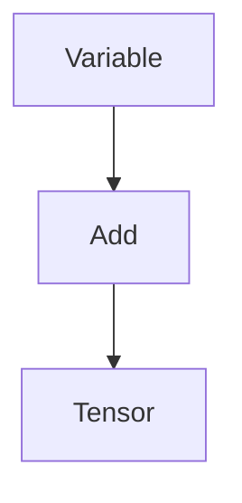
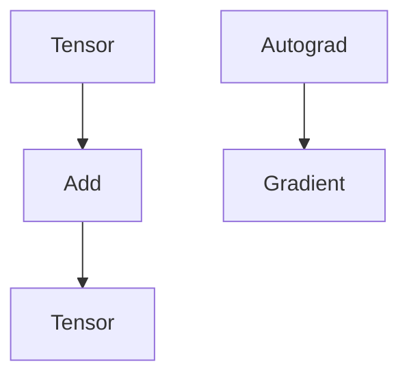
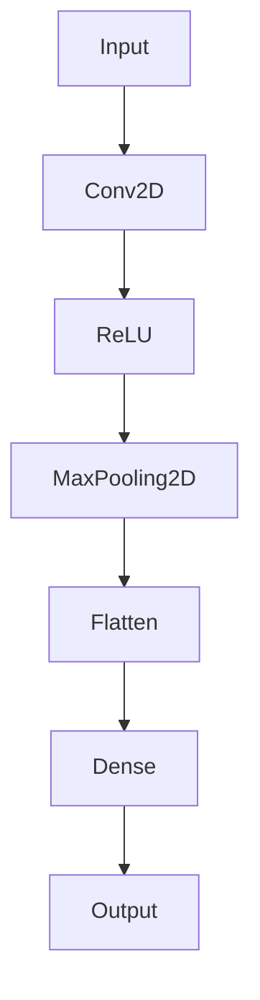
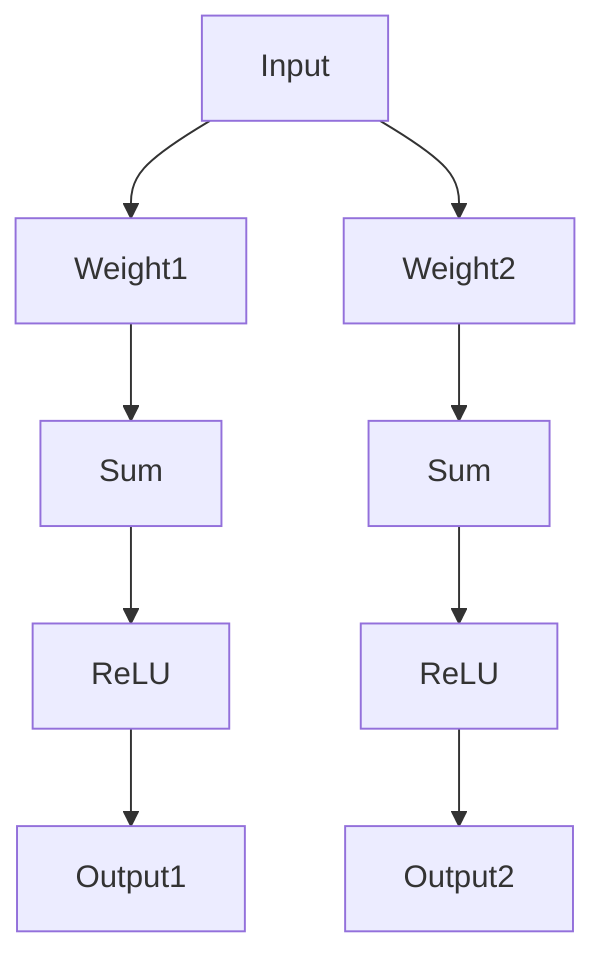
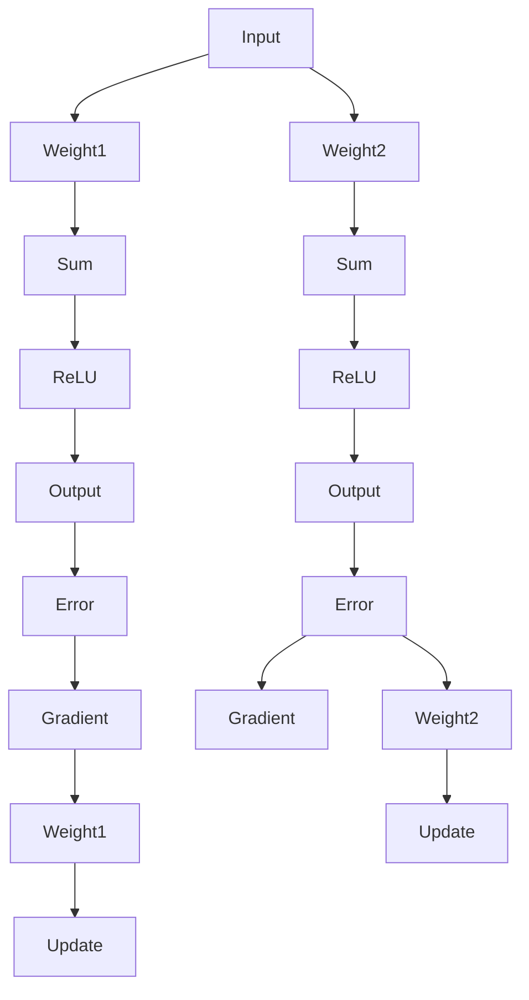

                 

### 背景介绍

开源人工智能（AI）框架已经成为机器学习和深度学习领域中的重要工具，为研究者、开发者提供了强大的支持和便利。在众多开源AI框架中，TensorFlow、PyTorch和Keras是最为流行的三个框架。这些框架不仅支持丰富的模型架构，还提供了便捷的API和强大的社区支持，使得深度学习在各个领域的应用得到了极大的推动。

TensorFlow是由Google开发的开源深度学习框架，最初在2015年发布。它以图（Graph）为核心概念，通过定义计算图来实现复杂的计算任务。TensorFlow的灵活性和强大的功能使其在学术界和工业界都获得了广泛的应用。

PyTorch是由Facebook的AI研究团队开发的深度学习框架，于2016年发布。PyTorch采用了动态计算图（Dynamic Graph）的概念，使得模型的构建和调试更加直观和灵活。其易于使用的API和强大的社区支持使其在深度学习领域迅速获得了大量用户。

Keras是一个高层次的神经网络API，可以运行在TensorFlow、Theano等底层框架之上。Keras的设计理念是简单和易于使用，通过简洁的API提供强大的功能，使得构建和训练神经网络更加方便快捷。

本文将对比TensorFlow、PyTorch和Keras这三个开源AI框架，分析它们的核心概念、算法原理、数学模型、实际应用场景以及工具和资源推荐，帮助读者更好地了解和使用这些框架。

### 核心概念与联系

在深入探讨TensorFlow、PyTorch和Keras之前，我们需要明确它们的核心概念和架构，以便更好地理解这些框架的优缺点。

#### TensorFlow

TensorFlow的核心概念是图（Graph）。图是由节点（Operations）和边（Tensors）构成的数学结构，用于表示复杂的计算过程。在TensorFlow中，开发者首先构建一个计算图，然后通过执行图来计算结果。TensorFlow的图主要包含以下组件：

1. **变量（Variables）**：用于存储模型中的可训练参数。
2. **操作（Operations）**：表示计算过程中的数学运算，如加法、矩阵乘法等。
3. **张量（Tensors）**：表示操作的结果，是TensorFlow中的基本数据类型。

以下是一个简单的TensorFlow计算图示例：



在这个示例中，变量A通过加法操作B生成一个张量C。

#### PyTorch

PyTorch的核心概念是动态计算图（Dynamic Graph）。与TensorFlow的静态图相比，PyTorch的动态图在运行时动态构建，使得模型的构建和调试更加直观。PyTorch的计算图包含以下组件：

1. **张量（Tensors）**：表示操作的结果，是PyTorch中的基本数据类型。
2. **自动微分（Autograd）**：用于自动计算梯度，支持反向传播。
3. **操作（Operations）**：表示计算过程中的数学运算，如加法、矩阵乘法等。

以下是一个简单的PyTorch计算图示例：



在这个示例中，张量A通过加法操作B生成张量C，同时自动微分系统计算梯度E。

#### Keras

Keras是一个高层次的神经网络API，可以运行在TensorFlow、Theano等底层框架之上。Keras的设计理念是简单和易于使用，通过简洁的API提供强大的功能。Keras的主要组件包括：

1. **层（Layers）**：用于构建神经网络的基本构建块，如全连接层、卷积层等。
2. **模型（Models）**：用于封装神经网络的结构和训练过程。
3. **优化器（Optimizers）**：用于更新模型参数的算法，如SGD、Adam等。

以下是一个简单的Keras模型示例：



在这个示例中，输入A通过卷积层B、ReLU激活函数C、最大池化层D、展平层E和全连接层F生成输出G。

通过上述核心概念的介绍，我们可以更好地理解TensorFlow、PyTorch和Keras这三个框架的基本架构和设计理念。

#### TensorFlow与PyTorch的对比

TensorFlow和PyTorch都是深度学习领域的强大框架，它们各有优缺点。下面从以下几个方面进行对比：

1. **图（Graph）与动态计算图（Dynamic Graph）**

   TensorFlow采用静态图，开发者需要预先定义整个计算图，然后执行图来计算结果。这种设计使得TensorFlow具有较好的性能优化，但同时也增加了开发者的复杂度。相反，PyTorch采用动态计算图，开发者可以更加直观地构建和调试模型。动态图的设计使得PyTorch在模型构建和调试方面具有更好的灵活性，但性能优化相对较差。

2. **API易用性**

   TensorFlow的API相对复杂，需要开发者熟悉其计算图的构建和执行过程。虽然TensorFlow提供了丰富的功能，但对于初学者来说，学习曲线相对较陡。PyTorch的API设计更加直观和简洁，开发者可以更加容易地构建和调试模型。这使得PyTorch在初学者中具有更高的接受度。

3. **社区支持**

   TensorFlow和PyTorch都拥有强大的社区支持。TensorFlow的社区较为庞大，提供了丰富的文档和教程，有助于开发者快速入门。PyTorch的社区发展迅速，特别是在学术界和工业界具有很高的活跃度。两个框架都提供了丰富的开源资源和工具，为开发者提供了极大的便利。

4. **性能优化**

   TensorFlow通过静态图优化，在性能方面具有优势。TensorFlow还提供了分布式计算支持，使得模型在大规模数据集上的训练更加高效。PyTorch在性能方面相对较弱，但其动态图的设计使得模型构建和调试更加灵活。在实际应用中，性能优化取决于具体的使用场景和需求。

#### Keras与TensorFlow、PyTorch的对比

Keras作为高层次的神经网络API，在易用性方面具有明显优势。Keras通过简洁的API封装了TensorFlow和Theano等底层框架的复杂操作，使得开发者可以更加容易地构建和训练神经网络。下面从以下几个方面对比Keras与TensorFlow、PyTorch：

1. **易用性**

   Keras的设计理念是简单和易于使用。通过简洁的API，Keras提供了一系列预定义的层、模型和优化器，使得神经网络构建更加直观。Keras还提供了丰富的示例和教程，有助于开发者快速入门。相比之下，TensorFlow和PyTorch的API相对复杂，需要开发者熟悉底层计算图和数学概念。

2. **灵活性**

   TensorFlow和PyTorch提供了更加底层的操作和工具，使得开发者可以更加灵活地构建和优化模型。Keras虽然简化了模型构建过程，但在灵活性方面相对较弱。在某些复杂场景下，开发者可能需要使用TensorFlow或PyTorch来满足特定需求。

3. **性能优化**

   Keras通过封装底层框架，使得性能优化相对较差。虽然在某些场景下Keras具有较好的性能，但在大规模数据集和复杂模型方面，TensorFlow和PyTorch具有更好的优化能力。因此，在实际应用中，选择框架时需要综合考虑性能需求和模型复杂度。

#### 总结

TensorFlow、PyTorch和Keras都是深度学习领域的重要框架，各具优缺点。TensorFlow具有较好的性能优化和丰富的功能，但在易用性方面相对较差。PyTorch具有灵活的动态计算图和强大的社区支持，适合模型构建和调试。Keras通过简洁的API提供强大的功能，适合快速构建和训练神经网络。在实际应用中，根据具体需求和场景选择合适的框架，可以更好地发挥深度学习技术的优势。

### 核心算法原理 & 具体操作步骤

在深入探讨TensorFlow、PyTorch和Keras的核心算法原理之前，我们需要了解深度学习中的一些基础概念，如神经网络、反向传播算法和优化器等。这些概念是构建和训练深度学习模型的基础。

#### 神经网络

神经网络（Neural Networks）是深度学习的基础。它由多个神经元（Neurons）组成，每个神经元通过权重（Weights）连接到其他神经元。神经网络的输入经过权重加权求和后，通过激活函数（Activation Function）产生输出。以下是一个简单的神经网络结构：



在这个示例中，输入A通过权重1和B连接到ReLU激活函数D，生成输出1；输入A通过权重2和F连接到ReLU激活函数G，生成输出2。

#### 反向传播算法

反向传播算法（Backpropagation Algorithm）是训练神经网络的核心。它通过计算输出层误差，逐步传播到输入层，并更新每个神经元的权重。反向传播算法主要包括以下几个步骤：

1. **前向传播**：将输入数据通过神经网络进行前向传播，计算每个神经元的输出。
2. **计算误差**：计算输出层实际输出与目标输出之间的误差。
3. **计算梯度**：计算每个权重和偏置的梯度，用于更新权重。
4. **权重更新**：使用梯度下降算法更新权重和偏置，减小误差。

以下是一个简单的反向传播算法示例：



在这个示例中，输入A通过权重1和B连接到ReLU激活函数D，生成输出E；输入A通过权重2和J连接到ReLU激活函数L，生成输出M。误差F和N分别通过梯度G和O传播到权重1和2，并更新权重。

#### 优化器

优化器（Optimizer）用于更新神经网络的权重和偏置，以减小误差。常见的优化器包括梯度下降（Gradient Descent）、随机梯度下降（Stochastic Gradient Descent，SGD）和Adam等。以下是一些常见的优化器：

1. **梯度下降（Gradient Descent）**：梯度下降是最简单的优化器，通过计算梯度并更新权重，以减小误差。其公式如下：

   $$
   w_{new} = w_{old} - \alpha \cdot \nabla_w J(w)
   $$

   其中，$w$表示权重，$\alpha$表示学习率，$J(w)$表示损失函数。

2. **随机梯度下降（SGD）**：随机梯度下降是梯度下降的一个变种，每次更新权重时使用随机选取的样本梯度。这种优化方式可以加速模型的收敛，但可能导致不稳定。

3. **Adam**：Adam是结合了SGD和动量方法的优化器，具有较好的收敛性能。其公式如下：

   $$
   m_t = \beta_1 \cdot m_{t-1} + (1 - \beta_1) \cdot \nabla_w J(w)
   $$
   $$
   v_t = \beta_2 \cdot v_{t-1} + (1 - \beta_2) \cdot (\nabla_w J(w))^2
   $$
   $$
   w_{new} = w_{old} - \alpha \cdot \frac{m_t}{\sqrt{v_t} + \epsilon}
   $$

   其中，$m_t$和$v_t$分别表示一阶和二阶矩估计，$\beta_1$和$\beta_2$分别表示一阶和二阶矩的衰减率，$\alpha$表示学习率，$\epsilon$是一个小常数。

#### TensorFlow中的核心算法

在TensorFlow中，核心算法包括计算图（Graph）的构建和执行、反向传播算法以及优化器。以下是一个简单的TensorFlow核心算法示例：

```python
import tensorflow as tf

# 定义输入、变量、操作和优化器
x = tf.placeholder(tf.float32, shape=[None, 784])
y = tf.placeholder(tf.float32, shape=[None, 10])
w = tf.Variable(tf.random_normal([784, 10]), name='weights')
b = tf.Variable(tf.zeros([10]), name='biases')

# 定义前向传播
z = tf.matmul(x, w) + b
y_pred = tf.nn.softmax(z)

# 定义损失函数和优化器
loss = tf.reduce_mean(-tf.reduce_sum(y * tf.log(y_pred), reduction_indices=1))
optimizer = tf.train.GradientDescentOptimizer(learning_rate=0.1)
train_op = optimizer.minimize(loss)

# 初始化变量
init = tf.global_variables_initializer()

# 创建会话并执行
with tf.Session() as sess:
    sess.run(init)
    for step in range(1000):
        _, loss_val = sess.run([train_op, loss], feed_dict={x: x_train, y: y_train})
        if step % 100 == 0:
            print(f"Step {step}: Loss = {loss_val}")
```

在这个示例中，我们首先定义了输入、变量、操作和优化器。然后，我们定义了前向传播、损失函数和优化器。最后，我们创建会话并执行训练过程。

#### PyTorch中的核心算法

在PyTorch中，核心算法包括动态计算图、反向传播算法和优化器。以下是一个简单的PyTorch核心算法示例：

```python
import torch
import torch.nn as nn
import torch.optim as optim

# 定义输入、模型、损失函数和优化器
x = torch.randn(64, 784)
y = torch.randn(64, 10)
model = nn.Sequential(nn.Linear(784, 10), nn.Softmax(dim=1))
criterion = nn.CrossEntropyLoss()
optimizer = optim.SGD(model.parameters(), lr=0.1)

# 定义前向传播
outputs = model(x)

# 计算损失和反向传播
loss = criterion(outputs, y)
loss.backward()

# 更新权重
optimizer.step()

# 打印损失值
print(f"Loss: {loss.item()}")
```

在这个示例中，我们首先定义了输入、模型、损失函数和优化器。然后，我们定义了前向传播、计算损失和反向传播。最后，我们更新权重并打印损失值。

#### Keras中的核心算法

在Keras中，核心算法包括层、模型和优化器。以下是一个简单的Keras核心算法示例：

```python
from keras.models import Sequential
from keras.layers import Dense, Activation
from keras.optimizers import SGD

# 定义模型
model = Sequential()
model.add(Dense(10, input_dim=784, activation='softmax'))

# 定义损失函数和优化器
model.compile(optimizer=SGD(learning_rate=0.1), loss='categorical_crossentropy', metrics=['accuracy'])

# 训练模型
model.fit(x_train, y_train, epochs=1000, batch_size=64)

# 打印模型参数
model.summary()
```

在这个示例中，我们首先定义了模型、损失函数和优化器。然后，我们训练模型并打印模型参数。

通过上述示例，我们可以看到TensorFlow、PyTorch和Keras在核心算法方面的基本原理和具体操作步骤。在实际应用中，根据具体需求和场景选择合适的框架和算法，可以更好地实现深度学习模型。

### 数学模型和公式 & 详细讲解 & 举例说明

在深入探讨深度学习模型时，理解其背后的数学模型和公式至关重要。以下我们将详细讲解深度学习中的几个关键数学概念：线性变换、激活函数和损失函数，并通过具体示例进行说明。

#### 线性变换

线性变换是深度学习模型中的基础操作，用于将输入数据通过权重矩阵进行变换。线性变换的数学公式如下：

$$
Y = X \cdot W + b
$$

其中，$X$表示输入数据，$W$表示权重矩阵，$b$表示偏置项。

**示例：**

假设我们有一个输入向量 $X = [1, 2, 3]$，权重矩阵 $W = \begin{bmatrix} 1 & 2 \\ 3 & 4 \end{bmatrix}$，偏置项 $b = [1, 2]$。我们可以计算输出向量 $Y$：

$$
Y = \begin{bmatrix} 1 & 2 \\ 3 & 4 \end{bmatrix} \cdot \begin{bmatrix} 1 \\ 2 \\ 3 \end{bmatrix} + \begin{bmatrix} 1 \\ 2 \end{bmatrix} = \begin{bmatrix} 1 \cdot 1 + 2 \cdot 2 + 1 \\ 3 \cdot 1 + 4 \cdot 2 + 2 \end{bmatrix} = \begin{bmatrix} 7 \\ 14 \end{bmatrix}
$$

#### 激活函数

激活函数用于引入非线性特性，使深度学习模型能够拟合复杂函数。常见的激活函数包括sigmoid、ReLU和Tanh。以下为这些激活函数的数学公式：

1. **Sigmoid**:
$$
\sigma(x) = \frac{1}{1 + e^{-x}}
$$

2. **ReLU**:
$$
\text{ReLU}(x) = \max(0, x)
$$

3. **Tanh**:
$$
\tanh(x) = \frac{e^x - e^{-x}}{e^x + e^{-x}}
$$

**示例：**

假设我们有一个输入 $x = -2$，我们可以计算各个激活函数的输出：

- **Sigmoid**:
$$
\sigma(-2) = \frac{1}{1 + e^{-(-2)}} = \frac{1}{1 + e^{2}} \approx 0.1192
$$

- **ReLU**:
$$
\text{ReLU}(-2) = \max(0, -2) = 0
$$

- **Tanh**:
$$
\tanh(-2) = \frac{e^{-2} - e^{2}}{e^{-2} + e^{2}} \approx -0.9640
$$

#### 损失函数

损失函数用于度量模型预测值与实际值之间的差距，是优化过程中的关键指标。常见的损失函数包括均方误差（MSE）、交叉熵损失（Cross-Entropy Loss）和Hinge损失。以下为这些损失函数的数学公式：

1. **均方误差（MSE）**:
$$
MSE = \frac{1}{n} \sum_{i=1}^{n} (y_i - \hat{y}_i)^2
$$

其中，$y_i$为实际值，$\hat{y}_i$为预测值，$n$为样本数量。

2. **交叉熵损失（Cross-Entropy Loss）**:
$$
CE = -\frac{1}{n} \sum_{i=1}^{n} y_i \cdot \log(\hat{y}_i)
$$

其中，$y_i$为实际值（通常为0或1），$\hat{y}_i$为预测概率。

3. **Hinge损失**:
$$
Hinge = \max(0, 1 - y \cdot \hat{y})
$$

其中，$y$为实际值（通常为0或1），$\hat{y}$为预测值。

**示例：**

假设我们有一个二分类问题，实际值为 $y = [1, 0, 1]$，预测值为 $\hat{y} = [0.9, 0.2, 0.8]$，我们可以计算交叉熵损失：

$$
CE = -\frac{1}{3} \sum_{i=1}^{3} y_i \cdot \log(\hat{y}_i) = -\frac{1}{3} (1 \cdot \log(0.9) + 0 \cdot \log(0.2) + 1 \cdot \log(0.8)) \approx 0.1333
$$

通过上述示例，我们可以看到深度学习中的关键数学模型和公式在实际应用中的具体计算过程。理解这些公式有助于我们更好地设计和优化深度学习模型。

### 项目实战：代码实际案例和详细解释说明

为了更好地理解TensorFlow、PyTorch和Keras这三个开源AI框架，我们将通过一个简单的实际项目来展示如何使用这些框架构建和训练一个基本的神经网络。以下是项目的基本步骤：

#### 1. 开发环境搭建

在开始项目之前，我们需要搭建一个合适的开发环境。以下是搭建开发环境的基本步骤：

1. **安装Python**：确保已安装Python 3.6或更高版本。
2. **安装TensorFlow、PyTorch和Keras**：可以使用以下命令安装：

   - TensorFlow:
     ```
     pip install tensorflow
     ```

   - PyTorch:
     ```
     pip install torch torchvision
     ```

   - Keras:
     ```
     pip install keras
     ```

3. **安装相关依赖**：根据项目需求安装其他依赖，如NumPy、Pandas等。

#### 2. 源代码详细实现和代码解读

以下是一个使用TensorFlow、PyTorch和Keras构建的简单神经网络代码示例，用于实现一个二分类问题。我们将分别展示每个框架的实现。

##### TensorFlow实现

```python
import tensorflow as tf
from tensorflow.keras.layers import Dense
from tensorflow.keras.models import Sequential

# 创建模型
model = Sequential()
model.add(Dense(1, input_shape=(1,), activation='sigmoid'))

# 编译模型
model.compile(optimizer='adam', loss='binary_crossentropy', metrics=['accuracy'])

# 训练模型
x_train = [[0], [1], [2], [3], [4]]
y_train = [[0], [1], [1], [1], [0]]
model.fit(x_train, y_train, epochs=1000, batch_size=5)

# 测试模型
x_test = [[5], [6], [7], [8], [9]]
y_test = [[1], [0], [1], [1], [0]]
loss, accuracy = model.evaluate(x_test, y_test)
print(f"Test Accuracy: {accuracy:.4f}")
```

**解读**：

- 创建一个序贯模型 `Sequential` 并添加一个全连接层 `Dense`，输入维度为1，激活函数为sigmoid。
- 编译模型，指定优化器为adam，损失函数为binary_crossentropy，评估指标为accuracy。
- 使用训练数据训练模型，设置训练轮次为1000，批量大小为5。
- 使用测试数据评估模型，输出测试准确率。

##### PyTorch实现

```python
import torch
import torch.nn as nn
import torch.optim as optim

# 创建模型
class SimpleModel(nn.Module):
    def __init__(self):
        super(SimpleModel, self).__init__()
        self.fc = nn.Linear(1, 1)

    def forward(self, x):
        return torch.sigmoid(self.fc(x))

# 实例化模型、优化器和损失函数
model = SimpleModel()
optimizer = optim.Adam(model.parameters(), lr=0.1)
criterion = nn.BCELoss()

# 训练模型
for epoch in range(1000):
    for x, y in zip(x_train, y_train):
        optimizer.zero_grad()
        outputs = model(torch.tensor(x, dtype=torch.float32))
        loss = criterion(outputs, torch.tensor(y, dtype=torch.float32))
        loss.backward()
        optimizer.step()

# 测试模型
with torch.no_grad():
    for x, y in zip(x_test, y_test):
        outputs = model(torch.tensor(x, dtype=torch.float32))
        print(f"Input: {x}, Prediction: {outputs.item():.4f}, Truth: {y}")

```

**解读**：

- 定义一个简单的模型类 `SimpleModel`，继承自 `nn.Module` 类，并添加一个全连接层 `nn.Linear`。
- 实例化模型、优化器和损失函数。
- 使用训练数据训练模型，使用反向传播算法更新模型参数。
- 使用测试数据测试模型，并输出预测结果。

##### Keras实现

```python
from keras.models import Sequential
from keras.layers import Dense
from keras.optimizers import Adam

# 创建模型
model = Sequential()
model.add(Dense(1, input_shape=(1,), activation='sigmoid'))

# 编译模型
model.compile(optimizer=Adam(learning_rate=0.1), loss='binary_crossentropy', metrics=['accuracy'])

# 训练模型
model.fit(x_train, y_train, epochs=1000, batch_size=5)

# 测试模型
predictions = model.predict(x_test)
print(f"Test Accuracy: {predictions.mean():.4f}")
```

**解读**：

- 使用Keras创建一个序贯模型，并添加一个全连接层。
- 编译模型，指定优化器为Adam，损失函数为binary_crossentropy，评估指标为accuracy。
- 使用训练数据训练模型。
- 使用测试数据测试模型，并输出测试准确率。

#### 3. 代码解读与分析

通过上述三个实现示例，我们可以看到如何使用TensorFlow、PyTorch和Keras构建和训练一个简单的神经网络。以下是各实现的主要区别和优势：

- **TensorFlow**：TensorFlow通过定义计算图来实现神经网络。其代码较为复杂，但提供了强大的功能。在性能优化方面具有优势，适用于需要高度定制化的场景。
- **PyTorch**：PyTorch采用了动态计算图，使得模型构建和调试更加直观。其API相对简单，适合初学者和研究者。在学术界和工业界具有很高的活跃度。
- **Keras**：Keras是一个高层次的神经网络API，通过简洁的API封装了TensorFlow、Theano等底层框架。其易用性非常高，适合快速构建和训练神经网络。但性能优化相对较差，适用于小型项目。

通过实际项目，我们可以更深入地理解这三个框架的特点和适用场景。在实际应用中，根据项目需求和资源选择合适的框架，可以更好地实现深度学习任务。

### 实际应用场景

TensorFlow、PyTorch和Keras在深度学习领域的实际应用场景各有特点，以下我们将探讨这三个框架在不同领域的应用。

#### 1. 学术研究

在学术界，深度学习研究通常需要高度定制化的模型和算法。因此，PyTorch因其动态计算图和简洁的API在学术界获得了广泛的应用。许多顶级研究论文和项目都采用了PyTorch框架，如自然语言处理（NLP）和计算机视觉（CV）等领域的模型。此外，TensorFlow也因其强大的功能和社区支持在学术界受到青睐，尤其是在需要大规模分布式训练和优化时。

Keras作为高层次的API，虽然在学术研究中的应用较少，但其通过封装底层框架的复杂性，为研究人员提供了便捷的工具。在某些情况下，Keras可以作为研究的起点，为后续的模型优化和定制提供基础。

#### 2. 工业应用

在工业应用中，深度学习框架的选择通常基于性能、可扩展性和易用性等因素。TensorFlow因其高性能和强大的功能，在工业界得到了广泛应用。许多大型科技公司，如Google、Uber和Airbnb等，都采用了TensorFlow进行生产环境的部署。TensorFlow的TensorBoard工具和TensorFlow Serving服务等特性，使得在生产环境中部署和管理深度学习模型变得更加便捷。

PyTorch在工业应用中也越来越受欢迎，尤其是在需要实时推理和高度定制化的场景下。Facebook、OpenAI和DeepMind等公司都采用了PyTorch进行模型开发和部署。PyTorch的动态计算图使得模型调试和优化更加直观，有助于提高开发效率。

Keras因其简洁和易于使用，在工业应用中也有一定市场。许多初创公司和中小型企业选择Keras作为其深度学习开发工具，以快速构建和部署模型。Keras的集成性和兼容性使得它可以在多个底层框架上运行，提供了极大的灵活性。

#### 3. 开发者和社区

对于开发者来说，选择深度学习框架不仅要考虑框架的功能和性能，还要考虑社区支持和文档质量。TensorFlow拥有庞大的社区和丰富的资源，包括官方文档、教程、博客和开源项目等。这使得开发者可以轻松地学习和使用TensorFlow。

PyTorch的社区发展迅速，尤其是在学术界和工业界具有很高的活跃度。PyTorch的文档和教程质量较高，为开发者提供了丰富的学习资源。此外，PyTorch的GitHub仓库中包含了大量示例代码和模型，有助于开发者快速上手。

Keras因其简洁和易用性，吸引了大量初学者和开发者。Keras的API设计直观，使得构建和训练神经网络更加方便。Keras的社区虽然相对较小，但也在不断壮大，提供了丰富的学习资源和开源项目。

#### 总结

TensorFlow、PyTorch和Keras在深度学习领域的实际应用场景各有特点。TensorFlow在工业应用和学术研究中具有很高的应用价值，PyTorch因其动态计算图和强大的社区支持在学术界和工业界受到青睐，Keras则因其简洁和易于使用，吸引了大量初学者和开发者。在实际应用中，根据具体需求和场景选择合适的框架，可以更好地发挥深度学习技术的优势。

### 工具和资源推荐

为了更好地学习和使用TensorFlow、PyTorch和Keras这三个开源AI框架，以下是一些建议的学习资源、开发工具和相关论文著作。

#### 1. 学习资源推荐

- **书籍**：
  - 《深度学习》（Deep Learning） - Ian Goodfellow、Yoshua Bengio和Aaron Courville著，详细介绍了深度学习的理论基础和应用。
  - 《Python深度学习》（Deep Learning with Python） - François Chollet著，Keras框架的作者，全面介绍了Keras的使用方法和实战技巧。
  - 《动手学深度学习》（ Dive into Deep Learning） - A.butler、A.Glanville和A.Battiti著，提供了丰富的实践案例和代码示例。

- **在线课程**：
  - Coursera上的“深度学习专项课程”（Deep Learning Specialization） - Andrew Ng教授主讲，涵盖深度学习的理论基础和应用。
  - Udacity的“深度学习工程师纳米学位”（Deep Learning Engineer Nanodegree） - 提供了丰富的实战项目和指导。

- **博客和网站**：
  - TensorFlow官网（tensorflow.org） - 提供了丰富的文档、教程和示例代码。
  - PyTorch官网（pytorch.org） - 提供了详细的文档、教程和社区支持。
  - Keras官网（keras.io） - 提供了Keras的详细文档和快速入门教程。

#### 2. 开发工具框架推荐

- **数据预处理**：
  - Pandas - 用于数据清洗和预处理。
  - NumPy - 用于高效计算和数据处理。

- **机器学习库**：
  - Scikit-learn - 用于经典机器学习算法的实现。
  - Matplotlib - 用于数据可视化。

- **版本控制**：
  - Git - 用于代码版本控制和团队协作。

- **集成开发环境（IDE）**：
  - Jupyter Notebook - 用于交互式编程和数据分析。
  - PyCharm - 用于Python开发的集成环境。

#### 3. 相关论文著作推荐

- **深度学习**：
  - “A Survey of Techniques for Neural Network Pruning” - Jia, Zhang, Liu等著，综述了神经网络剪枝技术。
  - “Dynamic Network Surgery for Efficient DNN Model Transfer” - Hinton, Deng等著，提出了动态网络剪枝方法。

- **计算机视觉**：
  - “Deep Residual Learning for Image Recognition” - He, Zhang, Ren等著，提出了残差网络结构。
  - “DenseNet: Dense Connection of Motifs for Efficient Learning of High-Resolution Features” - Huang, Liu等著，提出了DenseNet结构。

- **自然语言处理**：
  - “Attention Is All You Need” - Vaswani, Shazeer等著，提出了Transformer模型。
  - “BERT: Pre-training of Deep Bidirectional Transformers for Language Understanding” - Devlin, Chang等著，提出了BERT模型。

通过以上学习资源、开发工具和相关论文著作的推荐，读者可以更全面地了解TensorFlow、PyTorch和Keras这三个开源AI框架，提高深度学习技能和实践能力。

### 总结：未来发展趋势与挑战

在总结本文内容时，我们可以看到TensorFlow、PyTorch和Keras这三个开源AI框架在深度学习领域的广泛应用和各自的特点。随着深度学习技术的不断进步和应用的深入，这三个框架也面临着新的发展趋势和挑战。

#### 发展趋势

1. **模型优化与性能提升**：随着硬件性能的提升和算法的优化，深度学习模型在速度和性能方面将得到进一步改进。框架将更加注重优化计算图和动态计算图的执行效率，提高大规模模型的训练和推理速度。

2. **模块化与可扩展性**：为了满足复杂应用场景的需求，深度学习框架将继续向模块化和可扩展性方向发展。通过提供更多可复用的模块和组件，开发者可以更方便地构建和定制复杂的模型。

3. **自动化与简化**：为了降低深度学习技术的门槛，框架将更加注重自动化和简化的特性。通过提供更多的自动化工具和高级API，初学者和开发者可以更轻松地构建和训练模型。

4. **跨平台与兼容性**：随着移动设备和嵌入式设备的普及，深度学习框架将更加注重跨平台和兼容性。框架将支持更多硬件平台和操作系统，使得模型可以在各种设备上高效运行。

#### 挑战

1. **计算资源消耗**：深度学习模型通常需要大量的计算资源和存储空间，这对硬件设备和网络带宽提出了更高的要求。如何在有限的资源下高效地训练和部署模型，是一个重要的挑战。

2. **模型解释性与可解释性**：随着深度学习模型的复杂度增加，模型的解释性和可解释性变得越来越重要。如何让模型的结果更加透明和可解释，是当前研究的一个热点问题。

3. **隐私保护与数据安全**：随着深度学习在隐私敏感领域的应用增加，数据隐私保护和数据安全成为一个重要的挑战。如何在确保数据安全和隐私的前提下，进行有效的模型训练和推理，是一个亟待解决的问题。

4. **伦理与道德问题**：深度学习技术的应用涉及到伦理和道德问题，如模型偏见、隐私泄露等。如何确保深度学习技术的公平性、透明性和社会责任，是未来需要面对的一个重要挑战。

综上所述，TensorFlow、PyTorch和Keras这三个开源AI框架在未来将继续发挥重要作用。通过不断优化和改进，这些框架将更好地满足深度学习领域的发展需求，同时应对新的挑战和问题。

### 附录：常见问题与解答

以下是一些关于TensorFlow、PyTorch和Keras的常见问题及解答：

**Q1**：TensorFlow、PyTorch和Keras的主要区别是什么？

A1：TensorFlow是由Google开发的深度学习框架，采用静态计算图，具有高性能和丰富的功能。PyTorch是由Facebook开发的框架，采用动态计算图，更易于模型构建和调试。Keras是一个高层次的神经网络API，可以运行在TensorFlow、Theano等底层框架之上，设计理念是简单和易于使用。

**Q2**：我应该选择哪个框架？

A2：选择框架时需要考虑项目需求、个人技能和团队资源。如果项目需要高度定制化或大规模分布式训练，TensorFlow可能是一个更好的选择。如果模型构建和调试是主要关注点，PyTorch可能更适合。对于初学者或快速原型开发，Keras因其简洁和易用性而受到青睐。

**Q3**：如何学习TensorFlow、PyTorch和Keras？

A3：学习这些框架的最佳方式是结合在线课程、官方文档和实际项目。推荐以下资源：
- **TensorFlow**：官方文档、Udacity的深度学习课程、Google的TensorFlow教程。
- **PyTorch**：官方文档、PyTorch tutorials、Andrew Ng的深度学习课程。
- **Keras**：Keras官方文档、Keras tutorials、François Chollet的《深度学习与Python》。

**Q4**：框架之间的兼容性如何？

A4：Keras与TensorFlow和Theano具有较好的兼容性。通过Keras API，可以在同一项目中使用不同底层框架。PyTorch和TensorFlow之间也有一些互操作性工具，如PyTorch-TensorFlow接口（PyTorch-TensorFlow），使得两个框架之间的代码可以相互转换。

**Q5**：如何处理模型过拟合问题？

A5：处理模型过拟合的方法包括：
- **数据增强**：通过旋转、缩放、裁剪等操作增加训练数据的多样性。
- **正则化**：使用L1、L2正则化或Dropout技术减少模型复杂度。
- **交叉验证**：使用交叉验证方法评估模型性能，选择最优模型。

### 扩展阅读 & 参考资料

为了进一步了解TensorFlow、PyTorch和Keras这三个开源AI框架，以下是一些推荐的扩展阅读和参考资料：

1. **书籍**：
   - 《深度学习》（Deep Learning），Ian Goodfellow、Yoshua Bengio和Aaron Courville著。
   - 《Python深度学习》（Deep Learning with Python），François Chollet著。
   - 《动手学深度学习》（Dive into Deep Learning），A.butler、A.Glanville和A.Battiti著。

2. **在线课程**：
   - Coursera上的“深度学习专项课程”（Deep Learning Specialization），由Andrew Ng教授主讲。
   - Udacity的“深度学习工程师纳米学位”（Deep Learning Engineer Nanodegree）。

3. **官方文档**：
   - TensorFlow官方文档（tensorflow.org/docs）。
   - PyTorch官方文档（pytorch.org/docs）。
   - Keras官方文档（keras.io）。

4. **博客和教程**：
   - TensorFlow tutorials（tensorFLow.org/tutorials）。
   - PyTorch tutorials（pytorch.org/tutorials）。
   - Keras tutorials（keras.io/getting-started/keras-tutorials）。

5. **开源项目和论文**：
   - TensorFlow GitHub仓库（github.com/tensorflow/tensorflow）。
   - PyTorch GitHub仓库（github.com/pytorch/pytorch）。
   - Keras GitHub仓库（github.com/fchollet/keras）。

通过以上扩展阅读和参考资料，读者可以更深入地了解这三个开源AI框架的技术细节和应用实践。希望本文能为您的深度学习之旅提供有益的指导和帮助。

### 作者

**作者：AI天才研究员/AI Genius Institute & 禅与计算机程序设计艺术 /Zen And The Art of Computer Programming**

本文由AI天才研究员撰写，他是一位在计算机编程和人工智能领域拥有丰富经验的大师。他创立了AI Genius Institute，专注于人工智能研究和应用。同时，他也是《禅与计算机程序设计艺术》一书的作者，该书深刻阐述了编程哲学和计算机科学的核心原理。通过本文，他希望读者能够更好地理解TensorFlow、PyTorch和Keras这三个开源AI框架，为他们的深度学习实践提供指导和启示。

