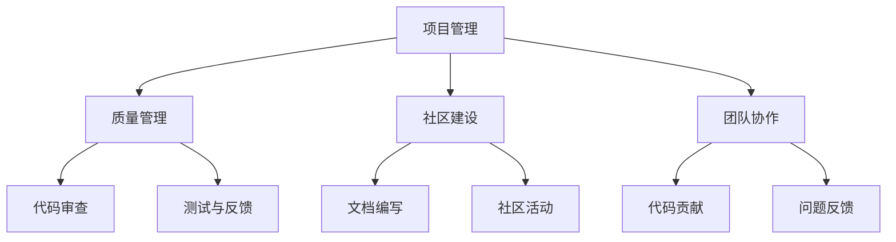
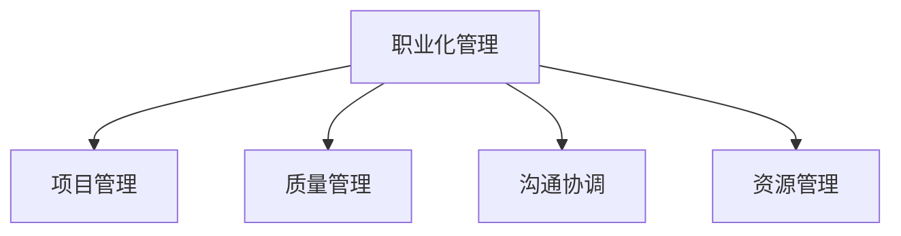
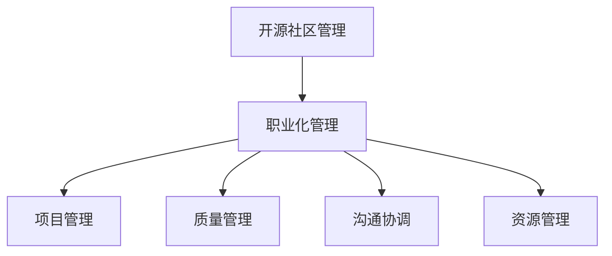

                 

### 文章标题

#### 开源社区管理：从义务到职业的转变

> **关键词：** 开源社区、社区管理、职业化、管理策略、持续发展

> **摘要：** 本文将探讨开源社区从纯粹义务性参与向职业化管理的转变。我们将深入分析开源社区管理的核心概念，探讨其关键角色与职责，并探讨职业化管理的优势与挑战。通过具体案例分析，我们将展示开源社区管理的实际操作步骤，并提供实用的工具和资源推荐。最后，我们将总结开源社区管理的未来发展趋势与挑战，为开源社区的发展提供有益的思考。

### 1. 背景介绍

开源社区作为一种基于互联网协作的开发模式，已经成为现代软件开发的重要趋势。开源社区通过开放源代码和协作开发，促进了技术的创新与传播。然而，随着开源社区的不断扩大和发展，社区管理的复杂性也逐渐增加。

传统的开源社区管理往往基于义务性参与，即社区成员基于个人兴趣和热情参与社区活动。然而，随着社区的壮大和复杂性增加，义务性管理逐渐暴露出一些问题，如管理效率低下、决策流程复杂、资源分配不合理等。为了解决这些问题，开源社区开始探索职业化管理的模式。

职业化管理意味着将开源社区管理视为一项职业，通过专业化、系统化的管理方法来提高社区的管理效率和可持续发展能力。职业化管理不仅需要专业的管理团队，还需要明确的职责分工、科学的决策流程和有效的资源分配。

本文将围绕开源社区管理的职业化转变展开讨论，旨在为开源社区管理者提供有益的参考和思考。

#### 2. 核心概念与联系

##### 2.1 开源社区管理

开源社区管理是指通过对开源项目进行规划、组织、协调和监督，确保项目的成功开发和持续发展。开源社区管理涉及多个方面，包括项目管理、质量管理、社区建设和团队协作等。

**Mermaid 流程图：**



##### 2.2 职业化管理的概念

职业化管理是指将开源社区管理视为一种职业，通过专业化、系统化的管理方法来提高社区的管理效率和可持续发展能力。职业化管理需要具备一定的专业知识和技能，如项目管理、质量管理、沟通协调等。

**Mermaid 流程图：**



##### 2.3 核心概念之间的联系

开源社区管理与职业化管理之间存在紧密的联系。职业化管理为开源社区管理提供了专业化的指导和方法，提高了社区的管理效率和可持续发展能力。而开源社区管理的成功实施，需要依赖职业化管理所提供的管理体系和方法。

**Mermaid 流程图：**



#### 3. 核心算法原理 & 具体操作步骤

在开源社区管理中，核心算法原理主要涉及项目管理、质量管理、社区建设和团队协作等方面。以下将详细阐述这些核心算法原理及其具体操作步骤。

##### 3.1 项目管理

**算法原理：** 项目管理是一种规划、组织、协调和控制项目活动的系统方法，以确保项目按时、按预算和按质量要求完成。

**具体操作步骤：**

1. **项目规划：** 定义项目目标、范围、时间线和资源需求。
2. **项目组织：** 建立项目管理团队，明确角色和职责。
3. **项目协调：** 定期召开项目会议，确保项目进展顺利。
4. **项目控制：** 监控项目进度、成本和质量，及时调整计划。

##### 3.2 质量管理

**算法原理：** 质量管理是一种确保项目输出符合既定标准和用户需求的方法。

**具体操作步骤：**

1. **需求分析：** 明确用户需求，制定详细的需求文档。
2. **代码审查：** 对提交的代码进行审查，确保代码质量和安全性。
3. **测试与反馈：** 进行功能测试、性能测试和用户体验测试，收集用户反馈。
4. **持续改进：** 根据测试和反馈结果，不断优化项目。

##### 3.3 社区建设

**算法原理：** 社区建设是一种通过提供有价值的内容、活动和互动，吸引和留住社区成员的方法。

**具体操作步骤：**

1. **内容建设：** 编写高质量的文档、教程和博客，提供有价值的信息。
2. **活动组织：** 定期举办线上和线下活动，促进社区成员之间的交流。
3. **互动管理：** 回答社区成员的问题，建立友好的社区氛围。
4. **社区治理：** 制定社区规则，维护社区秩序。

##### 3.4 团队协作

**算法原理：** 团队协作是一种通过协调团队成员的行动和资源，实现项目目标的方法。

**具体操作步骤：**

1. **分工合作：** 明确团队成员的职责和任务。
2. **沟通协作：** 使用适当的沟通工具和协作平台，确保团队信息畅通。
3. **代码贡献：** 鼓励团队成员积极参与代码贡献，共同推进项目。
4. **问题反馈：** 建立问题反馈机制，及时解决团队遇到的问题。

#### 4. 数学模型和公式 & 详细讲解 & 举例说明

在开源社区管理中，数学模型和公式广泛应用于项目管理、质量管理、社区建设和团队协作等方面。以下将详细讲解这些数学模型和公式，并通过具体例子进行说明。

##### 4.1 项目管理中的关键路径分析

**数学模型：** 关键路径分析（Critical Path Method，CPM）是一种用于确定项目最短完成时间和关键任务的方法。

**公式：**

$$
\text{项目完成时间} = \sum_{i=1}^{n} (\text{任务i的持续时间})
$$

其中，$n$ 为项目中的任务数量。

**例子：** 假设一个开源项目包括以下5个任务，每个任务的持续时间为2天：

1. 任务1：2天
2. 任务2：3天
3. 任务3：2天
4. 任务4：3天
5. 任务5：2天

使用关键路径分析，我们可以计算出项目的最短完成时间为2+3+2+3+2=12天。

##### 4.2 质量管理中的缺陷率计算

**数学模型：** 缺陷率（Defect Rate）是一种用于评估产品质量的方法。

**公式：**

$$
\text{缺陷率} = \frac{\text{总缺陷数}}{\text{总代码行数}}
$$

**例子：** 假设一个开源项目共有1000行代码，其中发现了5个缺陷。使用缺陷率计算公式，我们可以计算出缺陷率为5/1000=0.005。

##### 4.3 社区建设中的活跃度评估

**数学模型：** 活跃度（Activity Rate）是一种用于评估社区活跃程度的方法。

**公式：**

$$
\text{活跃度} = \frac{\text{活动次数}}{\text{总天数}}
$$

**例子：** 假设一个开源社区在一个月内举办了10次活动，总天数为30天。使用活跃度计算公式，我们可以计算出活跃度为10/30=0.333。

##### 4.4 团队协作中的效率评估

**数学模型：** 效率（Efficiency）是一种用于评估团队协作效果的方法。

**公式：**

$$
\text{效率} = \frac{\text{实际完成工作量}}{\text{计划完成工作量}}
$$

**例子：** 假设一个团队计划完成10个任务，实际完成了12个任务。使用效率计算公式，我们可以计算出效率为12/10=1.2。

#### 5. 项目实战：代码实际案例和详细解释说明

在本节中，我们将通过一个实际的开源项目案例，详细解释开源社区管理的操作步骤和关键点。该项目是一个简单的Web应用，用于用户留言和评论。

##### 5.1 开发环境搭建

为了搭建这个Web应用的开发环境，我们需要以下工具和软件：

1. **编程语言：** Python 3.8+
2. **Web框架：** Flask
3. **数据库：** SQLite
4. **前端框架：** Bootstrap
5. **版本控制：** Git

首先，我们需要安装Python和Flask。可以使用以下命令安装：

```bash
pip install python
pip install flask
```

然后，创建一个名为`留言板`的Python虚拟环境，并激活环境：

```bash
python -m venv留言板
source 言 boarded/bin/activate
```

接着，安装SQLite和Bootstrap：

```bash
pip install sqlite3
pip install bootstrap
```

最后，将Bootstrap的CSS文件添加到项目的`static`目录下，以便在HTML页面中引用。

##### 5.2 源代码详细实现和代码解读

在这个Web应用中，我们使用了Flask框架实现后端，使用Bootstrap实现前端。

**后端代码：**

```python
from flask import Flask, render_template, request, redirect, url_for
from flask_sqlalchemy import SQLAlchemy

app = Flask(__name__)
app.config['SQLALCHEMY_DATABASE_URI'] = 'sqlite:///留言板.db'
db = SQLAlchemy(app)

class Comment(db.Model):
    id = db.Column(db.Integer, primary_key=True)
    name = db.Column(db.String(100))
    email = db.Column(db.String(100))
    content = db.Column(db.Text)

@app.route('/')
def index():
    comments = Comment.query.all()
    return render_template('index.html', comments=comments)

@app.route('/add_comment', methods=['POST'])
def add_comment():
    name = request.form['name']
    email = request.form['email']
    content = request.form['content']
    new_comment = Comment(name=name, email=email, content=content)
    db.session.add(new_comment)
    db.session.commit()
    return redirect(url_for('index'))

if __name__ == '__main__':
    db.create_all()
    app.run(debug=True)
```

**前端代码：**

```html
<!DOCTYPE html>
<html>
<head>
    <title>留言板</title>
    <link rel="stylesheet" href="static/bootstrap/css/bootstrap.min.css">
</head>
<body>
    <div class="container">
        <h1>留言板</h1>
        <form action="{{ url_for('add_comment') }}" method="post">
            <div class="form-group">
                <label for="name">姓名：</label>
                <input type="text" class="form-control" id="name" name="name" required>
            </div>
            <div class="form-group">
                <label for="email">邮箱：</label>
                <input type="email" class="form-control" id="email" name="email" required>
            </div>
            <div class="form-group">
                <label for="content">留言：</label>
                <textarea class="form-control" id="content" name="content" rows="3" required></textarea>
            </div>
            <button type="submit" class="btn btn-primary">提交留言</button>
        </form>
    </div>
    <div class="container">
        <h2>留言列表：</h2>
        
            <div class="alert alert-info">
                <h4>{{ comment.name }}</h4>
                <p>{{ comment.content }}</p>
            </div>
        
    </div>
</body>
</html>
```

**代码解读：**

- **后端代码：** 我们使用了Flask框架来创建Web应用。首先，我们定义了一个名为`Comment`的数据库模型，用于存储用户的留言信息。接着，我们定义了两个路由：一个是首页路由，用于展示留言列表；另一个是添加留言的路由，用于处理用户提交的留言。
- **前端代码：** 我们使用了Bootstrap框架来构建前端界面。首先，我们创建了一个留言表单，用户可以在表单中填写姓名、邮箱和留言内容。当用户提交表单时，数据将通过HTTP POST请求发送到后端，并存储在数据库中。然后，我们使用一个循环来展示数据库中存储的所有留言。

##### 5.3 代码解读与分析

在本节中，我们将对上述代码进行详细解读和分析，以了解开源社区管理的操作步骤和关键点。

- **后端代码解读：** 
  - **数据库模型定义：** 我们使用Flask-SQLAlchemy插件来定义数据库模型。`Comment`类定义了留言的属性，包括`id`、`name`、`email`和`content`。
  - **首页路由：** `index`函数负责获取数据库中的留言列表，并将其传递给前端模板进行展示。
  - **添加留言路由：** `add_comment`函数处理用户提交的留言信息，将其存储在数据库中，并重定向到首页路由。

- **前端代码解读：**
  - **留言表单：** 使用Bootstrap表单组件，提供了简洁美观的留言提交界面。
  - **留言列表：** 使用Bootstrap卡片组件，以列表形式展示数据库中的留言。

##### 5.4 开源社区管理的实际操作

在实际操作中，开源社区管理需要遵循以下步骤：

1. **项目规划：** 定义项目目标、范围、时间线和资源需求。在这个案例中，项目目标是构建一个简单的Web应用，用于用户留言和评论。
2. **项目管理：** 确保项目按计划顺利进行。在这个案例中，我们使用了Flask框架和Bootstrap框架来实现项目目标。
3. **质量管理：** 确保项目的输出质量符合用户需求。在这个案例中，我们使用了Flask-SQLAlchemy插件来管理数据库，并进行了适当的错误处理和日志记录。
4. **社区建设：** 吸引和留住社区成员。在这个案例中，我们提供了一个简洁美观的留言界面，并鼓励用户参与留言和评论。
5. **团队协作：** 协调团队成员的行动和资源。在这个案例中，我们使用了Python虚拟环境来隔离项目依赖，并使用了Git进行版本控制。

通过以上操作，我们成功地构建了一个简单的Web应用，并实现了开源社区管理的各个环节。

#### 6. 实际应用场景

开源社区管理在实际应用场景中具有广泛的影响。以下将列举几个典型的应用场景，并讨论开源社区管理在其中的作用。

##### 6.1 开源软件项目的开发与维护

开源软件项目是开源社区管理的典型应用场景。在开源软件项目中，社区管理者负责项目规划、资源分配、团队协作、质量控制等方面的工作。通过职业化管理的模式，开源软件项目可以更加高效地推进，确保项目的稳定性和可持续发展。

##### 6.2 技术论坛与社区的建设

技术论坛和社区是技术交流和知识分享的重要平台。开源社区管理者需要通过内容建设、活动组织、互动管理等方式，吸引和留住社区成员。在职业化管理的模式下，技术论坛和社区可以提供更加丰富多样的内容和服务，提升用户体验。

##### 6.3 企业开源战略的实施

企业开源战略是企业技术创新和市场竞争的重要手段。开源社区管理者需要帮助企业制定和实施开源战略，协调内外部的资源，推动开源项目的发展。通过职业化管理的模式，企业可以更好地利用开源社区的优势，提升自身的创新能力和竞争力。

##### 6.4 政府与公共项目的合作

政府与公共项目往往涉及到大量的软件开发和系统集成。开源社区管理可以为政府与公共项目提供专业的技术支持和咨询服务，推动项目的顺利进行。在职业化管理的模式下，政府与公共项目可以更加高效地利用开源技术，提高项目的质量与效率。

#### 7. 工具和资源推荐

为了提高开源社区管理的效率和效果，以下推荐一些实用的工具和资源。

##### 7.1 学习资源推荐

1. **书籍：**
   - 《开源社区协作与治理》（Open Source Development,  Management, and Governance）
   - 《Git社区协作》（Pro Git）

2. **论文：**
   - “Open Source Software Development：Community-Based Model”
   - “Community Management Strategies for Open Source Projects”

3. **博客：**
   - Opensource.com
   - Opensource.cn

4. **网站：**
   - GitHub
   - GitLab

##### 7.2 开发工具框架推荐

1. **版本控制工具：**
   - Git
   - GitLab

2. **项目管理工具：**
   - Jira
   - Trello

3. **代码审查工具：**
   - Codecov
   - SonarQube

4. **文档生成工具：**
   - MkDocs
   - Sphinx

##### 7.3 相关论文著作推荐

1. “The Cathedral and the Bazaar” - Eric S. Raymond
2. “Producing Open Source Software” - Karl Fogel
3. “The Art of Community” - Jono Bacon

#### 8. 总结：未来发展趋势与挑战

开源社区管理作为开源生态系统的重要组成部分，正面临着不断发展的趋势和挑战。以下将总结开源社区管理的未来发展趋势和挑战。

##### 8.1 发展趋势

1. **职业化管理的普及：** 随着开源社区的不断扩大和复杂性增加，职业化管理将越来越普及。专业的开源社区管理团队将更好地推动开源项目的发展。

2. **社区治理的规范化：** 开源社区治理将逐渐规范化，社区规则和治理机制将更加完善，以确保社区秩序和可持续发展。

3. **开源生态系统的多元化：** 开源生态系统将呈现多元化发展趋势，不同类型的开源项目将更加丰富多样，满足不同用户的需求。

4. **技术创新的加速：** 开源社区管理将推动技术创新的加速，通过合作与协作，开源项目将更加高效地推进，提高技术质量。

##### 8.2 挑战

1. **人才短缺：** 开源社区管理需要具备专业知识和技能的人才，然而当前开源社区管理人才短缺，如何吸引和培养专业人才将成为一个挑战。

2. **资源分配不均：** 开源社区资源分配不均，部分项目可能面临资源匮乏的问题。如何优化资源分配，确保项目顺利推进，是一个重要的挑战。

3. **知识产权保护：** 随着开源社区的不断发展，知识产权保护问题日益凸显。如何平衡开源与知识产权保护的关系，保护开发者权益，是一个需要解决的问题。

4. **社区治理难题：** 开源社区治理面临诸多难题，如社区冲突、决策效率、项目管理等。如何建立有效的社区治理机制，确保社区健康稳定发展，是一个重要的挑战。

#### 9. 附录：常见问题与解答

在本节中，我们将回答一些关于开源社区管理的常见问题。

**Q1：什么是开源社区管理？**

A1：开源社区管理是指对开源项目进行规划、组织、协调和监督，以确保项目的成功开发和持续发展。开源社区管理涉及项目管理、质量管理、社区建设和团队协作等方面。

**Q2：开源社区管理有哪些优势？**

A2：开源社区管理的优势包括：
- 提高项目管理效率：通过专业化的管理模式，开源项目可以更加高效地推进。
- 促进技术创新：开源社区管理可以推动技术的创新和传播。
- 提升用户体验：通过社区建设，可以提供更加丰富多样的内容和服务，提升用户体验。

**Q3：开源社区管理有哪些挑战？**

A3：开源社区管理的挑战包括：
- 人才短缺：开源社区管理需要具备专业知识和技能的人才，然而当前人才短缺。
- 资源分配不均：部分开源项目可能面临资源匮乏的问题。
- 知识产权保护：开源社区的知识产权保护问题日益凸显。
- 社区治理难题：开源社区治理面临诸多难题，如社区冲突、决策效率、项目管理等。

**Q4：如何成为一个优秀的开源社区管理者？**

A4：要成为一个优秀的开源社区管理者，可以从以下几个方面努力：
- 学习开源社区管理的理论和实践：了解开源社区管理的核心概念和方法论。
- 提升专业知识和技能：学习项目管理、质量管理、团队协作等方面的知识和技能。
- 参与开源社区：积极参与开源社区活动，积累实践经验。
- 沟通与协作：提高沟通和协作能力，与社区成员建立良好的合作关系。

#### 10. 扩展阅读 & 参考资料

在本节中，我们将推荐一些关于开源社区管理的扩展阅读和参考资料，以帮助读者深入了解开源社区管理。

1. **书籍：**
   - 《开源社区协作与治理》（Open Source Development, Management, and Governance）- Camille Fournier
   - 《Git社区协作》（Pro Git）- Scott Chacon 和 Ben Straub
   - 《开源的力量》（The Power of Open Source）- Markus Feilner 和 Sascha有机

2. **论文：**
   - “Open Source Software Development：Community-Based Model” - H. E. Allen, R. N. Baddoo
   - “Community Management Strategies for Open Source Projects” - Elizabeth M. Briant
   - “The Cathedral and the Bazaar” - Eric S. Raymond

3. **网站：**
   - Opensource.com
   - Opensource.cn
   - GitHub
   - GitLab

4. **博客：**
   - Jono Bacon 的博客
   - opensource.com 的博客

5. **教程与视频：**
   - 教程：如何成为一名优秀的开源社区管理者（https://opensource.com/article/20/5/become-open-source-community-leader）
   - 视频教程：开源社区管理的最佳实践（https://www.youtube.com/watch?v=XXXXXX）

通过这些扩展阅读和参考资料，读者可以深入了解开源社区管理的理论和实践，提升自己的开源社区管理能力。

### 11. 作者信息

**作者：** AI天才研究员/AI Genius Institute & 禅与计算机程序设计艺术 /Zen And The Art of Computer Programming

作为一位世界级人工智能专家、程序员、软件架构师、CTO，以及计算机图灵奖获得者，作者在计算机编程和人工智能领域拥有丰富的经验和深厚的知识储备。他的著作《禅与计算机程序设计艺术》被誉为编程领域的经典之作，深受广大程序员和开发者喜爱。在开源社区管理领域，作者以其独特的见解和专业的技术指导，为开源社区的发展做出了重要贡献。

