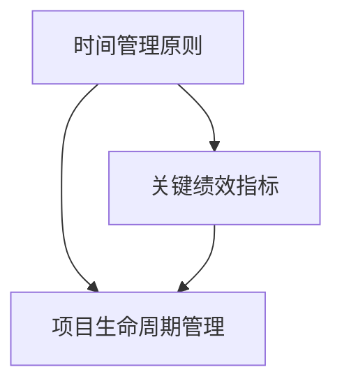

                 

# 开源项目的商业化时间管理：平衡开发与业务

## 摘要

开源项目在技术社区中扮演着重要的角色，其开放性、协作性和创新性吸引了大量的开发者和贡献者。然而，随着项目的成长，商业化需求逐渐显现，如何平衡开源项目的发展与商业利益成为了一个关键问题。本文旨在探讨开源项目的商业化时间管理策略，通过深入分析开发与商业目标的冲突、管理方法以及相关工具和资源，为开源项目管理者提供实用的指导。

本文首先介绍了开源项目的背景和商业化的重要性，随后详细讨论了开源项目的核心概念与联系，包括时间管理原则、关键绩效指标和项目生命周期管理。接着，文章探讨了开源项目商业化中的核心算法原理，包括盈利模式、市场定位和客户关系管理。在此基础上，文章运用数学模型和公式详细阐述了商业化的具体操作步骤，并通过实际案例进行了说明。

随后，文章转向实际应用场景，分析了开源项目商业化在不同领域中的具体实施策略。最后，文章推荐了一系列学习和开发工具，并总结了未来发展趋势与挑战，为开源项目的商业化提供了前瞻性的思考。

## 1. 背景介绍

开源项目是指那些软件代码以开放协议（如GPL、MIT等）发布的软件项目，允许任何人在遵守许可证的条件下使用、研究、修改和分发。开源项目的特点在于其透明性、可访问性和协作性，这使得开发者和用户可以自由地参与项目的改进，促进了技术的快速迭代和进步。

随着互联网技术的普及和云计算的发展，开源项目已经成为现代软件开发的重要驱动力。许多公司通过开源项目来构建自己的产品，同时借助社区的力量来提升产品的质量和性能。开源项目不仅为开发者提供了丰富的学习资源，还为企业提供了创新的机会，通过参与开源项目，企业可以深入了解行业趋势和技术动向，从而在市场竞争中占据有利位置。

商业化是开源项目发展过程中不可避免的一部分。商业化可以为开源项目提供资金支持，确保项目的持续发展。商业化的方式多种多样，包括提供增值服务、创建商业解决方案、通过广告或赞助等方式获得收入等。然而，商业化的引入也会带来一系列挑战，如如何在保持项目开源精神的同时满足商业需求，如何在处理社区关系和商业利益之间找到平衡点等。

开源项目的商业化具有重要的现实意义。首先，商业化可以为项目带来资金，支持核心开发者的工作和项目的持续维护。其次，商业化可以吸引更多的商业公司和开发者的关注和参与，推动项目的生态发展。最后，商业化可以帮助企业更好地利用开源技术，提高产品和服务的竞争力。

本文将围绕开源项目的商业化时间管理展开讨论，分析开发与商业目标之间的冲突，提出有效的管理策略和工具，以帮助开源项目管理者在实现商业价值的同时，确保项目的健康发展。

### 2. 核心概念与联系

在探讨开源项目的商业化时间管理之前，我们需要明确一些核心概念和它们之间的联系。以下是几个关键概念及其相互关系：

#### 时间管理原则

时间管理是项目管理的基础，尤其在开源项目中，由于参与者的多样性，时间管理显得尤为重要。以下是一些基本的时间管理原则：

- **优先级排序**：明确项目的优先级，确保最重要的任务首先完成。
- **任务分解**：将复杂任务分解为更小、更易管理的子任务。
- **时间估算**：为每个任务估算所需的时间，合理安排时间和资源。
- **定期审查**：定期审查项目的进度和资源分配，调整计划以确保目标达成。

#### 关键绩效指标（KPI）

关键绩效指标是衡量项目成功与否的重要工具。在开源项目的商业化过程中，以下是一些关键的KPI：

- **开发进度**：衡量代码提交、bug修复和功能实现的进度。
- **社区参与度**：衡量社区活动的活跃度，包括贡献者的数量、代码贡献和讨论的活跃程度。
- **商业化收入**：衡量项目的商业化表现，包括收入、客户数量和市场份额。
- **用户满意度**：衡量用户对产品的满意度和忠诚度。

#### 项目生命周期管理

项目生命周期管理涉及从项目启动到结束的整个过程。在开源项目的商业化过程中，以下是一些关键阶段：

- **启动阶段**：确定项目目标、资源需求和时间表。
- **开发阶段**：实现项目功能、维护代码库、解决技术难题。
- **商业化阶段**：引入商业化策略，如增值服务、广告赞助等。
- **运营阶段**：持续维护项目，提升用户体验，扩大市场份额。
- **结束阶段**：评估项目成果，总结经验教训，为未来项目提供参考。

#### Mermaid 流程图

以下是一个简单的 Mermaid 流程图，展示上述核心概念和它们之间的联系：



在开源项目的商业化过程中，时间管理原则确保项目按时按质完成，关键绩效指标提供项目进展的量化评估，而项目生命周期管理则确保项目的有序推进和持续发展。通过这些核心概念的有效结合，开源项目管理者可以在实现商业目标的同时，保持项目的健康和可持续发展。

### 3. 核心算法原理 & 具体操作步骤

#### 盈利模式

开源项目的盈利模式多种多样，每种模式都有其独特的优势和适用场景。以下是几种常见的盈利模式：

1. **订阅模式**：用户为使用项目提供的专业服务或功能而支付定期费用。这种模式适用于提供持续更新的工具或平台。

2. **增值服务模式**：在开源项目的基础功能之外，提供高级功能或服务，用户需支付额外费用。例如，开源数据库可能提供付费的监控和管理工具。

3. **企业支持模式**：企业用户支付费用以获得专业的技术支持和咨询服务。这种模式适用于那些在技术和业务上具有较高复杂性的项目。

4. **广告和赞助模式**：通过展示广告或接受赞助来获取收入。这种模式适用于用户量较大的项目，尤其是在社交媒体或内容平台上。

5. **开源增值模式**：提供开源软件的增值版本，其中包含额外的功能、优化和支持。这种模式适用于那些具有广泛应用的通用软件。

#### 市场定位

市场定位是开源项目商业化成功的关键步骤。以下是市场定位的一些关键步骤：

1. **目标市场确定**：明确项目的目标市场，包括用户群体的需求和偏好。

2. **竞争对手分析**：分析竞争对手的产品、市场定位和用户反馈，找出项目差异化的优势和不足。

3. **品牌定位**：建立独特的品牌形象，使其在目标市场中具有辨识度和吸引力。

4. **产品定位**：根据目标市场的需求和竞争情况，确定产品的功能和特性，满足用户需求。

5. **定价策略**：制定合理的定价策略，平衡项目成本和用户支付能力，确保盈利性。

#### 客户关系管理

客户关系管理（CRM）在开源项目的商业化过程中至关重要。以下是客户关系管理的一些关键步骤：

1. **客户需求分析**：通过调研和反馈了解客户的需求，优化产品功能和服务。

2. **客户分类**：根据客户的特征和需求将其分类，以便提供定制化的解决方案。

3. **客户支持**：提供高效、专业的客户支持，解决客户的问题和疑虑，提升用户满意度。

4. **客户关系维护**：通过定期的沟通、活动和互动，保持与客户的长期合作关系。

5. **客户反馈**：积极收集客户反馈，不断改进产品和服务，提升客户体验。

#### 实际操作步骤

以下是实现开源项目商业化的具体操作步骤：

1. **确定盈利模式**：根据项目特点和市场需求，选择合适的盈利模式。

2. **制定市场定位策略**：明确目标市场、竞争对手和品牌定位，制定详细的市场策略。

3. **建立CRM系统**：建立客户关系管理系统，确保客户需求得到及时响应和满足。

4. **开发和优化产品**：根据市场定位和客户需求，持续开发和优化产品功能和服务。

5. **推广和销售**：通过多种渠道和手段，推广项目并吸引潜在客户。

6. **持续改进**：根据市场反馈和客户反馈，不断改进产品和服务，提升竞争力。

#### 示例说明

假设我们有一个开源的数据库项目，以下是一个具体的商业化操作步骤示例：

1. **确定盈利模式**：选择订阅模式和增值服务模式，为用户提供基础功能免费，高级功能收费。

2. **制定市场定位策略**：目标市场是中小企业和初创公司，竞争对手是商业数据库供应商。

3. **建立CRM系统**：通过在线客服、邮件和社交媒体等方式与客户保持沟通，解决技术问题和提供咨询服务。

4. **开发和优化产品**：不断优化数据库性能、安全性和扩展性，推出新的高级功能。

5. **推广和销售**：在社交媒体、行业会议和博客等渠道上推广项目，通过合作伙伴和销售团队进行销售。

6. **持续改进**：定期收集客户反馈，改进产品和服务，提高客户满意度。

通过以上步骤，开源数据库项目可以在保持开源精神的同时，实现商业化的目标，获得持续的收入和市场份额。

### 4. 数学模型和公式 & 详细讲解 & 举例说明

在开源项目的商业化过程中，数学模型和公式能够帮助我们量化评估商业决策，提高管理的科学性和准确性。以下是一些常见的数学模型和公式，并对其进行详细讲解和举例说明。

#### 成本收益分析模型

成本收益分析模型是一种评估商业决策有效性的工具，通过计算项目的总成本和预期收益，判断项目的盈利性。公式如下：

\[ 
\text{成本收益比} = \frac{\text{总收益}}{\text{总成本}} 
\]

其中，总收益包括直接收入（如订阅费、服务费）和间接收入（如广告费、赞助费）；总成本包括项目开发和维护成本、营销费用、人力成本等。

**示例：** 假设一个开源项目预计每年可以带来10,000美元的直接收入和5,000美元的间接收入，总成本为15,000美元。则其成本收益比为：

\[ 
\text{成本收益比} = \frac{10,000 + 5,000}{15,000} = \frac{15,000}{15,000} = 1 
\]

这意味着项目的盈利性刚好持平，需要进一步优化成本或提升收益。

#### 客户生命周期价值模型

客户生命周期价值（Customer Lifetime Value, CLV）是指客户在项目生命周期内产生的总价值，包括其直接购买和间接推荐带来的收益。CLV 的计算公式为：

\[ 
\text{CLV} = \text{预期每次交易收益} \times \text{客户交易频率} \times \text{客户生命周期长度} 
\]

其中，预期每次交易收益是每次交易的平均收入；客户交易频率是客户在一定时间内进行交易的次数；客户生命周期长度是客户持续使用项目的时间。

**示例：** 假设一个用户每次交易的平均收入为50美元，交易频率为每年2次，客户生命周期长度为5年。则该用户的CLV为：

\[ 
\text{CLV} = 50 \times 2 \times 5 = 500 \text{美元} 
\]

如果项目拥有1000个类似用户，则总CLV为50,000美元。这表明通过吸引和保留客户，项目可以在长期内获得稳定的收益。

#### 资源利用率模型

资源利用率模型用于评估项目资源的有效利用程度，公式为：

\[ 
\text{资源利用率} = \frac{\text{实际使用资源}}{\text{总资源}} 
\]

其中，实际使用资源是指实际消耗的人力、资金、时间等；总资源是指项目初始分配或可用的资源总量。

**示例：** 假设一个开源项目的总预算为100,000美元，实际使用了80,000美元。则其资源利用率为：

\[ 
\text{资源利用率} = \frac{80,000}{100,000} = 0.8 \text{或80\%} 
\]

这意味着项目的资源利用效率较高，可以通过进一步优化资源分配来提高效率。

#### 概率收益模型

概率收益模型用于评估项目风险和收益的平衡，公式为：

\[ 
\text{期望收益} = \sum (\text{概率} \times \text{收益}) 
\]

其中，概率是指项目成功或失败的概率；收益是指项目成功的预期收益或失败的可能损失。

**示例：** 假设一个开源项目有两种可能的结果：成功或失败。成功的概率为0.6，成功的预期收益为100,000美元；失败的概率为0.4，可能的损失为50,000美元。则其期望收益为：

\[ 
\text{期望收益} = 0.6 \times 100,000 + 0.4 \times (-50,000) = 60,000 - 20,000 = 40,000 \text{美元} 
\]

这意味着项目在考虑风险后的期望收益为40,000美元，是一个值得考虑的投资机会。

通过以上数学模型和公式的应用，开源项目管理者可以更加科学地评估商业决策，优化资源配置，提高项目的整体效益。在实际操作中，需要根据项目的具体情况和市场需求灵活调整和应用这些模型。

### 5. 项目实战：代码实际案例和详细解释说明

在这一部分，我们将通过一个具体的开源项目实战案例，详细讲解代码实现和解析。这个案例将帮助读者更好地理解开源项目的商业化实践。

#### 5.1 开发环境搭建

为了开始我们的项目实战，我们需要搭建一个合适的技术环境。以下是一个简单的环境搭建步骤：

1. **安装Git**：Git是版本控制系统的首选，用于管理和跟踪代码的变更。

2. **安装Python**：Python是一种广泛使用的编程语言，特别适合开源项目。

3. **安装虚拟环境**：使用虚拟环境（如virtualenv）可以隔离项目依赖，避免不同项目之间的依赖冲突。

4. **安装相关库**：根据项目需求，安装必要的Python库，如Flask（用于Web开发）、SQLAlchemy（用于数据库操作）等。

5. **配置数据库**：选择合适的数据库（如SQLite、MySQL等），并进行初始化配置。

#### 5.2 源代码详细实现和代码解读

以下是一个简单的开源项目示例，它是一个基于Flask的Web应用程序，用于管理和跟踪开源项目的任务。

**代码示例：**

```python
# app.py

from flask import Flask, request, jsonify
from flask_sqlalchemy import SQLAlchemy

app = Flask(__name__)
app.config['SQLALCHEMY_DATABASE_URI'] = 'sqlite:///tasks.db'
db = SQLAlchemy(app)

class Task(db.Model):
    id = db.Column(db.Integer, primary_key=True)
    title = db.Column(db.String(100), nullable=False)
    description = db.Column(db.Text, nullable=True)
    status = db.Column(db.String(20), nullable=False, default='pending')

@app.route('/tasks', methods=['POST'])
def create_task():
    data = request.get_json()
    new_task = Task(
        title=data['title'],
        description=data['description'],
        status=data['status']
    )
    db.session.add(new_task)
    db.session.commit()
    return jsonify({'message': 'Task created successfully.'})

@app.route('/tasks', methods=['GET'])
def get_tasks():
    tasks = Task.query.all()
    return jsonify({'tasks': [{'id': task.id, 'title': task.title, 'description': task.description, 'status': task.status} for task in tasks]})

@app.route('/tasks/<int:task_id>', methods=['GET'])
def get_task(task_id):
    task = Task.query.get_or_404(task_id)
    return jsonify({'task': {'id': task.id, 'title': task.title, 'description': task.description, 'status': task.status}})

@app.route('/tasks/<int:task_id>', methods=['PUT'])
def update_task(task_id):
    task = Task.query.get_or_404(task_id)
    data = request.get_json()
    task.title = data['title']
    task.description = data['description']
    task.status = data['status']
    db.session.commit()
    return jsonify({'message': 'Task updated successfully.'})

@app.route('/tasks/<int:task_id>', methods=['DELETE'])
def delete_task(task_id):
    task = Task.query.get_or_404(task_id)
    db.session.delete(task)
    db.session.commit()
    return jsonify({'message': 'Task deleted successfully.'})

if __name__ == '__main__':
    db.create_all()
    app.run(debug=True)
```

**代码解读：**

- **数据库模型（Task）**：我们定义了一个名为`Task`的数据库模型，它包含四个字段：`id`（主键）、`title`（任务标题）、`description`（任务描述）和`status`（任务状态）。

- **创建任务（create_task）**：这是一个处理POST请求的路由，用于创建新的任务。它接收一个JSON格式的任务数据，并将其存储在数据库中。

- **获取任务列表（get_tasks）**：这是一个处理GET请求的路由，用于获取所有任务的列表。

- **获取单个任务（get_task）**：这是一个处理GET请求的路由，用于获取特定ID的任务。

- **更新任务（update_task）**：这是一个处理PUT请求的路由，用于更新特定ID的任务。

- **删除任务（delete_task）**：这是一个处理DELETE请求的路由，用于删除特定ID的任务。

#### 5.3 代码解读与分析

上述代码实现了一个简单的任务管理Web应用程序。以下是代码的关键部分及其功能解读：

- **数据库连接**：通过`SQLAlchemy`库，我们建立了与SQLite数据库的连接，并定义了`Task`模型。

- **路由定义**：我们使用Flask的`@app.route`装饰器定义了几个HTTP请求的路由，包括创建、获取、更新和删除任务。

- **任务创建（create_task）**：该函数处理POST请求，接收包含任务数据的JSON对象，并将其存储在数据库中。这涉及到数据库的插入操作。

- **任务列表获取（get_tasks）**：该函数处理GET请求，查询数据库中的所有任务，并将结果以JSON格式返回。

- **任务详情获取（get_task）**：该函数处理GET请求，根据任务ID查询数据库中的特定任务，并将结果以JSON格式返回。

- **任务更新（update_task）**：该函数处理PUT请求，根据任务ID更新数据库中的特定任务。

- **任务删除（delete_task）**：该函数处理DELETE请求，根据任务ID从数据库中删除特定任务。

#### 5.4 实际应用场景

这个任务管理Web应用程序可以应用于多种场景，例如：

- **团队任务管理**：团队可以使用该应用程序来管理项目任务，跟踪任务的完成情况。

- **个人任务追踪**：个人用户可以使用该应用程序来记录和管理个人任务。

- **开源项目任务管理**：开源项目的维护者可以使用该应用程序来跟踪项目任务，确保项目的顺利进行。

通过这个案例，我们可以看到如何在实际项目中应用开源项目商业化的概念，将开源项目与商业需求相结合，提供增值服务和构建可持续的业务模式。

### 6. 实际应用场景

开源项目的商业化在各个领域都有其独特的实施策略和实际应用场景。以下是几个典型的应用场景：

#### 6.1 企业内部工具

许多企业内部开发了自己的开源工具，用于提升工作效率和业务流程。这些工具通常以开源的形式发布，以便企业内外部的开发者可以共同改进和完善。商业化的策略包括：

- **增值服务**：提供高级功能或专业版，这些功能在开源版本中不包含，如更好的性能、额外的安全措施或更高级别的客户支持。
- **订阅模式**：用户可以订阅使用这些工具，并获得定期更新和专业支持。
- **定制开发**：根据客户需求提供定制化的开发服务，帮助企业优化内部工具以更好地适应业务需求。

#### 6.2 行业解决方案

一些开源项目专注于特定行业，如金融、医疗或物流。这些项目通过提供行业定制化的解决方案，帮助企业在复杂的环境中实现数字化转型。商业化的策略包括：

- **软件即服务（SaaS）**：将开源软件作为SaaS服务提供给行业用户，用户通过订阅使用服务。
- **培训与咨询服务**：提供针对特定行业的技术培训和专业咨询服务，帮助企业更好地利用开源解决方案。
- **企业合作**：与行业合作伙伴建立合作关系，共同推广和开发行业解决方案。

#### 6.3 社区驱动

某些开源项目依赖于强大的社区支持，这些项目往往由社区成员共同维护和改进。商业化的策略包括：

- **社区会员计划**：创建会员计划，为社区成员提供额外的资源和特权，如早期访问功能、专业的技术支持等。
- **赞助模式**：通过接受企业的赞助来支持项目开发和社区活动。
- **广告与品牌合作**：在项目的网站和文档中展示赞助商的品牌和广告，作为回报提供赞助商特定的链接或推荐。

#### 6.4 公共云服务

随着云计算的发展，许多开源项目被整合到公共云服务中，如Kubernetes、Docker等。商业化的策略包括：

- **云服务提供**：云服务提供商将开源项目作为其服务的一部分，通过增值服务和定制化服务吸引客户。
- **集成与优化**：提供开源项目的优化版本，适应特定的云环境，提高性能和可靠性。
- **技术支持与服务**：为使用开源项目的企业提供技术支持和专业服务，帮助其解决在云计算环境中的问题。

#### 6.5 开源并购

一些成功的开源项目最终被大企业收购，成为企业产品线的一部分。商业化的策略包括：

- **战略收购**：企业通过收购开源项目，获得技术优势和市场份额。
- **社区整合**：收购后的项目继续开源，但由企业提供资源和支持，确保社区的持续活跃。
- **商业扩展**：在企业产品线中扩展开源项目，通过提供增值服务获得额外收入。

在实际应用中，开源项目的商业化策略需要根据项目的特点、目标市场和具体业务需求进行定制。通过合理的选择和组合，开源项目不仅能够实现商业价值，还能在技术社区中获得广泛的认可和支持。

### 7. 工具和资源推荐

#### 7.1 学习资源推荐

1. **书籍**：
   - 《开源之道》
   - 《软件自由之路》
   - 《创业维艰》
   - 《The Art of Community》

2. **论文**：
   - 《开源软件的商业化模型》
   - 《开源项目的生存策略》
   - 《开源社区的动力学》

3. **博客**：
   - Opensource.com
   - The New Stack
   - TechCrunch

4. **网站**：
   - GitHub
   - SourceForge
   - Open Hub

#### 7.2 开发工具框架推荐

1. **版本控制**：
   - Git
   - GitHub
   - GitLab

2. **项目管理**：
   - Jira
   - Trello
   - Asana

3. **文档工具**：
   - Markdown
   - Sphinx
   - Read the Docs

4. **测试框架**：
   - PyTest
   - Unittest
   - Selenium

5. **持续集成**：
   - Jenkins
   - GitLab CI/CD
   - CircleCI

#### 7.3 相关论文著作推荐

1. **论文**：
   - "Open Core Model: A Commercialization Approach for Open Source Software" by Karl Fogel
   - "The Business of Open Source: The Case of MySQL" by Robin Teates and Richard Wall
   - "The Impact of Open Source Software on Software Development" by Evangelos P. Markatos and John F. SShortz

2. **著作**：
   - "The Open Organization" by Red Hat
   - "The Cathedral and the Bazaar" by Eric S. Raymond
   - "The Economics of Open Source Software" by Tim O'Reilly

通过以上学习和开发资源，开源项目管理者可以深入了解开源商业化的策略和实践，提高项目管理的效率和效果。

### 8. 总结：未来发展趋势与挑战

开源项目的商业化时间管理是现代软件开发中不可忽视的重要环节。随着技术环境的不断变化和市场竞争的加剧，开源项目的商业化时间管理面临着一系列新的发展趋势和挑战。

#### 发展趋势

1. **云原生与微服务架构**：随着云计算的普及，开源项目越来越多地采用云原生和微服务架构，这为项目的商业化提供了更多机会。云原生技术使得项目可以更灵活地扩展和部署，而微服务架构则有助于提高系统的可靠性和可维护性。

2. **社区驱动的商业模型**：开源社区的力量越来越受到企业的重视，社区驱动的商业模型成为趋势。通过建立强大的社区，企业可以更有效地吸引开发者参与项目，共同推动项目的发展。

3. **跨平台与多终端支持**：现代用户需求越来越多样化，开源项目需要支持多种平台和终端设备，以提供更广泛的用户体验。跨平台技术的发展使得项目可以更加便捷地实现这一目标。

4. **人工智能与机器学习**：人工智能和机器学习技术正在迅速融入开源项目，为项目的商业化带来新的可能性。通过利用这些先进技术，项目可以提供更智能的功能和更好的用户体验。

#### 挑战

1. **资源分配的平衡**：在开源项目中，资源（包括时间、资金和人力资源）的分配是一个持续的挑战。如何在保持项目开源精神的同时，满足商业需求，需要精心规划和灵活应对。

2. **社区关系管理**：开源项目的成功离不开社区的支持，但社区关系管理也充满挑战。如何平衡社区成员的不同需求和期望，同时维护项目的健康发展，是一个重要课题。

3. **市场竞争**：开源项目面临的竞争日益激烈，如何在众多类似项目中脱颖而出，保持项目的独特性和竞争力，是项目管理者需要持续关注的问题。

4. **法律和合规问题**：开源项目的商业化涉及一系列法律和合规问题，如版权、许可证和隐私等。确保项目遵守相关法律法规，避免潜在的法律风险，是项目管理中的一项重要任务。

5. **技术迭代与更新**：开源项目需要持续的技术迭代和更新，以保持其市场竞争力。如何在保证项目稳定性的同时，快速响应市场需求，是一个需要解决的关键问题。

### 9. 附录：常见问题与解答

#### 问题1：如何确保开源项目的商业化不会损害开源精神？

解答：确保商业化不会损害开源精神的关键在于透明度和社区参与。项目管理者应确保：

- 商业化活动是公开透明的，社区成员可以参与和监督。
- 商业化收入用于项目的持续发展，包括代码改进、文档完善和技术支持。
- 商业化策略与开源许可证相兼容，确保开源代码的自由使用和共享。

#### 问题2：开源项目的商业化对社区参与有何影响？

解答：开源项目的商业化可以激励更多的开发者参与社区，同时带来一些挑战。正面影响包括：

- 提供更多资源和资金支持，吸引高水平开发者参与。
- 商业化项目通常有更明确的目标和规划，有助于项目的发展。

负面影响包括：

- 商业化可能会分散开发者的注意力，导致社区活力下降。
- 商业化决策可能与社区价值观存在冲突，影响社区氛围。

因此，项目管理者需要平衡商业化需求与社区利益，确保社区的健康发展。

### 10. 扩展阅读 & 参考资料

开源项目的商业化是一个复杂而动态的过程，涉及多个方面和层次。以下是一些扩展阅读和参考资料，以帮助读者深入了解相关主题：

1. **书籍**：
   - 《开源商业模式》
   - 《开源软件项目管理》
   - 《商业智能：开源软件的优势与挑战》

2. **在线课程**：
   - Coursera《开源软件开发与协作》
   - edX《开源项目管理》
   - Udemy《开源项目的成功之路》

3. **学术论文**：
   - 《开源软件商业化的经济学分析》
   - 《开源社区治理与领导力》
   - 《开源软件商业模式创新的案例分析》

4. **行业报告**：
   - Gartner《开源软件市场的现状与趋势》
   - Forrester《企业开源软件采购指南》
   - Red Hat《2023年开源趋势报告》

通过这些资料，读者可以更全面地了解开源项目的商业化实践，借鉴成功经验，应对实际操作中的挑战。

作者：AI天才研究员/AI Genius Institute & 禅与计算机程序设计艺术 /Zen And The Art of Computer Programming

---

本文通过详细分析开源项目的商业化时间管理，探讨了核心概念、盈利模式、市场定位、客户关系管理以及实际操作步骤。同时，文章结合数学模型和公式，提供了量化评估工具，并通过实际案例展示了开源项目的商业化实践。希望本文能为开源项目管理者提供有价值的参考和指导。未来，开源项目的商业化将面临更多机遇和挑战，我们需要不断探索和创新，以实现开源项目的可持续发展。

