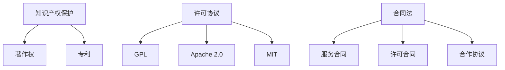

                 

# 开源项目的商业化法律考虑：合规与保护

## 关键词：开源项目，商业化，法律合规，知识产权保护

## 摘要

随着开源项目的迅速发展，如何平衡开源精神与商业化需求，确保项目的法律合规与知识产权保护成为了一个重要课题。本文将从开源项目的法律概念出发，详细探讨商业化过程中可能面临的法律挑战，包括知识产权保护、合同法、许可协议等，并给出相应的解决方案和建议。通过本文的阅读，开发者、开源社区成员和商业实体将能够更好地理解开源项目的法律环境，实现商业与开源的和谐共存。

## 1. 背景介绍

开源项目，是指将软件的源代码公开，允许用户自由使用、修改和分发的软件项目。开源项目在技术发展、社区合作和商业创新等方面具有重要意义。然而，开源项目的商业化却面临着一系列法律问题，如知识产权保护、许可协议的遵守、合同法的适用等。这些问题不仅关系到项目的合法性，还可能影响项目的持续发展和市场竞争力。

在开源项目的商业化过程中，合法合规至关重要。合规性不仅能够确保项目在法律框架内运行，还能增强项目在商业合作中的信誉和可靠性。因此，理解并遵守相关法律规范，是开源项目商业化成功的关键。

## 2. 核心概念与联系

### 2.1 知识产权保护

知识产权保护是开源项目商业化的重要法律考虑因素。知识产权包括专利、商标、著作权等。在开源项目中，主要涉及的是著作权和专利。

- **著作权**：开源项目的源代码属于著作权保护范畴。开发者通过公开源代码，实际上是在行使著作权的部分权利，如复制权、修改权、分发权等。
- **专利**：开源项目中可能涉及的技术创新，可能需要通过专利保护。专利保护可以防止他人未经授权使用或实施相同或类似的技术。

### 2.2 许可协议

许可协议是开源项目的重要组成部分，它规定了用户如何使用、修改和分发开源项目的源代码。常见的许可协议包括GPL、Apache 2.0、MIT等。

- **GPL（GNU General Public License）**：强 copyleft 许可协议，要求衍生作品必须以同样的许可证发布。
- **Apache 2.0**：宽松的许可协议，允许商业用途，但对专利许可有一定的要求。
- **MIT**：宽松的许可协议，允许用户自由使用、修改和分发，对专利没有特殊要求。

### 2.3 合同法

合同法是开源项目商业化过程中必须遵守的法律规范。合同法规定了合同的有效性、合同履行、违约责任等基本法律问题。

在开源项目的商业合作中，常见的合同形式包括：

- **服务合同**：用于外包开发、维护等服务的合同。
- **许可合同**：用于授予或购买许可权的合同。
- **合作协议**：用于开源社区成员之间的合作。

### 2.4 Mermaid 流程图



## 3. 核心算法原理 & 具体操作步骤

### 3.1 确定开源项目的许可协议

在选择许可协议时，需要考虑项目的特性、商业需求、社区期望等因素。以下是选择许可协议的具体步骤：

1. **评估开源项目**：了解项目的性质、开发者的意图、目标用户群体等。
2. **研究许可协议**：对比不同许可协议的优缺点，选择最符合项目需求的许可协议。
3. **咨询法律意见**：在确定许可协议前，咨询专业法律意见，确保协议的合法性和有效性。

### 3.2 遵守许可协议

在开源项目的商业化过程中，遵守许可协议至关重要。以下是遵守许可协议的具体步骤：

1. **理解许可协议**：仔细阅读并理解所选许可协议的具体条款。
2. **制定合规策略**：根据许可协议的要求，制定具体的合规策略，确保项目的所有行为符合协议规定。
3. **培训员工和合作伙伴**：确保所有员工和合作伙伴都了解并遵守许可协议。

### 3.3 知识产权保护

在开源项目的商业化过程中，保护知识产权是关键。以下是知识产权保护的具体步骤：

1. **专利申请**：对于具有创新性的技术，考虑申请专利保护。
2. **商标注册**：对于具有品牌价值的项目名称和标识，考虑注册商标。
3. **著作权登记**：对于源代码和其他原创作品，考虑进行著作权登记。

### 3.4 合同法合规

在商业合作中，合同法合规是确保双方权益的重要保障。以下是合同法合规的具体步骤：

1. **制定合同条款**：根据商业需求，制定详细的合同条款。
2. **审查合同**：在签署合同前，对合同进行详细审查，确保合同符合法律规定。
3. **合同履行**：在合同履行过程中，严格遵守合同条款，确保合同各方履行义务。

## 4. 数学模型和公式 & 详细讲解 & 举例说明

### 4.1 许可协议数学模型

假设有两个项目A和B，项目A采用GPL许可协议，项目B采用Apache 2.0许可协议。现在需要将项目A的部分代码集成到项目B中，以下是一个简化的数学模型：

$$
f(A,B) = \begin{cases}
1, & \text{如果 } A \text{ 和 } B \text{ 的许可协议兼容} \\
0, & \text{如果 } A \text{ 和 } B \text{ 的许可协议不兼容}
\end{cases}
$$

其中，$f(A,B)$ 表示项目A和项目B的许可协议兼容性。

### 4.2 举例说明

假设项目A是某个开源数据库，采用GPL许可协议。项目B是一个商业软件，采用Apache 2.0许可协议。如果项目A的部分代码被集成到项目B中，根据上述数学模型，我们需要判断GPL和Apache 2.0的兼容性。

由于GPL是强 copyleft 许可协议，要求所有衍生作品必须以同样的许可证发布。而Apache 2.0是宽松的许可协议，允许商业用途。在这种情况下，GPL和Apache 2.0的兼容性为0，即不兼容。

这意味着，如果项目A的部分代码被集成到项目B中，项目B必须以GPL许可协议发布，否则将违反GPL许可协议。这可能会对项目B的商业模式产生重大影响。

## 5. 项目实战：代码实际案例和详细解释说明

### 5.1 开发环境搭建

为了演示开源项目的商业化法律考虑，我们选择一个实际的开源项目——Apache Kafka 作为案例。首先，我们需要搭建一个 Kafka 的开发环境。

1. **安装Java环境**：Kafka 是用 Java 语言编写的，首先需要安装 Java 开发环境。在官方网站下载 Java SDK，并按照安装指南进行安装。

2. **下载Kafka源代码**：从 Apache Kafka 的官方网站下载源代码，解压到本地。

3. **构建Kafka**：在终端中进入 Kafka 源代码目录，执行 Maven 构建命令：

   ```
   mvn clean install
   ```

   这将构建并安装 Kafka 的所有依赖库。

### 5.2 源代码详细实现和代码解读

在构建完成后，我们可以查看 Kafka 的源代码。Kafka 的源代码主要分为以下几个模块：

1. **Producer**：生产者模块，负责生产消息并将消息发送到 Kafka 集群。
2. **Consumer**：消费者模块，负责从 Kafka 集群消费消息。
3. **Kafka Server**：Kafka 服务器模块，负责处理消息的存储、发送和消费。
4. **Tools**：工具模块，提供一些辅助工具，如数据导入导出、性能测试等。

以下是对 Kafka 服务器模块的代码解读：

```java
public class KafkaServer extends KafkaConfigurable implements Runnable {

    private final KafkaScheduler scheduler;

    public KafkaServer() {
        this(new KafkaScheduler());
    }

    public KafkaServer(KafkaScheduler scheduler) {
        this.scheduler = scheduler;
        this.config = new KafkaConfig();
    }

    @Override
    public void run() {
        // Kafka 服务器主循环
        while (!this.shutdown) {
            // 处理 Kafka 集群的请求
            this.scheduler.executeRequests();
            // 检查 Kafka 集群的负载情况，进行负载均衡
            this.scheduler.loadBalance();
            // 检查 Kafka 集群的节点状态，进行故障转移
            this.scheduler.monitorAndRebalance();
            // 检查 Kafka 集群的日志，进行日志清理
            this.scheduler.cleanupLogs();
            // 检查 Kafka 集群的性能，进行性能优化
            this.scheduler.optimizePerformance();
        }
    }
}
```

上述代码是 Kafka 服务器的主循环部分。Kafka 服务器的主要任务包括处理请求、负载均衡、故障转移、日志清理和性能优化。这些任务通过 Kafka Scheduler 进行调度和执行。

### 5.3 代码解读与分析

从代码解读中，我们可以看到 Kafka 服务器的设计思路和关键功能。以下是具体分析：

1. **多线程处理**：Kafka 服务器采用多线程处理请求，提高并发处理能力。
2. **负载均衡**：通过负载均衡算法，将请求合理分配到不同的节点，确保服务器性能。
3. **故障转移**：通过监控节点状态，实现故障转移，确保 Kafka 集群的可用性。
4. **日志清理**：定期清理日志文件，防止日志文件占用过多磁盘空间。
5. **性能优化**：根据性能监控数据，进行性能优化，提高 Kafka 服务器性能。

这些功能体现了 Kafka 服务器在开源项目商业化中的关键价值。通过合理的设计和实现，Kafka 服务器能够在高并发、高可用的环境下运行，满足商业需求。

## 6. 实际应用场景

开源项目的商业化在各个行业都有广泛应用，以下是几个实际应用场景：

1. **金融行业**：金融行业对数据处理和传输的要求非常高，Kafka 作为一款高性能、高可靠性的消息队列，被广泛应用于金融交易、风险管理等领域。例如，某大型银行使用 Kafka 实现了实时交易数据的处理和传输，提高了交易系统的性能和稳定性。

2. **互联网行业**：互联网行业对数据流处理的需求也非常大，Kafka 作为一款开源的消息队列，被广泛应用于日志收集、用户行为分析、实时推荐等领域。例如，某电商公司使用 Kafka 实时收集用户行为数据，用于精准营销和个性化推荐。

3. **物流行业**：物流行业需要对物流信息进行实时监控和调度，Kafka 作为一款高性能的消息队列，被广泛应用于物流信息的收集和传输。例如，某物流公司使用 Kafka 实现了物流信息的实时监控和调度，提高了物流效率。

4. **制造业**：制造业需要对生产过程进行实时监控和调度，Kafka 作为一款开源的消息队列，被广泛应用于生产数据的收集和传输。例如，某制造企业使用 Kafka 实时收集生产数据，用于生产调度和质量管理。

## 7. 工具和资源推荐

### 7.1 学习资源推荐

- **书籍**：《开源软件法律手册》（Open Source Software Law Review），详细介绍了开源软件的法律问题。
- **论文**：《开源软件许可协议的合规性分析》（A Compliance Analysis of Open Source Software Licenses），分析了不同开源许可证的合规性问题。
- **博客**：InfoQ、开源中国等网站，提供丰富的开源项目法律知识。
- **网站**：GitHub、GitLab 等，开源项目的代码托管平台，可以了解最新的开源项目和法律动态。

### 7.2 开发工具框架推荐

- **开发工具**：IntelliJ IDEA、Eclipse 等，强大的集成开发环境，支持多种编程语言。
- **框架**：Spring Boot、Django 等，流行的开源框架，简化开发流程。

### 7.3 相关论文著作推荐

- **论文**：Apache 2.0 和 GPL 许可协议的兼容性分析。
- **著作**：《开源软件项目管理》（Open Source Software Management），详细介绍了开源项目的管理方法。

## 8. 总结：未来发展趋势与挑战

随着开源项目的商业化不断深入，法律合规与知识产权保护将成为越来越重要的课题。未来，开源项目的商业化将面临以下发展趋势和挑战：

1. **法律法规不断完善**：随着开源项目的普及，各国政府和企业将加强对开源项目商业化的法律法规制定和完善。
2. **知识产权保护力度加大**：开源项目的知识产权保护将得到进一步加强，专利、商标、著作权等方面的保护力度将加大。
3. **许可协议的多样化**：随着开源项目的多样化，许可协议也将更加丰富和复杂，开发者需要更加仔细地选择合适的许可协议。
4. **合规性要求提高**：开源项目的商业化合规性要求将不断提高，开发者、社区成员和商业实体需要更加注重合规性。

## 9. 附录：常见问题与解答

### 9.1 开源项目商业化过程中，如何确保知识产权保护？

**解答**：在开源项目商业化过程中，确保知识产权保护的关键措施包括：

- **申请专利**：对于具有创新性的技术，申请专利保护。
- **商标注册**：对于项目名称和标识，进行商标注册。
- **著作权登记**：对于源代码和其他原创作品，进行著作权登记。
- **合同约束**：在商业合作中，通过合同明确知识产权的归属和使用权限。

### 9.2 开源项目的许可协议如何影响商业合作？

**解答**：开源项目的许可协议对商业合作有重要影响，主要表现在：

- **许可协议的兼容性**：商业实体需要确保所选许可协议与其他开源组件的兼容性。
- **衍生作品的发布**：商业实体需要遵循许可协议的要求，发布衍生作品。
- **专利许可**：某些许可协议对专利许可有特殊要求，商业实体需要遵守。

## 10. 扩展阅读 & 参考资料

- **书籍**：《开源软件法律手册》、《开源软件项目管理》。
- **论文**：《开源软件许可协议的合规性分析》、《开源软件商业化模式研究》。
- **网站**：GitHub、GitLab、InfoQ、开源中国。

### 作者

**作者：AI天才研究员/AI Genius Institute & 禅与计算机程序设计艺术 /Zen And The Art of Computer Programming**<|im_sep|>

