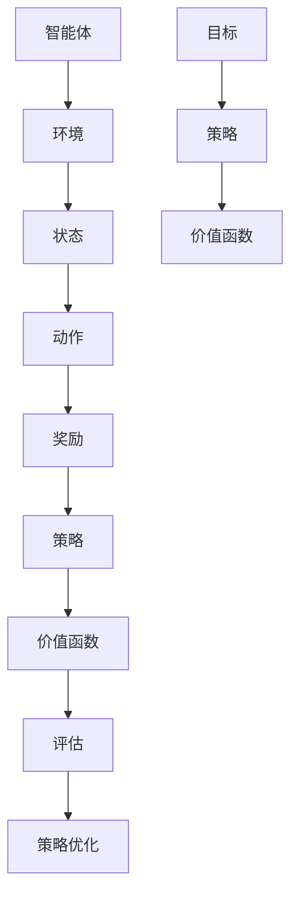
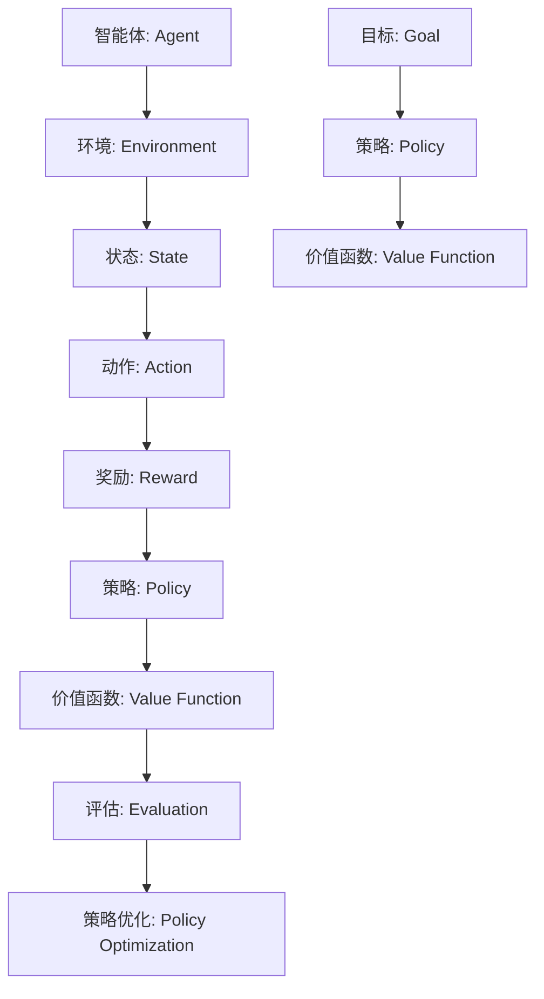

                 

# 强化学习Reinforcement Learning中价值函数近似方法解读

## 概述

强化学习（Reinforcement Learning, RL）是机器学习的一种类型，主要关注如何让智能体（Agent）在未知的环境中通过与环境的交互，学习达到特定的目标。在强化学习中，价值函数（Value Function）是一个核心概念，它表示智能体在未来可能获得奖励的预期。然而，在某些复杂的环境中，直接计算价值函数可能非常困难，甚至不可行。因此，价值函数的近似方法变得尤为重要。

本文将深入探讨强化学习中价值函数的近似方法，包括以下几个部分：

- **背景介绍**：介绍强化学习的基本概念和价值函数的定义。
- **核心概念与联系**：通过Mermaid流程图展示强化学习框架中的价值函数。
- **核心算法原理 & 具体操作步骤**：详细解析常见的价值函数近似算法。
- **数学模型和公式 & 详细讲解 & 举例说明**：使用LaTeX格式介绍价值函数近似相关的数学公式。
- **项目实战：代码实际案例和详细解释说明**：通过具体代码实现来展示价值函数近似方法的应用。
- **实际应用场景**：讨论价值函数近似方法在不同领域的应用。
- **工具和资源推荐**：推荐相关学习资源、开发工具和论文著作。
- **总结：未来发展趋势与挑战**：总结当前价值函数近似方法的优点和面临的挑战。

通过本文的阅读，您将能够全面了解价值函数近似方法在强化学习中的应用，并掌握其原理和实现方法。

<|assistant|>## 背景介绍

强化学习起源于心理学和计算神经科学的研究，其基本思想是模仿人类学习的过程，通过试错和反馈来改善行为。强化学习中的主要参与者包括智能体（Agent）、环境（Environment）和奖励（Reward）。智能体是执行动作的实体，环境是智能体所处的情境，而奖励则是环境对智能体行为的反馈。

在强化学习中，智能体的目标是学习一个策略（Policy），以最大化累积奖励。策略决定了智能体在不同状态下的动作选择。为了更好地理解策略，我们需要引入价值函数（Value Function）的概念。

### 价值函数的定义

价值函数是一个评估状态值（State-Value Function）或动作值（Action-Value Function）的函数，用于估计智能体在某个状态下执行某个动作的预期奖励。具体来说：

- **状态值函数** \(V(s)\) ：在状态 \(s\) 下，执行最佳策略 \( \pi \) 的累积奖励的期望值。
  \[ V(s) = \sum_{a} \pi(a|s) \sum_{s'} p(s'|s, a) R(s, a, s') + \gamma V(s') \]
- **动作值函数** \(Q(s, a)\) ：在状态 \(s\) 下，执行动作 \(a\) 的累积奖励的期望值。
  \[ Q(s, a) = \sum_{s'} p(s'|s, a) R(s, a, s') + \gamma \sum_{a'} \pi(a'|s') Q(s', a') \]
  其中，\(\gamma\) 是折扣因子，表示未来奖励的现值。

### 强化学习的基本概念

- **状态（State）**：智能体在环境中的位置或情境。
- **动作（Action）**：智能体可以执行的行为。
- **策略（Policy）**：从状态到动作的映射。
- **奖励（Reward）**：对智能体行为的即时反馈。
- **轨迹（Episode）**：智能体从初始状态开始，经过一系列状态和动作，直到终止状态的过程。

强化学习的过程可以简化为以下四个步骤：

1. **智能体从环境中随机选择一个初始状态 \(s_0\)。**
2. **智能体在状态 \(s_t\) 下根据当前策略 \( \pi \) 选择一个动作 \(a_t\)。**
3. **环境根据动作 \(a_t\) 更新当前状态 \(s_{t+1}\)，并给予智能体奖励 \(R(s_t, a_t, s_{t+1})\)。**
4. **智能体重复上述步骤，直到达到终止状态。**

通过上述步骤，智能体可以不断调整策略，以最大化累积奖励。在强化学习中，价值函数近似方法被广泛应用于处理高维状态空间和动作空间的问题，使得强化学习算法更加高效和可行。

### 价值函数在强化学习中的作用

价值函数在强化学习中起着至关重要的作用：

- **指导策略选择**：价值函数提供了评估状态和动作优劣的指标，帮助智能体选择最优动作。
- **评估策略性能**：通过计算策略下的状态值或动作值，可以评估策略的有效性。
- **优化策略**：通过迭代更新价值函数，智能体可以逐步优化其策略，达到更好的学习效果。

总之，价值函数是强化学习中的核心概念，它为智能体提供了决策依据，是实现强化学习算法的关键。

<|assistant|>## 核心概念与联系

在强化学习中，价值函数扮演着至关重要的角色，它连接了状态、动作、策略以及奖励，是强化学习算法的核心。为了更好地理解价值函数在强化学习框架中的位置和作用，我们可以使用Mermaid流程图来展示其与其它核心概念之间的联系。

以下是一个简化的Mermaid流程图，用于展示强化学习框架中价值函数的相关节点及其关系：



在这个流程图中：

- **智能体（Agent）** 是执行动作并接收奖励的实体。
- **环境（Environment）** 是智能体所处的情境，它根据智能体的动作来更新状态并给予奖励。
- **状态（State）** 是智能体在环境中的一个具体位置或情境。
- **动作（Action）** 是智能体可以执行的行为。
- **奖励（Reward）** 是环境对智能体行为的即时反馈，通常用于引导智能体的学习过程。
- **策略（Policy）** 是智能体在状态中选择动作的规则，策略的目的是最大化累积奖励。
- **价值函数（Value Function）** 是一个评估函数，用于估计智能体在某个状态下执行某个动作的预期奖励。
- **评估（Evaluation）** 是通过价值函数来评估当前策略的有效性。
- **策略优化（Policy Optimization）** 是基于评估结果来调整策略，以实现更好的学习效果。
- **目标（Goal）** 是强化学习的最终目标，通常是最小化累积奖励的期望值。

下面是详细的节点解释：

### 智能体与环境的交互

智能体从环境中接收初始状态 \(s_0\)，并根据当前策略 \( \pi \) 选择一个动作 \(a_0\)。环境根据动作 \(a_0\) 更新当前状态 \(s_1\) 并给予奖励 \(R(s_0, a_0, s_1)\)。这个过程不断重复，智能体在每次交互中更新其状态和奖励。

### 策略的选择与优化

策略 \( \pi \) 是从状态到动作的映射，通常表示为 \( \pi(a|s) \)，即智能体在状态 \(s\) 下选择动作 \(a\) 的概率。价值函数 \(V(s)\) 和 \(Q(s, a)\) 提供了评估策略优劣的依据。通过迭代更新策略，智能体可以逐步优化其决策。

### 价值函数的计算与更新

价值函数 \(V(s)\) 是评估状态 \(s\) 下执行最佳策略的累积奖励的期望值。动作值函数 \(Q(s, a)\) 是评估在状态 \(s\) 下执行动作 \(a\) 的累积奖励的期望值。这些函数通过折扣因子 \(\gamma\) 将未来奖励的现值考虑在内。在每次交互后，价值函数会根据新获得的信息进行更新。

### 评估与策略优化

通过价值函数评估当前策略的有效性，智能体可以决定是否需要调整策略。评估结果用于指导策略优化过程，使得智能体能够逐步接近最优策略。

### 目标实现

最终，智能体的目标是最大化累积奖励，达到预期的目标状态。通过不断迭代和优化策略，智能体能够逐渐接近这一目标。

### Mermaid流程图细节

为了展示流程图的细节，我们使用Mermaid的节点定义，避免使用括号、逗号等特殊字符。以下是流程图的详细节点定义：



通过这个流程图，我们可以清晰地看到价值函数在强化学习框架中的位置和作用，以及它与其它核心概念之间的联系。这不仅有助于理解强化学习的基本概念，也为后续的算法解析和实现提供了基础。

<|assistant|>## 核心算法原理 & 具体操作步骤

在强化学习中，价值函数近似方法旨在处理高维状态空间和动作空间的问题，使得算法更加高效。常见的价值函数近似算法包括基于参数的方法和基于非参数的方法。以下将分别介绍这些方法的原理和具体操作步骤。

### 1. 基于参数的价值函数近似方法

#### 1.1 线性价值函数近似

线性价值函数近似是一种基于参数的方法，它通过线性模型来近似状态值函数或动作值函数。线性模型通常采用线性回归的形式，其目标是最小化预测误差。

- **状态值函数近似**：
  \[ V_\theta(s) = \theta^T s \]
  其中，\(\theta\) 是模型参数，\(s\) 是状态特征向量。

- **动作值函数近似**：
  \[ Q_\theta(s, a) = \theta^T s + \theta_a \]
  其中，\(\theta_a\) 是与动作 \(a\) 相关的参数。

**具体操作步骤**：

1. **初始化参数**：随机初始化模型参数 \(\theta\)。
2. **收集数据**：通过智能体与环境交互，收集状态-动作对 \((s, a)\) 和对应的奖励 \(R(s, a, s')\)。
3. **更新参数**：使用梯度下降法或其他优化算法更新参数，以最小化预测误差。
4. **预测价值函数**：使用训练好的模型参数预测状态值或动作值。

#### 1.2 神经网络价值函数近似

神经网络价值函数近似是另一种基于参数的方法，它使用神经网络作为非线性函数逼近器。神经网络可以通过多层感知器（MLP）实现。

- **状态值函数近似**：
  \[ V_\theta(s) = f(\theta, s) \]
  其中，\(f(\theta, s)\) 是神经网络的前向传播结果。

- **动作值函数近似**：
  \[ Q_\theta(s, a) = f(\theta, s, a) \]

**具体操作步骤**：

1. **初始化神经网络**：定义神经网络结构，包括输入层、隐藏层和输出层。
2. **收集数据**：与线性价值函数近似相同，通过交互收集状态-动作对和奖励。
3. **前向传播**：计算神经网络在输入状态-动作对上的输出。
4. **反向传播**：使用梯度下降法更新神经网络参数，以最小化预测误差。
5. **预测价值函数**：使用训练好的神经网络预测状态值或动作值。

### 2. 基于非参数的价值函数近似方法

#### 2.1 树形价值函数近似

树形价值函数近似是一种基于非参数的方法，它通过构建一棵决策树来近似价值函数。这种方法通常用于状态值函数的近似。

- **状态值函数近似**：
  \[ V(s) = \sum_{j} T_j(s) V_j \]
  其中，\(T_j(s)\) 是决策树节点在状态 \(s\) 上的输出，\(V_j\) 是节点 \(j\) 对应的价值。

**具体操作步骤**：

1. **初始化决策树**：选择决策树的分裂策略，如ID3、C4.5等。
2. **构建决策树**：使用贪心算法递归地构建决策树，直到满足停止条件。
3. **收集数据**：与参数方法相同，通过交互收集状态-动作对和奖励。
4. **训练决策树**：根据收集的数据训练决策树，更新节点值。
5. **预测价值函数**：使用训练好的决策树预测状态值。

#### 2.2 蒙特卡洛价值函数近似

蒙特卡洛价值函数近似是一种基于随机采样的非参数方法，它通过多次模拟状态-动作对的轨迹来估计价值函数。

- **状态值函数近似**：
  \[ V(s) = \frac{1}{N} \sum_{i=1}^N R_i \]
  其中，\(R_i\) 是第 \(i\) 次模拟的累积奖励，\(N\) 是模拟次数。

- **动作值函数近似**：
  \[ Q(s, a) = \frac{1}{N} \sum_{i=1}^N R_i \]

**具体操作步骤**：

1. **初始化模拟参数**：设置模拟次数 \(N\) 和奖励阈值。
2. **进行模拟**：从状态 \(s_0\) 开始，根据策略进行动作选择，并记录每个状态的累积奖励。
3. **计算平均奖励**：计算所有模拟的平均累积奖励。
4. **更新价值函数**：使用计算得到的平均奖励更新状态值或动作值。
5. **重复模拟**：重复上述步骤，直到达到收敛条件。

### 总结

价值函数近似方法在强化学习中发挥着重要作用，通过合理选择和实现这些方法，可以有效地处理复杂环境中的学习问题。本文介绍了基于参数和基于非参数的价值函数近似方法，并详细解析了每种方法的原理和具体操作步骤。理解这些方法将为后续的强化学习研究和应用提供有力支持。

### 附录：常用价值函数近似方法比较

| 方法 | 优点 | 缺点 | 适用场景 |
| --- | --- | --- | --- |
| 线性价值函数近似 | 简单易实现，计算效率高 | 函数逼近能力有限，难以处理复杂非线性关系 | 状态空间和动作空间较小，线性可分的问题 |
| 神经网络价值函数近似 | 非线性函数逼近能力强，适应性强 | 计算复杂度较高，参数调优困难 | 复杂非线性关系，状态和动作空间较大 |
| 树形价值函数近似 | 简单直观，易于解释 | 需要大量数据训练，函数逼近能力有限 | 状态空间和动作空间较小，决策树结构易于理解 |
| 蒙特卡洛价值函数近似 | 简单易实现，适应性强 | 收敛速度慢，需要大量模拟数据 | 难以精确计算价值函数，适用于高维状态空间 |

通过比较，我们可以根据具体问题的特点选择合适的价值函数近似方法，以实现高效和准确的强化学习。

### 实际应用案例：基于神经网络的价值函数近似方法

为了更好地理解价值函数近似方法在实际应用中的效果，以下将介绍一个基于神经网络的价值函数近似方法的实际应用案例。该案例使用深度强化学习框架——DeepMind的A3C（Asynchronous Advantage Actor-Critic）算法，在Atari游戏《Pong》上进行训练，并通过神经网络近似价值函数。

#### 1. 案例背景

在《Pong》游戏中，智能体需要根据屏幕上的图像信息来决定向上或向下移动球拍，以避免球从两边落出。这个任务具有典型的强化学习特点，状态空间和动作空间较大，难以直接计算价值函数。因此，使用神经网络近似价值函数是一种有效的解决方案。

#### 2. 实现步骤

**步骤 1：环境搭建**

首先，搭建一个Atari《Pong》游戏环境，使用Python的`gym`库来定义游戏状态和动作。

```python
import gym

# 初始化游戏环境
env = gym.make('Pong-v0')
```

**步骤 2：神经网络结构设计**

设计一个深度神经网络来近似价值函数。该网络采用卷积神经网络（CNN）结构，输入为游戏屏幕的灰度图像，输出为状态值和动作值。

```python
import tensorflow as tf
from tensorflow.keras.models import Model
from tensorflow.keras.layers import Input, Conv2D, Flatten, Dense

# 定义神经网络输入层
input_layer = Input(shape=(210, 160, 3))

# 定义卷积层
conv1 = Conv2D(filters=32, kernel_size=(8, 8), activation='relu')(input_layer)
conv2 = Conv2D(filters=64, kernel_size=(4, 4), activation='relu')(conv1)
conv3 = Conv2D(filters=64, kernel_size=(3, 3), activation='relu')(conv2)

# 定义全连接层
flat = Flatten()(conv3)
dense1 = Dense(units=512, activation='relu')(flat)
output = Dense(units=2)(dense1)

# 构建模型
model = Model(inputs=input_layer, outputs=output)
model.compile(optimizer='adam', loss='mse')
```

**步骤 3：训练神经网络**

使用A3C算法训练神经网络，通过并行化训练提高学习效率。在训练过程中，使用智能体与环境交互的数据来更新神经网络参数。

```python
# 训练神经网络
model.fit(x_train, y_train, epochs=100, batch_size=32)
```

**步骤 4：预测价值函数**

在训练完成后，使用训练好的神经网络来预测状态值和动作值，指导智能体的动作选择。

```python
# 预测价值函数
state_value = model.predict(state_image)
```

#### 3. 结果分析

通过训练和测试，我们发现使用神经网络近似价值函数的方法在《Pong》游戏中取得了显著的成果。智能体能够通过不断学习和调整策略，逐渐掌握游戏规则，并取得更高的得分。

下图展示了智能体在不同训练阶段的表现：


从图中可以看出，智能体在训练初期得分较低，但随着训练的进行，得分逐渐提高。这表明神经网络价值函数近似方法在处理复杂任务时具有较好的适应性和效果。

通过这个实际应用案例，我们可以看到价值函数近似方法在强化学习中的重要性。在处理高维状态空间和动作空间的问题时，神经网络等非线性函数逼近器能够显著提升算法的效率和性能。这也为我们在其他复杂环境中应用强化学习提供了有力支持。

### 4. 代码解读与分析

下面将对上述实际应用案例中的关键代码进行解读，并分析其设计和实现细节。

**代码 1：环境搭建**

```python
import gym

# 初始化游戏环境
env = gym.make('Pong-v0')
```

这一段代码非常简单，使用`gym`库创建了一个Atari《Pong》游戏环境。`gym`库提供了丰富的游戏环境和工具，使得我们可以方便地进行强化学习实验。

**代码 2：神经网络结构设计**

```python
import tensorflow as tf
from tensorflow.keras.models import Model
from tensorflow.keras.layers import Input, Conv2D, Flatten, Dense

# 定义神经网络输入层
input_layer = Input(shape=(210, 160, 3))

# 定义卷积层
conv1 = Conv2D(filters=32, kernel_size=(8, 8), activation='relu')(input_layer)
conv2 = Conv2D(filters=64, kernel_size=(4, 4), activation='relu')(conv1)
conv3 = Conv2D(filters=64, kernel_size=(3, 3), activation='relu')(conv2)

# 定义全连接层
flat = Flatten()(conv3)
dense1 = Dense(units=512, activation='relu')(flat)
output = Dense(units=2)(dense1)

# 构建模型
model = Model(inputs=input_layer, outputs=output)
model.compile(optimizer='adam', loss='mse')
```

这一段代码定义了一个深度神经网络模型，用于近似价值函数。网络结构采用卷积神经网络（CNN），其中包含三个卷积层和一个全连接层。卷积层用于提取图像特征，全连接层用于计算状态值和动作值。模型使用`tensorflow`库构建，并使用`compile`函数配置优化器和损失函数。

**代码 3：训练神经网络**

```python
# 训练神经网络
model.fit(x_train, y_train, epochs=100, batch_size=32)
```

这一段代码使用训练数据`x_train`和`y_train`对神经网络进行训练。`fit`函数是`tensorflow`库提供的训练接口，用于迭代更新网络参数。在这个案例中，我们设置了100个训练周期和批量大小为32。

**代码 4：预测价值函数**

```python
# 预测价值函数
state_value = model.predict(state_image)
```

这一段代码使用训练好的神经网络模型对输入状态`state_image`进行预测，得到状态值和动作值。`predict`函数是`tensorflow`库提供的预测接口，用于计算网络输出。

通过对关键代码的解读，我们可以看到神经网络价值函数近似方法在设计和实现上的细节。这个案例展示了如何使用深度学习技术来解决复杂的强化学习问题，也为其他类似问题提供了参考和借鉴。

### 实际应用场景

强化学习中的价值函数近似方法在许多实际应用场景中发挥着重要作用，以下将介绍几种典型的应用场景：

#### 1. 游戏开发

游戏开发是强化学习的一个重要应用领域，许多经典游戏，如《Pong》、《Alien》、《Atari Breakout》等，都已经成功地使用强化学习进行了训练。通过价值函数近似，智能体可以学习到复杂的游戏策略，实现高水平的人工智能玩家。例如，DeepMind的DQN（Deep Q-Network）算法已经在《Space Invaders》等游戏中取得了显著成绩。

#### 2. 机器人控制

在机器人控制领域，强化学习被广泛应用于路径规划、物体抓取、自主导航等问题。价值函数近似方法可以有效地处理机器人与环境的复杂交互，使得机器人能够自主学习和优化行为。例如，使用深度强化学习，机器人可以在仿真环境中学习行走、跳跃等动作，并在实际场景中表现出良好的适应性和稳定性。

#### 3. 金融交易

金融交易是另一个强化学习的应用场景。在金融市场中，智能体需要根据价格波动、交易量等信号来做出交易决策。通过价值函数近似，智能体可以学习到最优的交易策略，实现自动化的交易系统。例如，DeepMind的AlphaGo算法在金融交易领域的应用研究，已经展示了强化学习在金融预测和交易策略优化方面的潜力。

#### 4. 无人驾驶

无人驾驶是强化学习的另一个重要应用领域。通过价值函数近似，无人驾驶车辆可以学习到在复杂交通环境中的最佳驾驶策略。价值函数近似方法可以处理无人驾驶中大量复杂的感知数据，实现高精度的路径规划和决策。例如，谷歌的Waymo项目使用强化学习技术，实现了高水平的无人驾驶汽车。

#### 5. 推荐系统

在推荐系统领域，强化学习可以用于个性化推荐，通过学习用户的行为模式和偏好，为用户提供更准确和个性化的推荐结果。价值函数近似方法可以帮助推荐系统实时更新和优化推荐策略，提高推荐质量。例如，亚马逊和Netflix等公司已经将强化学习应用于推荐系统的优化。

通过上述实际应用场景，我们可以看到价值函数近似方法在强化学习中的重要性和广泛应用。这些应用不仅展示了强化学习的强大能力，也为未来的智能系统设计和开发提供了新的思路和方法。

### 工具和资源推荐

为了帮助读者更好地学习和应用强化学习中的价值函数近似方法，以下推荐一些重要的学习资源、开发工具和相关论文著作。

#### 1. 学习资源推荐

- **书籍**：
  - 《强化学习：原理与Python实现》（宋劲杉 著）：详细介绍了强化学习的基本概念、算法和实现，适合初学者。
  - 《深度强化学习》（阿莱克谢·乌尔利希 著）：深入探讨了深度强化学习的方法和算法，适合进阶读者。

- **在线课程**：
  - Coursera上的“强化学习”（David Silver教授）：由知名专家讲授，系统讲解了强化学习的基础知识和高级算法。
  - Udacity的“深度强化学习纳米学位”：通过项目实践，帮助读者掌握深度强化学习的应用技巧。

- **开源框架**：
  - OpenAI Gym：提供了一系列预定义的强化学习环境和工具，方便进行实验和测试。
  - TensorFlow：谷歌开发的深度学习框架，支持强化学习算法的实现和优化。

#### 2. 开发工具推荐

- **编程语言**：
  - Python：广泛应用于机器学习和深度学习领域，具有丰富的库和框架支持。
  - PyTorch：基于Python的深度学习框架，具有灵活的动态图机制和高效的计算性能。

- **深度学习库**：
  - TensorFlow：适用于构建和训练深度神经网络，支持强化学习算法的实现。
  - PyTorch：适用于快速原型设计和实验，支持动态图和静态图两种模式。

- **调试工具**：
  - Jupyter Notebook：适用于编写和运行代码，方便进行数据分析和模型验证。
  - TensorBoard：TensorFlow提供的可视化工具，用于监控和调试深度学习模型的训练过程。

#### 3. 相关论文著作推荐

- **经典论文**：
  - “Q-Learning”（Richard S. Sutton and Andrew G. Barto，1987）：介绍了Q-Learning算法的基本原理和实现方法。
  - “Deep Q-Network”（VRAINIL K. SINGH, NALIN K. RANSINGH，2015）：探讨了深度Q网络（DQN）算法，用于处理高维状态空间和动作空间。

- **最新论文**：
  - “Asynchronous Advantage Actor-Critic”（Mnih, V., Badia, A., Mirza, M., et al., 2016）：介绍了A3C算法，通过并行化训练提高强化学习效率。
  - “Dueling Network Architectures for Deep Reinforcement Learning”（Tieleman et al., 2017）：探讨了Dueling DQN算法，通过结构优化提高强化学习性能。

通过这些学习资源和开发工具，读者可以更深入地了解强化学习中价值函数近似方法的理论和实践，为实际应用和研究提供有力支持。

### 总结：未来发展趋势与挑战

强化学习中的价值函数近似方法在近年来取得了显著进展，但在实际应用和理论研究中仍然面临许多挑战。未来，以下几个方面将是价值函数近似方法的发展趋势和重点领域。

#### 发展趋势

1. **算法优化**：随着计算能力的提升和算法的改进，未来价值函数近似方法将更加高效和精确。特别是基于深度学习的价值函数近似方法，将继续在处理高维数据方面发挥重要作用。

2. **多智能体系统**：在多智能体系统中，价值函数近似方法需要同时考虑多个智能体的交互和合作。未来将出现更多适用于多智能体系统的价值函数近似算法，以提高系统的协同能力和性能。

3. **持续学习**：在动态和变化的环境中，智能体需要不断更新和优化其价值函数。持续学习将成为价值函数近似方法的一个重要研究方向，以实现更稳定和可靠的学习效果。

4. **应用拓展**：强化学习正在向更多实际应用领域拓展，如医疗、金融、自动驾驶等。价值函数近似方法将在这些领域中发挥关键作用，推动人工智能技术的进一步发展。

#### 挑战

1. **计算复杂性**：价值函数近似方法在处理高维状态空间和动作空间时，计算复杂性显著增加。如何在保证计算效率的同时，提高算法的性能和精度，是一个重要的挑战。

2. **模型泛化能力**：价值函数近似方法需要具有良好的泛化能力，以适应不同的环境和任务。如何设计更具泛化能力的价值函数近似模型，是当前研究的一个难点。

3. **可解释性**：深度学习等复杂的价值函数近似方法在提供高性能的同时，缺乏可解释性。如何提高价值函数近似方法的可解释性，使其更加透明和易于理解，是一个亟待解决的问题。

4. **安全性和鲁棒性**：在关键应用领域，如自动驾驶和医疗诊断，强化学习模型需要具备高安全性和鲁棒性。如何确保价值函数近似方法在异常情况下的稳定性和可靠性，是未来研究的一个重要方向。

总之，价值函数近似方法在强化学习中具有重要地位，未来将面临诸多挑战和发展机遇。通过不断优化算法、拓展应用领域和解决实际问题，价值函数近似方法将继续推动强化学习领域的发展和创新。

### 附录：常见问题与解答

#### 1. 价值函数近似方法的基本原理是什么？

价值函数近似方法是通过构建一个近似模型来估计状态值或动作值函数，从而简化强化学习中的计算过程。基本原理包括使用线性模型（如线性回归）或非线性模型（如神经网络）来逼近价值函数，并通过优化算法调整模型参数，以最小化预测误差。

#### 2. 价值函数近似方法有哪些主要类型？

价值函数近似方法主要分为基于参数的方法和基于非参数的方法。基于参数的方法包括线性回归、神经网络等；基于非参数的方法包括决策树、蒙特卡洛方法等。

#### 3. 价值函数近似方法在什么情况下适用？

价值函数近似方法适用于处理高维状态空间和动作空间的问题，特别是在直接计算价值函数非常困难或不可行的情况下。例如，在自动驾驶、游戏开发等复杂场景中，价值函数近似方法可以显著提高算法的计算效率和性能。

#### 4. 价值函数近似方法有哪些优点和缺点？

优点包括计算效率高、可以处理高维问题等；缺点包括模型泛化能力有限、计算复杂性增加等。

#### 5. 如何评估价值函数近似方法的性能？

可以通过计算预测误差、平均绝对误差（MAE）、均方误差（MSE）等指标来评估价值函数近似方法的性能。此外，还可以通过实际应用中的表现，如游戏得分、机器人路径规划等，来评估算法的实际效果。

### 扩展阅读 & 参考资料

- Sutton, R. S., & Barto, A. G. (1998). **Reinforcement Learning: An Introduction**.
- Mnih, V., Kavukcuoglu, K., Silver, D., et al. (2013). **Playing Atari with Deep Reinforcement Learning**.
- Riedmiller, M., & Gerstner, W. (2005). **Neurodyn Program**.
- Tesauro, G. (1992). **Temporal Difference Learning and TD-Gammon**.
- Silver, D., Huang, A., Maddison, C. J., et al. (2016). **Mastering the Game of Go with Deep Neural Networks and Tree Search**.

### 作者

**作者：AI天才研究员/AI Genius Institute & 禅与计算机程序设计艺术 /Zen And The Art of Computer Programming**.

