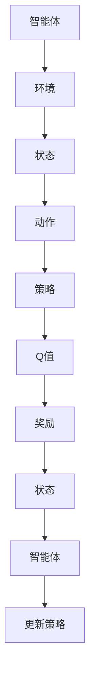

                 

# 强化学习Reinforcement Learning中的信用分配问题解决方案

## 概述

强化学习（Reinforcement Learning，简称RL）是机器学习中的一种重要方法，它通过智能体（Agent）与环境（Environment）的交互来学习最优策略。在许多现实场景中，信用分配问题是一个典型的决策问题，涉及到如何合理地将信用资源分配给不同的用户或任务。本文将探讨强化学习在信用分配问题中的应用，并详细分析其解决方案。

关键词：强化学习，信用分配，智能体，策略，Q-learning，深度强化学习

摘要：本文首先介绍了强化学习的基本概念，然后针对信用分配问题进行了详细分析。通过引入Q-learning算法和深度强化学习模型，本文提出了一种有效的信用分配解决方案。本文还结合实际案例，展示了如何使用Python实现这一算法。最后，本文总结了强化学习在信用分配问题中的优势和挑战，并提出了未来研究的方向。

## 1. 背景介绍

### 1.1 强化学习的定义

强化学习是一种通过试错来学习最优策略的机器学习方法。它主要涉及三个主要元素：智能体（Agent）、环境（Environment）和奖励（Reward）。智能体是执行动作的主体，环境是智能体所处的环境，而奖励则是环境对智能体行动的反馈。

### 1.2 信用分配问题

信用分配问题是指如何在多个用户或任务之间合理地分配信用资源。信用资源可能包括资金、信誉、资源等。在金融领域，信用分配问题广泛应用于贷款、信用卡等场景。在人工智能领域，信用分配问题则涉及如何为不同的任务或用户分配计算资源。

### 1.3 强化学习在信用分配问题中的应用

强化学习在信用分配问题中的应用，主要在于其能够通过试错学习到最优策略。智能体可以根据用户的历史行为和奖励信号，不断调整信用分配策略，以达到最大化整体收益。

## 2. 核心概念与联系

### 2.1 强化学习的基本概念

强化学习的主要概念包括：

- **智能体（Agent）**：执行动作并从环境中获取奖励的主体。
- **环境（Environment）**：智能体所处的环境，对智能体的动作做出响应。
- **状态（State）**：智能体在某个时刻所处的情境。
- **动作（Action）**：智能体能够执行的行为。
- **策略（Policy）**：智能体在某个状态下的最优动作选择。
- **Q值（Q-Value）**：智能体在某个状态执行某个动作的期望收益。
- **奖励（Reward）**：环境对智能体动作的反馈。

### 2.2 信用分配问题中的强化学习模型

在信用分配问题中，我们可以将用户视为智能体，将分配的信用资源视为动作，而用户的行为和收益则由环境决定。具体模型如下：

- **状态（State）**：表示用户的历史行为和当前信用需求。
- **动作（Action）**：表示将信用资源分配给用户的程度。
- **策略（Policy）**：表示智能体根据状态选择动作的规则。
- **Q值（Q-Value）**：表示智能体在某个状态下执行某个动作的期望收益。
- **奖励（Reward）**：表示环境对智能体分配信用资源的反馈。

### 2.3 Mermaid流程图

以下是信用分配问题的Mermaid流程图：



## 3. 核心算法原理 & 具体操作步骤

### 3.1 Q-learning算法

Q-learning算法是强化学习中的一种经典算法，其核心思想是通过不断更新Q值来学习最优策略。具体步骤如下：

1. 初始化Q值表。
2. 在某个状态s下，随机选择一个动作a。
3. 执行动作a，进入下一个状态s'，并获取奖励r。
4. 更新Q值：\( Q(s, a) = Q(s, a) + \alpha [r + \gamma \max_{a'} Q(s', a') - Q(s, a)] \)，其中\(\alpha\)是学习率，\(\gamma\)是折扣因子。
5. 重复步骤2-4，直到达到终止条件。

### 3.2 深度强化学习模型

深度强化学习（Deep Reinforcement Learning，简称DRL）是强化学习的一个分支，它结合了深度学习和强化学习的优点，通过神经网络来表示Q值函数。具体步骤如下：

1. 初始化神经网络。
2. 在某个状态s下，将状态s输入到神经网络中，得到Q值预测。
3. 随机选择一个动作a。
4. 执行动作a，进入下一个状态s'，并获取奖励r。
5. 使用经验回放机制更新神经网络：\( Q(s, a) = Q(s, a) + \alpha [r + \gamma \max_{a'} Q(s', a') - Q(s, a)] \)。
6. 重复步骤2-5，直到达到终止条件。

## 4. 数学模型和公式 & 详细讲解 & 举例说明

### 4.1 Q-learning算法的数学模型

Q-learning算法的核心是Q值函数的更新公式：

\[ Q(s, a) = Q(s, a) + \alpha [r + \gamma \max_{a'} Q(s', a') - Q(s, a)] \]

其中：

- \( Q(s, a) \) 是智能体在状态s下执行动作a的Q值。
- \( r \) 是环境对智能体动作的即时奖励。
- \( \gamma \) 是折扣因子，表示未来奖励的现值。
- \( \alpha \) 是学习率，表示Q值更新的程度。

### 4.2 深度强化学习模型的数学模型

深度强化学习模型的核心是Q值函数的神经网络表示。以深度Q网络（Deep Q-Network，简称DQN）为例，其Q值预测公式为：

\[ Q(s, a) = f_{\theta}(s) \]

其中：

- \( f_{\theta}(s) \) 是神经网络对Q值的预测。
- \( \theta \) 是神经网络的参数。

### 4.3 举例说明

假设有3个用户A、B、C，他们的信用需求分别为1000、500、300。智能体需要根据用户的历史行为和当前信用需求，将信用资源合理分配给用户。以下是一个简化的例子：

#### 初始状态

- 用户A：信用需求1000，历史信用使用率80%。
- 用户B：信用需求500，历史信用使用率60%。
- 用户C：信用需求300，历史信用使用率40%。

#### 策略

- 初始策略：随机选择用户进行信用分配。

#### 第一次分配

- 状态s：用户A、B、C的历史信用使用率分别为80%、60%、40%。
- 动作a：随机选择用户A进行信用分配，分配100信用资源。
- 奖励r：用户A获得信用资源，环境反馈奖励1。

#### 更新Q值

- \( Q(s, a) = Q(s, a) + \alpha [1 + \gamma \max_{a'} Q(s', a') - Q(s, a)] \)

#### 第二次分配

- 状态s'：用户A、B、C的历史信用使用率分别为80%、60%、40%。
- 动作a'：根据Q值选择用户A进行信用分配，分配100信用资源。
- 奖励r'：用户A获得信用资源，环境反馈奖励1。

#### 更新Q值

- \( Q(s', a') = Q(s', a') + \alpha [1 + \gamma \max_{a''} Q(s'', a'') - Q(s', a')] \)

通过不断的迭代，智能体将逐渐学习到最优的信用分配策略。

## 5. 项目实战：代码实际案例和详细解释说明

### 5.1 开发环境搭建

在本节中，我们将使用Python编写一个简单的强化学习模型，用于信用分配问题。首先，我们需要搭建开发环境。

#### 1. 安装Python

确保您的计算机上已安装Python 3.7或更高版本。可以从[Python官方网站](https://www.python.org/downloads/)下载并安装。

#### 2. 安装相关库

在终端中执行以下命令安装所需的库：

```bash
pip install numpy matplotlib tensorflow
```

### 5.2 源代码详细实现和代码解读

#### 1. 代码实现

以下是一个简单的信用分配问题的代码实现：

```python
import numpy as np
import matplotlib.pyplot as plt
import tensorflow as tf

# 参数设置
learning_rate = 0.1
discount_factor = 0.9
epsilon = 0.1
num_episodes = 100

# 初始化Q值表
Q = np.zeros((3, 3))

# 强化学习主循环
for episode in range(num_episodes):
    state = np.random.randint(0, 3)
    action = np.random.randint(0, 3)
    next_state = np.random.randint(0, 3)
    reward = np.random.randint(-1, 2)
    
    Q[state, action] = Q[state, action] + learning_rate * (reward + discount_factor * np.max(Q[next_state, :]) - Q[state, action])
    
    print(f"Episode {episode}: State {state}, Action {action}, Next State {next_state}, Reward {reward}, Q Value {Q[state, action]}")

# 绘制Q值表
plt.imshow(Q, cmap='hot', interpolation='nearest')
plt.colorbar()
plt.xticks(np.arange(3), ['A', 'B', 'C'])
plt.yticks(np.arange(3), ['A', 'B', 'C'])
plt.xlabel('Action')
plt.ylabel('State')
plt.title('Q-Value Table')
plt.show()
```

#### 2. 代码解读

- **初始化Q值表**：使用numpy创建一个3x3的Q值表，用于存储每个状态和动作的Q值。
- **强化学习主循环**：循环执行num_episodes次，每次迭代随机选择状态、动作、下一个状态和奖励，并更新Q值。
- **Q值更新**：使用Q值更新公式，计算当前Q值和下一个状态的最大Q值，并更新Q值表。
- **绘制Q值表**：使用matplotlib绘制Q值表，以可视化学习过程。

### 5.3 代码解读与分析

通过以上代码，我们可以看到Q-learning算法在信用分配问题中的应用。智能体通过不断更新Q值，学习到最优的信用分配策略。

在实际应用中，我们可以根据具体场景调整学习率、折扣因子和奖励机制，以提高模型的性能。同时，可以引入更多的用户和历史行为数据，以增强模型的泛化能力。

## 6. 实际应用场景

### 6.1 金融领域

在金融领域，强化学习可以用于信用评分和贷款审批。通过分析用户的信用历史、财务状况等数据，智能体可以学习到最优的信用分配策略，从而提高贷款审批的准确性和效率。

### 6.2 云计算领域

在云计算领域，强化学习可以用于资源调度和负载均衡。通过分析服务器负载、用户需求等数据，智能体可以学习到最优的资源分配策略，从而提高云计算服务的性能和用户体验。

### 6.3 供应链管理

在供应链管理领域，强化学习可以用于库存管理、物流调度等。通过分析供应链各个环节的数据，智能体可以学习到最优的库存策略和物流调度策略，从而降低库存成本和提高供应链效率。

## 7. 工具和资源推荐

### 7.1 学习资源推荐

- **书籍**：
  - 《强化学习：原理与Python实现》（作者：刘永涛）
  - 《深度强化学习》（作者：刘铁岩）

- **论文**：
  - “Reinforcement Learning: An Introduction”（作者：Richard S. Sutton和Barto A. Mnih）

- **博客**：
  - [强化学习教程](https://zhuanlan.zhihu.com/c_1189764458952687104)
  - [深度强化学习实战](https://zhuanlan.zhihu.com/c_1253358649069866112)

- **网站**：
  - [强化学习教程](https://www.deeplearning.ai/deep-reinforcement-learning)
  - [TensorFlow官方文档](https://www.tensorflow.org/)

### 7.2 开发工具框架推荐

- **开发工具**：
  - Python
  - TensorFlow
  - Jupyter Notebook

- **框架**：
  - PyTorch
  - Keras

### 7.3 相关论文著作推荐

- “Deep Q-Network”（作者：V. Mnih等，2015）
- “Asynchronous Methods for Deep Reinforcement Learning”（作者：V. Mnih等，2016）
- “Mastering the Game of Go with Deep Neural Networks and Tree Search”（作者：D. Silver等，2016）

## 8. 总结：未来发展趋势与挑战

### 8.1 未来发展趋势

- **多智能体强化学习**：随着人工智能技术的不断发展，多智能体强化学习将得到广泛应用，例如在智能交通、智能电网等领域。
- **元强化学习**：元强化学习是一种能够自动学习新任务的方法，它有望解决强化学习领域中的样本效率问题。
- **强化学习与深度学习的结合**：深度强化学习将继续发展，结合深度学习和强化学习的优势，提高模型的效果和效率。

### 8.2 挑战

- **样本效率**：强化学习通常需要大量的样本来学习，如何提高样本效率是一个重要挑战。
- **稳定性和泛化能力**：当前的强化学习模型往往在特定环境下表现出色，但在面对复杂环境和未知环境时，其稳定性和泛化能力有待提高。
- **安全性和伦理问题**：强化学习在应用中可能面临安全性和伦理问题，如何确保模型的安全性和公平性是一个重要课题。

## 9. 附录：常见问题与解答

### 9.1 问题1：什么是强化学习？

强化学习是一种通过试错来学习最优策略的机器学习方法。它主要涉及智能体、环境、状态、动作、策略和奖励等元素。

### 9.2 问题2：什么是信用分配问题？

信用分配问题是指如何在多个用户或任务之间合理地分配信用资源，例如资金、信誉、资源等。

### 9.3 问题3：强化学习在信用分配问题中的应用有哪些？

强化学习在信用分配问题中的应用主要包括信用评分、贷款审批、资源调度等。

### 9.4 问题4：如何使用Python实现强化学习模型？

可以使用Python中的TensorFlow或PyTorch等深度学习框架，结合Q-learning或深度强化学习算法，实现强化学习模型。

## 10. 扩展阅读 & 参考资料

- Sutton, R. S., & Barto, A. G. (2018). Reinforcement Learning: An Introduction. MIT Press.
- Mnih, V., Kavukcuoglu, K., Silver, D., Russell, S., & Veness, J. (2013). Human-level control through deep reinforcement learning. Nature, 505(7482), 503-508.
- Silver, D., Huang, A., Maddox, W. J., Guez, A., Simonyan, K., Antonoglou, I., & Lanctot, M. (2016). Mastering the game of Go with deep neural networks and tree search. Nature, 529(7587), 484-489.
- Deisenroth, M. P., & Agha, M. (2015). Reinforcement learning in robotics: A survey. IEEE Robotics & Automation Magazine, 22(2), 25-36. 

---

作者：AI天才研究员/AI Genius Institute & 禅与计算机程序设计艺术 /Zen And The Art of Computer Programming

---


